                 

# 聊天机器人人力资源：招聘和员工管理

> 关键词：聊天机器人,人力资源管理,招聘,员工管理,自然语言处理(NLP),人工智能,就业市场,机器学习,人才管理

## 1. 背景介绍

### 1.1 问题由来

在现代企业中，人力资源管理（HRM）是一个关键的职能，它涵盖了招聘、员工关系、绩效管理、培训和发展等多个方面。传统的人力资源管理方法大多依赖于人工操作，流程复杂、效率低下、难以标准化。随着人工智能（AI）技术的迅速发展，特别是自然语言处理（NLP）和机器学习（ML）的应用，聊天机器人成为了一个非常有前景的工具，它可以帮助企业更高效、更智能地进行人力资源管理。

## 2. 核心概念与联系

### 2.1 核心概念概述

在本文中，我们将介绍几个关键概念：

- **聊天机器人（Chatbot）**：一种能够模拟人类对话的计算机程序，基于NLP技术实现，能够理解并生成自然语言。
- **人力资源管理（HRM）**：涉及招聘、员工关系、绩效管理、培训和发展等多个方面的管理。
- **招聘（Recruitment）**：寻找、吸引和选拔合适的人选加入公司。
- **员工管理（Employee Management）**：管理员工的工作表现、职业发展、薪资福利等。

这些概念之间存在密切的联系。聊天机器人可以自动化许多人力资源管理任务，如筛选简历、回答应聘者问题、管理员工关系等。其核心原理是基于机器学习和大数据技术，对人力资源管理进行智能化和自动化的处理。

### 2.2 核心概念原理和架构的 Mermaid 流程图

```mermaid
graph LR
    A[聊天机器人] --> B[招聘]
    A --> C[员工管理]
    B --> D[简历筛选]
    B --> E[面试管理]
    C --> F[员工绩效]
    C --> G[员工培训]
    D --> H[候选人推荐]
    E --> I[面试安排]
    F --> J[绩效评估]
    G --> K[职业发展]
    H --> L[候选人审核]
    I --> M[面试反馈]
    J --> N[绩效改进]
    K --> O[培训反馈]
    L --> P[候选人筛选]
    M --> Q[反馈总结]
    N --> R[绩效优化]
    O --> S[培训计划]
    P --> T[候选人评估]
    Q --> U[反馈分析]
    R --> V[绩效提升]
    S --> W[培训效果]
    T --> X[应聘流程]
    U --> Y[分析总结]
    V --> Z[绩效改进]
    W --> AA[培训质量]
    X --> BB[应聘流程优化]
    Y --> CC[应聘流程优化]
    Z --> DD[绩效优化]
    AA --> EE[培训质量提升]
    BB --> FF[应聘流程优化]
    CC --> GG[应聘流程优化]
    DD --> HH[绩效优化]
    EE --> II[培训质量提升]
    FF --> JJ[应聘流程优化]
    GG --> KK[应聘流程优化]
    HH --> LL[绩效优化]
    II --> MM[培训质量提升]
    JJ --> NN[应聘流程优化]
    KK --> OO[应聘流程优化]
    LL --> PP[绩效优化]
    MM --> QQ[培训质量提升]
    NN --> RR[应聘流程优化]
    OO --> SS[应聘流程优化]
    PP --> TT[绩效优化]
    QQ --> UU[培训质量提升]
    RR --> VV[应聘流程优化]
    SS --> WW[应聘流程优化]
    TT --> XX[绩效优化]
    UU --> YY[培训质量提升]
    VV --> ZZ[应聘流程优化]
    WW --> AAA[应聘流程优化]
    XX --> BBB[应聘流程优化]
    YY --> CCC[应聘流程优化]
    ZZ --> DDD[绩效优化]
    AAA --> EEE[应聘流程优化]
    BBB --> FFF[应聘流程优化]
    CCC --> GGG[应聘流程优化]
    DDD --> HHH[绩效优化]
    EEE --> III[应聘流程优化]
    FFF --> JJJ[应聘流程优化]
    GGG --> KKK[应聘流程优化]
    HHH --> LLL[绩效优化]
    III --> MMI[应聘流程优化]
    JJJ --> NNJ[应聘流程优化]
    KKK --> OOO[应聘流程优化]
    LLL --> PPL[绩效优化]
    MMI --> QQQ[应聘流程优化]
    NNJ --> RRR[应聘流程优化]
    OOO --> SSS[应聘流程优化]
    PPL --> TTT[绩效优化]
    QQQ --> UUU[应聘流程优化]
    RRR --> VVV[应聘流程优化]
    SSS --> WWW[应聘流程优化]
    TTT --> XXX[绩效优化]
    UUU --> YYY[应聘流程优化]
    VVV --> ZZZ[应聘流程优化]
    WWW --> AAA[应聘流程优化]
    XXX --> BBB[应聘流程优化]
    YYY --> CCC[应聘流程优化]
    ZZZ --> DDD[绩效优化]
```



这个流程图展示了聊天机器人如何融入人力资源管理的各个环节。聊天机器人可以在简历筛选、面试管理、员工绩效管理、培训和发展等多个方面提供支持。

## 3. 核心算法原理 & 具体操作步骤

### 3.1 算法原理概述

聊天机器人的人力资源管理主要基于自然语言处理（NLP）和机器学习（ML）技术。其核心算法包括：

- **自然语言理解（NLU）**：解析用户输入的自然语言，理解其意图和内容。
- **知识图谱（KG）**：构建和查询知识图谱，用于存储和管理招聘信息、员工档案、绩效数据等。
- **机器学习（ML）**：使用监督学习和强化学习等算法，不断优化聊天机器人的回答和决策。

聊天机器人的主要任务包括：

- **招聘管理**：筛选简历、安排面试、反馈面试结果等。
- **员工关系管理**：回答员工问题、管理员工关系、解决员工问题等。
- **绩效管理**：评估员工绩效、提供绩效反馈、优化绩效管理流程等。

### 3.2 算法步骤详解

以下是聊天机器人人力资源管理的详细操作步骤：

**Step 1: 数据准备**
- 收集简历、员工档案、绩效数据等数据，进行预处理和清洗。
- 构建知识图谱，存储和查询招聘信息和员工档案。

**Step 2: 模型训练**
- 使用NLU模型解析用户输入的自然语言，理解其意图和内容。
- 使用机器学习算法优化聊天机器人的回答和决策。
- 不断迭代训练模型，提高其准确性和自然度。

**Step 3: 聊天机器人部署**
- 将训练好的聊天机器人部署到HRM系统中，集成到招聘、员工管理等模块。
- 通过API接口与HRM系统进行数据交换和调用。

**Step 4: 用户交互**
- 用户通过自然语言向聊天机器人提出问题，如简历筛选、面试安排等。
- 聊天机器人理解用户意图，根据知识图谱和ML模型给出回答。
- 聊天机器人记录用户反馈，不断优化回答。

**Step 5: 效果评估**
- 定期评估聊天机器人的效果，如用户满意度、准确率、处理效率等。
- 根据评估结果优化模型和算法，提升聊天机器人的性能。

### 3.3 算法优缺点

聊天机器人人力资源管理的优点包括：

- **自动化和效率提升**：可以自动处理大量数据，提升招聘、员工管理的效率。
- **全天候服务**：可以24/7提供服务，随时回答员工问题，提升员工满意度。
- **个性化服务**：可以根据员工特点和需求，提供个性化的建议和服务。

缺点包括：

- **准确性和鲁棒性**：聊天机器人对自然语言的理解可能存在误差，影响决策的准确性。
- **数据隐私和安全**：处理大量员工数据，需要严格保护数据隐私和安全。
- **维护和更新**：需要定期维护和更新模型和知识图谱，保证系统的稳定和可靠。

### 3.4 算法应用领域

聊天机器人人力资源管理在多个领域有广泛的应用，包括但不限于：

- **招聘管理**：简历筛选、面试安排、反馈面试结果等。
- **员工关系管理**：回答员工问题、解决员工问题、管理员工关系等。
- **绩效管理**：评估员工绩效、提供绩效反馈、优化绩效管理流程等。
- **培训和发展**：管理培训计划、提供培训建议、评估培训效果等。

## 4. 数学模型和公式 & 详细讲解 & 举例说明

### 4.1 数学模型构建

聊天机器人人力资源管理的数学模型主要涉及自然语言处理（NLP）、机器学习（ML）和知识图谱（KG）。

**自然语言处理（NLP）**：
- **分词**：将文本分割成词语，如分词模型Word2Vec。
- **词向量表示**：将词语表示为向量，如Word2Vec、GloVe。
- **句法分析**：分析句子的语法结构，如依存句法分析。
- **语义理解**：理解句子的语义，如BERT、GPT。

**机器学习（ML）**：
- **监督学习**：使用标记数据训练模型，如线性回归、逻辑回归、支持向量机。
- **无监督学习**：使用无标记数据训练模型，如聚类、降维、关联规则。
- **强化学习**：通过与环境的交互，学习最优策略，如Q-learning、SARSA。

**知识图谱（KG）**：
- **实体识别**：识别实体及其关系，如命名实体识别（NER）。
- **关系抽取**：从文本中抽取实体之间的关系，如关系抽取（RE）。
- **图嵌入**：将实体和关系表示为向量，如TransE、GCN。

### 4.2 公式推导过程

以招聘管理为例，展示如何使用机器学习算法进行简历筛选。

**输入**：招聘职位描述、简历内容。
**输出**：筛选出的简历列表。

假设招聘职位描述为 $D$，简历内容为 $R$。则招聘模型的目标函数为：

$$
\min_{\theta} \sum_{i=1}^N \mathcal{L}(D_i, R_i)
$$

其中 $\theta$ 为模型参数，$\mathcal{L}$ 为损失函数，$N$ 为招聘职位数。

**目标**：最大化简历与职位描述的相似度。

**步骤**：
1. 使用自然语言处理技术将职位描述 $D_i$ 和简历 $R_i$ 转换为向量表示。
2. 计算简历与职位描述的相似度，如余弦相似度。
3. 根据相似度排序，选择最符合条件的简历。

**公式**：

$$
\text{similarity}(D_i, R_i) = \frac{\sum_{j=1}^d D_{ij} \cdot R_{ij}}{\sqrt{\sum_{j=1}^d D_{ij}^2} \cdot \sqrt{\sum_{j=1}^d R_{ij}^2}}
$$

其中 $D_{ij}$ 和 $R_{ij}$ 分别为职位描述和简历的向量表示。

### 4.3 案例分析与讲解

假设某公司的招聘职位为软件工程师，简历内容为：

```
John Doe，软件工程师，具有5年开发经验，熟练掌握Java和Python，曾参与多个大型项目。
```

将其转换为向量表示，可以使用Word2Vec模型：

```
[John, Doe, software, engineer, 5, years, experience, master, Java, Python, large, project]
```

将其与职位描述进行相似度计算，可以得到：

$$
\text{similarity}(D, R) = \frac{1+1+1+1+1+1+1}{\sqrt{6} \cdot \sqrt{12}} = 0.57
$$

因此，该简历与职位描述的相似度为0.57，可以进一步进行筛选和评估。

## 5. 项目实践：代码实例和详细解释说明

### 5.1 开发环境搭建

要在Python中使用聊天机器人进行人力资源管理，需要安装以下工具和库：

1. **Python**：安装Python 3.6及以上版本。
2. **PyTorch**：用于深度学习和自然语言处理。
3. **NLTK**：用于自然语言处理，如分词、词性标注。
4. **TensorFlow**：用于构建和训练机器学习模型。
5. **Keras**：用于构建和训练神经网络模型。
6. **Flask**：用于构建聊天机器人API接口。
7. **MySQL**：用于存储和管理招聘、员工档案等数据。

使用以下命令安装相关库：

```
pip install torch nltk tensorflow keras flask mysql-connector-python
```

### 5.2 源代码详细实现

以下是使用PyTorch和Flask实现聊天机器人招聘管理的代码示例：

```python
import torch
import torch.nn as nn
import torch.optim as optim
import nltk
from nltk.tokenize import word_tokenize
from nltk.corpus import stopwords
from sklearn.feature_extraction.text import TfidfVectorizer
from sklearn.metrics.pairwise import cosine_similarity
from flask import Flask, request

# 定义模型
class BERTEmbedding(nn.Module):
    def __init__(self, emb_dim):
        super(BERTEmbedding, self).__init__()
        self.emb_dim = emb_dim
        self.bert = BertModel.from_pretrained('bert-base-uncased')
        
    def forward(self, x):
        x = self.bert(x)
        return x[:, 0, :]

# 加载数据
def load_data():
    data = []
    with open('resume.txt', 'r') as f:
        for line in f:
            data.append(line.strip())
    return data

# 预处理数据
def preprocess(data):
    stop_words = set(stopwords.words('english'))
    res = []
    for doc in data:
        tokens = word_tokenize(doc)
        filtered_tokens = [token.lower() for token in tokens if token not in stop_words]
        res.append(' '.join(filtered_tokens))
    return res

# 加载模型
def load_model():
    model = BERTEmbedding(300)
    model.load_state_dict(torch.load('model.pt'))
    model.eval()
    return model

# 计算相似度
def compute_similarity(model, x, y):
    x = model(x)
    y = model(y)
    return cosine_similarity(x, y)

# 应用模型
def apply_model(model, x):
    x = model(x)
    return x

# 构建Flask应用
app = Flask(__name__)

@app.route('/predict', methods=['POST'])
def predict():
    data = request.get_json()
    x = data['input']
    y = load_model()
    similarity = compute_similarity(y, x)
    return {'result': similarity}

if __name__ == '__main__':
    app.run(debug=True)
```

这个代码示例展示了如何使用BERT模型计算简历与职位描述的相似度。具体步骤如下：

1. 定义BERT嵌入模型。
2. 加载数据并预处理。
3. 加载模型并进行相似度计算。
4. 构建Flask应用，接受API请求并返回相似度结果。

### 5.3 代码解读与分析

这个代码示例中，我们使用了BERT模型进行文本嵌入，并计算简历与职位描述的余弦相似度。代码的核心部分包括：

- `BERTEmbedding`类：定义了BERT嵌入模型，用于将文本转换为向量表示。
- `load_data`函数：从文件中加载简历数据。
- `preprocess`函数：对简历数据进行预处理，去除停用词。
- `load_model`函数：加载预训练的BERT模型。
- `compute_similarity`函数：计算简历与职位描述的余弦相似度。
- `apply_model`函数：应用模型计算相似度。
- `predict`函数：接收API请求，调用模型计算相似度，并返回结果。

## 6. 实际应用场景

### 6.1 招聘场景

在招聘场景中，聊天机器人可以自动筛选简历，匹配合适的候选人。具体流程如下：

1. **简历输入**：用户上传简历。
2. **文本预处理**：将简历转换为向量表示。
3. **相似度计算**：计算简历与职位描述的相似度。
4. **候选人推荐**：根据相似度排序，推荐最符合条件的候选人。

### 6.2 员工关系管理

在员工关系管理场景中，聊天机器人可以回答员工问题，解决员工问题。具体流程如下：

1. **员工问题输入**：员工提交问题。
2. **文本预处理**：将问题转换为向量表示。
3. **相似度计算**：计算问题与知识图谱中问题的相似度。
4. **回答问题**：根据相似度推荐答案，并回答员工问题。

### 6.3 绩效管理

在绩效管理场景中，聊天机器人可以评估员工绩效，提供绩效反馈。具体流程如下：

1. **绩效输入**：员工提交绩效数据。
2. **文本预处理**：将绩效数据转换为向量表示。
3. **相似度计算**：计算绩效数据与知识图谱中绩效数据的相似度。
4. **绩效评估**：根据相似度评估绩效，并提供反馈。

### 6.4 未来应用展望

未来，聊天机器人将在人力资源管理中扮演更加重要的角色。随着技术的不断进步，聊天机器人将具备以下特点：

- **更高的准确性和自然度**：通过更先进的自然语言处理技术，提升聊天机器人的理解和表达能力。
- **更好的用户体验**：提供更加个性化的服务和更自然的人机交互方式。
- **更强的数据隐私保护**：严格保护员工数据，确保数据安全和隐私。

## 7. 工具和资源推荐

### 7.1 学习资源推荐

为了帮助开发者掌握聊天机器人技术，这里推荐一些学习资源：

1. **自然语言处理与深度学习**：斯坦福大学开设的课程，涵盖NLP和深度学习的基础知识。
2. **机器学习实战**：Python数据科学手册，介绍机器学习算法和实现方法。
3. **TensorFlow官方文档**：TensorFlow的官方文档，提供丰富的教程和示例。
4. **PyTorch官方文档**：PyTorch的官方文档，提供详细的API接口和示例代码。
5. **Flask官方文档**：Flask的官方文档，提供详细的API接口和示例代码。

### 7.2 开发工具推荐

为了帮助开发者快速搭建和调试聊天机器人，这里推荐一些开发工具：

1. **Jupyter Notebook**：用于编写和调试代码，支持Python和R语言。
2. **TensorBoard**：用于可视化模型训练过程，提供详细的图表和分析工具。
3. **NLTK**：用于自然语言处理，如分词、词性标注。
4. **Spacy**：用于自然语言处理，如实体识别、关系抽取。
5. **PyTorch**：用于深度学习和自然语言处理。
6. **TensorFlow**：用于构建和训练机器学习模型。

### 7.3 相关论文推荐

为了帮助开发者了解聊天机器人技术的研究现状和未来趋势，这里推荐一些相关论文：

1. **Attention is All You Need**：Transformer论文，提出自注意力机制。
2. **BERT: Pre-training of Deep Bidirectional Transformers for Language Understanding**：BERT论文，提出预训练语言模型。
3. **GPT-2: Language Models are Unsupervised Multitask Learners**：GPT-2论文，提出大规模语言模型。
4. **Transformer-XL: Attentive Language Models Beyond a Fixed-Length Context**：Transformer-XL论文，提出长序列建模。
5. **SparkNLP: A Natural Language Processing Toolkit for Python**：SparkNLP论文，提出NLP工具包。

## 8. 总结：未来发展趋势与挑战

### 8.1 研究成果总结

本文介绍了聊天机器人人力资源管理的技术原理和应用场景，展示了其在招聘、员工关系管理、绩效管理等方面的潜力。通过自然语言处理和机器学习技术，聊天机器人可以自动化处理大量数据，提升人力资源管理的效率和效果。

### 8.2 未来发展趋势

未来，聊天机器人将具备以下发展趋势：

- **更先进的技术**：通过更先进的自然语言处理和机器学习技术，提升聊天机器人的理解和表达能力。
- **更广泛的应用**：在更多领域和场景中应用，如医疗、教育、金融等。
- **更高的效率和准确性**：通过更高效的数据处理和更精确的模型训练，提升聊天机器人的效率和准确性。

### 8.3 面临的挑战

尽管聊天机器人技术在人力资源管理中取得了显著进展，但仍面临以下挑战：

- **数据隐私和安全**：处理大量员工数据，需要严格保护数据隐私和安全。
- **模型的可解释性**：聊天机器人决策过程的透明性和可解释性需要进一步提升。
- **算法的鲁棒性**：聊天机器人面对噪声和异常数据时，需要具备更强的鲁棒性。
- **多语言的适应性**：聊天机器人需要适应多语言环境，提供多语言支持。

### 8.4 研究展望

为了解决上述挑战，未来的研究需要集中在以下几个方面：

- **隐私保护技术**：开发更先进的数据加密和隐私保护技术，确保数据安全和隐私。
- **可解释性算法**：开发更可解释的机器学习算法，提升模型的透明性和可解释性。
- **鲁棒性算法**：开发更鲁棒的机器学习算法，提高聊天机器人的鲁棒性。
- **多语言支持**：开发支持多语言的环境和算法，提供多语言支持。

总之，聊天机器人技术在人力资源管理中具有广阔的应用前景。通过不断优化技术和算法，提升聊天机器人的效率和效果，可以更好地服务于企业人力资源管理，提升员工满意度和企业绩效。

## 9. 附录：常见问题与解答

**Q1：如何提升聊天机器人的自然度？**

A: 提升聊天机器人的自然度需要从多个方面入手，如数据预处理、模型训练、后处理等。具体方法包括：

1. **数据预处理**：使用更先进的自然语言处理技术，如BERT、GPT等预训练模型，提升模型的语言理解能力。
2. **模型训练**：使用更多的数据进行训练，提高模型的泛化能力和自然度。
3. **后处理**：使用更自然的语言处理技术，如回译、近义替换等，优化回答的自然度。

**Q2：如何优化聊天机器人的性能？**

A: 优化聊天机器人的性能需要从多个方面入手，如模型选择、数据预处理、模型训练等。具体方法包括：

1. **模型选择**：选择更先进的自然语言处理和机器学习模型，如BERT、GPT等。
2. **数据预处理**：使用更先进的自然语言处理技术，如分词、词性标注等，提升模型的理解能力。
3. **模型训练**：使用更多的数据进行训练，提高模型的泛化能力和准确性。

**Q3：聊天机器人如何处理多语言环境？**

A: 处理多语言环境需要开发支持多语言的环境和算法，具体方法包括：

1. **多语言支持**：使用支持多语言的工具和库，如spaCy、NLTK等。
2. **多语言训练**：使用多语言数据进行训练，提升模型在多语言环境中的表现。
3. **多语言模型**：开发支持多语言的语言模型，如多语言BERT、mBART等。

总之，聊天机器人技术在人力资源管理中具有广阔的应用前景。通过不断优化技术和算法，提升聊天机器人的效率和效果，可以更好地服务于企业人力资源管理，提升员工满意度和企业绩效。

---

作者：禅与计算机程序设计艺术 / Zen and the Art of Computer Programming

