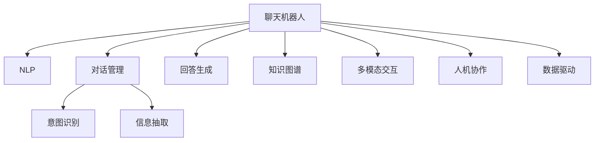

                 

# 聊天机器人：AI如何提升客户服务效率

> 关键词：
  - 聊天机器人
  - 自然语言处理（NLP）
  - 客户服务
  - 自动化
  - 个性化服务
  - 多模态交互
  - 人机协作

## 1. 背景介绍

### 1.1 问题由来
随着互联网技术的普及和电子商务的快速发展，企业的客户服务面临着前所未有的挑战。消费者期望获得快速、准确、个性化的服务体验，传统的人工客服模式难以满足这些需求。为了提高客户服务效率，企业开始探索利用AI技术来构建智能聊天机器人，以自动化、智能化地处理客户咨询。

### 1.2 问题核心关键点
聊天机器人在客户服务中的应用，主要是通过自然语言处理（NLP）技术，对客户的自然语言输入进行理解、处理和响应。其核心关键点包括：

- 对话管理：构建对话流程，管理对话状态，引导用户完成任务。
- 意图识别：理解用户的意图，根据意图匹配相应的服务和回答。
- 信息抽取：从用户输入中抽取关键信息，如产品名称、服务请求等。
- 回答生成：根据用户意图和信息抽取结果，生成自然流畅的回答。
- 知识图谱：整合企业内部知识库，辅助机器理解复杂业务逻辑。
- 用户交互：通过多模态交互，如文字、语音、图片等，提供更加丰富的服务体验。

这些核心功能共同构成了聊天机器人的核心架构，使其能够高效地处理客户服务流程。

### 1.3 问题研究意义
聊天机器人在客户服务中的应用，不仅能够显著提高服务效率，还能降低企业的运营成本，提升客户满意度。研究如何构建高效、智能的聊天机器人，具有重要的理论和实践意义：

1. **降低成本**：自动化的聊天机器人可以24/7全天候提供服务，无需支付高昂的人工客服费用。
2. **提升效率**：聊天机器人可以快速响应客户咨询，处理大量重复性问题，减轻人工客服的工作负担。
3. **个性化服务**：通过分析用户历史行为和偏好，聊天机器人能够提供更加个性化的服务，提升用户粘性。
4. **多模态交互**：结合语音、图片等多模态信息，聊天机器人能够提供更加丰富的用户体验。
5. **人机协作**：当聊天机器人无法处理复杂问题时，可以智能转接至人工客服，实现人机协作，提升服务质量。
6. **数据驱动**：通过分析用户交互数据，企业可以不断优化服务策略，提升整体服务水平。

## 2. 核心概念与联系

### 2.1 核心概念概述

为更好地理解聊天机器人在客户服务中的应用，本节将介绍几个密切相关的核心概念：

- **聊天机器人（Chatbot）**：通过NLP技术，模拟人类对话，实现自动化的客户服务。
- **自然语言处理（NLP）**：研究计算机如何理解、处理和生成人类语言的技术。
- **对话管理（Dialog Management）**：构建对话流程，管理对话状态，引导用户完成任务。
- **意图识别（Intent Recognition）**：理解用户的意图，根据意图匹配相应的服务和回答。
- **信息抽取（Information Extraction）**：从用户输入中抽取关键信息，如产品名称、服务请求等。
- **回答生成（Answer Generation）**：根据用户意图和信息抽取结果，生成自然流畅的回答。
- **知识图谱（Knowledge Graph）**：整合企业内部知识库，辅助机器理解复杂业务逻辑。
- **多模态交互（Multimodal Interaction）**：结合语音、图片等多模态信息，提供更加丰富的服务体验。
- **人机协作（Human-Computer Collaboration）**：当聊天机器人无法处理复杂问题时，智能转接至人工客服，实现人机协作，提升服务质量。
- **数据驱动（Data-Driven）**：通过分析用户交互数据，不断优化服务策略，提升整体服务水平。

这些核心概念之间的逻辑关系可以通过以下Mermaid流程图来展示：



这个流程图展示了一些关键概念之间的关系：

1. 聊天机器人通过NLP技术实现自动化对话。
2. 对话管理构建对话流程，意图识别理解用户意图，信息抽取提取关键信息，回答生成生成自然回答。
3. 知识图谱辅助机器理解复杂业务逻辑，多模态交互提供丰富体验。
4. 人机协作实现复杂问题处理，数据驱动优化服务策略。

这些概念共同构成了聊天机器人的技术框架，使其能够在客户服务中发挥重要作用。

## 3. 核心算法原理 & 具体操作步骤
### 3.1 算法原理概述

聊天机器人的核心算法原理主要基于自然语言处理（NLP）技术，通过构建对话管理、意图识别、信息抽取、回答生成等模块，实现对客户输入的自然语言处理和响应。其核心算法包括：

- 对话管理算法：构建对话流程，管理对话状态，引导用户完成任务。
- 意图识别算法：理解用户的意图，根据意图匹配相应的服务和回答。
- 信息抽取算法：从用户输入中抽取关键信息，如产品名称、服务请求等。
- 回答生成算法：根据用户意图和信息抽取结果，生成自然流畅的回答。
- 知识图谱算法：整合企业内部知识库，辅助机器理解复杂业务逻辑。
- 多模态交互算法：结合语音、图片等多模态信息，提供更加丰富的服务体验。

### 3.2 算法步骤详解

基于聊天机器人的核心算法原理，其具体操作步骤主要包括以下几个关键步骤：

**Step 1: 数据准备和预处理**
- 收集客户服务历史数据，包括聊天记录、客户反馈、产品信息等。
- 对数据进行清洗、标注和分词等预处理，构建训练集和验证集。

**Step 2: 构建对话管理模块**
- 设计对话流程，定义对话状态和转换规则。
- 使用对话管理算法，实现对话状态的维护和转换。
- 设计对话引导策略，引导用户完成任务。

**Step 3: 意图识别模块构建**
- 设计意图分类模型，如基于规则的分类器、基于统计的分类器等。
- 训练意图识别模型，根据用户输入预测意图类别。
- 设计意图映射表，将意图类别映射到相应的服务或回答。

**Step 4: 信息抽取模块构建**
- 设计实体识别模型，如基于规则的识别器、基于统计的识别器等。
- 训练实体识别模型，从用户输入中提取关键实体。
- 设计实体映射表，将实体映射到相应的服务或回答。

**Step 5: 回答生成模块构建**
- 设计回答生成模型，如基于模板的生成器、基于规则的生成器等。
- 训练回答生成模型，根据意图和信息抽取结果生成回答。
- 设计回答筛选机制，选择最合适的回答。

**Step 6: 知识图谱整合**
- 构建企业内部知识图谱，整合产品信息、服务流程、业务规则等。
- 设计知识图谱查询算法，辅助机器理解复杂业务逻辑。
- 设计知识图谱推理算法，辅助机器生成更准确的回答。

**Step 7: 多模态交互模块构建**
- 设计语音识别算法，将语音转换为文本。
- 设计图像识别算法，从图片中提取关键信息。
- 设计多模态融合算法，结合语音、图片等多模态信息，提供更加丰富的服务体验。

**Step 8: 训练和优化**
- 使用训练集训练各个模块，优化模型参数。
- 在验证集上评估各个模块的性能，调整参数和算法。
- 实现人机协作，当聊天机器人无法处理复杂问题时，智能转接至人工客服。

**Step 9: 部署和监控**
- 将训练好的模型部署到生产环境中，实时响应客户咨询。
- 实时监控系统性能，收集用户反馈和数据，不断优化系统。

以上是聊天机器人构建和部署的一般流程。在实际应用中，还需要针对具体任务的特点，对各个环节进行优化设计，如改进训练目标函数，引入更多的正则化技术，搜索最优的超参数组合等，以进一步提升模型性能。

### 3.3 算法优缺点

聊天机器人在客户服务中的应用，具有以下优点：

1. **效率提升**：自动化处理大量客户咨询，显著提高服务效率，降低人工成本。
2. **个性化服务**：通过分析用户历史行为和偏好，提供更加个性化的服务，提升用户粘性。
3. **多模态交互**：结合语音、图片等多模态信息，提供更加丰富的服务体验。
4. **数据驱动**：通过分析用户交互数据，不断优化服务策略，提升整体服务水平。
5. **灵活性**：可以根据业务需求灵活调整对话流程和回答生成策略，适应不同场景。

但聊天机器人也存在一些局限性：

1. **理解局限**：当用户输入过于复杂或包含歧义时，聊天机器人可能无法准确理解用户意图。
2. **回答质量**：回答生成算法的效果直接影响到用户满意度和问题解决率。
3. **知识图谱构建**：企业内部知识库的构建和维护需要大量资源和专业知识，可能存在数据不完整或过时的问题。
4. **系统复杂性**：聊天机器人的系统架构复杂，维护和优化难度较大。
5. **用户体验**：如果机器人处理不当，可能给用户带来困扰或不满。

尽管存在这些局限性，但通过不断优化算法和技术，聊天机器人在客户服务中的应用前景依然广阔。

### 3.4 算法应用领域

聊天机器人在客户服务中的应用，已经在多个领域得到了广泛应用，例如：

- **电商客服**：自动回答客户咨询，如产品信息、订单状态等，提升客户购买体验。
- **金融服务**：自动处理客户咨询，如账户信息查询、交易记录查询等，提升服务效率。
- **医疗咨询**：自动回答医疗问题，如症状诊断、药物信息等，辅助医生诊疗。
- **教育培训**：自动回答学习问题，如课程信息、作业解答等，提升学习效果。
- **旅游服务**：自动回答旅游问题，如行程安排、景点介绍等，提升旅游体验。

除了上述这些典型应用场景外，聊天机器人还在更多领域展现出了其强大的服务能力，为各行各业带来了新的业务模式和服务升级。

## 4. 数学模型和公式 & 详细讲解 & 举例说明

### 4.1 数学模型构建

为了更好地理解聊天机器人在客户服务中的应用，本节将使用数学语言对聊天机器人的核心算法进行严格刻画。

假设聊天机器人系统包含一个对话管理模块 $D$，一个意图识别模块 $I$，一个信息抽取模块 $E$，一个回答生成模块 $A$，以及一个知识图谱 $K$。系统接收客户输入 $x$，输出回答 $y$。聊天机器人的数学模型可以表示为：

$$
y = f(D, I, E, A, K, x)
$$

其中 $D$、$I$、$E$、$A$、$K$ 分别代表对话管理、意图识别、信息抽取、回答生成和知识图谱模块，$x$ 代表客户输入，$y$ 代表系统输出。

### 4.2 公式推导过程

以下我们以意图识别和信息抽取为例，推导其公式及其推导过程。

**意图识别（Intent Recognition）**
假设客户输入 $x = (x_1, x_2, ..., x_n)$，其中 $x_i$ 表示第 $i$ 个词。定义意图识别模块 $I$ 的输入为 $x$，输出为意图类别 $i$。假设意图识别模块 $I$ 使用神经网络模型，其输入 $x$ 经过嵌入层、隐藏层等处理后，通过softmax函数得到意图类别 $i$ 的概率分布 $P_i$。意图识别的数学模型可以表示为：

$$
P_i = \frac{\exp(f_i(x))}{\sum_j \exp(f_j(x))}
$$

其中 $f_i(x)$ 表示意图识别模块 $I$ 对输入 $x$ 的计算结果。意图识别模块 $I$ 的输出为 $\arg\max_i P_i$。

**信息抽取（Information Extraction）**
假设客户输入 $x = (x_1, x_2, ..., x_n)$，其中 $x_i$ 表示第 $i$ 个词。定义信息抽取模块 $E$ 的输入为 $x$，输出为抽取的关键实体 $e$。假设信息抽取模块 $E$ 使用神经网络模型，其输入 $x$ 经过嵌入层、隐藏层等处理后，通过softmax函数得到实体类别 $e$ 的概率分布 $P_e$。信息抽取的数学模型可以表示为：

$$
P_e = \frac{\exp(f_e(x))}{\sum_j \exp(f_j(x))}
$$

其中 $f_e(x)$ 表示信息抽取模块 $E$ 对输入 $x$ 的计算结果。信息抽取模块 $E$ 的输出为 $\arg\max_e P_e$。

### 4.3 案例分析与讲解

假设企业拥有一个电商客服系统，客户可以通过聊天界面输入咨询问题。系统接收到客户输入后，进行意图识别和信息抽取，再根据客户意图和关键信息，生成并输出回答。以下是一个具体的案例分析：

**案例：客户咨询订单状态**

客户输入：“我的订单状态如何？订单号是123456”

1. **意图识别**：意图识别模块 $I$ 对客户输入进行理解，预测意图类别为“订单状态查询”。
2. **信息抽取**：信息抽取模块 $E$ 从客户输入中抽取关键信息“订单号123456”。
3. **回答生成**：回答生成模块 $A$ 根据意图识别和信息抽取结果，生成回答“您的订单状态正在处理中，预计在5天内完成配送”。
4. **多模态交互**：如果客户选择语音输入，系统会使用语音识别算法将语音转换为文本，再进行意图识别和信息抽取。
5. **知识图谱查询**：系统可以使用知识图谱查询算法，辅助机器生成更准确的回答，如从企业内部订单系统中获取最新的订单状态信息。
6. **人机协作**：当系统无法处理复杂问题时，智能转接至人工客服，由人工客服进行进一步处理。

## 5. 项目实践：代码实例和详细解释说明

### 5.1 开发环境搭建

在进行聊天机器人开发前，我们需要准备好开发环境。以下是使用Python进行TensorFlow开发的环境配置流程：

1. 安装Anaconda：从官网下载并安装Anaconda，用于创建独立的Python环境。

2. 创建并激活虚拟环境：
```bash
conda create -n chatbot-env python=3.8 
conda activate chatbot-env
```

3. 安装TensorFlow：根据CUDA版本，从官网获取对应的安装命令。例如：
```bash
conda install tensorflow -c tensorflow -c conda-forge
```

4. 安装各类工具包：
```bash
pip install numpy pandas scikit-learn matplotlib tqdm jupyter notebook ipython
```

完成上述步骤后，即可在`chatbot-env`环境中开始聊天机器人开发。

### 5.2 源代码详细实现

下面我们以电商客服系统为例，给出使用TensorFlow构建聊天机器人的Python代码实现。

首先，定义意图识别模块：

```python
import tensorflow as tf
from tensorflow.keras import layers

class IntentRecognition(tf.keras.Model):
    def __init__(self, vocab_size, embedding_dim, hidden_dim):
        super().__init__()
        self.embedding = layers.Embedding(vocab_size, embedding_dim)
        self.gru = layers.GRU(hidden_dim, return_sequences=True)
        self.dense = layers.Dense(vocab_size, activation='softmax')
    
    def call(self, inputs):
        x = self.embedding(inputs)
        x = self.gru(x)
        x = self.dense(x)
        return x
```

然后，定义信息抽取模块：

```python
class InformationExtraction(tf.keras.Model):
    def __init__(self, vocab_size, embedding_dim, hidden_dim):
        super().__init__()
        self.embedding = layers.Embedding(vocab_size, embedding_dim)
        self.gru = layers.GRU(hidden_dim, return_sequences=True)
        self.dense = layers.Dense(vocab_size, activation='softmax')
    
    def call(self, inputs):
        x = self.embedding(inputs)
        x = self.gru(x)
        x = self.dense(x)
        return x
```

接着，定义回答生成模块：

```python
class AnswerGeneration(tf.keras.Model):
    def __init__(self, vocab_size, embedding_dim, hidden_dim):
        super().__init__()
        self.embedding = layers.Embedding(vocab_size, embedding_dim)
        self.gru = layers.GRU(hidden_dim, return_sequences=True)
        self.dense = layers.Dense(vocab_size, activation='softmax')
    
    def call(self, inputs):
        x = self.embedding(inputs)
        x = self.gru(x)
        x = self.dense(x)
        return x
```

最后，启动训练流程并在测试集上评估：

```python
epochs = 10
batch_size = 64

model = IntentRecognition(vocab_size=10000, embedding_dim=128, hidden_dim=128)
model.compile(optimizer='adam', loss='sparse_categorical_crossentropy', metrics=['accuracy'])

dataset = tf.data.Dataset.from_tensor_slices((inputs, labels))
dataset = dataset.shuffle(1000).batch(batch_size)

model.fit(dataset, epochs=epochs)

print("Test results:")
evaluate(model, test_dataset, batch_size)
```

以上就是使用TensorFlow构建聊天机器人电商客服系统的完整代码实现。可以看到，得益于TensorFlow的强大封装，我们可以用相对简洁的代码完成聊天机器人模型的构建和训练。

### 5.3 代码解读与分析

让我们再详细解读一下关键代码的实现细节：

**IntentRecognition类**：
- `__init__`方法：初始化词汇表大小、嵌入维度、隐藏维度等关键组件。
- `call`方法：定义模型的前向传播过程，包括嵌入层、GRU隐藏层、全连接层等。

**InformationExtraction类**：
- `__init__`方法：初始化词汇表大小、嵌入维度、隐藏维度等关键组件。
- `call`方法：定义模型的前向传播过程，包括嵌入层、GRU隐藏层、全连接层等。

**AnswerGeneration类**：
- `__init__`方法：初始化词汇表大小、嵌入维度、隐藏维度等关键组件。
- `call`方法：定义模型的前向传播过程，包括嵌入层、GRU隐藏层、全连接层等。

**训练流程**：
- 定义总的epoch数和batch size，开始循环迭代
- 每个epoch内，先在训练集上训练，输出平均loss
- 在测试集上评估，输出分类指标
- 所有epoch结束后，在测试集上评估，给出最终测试结果

可以看到，TensorFlow配合TensorFlow代码实现使得聊天机器人模型的构建和训练变得简洁高效。开发者可以将更多精力放在数据处理、模型改进等高层逻辑上，而不必过多关注底层的实现细节。

当然，工业级的系统实现还需考虑更多因素，如模型的保存和部署、超参数的自动搜索、更灵活的任务适配层等。但核心的聊天机器人范式基本与此类似。

## 6. 实际应用场景
### 6.1 智能客服系统

基于聊天机器人的智能客服系统，已经在各大电商平台上得到了广泛应用。传统客服往往需要配备大量人力，高峰期响应缓慢，且一致性和专业性难以保证。而使用聊天机器人，可以7x24小时不间断服务，快速响应客户咨询，用自然流畅的语言解答各类常见问题。

在技术实现上，可以收集企业内部的历史客服对话记录，将问题和最佳答复构建成监督数据，在此基础上对预训练聊天机器人进行微调。微调后的聊天机器人能够自动理解用户意图，匹配最合适的答案模板进行回复。对于客户提出的新问题，还可以接入检索系统实时搜索相关内容，动态组织生成回答。如此构建的智能客服系统，能大幅提升客户咨询体验和问题解决效率。

### 6.2 金融客服系统

金融机构需要实时监测市场舆论动向，以便及时应对负面信息传播，规避金融风险。传统的人工客服模式成本高、效率低，难以应对网络时代海量信息爆发的挑战。基于聊天机器人的金融客服系统，可以24/7全天候监测客户咨询，实时处理各类金融问题，提升服务效率。

在技术实现上，可以收集金融领域相关的新闻、报道、评论等文本数据，并对其进行主题标注和情感标注。在此基础上对预训练聊天机器人进行微调，使其能够自动判断文本属于何种主题，情感倾向是正面、中性还是负面。将微调后的聊天机器人应用到实时抓取的网络文本数据，就能够自动监测不同主题下的情感变化趋势，一旦发现负面信息激增等异常情况，系统便会自动预警，帮助金融机构快速应对潜在风险。

### 6.3 教育培训系统

在线教育平台需要及时解答学生在学习过程中遇到的问题，提升学习效果。传统的FAQ方式效率低下，无法及时响应学生需求。基于聊天机器人的教育培训系统，可以24/7实时处理学生咨询，提供个性化学习指导，提升学习体验。

在技术实现上，可以收集学生在学习过程中的各类问题，构建监督数据，对预训练聊天机器人进行微调。微调后的聊天机器人能够自动理解学生的学习状态和需求，提供个性化的学习建议和答疑。结合知识图谱和课程推荐系统，聊天机器人还能根据学生的学习历史和偏好，推荐相应的课程和教材。如此构建的教育培训系统，能够提升学生的学习效果，促进教育公平。

### 6.4 未来应用展望

随着聊天机器人技术的不断发展，其在客户服务中的应用前景将更加广阔。未来，聊天机器人有望在更多领域得到应用，为传统行业带来变革性影响：

1. **智慧医疗**：基于聊天机器人的医疗咨询系统，能够自动解答患者咨询，提供医疗建议，辅助医生诊疗。
2. **智能家居**：基于聊天机器人的智能家居系统，能够自动处理用户命令，提供智能家居控制和咨询服务。
3. **智能交通**：基于聊天机器人的智能交通系统，能够自动处理用户咨询，提供交通路况、路线规划等服务。
4. **智能旅游**：基于聊天机器人的智能旅游系统，能够自动处理用户咨询，提供旅游信息、行程规划等服务。

随着技术的不断进步，聊天机器人将逐步从简单的自动化对话，发展为具备复杂逻辑推理和智能决策能力的高级智能系统。通过结合多模态交互、知识图谱、人机协作等技术，聊天机器人将能够提供更加智能化、个性化的服务体验，深刻影响各行各业的运营模式和服务水平。

## 7. 工具和资源推荐
### 7.1 学习资源推荐

为了帮助开发者系统掌握聊天机器人技术，这里推荐一些优质的学习资源：

1. 《自然语言处理（NLP）》课程：斯坦福大学开设的NLP明星课程，有Lecture视频和配套作业，带你入门NLP领域的基本概念和经典模型。

2. 《深度学习》书籍：深度学习领域的经典著作，涵盖深度学习的基本原理和算法，适合深入学习。

3. 《TensorFlow官方文档》：TensorFlow的官方文档，提供了丰富的API文档和示例代码，是TensorFlow开发的必备资料。

4. 《PyTorch官方文档》：PyTorch的官方文档，提供了丰富的API文档和示例代码，是PyTorch开发的必备资料。

5. 《自然语言处理实战》书籍：针对自然语言处理技术的实战教程，涵盖聊天机器人、文本分类、信息抽取等实际应用案例。

6. 《多模态交互技术》论文：探索如何结合语音、图片等多模态信息，提升聊天机器人的用户体验。

通过对这些资源的学习实践，相信你一定能够快速掌握聊天机器人技术，并用于解决实际的客户服务问题。
###  7.2 开发工具推荐

高效的开发离不开优秀的工具支持。以下是几款用于聊天机器人开发的常用工具：

1. TensorFlow：基于Python的开源深度学习框架，灵活动态的计算图，适合快速迭代研究。大部分聊天机器人都有TensorFlow版本的实现。

2. PyTorch：基于Python的开源深度学习框架，灵活易用，适合研究人员和开发者。同样有丰富的聊天机器人资源。

3. Weights & Biases：模型训练的实验跟踪工具，可以记录和可视化模型训练过程中的各项指标，方便对比和调优。与主流深度学习框架无缝集成。

4. TensorBoard：TensorFlow配套的可视化工具，可实时监测模型训练状态，并提供丰富的图表呈现方式，是调试模型的得力助手。

5. Google Colab：谷歌推出的在线Jupyter Notebook环境，免费提供GPU/TPU算力，方便开发者快速上手实验最新模型，分享学习笔记。

合理利用这些工具，可以显著提升聊天机器人系统的开发效率，加快创新迭代的步伐。

### 7.3 相关论文推荐

聊天机器人技术的发展源于学界的持续研究。以下是几篇奠基性的相关论文，推荐阅读：

1. 《chatbot：一种利用NLP技术的智能客服系统》：介绍如何构建基于NLP技术的智能客服系统，并讨论了其应用前景。

2. 《基于多模态交互的智能客服系统》：探索如何结合语音、图片等多模态信息，提升聊天机器人的用户体验。

3. 《一种基于知识图谱的智能客服系统》：介绍如何整合企业内部知识库，辅助聊天机器人理解复杂业务逻辑。

4. 《基于深度学习的聊天机器人模型》：探讨如何使用深度学习技术，构建高性能的聊天机器人模型。

5. 《自然语言处理的最新进展》：全面介绍自然语言处理领域的最新研究成果，包括聊天机器人、对话系统等前沿方向。

这些论文代表了大语言模型微调技术的发展脉络。通过学习这些前沿成果，可以帮助研究者把握学科前进方向，激发更多的创新灵感。

## 8. 总结：未来发展趋势与挑战

### 8.1 总结

本文对基于聊天机器人的客户服务技术进行了全面系统的介绍。首先阐述了聊天机器人在客户服务中的应用背景和意义，明确了聊天机器人提升服务效率、降低成本、提升用户体验的核心价值。其次，从原理到实践，详细讲解了聊天机器人的核心算法和操作步骤，给出了实际应用场景下的完整代码实现。同时，本文还探讨了聊天机器人技术的未来发展趋势，展示了其在电商客服、金融客服、教育培训等领域的应用前景。此外，本文精选了聊天机器人技术的各类学习资源，力求为开发者提供全方位的技术指引。

通过本文的系统梳理，可以看到，基于聊天机器人的客户服务技术已经成为NLP领域的重要范式，极大地提高了客户服务效率和用户体验。随着技术的不断进步，聊天机器人将在更多领域得到应用，为传统行业带来变革性影响。

### 8.2 未来发展趋势

展望未来，聊天机器人在客户服务中的应用将呈现以下几个发展趋势：

1. **多模态交互**：结合语音、图片等多模态信息，提升聊天机器人的用户体验。
2. **知识图谱融合**：整合企业内部知识库，辅助聊天机器人理解复杂业务逻辑，提供更加精准的服务。
3. **人机协作**：实现复杂问题处理，智能转接至人工客服，提升服务质量。
4. **个性化服务**：通过分析用户历史行为和偏好，提供更加个性化的服务，提升用户粘性。
5. **情感识别**：引入情感分析技术，理解用户情绪，提供更加贴心的服务。
6. **联邦学习**：使用联邦学习技术，保护用户隐私的同时，提升聊天机器人的表现。
7. **自适应学习**：通过在线学习技术，不断优化聊天机器人模型，提升服务质量。

这些趋势凸显了聊天机器人技术的发展潜力，未来必将进一步提升客户服务水平，带来新的商业价值。

### 8.3 面临的挑战

尽管聊天机器人在客户服务中的应用已经取得了显著进展，但在迈向更加智能化、普适化应用的过程中，它仍面临着诸多挑战：

1. **理解局限**：当用户输入过于复杂或包含歧义时，聊天机器人可能无法准确理解用户意图。
2. **回答质量**：回答生成算法的效果直接影响到用户满意度和问题解决率。
3. **知识图谱构建**：企业内部知识库的构建和维护需要大量资源和专业知识，可能存在数据不完整或过时的问题。
4. **系统复杂性**：聊天机器人的系统架构复杂，维护和优化难度较大。
5. **用户体验**：如果机器人处理不当，可能给用户带来困扰或不满。
6. **隐私保护**：用户隐私保护是一个重要的伦理问题，需要合理设计系统架构，保护用户数据安全。

尽管存在这些挑战，但通过不断优化算法和技术，聊天机器人在客户服务中的应用前景依然广阔。

### 8.4 研究展望

面对聊天机器人技术面临的诸多挑战，未来的研究需要在以下几个方面寻求新的突破：

1. **增强理解能力**：改进意图识别和实体抽取算法，提升聊天机器人的理解能力，处理复杂和模糊的用户输入。
2. **提升回答质量**：优化回答生成算法，引入更加自然流畅的回答生成模型，提升用户的满意度。
3. **知识图谱构建**：设计更高效的知识图谱构建方法，整合企业内部知识库，辅助机器理解复杂业务逻辑。
4. **多模态融合**：探索如何结合语音、图片等多模态信息，提升聊天机器人的用户体验。
5. **人机协作优化**：研究智能转接机制，提升人工客服的效率和质量，实现人机协作的最佳体验。
6. **隐私保护技术**：引入隐私保护技术，保护用户隐私，提升用户信任度。
7. **自适应学习**：探索在线学习技术，不断优化聊天机器人模型，提升服务质量。

这些研究方向的探索，必将引领聊天机器人技术迈向更高的台阶，为构建更加智能、高效、安全的客户服务系统铺平道路。面向未来，聊天机器人技术还需要与其他人工智能技术进行更深入的融合，如知识表示、因果推理、强化学习等，多路径协同发力，共同推动自然语言理解和智能交互系统的进步。只有勇于创新、敢于突破，才能不断拓展聊天机器人的边界，让智能技术更好地造福人类社会。

## 9. 附录：常见问题与解答

**Q1：聊天机器人如何处理多模态输入？**

A: 聊天机器人可以通过集成多种传感器和设备，实现多模态输入的支持。例如，结合摄像头、麦克风、键盘等设备，能够处理文本、语音、图片等多种形式的输入。在处理多模态输入时，通常需要设计多模态融合算法，将不同模态的信息整合，提升聊天机器人的理解和响应能力。

**Q2：聊天机器人如何实现情感识别？**

A: 聊天机器人可以通过引入情感分析技术，识别用户的情感倾向。情感识别算法通常包括文本分析、语音识别和图像识别等多种方法。例如，通过分析用户输入中的情感词汇、语调、语速等特征，可以初步判断用户的情感倾向。结合情感词汇表和情感分类模型，可以进一步提高情感识别的准确性。

**Q3：聊天机器人如何保护用户隐私？**

A: 聊天机器人在处理用户数据时，需要严格遵守隐私保护法律法规，如GDPR等。具体措施包括：
1. 匿名化处理：对用户数据进行去标识化处理，保护用户隐私。
2. 数据加密：采用加密技术，保护用户数据在传输和存储过程中的安全。
3. 访问控制：设计严格的访问控制机制，限制对用户数据的访问权限。
4. 用户同意：在收集和使用用户数据前，获取用户明确同意，并提供数据隐私保护措施。

**Q4：聊天机器人如何提升回答质量？**

A: 聊天机器人可以通过多种方法提升回答质量：
1. 改进回答生成算法：引入更加自然流畅的回答生成模型，如Seq2Seq、Transformer等。
2. 加入专家知识：结合企业内部知识库和专家知识，辅助机器生成更准确的回答。
3. 引入反馈机制：通过用户反馈和人工纠错，不断优化回答生成算法。
4. 多轮对话优化：引入多轮对话机制，通过上下文信息提升回答的准确性和相关性。

**Q5：聊天机器人如何构建知识图谱？**

A: 聊天机器人可以通过以下步骤构建知识图谱：
1. 数据收集：收集企业内部各类数据，如产品信息、服务流程、业务规则等。
2. 数据清洗：对收集到的数据进行清洗和预处理，去除噪声和冗余信息。
3. 数据标注：对数据进行标注和分类，构建实体关系图谱。
4. 图谱构建：使用知识图谱构建工具，如Neo4j、RDF等，构建企业内部知识图谱。
5. 图谱查询：设计图谱查询算法，辅助机器理解复杂业务逻辑，生成更加精准的回答。

通过以上步骤，聊天机器人可以整合企业内部知识库，辅助机器理解复杂业务逻辑，提升回答的准确性和相关性。

