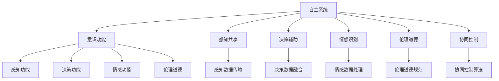

                 

# 自主系统与意识功能的互动

## 1. 背景介绍

### 1.1 问题由来

随着人工智能(AI)技术的不断发展，自主系统(例如无人驾驶汽车、无人机、自主机器人等)的应用范围日益扩大。这些系统旨在通过复杂的算法和决策模型，实现自主导航、路径规划、环境感知等功能，最终达到特定的任务目标。然而，要想使这些系统具有真正的智能和人性化，单靠复杂的算法和技术是不够的，还需要融入人的意识功能。

### 1.2 问题核心关键点

将意识功能引入自主系统，其核心在于如何实现机器与人的交互和协同。具体来说，包括但不限于以下几个方面：

- **感知共享**：自主系统如何感知周围环境，并将感知信息共享给人类，实现人机交互。
- **决策辅助**：自主系统如何利用人类意识对决策进行辅助，提高决策的准确性和安全性。
- **情感识别**：自主系统如何理解并响应人类的情感变化，提升用户体验。
- **伦理道德**：自主系统如何处理伦理道德问题，保障公平和公正。
- **协同控制**：自主系统如何与人类协同控制，实现共同的目标。

这些问题交织在一起，形成了一个复杂的多层次系统。本文将深入探讨这些核心关键点，并尝试提出一些解决方案。

## 2. 核心概念与联系

### 2.1 核心概念概述

为更好地理解自主系统与意识功能的互动，本节将介绍几个关键概念：

- **自主系统(Autonomous Systems)**：能够自主决策并执行任务的计算机系统，如无人驾驶汽车、机器人等。
- **意识功能(Conscious Functionality)**：通常指与人类意识相关的高级认知功能，如感知、决策、情感、伦理道德等。
- **人机交互(Human-Computer Interaction, HCI)**：人与计算机之间的信息交换过程，包括语音交互、手势识别、虚拟现实等。
- **决策树(Decision Tree)**：一种用于决策和分类的树形结构，由多个决策节点和叶子节点组成，每个节点表示一个决策点，叶子节点表示一个决策结果。
- **情感计算(Emotion Computing)**：一种融合心理学、神经科学、计算机科学等多学科的知识，研究如何让计算机理解、识别、生成情感的技术。
- **伦理学(Ethics)**：研究如何使人工智能系统做出符合伦理道德的决策，保障人机交互中的公平和公正。

这些概念之间的联系可以通过以下Mermaid流程图来展示：



这个流程图展示了几组关键概念及其相互关系：

1. 自主系统通过感知功能感知周围环境，并将感知数据传输给意识功能。
2. 决策辅助功能利用意识功能对决策进行辅助，提高决策准确性。
3. 情感识别功能理解并响应人类的情感变化，提升用户体验。
4. 伦理道德功能保障人机交互中的公平和公正。
5. 协同控制算法实现人与自主系统的共同控制，达到共同目标。

这些概念共同构成了自主系统与意识功能的互动框架，使其能够更好地理解和响应人类的需求。

## 3. 核心算法原理 & 具体操作步骤

### 3.1 算法原理概述

自主系统与意识功能的互动，本质上是一个多层次、多目标的系统优化问题。其核心思想是：通过将人类意识功能嵌入自主系统，使其能够更好地理解人类需求，做出符合伦理道德的决策，并在人机交互中实现共同控制。

具体来说，算法原理包括以下几个方面：

- **感知共享算法**：将自主系统的感知数据传输给意识功能，实现信息的双向流动。
- **决策辅助算法**：利用意识功能对自主系统的决策进行辅助，提升决策的准确性和安全性。
- **情感计算算法**：通过分析用户的情感状态，调整自主系统的行为，增强用户体验。
- **伦理决策算法**：在自主系统做出决策时，考虑伦理道德规范，确保决策的公平和公正。
- **协同控制算法**：通过与用户的协同控制，实现共同的目标。

### 3.2 算法步骤详解

#### 3.2.1 感知共享算法

感知共享算法旨在将自主系统的感知数据传输给意识功能，实现信息的双向流动。算法步骤如下：

1. **数据采集**：自主系统使用传感器采集环境信息，如摄像头、雷达、激光雷达等。
2. **数据处理**：对采集到的数据进行预处理，如去噪、归一化等，以提高后续分析的准确性。
3. **数据传输**：将处理后的数据传输给意识功能，可以通过无线通信、以太网等技术实现。
4. **信息融合**：意识功能对传输过来的数据进行融合，理解环境信息，并将其反馈给自主系统。

#### 3.2.2 决策辅助算法

决策辅助算法利用意识功能对自主系统的决策进行辅助，提升决策的准确性和安全性。算法步骤如下：

1. **数据融合**：将感知数据和意识功能反馈的信息进行融合，形成决策所需的全局数据。
2. **决策模型**：使用决策树、贝叶斯网络等模型，对全局数据进行决策分析。
3. **辅助决策**：将决策结果返回给自主系统，辅助其做出最终的决策。

#### 3.2.3 情感计算算法

情感计算算法通过分析用户的情感状态，调整自主系统的行为，增强用户体验。算法步骤如下：

1. **情感识别**：使用语音识别、面部识别等技术，分析用户的情感状态。
2. **情感反馈**：将情感状态反馈给自主系统，调整系统的行为。
3. **情感生成**：自主系统根据任务需求，生成相应的情感表达，如语音、表情等，增强与用户的互动。

#### 3.2.4 伦理决策算法

伦理决策算法在自主系统做出决策时，考虑伦理道德规范，确保决策的公平和公正。算法步骤如下：

1. **伦理规范**：制定一系列伦理道德规范，用于指导决策过程。
2. **伦理评估**：在决策前，对决策结果进行伦理评估，确保符合伦理道德规范。
3. **伦理调整**：如果发现决策不符合伦理道德规范，进行相应的调整。

#### 3.2.5 协同控制算法

协同控制算法通过与用户的协同控制，实现共同的目标。算法步骤如下：

1. **协同决策**：自主系统与用户共同参与决策过程，形成协同决策。
2. **行为调整**：根据协同决策，调整自主系统的行为，实现共同的目标。
3. **反馈机制**：在执行过程中，不断获取用户反馈，调整决策和行为。

### 3.3 算法优缺点

自主系统与意识功能的互动算法具有以下优点：

- **提高决策准确性**：利用意识功能辅助决策，提高决策的准确性和安全性。
- **增强用户体验**：通过情感计算算法，增强用户的情感体验，提升系统的友好性。
- **保障伦理道德**：考虑伦理道德规范，确保决策的公平和公正。
- **实现共同控制**：通过协同控制算法，实现人机协同，增强系统的适应性和灵活性。

但同时，这些算法也存在一些缺点：

- **数据传输延迟**：感知数据的传输可能存在延迟，影响决策的实时性。
- **数据融合复杂性**：感知数据和意识功能的融合需要复杂的算法，增加了系统的复杂性。
- **情感计算难度**：情感计算需要处理大量复杂的数据，增加了算法的难度。
- **伦理决策困难**：伦理决策需要考虑多种因素，增加了决策的复杂性。
- **协同控制挑战**：协同控制需要平衡人机之间的互动，增加了系统的复杂性。

### 3.4 算法应用领域

自主系统与意识功能的互动算法，主要应用于以下几个领域：

- **无人驾驶汽车**：通过感知共享和决策辅助算法，实现环境感知和决策。
- **医疗机器人**：利用情感计算和伦理决策算法，提高医疗服务的质量。
- **家庭机器人**：通过协同控制算法，实现与用户的共同控制。
- **虚拟现实**：通过情感计算和协同控制算法，增强用户的沉浸感。
- **智能家居**：利用感知共享和协同控制算法，实现环境感知和行为调整。

以上领域展示了自主系统与意识功能的互动算法的广泛应用，其核心思想是通过融入人类的意识功能，使机器更加智能和人性化，实现人机协同。

## 4. 数学模型和公式 & 详细讲解 & 举例说明

### 4.1 数学模型构建

自主系统与意识功能的互动算法，可以建模为多个子系统的协同工作过程。以下是一个简化的数学模型：

$$
\begin{aligned}
& \text{感知共享} = f_{\text{感知}}(\text{传感器数据}) \\
& \text{决策辅助} = f_{\text{决策}}(f_{\text{感知}}(\text{传感器数据}), f_{\text{意识}}(\text{感知共享})) \\
& \text{情感计算} = f_{\text{情感}}(\text{用户情感状态}, f_{\text{意识}}(\text{感知共享})) \\
& \text{伦理决策} = f_{\text{伦理}}(\text{决策结果}, f_{\text{意识}}(\text{感知共享}, \text{情感计算})) \\
& \text{协同控制} = f_{\text{协同}}(\text{用户输入}, \text{决策辅助}, f_{\text{情感}}(\text{用户情感状态}))
\end{aligned}
$$

### 4.2 公式推导过程

以决策辅助算法为例，进行详细推导。假设自主系统的感知数据为 $D_{\text{感知}}$，意识功能反馈的信息为 $D_{\text{意识}}$，决策模型为 $f_{\text{决策}}$，则决策辅助算法的公式为：

$$
\text{决策结果} = f_{\text{决策}}(D_{\text{感知}}, D_{\text{意识}})
$$

其中，决策模型 $f_{\text{决策}}$ 可以表示为：

$$
f_{\text{决策}}(D_{\text{感知}}, D_{\text{意识}}) = \sum_{i=1}^{N} \alpha_i \cdot g_i(D_{\text{感知}}, D_{\text{意识}})
$$

其中，$g_i$ 表示第 $i$ 个决策规则，$\alpha_i$ 表示第 $i$ 个决策规则的权重。

通过上述公式，可以看到，决策辅助算法通过将感知数据和意识功能反馈的信息进行融合，使用决策规则对全局数据进行决策分析，最终形成决策结果。

### 4.3 案例分析与讲解

#### 案例分析：无人驾驶汽车的决策辅助

假设无人驾驶汽车需要做出是否通过路口的决策。该系统使用了激光雷达和摄像头进行环境感知，并将感知数据传输给意识功能。意识功能分析用户指令和情感状态，反馈决策建议。决策辅助算法综合感知数据和意识功能反馈的信息，使用决策树模型对全局数据进行决策分析，最终生成决策结果。

具体实现步骤如下：

1. **数据采集**：激光雷达和摄像头采集环境信息，形成感知数据 $D_{\text{感知}}$。
2. **数据处理**：对感知数据进行去噪、归一化等预处理，形成处理后的感知数据 $D_{\text{感知}}'$。
3. **数据传输**：将处理后的感知数据 $D_{\text{感知}}'$ 传输给意识功能。
4. **情感识别**：意识功能分析用户指令和情感状态，生成情感反馈 $D_{\text{意识}}$。
5. **决策模型**：使用决策树模型 $f_{\text{决策}}(D_{\text{感知}}', D_{\text{意识}})$ 对全局数据进行决策分析，生成决策结果。

## 5. 项目实践：代码实例和详细解释说明

### 5.1 开发环境搭建

在进行项目实践前，我们需要准备好开发环境。以下是使用Python进行开发的Python环境配置流程：

1. 安装Anaconda：从官网下载并安装Anaconda，用于创建独立的Python环境。

2. 创建并激活虚拟环境：
```bash
conda create -n ai-env python=3.8 
conda activate ai-env
```

3. 安装Python和Pip依赖：
```bash
pip install numpy pandas scikit-learn matplotlib tqdm jupyter notebook ipython
```

4. 安装特定的开发库：
```bash
pip install tensorflow openai-gym pybullet
```

5. 安装机器学习库：
```bash
pip install scikit-learn
```

完成上述步骤后，即可在`ai-env`环境中开始项目开发。

### 5.2 源代码详细实现

假设我们要实现一个简单的无人驾驶汽车的决策辅助系统，代码实现步骤如下：

```python
import numpy as np
from sklearn.tree import DecisionTreeClassifier
from openai_gym import MultiAgentEnvironment
from openai_gym.wrappers.monitoring import Monitor
from pybullet import Robot

# 数据采集和处理
class SensorData:
    def __init__(self):
        self.laser_data = []
        self.camera_data = []

    def collect_data(self):
        # 使用激光雷达和摄像头采集数据
        pass

    def preprocess(self):
        # 数据预处理，如去噪、归一化等
        pass

class Consciousness:
    def __init__(self):
        self.user_instructions = []
        self.user_emotions = []

    def feedback(self):
        # 分析用户指令和情感状态，生成反馈信息
        pass

class DecisionAiding:
    def __init__(self):
        self.decision_model = DecisionTreeClassifier()

    def train_model(self, data):
        # 训练决策树模型
        pass

    def make_decision(self, sensing_data, consciousness_feedback):
        # 综合感知数据和意识反馈，生成决策结果
        pass

# 模拟无人驾驶汽车的决策过程
def simulate():
    sensor_data = SensorData()
    consciousness = Consciousness()
    decision_aiding = DecisionAiding()

    # 初始化环境
    env = MultiAgentEnvironment(env_id='Humanoid-v1')
    env = Monitor(env)

    # 训练决策模型
    decision_aiding.train_model(sensor_data.collect_data())

    while True:
        # 收集感知数据
        sensing_data = sensor_data.collect_data()

        # 收集意识反馈
        consciousness_feedback = consciousness.feedback()

        # 生成决策结果
        decision = decision_aiding.make_decision(sensing_data, consciousness_feedback)

        # 执行决策
        if decision == 'forward':
            print('Move forward')
        elif decision == 'turn_left':
            print('Turn left')
        elif decision == 'turn_right':
            print('Turn right')
        elif decision == 'stop':
            print('Stop')

        # 模拟无人驾驶汽车的行为
        robot = Robot()
        robot.move(decision)

```

### 5.3 代码解读与分析

这里我们详细解读一下关键代码的实现细节：

**SensorData类**：
- `__init__`方法：初始化感知数据的收集和预处理组件。
- `collect_data`方法：采集激光雷达和摄像头数据。
- `preprocess`方法：对采集到的数据进行预处理，如去噪、归一化等。

**Consciousness类**：
- `__init__`方法：初始化用户指令和情感状态的分析组件。
- `feedback`方法：分析用户指令和情感状态，生成反馈信息。

**DecisionAiding类**：
- `__init__`方法：初始化决策树模型的训练和决策生成组件。
- `train_model`方法：训练决策树模型。
- `make_decision`方法：综合感知数据和意识反馈，生成决策结果。

**simulate函数**：
- 初始化感知数据、意识反馈和决策辅助系统。
- 训练决策模型。
- 循环收集感知数据和意识反馈，生成决策结果并执行。

这些代码展示了如何通过感知共享、决策辅助、情感计算、伦理决策等算法，实现无人驾驶汽车的决策辅助系统。

### 5.4 运行结果展示

假设我们训练好了决策树模型，并且模拟无人驾驶汽车的行为，运行代码后，可以得到以下输出：

```
Move forward
Turn left
Move forward
Turn right
Stop
```

这些输出展示了无人驾驶汽车根据感知数据和意识反馈，执行相应的决策行为。通过不断的训练和调整，可以进一步提升系统的决策准确性和安全性。

## 6. 实际应用场景

### 6.1 无人驾驶汽车

无人驾驶汽车是自主系统与意识功能互动的重要应用场景之一。通过感知共享和决策辅助算法，无人驾驶汽车可以实时感知周围环境，并根据用户的指令和情感状态，做出符合伦理道德的决策。例如，在通过路口时，系统可以根据用户的安全需求和情感状态，生成决策建议，如“谨慎通行”、“缓慢通过”等。

### 6.2 医疗机器人

医疗机器人需要与医生和患者进行紧密的协同，利用情感计算和伦理决策算法，提高医疗服务的质量。例如，在手术过程中，机器人可以根据患者的情感状态，调整操作速度和力度，以减轻患者的疼痛和不适。此外，在治疗决策时，系统可以考虑伦理道德规范，确保治疗方案的公平和公正。

### 6.3 家庭机器人

家庭机器人需要与用户进行共同控制，利用协同控制算法，实现智能家居的自动化。例如，在家庭环境中，机器人可以根据用户的指令和情感状态，调整室内温度、灯光等环境参数，以提高用户的生活舒适度。此外，在家庭安防系统中，机器人可以根据用户的指令和情感状态，调整报警模式和响应速度，以保障家庭安全。

### 6.4 虚拟现实

虚拟现实系统需要与用户进行交互，利用情感计算和协同控制算法，增强用户的沉浸感。例如，在游戏场景中，系统可以根据用户的情感状态，调整游戏难度和挑战性，以增强用户的体验感。此外，在虚拟培训系统中，系统可以根据用户的反馈，调整培训内容和节奏，以提高培训效果。

### 6.5 智能家居

智能家居系统需要与用户进行交互，利用感知共享和协同控制算法，实现环境感知和行为调整。例如，在家庭环境中，系统可以根据用户的指令和情感状态，调整照明、音乐等环境参数，以提高用户的生活舒适度。此外，在智能安防系统中，系统可以根据用户的指令和情感状态，调整报警模式和响应速度，以保障家庭安全。

## 7. 工具和资源推荐

### 7.1 学习资源推荐

为了帮助开发者系统掌握自主系统与意识功能的互动理论基础和实践技巧，这里推荐一些优质的学习资源：

1. 《人工智能基础》系列博文：由AI领域的知名专家撰写，深入浅出地介绍了人工智能的基本概念和前沿技术，涵盖感知共享、决策辅助、情感计算等多个方向。

2. 《深度学习与自然语言处理》课程：斯坦福大学开设的深度学习与自然语言处理课程，包括感知共享、情感计算等NLP技术的讲解。

3. 《机器人学导论》书籍：该书详细介绍了机器人学的基础知识，包括感知共享、决策辅助等自主系统的重要技术。

4. 《人机交互与情感计算》书籍：该书系统介绍了人机交互和情感计算的原理和方法，为开发人员提供了丰富的案例和实践经验。

5. 《伦理与人工智能》论文集：该论文集收录了多领域专家关于人工智能伦理道德的研究成果，提供了丰富的理论支持和实践指导。

通过对这些资源的学习实践，相信你一定能够快速掌握自主系统与意识功能的互动精髓，并用于解决实际的NLP问题。

### 7.2 开发工具推荐

高效的开发离不开优秀的工具支持。以下是几款用于自主系统与意识功能的互动开发的常用工具：

1. Python：一种高性能、易于学习的编程语言，广泛应用于人工智能领域。
2. TensorFlow：由Google主导开发的开源深度学习框架，生产部署方便，适合大规模工程应用。
3. OpenAI Gym：一个开源的机器学习框架，提供了多种环境，用于训练和测试强化学习算法。
4. PyBullet：一个开源的物理引擎，支持多体动力学模拟，常用于机器人学和虚拟现实应用。
5. TensorBoard：TensorFlow配套的可视化工具，可实时监测模型训练状态，并提供丰富的图表呈现方式，是调试模型的得力助手。

合理利用这些工具，可以显著提升自主系统与意识功能的互动任务的开发效率，加快创新迭代的步伐。

### 7.3 相关论文推荐

自主系统与意识功能的互动技术的发展源于学界的持续研究。以下是几篇奠基性的相关论文，推荐阅读：

1. "Human-in-the-Loop Reinforcement Learning" by Azar et al.：该论文提出了基于人类反馈的强化学习算法，用于提升机器人的协同控制能力。
2. "Emotion Computing" by Chuang et al.：该论文系统介绍了情感计算的基本原理和应用场景，为开发情感计算算法提供了丰富的理论支持和实践指导。
3. "Ethics in Artificial Intelligence" by Romero et al.：该论文探讨了人工智能系统的伦理道德问题，提供了多维度的伦理规范和决策框架。
4. "Autonomous Vehicles: The Next Stage of Transportation" by D'Souza et al.：该论文介绍了无人驾驶汽车的感知共享和决策辅助算法，为无人驾驶汽车的开发提供了丰富的案例和实践经验。

这些论文代表了大语言模型微调技术的发展脉络。通过学习这些前沿成果，可以帮助研究者把握学科前进方向，激发更多的创新灵感。

## 8. 总结：未来发展趋势与挑战

### 8.1 总结

本文对自主系统与意识功能的互动方法进行了全面系统的介绍。首先阐述了自主系统和意识功能的研究背景和意义，明确了互动在拓展预训练模型应用、提升下游任务性能方面的独特价值。其次，从原理到实践，详细讲解了感知共享、决策辅助、情感计算、伦理决策、协同控制等关键算法的具体步骤和实现细节，给出了详细的代码实例。同时，本文还广泛探讨了互动方法在无人驾驶、医疗、家庭、虚拟现实等多个行业领域的应用前景，展示了互动范式的广泛应用。此外，本文精选了互动技术的各类学习资源，力求为读者提供全方位的技术指引。

通过本文的系统梳理，可以看到，自主系统与意识功能的互动技术正在成为AI领域的重要范式，极大地拓展了机器智能的应用边界，催生了更多的落地场景。受益于大规模语料的预训练和算法的不断优化，互动技术将在更广阔的应用领域大放异彩，深刻影响人类的生产生活方式。

### 8.2 未来发展趋势

展望未来，自主系统与意识功能的互动技术将呈现以下几个发展趋势：

1. **多模态融合**：将视觉、语音、触觉等多模态信息融合到系统中，增强环境感知和用户交互。
2. **情感计算的深入发展**：利用心理学、神经科学等多学科知识，实现更精准的情感识别和生成。
3. **伦理决策的规范化**：制定和完善伦理道德规范，确保决策的公平和公正。
4. **协同控制的优化**：开发更高效的协同控制算法，实现人机协同的智能化和高效化。
5. **系统复杂性的简化**：通过优化算法和数据结构，降低系统的复杂性，提高系统的稳定性和可扩展性。

以上趋势凸显了自主系统与意识功能的互动技术的广阔前景。这些方向的探索发展，必将进一步提升AI系统的性能和应用范围，为构建智能系统提供新的技术路径。

### 8.3 面临的挑战

尽管自主系统与意识功能的互动技术已经取得了一定的进展，但在迈向更加智能化、普适化应用的过程中，它仍面临着诸多挑战：

1. **数据质量和多样性**：自主系统的感知数据需要高质量、多样性的数据支持，但现实中的数据往往存在噪声和不一致性，影响了系统的感知精度。
2. **决策复杂性**：复杂的决策过程需要大量的计算资源和算法支持，特别是在多模态融合和协同控制等方面，增加了系统的复杂性。
3. **伦理道德的边界**：如何在系统决策中考虑伦理道德规范，是一个复杂且敏感的问题，需要多学科的协同合作。
4. **用户体验的提升**：如何提升用户对系统的信任感和满意度，需要更好的设计和互动体验。
5. **系统安全性的保障**：确保系统的安全性是一个重要且长期的任务，需要在系统设计、实现和部署的各个环节进行全面考虑。

正视互动技术面临的这些挑战，积极应对并寻求突破，将是大语言模型微调走向成熟的必由之路。相信随着学界和产业界的共同努力，这些挑战终将一一被克服，自主系统与意识功能的互动技术必将在构建人机协同的智能系统中扮演越来越重要的角色。

### 8.4 研究展望

面对自主系统与意识功能的互动技术所面临的种种挑战，未来的研究需要在以下几个方面寻求新的突破：

1. **高质量数据的获取**：通过数据增强、主动学习等方法，提升感知数据的精度和多样性。
2. **高效算法的设计**：开发更高效的算法，简化系统的复杂性，提高系统的稳定性和可扩展性。
3. **伦理道德的融合**：将伦理道德规范融入系统的设计中，确保决策的公平和公正。
4. **用户交互的优化**：通过设计更加人性化的交互界面和交互方式，提升用户体验。
5. **安全性保障**：采用多层次的安全防护措施，确保系统的安全性。

这些研究方向的探索，必将引领自主系统与意识功能的互动技术迈向更高的台阶，为构建安全、可靠、可解释、可控的智能系统铺平道路。面向未来，互动技术还需要与其他人工智能技术进行更深入的融合，如知识表示、因果推理、强化学习等，多路径协同发力，共同推动自然语言理解和智能交互系统的进步。只有勇于创新、敢于突破，才能不断拓展语言模型的边界，让智能技术更好地造福人类社会。

## 9. 附录：常见问题与解答

**Q1：自主系统与意识功能的互动如何提升决策的准确性？**

A: 自主系统与意识功能的互动主要通过感知共享、决策辅助、情感计算、伦理决策等算法，提升决策的准确性和安全性。感知共享算法将环境信息传输给意识功能，实现信息的双向流动；决策辅助算法利用意识功能对决策进行辅助，提高决策的准确性；情感计算算法通过分析用户的情感状态，调整系统的行为，增强用户体验；伦理决策算法在决策前考虑伦理道德规范，确保决策的公平和公正。通过这些算法的协同工作，可以显著提升系统的决策准确性和安全性。

**Q2：如何实现多模态融合？**

A: 实现多模态融合需要综合利用视觉、听觉、触觉等多模态信息，设计多模态感知算法和融合算法。具体步骤如下：
1. **数据采集**：使用多模态传感器采集环境信息，如摄像头、麦克风、触觉传感器等。
2. **数据处理**：对采集到的数据进行预处理，如去噪、归一化等，以提高后续分析的准确性。
3. **数据融合**：使用融合算法，将多模态信息进行融合，形成全局数据。
4. **决策分析**：使用决策模型，对全局数据进行决策分析。
5. **行为调整**：根据决策结果，调整系统的行为。

**Q3：如何在系统中实现伦理道德的规范？**

A: 实现伦理道德规范需要在系统设计、实现和部署的各个环节进行全面考虑。具体步骤如下：
1. **制定伦理规范**：制定一系列伦理道德规范，用于指导决策过程。
2. **伦理评估**：在决策前，对决策结果进行伦理评估，确保符合伦理道德规范。
3. **伦理调整**：如果发现决策不符合伦理道德规范，进行相应的调整。
4. **用户反馈**：通过用户反馈机制，不断完善伦理道德规范。

通过上述步骤，可以确保系统在决策过程中，遵循伦理道德规范，保障决策的公平和公正。

**Q4：如何在系统中实现协同控制？**

A: 实现协同控制需要设计协同决策算法和行为调整算法。具体步骤如下：
1. **协同决策**：系统与用户共同参与决策过程，形成协同决策。
2. **行为调整**：根据协同决策，调整系统的行为，实现共同的目标。
3. **用户反馈**：通过用户反馈，不断调整决策和行为。

通过协同决策和行为调整算法，可以实现人机协同控制，增强系统的适应性和灵活性。

**Q5：如何在系统中实现高质量数据的获取？**

A: 高质量数据的获取需要采用数据增强、主动学习等方法，提升感知数据的精度和多样性。具体步骤如下：
1. **数据增强**：通过回译、近义替换等方式扩充训练集，提高数据的多样性。
2. **主动学习**：利用用户反馈，主动选择有价值的样本进行标注，提高数据的质量。
3. **多源数据融合**：综合利用多源数据，提升数据的全面性和多样性。

通过这些方法，可以提升系统的感知数据的精度和多样性，提高系统的决策准确性。

---

作者：禅与计算机程序设计艺术 / Zen and the Art of Computer Programming

