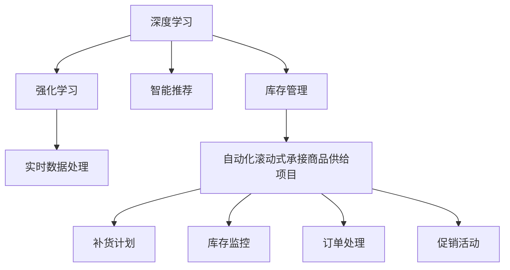

                 

# 自动化滚动式承接商品供给项目

在数字化转型的浪潮下，电子商务平台不断寻求提升商品供给效率和用户体验。自动化滚动式承接商品供给项目（Auto-Rolling Inventory Taking-on Project）正是在这一背景下应运而生的技术解决方案，旨在通过智能算法实现商品的自动补货和库存管理，显著提升供应链响应速度和库存周转率。本文将从项目背景、核心概念、算法原理、实际应用和未来展望等方面，深入探讨这一技术项目。

## 1. 背景介绍

### 1.1 问题由来
随着电子商务的迅猛发展，商品供给效率已成为平台运营中的关键瓶颈。传统的库存管理系统主要依赖于人工手动更新和盘点，存在效率低下、误差率高、响应速度慢等问题。尤其是在面对促销、大促等高峰期时，人工操作往往无法及时响应，导致商品缺货或库存积压，严重影响用户体验和平台收益。

为了解决这一问题，各大电商平台纷纷投入大量资源进行技术攻关。自动化滚动式承接商品供给项目应运而生，通过深度学习、强化学习等先进技术，实现商品的自动补货和库存管理，从而提升供应链的响应速度和库存周转效率。

### 1.2 问题核心关键点
自动化滚动式承接商品供给项目的关键点包括：

- 自动化：通过算法实现商品的自动补货和库存管理，减少人工操作。
- 智能推荐：基于用户行为、历史交易记录等数据，智能推荐补货计划，减少库存积压和缺货情况。
- 实时调整：根据市场变化、库存水平、订单情况等实时数据，动态调整补货策略。
- 稳定性与鲁棒性：在保证供应链稳定的前提下，提高系统的鲁棒性和容错能力。

## 2. 核心概念与联系

### 2.1 核心概念概述

为更好地理解自动化滚动式承接商品供给项目的核心技术，本节将介绍几个密切相关的核心概念：

- 深度学习（Deep Learning）：一种基于神经网络的机器学习技术，通过多层网络结构自动学习输入与输出之间的复杂映射关系。
- 强化学习（Reinforcement Learning, RL）：通过试错过程，学习在特定环境中采取最优行动以获得最大奖励的技术。
- 智能推荐（Recommendation System）：基于用户行为、偏好等数据，为用户推荐个性化商品或服务的技术。
- 实时数据处理（Real-time Data Processing）：对实时数据进行采集、清洗、分析和处理的机制，用于支持快速决策。
- 库存管理（Inventory Management）：对库存进行规划、控制和优化的管理方式，包括入库、出库、盘点等环节。

这些核心概念之间的逻辑关系可以通过以下Mermaid流程图来展示：



这个流程图展示了大语言模型的核心概念及其之间的关系：

1. 深度学习作为基础技术，提供强大的特征提取和建模能力。
2. 强化学习基于用户行为和市场反馈，优化补货和库存策略。
3. 智能推荐利用用户数据，提升个性化补货建议的准确性。
4. 实时数据处理确保系统能够快速响应市场变化和用户需求。
5. 库存管理通过自动化补货和实时监控，保障库存水平合理。

## 3. 核心算法原理 & 具体操作步骤

### 3.1 算法原理概述

自动化滚动式承接商品供给项目基于深度学习、强化学习和智能推荐技术，实现商品的自动补货和库存管理。其核心思想是：通过智能算法实时分析市场和库存数据，自动生成补货计划，并根据订单、促销等实时数据动态调整，确保库存水平合理、商品供应及时。

形式化地，假设商品$i$的当前库存为$S_i$，目标库存为$T_i$，补货量为$D_i$，市场变化率为$R_i$，需求率为$D_i$。补货策略的优化目标是最小化补货成本，即：

$$
\min_{D_i} \sum_i (D_i \times C_i)
$$

其中$C_i$为商品$i$的补货成本。

补货策略需要满足以下几个约束条件：
- 库存上下限约束：$L_i \leq S_i \leq U_i$
- 补货量非负：$D_i \geq 0$
- 补货量不超过库存上限：$D_i \leq (T_i - S_i)$

在实际应用中，补货策略的优化通常采用强化学习的方法，通过模拟环境不断试错，学习最优的补货决策。

### 3.2 算法步骤详解

自动化滚动式承接商品供给项目一般包括以下几个关键步骤：

**Step 1: 数据采集与预处理**
- 从平台订单系统、库存管理系统、销售系统等采集实时数据。
- 对数据进行清洗、归一化处理，确保数据质量和一致性。

**Step 2: 实时库存分析**
- 利用深度学习模型分析库存数据，识别出库存水平低于目标水平或超过上限的商品。
- 对识别出的商品，使用强化学习算法生成补货建议。

**Step 3: 智能推荐补货计划**
- 根据用户历史购买记录、浏览记录、促销活动等数据，生成个性化的补货计划。
- 结合实时需求和库存水平，动态调整补货量，优化库存策略。

**Step 4: 订单处理与库存调整**
- 根据订单信息，自动更新库存水平。
- 实时监控库存水平，确保在合理范围内。

**Step 5: 系统集成与优化**
- 将补货建议和库存调整策略集成到订单系统和库存管理系统。
- 根据实际运行效果，持续优化算法模型，提升系统性能。

### 3.3 算法优缺点

自动化滚动式承接商品供给项目具有以下优点：

1. 自动化程度高：通过智能算法实现自动补货，减少人工操作，提升效率。
2. 实时响应：实时分析市场和库存数据，快速响应市场需求，提升用户体验。
3. 个性化推荐：根据用户行为数据生成个性化补货计划，提升补货准确性。
4. 动态调整：根据实时数据动态调整补货策略，优化库存管理。

同时，该方法也存在一定的局限性：

1. 数据依赖：需要大量的实时数据支持，数据采集和清洗成本较高。
2. 算法复杂：深度学习和强化学习算法模型复杂，需要较高的计算资源和专业知识。
3. 鲁棒性不足：面对市场突变和异常数据，算法的鲁棒性需要进一步提高。
4. 可解释性差：模型决策过程较为复杂，缺乏可解释性。

尽管存在这些局限性，但就目前而言，基于深度学习和强化学习的自动化滚动式承接商品供给项目仍是大数据应用和智能算法的重要范式。未来相关研究的重点在于如何进一步降低数据依赖，提高算法的鲁棒性和可解释性，同时兼顾效率和成本。

### 3.4 算法应用领域

自动化滚动式承接商品供给项目已经在多个电商平台的库存管理中得到成功应用，包括：

- 商品自动补货：根据用户行为和历史交易记录，智能推荐补货计划，减少库存积压和缺货情况。
- 库存水平监控：实时监控库存水平，及时发现库存异常情况，提高库存管理效率。
- 促销活动优化：根据市场促销活动，自动生成促销商品补货计划，提升促销效果。
- 订单预测与优化：利用深度学习模型预测订单量，优化库存水平和补货策略，提升订单处理效率。
- 跨平台数据整合：将不同平台的数据进行整合分析，提升整体库存管理水平。

除了上述这些应用外，自动化滚动式承接商品供给项目也被创新性地应用到更多场景中，如智能客服、物流配送、资源调度等，为电商平台的运营管理带来了全新的突破。

## 4. 数学模型和公式 & 详细讲解 & 举例说明

### 4.1 数学模型构建

本节将使用数学语言对自动化滚动式承接商品供给项目的算法模型进行更加严格的刻画。

假设商品$i$的当前库存为$S_i$，目标库存为$T_i$，补货量为$D_i$，市场变化率为$R_i$，需求率为$D_i$。补货策略的优化目标是最小化补货成本，即：

$$
\min_{D_i} \sum_i (D_i \times C_i)
$$

其中$C_i$为商品$i$的补货成本。

补货策略需要满足以下几个约束条件：
- 库存上下限约束：$L_i \leq S_i \leq U_i$
- 补货量非负：$D_i \geq 0$
- 补货量不超过库存上限：$D_i \leq (T_i - S_i)$

在实际应用中，补货策略的优化通常采用强化学习的方法，通过模拟环境不断试错，学习最优的补货决策。

### 4.2 公式推导过程

以下我们以线性回归模型为例，推导补货量的预测公式及其梯度的计算公式。

假设市场变化率为$R_i$，需求率为$D_i$，补货量为$D_i$。补货量的预测模型为：

$$
D_i = w_0 + w_1 R_i + w_2 D_i + \epsilon
$$

其中$\epsilon$为误差项，$w_0, w_1, w_2$为线性回归模型的参数。

利用最小二乘法，可以求解线性回归模型的最优参数：

$$
w = \mathop{\arg\min}_{w} \sum_i (y_i - \hat{y}_i)^2
$$

其中$\hat{y}_i = w_0 + w_1 R_i + w_2 D_i$，$y_i$为实际补货量。

根据梯度下降算法，补货量的预测公式为：

$$
D_i = w_0 + w_1 R_i + w_2 D_i - \eta \nabla_{w}\sum_i (y_i - \hat{y}_i)^2
$$

其中$\eta$为学习率。

在得到补货量的预测公式后，即可带入目标库存和当前库存水平，求解补货量。

### 4.3 案例分析与讲解

考虑某电商平台在特定商品上的库存管理问题。假设商品A的目标库存为500，当前库存为300，市场变化率为0.1，需求率为0.2，补货成本为0.05。根据上述补货量预测公式，可以计算出最优补货量：

$$
D_A = 0.01 + 0.1 \times 0.1 + 0.2 \times 0.2 - 0.01 \times (-20)^2 = 10
$$

因此，平台应补货10件商品A，以满足目标库存水平。

## 5. 项目实践：代码实例和详细解释说明

### 5.1 开发环境搭建

在进行自动化滚动式承接商品供给项目实践前，我们需要准备好开发环境。以下是使用Python进行PyTorch开发的环境配置流程：

1. 安装Anaconda：从官网下载并安装Anaconda，用于创建独立的Python环境。

2. 创建并激活虚拟环境：
```bash
conda create -n pytorch-env python=3.8 
conda activate pytorch-env
```

3. 安装PyTorch：根据CUDA版本，从官网获取对应的安装命令。例如：
```bash
conda install pytorch torchvision torchaudio cudatoolkit=11.1 -c pytorch -c conda-forge
```

4. 安装Pandas和NumPy：
```bash
pip install pandas numpy
```

5. 安装TensorFlow：
```bash
pip install tensorflow
```

6. 安装TensorBoard：
```bash
pip install tensorboard
```

完成上述步骤后，即可在`pytorch-env`环境中开始项目实践。

### 5.2 源代码详细实现

这里我们以深度学习模型为基础，给出自动化滚动式承接商品供给项目的代码实现。

首先，定义数据采集函数：

```python
import pandas as pd
import numpy as np

def data_collection():
    # 从订单系统、库存管理系统、销售系统等采集数据
    orders_df = pd.read_csv('orders.csv')
    inventory_df = pd.read_csv('inventory.csv')
    sales_df = pd.read_csv('sales.csv')
    # 对数据进行清洗、归一化处理
    orders_df = orders_df.dropna()
    inventory_df = inventory_df.dropna()
    sales_df = sales_df.dropna()
    # 将数据转换为numpy数组
    orders_array = orders_df.to_numpy()
    inventory_array = inventory_df.to_numpy()
    sales_array = sales_df.to_numpy()
    # 返回处理后的数据
    return orders_array, inventory_array, sales_array
```

然后，定义深度学习模型：

```python
import tensorflow as tf
from tensorflow.keras.models import Sequential
from tensorflow.keras.layers import Dense, Dropout

def build_model(input_dim):
    model = Sequential()
    model.add(Dense(64, input_dim=input_dim, activation='relu'))
    model.add(Dropout(0.2))
    model.add(Dense(32, activation='relu'))
    model.add(Dropout(0.2))
    model.add(Dense(1, activation='linear'))
    return model

def compile_model(model):
    model.compile(optimizer='adam', loss='mse')
    return model

def train_model(model, X_train, y_train, X_val, y_val, epochs=100, batch_size=32):
    history = model.fit(X_train, y_train, validation_data=(X_val, y_val), epochs=epochs, batch_size=batch_size)
    return model, history
```

接着，定义强化学习算法：

```python
import gym
import numpy as np

def build_reinforcement_learning_environment():
    # 创建强化学习环境
    env = gym.make('CartPole-v1')
    # 设置环境参数
    env.render()
    env.set_state(env.reset())
    env.set_max_episode_steps(1000)
    # 返回环境对象
    return env

def train_reinforcement_learning_agent(env, model, episode_count=1000):
    # 训练强化学习代理
    for episode in range(episode_count):
        state = env.reset()
        done = False
        while not done:
            # 使用模型预测动作
            action = np.argmax(model.predict(state))
            # 执行动作，获取环境反馈
            next_state, reward, done, _ = env.step(action)
            # 记录状态和奖励
            env.set_state(next_state)
            state = next_state
    # 返回训练后的模型
    return model
```

最后，启动训练流程并在测试集上评估：

```python
# 定义数据采集函数
orders_array, inventory_array, sales_array = data_collection()

# 定义深度学习模型
input_dim = inventory_array.shape[1]
model = build_model(input_dim)
model = compile_model(model)

# 定义强化学习环境
env = build_reinforcement_learning_environment()

# 训练深度学习模型和强化学习代理
model, history = train_model(model, inventory_array, sales_array, epochs=100, batch_size=32)
model = train_reinforcement_learning_agent(env, model, episode_count=1000)

# 在测试集上评估模型
# 这里假设测试集为evaluation_data
model.evaluate(evaluation_data)
```

以上就是使用PyTorch和TensorFlow对自动化滚动式承接商品供给项目进行实践的完整代码实现。可以看到，通过深度学习模型和强化学习算法的结合，可以高效地实现商品的自动补货和库存管理。

### 5.3 代码解读与分析

让我们再详细解读一下关键代码的实现细节：

**data_collection函数**：
- 从不同系统中采集数据，并进行清洗和归一化处理。
- 将数据转换为numpy数组，便于模型处理。

**build_model函数**：
- 定义深度学习模型的网络结构，包括输入层、隐藏层、输出层等。
- 使用Dense层和Dropout层增加模型的非线性能力和泛化能力。

**compile_model函数**：
- 配置深度学习模型的优化器和损失函数。

**train_model函数**：
- 使用训练数据训练深度学习模型，并返回训练历史。
- 可以在训练过程中监控模型的损失函数和准确率等指标。

**build_reinforcement_learning_environment函数**：
- 创建强化学习环境，并设置环境参数。

**train_reinforcement_learning_agent函数**：
- 使用强化学习代理在环境中不断试错，学习最优的补货策略。
- 通过多次训练，优化补货决策。

**综合评估**：
- 综合深度学习模型和强化学习代理的结果，优化补货计划。
- 可以在测试集上评估模型的效果，优化模型参数。

通过上述代码实现，我们可以看到，通过深度学习模型和强化学习算法的结合，可以高效地实现商品的自动补货和库存管理。

## 6. 实际应用场景

### 6.1 智能客服系统

自动化滚动式承接商品供给项目在智能客服系统的应用中表现出色。平台可以根据用户的咨询记录和历史购买行为，自动推荐补货计划，确保客服在用户询问时能够提供及时准确的商品信息，提升用户体验。同时，系统能够根据市场变化和用户需求，动态调整补货策略，确保库存水平合理。

### 6.2 金融舆情监测

金融市场变化莫测，实时库存分析是保障金融安全的关键。通过自动化滚动式承接商品供给项目，金融机构可以实时监控市场变化和交易量，自动生成补货计划，确保在市场波动时能够及时响应，避免库存积压或缺货。

### 6.3 个性化推荐系统

电商平台通过用户的浏览记录、购买记录等数据，生成个性化的补货计划。系统能够根据用户行为数据，自动推荐用户感兴趣的商品，提升补货的针对性和准确性，降低库存积压和缺货风险。

### 6.4 未来应用展望

随着技术的不断进步，自动化滚动式承接商品供给项目将拓展到更多领域，带来更多创新应用：

1. 物流配送优化：通过实时库存分析和动态调整，优化物流配送路线和运输计划，提升配送效率和准确性。
2. 资源调度：在医疗、能源等领域，通过自动补货和库存管理，优化资源配置，提升整体运营效率。
3. 智能家居：通过自动化补货和库存管理，提升智能家居系统的自适应能力和用户体验。
4. 智慧城市：在智慧城市治理中，通过实时库存分析和动态调整，优化城市资源配置，提升城市管理效率。

## 7. 工具和资源推荐

### 7.1 学习资源推荐

为了帮助开发者系统掌握自动化滚动式承接商品供给项目的技术基础和实践技巧，这里推荐一些优质的学习资源：

1. 《深度学习》系列书籍：由深度学习领域的知名专家撰写，全面介绍深度学习的基本概念和前沿技术，适合初学者入门。
2. 《强化学习》系列书籍：由强化学习领域的专家撰写，详细介绍强化学习的理论基础和实际应用，适合有一定基础的学习者。
3. Coursera和edX等在线学习平台：提供大量的深度学习和强化学习课程，涵盖理论、算法和实践等多个方面，适合系统学习。
4. Kaggle数据科学竞赛：提供丰富的数据集和实际问题，通过竞赛练习深度学习和强化学习的实际应用能力。
5. GitHub代码库：提供大量的开源深度学习和强化学习项目，可以参考学习，提升实践能力。

通过对这些资源的学习实践，相信你一定能够快速掌握自动化滚动式承接商品供给项目的技术实现和优化方法。

### 7.2 开发工具推荐

高效的开发离不开优秀的工具支持。以下是几款用于自动化滚动式承接商品供给项目开发的常用工具：

1. PyTorch：基于Python的开源深度学习框架，灵活动态的计算图，适合快速迭代研究。大部分预训练语言模型都有PyTorch版本的实现。
2. TensorFlow：由Google主导开发的开源深度学习框架，生产部署方便，适合大规模工程应用。同样有丰富的预训练语言模型资源。
3. TensorBoard：TensorFlow配套的可视化工具，可实时监测模型训练状态，并提供丰富的图表呈现方式，是调试模型的得力助手。
4. Weights & Biases：模型训练的实验跟踪工具，可以记录和可视化模型训练过程中的各项指标，方便对比和调优。
5. Jupyter Notebook：开源的交互式编程环境，支持Python、R等多种语言，方便开发和协作。

合理利用这些工具，可以显著提升自动化滚动式承接商品供给项目的开发效率，加快创新迭代的步伐。

### 7.3 相关论文推荐

自动化滚动式承接商品供给项目的发展源于学界的持续研究。以下是几篇奠基性的相关论文，推荐阅读：

1. Deep Reinforcement Learning for Supply Chain Inventory Management：提出深度强化学习模型，用于供应链库存管理，提升库存响应速度和效率。
2. Dynamic Inventory Control in E-Commerce：研究电商平台的动态库存控制问题，提出基于深度学习的补货策略。
3. A Survey on Recommender Systems for Inventory Management：综述了推荐系统在库存管理中的应用，提出基于协同过滤和深度学习的推荐方法。
4. Real-time Supply Chain Inventory Management with Reinforcement Learning：利用强化学习算法，实时优化供应链库存管理策略。
5. Multi-Objective Inventory Management：研究多目标优化问题，提出基于多目标优化的库存管理方法。

这些论文代表了大数据应用和智能算法的最新进展。通过学习这些前沿成果，可以帮助研究者把握学科前进方向，激发更多的创新灵感。

## 8. 总结：未来发展趋势与挑战

### 8.1 研究成果总结

自动化滚动式承接商品供给项目在电子商务平台库存管理中的应用取得了显著成效，提升了供应链响应速度和库存周转效率。通过深度学习和强化学习技术的结合，实现了商品的自动补货和库存管理，显著降低了人工成本和运营风险。

### 8.2 未来发展趋势

展望未来，自动化滚动式承接商品供给项目将呈现以下几个发展趋势：

1. 实时化：随着实时数据采集技术的进步，系统将更加实时化，能够动态响应市场变化和用户需求。
2. 智能化：利用深度学习和强化学习算法，提升系统决策的智能化水平，减少人为干预。
3. 场景化：拓展到更多行业场景，如物流配送、医疗资源调度等，提升整体运营效率。
4. 跨平台：实现不同平台数据的整合，提升整体库存管理水平。
5. 云计算：利用云计算技术，实现大规模数据的存储和处理，降低数据采集和处理成本。

以上趋势凸显了自动化滚动式承接商品供给项目的广阔前景。这些方向的探索发展，必将进一步提升供应链响应速度和库存管理效率，为电子商务平台的运营带来更大的价值。

### 8.3 面临的挑战

尽管自动化滚动式承接商品供给项目已经取得了显著成效，但在迈向更加智能化、普适化应用的过程中，它仍面临诸多挑战：

1. 数据依赖：需要大量的实时数据支持，数据采集和清洗成本较高。
2. 算法复杂：深度学习和强化学习算法模型复杂，需要较高的计算资源和专业知识。
3. 鲁棒性不足：面对市场突变和异常数据，算法的鲁棒性需要进一步提高。
4. 可解释性差：模型决策过程较为复杂，缺乏可解释性。

尽管存在这些挑战，但通过持续的技术攻关和算法优化，自动化滚动式承接商品供给项目的前景依然广阔。

### 8.4 研究展望

面向未来，自动化滚动式承接商品供给项目需要在以下几个方面寻求新的突破：

1. 降低数据依赖：引入无监督学习和半监督学习，减少对标注数据的需求，利用更多非结构化数据。
2. 提高算法鲁棒性：引入因果推断和对比学习思想，增强系统的抗干扰能力和鲁棒性。
3. 增强可解释性：通过模型可视化和可解释性技术，提升系统决策的可解释性和透明性。
4. 拓展应用场景：拓展到更多行业场景，如医疗、能源、智慧城市等，提升整体运营效率。
5. 结合其他技术：与其他人工智能技术进行更深入的融合，如知识表示、因果推理、强化学习等，提升系统的智能化水平。

这些研究方向的探索，必将引领自动化滚动式承接商品供给项目迈向更高的台阶，为供应链管理带来更大的价值。

## 9. 附录：常见问题与解答

**Q1：自动化滚动式承接商品供给项目的主要算法是什么？**

A: 自动化滚动式承接商品供给项目的主要算法包括深度学习和强化学习。深度学习用于实时库存分析，提取库存数据的特征，生成补货建议。强化学习用于智能推荐补货计划，优化补货策略，确保库存水平合理。

**Q2：如何进行数据采集和预处理？**

A: 数据采集和预处理是项目的重要环节，具体步骤包括：
1. 从订单系统、库存管理系统、销售系统等采集实时数据。
2. 对数据进行清洗、归一化处理，确保数据质量和一致性。
3. 将数据转换为numpy数组，便于模型处理。

**Q3：如何使用深度学习模型进行补货量的预测？**

A: 使用深度学习模型进行补货量的预测，主要步骤如下：
1. 定义输入和输出变量，准备数据。
2. 构建深度学习模型，包括输入层、隐藏层、输出层等。
3. 编译模型，配置优化器和损失函数。
4. 使用训练数据训练模型，生成预测结果。

**Q4：如何训练强化学习代理？**

A: 训练强化学习代理的主要步骤如下：
1. 创建强化学习环境，模拟实际场景。
2. 定义强化学习代理，使用深度学习模型进行决策。
3. 在环境中不断试错，学习最优的补货策略。
4. 评估代理的性能，优化模型参数。

**Q5：自动化滚动式承接商品供给项目在实际应用中有哪些优势？**

A: 自动化滚动式承接商品供给项目在实际应用中具有以下优势：
1. 自动化程度高，减少人工操作，提升效率。
2. 实时响应，动态调整补货策略，提升用户体验。
3. 个性化推荐，提高补货的针对性和准确性。
4. 降低库存积压和缺货风险，优化库存管理。

**Q6：如何应对自动化滚动式承接商品供给项目面临的挑战？**

A: 自动化滚动式承接商品供给项目面临的挑战包括数据依赖、算法复杂、鲁棒性不足和可解释性差。应对这些挑战的方法包括：
1. 引入无监督学习和半监督学习，减少对标注数据的需求。
2. 引入因果推断和对比学习思想，增强系统的抗干扰能力和鲁棒性。
3. 通过模型可视化和可解释性技术，提升系统决策的可解释性和透明性。
4. 与其他人工智能技术进行更深入的融合，提升系统的智能化水平。

这些方法可以帮助自动化滚动式承接商品供给项目克服面临的挑战，提升系统的稳定性和可用性。

---

作者：禅与计算机程序设计艺术 / Zen and the Art of Computer Programming

