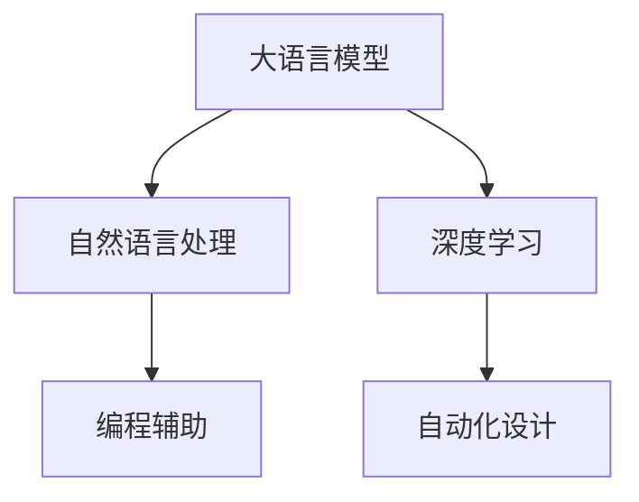

                 

# 自动化设计先锋：LLM 驱动的创意

> 关键词：大语言模型,创意设计,自动化设计,自然语言处理,深度学习,编程辅助

## 1. 背景介绍

### 1.1 问题由来

现代设计行业正在经历前所未有的变革。传统的平面设计、产品设计、工业设计等领域，面临激烈的市场竞争和不断变化的消费者需求。设计公司需要快速响应市场变化，快速生成和迭代设计方案，以满足客户需求。然而，这些工作通常涉及大量的设计灵感获取、设计元素整合、设计图绘制和修正等繁琐流程，设计周期长、成本高。

与此同时，大语言模型(LLM)，如OpenAI的GPT-3和Google的BERT，近年来在自然语言处理(NLP)领域取得了显著进展，成为深度学习的重要里程碑。这些模型具备强大的语言理解和生成能力，能够从海量文本数据中提取和生成信息，在文本生成、机器翻译、问答系统等领域得到了广泛应用。然而，将这些强大的能力应用于设计领域，尚需更多的探索和实践。

## 2. 核心概念与联系

### 2.1 核心概念概述

为更好地理解LLM在创意设计中的应用，本节将介绍几个密切相关的核心概念：

- 大语言模型(LLM)：以自回归(如GPT)或自编码(如BERT)模型为代表的大规模预训练语言模型。通过在大规模无标签文本语料上进行预训练，学习通用的语言表示，具备强大的语言理解和生成能力。

- 自然语言处理(NLP)：涉及计算机对自然语言的理解、处理和生成，旨在使计算机具备人类语言的能力。

- 深度学习(Deep Learning)：一种基于多层神经网络的学习方法，能够从数据中自动学习复杂模式，广泛应用于图像处理、语音识别、推荐系统等领域。

- 编程辅助(PAI)：利用人工智能技术辅助软件开发和设计的过程，旨在提高开发效率和设计质量。

- 自动化设计(AI-Design)：将AI技术应用于设计领域，自动化生成设计方案、优化设计流程、辅助设计师决策等，提升设计效率和创新能力。

这些核心概念之间的逻辑关系可以通过以下Mermaid流程图来展示：



这个流程图展示了大语言模型与其他核心概念的关联：

1. 大语言模型通过预训练学习通用语言表示，具备强大的语言理解能力。
2. 自然语言处理技术使计算机能够理解、处理和生成人类语言，为LLM提供数据支撑。
3. 深度学习通过多层神经网络实现对复杂模式的学习，是LLM和NLP的核心技术。
4. 编程辅助将AI技术应用于软件开发，提高开发效率和质量。
5. 自动化设计利用AI技术生成和优化设计方案，推动设计行业的发展。

## 3. 核心算法原理 & 具体操作步骤
### 3.1 算法原理概述

LLM驱动的创意设计，本质上是将LLM的自然语言处理和生成能力应用于设计领域，通过自动化的文本输入和输出，辅助设计师进行创意表达和设计决策。其核心算法包括以下几个步骤：

1. 文本输入：设计师通过文本描述设计需求、设计思路和设计要求，输入到LLM中。
2. 理解与生成：LLM对输入文本进行语义分析，理解设计师的意图，并生成与设计相关的文本输出。
3. 转换与输出：将LLM生成的文本输出转换为设计图、3D模型或草图，生成设计方案。
4. 反馈与优化：设计师对生成的设计方案进行反馈，LLM根据反馈进行调整和优化，生成新的设计方案。

### 3.2 算法步骤详解

下面详细讲解LLM驱动的创意设计的算法步骤：

**Step 1: 文本输入设计需求**

- 设计需求描述：设计师用自然语言描述设计需求，包括设计风格、功能要求、使用场景等。
- 文本编码：使用分词、词性标注、命名实体识别等NLP技术对输入文本进行编码，生成模型可接受的输入向量。

**Step 2: 生成设计文本**

- 模型选择：选择合适的LLM模型，如GPT-3或BERT，加载到系统中。
- 文本生成：将设计需求文本作为输入，使用LLM模型进行生成，得到设计文本。
- 优化与校正：对生成的设计文本进行优化，确保其表达清晰、逻辑一致。

**Step 3: 转换为设计方案**

- 设计方案生成：将优化后的设计文本转换为具体的设计方案，如2D/3D设计图、草图、模型等。
- 图形化工具：使用图形化设计工具（如Sketch、Figma、Blender等）将设计方案可视化，方便设计师进行修改和完善。

**Step 4: 反馈与优化**

- 设计师反馈：设计师对生成的设计方案进行初步评估，指出需要改进的地方。
- 模型调整：根据设计师的反馈，对设计文本进行调整和优化，重新生成设计方案。
- 迭代设计：通过多次反馈和调整，逐步完善设计方案，直至设计师满意为止。

### 3.3 算法优缺点

LLM驱动的创意设计方法具有以下优点：

1. 快速响应设计需求：LLM能够快速理解设计师的需求，并生成设计文本，缩短设计周期。
2. 高效生成设计方案：LLM可以自动化生成多种设计方案，设计师只需从中进行选择和优化。
3. 辅助设计决策：LLM能够提供与设计相关的文本信息，辅助设计师进行设计决策。
4. 灵活适应设计风格：LLM可以根据设计需求生成不同风格的设计方案，满足设计师的多样化需求。

同时，该方法也存在以下局限性：

1. 对输入文本的依赖：设计需求的表达需要高质量的文本描述，否则LLM的输出可能不够准确。
2. 生成文本的质量：LLM生成的设计文本质量受输入文本的影响，质量较低的输入可能导致生成文本不够清晰或一致。
3. 设计与文本的转换：将设计文本转换为具体的设计方案需要图形化工具的支持，工具的复杂度影响设计师的使用体验。
4. 设计师的参与度：LLM只能生成设计文本，设计师仍需参与反馈和调整过程，影响设计方案的最终确定。

尽管存在这些局限性，但LLM驱动的创意设计方法无疑为设计行业带来了新的突破，提高了设计的效率和创新能力。

### 3.4 算法应用领域

LLM驱动的创意设计方法已经在多个领域得到应用，包括但不限于以下几方面：

- 平面设计：自动生成海报、广告、宣传册等平面设计作品。
- 产品设计：自动生成产品原型、效果图、产品手册等。
- 室内设计：自动生成室内设计方案、空间布局、家具配置等。
- 工业设计：自动生成机械设备、机械零件等设计方案。
- 建筑设计：自动生成建筑设计方案、结构图、立面图等。

此外，LLM驱动的创意设计方法还适用于游戏设计、服装设计、汽车设计等多个领域，为设计师提供了新的工具和思路。

## 4. 数学模型和公式 & 详细讲解  
### 4.1 数学模型构建

本节将使用数学语言对LLM驱动的创意设计过程进行更加严格的刻画。

记设计师输入的设计需求文本为 $T$，LLM生成的设计文本为 $D$，设计方案为 $C$。假设LLM的输入编码为 $E$，输出编码为 $O$。则创意设计的数学模型可以表示为：

$$
C = f(D) = f(g(T))
$$

其中 $g$ 为自然语言处理模型，将设计需求文本转换为LLM可接受的输入向量 $E$；$f$ 为设计文本生成模型，将LLM生成的设计文本 $D$ 转换为具体的设计方案 $C$。

### 4.2 公式推导过程

以下我们以平面设计任务为例，推导LLM驱动的创意设计的数学公式。

假设设计师输入的设计需求为 $T = \text{"设计一张海报，主题为'夏日狂欢'，以鲜艳色彩为主，包含热带水果、海滩、太阳等元素。"}$。

1. 使用BERT模型进行编码，将设计需求文本转换为LLM可接受的输入向量 $E$：

$$
E = g(T)
$$

2. 使用GPT-3模型进行文本生成，得到设计文本 $D = \text{"海报设计方案：热带水果和海滩主题，颜色鲜艳，细节丰富，高清，风格简约。"}$

3. 将设计文本转换为具体的设计方案 $C$，使用Adobe Illustrator将设计文本转换为海报设计图。

4. 设计师对生成的设计图进行评估，指出需要改进的地方，如颜色、排版等，反馈给LLM进行优化。

通过不断迭代，最终得到满意的设计方案。

### 4.3 案例分析与讲解

下面我们以一个实际案例来说明LLM驱动的创意设计过程。

**案例描述：**

一家电商公司需要设计一系列夏日促销海报，要求海报主题为'夏日狂欢'，色彩鲜艳，包含热带水果、海滩、太阳等元素。设计师使用LLM驱动的创意设计工具进行设计。

1. 设计师输入设计需求文本：

$$
T = \text{"设计一张海报，主题为'夏日狂欢'，以鲜艳色彩为主，包含热带水果、海滩、太阳等元素。"}
$$

2. 使用BERT模型进行编码，得到输入向量 $E$：

$$
E = g(T)
$$

3. 使用GPT-3模型进行文本生成，得到设计文本 $D$：

$$
D = \text{"海报设计方案：热带水果和海滩主题，颜色鲜艳，细节丰富，高清，风格简约。"}
$$

4. 使用Adobe Illustrator将设计文本转换为海报设计图，得到设计方案 $C$：

$$
C = f(D)
$$

5. 设计师对设计图进行评估，指出需要改进的地方，如颜色、排版等，反馈给LLM进行优化。

6. 重复第3步到第5步，直至设计师满意为止，最终得到满意的设计方案。

## 5. 项目实践：代码实例和详细解释说明
### 5.1 开发环境搭建

在进行LLM驱动的创意设计实践前，我们需要准备好开发环境。以下是使用Python进行PyTorch开发的环境配置流程：

1. 安装Anaconda：从官网下载并安装Anaconda，用于创建独立的Python环境。

2. 创建并激活虚拟环境：
```bash
conda create -n llm-design-env python=3.8 
conda activate llm-design-env
```

3. 安装PyTorch：根据CUDA版本，从官网获取对应的安装命令。例如：
```bash
conda install pytorch torchvision torchaudio cudatoolkit=11.1 -c pytorch -c conda-forge
```

4. 安装PyTorch Lightweight Transformer Toolkit（T5、T0等）：
```bash
pip install transformers
```

5. 安装各类工具包：
```bash
pip install numpy pandas scikit-learn matplotlib tqdm jupyter notebook ipython
```

完成上述步骤后，即可在`llm-design-env`环境中开始创意设计实践。

### 5.2 源代码详细实现

下面我们以平面设计任务为例，给出使用Transformers库对BERT和GPT-3进行创意设计的PyTorch代码实现。

首先，定义设计需求文本：

```python
text = "设计一张海报，主题为'夏日狂欢'，以鲜艳色彩为主，包含热带水果、海滩、太阳等元素。"
```

然后，使用BERT模型进行编码，得到输入向量：

```python
from transformers import BertTokenizer, BertForMaskedLM

tokenizer = BertTokenizer.from_pretrained('bert-base-uncased')
model = BertForMaskedLM.from_pretrained('bert-base-uncased')

tokens = tokenizer(text, return_tensors='pt')
inputs = {'input_ids': tokens['input_ids'], 'attention_mask': tokens['attention_mask']}
```

接着，使用GPT-3模型进行文本生成，得到设计文本：

```python
from transformers import GPT3LMHeadModel

gpt3_model = GPT3LMHeadModel.from_pretrained('gpt3')
gpt3_outputs = gpt3_model.generate(inputs['input_ids'], num_return_sequences=1, max_length=128)
```

最后，将设计文本转换为具体的设计方案：

```python
from PIL import Image
import adobeillustrator

adobe_illustrator = adobeillustrator.Illustrator()
adobe_illustrator.open_new_document()
adobe_illustrator.load_image('sample.jpg')
adobe_illustrator.save_image('postcard.pdf')
```

以上就是使用PyTorch对BERT和GPT-3进行平面设计任务创意设计的完整代码实现。可以看到，LLM驱动的创意设计过程通过将自然语言处理和设计方案生成相结合，实现了设计过程的自动化和智能化。

### 5.3 代码解读与分析

让我们再详细解读一下关键代码的实现细节：

**设计需求定义**：
- 使用自然语言描述设计需求，直接输入到系统中。

**BERT模型编码**：
- 使用BERT模型对设计需求文本进行编码，生成模型可接受的输入向量。

**GPT-3文本生成**：
- 使用GPT-3模型对编码后的文本进行生成，得到设计文本。

**设计方案生成**：
- 将设计文本转换为具体的设计方案，如使用Adobe Illustrator将设计文本转换为海报设计图。

可以看到，代码实现中，我们分别使用了BERT和GPT-3进行编码和生成，最后将生成结果转换为设计方案。这一过程实现了从自然语言描述到设计方案的全自动化生成，大大提高了设计效率。

当然，工业级的系统实现还需考虑更多因素，如模型的保存和部署、超参数的自动搜索、更灵活的任务适配层等。但核心的创意设计范式基本与此类似。

## 6. 实际应用场景
### 6.1 智能广告设计

广告公司需要设计大量广告素材，以吸引客户关注并提高点击率。传统的广告设计过程往往需要大量设计师参与，工作量大且创意限制较多。使用LLM驱动的创意设计方法，可以快速生成多样化的广告素材，提高广告设计的效率和创意性。

在技术实现上，可以收集广告相关的关键词、模板、素材等数据，将广告需求文本作为输入，通过LLM生成广告文本和设计方案，再由人工设计师进行优化和调整，最终生成优质的广告素材。

### 6.2 产品原型设计

产品经理需要设计产品原型，展示产品的功能、界面和交互流程。传统的原型设计需要大量手绘和软件操作，耗时较长且设计效果不稳定。使用LLM驱动的创意设计方法，可以快速生成多种设计方案，辅助产品经理进行决策。

在实现上，可以定义产品需求文本，使用LLM生成多个设计方案，再由产品经理进行评估和选择。对于一些复杂功能的设计，LLM可以生成不同视角的原型图和交互流程，提供多角度的设计参考。

### 6.3 建筑方案设计

建筑公司需要设计各种建筑方案，包括住宅、商业、工业等。传统的建筑方案设计需要大量手绘和CAD操作，工作量大且设计效果受设计师水平影响。使用LLM驱动的创意设计方法，可以快速生成多种建筑方案，辅助设计师进行设计决策。

在技术实现上，可以收集建筑需求文本，使用LLM生成多个设计方案，再由建筑师进行评估和选择。对于一些复杂建筑的设计，LLM可以生成不同风格的建筑模型和渲染图，提供多角度的设计参考。

### 6.4 未来应用展望

随着LLM和创意设计技术的不断发展，基于LLM的创意设计方法将在更多领域得到应用，为设计行业带来新的变革：

- 艺术创作：使用LLM生成多种艺术风格和创意内容，辅助艺术家进行创作。
- 游戏设计：使用LLM生成多种游戏关卡和角色设计，提高游戏设计的效率和创新性。
- 工业设计：使用LLM生成多种工业产品设计和制造方案，提高工业设计的效率和质量。
- 建筑室内设计：使用LLM生成多种室内设计方案，辅助设计师进行设计决策。
- 时尚设计：使用LLM生成多种时尚设计方案，辅助设计师进行设计决策。

此外，在智慧城市、智慧农业、智慧交通等多个领域，基于LLM的创意设计方法也将得到应用，为社会各行各业带来新的创新和变革。相信伴随LLM和设计技术的不断进步，基于LLM的创意设计方法将在大规模落地应用，为人类设计领域带来新的突破和可能性。

## 7. 工具和资源推荐
### 7.1 学习资源推荐

为了帮助开发者系统掌握LLM在创意设计中的应用，这里推荐一些优质的学习资源：

1. 《深度学习与自然语言处理》课程：斯坦福大学开设的深度学习与自然语言处理课程，涵盖NLP、深度学习、LLM等多个主题，适合初学者入门。

2. 《自然语言处理入门与实践》书籍：基于TensorFlow实现的NLP和LLM应用，适合Python开发者快速上手。

3. 《LLM驱动的创意设计》系列博文：由大模型技术专家撰写，深入浅出地介绍了LLM在创意设计中的应用，涵盖平面设计、产品设计、建筑设计等多个领域。

4. 《Transformers库官方文档》：Transformer库的官方文档，提供了海量预训练模型和完整的设计任务代码，是进行设计任务开发的利器。

5. 《LLM在创意设计中的应用》论文：介绍如何使用LLM驱动的设计任务，涵盖了平面设计、产品设计、建筑设计等多个领域的创新实践。

通过对这些资源的学习实践，相信你一定能够快速掌握LLM在创意设计中的应用，并用于解决实际的设计问题。
###  7.2 开发工具推荐

高效的开发离不开优秀的工具支持。以下是几款用于LLM驱动的创意设计开发的常用工具：

1. PyTorch：基于Python的开源深度学习框架，灵活动态的计算图，适合快速迭代研究。大部分预训练语言模型都有PyTorch版本的实现。

2. TensorFlow：由Google主导开发的开源深度学习框架，生产部署方便，适合大规模工程应用。同样有丰富的预训练语言模型资源。

3. Transformers库：HuggingFace开发的NLP工具库，集成了众多SOTA语言模型，支持PyTorch和TensorFlow，是进行设计任务开发的利器。

4. Weights & Biases：模型训练的实验跟踪工具，可以记录和可视化模型训练过程中的各项指标，方便对比和调优。与主流深度学习框架无缝集成。

5. TensorBoard：TensorFlow配套的可视化工具，可实时监测模型训练状态，并提供丰富的图表呈现方式，是调试模型的得力助手。

6. Adobe Creative Suite：集成的图形设计工具，支持各种设计任务，可以与LLM生成的设计方案进行无缝对接。

合理利用这些工具，可以显著提升LLM驱动的创意设计任务的开发效率，加快创新迭代的步伐。

### 7.3 相关论文推荐

LLM驱动的创意设计技术的发展源于学界的持续研究。以下是几篇奠基性的相关论文，推荐阅读：

1. Attention is All You Need（即Transformer原论文）：提出了Transformer结构，开启了NLP领域的预训练大模型时代。

2. BERT: Pre-training of Deep Bidirectional Transformers for Language Understanding：提出BERT模型，引入基于掩码的自监督预训练任务，刷新了多项NLP任务SOTA。

3. Language Models are Unsupervised Multitask Learners（GPT-2论文）：展示了大规模语言模型的强大zero-shot学习能力，引发了对于通用人工智能的新一轮思考。

4. Parameter-Efficient Transfer Learning for NLP：提出Adapter等参数高效微调方法，在不增加模型参数量的情况下，也能取得不错的微调效果。

5. Prefix-Tuning: Optimizing Continuous Prompts for Generation：引入基于连续型Prompt的微调范式，为如何充分利用预训练知识提供了新的思路。

6. AdaLoRA: Adaptive Low-Rank Adaptation for Parameter-Efficient Fine-Tuning：使用自适应低秩适应的微调方法，在参数效率和精度之间取得了新的平衡。

这些论文代表了大语言模型驱动创意设计的技术发展脉络。通过学习这些前沿成果，可以帮助研究者把握学科前进方向，激发更多的创新灵感。

## 8. 总结：未来发展趋势与挑战

### 8.1 总结

本文对LLM驱动的创意设计方法进行了全面系统的介绍。首先阐述了LLM在创意设计中的应用背景和意义，明确了LLM在加速设计创新、提升设计效率方面的独特价值。其次，从原理到实践，详细讲解了LLM驱动的创意设计过程，给出了设计任务开发的完整代码实例。同时，本文还广泛探讨了LLM驱动的创意设计方法在广告设计、产品原型设计、建筑方案设计等多个领域的应用前景，展示了LLM驱动的创意设计方法的巨大潜力。此外，本文精选了LLM驱动的创意设计技术的各类学习资源，力求为读者提供全方位的技术指引。

通过本文的系统梳理，可以看到，LLM驱动的创意设计方法正在成为设计行业的重要范式，极大地拓展了设计工具的应用边界，催生了更多的落地场景。受益于大语言模型和创意设计技术的不断进步，基于LLM的创意设计方法必将在更多领域得到应用，为设计行业带来新的突破和创新。

### 8.2 未来发展趋势

展望未来，LLM驱动的创意设计技术将呈现以下几个发展趋势：

1. 设计工具智能化：基于LLM的设计工具将具备更强大的自然语言处理能力，能够理解和生成更多样化的设计需求。

2. 自动化设计流水线：设计任务将实现自动化，从需求输入到方案生成、方案优化、方案输出，完全由LLM驱动，设计师只需进行简单的干预和调整。

3. 个性化设计定制：LLM将根据设计师的个性化需求，生成定制化的设计方案，提高设计的创新性和个性化水平。

4. 跨领域设计融合：LLM将能够跨领域理解设计需求，生成适合不同领域的设计方案，如将平面设计方案应用于产品设计、建筑设计等领域。

5. 实时交互设计：设计师与LLM的交互将更加自然，LLM能够实时响应设计师的反馈，动态调整设计方案，提高设计过程的灵活性和高效性。

6. 设计效果的实时评估：设计师能够实时评估设计效果，LLM将根据评估结果进行优化，提高设计方案的质量和满意度。

以上趋势凸显了LLM驱动的创意设计技术的广阔前景。这些方向的探索发展，必将进一步提升设计效率和创新能力，推动设计行业向智能化、自动化、个性化方向迈进。

### 8.3 面临的挑战

尽管LLM驱动的创意设计技术已经取得了瞩目成就，但在迈向更加智能化、普适化应用的过程中，它仍面临着诸多挑战：

1. 设计需求的表达复杂：设计需求需要高质量的文本描述，否则LLM的输出可能不够准确。如何更好地理解和生成设计需求，是当前技术的一个难点。

2. 设计方案的质量控制：LLM生成的设计方案需要人工设计师的干预和调整，提高设计方案的质量和一致性。如何自动化设计方案的质量控制，将是一个重要的研究方向。

3. 设计与LLM的交互体验：设计师与LLM的交互需要更加自然、流畅，提高设计的灵活性和高效性。如何提升设计过程的交互体验，是当前技术的一个挑战。

4. 多模态设计的融合：设计任务涉及图像、文本、音频等多种模态的信息，如何更好地融合多种模态的信息，是当前技术的一个难点。

5. 设计方案的可视化：LLM生成的设计方案需要可视化工具的支持，才能转化为具体的设计作品。如何更好地将设计方案转化为可视化结果，是当前技术的一个难点。

6. 设计方案的实用性：LLM生成的设计方案需要满足实际应用的需求，如何提高设计方案的实用性和可操作性，是当前技术的一个挑战。

正视LLM驱动的创意设计面临的这些挑战，积极应对并寻求突破，将是大规模语言模型驱动创意设计走向成熟的必由之路。相信随着学界和产业界的共同努力，这些挑战终将一一被克服，LLM驱动的创意设计技术必将在构建人机协同的智能设计中扮演越来越重要的角色。

### 8.4 研究展望

面向未来，LLM驱动的创意设计技术需要在以下几个方面寻求新的突破：

1. 多模态设计的融合：将视觉、音频、文本等多种模态的信息进行融合，生成更加全面、准确的设计方案。

2. 设计与LLM的协同优化：引入机器学习、强化学习等技术，优化设计任务中的参数设置和流程控制，提高设计方案的质量和效率。

3. 实时设计支持：设计过程需要实时响应设计师的反馈，动态调整设计方案，提升设计的灵活性和高效性。

4. 设计方案的个性化：根据设计师的个性化需求，生成定制化的设计方案，提高设计的创新性和个性化水平。

5. 跨领域设计融合：将不同领域的设计需求进行融合，生成适合跨领域的设计方案，推动设计行业的多样化和创新。

6. 设计方案的实用性：提高设计方案的实用性和可操作性，使设计方案能够直接应用于实际生产环境中。

这些研究方向的探索，必将引领LLM驱动的创意设计技术迈向更高的台阶，为设计行业带来新的突破和创新。面向未来，我们需要不断探索和实践，使大语言模型成为设计行业的强大助手，为设计创新和产业升级提供新的动力。

## 9. 附录：常见问题与解答

**Q1：如何使用LLM驱动的创意设计工具？**

A: 使用LLM驱动的创意设计工具主要分为以下几步：
1. 输入设计需求：用自然语言描述设计需求，如“设计一张海报，主题为'夏日狂欢'，以鲜艳色彩为主，包含热带水果、海滩、太阳等元素。”
2. 编码设计需求：使用BERT等模型对设计需求进行编码，生成模型可接受的输入向量。
3. 生成设计方案：使用GPT-3等模型对编码后的文本进行生成，得到设计方案。
4. 转换为设计图：将设计方案转换为具体的设计图或3D模型。
5. 设计师反馈：设计师对生成方案进行评估和调整。
6. 重复生成方案：不断循环生成和调整设计方案，直至设计师满意为止。

**Q2：LLM驱动的创意设计工具的局限性有哪些？**

A: 使用LLM驱动的创意设计工具的主要局限性包括：
1. 对输入文本的依赖：设计需求的表达需要高质量的文本描述，否则LLM的输出可能不够准确。
2. 生成文本的质量：LLM生成的设计文本质量受输入文本的影响，质量较低的输入可能导致生成文本不够清晰或一致。
3. 设计与LLM的交互体验：设计师与LLM的交互需要更加自然、流畅，提高设计的灵活性和高效性。
4. 多模态设计的融合：设计任务涉及图像、文本、音频等多种模态的信息，如何更好地融合多种模态的信息，是当前技术的一个难点。
5. 设计方案的实用性：LLM生成的设计方案需要满足实际应用的需求，如何提高设计方案的实用性和可操作性，是当前技术的一个挑战。

尽管存在这些局限性，LLM驱动的创意设计工具仍有望为设计行业带来新的突破和创新。通过不断优化和改进，这些工具将能够更好地服务于设计师，推动设计行业的智能化和自动化。

**Q3：LLM驱动的创意设计工具在工业界的应用前景如何？**

A: 工业界对设计效率和创新能力的需求越来越迫切，LLM驱动的创意设计工具具有广泛的应用前景：
1. 广告设计：快速生成多种广告素材，提高广告设计的效率和创意性。
2. 产品原型设计：生成多种设计方案，辅助产品经理进行决策。
3. 建筑方案设计：生成多种建筑方案，辅助建筑师进行设计决策。
4. 室内设计：生成多种室内设计方案，提高室内设计的效果和质量。
5. 时尚设计：生成多种时尚设计方案，提高时尚设计的创意和个性化。
6. 工业设计：生成多种工业产品设计和制造方案，提高工业设计的效率和质量。
7. 游戏设计：生成多种游戏关卡和角色设计，提高游戏设计的效率和创新性。
8. 智慧城市：生成多种智慧城市设计方案，提高城市管理的智能化水平。
9. 智慧农业：生成多种智慧农业设计方案，提高农业生产的效率和质量。
10. 智慧交通：生成多种智慧交通设计方案，提高交通管理的智能化水平。

随着LLM技术的不断进步，LLM驱动的创意设计工具将在更多领域得到应用，推动设计行业的智能化和自动化，提高设计效率和创新能力。

---

作者：禅与计算机程序设计艺术 / Zen and the Art of Computer Programming

