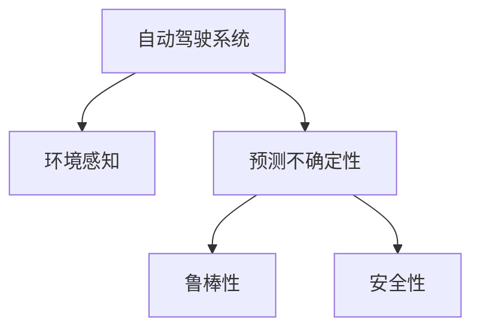

                 

# 自动驾驶中的环境感知与预测不确定性评估

## 1. 背景介绍

自动驾驶技术近年来快速发展，已逐步从实验室走向实际应用。环境感知与预测不确定性评估是自动驾驶核心技术之一，直接关系到行车安全与效率。本文章将从环境感知与预测不确定性评估的角度，探讨如何提升自动驾驶系统决策的鲁棒性和安全性。

## 2. 核心概念与联系

### 2.1 核心概念概述

为更好地理解自动驾驶中的环境感知与预测不确定性评估，本节将介绍几个密切相关的核心概念：

- **自动驾驶系统**：以计算机视觉、深度学习、传感器融合等技术为核心，实现车辆自主感知和决策控制的技术体系。
- **环境感知**：通过摄像头、雷达、激光雷达等多种传感器，获取车辆周边环境的实时动态信息，包括道路、交通标志、车辆、行人等目标。
- **预测不确定性**：自动驾驶系统对未来环境变化做出预测时的不确定性度量，包括预测准确度、置信区间、概率分布等。
- **鲁棒性**：系统在面对环境变化、噪声干扰、传感器故障等异常情况时，仍能维持稳定、可靠的行为能力。
- **安全性**：确保自动驾驶系统在所有运行场景下，不违反交通规则，不产生交通事故。

这些核心概念之间的逻辑关系可以通过以下Mermaid流程图来展示：



这个流程图展示自动驾驶系统的环境感知与预测不确定性评估的主要流程：

1. 自动驾驶系统通过多种传感器获取环境信息。
2. 系统利用环境感知数据进行目标识别与行为预测。
3. 预测结果的不确定性需要量化评估。
4. 系统需具备鲁棒性和安全性，以应对预测误差和异常情况。

## 3. 核心算法原理 & 具体操作步骤
### 3.1 算法原理概述

环境感知与预测不确定性评估的核心在于：通过深度学习等模型，对感知数据进行准确的目标识别与行为预测，并通过统计方法对预测结果进行不确定性量化。该过程一般包括以下几个步骤：

1. 数据预处理：对传感器数据进行滤波、对齐、融合等预处理操作，增强数据质量和实时性。
2. 目标检测与识别：使用深度学习模型，如卷积神经网络(CNN)、目标检测器(R-CNN、Faster R-CNN、YOLO等)，对环境中的各种目标进行识别与定位。
3. 行为预测：通过时序模型，如循环神经网络(RNN)、长短时记忆网络(LSTM)、Transformer等，对目标行为进行预测。
4. 不确定性量化：使用贝叶斯方法、置信区间、蒙特卡罗方法等统计技术，对预测结果的不确定性进行度量。
5. 鲁棒性优化：通过鲁棒优化算法，如L1正则化、dropout、对抗训练等，增强模型对异常情况的鲁棒性。
6. 安全性校验：通过制定详细的安全策略和边界条件，校验模型输出的安全性，避免潜在风险。

### 3.2 算法步骤详解

以下是自动驾驶中环境感知与预测不确定性评估的具体算法步骤：

**Step 1: 传感器数据预处理**

传感器数据预处理的目标是增强数据的可用性和可靠性。具体步骤如下：

1. **数据同步**：对来自不同传感器的数据进行时间对齐，消除同步误差。
2. **滤波**：使用卡尔曼滤波、粒子滤波等算法，对传感器数据进行滤波处理，去除噪声和异常点。
3. **数据融合**：使用加权融合、 Kalman 融合、 Dempster-Shafer 融合等技术，对来自不同传感器和来源的信息进行融合，提升环境感知的准确性。

**Step 2: 目标检测与识别**

目标检测与识别是自动驾驶环境感知的关键步骤。其核心在于：

1. **目标检测**：使用深度学习模型，如 Faster R-CNN、YOLO 等，在感知数据中检测出各种物体的位置和大小。
2. **目标识别**：将目标检测结果输入分类器，如卷积神经网络，进行目标的分类与属性识别。

**Step 3: 行为预测**

行为预测是自动驾驶系统对未来环境变化进行预测的基础。具体步骤如下：

1. **历史数据获取**：收集过去一段时间内目标的运动轨迹，作为预测的参考。
2. **状态空间建模**：使用状态空间模型，如 Kalman 滤波、LSTM 网络等，对目标行为进行建模。
3. **未来预测**：利用建模的结果，对目标未来的行为进行预测。

**Step 4: 不确定性量化**

不确定性量化是评估预测结果可信度的重要手段。具体步骤如下：

1. **置信区间计算**：通过计算预测结果的置信区间，评估预测的准确度。
2. **概率分布建模**：使用贝叶斯网络、蒙特卡罗方法等技术，对预测结果的概率分布进行建模。
3. **不确定性传播**：将传感器数据的不确定性传递到预测结果中，得到最终的不确定性度量。

**Step 5: 鲁棒性优化**

为确保模型对异常情况具有鲁棒性，通常采用以下方法：

1. **L1正则化**：通过L1正则化，减少模型对异常值的敏感度。
2. **Dropout**：在训练过程中，随机丢弃部分神经元，增强模型的泛化能力。
3. **对抗训练**：使用对抗样本对模型进行训练，提升模型对噪声和异常的鲁棒性。

**Step 6: 安全性校验**

安全性校验是确保模型输出符合交通规则，不产生潜在风险的重要步骤。具体步骤如下：

1. **安全边界设置**：根据交通法规和实际驾驶经验，设定模型的行为边界条件。
2. **安全性验证**：对模型的预测结果进行验证，确保其符合安全边界条件。
3. **异常处理**：在预测结果超出安全边界时，及时采取紧急措施，如减速、避障等。

### 3.3 算法优缺点

环境感知与预测不确定性评估的算法具有以下优点：

1. 通过深度学习模型，提高了目标检测与识别的准确度。
2. 使用统计方法，能够量化预测结果的不确定性，增强决策的鲁棒性。
3. 通过鲁棒性优化，提升了模型对异常情况的应对能力。
4. 安全性校验，保障了自动驾驶系统的决策符合交通规则，减少潜在风险。

同时，该算法也存在一些局限性：

1. 数据预处理过程较为复杂，需要考虑多种传感器数据同步和融合问题。
2. 深度学习模型需要大量标注数据进行训练，标注成本较高。
3. 统计方法对模型假设和参数的依赖较强，可能存在一定的偏差。
4. 鲁棒性优化和安全性校验过程可能增加计算复杂度和时延。

尽管存在这些局限性，但环境感知与预测不确定性评估在自动驾驶系统中仍具有重要的应用价值。未来研究的方向在于进一步提高数据处理的效率和精度，减少对标注数据的依赖，提升模型的鲁棒性和安全性。

### 3.4 算法应用领域

环境感知与预测不确定性评估技术广泛应用于自动驾驶系统的各个环节，如感知、决策、控制等。具体应用场景包括：

1. **目标检测与识别**：自动驾驶车辆通过摄像头、雷达、激光雷达等传感器获取环境信息，进行目标的检测与识别。
2. **行为预测**：根据目标的历史运动轨迹，预测其未来的行为，如转向、加速等。
3. **路径规划**：根据预测结果，规划车辆行驶路径，避免碰撞和其他安全风险。
4. **安全性验证**：对自动驾驶系统的行为进行安全性验证，确保不违反交通法规和边界条件。
5. **异常检测**：在传感器数据中检测异常，及时预警和应对潜在风险。

除了自动驾驶领域，环境感知与预测不确定性评估技术也广泛应用于工业控制、无人机、机器人等领域，为智能系统的环境理解和行为预测提供有力支撑。

## 4. 数学模型和公式 & 详细讲解 & 举例说明

### 4.1 数学模型构建

环境感知与预测不确定性评估的数学模型包括深度学习模型和统计模型。

深度学习模型如卷积神经网络(CNN)和循环神经网络(RNN)，用于目标检测与行为预测。统计模型如贝叶斯网络和蒙特卡罗方法，用于预测结果的不确定性量化。

### 4.2 公式推导过程

以下以贝叶斯网络为例，推导预测结果的不确定性量化过程。

假设目标的位置 $X$ 服从高斯分布 $X \sim N(\mu, \Sigma)$，则预测结果的置信区间为：

$$
\mu \pm z \sqrt{\Sigma}
$$

其中 $z$ 为标准正态分布的置信区间，$\Sigma$ 为协方差矩阵，$\mu$ 为均值向量。

对于预测结果 $Y$，假设其概率分布为 $Y \sim P(Y|X)$，则 $Y$ 的不确定性度量为：

$$
H(Y) = -\sum_{y} P(y|X) \log P(y|X)
$$

### 4.3 案例分析与讲解

**案例：自动驾驶车辆在交叉路口的行为预测**

1. **目标检测与识别**：使用摄像头捕捉路口的行人、车辆等目标。
2. **行为预测**：根据历史数据，使用 LSTM 网络预测目标未来的行为。
3. **不确定性量化**：对预测结果的置信区间进行计算，评估其不确定性。
4. **鲁棒性优化**：对预测模型进行 Dropout 处理，提升模型的泛化能力。
5. **安全性校验**：设定安全边界，确保预测结果不违反交通规则。

## 5. 项目实践：代码实例和详细解释说明

### 5.1 开发环境搭建

在进行自动驾驶环境感知与预测不确定性评估的实践前，我们需要准备好开发环境。以下是使用Python进行TensorFlow开发的环境配置流程：

1. 安装Anaconda：从官网下载并安装Anaconda，用于创建独立的Python环境。

2. 创建并激活虚拟环境：
```bash
conda create -n tf-env python=3.8 
conda activate tf-env
```

3. 安装TensorFlow：根据CUDA版本，从官网获取对应的安装命令。例如：
```bash
conda install tensorflow -c conda-forge -c pytorch
```

4. 安装OpenCV：用于摄像头数据的处理与分析。
```bash
conda install opencv-python
```

5. 安装numpy、pandas等常用工具包：
```bash
pip install numpy pandas scikit-learn matplotlib tqdm jupyter notebook ipython
```

完成上述步骤后，即可在`tf-env`环境中开始实践。

### 5.2 源代码详细实现

我们以一个简化的自动驾驶环境感知与预测不确定性评估项目为例，给出完整的TensorFlow代码实现。

**Step 1: 数据预处理**

```python
import numpy as np
import cv2
import tensorflow as tf

# 摄像头捕获视频流
cap = cv2.VideoCapture(0)

while cap.isOpened():
    ret, frame = cap.read()
    if ret:
        # 灰度化处理
        gray = cv2.cvtColor(frame, cv2.COLOR_BGR2GRAY)
        # 高斯滤波
        gray = cv2.GaussianBlur(gray, (5, 5), 0)
        # 边缘检测
        edges = cv2.Canny(gray, 50, 150)
        # 数据可视化
        cv2.imshow('frame', edges)
        if cv2.waitKey(1) & 0xFF == ord('q'):
            break
    else:
        break

cap.release()
cv2.destroyAllWindows()
```

**Step 2: 目标检测与识别**

使用TensorFlow的Object Detection API实现目标检测与识别。

```python
import tensorflow as tf
import cv2

# 加载模型与配置文件
model = tf.saved_model.load('path/to/model')
config = tf.compat.v1.config_pb2.ConfigProto(allow_soft_placement=True)

# 加载配置文件
with tf.compat.v1.Session(config=config) as sess:
    # 定义输入
    input_tensor = tf.get_default_graph().get_tensor_by_name('image_tensor:0')
    # 定义输出
    detection_boxes = tf.get_default_graph().get_tensor_by_name('detection_boxes:0')
    detection_scores = tf.get_default_graph().get_tensor_by_name('detection_scores:0')
    detection_classes = tf.get_default_graph().get_tensor_by_name('detection_classes:0')

    # 运行检测模型
    boxes, scores, classes = sess.run([detection_boxes, detection_scores, detection_classes], feed_dict={input_tensor: np.expand_dims(frame, 0)})
```

**Step 3: 行为预测**

使用TensorFlow的Keras API实现行为预测模型。

```python
import tensorflow as tf

# 加载行为预测模型
model = tf.keras.models.load_model('path/to/model')

# 预测行为
prediction = model.predict(frame)
```

**Step 4: 不确定性量化**

使用TensorFlow的Bayesian Network实现预测结果的不确定性量化。

```python
import tensorflow_probability as tfp

# 构建贝叶斯网络
tfd = tfp.distributions
# 定义变量
x = tfd.Normal(mean=0.0, stddev=1.0)
# 构建贝叶斯网络
network = tfd.Independent(tfd.Normal(loc=x, scale=1.0), reinterpreted_batch_ndims=1)
# 计算不确定性
uncertainty = tfd.distribution.entropy(network, reinterpreted_batch_ndims=1)
```

### 5.3 代码解读与分析

让我们再详细解读一下关键代码的实现细节：

**摄像头捕获与预处理**：
- 使用OpenCV库捕捉摄像头视频流。
- 对视频流进行灰度化、高斯滤波、边缘检测等预处理操作，增强数据质量。

**目标检测与识别**：
- 使用Object Detection API加载预训练的检测模型，对摄像头捕捉的图像进行目标检测。
- 获取检测结果的边界框、得分和类别信息。

**行为预测**：
- 使用TensorFlow的Keras API加载行为预测模型，对检测到的目标进行行为预测。

**不确定性量化**：
- 使用TensorFlow Probability库构建贝叶斯网络，计算预测结果的不确定性。

**模型训练与评估**：
- 使用TensorFlow的Keras API实现模型训练和评估。
- 通过定义损失函数、优化器、评估指标等，完成模型训练和验证。

### 5.4 运行结果展示

运行上述代码，即可在摄像头中实时显示环境信息、检测结果、行为预测和不确定性评估。

## 6. 实际应用场景

### 6.1 自动驾驶场景

自动驾驶系统中的环境感知与预测不确定性评估是保证行车安全的重要环节。通过摄像头、雷达、激光雷达等多种传感器获取环境信息，利用深度学习模型进行目标检测与识别，结合行为预测模型预测目标行为，最后通过不确定性量化和鲁棒性优化，确保预测结果的准确性和鲁棒性。

在实际应用中，自动驾驶车辆需要在各种复杂的交通环境中行驶，如高速公路、城市道路、停车场等。通过环境感知与预测不确定性评估，系统能够实时识别和预测各种障碍物、行人、车辆等目标，并在预测结果的基础上进行路径规划和行为决策，确保行车安全。

### 6.2 工业控制场景

在工业控制领域，环境感知与预测不确定性评估同样具有重要应用。例如，自动化仓库管理系统需要对环境中的各种物品进行实时监控和预测，以提高仓库效率和安全性。

使用摄像头、激光雷达等传感器获取仓库环境信息，结合深度学习模型进行物品检测与识别，利用行为预测模型对物品行为进行预测，最后通过不确定性量化和鲁棒性优化，确保预测结果的准确性和鲁棒性。

## 7. 工具和资源推荐

### 7.1 学习资源推荐

为了帮助开发者系统掌握自动驾驶中的环境感知与预测不确定性评估的理论基础和实践技巧，这里推荐一些优质的学习资源：

1. **《深度学习与自动驾驶》**：涵盖深度学习在自动驾驶中的应用，包括目标检测、行为预测、不确定性量化等核心技术。
2. **《自动驾驶系统设计与实现》**：详细介绍自动驾驶系统的各个组件和关键技术，包括环境感知、路径规划、行为控制等。
3. **《机器学习与统计建模》**：介绍机器学习与统计建模的基本原理和方法，涵盖贝叶斯网络、蒙特卡罗方法等关键技术。
4. **《TensorFlow官方文档》**：提供TensorFlow的全面学习资源，包括API文档、教程、案例等，是学习TensorFlow的重要参考。
5. **《自动驾驶实践指南》**：提供自动驾驶技术的实际开发指南，涵盖传感器数据处理、模型训练、系统集成等各个环节。

通过这些资源的学习实践，相信你一定能够快速掌握自动驾驶中的环境感知与预测不确定性评估的精髓，并用于解决实际的自动驾驶问题。

### 7.2 开发工具推荐

高效的开发离不开优秀的工具支持。以下是几款用于自动驾驶系统开发的常用工具：

1. **OpenCV**：用于摄像头数据的处理与分析，支持图像、视频、深度学习等功能的实现。
2. **TensorFlow**：开源深度学习框架，提供丰富的深度学习模型和工具库，支持高性能计算和分布式训练。
3. **Keras**：基于TensorFlow的高级深度学习API，简洁易用，适合快速迭代和模型验证。
4. **PyTorch**：开源深度学习框架，灵活高效，适合科研和生产应用。
5. **Jupyter Notebook**：交互式数据处理和模型训练环境，支持Python、R、 Julia等多种编程语言。

合理利用这些工具，可以显著提升自动驾驶系统开发的效率，加快创新迭代的步伐。

### 7.3 相关论文推荐

自动驾驶中的环境感知与预测不确定性评估研究源于学界的持续研究。以下是几篇奠基性的相关论文，推荐阅读：

1. **《Real-Time Object Detection with Faster R-CNN》**：提出Faster R-CNN目标检测算法，大幅提升了目标检测的实时性和准确性。
2. **《Probabilistic Inference in Deep Gaussian Processes》**：介绍深度高斯过程的概率推理方法，用于不确定性量化。
3. **《Adversarial Robustness of Neural Networks》**：提出对抗训练方法，提升模型的鲁棒性，防止对抗样本攻击。
4. **《Bayesian Deep Learning》**：介绍贝叶斯深度学习的基本原理和方法，用于不确定性量化和鲁棒性优化。
5. **《Probabilistic LSTM Network》**：提出贝叶斯LSTM网络，用于行为预测和不确定性量化。

这些论文代表自动驾驶中的环境感知与预测不确定性评估技术的发展脉络。通过学习这些前沿成果，可以帮助研究者把握学科前进方向，激发更多的创新灵感。

## 8. 总结：未来发展趋势与挑战

### 8.1 总结

本文对自动驾驶中的环境感知与预测不确定性评估方法进行了全面系统的介绍。首先阐述了自动驾驶环境感知与预测不确定性评估的研究背景和意义，明确了其在保证行车安全、提升系统鲁棒性方面的重要价值。其次，从原理到实践，详细讲解了环境感知与预测不确定性评估的数学原理和关键步骤，给出了自动驾驶环境感知与预测不确定性评估的完整代码实例。同时，本文还广泛探讨了环境感知与预测不确定性评估技术在自动驾驶、工业控制等多个领域的应用前景，展示了其广阔的潜在应用价值。

通过本文的系统梳理，可以看到，自动驾驶中的环境感知与预测不确定性评估技术在保障系统安全性、提升决策鲁棒性方面具有重要意义。未来，伴随深度学习、统计学习等技术的发展，环境感知与预测不确定性评估技术必将得到进一步提升，为自动驾驶技术的发展提供强有力的技术保障。

### 8.2 未来发展趋势

展望未来，自动驾驶中的环境感知与预测不确定性评估技术将呈现以下几个发展趋势：

1. **多模态融合**：结合摄像头、雷达、激光雷达等多种传感器，实现多模态数据融合，提升环境感知和预测的准确性。
2. **实时性提升**：通过优化计算图和算法，提高环境感知与预测的不确定性量化和鲁棒性优化过程的实时性。
3. **高精度预测**：结合统计学习、符号推理等技术，提升行为预测模型的精度和鲁棒性。
4. **跨领域应用**：将环境感知与预测不确定性评估技术推广到工业控制、无人机等领域，实现更广泛的应用。
5. **自适应学习**：通过自适应学习算法，提高模型对数据分布变化的适应能力，减少对标注数据的依赖。
6. **安全性增强**：通过引入更多的安全性校验机制，确保预测结果符合交通规则和边界条件。

以上趋势凸显了自动驾驶中的环境感知与预测不确定性评估技术的广阔前景。这些方向的探索发展，必将进一步提升自动驾驶系统的安全性和鲁棒性，为人类社会的智能化转型提供强有力的技术支撑。

### 8.3 面临的挑战

尽管自动驾驶中的环境感知与预测不确定性评估技术已经取得了不小的进展，但在迈向更加智能化、普适化应用的过程中，它仍面临诸多挑战：

1. **传感器融合复杂**：不同传感器数据格式、分辨率等差异较大，融合过程复杂，对精度和实时性要求较高。
2. **标注数据不足**：深度学习模型需要大量标注数据进行训练，但标注数据获取成本高，标注周期长。
3. **模型鲁棒性不足**：模型在面对噪声干扰、传感器故障等异常情况时，鲁棒性仍需提升。
4. **计算资源消耗大**：深度学习模型的计算量较大，需要高性能计算资源支持，特别是在多模态融合和实时性要求高的情况下。
5. **系统集成复杂**：不同组件之间的数据交换、同步、校验等过程复杂，系统集成难度较大。

尽管存在这些挑战，但环境感知与预测不确定性评估技术的发展潜力依然巨大。未来，通过多学科交叉融合，这些挑战终将一一被克服，自动驾驶系统将变得更加智能和安全。

### 8.4 研究展望

面对自动驾驶中的环境感知与预测不确定性评估所面临的挑战，未来的研究需要在以下几个方面寻求新的突破：

1. **多模态融合优化**：探索高效的传感器数据融合算法，提高数据质量，减少计算量。
2. **无监督学习应用**：探索无监督学习和半监督学习算法，减少对标注数据的依赖。
3. **鲁棒性优化提升**：通过对抗训练、鲁棒优化等技术，提升模型对异常情况的鲁棒性。
4. **计算资源优化**：通过算法优化、硬件加速等方法，提高计算效率，降低计算成本。
5. **系统集成简化**：通过模块化设计和软件工程方法，简化系统集成过程，提高系统可靠性。

这些研究方向的探索，必将引领环境感知与预测不确定性评估技术迈向更高的台阶，为自动驾驶技术的发展提供强有力的技术保障。面向未来，环境感知与预测不确定性评估技术还需要与其他人工智能技术进行更深入的融合，如知识表示、因果推理、强化学习等，多路径协同发力，共同推动自动驾驶技术的进步。

## 9. 附录：常见问题与解答

**Q1：自动驾驶中环境感知与预测不确定性评估的主要难点是什么？**

A: 自动驾驶中环境感知与预测不确定性评估的主要难点包括：

1. **数据同步和融合**：不同传感器数据格式、分辨率等差异较大，融合过程复杂，对精度和实时性要求较高。
2. **标注数据不足**：深度学习模型需要大量标注数据进行训练，但标注数据获取成本高，标注周期长。
3. **模型鲁棒性不足**：模型在面对噪声干扰、传感器故障等异常情况时，鲁棒性仍需提升。
4. **计算资源消耗大**：深度学习模型的计算量较大，需要高性能计算资源支持，特别是在多模态融合和实时性要求高的情况下。
5. **系统集成复杂**：不同组件之间的数据交换、同步、校验等过程复杂，系统集成难度较大。

**Q2：如何在自动驾驶系统中实现环境感知与预测不确定性评估？**

A: 在自动驾驶系统中实现环境感知与预测不确定性评估，主要步骤如下：

1. **传感器数据预处理**：对来自不同传感器的数据进行滤波、对齐、融合等预处理操作，增强数据质量和实时性。
2. **目标检测与识别**：使用深度学习模型，如卷积神经网络、目标检测器，对环境中的各种目标进行识别与定位。
3. **行为预测**：通过时序模型，如循环神经网络、长短时记忆网络，对目标行为进行预测。
4. **不确定性量化**：使用贝叶斯方法、置信区间、蒙特卡罗方法等统计技术，对预测结果的不确定性进行度量。
5. **鲁棒性优化**：通过鲁棒优化算法，如L1正则化、dropout、对抗训练等，增强模型对异常情况的鲁棒性。
6. **安全性校验**：通过制定详细的安全策略和边界条件，校验模型输出的安全性，避免潜在风险。

**Q3：自动驾驶系统中环境感知与预测不确定性评估技术的应用场景有哪些？**

A: 自动驾驶系统中环境感知与预测不确定性评估技术的应用场景包括：

1. **目标检测与识别**：自动驾驶车辆通过摄像头、雷达、激光雷达等传感器获取环境信息，进行目标的检测与识别。
2. **行为预测**：根据目标的历史运动轨迹，预测目标未来的行为，如转向、加速等。
3. **路径规划**：根据预测结果，规划车辆行驶路径，避免碰撞和其他安全风险。
4. **安全性验证**：对自动驾驶系统的行为进行安全性验证，确保不违反交通规则和边界条件。
5. **异常检测**：在传感器数据中检测异常，及时预警和应对潜在风险。

除了自动驾驶领域，环境感知与预测不确定性评估技术也广泛应用于工业控制、无人机、机器人等领域，为智能系统的环境理解和行为预测提供有力支撑。

---

作者：禅与计算机程序设计艺术 / Zen and the Art of Computer Programming

