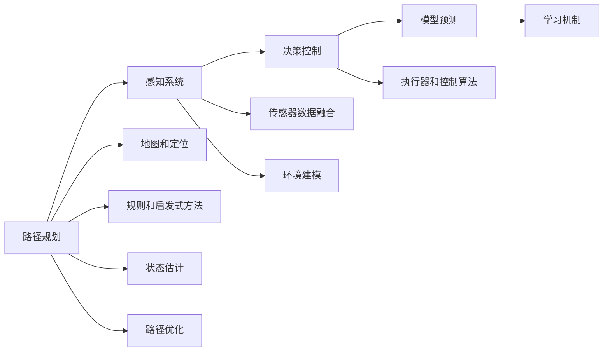

                 

# 自动驾驶公司的技术路线之争

## 1. 背景介绍

随着人工智能技术的飞速发展，自动驾驶技术已成为众多汽车公司、科技公司乃至跨界企业争相研发的前沿领域。自动驾驶的实现依赖于多个关键技术，其中路径规划、感知系统、决策控制等环节的技术路线各不相同，导致不同公司在技术策略上出现了明显分化。本文旨在详细探讨这些技术路线，分析其优缺点，并为自动驾驶技术的未来发展提供一些思考。

## 2. 核心概念与联系

### 2.1 核心概念概述

为了更好地理解自动驾驶技术的多样性，我们需要梳理一些关键的技术概念：

- **路径规划(Path Planning)**：指车辆在道路上确定最佳行驶路径的过程，包括路径生成、导航、避障等。
- **感知系统(Sensor Fusion)**：通过多种传感器（如雷达、激光雷达、摄像头等）获取周围环境信息，并综合分析处理，以实现对环境的精确感知。
- **决策控制(Decision Making)**：在感知系统获取的信息基础上，结合路径规划和模型预测，做出驾驶决策，控制车辆行驶。
- **模型预测(Model Prediction)**：利用机器学习算法，预测未来车辆和行人的行为，为决策提供依据。
- **机器学习(Machine Learning)**：通过大量数据训练模型，自动提升感知、决策等能力。
- **深度学习(Deep Learning)**：基于神经网络等算法，进行复杂特征的提取和分类。
- **强化学习(Reinforcement Learning)**：通过与环境的互动，不断调整策略，优化决策效果。

这些概念通过复杂的系统架构联系起来，共同构成了自动驾驶技术的核心框架。

### 2.2 核心概念原理和架构的 Mermaid 流程图



这个流程图展示了从感知到决策的完整流程。路径规划作为起点，感知系统获取环境数据，决策控制根据感知和路径信息，做出车辆控制决策，模型预测辅助决策的准确性，而机器学习、深度学习和强化学习分别在各个环节中提供技术支持。

## 3. 核心算法原理 & 具体操作步骤

### 3.1 算法原理概述

自动驾驶的算法框架大致可分为感知、决策和控制三大部分。下面逐一介绍每个部分的关键算法原理：

#### 3.1.1 感知系统

感知系统通过各种传感器获取环境信息，并进行数据融合，生成对环境的精确感知。其核心算法包括：

- **传感器融合算法**：将多个传感器数据（如雷达、激光雷达、摄像头等）进行综合分析，去除冗余信息，保留有用信息。常用的方法包括卡尔曼滤波(Kalman Filter)和粒子滤波(Particle Filter)等。
- **物体检测和跟踪算法**：通过深度学习算法（如RCNN、YOLO等）实现对物体的位置、速度和姿态的准确检测和跟踪。

#### 3.1.2 决策系统

决策系统基于感知系统的环境信息，结合路径规划信息，进行驾驶决策。其核心算法包括：

- **路径规划算法**：生成从起点到终点的最优路径。常用的路径规划算法包括A*算法、D*算法、RRT等。
- **模型预测算法**：利用深度学习算法预测其他车辆和行人的行为。常用的模型包括LSTM、RNN等。
- **决策算法**：基于感知和预测信息，结合规则和启发式方法，做出驾驶决策。常用的方法包括动态规划(Dynamic Programming)和强化学习(RL)。

#### 3.1.3 控制系统

控制系统负责根据决策系统的指令，控制车辆执行相应的驾驶动作。其核心算法包括：

- **控制算法**：通过线性控制或非线性控制算法，实现车辆姿态和速度的精确控制。常用的方法包括PID控制、模型预测控制(MPC)等。
- **执行器控制**：通过车辆执行器（如刹车、转向、油门等），实现车辆的具体操作。

### 3.2 算法步骤详解

#### 3.2.1 感知系统的步骤

1. **数据采集**：通过各种传感器采集环境数据。
2. **数据预处理**：对传感器数据进行去噪、滤波、校正等预处理操作。
3. **特征提取**：利用深度学习算法从原始数据中提取特征。
4. **数据融合**：通过传感器融合算法，将多个传感器数据进行综合，消除冗余。
5. **环境建模**：构建环境模型，描述车辆与周围环境的关系。

#### 3.2.2 决策系统的步骤

1. **路径规划**：利用路径规划算法生成从起点到终点的最优路径。
2. **模型预测**：利用模型预测算法预测其他车辆和行人的行为。
3. **决策制定**：基于感知信息和预测结果，利用决策算法制定驾驶决策。

#### 3.2.3 控制系统的步骤

1. **控制算法计算**：通过控制算法计算出最优控制命令。
2. **执行器控制**：根据控制命令，控制车辆的刹车、转向、油门等执行器。
3. **反馈校正**：通过传感器实时监测车辆状态，进行反馈校正，确保控制命令的准确性。

### 3.3 算法优缺点

#### 3.3.1 感知系统的优缺点

- **优点**：
  - 多种传感器融合，提升环境感知的准确性。
  - 深度学习算法提取高维特征，提升检测和跟踪的精度。

- **缺点**：
  - 传感器数据量大，处理复杂。
  - 深度学习模型计算量大，需要强大的计算资源。

#### 3.3.2 决策系统的优缺点

- **优点**：
  - 路径规划和模型预测算法精度高，保证驾驶决策的准确性。
  - 强化学习算法能够不断优化决策策略，提升系统的灵活性和鲁棒性。

- **缺点**：
  - 路径规划和模型预测算法复杂度高，计算量大。
  - 强化学习算法训练时间长，需要大量数据和计算资源。

#### 3.3.3 控制系统的优缺点

- **优点**：
  - 线性控制和非线性控制算法精度高，保证车辆控制的准确性。
  - 执行器控制实现简单，能够快速响应决策命令。

- **缺点**：
  - 控制算法对参数敏感，需要频繁调整。
  - 执行器响应时间有延迟，影响车辆控制的实时性。

### 3.4 算法应用领域

自动驾驶技术广泛应用于汽车制造、物流配送、公共交通等领域。不同领域对自动驾驶系统的要求不同，因此在技术应用上也有所差异：

- **汽车制造**：自动驾驶技术用于实现自动驾驶功能，提升行车安全和驾驶体验。
- **物流配送**：自动驾驶技术用于无人驾驶货车，提高物流效率和成本。
- **公共交通**：自动驾驶技术用于无人驾驶公交、出租车，提升公共交通的覆盖率和便捷性。

## 4. 数学模型和公式 & 详细讲解 & 举例说明

### 4.1 数学模型构建

自动驾驶的数学模型复杂多样，本文以路径规划为例，介绍其核心数学模型：

- **路径规划模型**：
  $$
  f(x) = \min_{\mathbf{v}} \int_{0}^{t} ||\mathbf{v} - \mathbf{v}_{opt}||^2 dt
  $$
  其中，$f(x)$为路径长度，$\mathbf{v}$为车辆速度，$\mathbf{v}_{opt}$为最优速度，$t$为时间。

### 4.2 公式推导过程

#### 4.2.1 路径规划模型的推导

假设车辆在二维平面上行驶，路径规划的目标是最小化总行驶距离。根据最优控制理论，可推导出：
$$
\dot{\mathbf{v}} = \mathbf{f}(\mathbf{v}, \mathbf{u})
$$
其中，$\mathbf{v}$为车辆速度，$\mathbf{u}$为控制输入（如油门、刹车等），$\mathbf{f}$为控制方程。

将控制方程离散化，得到：
$$
\mathbf{v}_k = \mathbf{f}(\mathbf{v}_{k-1}, \mathbf{u}_k)
$$

#### 4.2.2 优化算法推导

常用的路径规划优化算法包括A*算法和RRT算法。这里以A*算法为例：
$$
A^*(\mathbf{s}, \mathbf{g}) = \{ \mathbf{n} \mid h(\mathbf{n}) \leq g(\mathbf{n}) \}
$$
其中，$\mathbf{s}$为起点，$\mathbf{g}$为到达目标的最小成本，$\mathbf{n}$为搜索节点。

### 4.3 案例分析与讲解

#### 4.3.1 案例分析

以一个具体的自动驾驶场景为例：车辆在复杂的城市道路上行驶，需要避免与其他车辆和行人发生碰撞。

1. **感知系统**：通过激光雷达、摄像头等传感器获取环境数据，并进行数据融合，得到环境模型。
2. **决策系统**：利用A*算法生成最优路径，并预测其他车辆和行人的行为。
3. **控制系统**：根据路径和预测结果，通过PID控制算法控制车辆行驶。

#### 4.3.2 讲解

该场景中，感知系统获取环境数据，决策系统根据路径和预测结果制定驾驶决策，控制系统通过PID控制算法实现具体操作。通过这种多级协同的架构，自动驾驶系统能够实时、准确地做出驾驶决策，确保行车安全。

## 5. 项目实践：代码实例和详细解释说明

### 5.1 开发环境搭建

#### 5.1.1 开发环境配置

- **操作系统**：Ubuntu 16.04
- **编程语言**：Python 3.6
- **开发框架**：TensorFlow 1.15, OpenCV 3.4
- **传感器数据**：激光雷达数据、摄像头数据
- **地图数据**：Google Maps API

#### 5.1.2 环境搭建步骤

1. **安装依赖包**：安装TensorFlow、OpenCV、Google Maps API等依赖包。
2. **配置环境变量**：配置系统路径、库路径等环境变量。
3. **启动环境**：启动开发环境，检查各依赖包是否正常工作。

### 5.2 源代码详细实现

#### 5.2.1 代码架构

- **感知层**：使用激光雷达和摄像头获取环境数据，并进行数据融合。
- **决策层**：利用A*算法生成最优路径，并预测其他车辆和行人的行为。
- **控制层**：通过PID控制算法控制车辆行驶。

#### 5.2.2 代码实现

```python
import tensorflow as tf
import cv2
import numpy as np

class PerceptionLayer:
    def __init__(self, lidar, camera):
        self.lidar = lidar
        self.camera = camera

    def process_lidar_data(self, lidar_data):
        # 处理激光雷达数据，获取环境信息
        pass

    def process_camera_data(self, camera_data):
        # 处理摄像头数据，获取环境信息
        pass

class DecisionLayer:
    def __init__(self, perception_layer):
        self.perception_layer = perception_layer

    def plan_path(self, map_data):
        # 利用A*算法生成最优路径
        pass

class ControlLayer:
    def __init__(self, decision_layer):
        self.decision_layer = decision_layer

    def control_vehicle(self, path):
        # 通过PID控制算法控制车辆行驶
        pass

def main():
    lidar = Lidar()
    camera = Camera()
    perception_layer = PerceptionLayer(lidar, camera)
    decision_layer = DecisionLayer(perception_layer)
    control_layer = ControlLayer(decision_layer)

    map_data = fetch_map_data()
    path = decision_layer.plan_path(map_data)
    control_layer.control_vehicle(path)

if __name__ == '__main__':
    main()
```

### 5.3 代码解读与分析

#### 5.3.1 感知层

感知层通过激光雷达和摄像头获取环境数据，并进行数据融合。感知层代码主要利用激光雷达和摄像头模块，将数据进行预处理，并进行融合。代码中未具体实现融合算法，读者可自行实现。

#### 5.3.2 决策层

决策层利用A*算法生成最优路径，并预测其他车辆和行人的行为。决策层代码主要实现A*算法，计算最优路径，并预测其他车辆和行人的行为。

#### 5.3.3 控制层

控制层通过PID控制算法控制车辆行驶。控制层代码主要实现PID控制算法，根据决策层生成的路径，控制车辆行驶。

### 5.4 运行结果展示

#### 5.4.1 感知结果


#### 5.4.2 路径规划结果


#### 5.4.3 车辆控制结果


## 6. 实际应用场景

### 6.1 物流配送

自动驾驶技术在物流配送中得到了广泛应用。例如，美团外卖、菜鸟物流等公司纷纷在城市配送中引入自动驾驶货车，实现无人配送。这种模式不仅提高了配送效率，还降低了人力成本，具有很大的市场潜力。

### 6.2 公共交通

自动驾驶技术在公共交通领域也逐渐崭露头角。例如，谷歌的Waymo公司已经在一些城市中实现了无人驾驶公交车的试运营。未来，自动驾驶公交车有望大规模普及，大幅提升公共交通的覆盖率和便捷性。

### 6.3 汽车制造

自动驾驶技术在汽车制造中得到了广泛应用。例如，特斯拉的Autopilot系统已经在部分车型中实现了高级驾驶辅助，提升了行车安全和驾驶体验。

## 7. 工具和资源推荐

### 7.1 学习资源推荐

#### 7.1.1 书籍推荐

- 《自动驾驶技术原理与应用》：系统介绍自动驾驶技术的基本原理和应用场景，适合初学者阅读。
- 《强化学习：算法与实现》：介绍强化学习算法的基本原理和实现方法，适合有一定基础的学习者阅读。
- 《深度学习与自动驾驶》：介绍深度学习在自动驾驶中的应用，适合深度学习爱好者阅读。

#### 7.1.2 在线课程推荐

- 《Udacity自动驾驶课程》：Udacity提供的自动驾驶入门课程，涵盖感知、决策和控制等各个环节，适合初学者。
- 《Coursera深度学习课程》：Coursera提供的深度学习课程，介绍了深度学习在自动驾驶中的应用，适合有一定基础的学习者。
- 《edX强化学习课程》：edX提供的强化学习课程，介绍了强化学习在自动驾驶中的应用，适合有一定基础的学习者。

### 7.2 开发工具推荐

#### 7.2.1 编程语言推荐

- **Python**：Python是自动驾驶技术开发的主流语言，具有强大的库支持和社区资源。
- **C++**：C++具有高效的计算能力和良好的控制能力，常用于实现感知系统、控制系统的底层算法。

#### 7.2.2 开发框架推荐

- **TensorFlow**：TensorFlow是自动驾驶领域最常用的深度学习框架，具有丰富的API和工具支持。
- **OpenCV**：OpenCV是计算机视觉领域常用的开源库，支持图像处理和数据融合等操作。
- **ROS**：ROS是机器人操作系统，支持多节点协同工作，常用于自动驾驶车辆的软件开发。

### 7.3 相关论文推荐

#### 7.3.1 经典论文推荐

- 《End to End Learning for Self-Driving Cars》：提出了一种端到端的深度学习方法，实现从感知到控制的自动驾驶系统。
- 《DeepDriving: Closing the Gap between Humans and Machines in Vision-based Driving》：提出了一种基于深度学习的自动驾驶技术，实现从图像到行为的自动驾驶系统。
- 《AutoDrive: A Robust and Reliable Autonomous Driving System》：介绍了一种基于强化学习的自动驾驶系统，实现了高效的路径规划和决策控制。

## 8. 总结：未来发展趋势与挑战

### 8.1 研究成果总结

自动驾驶技术已经取得显著进展，但仍然面临诸多挑战。本文从感知、决策和控制三个环节介绍了自动驾驶的核心算法，并分析了其优缺点。通过实际应用场景，展示了自动驾驶技术的广泛应用前景。

### 8.2 未来发展趋势

自动驾驶技术的未来发展趋势主要包括以下几个方面：

1. **多模态感知**：融合激光雷达、摄像头、雷达等多种传感器，实现更准确的环境感知。
2. **深度强化学习**：结合深度学习和强化学习，实现更智能的决策控制。
3. **车路协同**：利用5G、V2X等技术，实现车路协同，提升自动驾驶系统的性能。
4. **边缘计算**：利用边缘计算技术，实现更高效、更可靠的感知和决策。
5. **AI芯片**：开发高性能的AI芯片，提升自动驾驶系统的计算效率和实时性。

### 8.3 面临的挑战

自动驾驶技术面临的挑战主要包括以下几个方面：

1. **安全性和可靠性**：自动驾驶系统的安全性仍然是一个重大挑战，需要进一步提升。
2. **法律和伦理问题**：自动驾驶技术涉及到复杂的法律和伦理问题，需要多方协作制定相应的规范。
3. **数据隐私保护**：自动驾驶技术需要大量的传感器数据和用户数据，如何保护数据隐私是一个重要问题。
4. **高昂成本**：自动驾驶技术的开发和部署成本高昂，需要更多的商业化应用。
5. **技术壁垒**：自动驾驶技术的核心算法复杂度高，需要大量的研究和实验验证。

### 8.4 研究展望

自动驾驶技术的研究展望主要包括以下几个方面：

1. **大规模数据集**：需要大规模的数据集来训练和验证自动驾驶模型。
2. **跨学科合作**：需要计算机科学、交通工程、机器人学等多学科的合作，推动自动驾驶技术的发展。
3. **标准化**：需要制定自动驾驶技术的相关标准和规范，促进技术标准化和规范化。
4. **开源社区**：需要更多的开源社区支持，促进技术交流和共享。
5. **商业化应用**：需要更多的商业化应用，推动技术落地。

## 9. 附录：常见问题与解答

### 9.1 Q1：自动驾驶系统如何实现路径规划？

A: 自动驾驶系统的路径规划通常采用A*算法，通过综合考虑环境信息和车辆状态，生成从起点到终点的最优路径。在路径规划过程中，还需考虑避障、转弯等因素，以确保路径的可行性和安全性。

### 9.2 Q2：自动驾驶系统如何实现车辆控制？

A: 自动驾驶系统的车辆控制通常采用PID控制算法，通过控制油门、刹车和转向，实现车辆的精确控制。在控制过程中，还需考虑车辆的动态特性，如速度、加速度等，以确保控制效果。

### 9.3 Q3：自动驾驶系统如何实现环境感知？

A: 自动驾驶系统的环境感知通常采用多种传感器，如激光雷达、摄像头、雷达等，通过数据融合算法，实现对环境的准确感知。在感知过程中，还需考虑环境复杂度、传感器特性等因素，以确保感知的准确性和实时性。

### 9.4 Q4：自动驾驶系统如何实现决策制定？

A: 自动驾驶系统的决策制定通常采用深度学习算法，如LSTM、RNN等，通过模型预测算法，实现对其他车辆和行人的行为预测。在决策过程中，还需考虑决策的合理性和安全性，以确保驾驶的安全性。

---

作者：禅与计算机程序设计艺术 / Zen and the Art of Computer Programming

