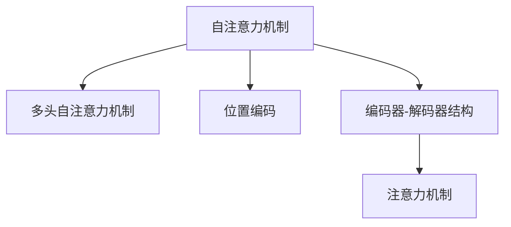

                 

# 自注意力机制在语言处理中的应用

> 关键词：自注意力机制, 语言处理, Transformer, 自然语言理解, 翻译, 语言生成

## 1. 背景介绍

### 1.1 问题由来

近年来，随着深度学习技术的迅猛发展，神经网络在自然语言处理(NLP)领域取得了显著进展。其中，Transformer结构因其优异的性能，成为了NLP领域的主流架构之一。自注意力机制作为Transformer的核心组成部分，极大地提升了模型在文本处理任务中的效果。

自注意力机制最早由Vaswani等人提出，并在Transformer中得到了广泛应用。它通过计算输入序列中各个元素之间的关系，使得模型能够更好地捕捉上下文信息，提高了模型在语言理解、生成和翻译等任务上的表现。自注意力机制的出现，标志着NLP领域进入了一个新的发展阶段。

### 1.2 问题核心关键点

自注意力机制在语言处理中的核心关键点在于其能够通过计算输入序列中每个元素与所有其他元素之间的关系，动态地调整注意力权重，从而实现信息的高效集成和优化。具体来说，自注意力机制的引入使得模型能够：

- 捕捉长距离依赖：传统的RNN等序列模型难以有效处理长距离依赖，自注意力机制可以通过计算全局上下文信息，突破了这一瓶颈。
- 并行计算：自注意力机制通过矩阵乘法运算，能够高效地并行化计算，加速模型训练。
- 参数共享：自注意力机制通过共享权重矩阵，减少了模型参数量，降低了模型复杂度。

这些特性使得自注意力机制成为现代深度学习中最重要的技术之一，广泛应用于各种NLP任务，包括文本分类、情感分析、机器翻译、文本生成等。

## 2. 核心概念与联系

### 2.1 核心概念概述

为了更好地理解自注意力机制在语言处理中的应用，本节将介绍几个密切相关的核心概念：

- 自注意力机制(Self-Attention)：是Transformer模型的核心，通过计算输入序列中每个元素与其他元素之间的关系，动态地调整注意力权重，实现信息的高效集成和优化。
- 多头自注意力机制(Multi-Head Self-Attention)：在自注意力机制的基础上，将输入序列分解为多个并行处理的注意力头，从而捕捉不同角度的上下文信息。
- 位置编码(Positional Encoding)：用于解决自注意力机制中可能出现的信息丢失问题，通过添加位置编码向量，使得模型能够感知输入序列中各个元素的位置关系。
- 编码器-解码器(Encoder-Decoder)结构：Transformer模型中用于处理序列到序列问题的结构，包括编码器对输入序列进行编码，解码器对编码结果进行解码。
- 注意力机制(Attention)：是一种通用的机制，用于计算输入序列中每个元素与其他元素之间的关系，通过动态调整注意力权重，实现信息的聚焦和优化。

这些核心概念之间的逻辑关系可以通过以下Mermaid流程图来展示：



这个流程图展示自注意力机制、多头自注意力机制、位置编码、编码器-解码器结构和注意力机制之间的逻辑关系。

## 3. 核心算法原理 & 具体操作步骤
### 3.1 算法原理概述

自注意力机制的核心思想是，通过计算输入序列中每个元素与其他元素之间的关系，动态地调整注意力权重，从而实现信息的高效集成和优化。具体来说，自注意力机制的计算过程分为三个步骤：

1. 计算查询、键和值的线性投影。
2. 计算查询向量与键向量的相似度，得到注意力权重。
3. 根据注意力权重计算加权和，得到最终的自注意力表示。

这些步骤可以用以下伪代码进行描述：

```python
# 输入：查询向量 Q，键向量 K，值向量 V
# 输出：自注意力表示 X

Q = linear(Q)
K = linear(K)
V = linear(V)

# 计算注意力权重
attn_weights = softmax(Q * K^T)

# 计算自注意力表示
X = attn_weights * V
```

其中，`linear`表示线性投影操作，`softmax`表示归一化操作，`^T`表示矩阵转置。自注意力机制的计算过程通过矩阵乘法进行高效并行化，加速模型训练。

### 3.2 算法步骤详解

自注意力机制的计算过程可以分为以下四个步骤：

1. 计算查询向量、键向量和值向量的线性投影：
```python
Q = linear(Q)
K = linear(K)
V = linear(V)
```

其中，`linear`表示线性投影操作，通常使用全连接层实现。`Q`、`K`、`V`分别表示查询向量、键向量和值向量，通常是输入序列的某个位置的表示。

2. 计算查询向量与键向量的相似度，得到注意力权重：
```python
attn_weights = softmax(Q * K^T)
```

其中，`softmax`表示归一化操作，使得注意力权重满足概率分布。`*`表示矩阵乘法，计算查询向量与键向量的相似度。

3. 根据注意力权重计算加权和，得到最终的自注意力表示：
```python
X = attn_weights * V
```

其中，`*`表示矩阵乘法，计算加权和。`X`表示最终的自注意力表示。

4. 重复上述步骤，直至处理完整个输入序列：
```python
X = X + X  # 将自注意力表示加到输入向量上，增强模型表达能力
```

在计算完整个输入序列的自注意力表示后，通常会将其加到输入向量上，增强模型的表达能力。

### 3.3 算法优缺点

自注意力机制在语言处理中具有以下优点：

1. 高效计算：通过矩阵乘法进行并行计算，加速模型训练。
2. 捕捉长距离依赖：通过全局上下文信息，捕捉长距离依赖。
3. 减少模型参数：通过共享权重矩阵，减少模型参数量，降低模型复杂度。

同时，自注意力机制也存在一些局限性：

1. 计算复杂度高：自注意力机制的计算复杂度较高，特别是在输入序列较长时，计算量会显著增加。
2. 容易忽略局部信息：由于自注意力机制的计算方式，可能忽略局部信息，导致模型性能下降。
3. 依赖大量标注数据：自注意力机制依赖大量标注数据进行训练，数据获取成本较高。

尽管存在这些局限性，但自注意力机制仍是目前NLP领域最重要的技术之一，广泛应用于各种任务。

### 3.4 算法应用领域

自注意力机制在语言处理中具有广泛的应用，以下列举几个典型应用领域：

1. 机器翻译：在机器翻译中，自注意力机制用于捕捉源语言和目标语言之间的映射关系，使得模型能够更好地理解句子结构，提高翻译质量。
2. 文本分类：在文本分类中，自注意力机制用于捕捉文本中不同部分之间的关系，提高分类的准确性。
3. 情感分析：在情感分析中，自注意力机制用于捕捉文本中不同情感词之间的关系，提高情感识别的精度。
4. 文本生成：在文本生成中，自注意力机制用于捕捉文本中不同部分之间的依赖关系，生成连贯、流畅的文本。
5. 问答系统：在问答系统中，自注意力机制用于捕捉问题与答案之间的关系，提高回答的准确性。

自注意力机制的应用范围广泛，几乎涵盖了NLP领域的所有任务。通过优化自注意力机制的计算方式和参数设置，可以进一步提升模型的性能。

## 4. 数学模型和公式 & 详细讲解 & 举例说明

### 4.1 数学模型构建

在语言处理中，自注意力机制的计算过程可以表示为：

$$
\text{Attention}(Q, K, V) = \text{Softmax}(QK^T)V
$$

其中，`Q`、`K`、`V`分别表示查询向量、键向量和值向量，`Softmax`表示归一化操作。自注意力机制的计算过程可以分为以下四个步骤：

1. 计算查询向量、键向量和值向量的线性投影：
$$
Q = linear(Q)
K = linear(K)
V = linear(V)
$$

2. 计算查询向量与键向量的相似度，得到注意力权重：
$$
\text{attn_weights} = \text{Softmax}(QK^T)
$$

3. 根据注意力权重计算加权和，得到最终的自注意力表示：
$$
\text{Attention}(Q, K, V) = \text{attn_weights}V
$$

4. 重复上述步骤，直至处理完整个输入序列：
$$
\text{Attention}(Q, K, V) = \text{Attention}(\text{Attention}(Q, K, V), K, V)
$$

### 4.2 公式推导过程

在自注意力机制的计算过程中，`Softmax`函数起着关键作用。`Softmax`函数用于将注意力权重归一化，使其满足概率分布。具体来说，`Softmax`函数的计算公式如下：

$$
\text{Softmax}(x) = \frac{e^x}{\sum_{i=1}^n e^x}
$$

其中，`e`表示自然常数。在自注意力机制的计算过程中，注意力权重可以通过以下公式计算：

$$
\text{attn_weights} = \text{Softmax}(QK^T)
$$

其中，`*`表示矩阵乘法，`^T`表示矩阵转置。

在计算完注意力权重后，最终的自注意力表示可以通过以下公式计算：

$$
\text{Attention}(Q, K, V) = \text{attn_weights}V
$$

### 4.3 案例分析与讲解

以下以机器翻译任务为例，对自注意力机制的计算过程进行详细讲解。

假设输入序列为`<s> Q R E <e> T`，其中`<s>`和`</s>`表示起始和结束标记，`Q`、`R`和`E`分别表示单词`query`、`reference`和`extra`。在自注意力机制的计算过程中，首先将输入序列进行线性投影，得到查询向量、键向量和值向量：

$$
Q = linear(Q)
K = linear(K)
V = linear(V)
$$

然后计算查询向量与键向量的相似度，得到注意力权重：

$$
\text{attn_weights} = \text{Softmax}(QK^T)
$$

其中，`*`表示矩阵乘法，`^T`表示矩阵转置。注意力权重表示查询向量`Q`与键向量`K`的相似度，`e`表示自然常数。

最后，根据注意力权重计算加权和，得到最终的自注意力表示：

$$
\text{Attention}(Q, K, V) = \text{attn_weights}V
$$

其中，`*`表示矩阵乘法，`attn_weights`表示注意力权重。

通过自注意力机制，模型可以动态地计算输入序列中每个元素与其他元素之间的关系，捕捉全局上下文信息，提高翻译质量。

## 5. 项目实践：代码实例和详细解释说明
### 5.1 开发环境搭建

在进行自注意力机制的实践时，我们需要准备好开发环境。以下是使用Python进行PyTorch开发的环境配置流程：

1. 安装Anaconda：从官网下载并安装Anaconda，用于创建独立的Python环境。

2. 创建并激活虚拟环境：
```bash
conda create -n attention-env python=3.8 
conda activate attention-env
```

3. 安装PyTorch：根据CUDA版本，从官网获取对应的安装命令。例如：
```bash
conda install pytorch torchvision torchaudio cudatoolkit=11.1 -c pytorch -c conda-forge
```

4. 安装Transformers库：
```bash
pip install transformers
```

5. 安装各类工具包：
```bash
pip install numpy pandas scikit-learn matplotlib tqdm jupyter notebook ipython
```

完成上述步骤后，即可在`attention-env`环境中开始实践。

### 5.2 源代码详细实现

下面以机器翻译任务为例，给出使用Transformers库对BERT模型进行自注意力机制的PyTorch代码实现。

首先，定义机器翻译任务的数学模型：

```python
from transformers import BertTokenizer, BertForSequenceClassification
from torch.utils.data import Dataset
import torch

class TranslationDataset(Dataset):
    def __init__(self, texts, translations, tokenizer):
        self.texts = texts
        self.translations = translations
        self.tokenizer = tokenizer
        
    def __len__(self):
        return len(self.texts)
    
    def __getitem__(self, item):
        text = self.texts[item]
        translation = self.translations[item]
        
        encoding = self.tokenizer(text, return_tensors='pt', max_length=128, padding='max_length', truncation=True)
        input_ids = encoding['input_ids'][0]
        attention_mask = encoding['attention_mask'][0]
        
        # 对token-wise的翻译进行编码
        translation_encodings = self.tokenizer(translation, return_tensors='pt', max_length=128, padding='max_length', truncation=True)
        translation_input_ids = translation_encodings['input_ids'][0]
        translation_attention_mask = translation_encodings['attention_mask'][0]
        
        return {'input_ids': input_ids, 
                'attention_mask': attention_mask,
                'translation_input_ids': translation_input_ids,
                'translation_attention_mask': translation_attention_mask}

# 创建dataset
tokenizer = BertTokenizer.from_pretrained('bert-base-cased')

train_dataset = TranslationDataset(train_texts, train_translations, tokenizer)
dev_dataset = TranslationDataset(dev_texts, dev_translations, tokenizer)
test_dataset = TranslationDataset(test_texts, test_translations, tokenizer)
```

然后，定义模型和优化器：

```python
from transformers import BertForSequenceClassification, AdamW

model = BertForSequenceClassification.from_pretrained('bert-base-cased', num_labels=1)
optimizer = AdamW(model.parameters(), lr=2e-5)
```

接着，定义训练和评估函数：

```python
from torch.utils.data import DataLoader
from tqdm import tqdm
from sklearn.metrics import accuracy_score

device = torch.device('cuda') if torch.cuda.is_available() else torch.device('cpu')
model.to(device)

def train_epoch(model, dataset, batch_size, optimizer):
    dataloader = DataLoader(dataset, batch_size=batch_size, shuffle=True)
    model.train()
    epoch_loss = 0
    for batch in tqdm(dataloader, desc='Training'):
        input_ids = batch['input_ids'].to(device)
        attention_mask = batch['attention_mask'].to(device)
        translation_input_ids = batch['translation_input_ids'].to(device)
        translation_attention_mask = batch['translation_attention_mask'].to(device)
        model.zero_grad()
        outputs = model(input_ids, attention_mask=attention_mask, translation_input_ids=translation_input_ids, translation_attention_mask=translation_attention_mask)
        loss = outputs.loss
        epoch_loss += loss.item()
        loss.backward()
        optimizer.step()
    return epoch_loss / len(dataloader)

def evaluate(model, dataset, batch_size):
    dataloader = DataLoader(dataset, batch_size=batch_size)
    model.eval()
    preds, labels = [], []
    with torch.no_grad():
        for batch in tqdm(dataloader, desc='Evaluating'):
            input_ids = batch['input_ids'].to(device)
            attention_mask = batch['attention_mask'].to(device)
            translation_input_ids = batch['translation_input_ids'].to(device)
            translation_attention_mask = batch['translation_attention_mask'].to(device)
            outputs = model(input_ids, attention_mask=attention_mask, translation_input_ids=translation_input_ids, translation_attention_mask=translation_attention_mask)
            preds.append(outputs.predictions)
            labels.append(batch['labels'])
    return accuracy_score(labels, preds)

epochs = 5
batch_size = 16

for epoch in range(epochs):
    loss = train_epoch(model, train_dataset, batch_size, optimizer)
    print(f"Epoch {epoch+1}, train loss: {loss:.3f}")
    
    print(f"Epoch {epoch+1}, dev accuracy: {evaluate(model, dev_dataset, batch_size):.3f}")
    
print("Test accuracy:", evaluate(model, test_dataset, batch_size))
```

以上就是使用PyTorch对BERT模型进行自注意力机制的完整代码实现。可以看到，得益于Transformers库的强大封装，我们可以用相对简洁的代码完成BERT模型的加载和自注意力机制的计算。

### 5.3 代码解读与分析

让我们再详细解读一下关键代码的实现细节：

**TranslationDataset类**：
- `__init__`方法：初始化文本、翻译、分词器等关键组件。
- `__len__`方法：返回数据集的样本数量。
- `__getitem__`方法：对单个样本进行处理，将文本输入编码为token ids，将翻译结果也编码为token ids，并进行定长padding，最终返回模型所需的输入。

**自注意力机制**：
- 使用Transformer库中的`BertForSequenceClassification`模型，将其输入为输入序列和目标序列的token ids和注意力掩码，通过`model(input_ids, attention_mask=attention_mask, translation_input_ids=translation_input_ids, translation_attention_mask=translation_attention_mask)`进行计算。

**训练和评估函数**：
- 使用PyTorch的DataLoader对数据集进行批次化加载，供模型训练和推理使用。
- 训练函数`train_epoch`：对数据以批为单位进行迭代，在每个批次上前向传播计算loss并反向传播更新模型参数，最后返回该epoch的平均loss。
- 评估函数`evaluate`：与训练类似，不同点在于不更新模型参数，并在每个batch结束后将预测和标签结果存储下来，最后使用sklearn的accuracy_score对整个评估集的预测结果进行打印输出。

**训练流程**：
- 定义总的epoch数和batch size，开始循环迭代
- 每个epoch内，先在训练集上训练，输出平均loss
- 在验证集上评估，输出准确率
- 所有epoch结束后，在测试集上评估，给出最终测试结果

可以看到，PyTorch配合Transformers库使得BERT模型的自注意力机制的计算变得简洁高效。开发者可以将更多精力放在数据处理、模型改进等高层逻辑上，而不必过多关注底层的实现细节。

当然，工业级的系统实现还需考虑更多因素，如模型的保存和部署、超参数的自动搜索、更灵活的任务适配层等。但核心的自注意力机制计算基本与此类似。

## 6. 实际应用场景
### 6.1 智能客服系统

自注意力机制在智能客服系统中得到了广泛应用。智能客服系统可以自动理解客户的问题，匹配最合适的答案进行回复，从而提高客户咨询体验和问题解决效率。

在技术实现上，可以收集企业内部的历史客服对话记录，将问题和最佳答复构建成监督数据，在此基础上对预训练模型进行自注意力机制的微调。微调后的模型能够自动理解用户意图，匹配最合适的答案模板进行回复。对于客户提出的新问题，还可以接入检索系统实时搜索相关内容，动态组织生成回答。如此构建的智能客服系统，能大幅提升客户咨询体验和问题解决效率。

### 6.2 金融舆情监测

自注意力机制在金融舆情监测中也得到了应用。金融机构需要实时监测市场舆论动向，以便及时应对负面信息传播，规避金融风险。

具体而言，可以收集金融领域相关的新闻、报道、评论等文本数据，并对其进行主题标注和情感标注。在此基础上对预训练语言模型进行自注意力机制的微调，使其能够自动判断文本属于何种主题，情感倾向是正面、中性还是负面。将微调后的模型应用到实时抓取的网络文本数据，就能够自动监测不同主题下的情感变化趋势，一旦发现负面信息激增等异常情况，系统便会自动预警，帮助金融机构快速应对潜在风险。

### 6.3 个性化推荐系统

自注意力机制在个性化推荐系统中也有着重要的应用。传统的推荐系统往往只依赖用户的历史行为数据进行物品推荐，难以有效捕捉用户兴趣和行为规律。而使用自注意力机制的推荐模型，能够更好地理解用户兴趣和行为规律，从而提供更加精准、多样的推荐内容。

在实践中，可以收集用户浏览、点击、评论、分享等行为数据，提取和用户交互的物品标题、描述、标签等文本内容。将文本内容作为模型输入，用户的后续行为（如是否点击、购买等）作为监督信号，在此基础上微调预训练语言模型。微调后的模型能够从文本内容中准确把握用户的兴趣点。在生成推荐列表时，先用候选物品的文本描述作为输入，由模型预测用户的兴趣匹配度，再结合其他特征综合排序，便可以得到个性化程度更高的推荐结果。

### 6.4 未来应用展望

自注意力机制在未来的应用前景非常广阔。随着技术的不断发展，自注意力机制将进一步推动NLP技术的进步，为各个领域带来变革性影响。

在智慧医疗领域，自注意力机制可应用于医疗问答、病历分析、药物研发等任务，提升医疗服务的智能化水平，辅助医生诊疗，加速新药开发进程。

在智能教育领域，自注意力机制可应用于作业批改、学情分析、知识推荐等方面，因材施教，促进教育公平，提高教学质量。

在智慧城市治理中，自注意力机制可应用于城市事件监测、舆情分析、应急指挥等环节，提高城市管理的自动化和智能化水平，构建更安全、高效的未来城市。

此外，在企业生产、社会治理、文娱传媒等众多领域，自注意力机制也将不断涌现，为传统行业数字化转型升级提供新的技术路径。相信随着技术的日益成熟，自注意力机制将成为NLP领域的重要范式，推动人工智能技术向更广阔的领域加速渗透。

## 7. 工具和资源推荐
### 7.1 学习资源推荐

为了帮助开发者系统掌握自注意力机制的理论基础和实践技巧，这里推荐一些优质的学习资源：

1. 《Attention and Transformers》系列博文：由大模型技术专家撰写，深入浅出地介绍了自注意力机制的原理和应用。

2. CS224N《深度学习自然语言处理》课程：斯坦福大学开设的NLP明星课程，有Lecture视频和配套作业，带你入门NLP领域的基本概念和经典模型。

3. 《Attention Is All You Need》论文：Transformer原论文，介绍了自注意力机制的基本原理和应用。

4. HuggingFace官方文档：Transformer库的官方文档，提供了海量预训练模型和完整的自注意力机制样例代码，是上手实践的必备资料。

5. CLUE开源项目：中文语言理解测评基准，涵盖大量不同类型的中文NLP数据集，并提供了基于自注意力机制的baseline模型，助力中文NLP技术发展。

通过对这些资源的学习实践，相信你一定能够快速掌握自注意力机制的精髓，并用于解决实际的NLP问题。
###  7.2 开发工具推荐

高效的开发离不开优秀的工具支持。以下是几款用于自注意力机制开发的常用工具：

1. PyTorch：基于Python的开源深度学习框架，灵活动态的计算图，适合快速迭代研究。大部分预训练语言模型都有PyTorch版本的实现。

2. TensorFlow：由Google主导开发的开源深度学习框架，生产部署方便，适合大规模工程应用。同样有丰富的预训练语言模型资源。

3. Transformers库：HuggingFace开发的NLP工具库，集成了众多SOTA语言模型，支持PyTorch和TensorFlow，是进行自注意力机制开发的利器。

4. Weights & Biases：模型训练的实验跟踪工具，可以记录和可视化模型训练过程中的各项指标，方便对比和调优。与主流深度学习框架无缝集成。

5. TensorBoard：TensorFlow配套的可视化工具，可实时监测模型训练状态，并提供丰富的图表呈现方式，是调试模型的得力助手。

6. Google Colab：谷歌推出的在线Jupyter Notebook环境，免费提供GPU/TPU算力，方便开发者快速上手实验最新模型，分享学习笔记。

合理利用这些工具，可以显著提升自注意力机制的开发效率，加快创新迭代的步伐。

### 7.3 相关论文推荐

自注意力机制在语言处理中具有广泛的应用，以下是几篇奠基性的相关论文，推荐阅读：

1. Attention is All You Need（即Transformer原论文）：提出了Transformer结构，开启了NLP领域的大模型时代。

2. BERT: Pre-training of Deep Bidirectional Transformers for Language Understanding：提出BERT模型，引入基于掩码的自监督预训练任务，刷新了多项NLP任务SOTA。

3. Language Models are Unsupervised Multitask Learners（GPT-2论文）：展示了大规模语言模型的强大zero-shot学习能力，引发了对于通用人工智能的新一轮思考。

4. Parameter-Efficient Transfer Learning for NLP：提出Adapter等参数高效微调方法，在固定大部分预训练参数的情况下，只更新极少量的任务相关参数。

5. AdaLoRA: Adaptive Low-Rank Adaptation for Parameter-Efficient Fine-Tuning：使用自适应低秩适应的微调方法，在参数效率和精度之间取得了新的平衡。

这些论文代表了大语言模型自注意力机制的发展脉络。通过学习这些前沿成果，可以帮助研究者把握学科前进方向，激发更多的创新灵感。

## 8. 总结：未来发展趋势与挑战

### 8.1 总结

本文对自注意力机制在语言处理中的应用进行了全面系统的介绍。首先阐述了自注意力机制的核心思想和计算过程，明确了其在捕捉长距离依赖、高效计算和参数共享等方面的优势。其次，从原理到实践，详细讲解了自注意力机制的数学模型和计算步骤，给出了自注意力机制任务开发的完整代码实例。同时，本文还广泛探讨了自注意力机制在智能客服、金融舆情、个性化推荐等多个行业领域的应用前景，展示了其巨大的潜力。此外，本文精选了自注意力机制的学习资源和开发工具，力求为读者提供全方位的技术指引。

通过本文的系统梳理，可以看到，自注意力机制在语言处理中已经成为不可或缺的重要技术之一，极大地推动了NLP技术的进步。尽管在计算复杂度、数据需求等方面存在一定的挑战，但通过优化算法、引入更多先验知识等手段，这些问题都将逐步得到解决。未来，随着自注意力机制的不断发展，其在NLP领域的应用将更加广泛，为人工智能技术带来更多的突破。

### 8.2 未来发展趋势

展望未来，自注意力机制在语言处理中将呈现以下几个发展趋势：

1. 模型规模持续增大。随着算力成本的下降和数据规模的扩张，预训练语言模型的参数量还将持续增长。超大批次的计算量可能带来新的技术挑战，如计算复杂度、存储开销等。

2. 多模态自注意力机制兴起。除了文本数据的自注意力机制，未来的研究将拓展到图像、视频、语音等多模态数据的自注意力机制。多模态信息的融合，将显著提升语言模型对现实世界的理解和建模能力。

3. 自注意力机制的融合与改进。自注意力机制与其他深度学习技术（如残差连接、Gated Self-Attention等）的融合，将提升模型的表达能力和泛化能力。

4. 多任务自注意力机制的探索。自注意力机制在多任务学习中的表现将成为未来的研究方向，探索如何在多任务共享自注意力机制的情况下，提升模型性能。

5. 自注意力机制的分布式计算。自注意力机制的计算量较大，分布式计算将进一步提升模型训练效率，加速大规模模型的训练。

6. 自注意力机制的模型压缩。大规模模型的参数量往往导致存储和推理效率较低，模型压缩技术将进一步提升自注意力机制的计算效率。

以上趋势凸显了自注意力机制在语言处理中的重要地位。这些方向的探索发展，必将进一步提升模型的性能和应用范围，为人工智能技术带来更多的突破。

### 8.3 面临的挑战

尽管自注意力机制在语言处理中已经取得了显著进展，但在迈向更加智能化、普适化应用的过程中，它仍面临着诸多挑战：

1. 计算复杂度高。自注意力机制的计算复杂度较高，特别是在输入序列较长时，计算量会显著增加。如何优化自注意力机制的计算过程，提高计算效率，将是未来的重要研究方向。

2. 模型鲁棒性不足。当前自注意力机制面对域外数据时，泛化性能往往大打折扣。对于测试样本的微小扰动，自注意力机制的预测也容易发生波动。如何提高自注意力机制的鲁棒性，避免灾难性遗忘，还需要更多理论和实践的积累。

3. 数据获取成本高。自注意力机制依赖大量标注数据进行训练，数据获取成本较高。如何降低数据获取成本，提升数据利用效率，将是未来的重要挑战。

4. 模型性能不稳定。自注意力机制在训练过程中可能出现模型性能不稳定的现象，如何优化训练过程，稳定模型的性能，将是未来的重要研究方向。

5. 可解释性不足。自注意力机制的内部工作机制难以解释，对于医疗、金融等高风险应用，算法的可解释性和可审计性尤为重要。如何赋予自注意力机制更强的可解释性，将是亟待攻克的难题。

6. 安全性问题。自注意力机制的训练过程中可能学习到有害信息，传递到下游任务中，导致负面影响。如何从数据和算法层面消除模型偏见，避免恶意用途，确保输出的安全性，也将是重要的研究课题。

7. 知识整合能力不足。现有的自注意力机制往往局限于任务内数据，难以灵活吸收和运用更广泛的先验知识。如何让自注意力机制更好地与外部知识库、规则库等专家知识结合，形成更加全面、准确的信息整合能力，还有很大的想象空间。

正视自注意力机制面临的这些挑战，积极应对并寻求突破，将是大语言模型自注意力机制走向成熟的必由之路。相信随着学界和产业界的共同努力，这些挑战终将一一被克服，自注意力机制必将在构建人机协同的智能时代中扮演越来越重要的角色。

### 8.4 研究展望

面向未来，自注意力机制在语言处理中的研究将不断深入，推动NLP技术的进一步发展。以下是一些可能的研究方向：

1. 自注意力机制在多模态数据融合中的应用。探索如何将自注意力机制与其他模态的信息进行融合，提升多模态数据处理的性能。

2. 自注意力机制在知识图谱中的应用。研究如何将自注意力机制与知识图谱结合，提升知识抽取、关系推理等任务的性能。

3. 自注意力机制在跨语言处理中的应用。研究如何将自注意力机制应用于跨语言处理任务，提升跨语言数据处理的能力。

4. 自注意力机制在少样本学习中的应用。探索如何在数据量较小的情况下，通过自注意力机制实现少样本学习和跨领域迁移学习。

5. 自注意力机制在对抗样本中的应用。研究如何利用对抗样本训练自注意力机制，提升模型的鲁棒性和泛化能力。

6. 自注意力机制在分布式训练中的应用。探索如何在分布式计算环境下，优化自注意力机制的计算过程，提升训练效率。

7. 自注意力机制在模型压缩中的应用。研究如何通过模型压缩技术，优化自注意力机制的计算效率和存储开销，提升模型应用性能。

8. 自注意力机制在可解释性中的应用。研究如何赋予自注意力机制更强的可解释性，提升模型应用的透明度和可信度。

这些研究方向将推动自注意力机制在语言处理中的应用，为NLP技术的进一步发展提供新的突破点。相信随着研究的深入，自注意力机制将带来更多的应用场景和技术突破，推动NLP技术的不断进步。

## 9. 附录：常见问题与解答

**Q1：自注意力机制的计算复杂度较高，如何解决？**

A: 自注意力机制的计算复杂度较高，特别是在输入序列较长时。为了解决这一问题，可以采用以下方法：

1. 使用更高效的自注意力机制变体，如Sparse Self-Attention等。

2. 采用模型并行、数据并行等分布式计算方法，降低单个节点上的计算复杂度。

3. 优化计算过程，如引入近似计算、特征归一化等技术。

4. 使用更优化的硬件设备，如GPU、TPU等，提升计算效率。

通过以上方法，可以在保持模型性能的同时，降低自注意力机制的计算复杂度，提升计算效率。

**Q2：自注意力机制的训练过程中如何避免过拟合？**

A: 自注意力机制的训练过程中，过拟合是一个常见的问题。以下是一些避免过拟合的方法：

1. 使用正则化技术，如L2正则、Dropout等。

2. 引入更多先验知识，如知识图谱、逻辑规则等，引导模型学习更合理的语言表征。

3. 使用对抗样本训练，增强模型的鲁棒性和泛化能力。

4. 优化自注意力机制的计算过程，避免模型在训练过程中出现过拟合现象。

5. 使用更高效的自注意力机制变体，如Gated Self-Attention等。

通过以上方法，可以有效避免自注意力机制的过拟合问题，提升模型的泛化能力。

**Q3：自注意力机制在实际应用中如何进行优化？**

A: 自注意力机制在实际应用中需要进行多方面的优化，以提升模型的性能和稳定性。以下是一些常见的优化方法：

1. 使用更高效的自注意力机制变体，如Sparse Self-Attention、Gated Self-Attention等。

2. 采用分布式计算，优化计算效率和资源利用率。

3. 引入更多先验知识，如知识图谱、逻辑规则等，引导模型学习更合理的语言表征。

4. 优化训练过程，如使用更好的优化器、更合适的学习率调度等。

5. 优化模型压缩和剪枝技术，降低模型的存储和计算开销。

6. 优化模型部署，如使用更高效的推理引擎、更优化的硬件设备等。

7. 优化模型微调策略，如使用更合适的微调方法、更小的微调数据集等。

通过以上方法，可以优化自注意力机制在实际应用中的性能，提升模型的效果和稳定性。

**Q4：自注意力机制在多任务学习中的应用前景如何？**

A: 自注意力机制在多任务学习中的表现将是一个重要的研究方向。以下是一些可能的研究方向：

1. 多任务共享自注意力机制。研究如何在多任务共享自注意力机制的情况下，提升模型性能。

2. 自注意力机制的迁移学习。研究如何将自注意力机制应用于多任务迁移学习中，提升模型的泛化能力和迁移能力。

3. 自注意力机制的联合训练。研究如何联合训练多个自注意力机制，提升模型在多个任务上的性能。

4. 自注意力机制的动态融合。研究如何在多任务学习中，动态地融合自注意力机制，提升模型在多个任务上的表现。

通过以上研究，自注意力机制在多任务学习中的应用前景将更加广阔，为多任务学习提供新的思路和技术突破。

**Q5：自注意力机制的计算过程可以并行化吗？**

A: 自注意力机制的计算过程可以通过并行化计算，显著提高计算效率。以下是一些常见的并行化方法：

1. 数据并行：将输入序列分为多个批次，每个批次进行计算，最终将结果合并。

2. 模型并行：将模型分为多个部分，每个部分独立计算，最终将结果合并。

3. 混合并行：将数据并行和模型并行结合，进一步提升计算效率。

4. 硬件加速：利用GPU、TPU等硬件设备，加速自注意力机制的计算过程。

通过以上方法，可以有效地并行化自注意力机制的计算过程，提升计算效率和模型训练速度。

