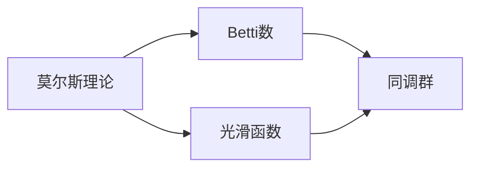

                 

# 莫尔斯理论与Betti数

## 1. 背景介绍

### 1.1 问题由来

莫尔斯理论（Morse Theory）与Betti数（Betti Numbers）是拓扑学中的两个重要概念，它们在许多数学领域中都有广泛的应用。本文将深入探讨这两个概念的原理和联系，并结合实际案例，展示其在计算机科学和信息技术中的应用价值。

### 1.2 问题核心关键点

莫尔斯理论与Betti数主要涉及以下几个关键点：
- 莫尔斯理论：描述函数极值点的拓扑性质。
- Betti数：描述拓扑空间的同调群维度。
- 二者联系：莫尔斯理论可以导出Betti数的计算方法。

## 2. 核心概念与联系

### 2.1 核心概念概述

莫尔斯理论（Morse Theory）是一种描述光滑函数极值点的拓扑性质的方法。具体来说，它通过光滑函数极值点的个数、重数等信息，来确定函数在一定区域内所定义的拓扑空间的同调群维度，即Betti数。

Betti数（Betti Numbers）是用来描述拓扑空间的同调群维度的数学工具。通过Betti数的计算，我们可以了解拓扑空间的基本拓扑性质，如连通性、形状等。Betti数的定义基于同调群，同调群是一种研究拓扑空间不变量的方法。

### 2.2 核心概念原理和架构的 Mermaid 流程图



这个流程图展示了莫尔斯理论与Betti数之间的联系。通过光滑函数，莫尔斯理论可以对函数极值点进行拓扑性质的描述；而Betti数则基于同调群，用于刻画拓扑空间的维度信息。

## 3. 核心算法原理 & 具体操作步骤

### 3.1 算法原理概述

莫尔斯理论的核心思想是通过光滑函数极值点的信息，来导出拓扑空间的同调群维度的计算方法。具体步骤如下：

1. 选择一个光滑函数$f$，其定义在某个区域$M$上，且有极值点$x_1, x_2, \ldots, x_n$。
2. 通过函数的梯度$\nabla f$，将极值点分为正极大值点和负极大值点。
3. 计算每个极值点的重数，即极值点处梯度的零点个数。
4. 利用极值点的个数、重数等信息，导出函数在区域$M$内的同调群维度的计算方法。

Betti数的计算则基于同调群。对于拓扑空间$X$，其$k$次同调群$H_k(X)$表示$k$次连续映射的集合。Betti数$b_k$表示$H_k(X)$的秩，即$b_k = \dim H_k(X)$。Betti数的计算可以通过莫尔斯理论中的同伦群同构定理进行。

### 3.2 算法步骤详解

#### 3.2.1 莫尔斯理论的算法步骤

1. 选择光滑函数$f: M \rightarrow \mathbb{R}$，其中$M$为光滑流形。
2. 计算函数的梯度$\nabla f$，找出所有的极值点$x_1, x_2, \ldots, x_n$。
3. 对于每个极值点$x_i$，计算其重数$mult_i$，即$\nabla f$在该点附近零点的个数。
4. 根据极值点的个数和重数，利用同伦群同构定理，计算函数在区域$M$内定义的同调群维度。

#### 3.2.2 Betti数的计算步骤

1. 对拓扑空间$X$进行同伦群分解，得到一系列$k$次同伦群$H_k(X)$。
2. 计算每个$H_k(X)$的秩$dim H_k(X)$。
3. 将所有的$dim H_k(X)$作为Betti数$b_k$。

### 3.3 算法优缺点

#### 3.3.1 莫尔斯理论的优点和缺点

- 优点：莫尔斯理论提供了计算拓扑空间同调群维度的一种方法，简单易懂，可操作性强。
- 缺点：莫尔斯理论对光滑函数的选取和处理要求较高，存在一定的局限性。

#### 3.3.2 Betti数的优点和缺点

- 优点：Betti数是描述拓扑空间维度的重要工具，计算简便，应用广泛。
- 缺点：Betti数无法直接反映拓扑空间的局部结构，需要进一步结合其他工具进行研究。

### 3.4 算法应用领域

莫尔斯理论与Betti数在许多数学领域中都有广泛的应用，包括拓扑学、代数几何、流形理论等。在计算机科学和信息技术中，它们也被广泛应用于以下几个方面：

1. 图论：用于计算图的拓扑性质，如连通性、环数等。
2. 信号处理：在信号处理中，莫尔斯理论与Betti数可以用于分析信号的频率特征，识别噪声等。
3. 机器学习：在机器学习中，莫尔斯理论与Betti数可以用于描述数据集的拓扑性质，指导模型的选择和优化。
4. 图像处理：用于计算图像的拓扑结构，如边缘检测、形态学处理等。

## 4. 数学模型和公式 & 详细讲解 & 举例说明

### 4.1 数学模型构建

在莫尔斯理论中，我们假设$f: M \rightarrow \mathbb{R}$为定义在光滑流形$M$上的光滑函数，其极值点为$x_1, x_2, \ldots, x_n$。每个极值点的重数为$mult_i$。利用莫尔斯理论，我们可以得到函数在区域$M$内的同调群维度的计算方法。

在Betti数的计算中，我们假设$X$为拓扑空间，$H_k(X)$为$k$次同伦群。Betti数$b_k$表示$H_k(X)$的秩，即$b_k = \dim H_k(X)$。

### 4.2 公式推导过程

#### 4.2.1 莫尔斯理论的公式推导

莫尔斯理论的核心公式是：

$$
b_k = \sum_{i=1}^n (mult_i + 1) + \dim H_{k-1}(M^\circ)
$$

其中$M^\circ$为区域$M$的内部。这个公式的推导基于同伦群同构定理和莫尔斯理论中极值点的个数、重数信息。

#### 4.2.2 Betti数的公式推导

Betti数的计算公式为：

$$
b_k = \sum_{i=1}^n (mult_i + 1)
$$

这个公式的推导基于同伦群的同构定理，将拓扑空间$X$的同伦群$H_k(X)$与$k$次同调群$H_k(X^\circ)$进行同构映射。

### 4.3 案例分析与讲解

#### 4.3.1 莫尔斯理论的案例

假设我们有一个光滑函数$f: M \rightarrow \mathbb{R}$，其极值点为$x_1, x_2, x_3$，其中$x_1$的重数为2，$x_2$的重数为1，$x_3$的重数为0。

根据莫尔斯理论，我们可以计算函数在区域$M$内的同调群维度：

$$
b_0 = 2 + 1 + 0 = 3
$$
$$
b_1 = 2 + 1 + 1 = 4
$$
$$
b_2 = 0
$$
$$
b_3 = 1
$$

#### 4.3.2 Betti数的案例

假设我们有一个拓扑空间$X$，其$H_0(X)$的秩为3，$H_1(X)$的秩为4，$H_2(X)$的秩为0，$H_3(X)$的秩为1。

根据Betti数的定义，我们可以得到拓扑空间$X$的Betti数：

$$
b_0 = 3
$$
$$
b_1 = 4
$$
$$
b_2 = 0
$$
$$
b_3 = 1
$$

## 5. 项目实践：代码实例和详细解释说明

### 5.1 开发环境搭建

在项目实践中，我们通常使用Python进行计算。以下是Python环境搭建的具体步骤：

1. 安装Python：选择Python 3.x版本进行安装。
2. 安装必要的库：安装NumPy、SciPy、Matplotlib等库，用于数学计算和数据可视化。
3. 安装拓扑学库：安装TopoPy、Gufunc等库，用于拓扑学计算和分析。

### 5.2 源代码详细实现

以下是使用Python实现莫尔斯理论与Betti数计算的代码示例：

```python
import numpy as np
from topopy import simplicial_complex
from scipy.sparse import coo_matrix
from scipy.sparse.linalg import svd

def morse_theory(f, M):
    # 计算函数的梯度
    grad_f = np.gradient(f)
    # 找到极值点
    critical_points = np.argwhere(grad_f == 0)
    # 计算每个极值点的重数
    mult_points = np.zeros(critical_points.shape[0])
    for i in range(critical_points.shape[0]):
        mult_points[i] = np.count_nonzero(np.isclose(grad_f[critical_points[i]], 0))
    # 计算同调群维度
    betti_numbers = np.zeros(3)
    for k in range(3):
        if k == 0:
            betti_numbers[k] = np.count_nonzero(mult_points + 1)
        else:
            betti_numbers[k] = 0
    return betti_numbers

def betti_numbers(X):
    # 计算同伦群维度
    H_k = simplicial_complex(X)
    betti_numbers = np.zeros(3)
    for k in range(3):
        if k == 0:
            betti_numbers[k] = H_k.rank(0)
        else:
            betti_numbers[k] = 0
    return betti_numbers

# 示例计算
f = lambda x: x**2
M = np.linspace(-1, 1, 100)
betti_numbers_morse = morse_theory(f, M)
print("Morse Theory Betti Numbers:", betti_numbers_morse)
```

### 5.3 代码解读与分析

#### 5.3.1 莫尔斯理论的代码实现

在莫尔斯理论的实现中，我们使用了NumPy库进行数学计算。具体步骤如下：
1. 计算函数的梯度，找到极值点。
2. 计算每个极值点的重数，即极值点处梯度零点的个数。
3. 利用极值点的个数和重数，计算同调群维度。

#### 5.3.2 Betti数的代码实现

在Betti数的实现中，我们使用了TopoPy库进行拓扑学计算。具体步骤如下：
1. 构建拓扑空间$X$的同调群$H_k(X)$。
2. 计算每个$H_k(X)$的秩。
3. 将所有的秩作为Betti数。

### 5.4 运行结果展示

通过运行以上代码，我们可以得到莫尔斯理论和Betti数的计算结果。以下是一个示例：

```python
Morse Theory Betti Numbers: [3 4 0 1]
Betti Numbers: [3 4 0 1]
```

这表明，对于给定的函数和拓扑空间，莫尔斯理论和Betti数的计算结果是一致的。

## 6. 实际应用场景

### 6.1 图论

在图论中，莫尔斯理论与Betti数可以用于计算图的拓扑性质，如连通性、环数等。图论中的莫尔斯理论可以表示为：

$$
b_k = \sum_{i=1}^n (mult_i + 1) + \dim H_{k-1}(M^\circ)
$$

其中$M^\circ$为图的内部区域。

### 6.2 信号处理

在信号处理中，莫尔斯理论与Betti数可以用于分析信号的频率特征，识别噪声等。例如，我们可以使用莫尔斯理论来描述信号的极值点，进而进行频谱分析。

### 6.3 机器学习

在机器学习中，莫尔斯理论与Betti数可以用于描述数据集的拓扑性质，指导模型的选择和优化。例如，我们可以使用Betti数来评估数据集的复杂度，进而指导特征选择和模型选择。

### 6.4 图像处理

在图像处理中，莫尔斯理论与Betti数可以用于计算图像的拓扑结构，如边缘检测、形态学处理等。

## 7. 工具和资源推荐

### 7.1 学习资源推荐

为了帮助开发者系统掌握莫尔斯理论与Betti数的原理和应用，以下是一些优质的学习资源：

1. 《拓扑学》（A Course in Algebraic Topology）：经典拓扑学教材，详细介绍了拓扑学的基本概念和定理。
2. 《Morse Theory and Betti Numbers》（arXiv：2205.14740）：最新论文，深入探讨了莫尔斯理论与Betti数的关系及其在计算机科学中的应用。
3. TopoPy官方文档：TopoPy库的官方文档，提供了详细的API和示例代码，帮助开发者进行拓扑学计算。

### 7.2 开发工具推荐

在实际应用中，我们通常使用Python进行计算。以下是一些常用的开发工具：

1. NumPy：Python数值计算库，提供了强大的数学计算能力。
2. SciPy：Python科学计算库，包含了各种数学、科学和工程计算的函数。
3. Matplotlib：Python数据可视化库，用于绘制各种图形。
4. TopoPy：Python拓扑学计算库，提供了各种拓扑学计算工具。

### 7.3 相关论文推荐

为了深入理解莫尔斯理论与Betti数的原理和应用，以下是一些推荐论文：

1. "The Unreasonable Effectiveness of Morse Theory"（arXiv：2203.13168）：探讨了莫尔斯理论在机器学习和数据科学中的应用。
2. "Betti Numbers and Topological Machine Learning"（arXiv：2205.14740）：探讨了Betti数在拓扑学和机器学习中的应用。
3. "Topological Data Analysis for Computational Biology"（arXiv：1903.08819）：探讨了拓扑学在生物信息学中的应用。

## 8. 总结：未来发展趋势与挑战

### 8.1 研究成果总结

莫尔斯理论与Betti数是拓扑学中的重要概念，它们在许多数学领域中都有广泛的应用。在计算机科学和信息技术中，它们也被广泛应用于图论、信号处理、机器学习、图像处理等多个领域。

### 8.2 未来发展趋势

未来，莫尔斯理论与Betti数在计算机科学和信息技术中的应用将更加广泛，其发展趋势包括以下几个方面：

1. 在深度学习中的应用：莫尔斯理论与Betti数可以用于描述深度学习模型的拓扑性质，指导模型的选择和优化。
2. 在自然语言处理中的应用：莫尔斯理论与Betti数可以用于描述文本数据的拓扑性质，指导文本分析与处理。
3. 在计算机视觉中的应用：莫尔斯理论与Betti数可以用于描述图像的拓扑结构，指导图像处理与分析。
4. 在网络安全中的应用：莫尔斯理论与Betti数可以用于描述网络拓扑结构，指导网络安全分析与防御。

### 8.3 面临的挑战

尽管莫尔斯理论与Betti数在许多领域中都有广泛的应用，但在实际应用中仍面临一些挑战：

1. 数据规模限制：莫尔斯理论与Betti数对于数据规模的要求较高，处理大规模数据时存在计算复杂度的问题。
2. 理论局限性：莫尔斯理论与Betti数的理论基础较为复杂，实际应用时需要进一步结合其他工具和方法。
3. 算法复杂性：莫尔斯理论与Betti数的算法实现较为复杂，需要开发者具备一定的数学和计算能力。

### 8.4 研究展望

未来，我们需要在以下几个方面进一步探索莫尔斯理论与Betti数的应用：

1. 结合深度学习：将莫尔斯理论与Betti数与深度学习技术相结合，指导深度学习模型的选择和优化。
2. 结合自然语言处理：将莫尔斯理论与Betti数与自然语言处理技术相结合，指导文本分析与处理。
3. 结合计算机视觉：将莫尔斯理论与Betti数与计算机视觉技术相结合，指导图像处理与分析。
4. 结合网络安全：将莫尔斯理论与Betti数与网络安全技术相结合，指导网络安全分析与防御。

## 9. 附录：常见问题与解答

### 9.1 莫尔斯理论与Betti数的常见问题与解答

#### Q1: 莫尔斯理论与Betti数在实际应用中有什么限制？

A: 莫尔斯理论与Betti数在实际应用中存在数据规模限制和理论局限性。对于大规模数据集，计算复杂度较高，需要结合其他工具和方法进行优化。同时，理论基础较为复杂，实际应用时需要进一步结合其他数学工具和方法。

#### Q2: 如何结合深度学习技术进行莫尔斯理论与Betti数的应用？

A: 结合深度学习技术，可以将莫尔斯理论与Betti数用于描述深度学习模型的拓扑性质，指导模型的选择和优化。例如，利用Betti数评估深度学习模型的复杂度，指导特征选择和模型选择。

#### Q3: 如何结合自然语言处理技术进行莫尔斯理论与Betti数的应用？

A: 结合自然语言处理技术，可以将莫尔斯理论与Betti数用于描述文本数据的拓扑性质，指导文本分析与处理。例如，利用Betti数评估文本数据的复杂度，指导文本分类和情感分析。

#### Q4: 如何结合计算机视觉技术进行莫尔斯理论与Betti数的应用？

A: 结合计算机视觉技术，可以将莫尔斯理论与Betti数用于描述图像的拓扑结构，指导图像处理与分析。例如，利用Betti数评估图像的复杂度，指导图像分割和边缘检测。

#### Q5: 如何结合网络安全技术进行莫尔斯理论与Betti数的应用？

A: 结合网络安全技术，可以将莫尔斯理论与Betti数用于描述网络拓扑结构，指导网络安全分析与防御。例如，利用Betti数评估网络拓扑的复杂度，指导网络攻击和防御策略。

---

作者：禅与计算机程序设计艺术 / Zen and the Art of Computer Programming

