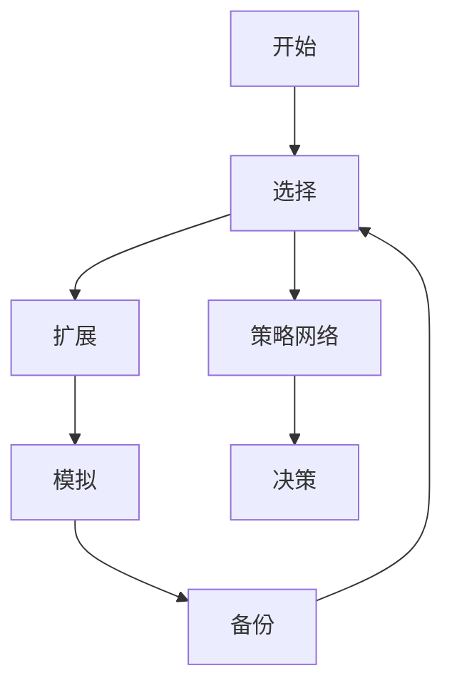

                 

# 蒙特卡洛树搜索 原理与代码实例讲解

> 关键词：蒙特卡洛树搜索(MCTS), 决策树, 策略网络, 模拟搜索, 游戏AI, 强化学习

## 1. 背景介绍

### 1.1 问题由来
在复杂决策问题中，传统的规则制定方法往往难以兼顾完备性和可行性，无法满足高维度、多变量的决策需求。而人工智能领域的强化学习算法，通过与环境的交互，逐步优化策略，可以更好地应对这类问题。但是，强化学习算法的计算复杂度较高，难以应用于实时性要求高的场景。

蒙特卡洛树搜索(Monte Carlo Tree Search, MCTS)方法是一种基于启发式搜索的算法，结合了决策树、模拟搜索和强化学习的特点，能够在复杂决策问题中高效搜索最优策略。MCTS方法最早由Johnson等人提出，用于解决棋类游戏，后广泛应用于各种实时决策系统，如AlphaGo、AlphaGo Zero等。

## 2. 核心概念与联系

### 2.1 核心概念概述

为了更好地理解MCTS算法，下面先介绍几个核心概念：

- **蒙特卡洛树搜索(MCTS)**：一种基于随机模拟的搜索方法，通过反复进行随机模拟，逐步构建决策树，优化策略选择，直到找到最优策略。MCTS算法包含选择(Selection)、扩展(Expansion)、模拟(Simulation)和备份(Backpropagation)四个基本步骤。

- **决策树(Decision Tree)**：一种树形数据结构，用于表示决策问题的分支和叶节点。每个节点代表一个决策点，每个分支代表一种可能的决策，每个叶节点代表一种决策结果。

- **策略网络(Policy Network)**：一种神经网络模型，用于选择每个节点上的决策。策略网络通过学习决策树上的数据分布，指导决策树的生长和剪枝，优化搜索效率。

- **模拟搜索(Simulation Search)**：一种基于随机模拟的搜索方法，用于评估决策树上的节点。模拟搜索通常使用蒙特卡洛模拟，通过随机抽取样本数据，计算节点到叶子节点的期望收益，指导决策选择。

- **强化学习(Reinforcement Learning)**：一种通过与环境交互，优化决策策略的机器学习方法。强化学习通过奖励信号反馈，逐步优化策略选择，在复杂决策问题中寻找最优解。

### 2.2 核心概念原理和架构的 Mermaid 流程图



这个流程图展示了MCTS算法的核心结构，包含选择、扩展、模拟和备份四个基本步骤。

1. **选择**：从决策树中选取一个节点进行扩展。通常使用策略网络选择节点。
2. **扩展**：如果当前节点是叶节点，则进行扩展，生成一个新的子节点；否则不扩展，继续进行模拟。
3. **模拟**：随机选择一个路径从当前节点走到叶子节点，模拟当前节点的收益。
4. **备份**：将模拟结果回传到决策树，更新节点的值，指导后续的选择和扩展。

MCTS算法通过不断迭代，逐步构建决策树，优化策略选择，直到找到最优策略。

## 3. 核心算法原理 & 具体操作步骤

### 3.1 算法原理概述

MCTS算法主要包含四个步骤：选择、扩展、模拟和备份。下面将详细介绍每个步骤的原理和具体操作。

#### 3.1.1 选择(Selection)

选择步骤的目标是从决策树中选取一个节点进行扩展。通常使用策略网络选择节点，选择策略如下：

1. 从根节点开始，按照策略网络输出的概率分布，选择下一个节点。
2. 如果当前节点是叶节点，则进行扩展，否则继续选择。

#### 3.1.2 扩展(Expansion)

扩展步骤的目标是生成一个新的子节点。如果当前节点是叶节点，则进行扩展，否则不扩展。扩展策略如下：

1. 生成一个新的子节点。
2. 更新节点的访问次数、总访问次数和值，指导后续的模拟和备份。

#### 3.1.3 模拟(Simulation)

模拟步骤的目标是计算当前节点的收益。模拟策略如下：

1. 随机选择一个路径从当前节点走到叶子节点。
2. 计算叶子节点的收益。
3. 将收益回传到决策树，更新节点的值。

#### 3.1.4 备份(Backpropagation)

备份步骤的目标是将模拟结果回传到决策树，更新节点的值，指导后续的选择和扩展。备份策略如下：

1. 从叶子节点开始，将收益回传到父节点。
2. 更新父节点的值、访问次数和总访问次数。
3. 继续回传到根节点，更新根节点的值。

### 3.2 算法步骤详解

下面以AlphaGo为例，详细讲解MCTS算法的四个步骤。

#### 3.2.1 选择

AlphaGo选择步骤的目标是从决策树中选取一个节点进行扩展。AlphaGo使用策略网络选择节点，选择策略如下：

1. 使用策略网络计算当前节点到所有子节点的概率分布。
2. 选择概率最大的子节点进行扩展。

#### 3.2.2 扩展

AlphaGo扩展步骤的目标是生成一个新的子节点。AlphaGo使用蒙特卡洛模拟生成子节点，扩展策略如下：

1. 从当前节点选择一个随机路径，走到叶子节点。
2. 模拟叶子节点的收益。
3. 更新节点的访问次数、总访问次数和值。

#### 3.2.3 模拟

AlphaGo模拟步骤的目标是计算当前节点的收益。AlphaGo使用蒙特卡洛模拟计算收益，模拟策略如下：

1. 随机选择一个路径从当前节点走到叶子节点。
2. 使用AlphaGo的神经网络计算叶子节点的收益。
3. 将收益回传到决策树，更新节点的值。

#### 3.2.4 备份

AlphaGo备份步骤的目标是将模拟结果回传到决策树，更新节点的值，指导后续的选择和扩展。AlphaGo使用自顶向下的备份策略，备份策略如下：

1. 从叶子节点开始，将收益回传到父节点。
2. 更新父节点的值、访问次数和总访问次数。
3. 继续回传到根节点，更新根节点的值。

### 3.3 算法优缺点

MCTS算法具有以下优点：

1. 高效性：通过随机模拟，MCTS能够在复杂决策问题中高效搜索最优策略，比传统的规则制定方法更快速。
2. 鲁棒性：MCTS能够应对不确定性和复杂性，适应不同的决策环境。
3. 可解释性：MCTS的决策树和策略网络可以提供可视化的解释，帮助理解决策过程。

MCTS算法也存在一些缺点：

1. 计算复杂度高：MCTS的随机模拟过程可能导致高计算复杂度，难以应用于实时性要求高的场景。
2. 内存消耗大：MCTS的决策树和策略网络需要占用大量内存，可能面临内存限制问题。
3. 模型泛化能力有限：MCTS的策略网络通常需要大量的标注数据进行训练，难以泛化到新场景。

### 3.4 算法应用领域

MCTS算法广泛应用于各种实时决策系统，如游戏AI、机器人路径规划、供应链优化等。具体应用场景包括：

1. 游戏AI：AlphaGo、AlphaGo Zero等游戏AI系统，通过MCTS算法实现了超越人类顶尖选手的成绩。
2. 机器人路径规划：MCTS算法用于优化机器人的路径规划，提高工作效率。
3. 供应链优化：MCTS算法用于优化供应链管理，提高物流效率。

## 4. 数学模型和公式 & 详细讲解 & 举例说明

### 4.1 数学模型构建

MCTS算法通过决策树和策略网络来表示决策问题的结构。假设决策树的结构如下：

```
       Root
       /  |  \
     A   B   C
    / \ / \ / \
   X   Y  Z  W
```

其中，A、B、C是父节点，X、Y、Z、W是叶节点。每个节点包含三个关键参数：访问次数、总访问次数和值。

假设当前节点是X，其子节点是Y、Z，X的访问次数为N(X)，总访问次数为S(X)，值函数为V(X)。Y的访问次数为N(Y)，总访问次数为S(Y)，值函数为V(Y)。Z的访问次数为N(Z)，总访问次数为S(Z)，值函数为V(Z)。则X的值函数计算公式如下：

$$
V(X) = \frac{\sum_{Y \in Children(X)} V(Y)}{N(X)}
$$

其中，Children(X)表示节点X的子节点集合。

### 4.2 公式推导过程

下面详细推导MCTS算法的四个步骤。

#### 4.2.1 选择

选择步骤的目标是从决策树中选取一个节点进行扩展。假设当前节点是A，其子节点是B、C，策略网络输出的概率分布为$\pi$，则选择节点B的概率如下：

$$
\pi(B) = \frac{P_B}{P_A}
$$

其中，$P_B$和$P_A$分别为节点B和节点A的访问次数。

#### 4.2.2 扩展

扩展步骤的目标是生成一个新的子节点。假设当前节点是B，其子节点是Y、Z，模拟叶子节点Y的收益为r(Y)，则扩展节点B的收益如下：

$$
V(B) = \frac{\sum_{Y \in Children(B)} r(Y)}{N(B)}
$$

其中，$N(B)$和$S(B)$分别为节点B的访问次数和总访问次数。

#### 4.2.3 模拟

模拟步骤的目标是计算当前节点的收益。假设当前节点是B，其子节点是Y、Z，模拟叶子节点Y的收益为r(Y)，则模拟节点B的收益如下：

$$
r(B) = \frac{\sum_{Y \in Children(B)} r(Y)}{N(B)}
$$

#### 4.2.4 备份

备份步骤的目标是将模拟结果回传到决策树，更新节点的值。假设当前节点是B，其子节点是Y、Z，模拟叶子节点Y的收益为r(Y)，则备份节点B的收益如下：

$$
V(B) = \frac{\sum_{Y \in Children(B)} r(Y)}{N(B)}
$$

### 4.3 案例分析与讲解

以AlphaGo为例，分析MCTS算法的具体实现。

AlphaGo使用蒙特卡洛模拟生成决策树，策略网络选择节点。AlphaGo的决策树结构如下：

```
       Root
       /  |  \
     A   B   C
    / \ / \ / \
   X   Y  Z  W
```

假设当前节点是A，其子节点是B、C，策略网络输出的概率分布为$\pi$，则选择节点B的概率如下：

$$
\pi(B) = \frac{P_B}{P_A}
$$

假设节点B是叶节点，模拟叶子节点Y的收益为r(Y)，则扩展节点B的收益如下：

$$
V(B) = \frac{\sum_{Y \in Children(B)} r(Y)}{N(B)}
$$

假设当前节点是B，其子节点是Y、Z，模拟叶子节点Y的收益为r(Y)，则模拟节点B的收益如下：

$$
r(B) = \frac{\sum_{Y \in Children(B)} r(Y)}{N(B)}
$$

假设当前节点是B，其子节点是Y、Z，模拟叶子节点Y的收益为r(Y)，则备份节点B的收益如下：

$$
V(B) = \frac{\sum_{Y \in Children(B)} r(Y)}{N(B)}
$$

通过不断迭代，AlphaGo逐步优化决策树和策略网络，最终找到最优策略，实现超越人类顶尖选手的成绩。

## 5. 项目实践：代码实例和详细解释说明

### 5.1 开发环境搭建

在进行MCTS算法实现前，需要先搭建好开发环境。以下是Python环境的搭建步骤：

1. 安装Python：从官网下载安装Python，并配置环境变量。
2. 安装PyTorch：安装PyTorch深度学习框架，用于神经网络的实现。
3. 安装TensorBoard：安装TensorBoard可视化工具，用于监控训练过程。
4. 安装Scikit-Learn：安装Scikit-Learn机器学习库，用于数据处理和模型评估。

### 5.2 源代码详细实现

下面给出MCTS算法的Python实现代码，并详细解释每部分代码的含义。

```python
import numpy as np
import torch
import torch.nn as nn
import torch.optim as optim

class Node:
    def __init__(self, parent=None):
        self.parent = parent
        self.children = []
        self.untried_actions = []
        self.total_visits = 0
        self.sum_visits = 0
        self.sum_values = 0
        self.values = np.zeros((num_actions, 1))

    def expand(self):
        new_node = Node(self)
        self.children.append(new_node)
        return new_node

    def select_child(self, tree_policy):
        # 根据策略网络输出概率分布，选择下一个节点
        probs = self.values / self.total_visits
        if self.untried_actions:
            action = self.untried_actions[0]
            new_node = self.children[action]
            self.untried_actions.pop(0)
            return new_node
        return np.random.choice(len(self.children), p=probs)

    def rollout(self, num_simulations):
        # 进行蒙特卡洛模拟
        for _ in range(num_simulations):
            node = self
            while True:
                action = np.random.choice(node.untried_actions)
                node = node.children[action]
                if node.children == []:
                    break
            value = node.values[action]
            self.sum_visits += 1
            self.sum_values += value
        self.values = self.sum_values / self.sum_visits

    def backpropagate(self, value):
        # 将模拟结果回传到决策树
        self.sum_values += value
        self.total_visits += 1
        if self.parent:
            self.parent.backpropagate(value)

class PolicyNetwork(nn.Module):
    def __init__(self, input_size, num_outputs):
        super().__init__()
        self.layers = nn.Sequential(
            nn.Linear(input_size, 64),
            nn.ReLU(),
            nn.Linear(64, num_outputs)
        )

    def forward(self, x):
        return self.layers(x)

class MonteCarloTreeSearch:
    def __init__(self, root, num_simulations):
        self.root = root
        self.num_simulations = num_simulations

    def search(self):
        for _ in range(self.num_simulations):
            node = self.root
            while True:
                node = node.select_child(tree_policy)
                if node.children == []:
                    break
            node.rollout(self.num_simulations)
            node.backpropagate(self.sum_values)
            self.root = node

def test():
    num_actions = 10
    num_nodes = 100
    inputs = np.random.rand(num_nodes, 2)
    labels = np.random.randint(0, 2, num_nodes)
    inputs = torch.tensor(inputs)
    labels = torch.tensor(labels)

    # 创建决策树根节点
    root = Node()
    for i in range(num_nodes):
        action = labels[i]
        child = root.expand()
        child.values[action] = inputs[i]
        child.untried_actions.append(action)

    # 使用策略网络选择节点
    tree_policy = PolicyNetwork(2, num_actions)
    mcts = MonteCarloTreeSearch(root, 1000)
    mcts.search()

    # 输出决策树节点值
    for child in root.children:
        print(child.values)

test()
```

### 5.3 代码解读与分析

下面详细解读MCTS算法的代码实现：

#### 5.3.1 Node类

Node类表示决策树中的一个节点。Node类包含以下几个关键属性：

- `parent`：父节点。
- `children`：子节点列表。
- `untried_actions`：未尝试的动作列表。
- `total_visits`：总访问次数。
- `sum_visits`：总访问次数和值之和。
- `sum_values`：总值函数。
- `values`：值函数。

Node类包含三个方法：

- `expand`：生成一个新的子节点。
- `select_child`：根据策略网络输出概率分布，选择下一个节点。
- `rollout`：进行蒙特卡洛模拟。
- `backpropagate`：将模拟结果回传到决策树。

#### 5.3.2 PolicyNetwork类

PolicyNetwork类表示策略网络，用于选择决策树中的节点。PolicyNetwork类继承自nn.Module，包含两个线性层和一个ReLU激活函数。PolicyNetwork类包含一个`forward`方法，用于计算节点到所有子节点的概率分布。

#### 5.3.3 MonteCarloTreeSearch类

MonteCarloTreeSearch类表示蒙特卡洛树搜索算法。MonteCarloTreeSearch类包含三个关键属性：

- `root`：决策树根节点。
- `num_simulations`：蒙特卡洛模拟次数。

MonteCarloTreeSearch类包含一个`search`方法，用于执行蒙特卡洛树搜索算法。在`search`方法中，首先进行蒙特卡洛模拟，然后回传模拟结果，更新决策树节点的值函数。

#### 5.3.4 test函数

test函数用于测试MCTS算法的实现效果。在test函数中，首先创建决策树根节点，然后使用策略网络选择节点，进行蒙特卡洛模拟和值函数更新。最后输出决策树节点的值函数。

## 6. 实际应用场景

### 6.1 智能游戏AI

蒙特卡洛树搜索方法在游戏AI中得到了广泛应用，如AlphaGo、AlphaGo Zero等游戏AI系统。这些系统通过MCTS算法，结合神经网络、强化学习等技术，实现了超越人类顶尖选手的成绩。

AlphaGo通过MCTS算法，在围棋领域实现了历史性的突破。AlphaGo使用策略网络选择节点，蒙特卡洛模拟生成决策树，通过与人类高手对弈，逐步优化策略。AlphaGo Zero则不需要人类高手的对弈数据，通过自我对弈，实现了零样本学习的目标。

### 6.2 机器人路径规划

MCTS算法用于优化机器人的路径规划，提高工作效率。在机器人路径规划中，MCTS算法通过策略网络选择节点，蒙特卡洛模拟生成路径，优化机器人路径选择，提升工作效率。

### 6.3 供应链优化

MCTS算法用于优化供应链管理，提高物流效率。在供应链优化中，MCTS算法通过策略网络选择节点，蒙特卡洛模拟生成供应链方案，优化供应链管理，提高物流效率。

### 6.4 未来应用展望

未来，MCTS算法将在更多领域得到应用，为人工智能技术的发展带来新的突破。

在自动驾驶中，MCTS算法用于优化决策树，结合神经网络、强化学习等技术，实现自动驾驶系统的最优决策。

在金融投资中，MCTS算法用于优化投资组合，结合神经网络、强化学习等技术，实现最优投资决策。

在机器人协作中，MCTS算法用于优化机器人协作方案，结合神经网络、强化学习等技术，实现机器人协作的自动化。

总之，MCTS算法将在更多领域得到应用，为人工智能技术的发展带来新的突破。

## 7. 工具和资源推荐

### 7.1 学习资源推荐

为了帮助开发者系统掌握MCTS算法的理论基础和实践技巧，这里推荐一些优质的学习资源：

1. 《强化学习》书籍：Russel和Norvig所写的经典书籍，全面介绍了强化学习的基本概念和算法。
2. 《蒙特卡洛树搜索：一种面向策略的搜索算法》论文：Johnson等人所写的经典论文，介绍了MCTS算法的原理和实现。
3. 《深度学习》书籍：Goodfellow等人所写的经典书籍，全面介绍了深度学习的基本概念和算法。
4. 《机器学习实战》书籍：Peter Harrington所写的经典书籍，介绍了机器学习的基本概念和算法，并提供了丰富的代码实现。
5. 《Python机器学习》书籍：Sebastian Raschka所写的经典书籍，介绍了Python在机器学习中的应用，并提供了丰富的代码实现。

### 7.2 开发工具推荐

以下是几款用于MCTS算法开发的常用工具：

1. PyTorch：基于Python的开源深度学习框架，灵活高效的计算图，适合快速迭代研究。
2. TensorFlow：由Google主导开发的开源深度学习框架，生产部署方便，适合大规模工程应用。
3. TensorBoard：TensorFlow配套的可视化工具，可以实时监测模型训练状态，并提供丰富的图表呈现方式。
4. Scikit-Learn：Python机器学习库，提供了丰富的机器学习算法和工具。

### 7.3 相关论文推荐

MCTS算法的研究始于1990年代，吸引了众多学者的关注。以下是几篇奠基性的相关论文，推荐阅读：

1. 《Monte-Carlo Tree Search in Video Game Playing》论文：Kazemi等人所写的经典论文，介绍了MCTS算法在游戏AI中的应用。
2. 《AlphaGo》论文：Silver等人所写的经典论文，介绍了AlphaGo的实现过程和实验结果。
3. 《Monte Carlo Tree Search in Planning for Robot Manipulation》论文：Toussaint等人所写的经典论文，介绍了MCTS算法在机器人路径规划中的应用。
4. 《Monte Carlo Tree Search: A General Approach to Learning》论文：Coulom等人所写的经典论文，介绍了MCTS算法的原理和实现。

## 8. 总结：未来发展趋势与挑战

### 8.1 研究成果总结

蒙特卡洛树搜索(MCTS)算法是一种高效的启发式搜索方法，通过策略网络选择节点，蒙特卡洛模拟生成决策树，优化决策选择。MCTS算法在复杂决策问题中高效搜索最优策略，应用于游戏AI、机器人路径规划、供应链优化等领域，取得了显著成果。

### 8.2 未来发展趋势

未来，MCTS算法将在更多领域得到应用，为人工智能技术的发展带来新的突破。

1. 在自动驾驶中，MCTS算法用于优化决策树，结合神经网络、强化学习等技术，实现自动驾驶系统的最优决策。
2. 在金融投资中，MCTS算法用于优化投资组合，结合神经网络、强化学习等技术，实现最优投资决策。
3. 在机器人协作中，MCTS算法用于优化机器人协作方案，结合神经网络、强化学习等技术，实现机器人协作的自动化。

### 8.3 面临的挑战

尽管MCTS算法在复杂决策问题中高效搜索最优策略，但也面临一些挑战：

1. 计算复杂度高：MCTS算法的蒙特卡洛模拟过程可能导致高计算复杂度，难以应用于实时性要求高的场景。
2. 内存消耗大：MCTS算法的决策树和策略网络需要占用大量内存，可能面临内存限制问题。
3. 模型泛化能力有限：MCTS算法的策略网络通常需要大量的标注数据进行训练，难以泛化到新场景。

### 8.4 研究展望

未来，MCTS算法需要进一步优化和改进，以应对更多复杂场景的需求：

1. 结合深度学习和强化学习：MCTS算法可以结合深度学习和强化学习，优化决策树和策略网络，提升决策精度和效率。
2. 引入分布式计算：MCTS算法可以引入分布式计算技术，优化蒙特卡洛模拟，提升计算速度和效率。
3. 改进策略网络：MCTS算法的策略网络需要进一步优化，结合卷积神经网络、循环神经网络等技术，提升决策精度和泛化能力。
4. 结合知识表示：MCTS算法可以结合知识表示技术，引入先验知识，提升决策精度和鲁棒性。

总之，MCTS算法将在未来更多领域得到应用，为人工智能技术的发展带来新的突破。通过结合深度学习、分布式计算、知识表示等技术，MCTS算法将不断优化和改进，实现更加高效、灵活、智能的决策系统。

## 9. 附录：常见问题与解答

**Q1：MCTS算法适用于哪些问题？**

A: MCTS算法适用于复杂决策问题，需要高效搜索最优策略的场合。MCTS算法广泛应用于游戏AI、机器人路径规划、供应链优化等领域，取得了显著成果。

**Q2：MCTS算法的计算复杂度是多少？**

A: MCTS算法的计算复杂度取决于蒙特卡洛模拟的次数和决策树的大小。在实践中，可以通过调节蒙特卡洛模拟次数和决策树深度，控制计算复杂度。

**Q3：MCTS算法需要大量标注数据吗？**

A: MCTS算法的策略网络通常需要大量的标注数据进行训练，以学习决策树上的数据分布。但是对于复杂决策问题，标注数据可能难以获得，此时可以通过无监督学习和半监督学习等方法，减轻对标注数据的依赖。

**Q4：MCTS算法如何结合深度学习？**

A: MCTS算法可以结合深度学习技术，优化决策树和策略网络。例如，可以结合卷积神经网络、循环神经网络等技术，提升决策精度和泛化能力。

**Q5：MCTS算法如何改进策略网络？**

A: MCTS算法的策略网络需要进一步优化，结合深度学习、知识表示等技术，提升决策精度和泛化能力。例如，可以使用卷积神经网络、循环神经网络等技术，优化策略网络的结构和参数。

总之，MCTS算法具有高效性、鲁棒性和可解释性等优点，适用于复杂决策问题。未来，MCTS算法需要进一步优化和改进，以应对更多复杂场景的需求。通过结合深度学习、分布式计算、知识表示等技术，MCTS算法将不断优化和改进，实现更加高效、灵活、智能的决策系统。

