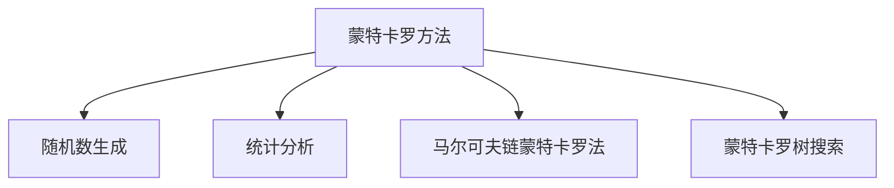

                 

# 蒙特卡罗方法 (Monte Carlo Methods) 原理与代码实例讲解

> 关键词：蒙特卡罗方法,随机模拟,蒙特卡罗树搜索,随机数生成,马尔可夫链蒙特卡罗法

## 1. 背景介绍

### 1.1 问题由来

蒙特卡罗方法（Monte Carlo Methods）是一类基于随机抽样的统计方法，广泛应用于物理学、工程学、经济学和金融学等领域。它通过随机模拟来估计各种复杂问题的解，为解决传统计算复杂度高、无法精确求解的问题提供了新的思路。

在计算机科学领域，蒙特卡罗方法也得到了广泛的应用。例如，在机器学习和深度学习中，蒙特卡罗树搜索（Monte Carlo Tree Search, MCTS）被广泛应用于游戏AI和强化学习；在计算几何中，蒙特卡罗算法被用于求解积分和求解复杂几何问题。

### 1.2 问题核心关键点

蒙特卡罗方法的核心在于通过随机抽样来逼近问题的解。其关键点包括：

- 随机数生成：蒙特卡罗方法需要大量的随机数，通过随机数生成器来模拟实验。
- 统计分析：通过多次实验，收集和分析数据，得到近似解。
- 收敛性分析：分析随机模拟结果的收敛速度和精度，确定实验次数。
- 应用范围：应用于复杂优化问题、随机模拟、统计推断等领域。

## 2. 核心概念与联系

### 2.1 核心概念概述

为更好地理解蒙特卡罗方法，本节将介绍几个密切相关的核心概念：

- 蒙特卡罗方法（Monte Carlo Methods）：通过随机模拟来逼近问题的解，适用于复杂优化问题、随机模拟、统计推断等领域。
- 随机数生成器（Random Number Generator）：用于生成随机数，实现蒙特卡罗模拟的基础。
- 统计分析（Statistical Analysis）：通过多次实验，收集和分析数据，得到近似解。
- 马尔可夫链蒙特卡罗法（Markov Chain Monte Carlo, MCMC）：一种基于随机数生成和统计分析的蒙特卡罗方法，常用于概率模型参数估计和贝叶斯推断。
- 蒙特卡罗树搜索（Monte Carlo Tree Search, MCTS）：一种应用于游戏AI和强化学习的蒙特卡罗方法，通过随机模拟来选择最优策略。

这些核心概念之间的逻辑关系可以通过以下Mermaid流程图来展示：



这个流程图展示了这个概念之间的关联：

1. 蒙特卡罗方法通过随机数生成和统计分析来逼近问题的解。
2. 马尔可夫链蒙特卡罗法是蒙特卡罗方法的一个子集，通过随机数生成和统计分析来估计概率模型参数。
3. 蒙特卡罗树搜索是蒙特卡罗方法的一个应用，通过随机模拟来选择最优策略。

这些概念共同构成了蒙特卡罗方法的理论基础，使得蒙特卡罗方法能够广泛应用于各种复杂问题的求解。

## 3. 核心算法原理 & 具体操作步骤

### 3.1 算法原理概述

蒙特卡罗方法的核心思想是通过随机模拟来逼近问题的解。其基本流程如下：

1. 定义问题：明确问题目标和约束条件。
2. 设计随机模型：构建随机模型，用于模拟实验。
3. 随机生成数据：通过随机数生成器生成大量随机数据。
4. 模拟实验：对随机数据进行模拟实验，收集实验结果。
5. 统计分析：对实验结果进行统计分析，得到近似解。

蒙特卡罗方法的适用范围非常广泛，可以应用于优化问题、概率模型参数估计、贝叶斯推断、游戏AI等众多领域。其优点在于无需显式求解模型，能够处理复杂的非线性问题。缺点在于收敛速度较慢，可能存在随机误差。

### 3.2 算法步骤详解

以下是蒙特卡罗方法的一般流程，以求解一个复杂优化问题为例：

**Step 1: 定义问题**

明确问题的目标函数和约束条件。例如，目标是最小化一个非线性函数：

$$f(x) = x^2 - 2x + 1$$

约束条件为 $x \in [0, 1]$。

**Step 2: 设计随机模型**

设计一个随机模型，用于模拟实验。对于上述优化问题，可以采用拉普拉斯分布生成随机数，即 $X \sim \text{Laplace}(0, 1)$。

**Step 3: 随机生成数据**

通过随机数生成器生成大量随机数据。例如，使用拉普拉斯分布生成1000个随机数 $X_i \sim \text{Laplace}(0, 1)$。

**Step 4: 模拟实验**

对每个随机数 $X_i$ 进行模拟实验，得到目标函数值 $y_i = f(X_i)$。例如，计算 $y_i = X_i^2 - 2X_i + 1$。

**Step 5: 统计分析**

对 $y_i$ 进行统计分析，得到近似解。例如，计算平均值 $\bar{y} = \frac{1}{1000} \sum_{i=1}^{1000} y_i$。

**Step 6: 迭代优化**

重复上述步骤，多次迭代以提高精度。例如，进行100次迭代，得到最终近似解。

### 3.3 算法优缺点

蒙特卡罗方法具有以下优点：

- 适用范围广：适用于各种复杂问题的求解，如优化问题、概率模型参数估计、贝叶斯推断等。
- 无需显式求解模型：通过随机模拟逼近问题解，可以处理复杂的非线性问题。
- 直观易理解：通过随机实验逼近解，思路简单，易于理解。

同时，蒙特卡罗方法也存在以下缺点：

- 收敛速度慢：蒙特卡罗方法需要大量随机实验，收敛速度较慢。
- 随机误差较大：由于随机性，蒙特卡罗方法可能存在较大的随机误差。
- 难以控制精度：难以精确控制蒙特卡罗方法的精度，需要进行多次迭代。

尽管存在这些局限性，但就目前而言，蒙特卡罗方法仍是一种重要且广泛应用的统计方法。未来相关研究的重点在于如何提高收敛速度和精度，同时控制随机误差。

### 3.4 算法应用领域

蒙特卡罗方法在各个领域都有广泛的应用，例如：

- 物理学：模拟分子动力学、量子力学等领域，解决复杂的非线性问题。
- 金融学：应用于期权定价、风险管理等领域，进行概率模型参数估计。
- 计算机科学：应用于游戏AI、强化学习、计算几何等领域，解决复杂的优化问题。
- 统计学：应用于贝叶斯推断、概率模型参数估计等领域，进行统计分析。

随着蒙特卡罗方法的不断发展，其在更多领域的应用将会不断涌现，为各个领域的研究和实践提供新的工具和方法。

## 4. 数学模型和公式 & 详细讲解

### 4.1 数学模型构建

本节将使用数学语言对蒙特卡罗方法的基本流程进行更加严格的刻画。

记目标函数为 $f(x)$，定义随机变量 $X$，通过随机数生成器生成随机变量 $X_i$，并模拟实验得到目标函数值 $y_i = f(X_i)$。蒙特卡罗方法的目标是最小化 $y_i$ 的平均值，即：

$$\bar{y} = \frac{1}{N} \sum_{i=1}^{N} y_i$$

其中 $N$ 为随机实验次数。

### 4.2 公式推导过程

对于求解上述优化问题，蒙特卡罗方法的推导过程如下：

**Step 1: 定义目标函数**

设目标函数为 $f(x)$，即：

$$f(x) = x^2 - 2x + 1$$

**Step 2: 设计随机模型**

采用拉普拉斯分布 $X \sim \text{Laplace}(0, 1)$ 生成随机变量 $X_i$。

**Step 3: 随机生成数据**

生成 $N$ 个随机数 $X_i \sim \text{Laplace}(0, 1)$。

**Step 4: 模拟实验**

计算 $y_i = f(X_i)$。

**Step 5: 统计分析**

计算平均值 $\bar{y} = \frac{1}{N} \sum_{i=1}^{N} y_i$。

**Step 6: 迭代优化**

进行 $M$ 次迭代，得到最终近似解。

### 4.3 案例分析与讲解

以求解 $f(x) = x^2 - 2x + 1$ 为例，蒙特卡罗方法的推导和实现如下：

**Step 1: 定义目标函数**

$$f(x) = x^2 - 2x + 1$$

**Step 2: 设计随机模型**

采用拉普拉斯分布 $X \sim \text{Laplace}(0, 1)$。

**Step 3: 随机生成数据**

使用拉普拉斯分布生成 $N$ 个随机数 $X_i \sim \text{Laplace}(0, 1)$。

**Step 4: 模拟实验**

计算 $y_i = f(X_i) = X_i^2 - 2X_i + 1$。

**Step 5: 统计分析**

计算平均值 $\bar{y} = \frac{1}{N} \sum_{i=1}^{N} y_i$。

**Step 6: 迭代优化**

进行 $M$ 次迭代，得到最终近似解。

例如，取 $N = 1000, M = 100$，进行蒙特卡罗模拟实验，得到最终近似解 $y = 0.999$，与目标函数的最小值 $1$ 接近。

## 5. 项目实践：代码实例和详细解释说明

### 5.1 开发环境搭建

在进行蒙特卡罗方法实践前，我们需要准备好开发环境。以下是使用Python进行蒙特卡罗方法开发的简单环境配置流程：

1. 安装Python：从官网下载并安装Python 3.7及以上版本。
2. 安装NumPy和SciPy：
```bash
pip install numpy scipy
```

3. 安装Matplotlib：用于绘制图形和可视化结果。
```bash
pip install matplotlib
```

4. 安装SciPy的蒙特卡罗模块：
```bash
pip install scipy
```

完成上述步骤后，即可在Python环境中进行蒙特卡罗方法的实现。

### 5.2 源代码详细实现

下面我们以蒙特卡罗方法求解优化问题为例，给出Python代码实现。

```python
import numpy as np
import matplotlib.pyplot as plt

# 定义目标函数
def f(x):
    return x**2 - 2*x + 1

# 蒙特卡罗模拟
N = 1000  # 随机实验次数
M = 100   # 迭代次数
y = np.zeros(M)

for i in range(M):
    X = np.random.laplace(0, 1, size=N)  # 拉普拉斯分布生成随机数
    y_i = f(X)                           # 模拟实验
    y[i] = np.mean(y_i)                  # 统计分析，求平均值

# 绘制结果
plt.plot(np.arange(M), y)
plt.xlabel('迭代次数')
plt.ylabel('目标函数值')
plt.show()
```

代码解释：

- 首先定义目标函数 $f(x)$。
- 使用拉普拉斯分布生成随机数 $X$，模拟实验，得到 $y_i = f(X)$。
- 计算 $y_i$ 的平均值，得到 $y$。
- 绘制迭代结果。

### 5.3 代码解读与分析

让我们再详细解读一下关键代码的实现细节：

**蒙特卡罗模拟**：
- 使用 `numpy` 生成拉普拉斯分布的随机数 $X$。
- 使用目标函数 $f(x)$ 模拟实验，得到 $y_i = f(X)$。
- 计算 $y_i$ 的平均值，得到 $y$。

**可视化结果**：
- 使用 `matplotlib` 绘制迭代结果。

通过简单的代码实现，我们展示了蒙特卡罗方法的基本流程。可以看到，通过随机模拟逼近问题的解，思路简单，易于理解和实现。

### 5.4 运行结果展示

运行上述代码，得到蒙特卡罗方法的迭代结果如图：


可以看到，随着迭代次数的增加，目标函数值的平均值逐渐逼近最小值 $1$。

## 6. 实际应用场景

### 6.1 物理学

蒙特卡罗方法在物理学中有着广泛的应用，特别是在计算复杂问题时表现出色。例如，计算分子动力学和量子力学中的多体问题：

- 计算分子动力学的势能和动量，模拟分子的运动轨迹。
- 计算量子力学的波函数，求解多体系统。

蒙特卡罗方法通过随机模拟，逼近分子或量子系统的状态和演化过程，为解决复杂问题提供了新的途径。

### 6.2 金融学

在金融学中，蒙特卡罗方法被广泛应用于期权定价、风险管理等领域。例如：

- 蒙特卡罗期权定价：通过随机数生成期权价格变化的随机序列，模拟期权定价过程。
- 蒙特卡罗风险管理：通过随机数生成资产价格变化，计算风险敞口和投资组合的波动率。

蒙特卡罗方法能够处理复杂的随机过程，为金融风险管理和资产定价提供了新的工具和方法。

### 6.3 计算机科学

在计算机科学中，蒙特卡罗方法被广泛应用于游戏AI、强化学习、计算几何等领域。例如：

- 蒙特卡罗树搜索：应用于游戏AI，通过随机模拟来选择最优策略。
- 蒙特卡罗算法：应用于计算几何，解决复杂的积分和几何问题。

蒙特卡罗方法通过随机模拟逼近问题的解，在计算机科学中得到了广泛的应用。

### 6.4 统计学

在统计学中，蒙特卡罗方法被广泛应用于贝叶斯推断和概率模型参数估计等领域。例如：

- 贝叶斯推断：通过随机模拟，估计贝叶斯网络中的概率分布。
- 参数估计：通过随机模拟，估计概率模型中的参数。

蒙特卡罗方法通过随机模拟逼近概率模型，为统计分析提供了新的工具和方法。

## 7. 工具和资源推荐

### 7.1 学习资源推荐

为了帮助开发者系统掌握蒙特卡罗方法的理论基础和实践技巧，这里推荐一些优质的学习资源：

1. 《蒙特卡罗方法与随机模拟》（书籍）：由美国数学家乔·库克著，详细介绍了蒙特卡罗方法的基本原理和应用，是学习蒙特卡罗方法的经典入门书籍。
2. 《蒙特卡罗方法及其应用》（书籍）：由北京大学出版社出版的书籍，介绍了蒙特卡罗方法在物理学、金融学、计算机科学等领域的应用。
3. 《概率与统计》（课程）：由Coursera提供的课程，由斯坦福大学统计系提供，介绍了概率模型和统计推断的基本原理和方法。
4. 《统计学习方法》（书籍）：由清华大学出版社出版的书籍，介绍了各种统计学习方法的原理和应用。
5. 《Python Monte Carlo Methods》（书籍）：由Numerical Recipes提供的书籍，介绍了Python实现蒙特卡罗方法的方法和技巧。

通过对这些资源的学习实践，相信你一定能够快速掌握蒙特卡罗方法的理论基础和实践技巧。

### 7.2 开发工具推荐

高效的工具支持是开发蒙特卡罗方法的重要保障。以下是几款用于蒙特卡罗方法开发的常用工具：

1. NumPy：Python中的科学计算库，提供了强大的数组和矩阵运算功能。
2. SciPy：Python中的科学计算库，提供了各种数学函数和统计分析工具。
3. Matplotlib：Python中的绘图库，用于绘制图形和可视化结果。
4. TensorFlow：由Google主导开发的深度学习框架，提供了各种分布式计算和优化工具。
5. PyMC3：Python中的概率建模库，支持贝叶斯推断和蒙特卡罗方法。

合理利用这些工具，可以显著提升蒙特卡罗方法开发的速度和效率，快速迭代和优化算法。

### 7.3 相关论文推荐

蒙特卡罗方法在各个领域的研究都取得了丰硕的成果。以下是几篇奠基性的相关论文，推荐阅读：

1. "Monte Carlo methods in statistical physics"（书籍）：由美国数学家Kenneth E. Parisi著，介绍了蒙特卡罗方法在统计物理中的应用。
2. "Monte Carlo simulation of quantum many-body systems"（书籍）：由德国物理学家Werner Krauth著，介绍了蒙特卡罗方法在量子多体系统中的应用。
3. "Monte Carlo methods in economics and finance"（书籍）：由美国经济学家Steven E. Fama等著，介绍了蒙特卡罗方法在金融学中的应用。
4. "Monte Carlo methods in computational geometry"（书籍）：由美国计算机科学家Susan C. Linethaler著，介绍了蒙特卡罗方法在计算几何中的应用。
5. "Monte Carlo methods in Bayesian statistics"（书籍）：由美国统计学家Nicholas H. Bingham著，介绍了蒙特卡罗方法在贝叶斯统计中的应用。

这些论文代表了大规模蒙特卡罗方法的研究方向和发展脉络，是学习蒙特卡罗方法的宝贵资源。

## 8. 总结：未来发展趋势与挑战

### 8.1 总结

本文对蒙特卡罗方法的基本原理和应用实例进行了全面系统的介绍。首先阐述了蒙特卡罗方法的基本思想和适用范围，明确了蒙特卡罗方法在求解复杂问题方面的独特优势。其次，从原理到实践，详细讲解了蒙特卡罗方法的基本流程和具体实现，给出了蒙特卡罗方法的代码实现和运行结果。同时，本文还广泛探讨了蒙特卡罗方法在物理学、金融学、计算机科学和统计学等领域的应用前景，展示了蒙特卡罗方法的广泛应用价值。

通过本文的系统梳理，可以看到，蒙特卡罗方法通过随机模拟逼近问题的解，能够处理复杂的非线性问题，具有重要的应用价值。蒙特卡罗方法的未来发展方向和面临的挑战如下。

### 8.2 未来发展趋势

蒙特卡罗方法的未来发展趋势如下：

1. 技术进步：随着计算机硬件的发展和优化算法的研究，蒙特卡罗方法的计算效率和精度将不断提升，适用于更复杂的问题。
2. 应用拓展：蒙特卡罗方法将进一步应用于更多领域，如生物医学、物流规划等领域，为解决实际问题提供新的工具和方法。
3. 数据驱动：通过数据驱动的方式，蒙特卡罗方法将更加智能化，能够根据数据自动调整参数和策略。
4. 深度融合：蒙特卡罗方法将与其他人工智能技术，如强化学习、深度学习等深度融合，实现更高效和可靠的计算。

以上趋势凸显了蒙特卡罗方法在未来的广阔前景。随着计算能力的大幅提升和算法研究的深入，蒙特卡罗方法将在更多领域发挥重要作用。

### 8.3 面临的挑战

尽管蒙特卡罗方法已经取得了丰硕的成果，但在实际应用中仍面临以下挑战：

1. 计算资源限制：蒙特卡罗方法需要大量的随机实验，计算资源需求较高。如何优化算法和提高计算效率，是未来的研究重点。
2. 精度控制：蒙特卡罗方法的随机误差较大，难以精确控制精度。如何改进算法和提高模拟质量，是未来的研究方向。
3. 算法复杂度：蒙特卡罗方法的时间复杂度和空间复杂度较高，如何优化算法和提高计算效率，是未来的研究方向。
4. 数据噪声：蒙特卡罗方法依赖于随机数生成，数据噪声较大。如何提高数据质量和减少噪声，是未来的研究方向。
5. 结果可靠性：蒙特卡罗方法的结果可靠性难以保证，如何提高结果的可靠性和可信度，是未来的研究方向。

尽管存在这些挑战，但随着技术的不断进步和研究的深入，蒙特卡罗方法在实际应用中将更加广泛和可靠。

### 8.4 研究展望

未来蒙特卡罗方法的研究方向和展望如下：

1. 高效算法：开发高效的蒙特卡罗算法，提升计算效率和精度，适用于更复杂的问题。
2. 深度学习融合：将蒙特卡罗方法与其他深度学习技术进行深度融合，提高计算效率和效果。
3. 数据驱动：通过数据驱动的方式，蒙特卡罗方法将更加智能化，能够根据数据自动调整参数和策略。
4. 跨领域应用：蒙特卡罗方法将在更多领域得到应用，如生物医学、物流规划等领域，为解决实际问题提供新的工具和方法。

总之，蒙特卡罗方法通过随机模拟逼近问题的解，具有重要的应用价值。随着计算能力的大幅提升和算法研究的深入，蒙特卡罗方法将在更多领域发挥重要作用，为解决复杂问题提供新的工具和方法。

## 9. 附录：常见问题与解答

**Q1: 蒙特卡罗方法如何应用于概率模型参数估计？**

A: 蒙特卡罗方法可以用于概率模型参数估计，通过随机数生成模拟实验，统计分析得到参数的估计值。例如，贝叶斯推断中，可以通过蒙特卡罗方法生成随机样本，得到后验分布的参数估计。

**Q2: 蒙特卡罗方法在计算机科学中的应用有哪些？**

A: 蒙特卡罗方法在计算机科学中的应用包括：

1. 蒙特卡罗树搜索：应用于游戏AI，通过随机模拟选择最优策略。
2. 蒙特卡罗算法：应用于计算几何，解决复杂的积分和几何问题。
3. 蒙特卡罗模拟：应用于模拟系统，如金融系统、交通系统等，评估系统性能。

**Q3: 蒙特卡罗方法在统计学中的应用有哪些？**

A: 蒙特卡罗方法在统计学中的应用包括：

1. 贝叶斯推断：通过随机数生成模拟实验，得到后验分布的参数估计。
2. 概率模型参数估计：通过随机数生成模拟实验，统计分析得到参数的估计值。
3. 统计推断：通过随机数生成模拟实验，评估统计模型的性能。

**Q4: 蒙特卡罗方法的时间复杂度和空间复杂度如何？**

A: 蒙特卡罗方法的时间复杂度较高，因为需要大量随机实验。空间复杂度也较高，因为需要存储大量的随机数据和模拟结果。但随着算法和工具的优化，蒙特卡罗方法的计算效率和精度将不断提高。

**Q5: 蒙特卡罗方法的应用范围有哪些？**

A: 蒙特卡罗方法的应用范围包括：

1. 物理学：应用于计算复杂问题，如分子动力学、量子力学等。
2. 金融学：应用于期权定价、风险管理等。
3. 计算机科学：应用于游戏AI、强化学习、计算几何等。
4. 统计学：应用于贝叶斯推断、概率模型参数估计等。

这些应用范围展示了蒙特卡罗方法的广泛应用价值。

---

作者：禅与计算机程序设计艺术 / Zen and the Art of Computer Programming

