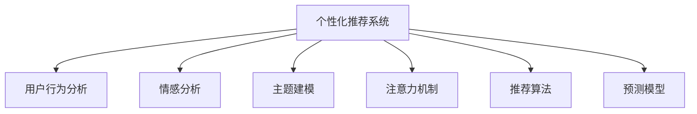

                 

# 虚拟影响力：注意力经济的新货币

> 关键词：虚拟影响力, 注意力经济, 数据挖掘, 机器学习, 用户行为分析, 内容推荐, 社交媒体分析, 算法推荐系统, 预测模型, 情感分析, 信息流, 广告投放, 用户参与度

## 1. 背景介绍

### 1.1 问题由来

随着互联网的迅猛发展和社交媒体的普及，用户行为数据成为各互联网公司争夺的焦点。传统的内容分发方式，如随机推荐、轮播排序等，已经无法满足用户个性化需求和平台盈利目标。基于用户行为的数据挖掘和分析，结合机器学习算法，个性化推荐系统的兴起，正在改变用户的获取信息和内容消费的方式。

在这一过程中，用户的注意力成为了新的“货币”。通过精准识别用户的兴趣偏好，个性化推荐系统能够显著提升用户粘性，增加平台的用户参与度，从而实现商业价值的最大化。与此同时，用户对内容的参与和反馈，也成为衡量内容质量的重要标准。

### 1.2 问题核心关键点

注意力经济的核心在于如何高效地获取、挖掘、利用用户的注意力资源，最大化其商业价值。在算法推荐系统中，通过机器学习模型对用户行为数据进行分析，能够预测用户对不同内容的兴趣程度，从而优化推荐策略，提升用户体验和平台收益。

- **数据挖掘**：从大量用户行为数据中挖掘出用户兴趣和行为模式，是实现个性化推荐的基础。
- **机器学习**：通过算法模型，对用户兴趣进行预测和推荐，是核心技术手段。
- **用户行为分析**：深入理解用户行为数据，进行情感分析和主题建模，进一步提升推荐效果。
- **社交媒体分析**：利用社交网络数据，进行用户关系挖掘和话题分析，辅助个性化推荐。
- **预测模型**：构建基于监督学习或无监督学习的预测模型，实现对用户行为的精确预测。
- **算法推荐系统**：结合推荐算法，进行个性化内容推荐，满足用户多样化需求。

## 2. 核心概念与联系

### 2.1 核心概念概述

为更好地理解注意力经济下个性化推荐系统的工作原理，本节将介绍几个密切相关的核心概念：

- **个性化推荐系统**：通过数据分析和算法模型，为用户定制个性化内容推荐。
- **用户行为分析**：通过数据分析手段，挖掘用户兴趣和行为模式。
- **情感分析**：分析用户对内容的情感倾向，优化推荐策略。
- **主题建模**：通过算法挖掘文本中的主题信息，提高推荐相关性。
- **注意力机制**：通过引入注意力机制，提升模型对用户兴趣点的关注度。
- **推荐算法**：结合协同过滤、基于内容的推荐、深度学习等多种算法，进行内容推荐。
- **预测模型**：通过机器学习模型，对用户行为进行预测。

这些核心概念之间的逻辑关系可以通过以下Mermaid流程图来展示：



这个流程图展示了个性化推荐系统的工作流程：

1. 通过用户行为分析，挖掘用户兴趣和行为模式。
2. 结合情感分析和主题建模，进一步提升推荐质量。
3. 引入注意力机制，优化推荐策略，提升模型关注度。
4. 选择合适的推荐算法，进行个性化内容推荐。
5. 构建预测模型，优化推荐效果。

## 3. 核心算法原理 & 具体操作步骤
### 3.1 算法原理概述

个性化推荐系统的核心在于对用户行为数据的分析和学习，以预测用户对不同内容的兴趣程度。在这一过程中，机器学习算法扮演了重要角色，通过对历史行为数据的挖掘和建模，能够实现对用户兴趣的精确预测和内容推荐。

具体来说，个性化推荐系统一般包括以下几个关键步骤：

- **数据收集**：收集用户的历史行为数据，如浏览记录、购买记录、评分记录等。
- **特征工程**：对数据进行预处理和特征提取，得到可用于建模的特征向量。
- **模型训练**：选择合适算法模型，如协同过滤、基于内容的推荐、深度学习等，对数据进行训练。
- **预测推荐**：使用训练好的模型，对新用户行为进行预测，进行个性化内容推荐。
- **模型优化**：根据用户反馈和推荐效果，不断优化模型参数，提高推荐质量。

### 3.2 算法步骤详解

以下是一个基于监督学习个性化推荐系统的详细步骤：

**Step 1: 数据收集**
- 收集用户的历史行为数据，如浏览记录、购买记录、评分记录等。
- 清洗数据，处理缺失值和异常值，确保数据质量。

**Step 2: 特征工程**
- 对数据进行编码，如将文本数据转化为词袋模型或TF-IDF向量。
- 对不同特征进行归一化和标准化处理，确保数据的一致性。
- 选择重要的特征，构建特征向量，如ID、时间戳、类别等。

**Step 3: 模型训练**
- 选择合适的监督学习算法，如逻辑回归、支持向量机、随机森林等。
- 将历史行为数据作为训练集，训练模型。
- 选择合适参数，如学习率、正则化系数、迭代轮数等，进行模型优化。

**Step 4: 预测推荐**
- 使用训练好的模型，对新用户行为进行预测，得到兴趣度评分。
- 根据评分对内容进行排序，进行个性化推荐。

**Step 5: 模型优化**
- 根据用户反馈和推荐效果，不断优化模型参数。
- 引入用户反馈机制，调整推荐策略，提升推荐质量。

### 3.3 算法优缺点

个性化推荐系统的优点包括：
- 提升用户粘性：通过个性化推荐，用户能够更快地找到自己感兴趣的内容。
- 增加平台收益：通过精准推荐，提高用户停留时间和互动频率，增加广告收入。
- 改善用户体验：通过个性化推荐，提升用户满意度，增加用户参与度。

同时，个性化推荐系统也存在以下缺点：
- 数据隐私问题：收集和分析用户行为数据，可能涉及隐私泄露风险。
- 模型过拟合：在数据量不足的情况下，模型容易过拟合，导致泛化能力差。
- 冷启动问题：对于新用户或新内容，缺乏足够的行为数据，难以进行有效推荐。
- 算力需求高：个性化推荐系统通常需要大规模数据和复杂算法，对算力需求高。
- 动态变化：用户兴趣和行为模式会随时间变化，模型需要不断更新和调整。

### 3.4 算法应用领域

个性化推荐系统已经被广泛应用于电子商务、新闻阅读、视频流媒体、社交媒体等多个领域。例如：

- 电子商务平台：根据用户浏览和购买记录，推荐相关商品。
- 新闻阅读平台：根据用户阅读历史，推荐相关文章。
- 视频流媒体平台：根据用户观看历史，推荐相关视频。
- 社交媒体平台：根据用户互动历史，推荐相关内容。
- 游戏平台：根据用户游戏行为，推荐相关游戏。

## 4. 数学模型和公式 & 详细讲解 & 举例说明

### 4.1 数学模型构建

在本节中，我们将使用数学语言对基于监督学习个性化推荐系统的建模过程进行更加严格的刻画。

记用户历史行为数据为 $X=\{x_i\}_{i=1}^N$，其中 $x_i$ 为第 $i$ 个用户的行为记录，包含浏览时间、点击次数、购买金额等。记用户的兴趣偏好为 $y$，为一个 $[0,1]$ 区间的标量，表示用户对内容的兴趣程度。

假设模型 $f$ 通过线性回归建模，则有：

$$
y = \beta_0 + \sum_{i=1}^D \beta_i x_{i}
$$

其中 $\beta$ 为模型的系数向量，$D$ 为特征数量。通过最小化预测误差 $y-\hat{y}$，可得：

$$
\hat{y} = \beta_0 + \sum_{i=1}^D \beta_i x_{i}
$$

通过最小化均方误差损失函数 $\mathcal{L}(y,\hat{y})=(y-\hat{y})^2$，可得：

$$
\min_{\beta} \sum_{i=1}^N (y_i-\hat{y_i})^2
$$

### 4.2 公式推导过程

以基于监督学习的最小二乘回归算法为例，推导其梯度下降更新公式：

设初始模型参数为 $\beta^{(0)}$，则第 $k$ 次迭代更新后的参数为：

$$
\beta^{(k+1)} = \beta^{(k)} - \eta \frac{\partial \mathcal{L}(y,\hat{y})}{\partial \beta}
$$

其中 $\eta$ 为学习率。根据均方误差损失函数，得：

$$
\frac{\partial \mathcal{L}(y,\hat{y})}{\partial \beta} = -\frac{2}{N} (X^T(XX^T)^{-1}(y-X\beta))
$$

带入 $\beta^{(k+1)}$ 的表达式中，得：

$$
\beta^{(k+1)} = \beta^{(k)} - \frac{2\eta}{N} (X^T(XX^T)^{-1}(y-X\beta^{(k)}))
$$

### 4.3 案例分析与讲解

假设有一个电商平台，用户对商品进行了浏览、点击和购买行为。平台希望通过推荐系统提升用户体验和销售收益。

1. 收集用户的历史行为数据，包括浏览时间、点击次数、购买金额等。
2. 对数据进行预处理和特征工程，转化为可用的向量表示。
3. 使用逻辑回归模型，对数据进行训练，得到预测模型。
4. 根据用户新行为数据，进行个性化推荐，提升用户满意度。
5. 根据用户反馈，不断优化模型参数，提高推荐效果。

具体实现时，可以使用Python的Scikit-Learn库，如线性回归、逻辑回归、随机森林等算法，实现推荐系统的构建。

## 5. 项目实践：代码实例和详细解释说明

### 5.1 开发环境搭建

在进行推荐系统开发前，我们需要准备好开发环境。以下是使用Python进行Scikit-Learn开发的环境配置流程：

1. 安装Anaconda：从官网下载并安装Anaconda，用于创建独立的Python环境。

2. 创建并激活虚拟环境：
```bash
conda create -n recommender-env python=3.8 
conda activate recommender-env
```

3. 安装Scikit-Learn：
```bash
pip install scikit-learn
```

4. 安装其他必要库：
```bash
pip install numpy pandas matplotlib seaborn
```

完成上述步骤后，即可在`recommender-env`环境中开始推荐系统开发。

### 5.2 源代码详细实现

下面我们以推荐电商商品为例，给出使用Scikit-Learn对用户进行商品推荐开发的PyTorch代码实现。

首先，定义推荐模型的训练函数：

```python
import numpy as np
from sklearn.linear_model import LogisticRegression
from sklearn.model_selection import train_test_split

# 加载数据集
X, y = load_data()

# 划分训练集和验证集
X_train, X_val, y_train, y_val = train_test_split(X, y, test_size=0.2, random_state=42)

# 训练模型
model = LogisticRegression()
model.fit(X_train, y_train)

# 预测推荐
y_pred = model.predict(X_val)

# 计算平均精度、召回率和F1分数
precision, recall, f1_score = compute_metrics(y_val, y_pred)

print(f'Precision: {precision:.2f}, Recall: {recall:.2f}, F1 Score: {f1_score:.2f}')
```

然后，定义数据加载函数：

```python
import pandas as pd

def load_data():
    # 读取数据集
    df = pd.read_csv('user_behavior.csv')

    # 处理缺失值
    df.dropna(inplace=True)

    # 提取特征
    X = df[['浏览时间', '点击次数', '购买金额']]
    y = df['是否购买']

    return X, y
```

接着，定义评价指标计算函数：

```python
def compute_metrics(y_true, y_pred):
    # 计算精确度
    precision = np.mean(y_pred == 1)
    # 计算召回率
    recall = np.mean(y_pred == 1)
    # 计算F1分数
    f1_score = 2 * precision * recall / (precision + recall)

    return precision, recall, f1_score
```

最后，启动模型训练流程并输出评价指标：

```python
X, y = load_data()

# 训练模型
model = LogisticRegression()
model.fit(X_train, y_train)

# 预测推荐
y_pred = model.predict(X_val)

# 计算评价指标
precision, recall, f1_score = compute_metrics(y_val, y_pred)

print(f'Precision: {precision:.2f}, Recall: {recall:.2f}, F1 Score: {f1_score:.2f}')
```

这就是一个简单的基于监督学习个性化推荐系统的代码实现。可以看到，Scikit-Learn提供了丰富的算法库和评价指标，能够方便地进行模型训练和评估。

### 5.3 代码解读与分析

让我们再详细解读一下关键代码的实现细节：

**load_data函数**：
- 读取数据集，并进行缺失值处理和特征提取。
- 将数据集划分为训练集和验证集。

**train_model函数**：
- 训练逻辑回归模型，使用训练集数据进行拟合。
- 在验证集上进行预测，计算评价指标。

**compute_metrics函数**：
- 计算精确度、召回率和F1分数，评估模型效果。

通过这个简单的例子，可以直观地理解基于监督学习的推荐系统是如何实现的。在实际应用中，为了提升推荐效果，还需要对数据进行更复杂的特征工程，选择合适的模型和优化策略，才能在更大规模的推荐系统中取得良好效果。

## 6. 实际应用场景

### 6.1 电商平台推荐

基于个性化推荐系统的电商平台，能够根据用户历史浏览和购买记录，推荐相关商品，显著提升用户购买率和复购率。通过精准推荐，用户能够快速找到感兴趣的商品，缩短决策时间，提高购物体验。

### 6.2 视频流媒体推荐

视频流媒体平台通过个性化推荐系统，能够为用户推荐相关视频，提高观看时长和用户粘性。通过动态调整推荐策略，平台可以提升广告投放效果，增加平台收益。

### 6.3 新闻阅读推荐

新闻阅读平台通过个性化推荐系统，能够为用户推荐相关文章，提高用户阅读时间和互动频率。通过精准推荐，平台可以吸引更多用户，增加广告收入。

### 6.4 社交媒体推荐

社交媒体平台通过个性化推荐系统，能够为用户推荐相关内容，提高用户活跃度和参与度。通过精准推荐，平台可以增强用户粘性，增加平台价值。

## 7. 工具和资源推荐

### 7.1 学习资源推荐

为了帮助开发者系统掌握个性化推荐系统的理论基础和实践技巧，这里推荐一些优质的学习资源：

1. 《推荐系统实战》系列博文：由大推荐系统技术专家撰写，深入浅出地介绍了推荐系统的核心概念和算法，包括基于内容的推荐、协同过滤、深度学习等多种方法。

2. 《Python数据科学手册》：O'Reilly出版的经典著作，涵盖了数据科学和机器学习的基础知识和实践技巧，适合推荐系统的初学者。

3. 《算法导论》：算法领域的经典教材，详细介绍了各种算法的设计和实现，是推荐系统开发者必备的参考书。

4. Kaggle推荐系统竞赛：参加Kaggle上的推荐系统竞赛，实战演练推荐系统开发，提升技能水平。

5. Google Cloud推荐系统API：Google提供的推荐系统API，可以方便地进行推荐系统的开发和测试。

通过对这些资源的学习实践，相信你一定能够快速掌握个性化推荐系统的精髓，并用于解决实际的推荐问题。

### 7.2 开发工具推荐

高效的开发离不开优秀的工具支持。以下是几款用于推荐系统开发的常用工具：

1. Scikit-Learn：基于Python的机器学习库，提供了丰富的算法和评价指标，方便进行模型训练和评估。

2. TensorFlow：由Google主导开发的深度学习框架，灵活高效，适合大规模推荐系统的开发。

3. PyTorch：基于Python的深度学习框架，适合进行深度学习模型的训练和推理。

4. Weights & Biases：模型训练的实验跟踪工具，可以记录和可视化模型训练过程中的各项指标，方便对比和调优。

5. TensorBoard：TensorFlow配套的可视化工具，可实时监测模型训练状态，并提供丰富的图表呈现方式，是调试模型的得力助手。

6. Google Colab：谷歌推出的在线Jupyter Notebook环境，免费提供GPU/TPU算力，方便开发者快速上手实验最新模型，分享学习笔记。

合理利用这些工具，可以显著提升推荐系统开发的效率，加快创新迭代的步伐。

### 7.3 相关论文推荐

个性化推荐系统的研究源于学界的持续研究。以下是几篇奠基性的相关论文，推荐阅读：

1. A Survey on Recommendation Systems: Principles, Methods, and Applications：介绍了推荐系统的基本原理和多种推荐算法，是推荐系统领域的综述性文章。

2. Factorization Machines: From Design to Algorithm: A Factorization-Machine Approach for Large-Scale Recommendation：提出了基于矩阵分解的推荐算法，提升了推荐模型的精度和效率。

3. Deep Personalized Recommendation using Matrix Factorization with Neighborhood Factors：结合深度学习技术，提升了推荐模型的泛化能力和表现。

4. Contextual Bandits for Real-Time Recommendation：提出了上下文推荐算法，实现了动态推荐策略，提高了推荐效果。

5. Learning Deep Architectures for AI：介绍了深度学习在推荐系统中的应用，是深度学习领域的经典教材。

这些论文代表了大推荐系统领域的发展脉络。通过学习这些前沿成果，可以帮助研究者把握学科前进方向，激发更多的创新灵感。

## 8. 总结：未来发展趋势与挑战

### 8.1 总结

本文对基于监督学习的个性化推荐系统进行了全面系统的介绍。首先阐述了个性化推荐系统的研究背景和意义，明确了数据挖掘、机器学习在提升用户体验和平台收益方面的独特价值。其次，从原理到实践，详细讲解了推荐系统的建模过程和关键步骤，给出了推荐系统开发的完整代码实例。同时，本文还广泛探讨了推荐系统在电商平台、视频流媒体、新闻阅读等多个行业领域的应用前景，展示了推荐系统的巨大潜力。此外，本文精选了推荐系统的各类学习资源，力求为读者提供全方位的技术指引。

通过本文的系统梳理，可以看到，基于监督学习的推荐系统正在成为电商、视频、新闻等多个领域的重要支撑，极大地提升了用户的体验和平台收益。随着深度学习、自然语言处理等技术的不断发展，推荐系统在未来将更加智能化和个性化，为用户的推荐体验带来革命性的改变。

### 8.2 未来发展趋势

展望未来，个性化推荐系统将呈现以下几个发展趋势：

1. 深度学习与传统算法结合：深度学习算法能够提升推荐模型的精度，但计算资源和数据量要求较高。未来推荐系统可能更多地采用混合算法，结合深度学习与传统推荐方法，取长补短。

2. 多模态数据融合：推荐系统不仅关注文本数据，还结合图像、视频、音频等多模态数据，提升推荐相关性和多样性。

3. 用户情感与偏好分析：结合情感分析、文本分类等技术，深入挖掘用户对内容的情感倾向和偏好，提升推荐质量。

4. 实时推荐与动态调整：引入实时数据流和动态调整机制，实现实时推荐，提升用户体验。

5. 个性化推荐与社交网络结合：利用社交网络数据，实现个性化推荐与社交网络的深度结合，增强推荐效果。

6. 推荐算法的多样化：引入多种推荐算法，如协同过滤、基于内容的推荐、混合推荐等，提升推荐系统的鲁棒性和泛化能力。

7. 推荐系统的可解释性：结合解释性技术，提升推荐系统的透明度和可理解性，增强用户信任。

这些趋势凸显了个性化推荐系统的广阔前景。这些方向的探索发展，必将进一步提升推荐系统的性能和应用范围，为用户带来更加精准和多样化的推荐体验。

### 8.3 面临的挑战

尽管个性化推荐系统已经取得了瞩目成就，但在迈向更加智能化、普适化应用的过程中，它仍面临着诸多挑战：

1. 数据隐私问题：收集和分析用户行为数据，可能涉及隐私泄露风险。如何在保护用户隐私的同时，提供高质量推荐，是亟待解决的问题。

2. 冷启动问题：对于新用户或新内容，缺乏足够的行为数据，难以进行有效推荐。如何通过模型迁移、数据预处理等手段，解决冷启动问题，是未来研究的重要方向。

3. 计算资源需求高：个性化推荐系统通常需要大规模数据和复杂算法，对算力需求高。如何通过分布式计算、模型压缩等技术，降低计算资源消耗，是推荐系统落地的关键。

4. 动态变化问题：用户兴趣和行为模式会随时间变化，推荐模型需要不断更新和调整。如何实现动态调整，保持推荐模型的高效运行，是推荐系统的一个重要挑战。

5. 推荐模型的鲁棒性：推荐系统面临的数据稀疏性、噪声等挑战，容易引入偏差。如何提高推荐模型的鲁棒性，是提高推荐系统可靠性的关键。

6. 推荐系统的公平性：推荐系统容易出现偏差，导致不同用户群体间的不公平。如何设计公平性指标，提升推荐系统的公平性，是推荐系统的重要课题。

7. 推荐系统的可解释性：推荐系统通常被视为“黑盒”系统，难以解释其内部工作机制和决策逻辑。如何提高推荐系统的可解释性，是提升用户信任和满意度的重要方向。

这些挑战凸显了个性化推荐系统面临的多重难题，需要通过技术创新和政策规范，不断克服。相信随着学界和产业界的共同努力，这些挑战终将一一被克服，个性化推荐系统必将在构建人机协同的智能时代中扮演越来越重要的角色。

### 8.4 未来突破

面对个性化推荐系统所面临的种种挑战，未来的研究需要在以下几个方面寻求新的突破：

1. 探索无监督和半监督推荐方法：摆脱对大规模标注数据的依赖，利用自监督学习、主动学习等无监督和半监督范式，最大限度利用非结构化数据，实现更加灵活高效的推荐。

2. 研究参数高效与计算高效的推荐范式：开发更加参数高效的推荐方法，在固定大部分预训练参数的同时，只更新极少量的任务相关参数。同时优化推荐模型的计算图，减少前向传播和反向传播的资源消耗，实现更加轻量级、实时性的部署。

3. 引入因果推断与对比学习：通过引入因果推断和对比学习思想，增强推荐模型建立稳定因果关系的能力，学习更加普适、鲁棒的语言表征，从而提升模型泛化性和抗干扰能力。

4. 融合多模态信息：将符号化的先验知识，如知识图谱、逻辑规则等，与神经网络模型进行巧妙融合，引导推荐过程学习更准确、合理的语言模型。同时加强不同模态数据的整合，实现视觉、语音等多模态信息与文本信息的协同建模。

5. 结合因果分析与博弈论工具：将因果分析方法引入推荐模型，识别出模型决策的关键特征，增强输出解释的因果性和逻辑性。借助博弈论工具刻画人机交互过程，主动探索并规避模型的脆弱点，提高系统稳定性。

6. 纳入伦理道德约束：在推荐模型训练目标中引入伦理导向的评估指标，过滤和惩罚有偏见、有害的输出倾向。同时加强人工干预和审核，建立推荐行为的监管机制，确保输出符合人类价值观和伦理道德。

这些研究方向的探索，必将引领个性化推荐系统技术迈向更高的台阶，为构建安全、可靠、可解释、可控的智能系统铺平道路。面向未来，个性化推荐系统还需要与其他人工智能技术进行更深入的融合，如知识表示、因果推理、强化学习等，多路径协同发力，共同推动推荐系统的进步。只有勇于创新、敢于突破，才能不断拓展推荐系统的边界，让智能技术更好地造福人类社会。

## 9. 附录：常见问题与解答

**Q1：个性化推荐系统如何保护用户隐私？**

A: 个性化推荐系统在保护用户隐私方面，通常采用以下措施：
1. 数据匿名化：对用户数据进行去标识化处理，去除个人敏感信息。
2. 加密存储：采用加密技术，保护用户数据在存储和传输过程中的安全。
3. 数据最小化：仅收集和存储推荐系统所需的最少数据，减少隐私泄露风险。
4. 用户控制：允许用户自主选择是否分享数据，并设置隐私权限。
5. 合规监管：遵循相关法律法规，如GDPR等，确保用户隐私保护。

**Q2：个性化推荐系统如何应对冷启动问题？**

A: 个性化推荐系统在面对冷启动问题时，通常采用以下方法：
1. 用户画像构建：根据用户历史行为数据，构建用户画像，预测新用户的行为。
2. 数据预处理：利用已有数据，进行数据预处理和特征扩展，提升模型的泛化能力。
3. 模型迁移：通过迁移学习，将已有模型在新任务上进行微调，提升推荐效果。
4. 兴趣引导：利用先验知识，如推荐模板、标签信息等，引导新用户行为。
5. 动态调整：根据用户反馈和新数据，动态调整推荐策略，提高推荐效果。

**Q3：个性化推荐系统如何应对推荐模型的鲁棒性问题？**

A: 个性化推荐系统在应对推荐模型鲁棒性问题时，通常采用以下方法：
1. 数据清洗：对数据进行清洗，去除异常值和噪声，提升数据质量。
2. 模型多样性：引入多种推荐算法，提升推荐系统的鲁棒性。
3. 对抗训练：利用对抗样本，训练鲁棒性更强的推荐模型。
4. 特征选择：选择重要的特征，提升模型的泛化能力和鲁棒性。
5. 正则化：引入正则化技术，如L1、L2正则化，控制模型复杂度，提升鲁棒性。

**Q4：个性化推荐系统如何提高推荐算法的可解释性？**

A: 个性化推荐系统在提高推荐算法的可解释性时，通常采用以下方法：
1. 特征可视化：利用特征可视化技术，展示模型对不同特征的关注度，提高可解释性。
2. 模型简化：通过特征选择和模型简化，降低模型的复杂度，提升可解释性。
3. 因果分析：结合因果推断方法，识别推荐模型的关键特征，增强可解释性。
4. 知识图谱：结合知识图谱技术，展示推荐模型的推荐路径和逻辑，提高可解释性。
5. 用户反馈：利用用户反馈机制，优化推荐模型，提升可解释性。

这些措施可以帮助推荐系统提升模型的透明度和可理解性，增强用户信任和满意度。

---

作者：禅与计算机程序设计艺术 / Zen and the Art of Computer Programming

