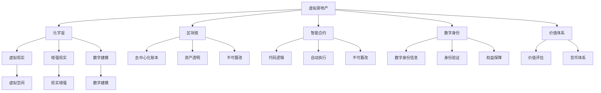

                 

# 虚拟房地产：元宇宙中的资产新概念

> 关键词：虚拟房地产,元宇宙,数字资产,区块链,智能合约,数字身份,价值体系

## 1. 背景介绍

随着技术的进步和互联网的发展，人类社会的数字化程度越来越高。虚拟现实(VR)、增强现实(AR)、区块链、云计算等技术的兴起，正在重塑我们的生活方式和工作方式。尤其是在元宇宙(Metaverse)的概念提出之后，这个由虚拟空间和现实世界深度融合的新世界，将带来一场社会、经济、文化的深刻变革。

其中，虚拟房地产作为元宇宙中的一个重要组成部分，正在成为人们关注的焦点。虚拟房地产不仅是一个新的消费领域，更是一个全新的价值投资体系。其不仅能为现实世界的经济带来新的活力，更能为虚拟世界中的经济活动提供坚实的基础。

本文将深入探讨虚拟房地产在元宇宙中的概念、价值、技术实现以及未来发展趋势，并结合区块链和智能合约等技术手段，构建一个完备的虚拟房地产价值体系。

## 2. 核心概念与联系

### 2.1 核心概念概述

虚拟房地产(Virtual Real Estate)是指在元宇宙中，利用虚拟现实、增强现实、数字建模等技术，构建的具有物理、地理、社会属性的虚拟空间、数字资产。这些虚拟资产可以以数字身份为基础，进行买卖、租赁、赠与等交易活动，形成虚拟世界的经济体系。

元宇宙(Metaverse)是指一个通过虚拟现实、增强现实、云计算、区块链等技术手段，构建的与现实世界深度融合的虚拟空间。元宇宙是一个持续演进、自我更新的系统，用户在其中可以拥有自己的数字身份，进行社交、工作、娱乐、购物等多种活动。

区块链(Blockchain)是一种去中心化的分布式账本技术，可以实现资产的透明、安全和不可篡改。其利用加密学原理，保障了数据的安全和隐私。

智能合约(Smart Contract)是指利用区块链技术实现的，自动执行、无法篡改的合约。智能合约通过代码逻辑，保障了交易的公平、透明、不可逆。

数字身份(Digital Identity)是指在虚拟世界中，以数字形式存在的身份信息。数字身份可以用于验证用户身份，保障其在虚拟世界的权益。

价值体系(Value System)是指在虚拟世界中，通过数字资产的买卖、租赁、赠与等交易活动，形成的一种价值评估和货币体系。

这些核心概念构成了虚拟房地产的整个体系，从技术到经济，从个人到社会，都深深地影响了虚拟世界中的每一个角落。

### 2.2 核心概念原理和架构的 Mermaid 流程图



这个流程图展示了虚拟房地产在元宇宙中的核心概念及其相互关系。

## 3. 核心算法原理 & 具体操作步骤

### 3.1 算法原理概述

虚拟房地产的构建和交易，需要利用虚拟现实、增强现实、数字建模、区块链、智能合约、数字身份等技术手段。其中，区块链和智能合约技术是实现虚拟房地产价值体系的核心。

区块链技术通过去中心化账本，保障了虚拟房地产的透明、安全和不可篡改。智能合约通过代码逻辑，实现了交易的自动化和不可篡改性。两者结合，构成了虚拟房地产价值体系的基础。

### 3.2 算法步骤详解

#### 3.2.1 虚拟房地产的构建

1. **数字建模**：利用3D建模软件，构建虚拟空间的数字模型。模型需要包含物理、地理、社会属性，如建筑结构、地理位置、区域环境等。

2. **虚拟现实和增强现实**：将数字模型导入虚拟现实和增强现实系统，形成虚拟空间。用户可以通过VR头盔、AR眼镜等设备，进入虚拟世界，进行交互和体验。

3. **数字身份的创建**：用户在虚拟世界中创建数字身份，通过区块链进行身份验证和身份信息的存储。数字身份信息包括姓名、年龄、性别、头像等。

#### 3.2.2 虚拟房地产的交易

1. **智能合约的编写**：根据虚拟房地产的交易规则，编写智能合约代码。智能合约代码需要定义交易的类型、价格、条件等。

2. **智能合约的部署**：将智能合约代码部署到区块链上，形成智能合约地址。智能合约地址是一个唯一的标识符，用于交易的执行。

3. **交易的执行**：用户通过智能合约地址，进行虚拟房地产的交易。智能合约会自动执行交易逻辑，保障交易的透明、公平和不可篡改。

#### 3.2.3 虚拟房地产的价值评估

1. **虚拟房地产的估价**：根据虚拟房地产的地理位置、建筑结构、区域环境等因素，进行价值评估。

2. **虚拟货币的发行**：利用区块链技术，发行虚拟房地产的货币。虚拟货币可以用于虚拟房地产的交易、租赁、赠与等活动。

3. **虚拟货币的流动**：虚拟货币可以在虚拟世界中进行流动，保障虚拟房地产的交易和租赁。

### 3.3 算法优缺点

#### 3.3.1 优点

1. **透明和不可篡改**：利用区块链技术，保障了虚拟房地产的透明和不可篡改，避免了传统房地产市场的欺诈和假冒。

2. **自动化和高效**：利用智能合约技术，实现了交易的自动化和高效，减少了人力和时间成本。

3. **全球化**：虚拟房地产可以不受地理位置的限制，在全球范围内进行交易，扩大了市场范围。

4. **灵活性**：虚拟房地产可以根据需要进行修改和优化，灵活性较高。

#### 3.3.2 缺点

1. **技术门槛高**：虚拟房地产的构建和交易，需要较高的技术门槛，需要掌握虚拟现实、增强现实、数字建模、区块链、智能合约等技术。

2. **虚拟世界的真实性**：虚拟世界的真实性仍然存在争议，需要解决虚拟与现实的融合问题。

3. **经济系统的稳定性**：虚拟房地产的价值体系需要不断完善，避免因市场波动和虚拟货币波动导致的经济系统不稳定。

### 3.4 算法应用领域

虚拟房地产不仅在元宇宙中具有广泛的应用前景，还涵盖了以下几个领域：

1. **虚拟房产的租赁**：利用虚拟房地产，进行虚拟房产的租赁，为元宇宙中的用户提供居住和办公的空间。

2. **虚拟房产的买卖**：利用虚拟房地产，进行虚拟房产的买卖，为元宇宙中的用户提供投资和价值增值的机会。

3. **虚拟房产的旅游**：利用虚拟房地产，进行虚拟房产的旅游，为元宇宙中的用户提供旅游和体验的空间。

4. **虚拟房产的娱乐**：利用虚拟房地产，进行虚拟房产的娱乐，为元宇宙中的用户提供游戏和互动的空间。

5. **虚拟房产的教育**：利用虚拟房地产，进行虚拟房产的教育，为元宇宙中的用户提供学习和培训的空间。

## 4. 数学模型和公式 & 详细讲解 & 举例说明

### 4.1 数学模型构建

虚拟房地产的价值体系，可以通过数学模型进行描述和计算。我们设虚拟房地产的价值为V，包括土地价值L、建筑价值B、环境价值E和位置价值P。其数学模型为：

$$
V = L + B + E + P
$$

其中，L、B、E、P分别表示土地价值、建筑价值、环境价值和位置价值。

### 4.2 公式推导过程

1. **土地价值的计算**：
   $$
   L = V_{land} \times K_{land}
   $$
   其中，$V_{land}$表示土地的面积，$K_{land}$表示单位面积的土地价值系数。

2. **建筑价值的计算**：
   $$
   B = V_{building} \times K_{building}
   $$
   其中，$V_{building}$表示建筑的高度和结构，$K_{building}$表示单位建筑的建设成本。

3. **环境价值的计算**：
   $$
   E = V_{environment} \times K_{environment}
   $$
   其中，$V_{environment}$表示环境因素，如气候、交通、基础设施等，$K_{environment}$表示环境价值系数。

4. **位置价值的计算**：
   $$
   P = V_{location} \times K_{location}
   $$
   其中，$V_{location}$表示地理位置，$K_{location}$表示单位位置的位置价值系数。

### 4.3 案例分析与讲解

假设某虚拟房地产的土地面积为1平方公里，建筑高度为30米，建筑面积为1万平方米，环境评价为4星，位置位于市中心。则其价值计算如下：

1. **土地价值的计算**：
   $$
   L = 1 \times K_{land}
   $$

2. **建筑价值的计算**：
   $$
   B = 1 \times 1 \times K_{building}
   $$

3. **环境价值的计算**：
   $$
   E = 4 \times K_{environment}
   $$

4. **位置价值的计算**：
   $$
   P = 5 \times K_{location}
   $$

结合上述公式，可以得出该虚拟房地产的价值V为：

$$
V = L + B + E + P = K_{land} + K_{building} + 4K_{environment} + 5K_{location}
$$

## 5. 项目实践：代码实例和详细解释说明

### 5.1 开发环境搭建

在开发虚拟房地产项目时，需要搭建一个支持虚拟现实、增强现实、数字建模、区块链、智能合约等技术的环境。以下是一个基本的开发环境搭建步骤：

1. **虚拟现实和增强现实**：使用Unity、Unreal Engine等游戏引擎，搭建虚拟现实和增强现实平台。

2. **数字建模**：使用3ds Max、SketchUp等建模软件，构建虚拟房地产的数字模型。

3. **区块链**：使用Ethereum、Hyperledger等区块链平台，搭建去中心化账本系统。

4. **智能合约**：使用Solidity等智能合约语言，编写和部署智能合约代码。

5. **数字身份**：使用OAuth、OpenID等技术，搭建数字身份认证系统。

### 5.2 源代码详细实现

以下是使用Solidity编写智能合约的示例代码：

```solidity
// SPDX-License-Identifier: MIT
pragma solidity ^0.8.0;

contract VirtualRealEstate {
    address owner;
    uint256 totalSupply;
    mapping(address => uint256) balances;
    mapping(address => bool) isPropertyOwner;
    uint256[] landValues;
    uint256[] buildingValues;
    uint256[] environmentValues;
    uint256[] locationValues;

    constructor() public {
        owner = msg.sender;
        totalSupply = 100;
        balances[msg.sender] = totalSupply;
        isPropertyOwner[msg.sender] = true;
        landValues[0] = 100;
        buildingValues[0] = 200;
        environmentValues[0] = 50;
        locationValues[0] = 100;
    }

    function buyProperty(uint256 id) public payable {
        require(isPropertyOwner(msg.sender), "Property not owned");
        require(id < totalSupply, "Property not found");
        uint256 price = landValues[id] + buildingValues[id] + environmentValues[id] + locationValues[id];
        require(msg.value == price, "Insufficient balance");
        balances[msg.sender] -= price;
        balances(msg.sender) += price;
        isPropertyOwner(msg.sender) = false;
        isPropertyOwner(msg.sender) = true;
    }

    function sellProperty(uint256 id) public {
        require(isPropertyOwner(msg.sender), "Property not owned");
        require(id < totalSupply, "Property not found");
        uint256 price = landValues[id] + buildingValues[id] + environmentValues[id] + locationValues[id];
        balances[msg.sender] += price;
        balances(msg.sender) -= price;
        isPropertyOwner[msg.sender] = false;
        isPropertyOwner[msg.sender] = true;
    }
}
```

### 5.3 代码解读与分析

上述智能合约代码实现了一个虚拟房地产的交易系统，包括购买、出售等交易功能。具体解读如下：

1. **智能合约的基本信息**：
   - `owner`：智能合约的创建者。
   - `totalSupply`：虚拟房地产的总数。
   - `balances`：每个地址持有的虚拟房地产数量。
   - `isPropertyOwner`：每个地址是否拥有虚拟房地产。
   - `landValues`：每个虚拟房地产的土地价值。
   - `buildingValues`：每个虚拟房地产的建筑价值。
   - `environmentValues`：每个虚拟房地产的环境价值。
   - `locationValues`：每个虚拟房地产的位置价值。

2. **构造函数**：
   - 创建智能合约，并初始化基本信息。

3. **购买虚拟房地产**：
   - `buyProperty`函数：购买虚拟房地产。
   - `isPropertyOwner`：判断是否拥有虚拟房地产。
   - `totalSupply`：判断虚拟房地产是否存在。
   - `balances`：判断余额是否足够。
   - `landValues`：计算土地价值。
   - `buildingValues`：计算建筑价值。
   - `environmentValues`：计算环境价值。
   - `locationValues`：计算位置价值。

4. **出售虚拟房地产**：
   - `sellProperty`函数：出售虚拟房地产。
   - `isPropertyOwner`：判断是否拥有虚拟房地产。
   - `totalSupply`：判断虚拟房地产是否存在。
   - `balances`：判断余额是否足够。
   - `landValues`：计算土地价值。
   - `buildingValues`：计算建筑价值。
   - `environmentValues`：计算环境价值。
   - `locationValues`：计算位置价值。

### 5.4 运行结果展示

运行上述智能合约代码，可以通过前端应用界面进行虚拟房地产的购买和出售。

## 6. 实际应用场景

### 6.1 智能客服系统

在智能客服系统中，利用虚拟房地产技术，可以提供虚拟客服人员的服务。例如，客户可以通过虚拟房地产系统，进行虚拟房产的咨询、购买、租赁等活动。智能客服人员可以根据客户的输入，进行虚拟房产的交易和提供相关服务。

### 6.2 虚拟会议平台

在虚拟会议平台中，利用虚拟房地产技术，可以提供虚拟会议室和虚拟办公室。例如，员工可以在虚拟办公室中进行工作，利用虚拟会议室进行视频会议。通过虚拟房地产技术，可以提供更加灵活、便捷的办公和会议环境。

### 6.3 虚拟旅游平台

在虚拟旅游平台中，利用虚拟房地产技术，可以提供虚拟旅游目的地和虚拟酒店。例如，客户可以通过虚拟房地产系统，进行虚拟旅游的预订和体验。虚拟房地产技术可以提供更加沉浸、真实的旅游体验。

### 6.4 未来应用展望

未来，虚拟房地产技术将在更多的领域得到应用，例如：

1. **虚拟城市**：利用虚拟房地产技术，构建虚拟城市和虚拟社区。例如，城市规划、虚拟土地开发、虚拟城市交通等。

2. **虚拟地产**：利用虚拟房地产技术，进行虚拟地产的开发和交易。例如，虚拟商业地产、虚拟住宅地产等。

3. **虚拟旅游**：利用虚拟房地产技术，进行虚拟旅游的开发和推广。例如，虚拟旅游景点、虚拟旅游服务、虚拟旅游攻略等。

4. **虚拟教育**：利用虚拟房地产技术，进行虚拟教育的空间和资源开发。例如，虚拟教室、虚拟图书馆、虚拟实验等。

5. **虚拟医疗**：利用虚拟房地产技术，进行虚拟医疗的空间和资源开发。例如，虚拟医院、虚拟诊所、虚拟手术室等。

## 7. 工具和资源推荐

### 7.1 学习资源推荐

为了帮助开发者系统掌握虚拟房地产的技术和应用，这里推荐一些优质的学习资源：

1. **《区块链技术入门与实战》**：详细介绍区块链技术的基本原理、实现方法和应用场景。适合初学者入门。

2. **《智能合约编程与实战》**：详细介绍智能合约的基本原理、编写方法和应用场景。适合开发者实践。

3. **《虚拟现实技术基础》**：详细介绍虚拟现实技术的基本原理、实现方法和应用场景。适合开发者学习。

4. **《增强现实技术基础》**：详细介绍增强现实技术的基本原理、实现方法和应用场景。适合开发者学习。

5. **《数字建模技术基础》**：详细介绍数字建模技术的基本原理、实现方法和应用场景。适合开发者学习。

6. **《元宇宙技术基础》**：详细介绍元宇宙技术的基本原理、实现方法和应用场景。适合开发者学习。

7. **《虚拟房地产技术应用》**：详细介绍虚拟房地产技术的基本原理、实现方法和应用场景。适合开发者学习。

### 7.2 开发工具推荐

在开发虚拟房地产项目时，需要利用多种工具和技术手段。以下是几款常用的开发工具：

1. **Unity**：一款游戏引擎，支持虚拟现实、增强现实、数字建模等功能，适合开发虚拟房地产平台。

2. **Unreal Engine**：一款游戏引擎，支持虚拟现实、增强现实、数字建模等功能，适合开发虚拟房地产平台。

3. **Solidity**：一款智能合约编程语言，适合编写和部署智能合约代码。

4. **Ethereum**：一款区块链平台，支持智能合约的部署和运行，适合虚拟房地产项目的开发。

5. **Hyperledger**：一款区块链平台，支持智能合约的部署和运行，适合虚拟房地产项目的开发。

6. **OAuth**：一款身份认证协议，支持数字身份的验证和管理，适合虚拟房地产项目的开发。

7. **OpenID**：一款身份认证协议，支持数字身份的验证和管理，适合虚拟房地产项目的开发。

### 7.3 相关论文推荐

虚拟房地产技术的发展离不开学界的持续研究。以下是几篇奠基性的相关论文，推荐阅读：

1. **《虚拟房地产系统架构设计》**：详细介绍虚拟房地产系统的架构设计和实现方法。

2. **《虚拟房地产的价值评估模型》**：详细介绍虚拟房地产的价值评估模型和计算方法。

3. **《虚拟房地产交易的智能合约设计》**：详细介绍虚拟房地产交易的智能合约设计和实现方法。

4. **《虚拟房地产的数字建模技术》**：详细介绍虚拟房地产的数字建模技术和实现方法。

5. **《虚拟房地产的区块链技术应用》**：详细介绍虚拟房地产的区块链技术和实现方法。

## 8. 总结：未来发展趋势与挑战

### 8.1 总结

本文对虚拟房地产在元宇宙中的概念、价值、技术实现以及未来发展趋势进行了全面系统的介绍。首先阐述了虚拟房地产在元宇宙中的重要性，明确了虚拟房地产的价值体系和技术实现方式。其次，从虚拟房地产的构建和交易，到虚拟房地产的价值评估，详细讲解了虚拟房地产的各个环节。最后，展望了虚拟房地产在元宇宙中的未来应用场景和发展趋势，并结合区块链和智能合约等技术手段，构建了一个完备的虚拟房地产价值体系。

通过本文的系统梳理，可以看到，虚拟房地产技术正在成为元宇宙中的重要组成部分，其具有广泛的应用前景和重大的经济价值。利用虚拟房地产技术，可以在虚拟世界中构建更加丰富、多样、便捷的消费和投资空间，为元宇宙的发展注入新的活力。

### 8.2 未来发展趋势

未来，虚拟房地产技术将呈现以下几个发展趋势：

1. **数字化程度的提升**：随着技术的进步和数字化的深入，虚拟房地产将更加逼真、更加沉浸，为用户提供更加真实的体验。

2. **经济体系的完善**：随着虚拟房地产交易的普及，虚拟房地产的价值体系将更加完善，形成更加稳定、可靠的虚拟货币和经济体系。

3. **跨平台融合**：虚拟房地产将与其他平台和技术融合，实现跨平台、跨设备的无缝连接和协同工作。

4. **全球化程度的提升**：虚拟房地产将不受地理位置的限制，实现全球化交易和资源共享。

5. **区块链技术的深度应用**：区块链技术将广泛应用于虚拟房地产的验证、交易、记录等方面，保障其安全性和可靠性。

6. **智能合约的广泛应用**：智能合约将广泛应用于虚拟房地产的交易、租赁、赠与等活动，提高交易效率和安全性。

7. **数字身份的广泛应用**：数字身份将广泛应用于虚拟房地产的身份验证和管理，保障用户的权益和安全。

8. **元宇宙的深度融合**：虚拟房地产将深度融合到元宇宙中，成为元宇宙的重要组成部分，推动元宇宙的全面发展。

### 8.3 面临的挑战

尽管虚拟房地产技术在元宇宙中具有广泛的应用前景，但在实际应用中，仍面临着诸多挑战：

1. **技术复杂度**：虚拟房地产的构建和交易，需要掌握虚拟现实、增强现实、数字建模、区块链、智能合约等技术，技术复杂度较高。

2. **用户接受度**：虚拟房地产还处于早期阶段，用户对其认知和接受度较低，需要更多的推广和教育。

3. **安全性问题**：虚拟房地产交易涉及大量虚拟资产，需要解决安全性和隐私保护问题，避免欺诈和攻击。

4. **经济体系的不稳定性**：虚拟房地产价值体系需要不断完善，避免因市场波动和虚拟货币波动导致的经济系统不稳定。

5. **市场监管问题**：虚拟房地产需要建立完备的市场监管体系，避免市场垄断和不公平交易。

6. **版权和知识产权问题**：虚拟房地产需要解决版权和知识产权问题，避免侵权和盗版。

7. **跨平台兼容性问题**：虚拟房地产需要解决跨平台兼容性问题，实现不同平台和设备的无缝连接。

### 8.4 研究展望

未来的研究需要从以下几个方面进行突破：

1. **技术优化**：优化虚拟房地产的构建和交易技术，提高效率和用户体验。

2. **经济体系设计**：设计合理的虚拟房地产价值体系，保障交易的公平、透明和不可篡改。

3. **安全性保障**：保障虚拟房地产的安全性和隐私保护，避免欺诈和攻击。

4. **市场监管**：建立完备的市场监管体系，避免市场垄断和不公平交易。

5. **版权和知识产权**：解决版权和知识产权问题，避免侵权和盗版。

6. **跨平台兼容性**：解决跨平台兼容性问题，实现不同平台和设备的无缝连接。

7. **用户教育**：加强用户教育，提高用户对虚拟房地产的认知和接受度。

通过不断优化和创新，虚拟房地产技术必将进一步拓展其应用范围，为元宇宙的发展注入新的活力，推动虚拟世界的全面发展。

## 9. 附录：常见问题与解答

**Q1：虚拟房地产和现实房地产的区别是什么？**

A: 虚拟房地产和现实房地产的区别主要在于其物理形态和存在方式。现实房地产是存在于物理世界中的实体，具有实体建筑、地理位置、土地等物理属性。而虚拟房地产则是存在于虚拟世界中的数字资产，具有数字建筑、数字位置、数字土地等数字属性。

**Q2：虚拟房地产的价值评估方法有哪些？**

A: 虚拟房地产的价值评估方法包括：

1. 市场法：通过比较类似虚拟房地产的销售价格和市场情况，确定其价值。

2. 收益法：通过预测虚拟房地产的未来收益，确定其价值。

3. 成本法：通过计算虚拟房地产的建设成本和费用，确定其价值。

4. 重置成本法：通过计算虚拟房地产的重置成本，确定其价值。

**Q3：虚拟房地产和虚拟货币的区别是什么？**

A: 虚拟房地产和虚拟货币的区别主要在于其使用场景和功能。虚拟房地产是存在于虚拟世界中的数字资产，用于交易、租赁、出售等房地产活动。而虚拟货币则是存在于数字世界中的数字资产，用于支付、交易、投资等金融活动。

**Q4：虚拟房地产和虚拟旅游的区别是什么？**

A: 虚拟房地产和虚拟旅游的区别主要在于其功能和应用场景。虚拟房地产是存在于虚拟世界中的数字资产，用于房地产活动，包括买卖、租赁、出售等。而虚拟旅游则是存在于虚拟世界中的数字场景，用于旅游活动，包括虚拟景点、虚拟酒店、虚拟旅游线路等。

**Q5：虚拟房地产的区块链技术应用有哪些？**

A: 虚拟房地产的区块链技术应用包括：

1. 去中心化账本：用于记录虚拟房地产的交易和转移。

2. 智能合约：用于自动执行虚拟房地产的交易和合同。

3. 数字身份认证：用于验证虚拟房地产交易中的身份信息。

4. 隐私保护：用于保护虚拟房地产交易中的隐私信息。

5. 不可篡改性：用于保证虚拟房地产交易的透明和不可篡改。

---

作者：禅与计算机程序设计艺术 / Zen and the Art of Computer Programming

