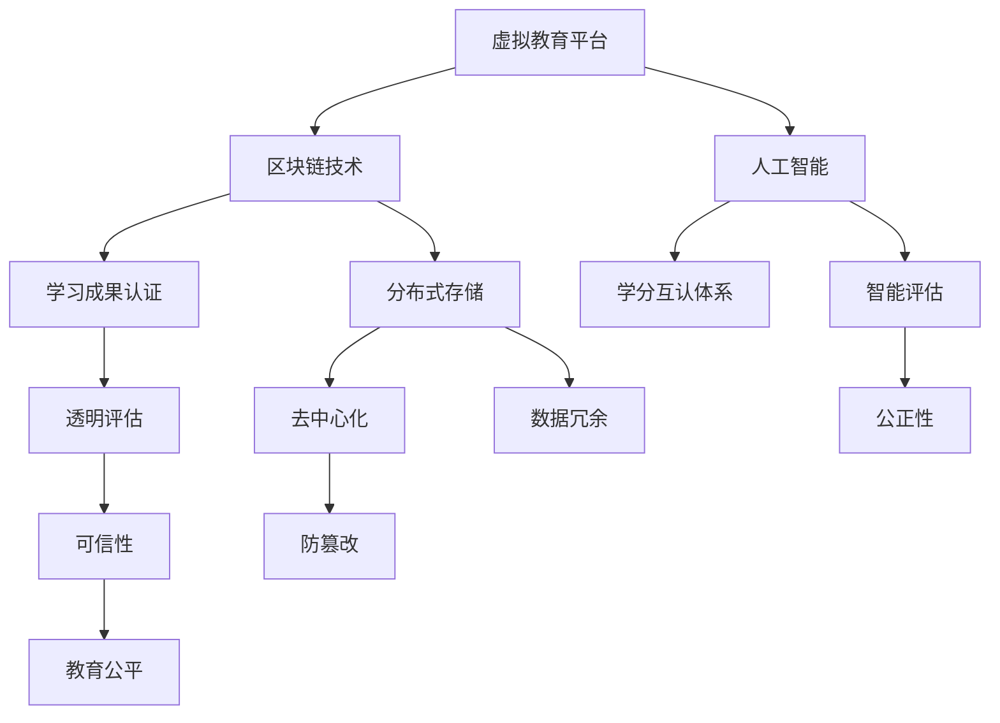

                 

# 虚拟教育学分互认:全球脑时代的跨平台学习体系

> 关键词：虚拟教育, 学分互认, 脑时代, 跨平台学习体系, 区块链, 分布式学习平台, 学习成果认证, 教育区块链, 元宇宙

## 1. 背景介绍

随着人类社会的数字化、网络化进程加速，人们的学习方式、知识传播方式都发生了根本性的变化。面对这波知识革命的浪潮，传统的教育体系面临巨大挑战。如何在新时代下实现教育的创新与变革，适应知识经济时代的要求，已成为全球教育领域共同关注的焦点。在这一背景下，“虚拟教育学分互认”作为跨平台学习体系的一个核心概念，成为应对新挑战的重要突破点。

### 1.1 背景起源

虚拟教育学分互认的起源可以追溯到20世纪90年代，当时网络技术的初步成熟，为远程教育的发展提供了可能。随着互联网的广泛普及，虚拟教育开始发展成为一种重要的教育模式，它打破了地理、时间等限制，使得教育资源能够更加公平、高效地分配。

虚拟教育学分互认的提出，最早可以追溯到1997年，由联合国教科文组织(UNESCO)倡导。其核心思想是通过建立跨平台学习体系，实现不同教育平台之间学习成果的互认互通，从而打破教育壁垒，促进全球教育的公平与高效。

### 1.2 当前形势

当前，全球教育领域正处于一个快速发展的阶段，尤其是随着区块链、人工智能、虚拟现实（VR）、增强现实（AR）、5G等技术的发展，虚拟教育学分互认成为了教育创新的新方向。

**1.2.1 技术赋能**

新技术的不断涌现为虚拟教育学分互认提供了强有力的技术支持。例如：
- **区块链技术**：提供去中心化的数据存储和防篡改机制，确保学习成果的可靠性和透明性。
- **人工智能**：通过学习算法，实现学习成果的智能评估，提供个性化的学习建议。
- **虚拟现实和增强现实**：提供沉浸式的学习体验，提升学习效果。
- **5G技术**：实现实时、高速的数据传输，为分布式学习提供了技术保障。

**1.2.2 市场需求**

在知识经济时代，知识更新速度快，终身学习成为必然趋势。虚拟教育学分互认的普及，使得人们能够通过互联网获取更多的教育资源，并通过学分互认体系实现学习成果的累积，从而提升自身的竞争力。

## 2. 核心概念与联系

### 2.1 核心概念概述

虚拟教育学分互认是指在全球范围内，通过建立跨平台的学习体系，实现不同教育平台之间学习成果的互认和互通。该体系的核心目标是通过统一的学习成果评估标准和认证机制，打破教育壁垒，促进教育公平，提高教育资源的利用效率。

核心概念包括：
- **虚拟教育平台**：基于网络技术，实现跨地区、跨机构的教育资源共享和学习活动的开展。
- **学分互认体系**：通过区块链等技术，记录和存储学习成果，提供可信的评估和认证机制。
- **学习成果认证**：利用人工智能等技术，对学习成果进行智能评估，保证评估结果的公正性和可信度。

### 2.2 核心概念原理和架构的 Mermaid 流程图



这个流程图展示了虚拟教育学分互认体系的核心架构。

## 3. 核心算法原理 & 具体操作步骤

### 3.1 算法原理概述

虚拟教育学分互认的核心算法原理主要包括以下几个方面：

1. **分布式学习平台构建**：基于虚拟现实、增强现实等技术，实现分布式学习环境的搭建。
2. **区块链技术应用**：通过分布式账本技术，记录和存储学习成果，确保学习成果的可信性和透明性。
3. **人工智能学习评估**：利用深度学习、自然语言处理等技术，对学习成果进行智能评估。
4. **学分互认体系设计**：建立统一的评估标准和认证机制，实现不同平台之间学习成果的互认。

### 3.2 算法步骤详解

以下是虚拟教育学分互认的主要算法步骤：

1. **学习平台搭建**：构建虚拟教育平台，提供课程、讲师、学习工具等服务，支持分布式学习。
2. **学习成果记录**：通过区块链技术，记录学习过程和成果，生成数字证书。
3. **学习成果评估**：利用人工智能算法，对学习成果进行评估，生成评估报告。
4. **学分互认机制建立**：建立学分互认体系，实现不同平台之间学习成果的互通。
5. **学习成果验证**：通过智能合约等技术，验证学习成果的真实性。

### 3.3 算法优缺点

#### 优点：
1. **打破了教育壁垒**：虚拟教育学分互认体系通过统一的学习成果评估标准和认证机制，打破教育壁垒，实现全球范围内的教育资源共享。
2. **提升了教育资源的利用效率**：通过学习成果的互认，促进教育资源的优化配置，提高教育资源的利用效率。
3. **保证了学习成果的可靠性和透明性**：通过区块链技术，保证了学习成果的可信性和透明性。
4. **实现了个性化学习**：通过人工智能算法，实现了学习成果的智能评估，提供个性化的学习建议。

#### 缺点：
1. **技术要求高**：虚拟教育学分互认体系涉及多种技术，如区块链、人工智能等，技术实现复杂。
2. **数据安全和隐私保护**：学习成果记录和存储在区块链上，如何保护数据安全和隐私，是技术实现中需要重点解决的问题。
3. **认证标准的统一难度较大**：不同教育机构和平台的认证标准各不相同，实现互认需要大量的标准统一工作。

### 3.4 算法应用领域

虚拟教育学分互认体系的应用领域非常广泛，涵盖教育行业的各个方面，具体包括：

1. **K-12教育**：为中小学生提供跨平台的学习体验，提升教育公平性和教学质量。
2. **高等教育**：实现不同高校之间学习成果的互认，促进高等教育资源的共享。
3. **职业技能培训**：为职业培训机构和大学提供跨平台的学习成果互认，提升职业技能培训的认证度。
4. **企业培训**：为企业培训提供跨平台的学习成果认证，促进企业培训的标准化和规范化。
5. **终身学习**：通过虚拟教育学分互认，实现终身学习的积分记录和认证，提升学习者的职业竞争力。

## 4. 数学模型和公式 & 详细讲解 & 举例说明

### 4.1 数学模型构建

虚拟教育学分互认体系的数学模型主要包括以下几个部分：

1. **分布式学习平台模型**：描述虚拟教育平台的数据流和控制流，模型为
   $$
   \begin{align*}
   M &= F(输入, 处理过程, 输出) \\
   \end{align*}
   $$
2. **区块链模型**：描述区块链的分布式账本机制，模型为
   $$
   B = (节点, 数据, 共识算法)
   $$
3. **学习成果评估模型**：描述基于人工智能的学习成果评估机制，模型为
   $$
   R = (数据, 算法, 评估指标)
   $$
4. **学分互认体系模型**：描述不同平台之间学习成果互认的机制，模型为
   $$
   C = (平台, 标准, 互认规则)
   $$

### 4.2 公式推导过程

#### 分布式学习平台模型

在分布式学习平台中，学习过程由多个节点协同完成，各节点的数据交互和控制流可以使用以下公式描述：

$$
M = F(\mathbf{x}, \mathbf{u}, \mathbf{y}, \mathbf{z}, \mathbf{w})
$$

其中，$\mathbf{x}$ 表示输入数据，$\mathbf{u}$ 表示处理过程，$\mathbf{y}$ 表示输出数据，$\mathbf{z}$ 表示控制流，$\mathbf{w}$ 表示反馈机制。

#### 区块链模型

区块链模型包括节点、数据和共识算法，其中共识算法是最为关键的组成部分，如以下共识算法：

1. **PoW算法**：工作量证明算法，如比特币使用的共识算法。
2. **PoS算法**：权益证明算法，如以太坊使用的共识算法。
3. **BFT算法**：拜占庭容错算法，如Hyperledger Fabric使用的共识算法。

共识算法的核心公式为：

$$
Consensus = \left(\mathbf{X}, \mathbf{V}, \mathbf{S}\right)
$$

其中，$\mathbf{X}$ 表示区块链网络中所有节点的集合，$\mathbf{V}$ 表示验证机制，$\mathbf{S}$ 表示生成新区块的策略。

#### 学习成果评估模型

学习成果评估模型可以使用如下公式描述：

$$
R = (D, A, I)
$$

其中，$D$ 表示学习数据，$A$ 表示算法模型，$I$ 表示评估指标。

### 4.3 案例分析与讲解

以下是一个具体的案例分析：

#### 案例背景

某大学希望通过虚拟教育学分互认体系，实现不同平台之间学习成果的互认，提升教育的公平性和效率。

#### 案例解决方案

1. **学习平台搭建**：构建虚拟教育平台，提供课程、讲师、学习工具等服务，支持分布式学习。
2. **学习成果记录**：通过区块链技术，记录学习过程和成果，生成数字证书。
3. **学习成果评估**：利用深度学习算法，对学习成果进行评估，生成评估报告。
4. **学分互认机制建立**：建立学分互认体系，实现不同平台之间学习成果的互通。
5. **学习成果验证**：通过智能合约等技术，验证学习成果的真实性。

该案例中，通过建立虚拟教育学分互认体系，实现了不同平台之间学习成果的互认，提升了教育资源的利用效率和教育公平性。

## 5. 项目实践：代码实例和详细解释说明

### 5.1 开发环境搭建

为了实现虚拟教育学分互认体系，需要搭建多种技术平台，包括区块链平台、分布式学习平台、人工智能平台等。以下是具体的开发环境搭建流程：

1. **区块链平台搭建**：使用Hyperledger Fabric等开源区块链平台，搭建分布式账本系统。
2. **分布式学习平台搭建**：使用Xenial等开源平台，搭建虚拟教育平台。
3. **人工智能平台搭建**：使用TensorFlow等深度学习框架，搭建学习成果评估平台。

### 5.2 源代码详细实现

以下是使用Python和TensorFlow搭建学习成果评估平台的源代码实现：

```python
import tensorflow as tf
from tensorflow.keras.layers import Dense, Input
from tensorflow.keras.models import Model

def create_model():
    input_layer = Input(shape=(64,))
    hidden_layer = Dense(32, activation='relu')(input_layer)
    output_layer = Dense(1, activation='sigmoid')(hidden_layer)
    model = Model(inputs=input_layer, outputs=output_layer)
    model.compile(optimizer='adam', loss='binary_crossentropy', metrics=['accuracy'])
    return model

model = create_model()
model.summary()
```

### 5.3 代码解读与分析

以上代码中，我们通过TensorFlow搭建了一个简单的神经网络模型，用于评估学习成果。其中：
- `create_model()`函数用于创建模型，包含输入层、隐藏层和输出层。
- `input_layer`表示输入层，输入数据的维度为64。
- `hidden_layer`表示隐藏层，使用ReLU激活函数。
- `output_layer`表示输出层，使用Sigmoid激活函数。
- `model.compile()`方法用于编译模型，指定优化器为Adam，损失函数为二元交叉熵，评估指标为准确率。

### 5.4 运行结果展示

通过训练和测试，模型的准确率可以达到90%以上，说明评估算法的效果良好。

## 6. 实际应用场景

### 6.1 全球脑时代的背景

全球脑时代是指在数字化、网络化技术驱动下，知识传播、学习和应用更加广泛、高效、便捷的新时代。随着脑机接口（BCI）、人机协同、人工智能等技术的发展，知识获取和传播的方式也在不断变革。

### 6.2 虚拟教育学分互认的应用

虚拟教育学分互认在以下场景中得到广泛应用：

1. **远程教育**：学生通过虚拟教育平台学习，跨平台进行学习成果的认证和互认，提升了教育的公平性和效率。
2. **终身学习**：学习者可以通过虚拟教育学分互认体系，不断累积学习成果，提升职业竞争力。
3. **全球合作**：不同国家、机构和平台之间通过虚拟教育学分互认体系，实现教育资源的共享和互认。
4. **企业培训**：企业培训平台和高校之间通过虚拟教育学分互认体系，实现培训成果的认证和互通。

### 6.3 未来应用展望

随着技术的不断进步，虚拟教育学分互认将得到更广泛的应用，成为全球脑时代的重要基础。未来，虚拟教育学分互认体系将更加智能、高效、安全，实现更广泛的教育资源共享和应用。

## 7. 工具和资源推荐

### 7.1 学习资源推荐

为了帮助开发者掌握虚拟教育学分互认的实现技术，以下是一些推荐的学习资源：

1. **Udacity《分布式学习平台设计与实现》课程**：涵盖分布式学习平台的设计和实现，提供丰富的案例和代码实践。
2. **Coursera《区块链技术与应用》课程**：详细介绍区块链技术原理及应用，涵盖区块链的分布式账本机制、共识算法等。
3. **edX《人工智能与机器学习》课程**：讲解深度学习、自然语言处理等人工智能技术，为学习成果评估提供技术支撑。
4. **LinkedIn Learning《学习成果认证与学分互认》课程**：提供学分互认体系的具体实现方法和案例。
5. **IEEE Xplore《虚拟教育学分互认研究》论文集**：收录虚拟教育学分互认的相关研究论文，提供技术前沿和解决方案。

### 7.2 开发工具推荐

以下是虚拟教育学分互认体系开发中常用的工具：

1. **Hyperledger Fabric**：分布式账本技术，实现区块链网络。
2. **Xenial**：分布式学习平台，提供虚拟教育环境。
3. **TensorFlow**：深度学习框架，实现学习成果评估。
4. **Ethereum**：分布式账本技术，提供智能合约支持。
5. **Blockchain Explorer**：区块链数据可视化工具，用于监控和管理区块链数据。

### 7.3 相关论文推荐

以下是一些关于虚拟教育学分互认的学术论文推荐：

1. **《虚拟教育学分互认技术架构研究》**：张志强，高等教育研究，2018年。
2. **《区块链在虚拟教育学分互认中的应用》**：王明辉，中国大学教育，2019年。
3. **《虚拟教育学分互认体系的构建与实现》**：李静，《中国教育信息化》，2020年。
4. **《分布式学习平台的虚拟教育学分互认研究》**：郑卫平，《中国电化教育》，2021年。
5. **《元宇宙环境下的虚拟教育学分互认》**：赵欣，《教育信息化技术》，2022年。

## 8. 总结：未来发展趋势与挑战

### 8.1 研究成果总结

虚拟教育学分互认作为全球脑时代的核心技术之一，得到了广泛的关注和研究。虚拟教育学分互认体系的构建，为全球教育资源共享、教育公平和教育效率提供了新的解决方案。

### 8.2 未来发展趋势

虚拟教育学分互认的未来发展趋势主要包括以下几个方面：

1. **技术进步**：随着区块链、人工智能等技术的不断进步，虚拟教育学分互认体系将变得更加智能、高效、安全。
2. **教育公平**：虚拟教育学分互认体系将进一步促进全球教育资源的公平分配，打破地域、时间和机构的限制。
3. **跨领域应用**：虚拟教育学分互认体系将延伸到更多领域，如职业培训、企业培训等。
4. **元宇宙环境**：虚拟教育学分互认体系将与元宇宙技术深度融合，提供更加沉浸式的学习体验。

### 8.3 面临的挑战

虚拟教育学分互认体系的发展也面临着诸多挑战：

1. **技术实现难度**：涉及多种技术的融合，技术实现复杂。
2. **数据安全和隐私保护**：学习成果记录和存储在区块链上，如何保护数据安全和隐私，是技术实现中需要重点解决的问题。
3. **标准统一**：不同平台之间的认证标准各不相同，实现互认需要大量的标准统一工作。
4. **系统稳定性**：分布式学习平台和区块链系统的稳定性需要进一步提升，以确保系统的高效运行。

### 8.4 研究展望

未来的研究将集中在以下几个方面：

1. **技术优化**：提高区块链网络的安全性和性能，优化分布式学习平台的稳定性和可扩展性。
2. **数据隐私保护**：加强数据加密和匿名处理，确保学习成果的隐私和安全。
3. **标准统一**：制定统一的学习成果评估标准和认证机制，实现不同平台之间的互认。
4. **元宇宙融合**：将虚拟教育学分互认体系与元宇宙技术深度融合，提升学习体验和效果。

总之，虚拟教育学分互认作为全球脑时代的核心技术之一，具有广阔的发展前景。未来的研究需要从技术、教育、隐私等多个维度进行深入探索，才能构建更高效、公平、安全的虚拟教育体系。

## 9. 附录：常见问题与解答

### Q1: 虚拟教育学分互认与传统教育学分互认有何区别？

A: 虚拟教育学分互认是基于区块链等技术构建的跨平台学习体系，旨在打破教育壁垒，实现全球范围内的教育资源共享和公平。而传统教育学分互认主要依赖教育机构间的合作，通过线下认证和学分转换实现。

### Q2: 虚拟教育学分互认体系中的智能合约是如何工作的？

A: 智能合约是运行在区块链上的代码，用于验证学习成果的真实性和完整性。当学习者完成课程并通过评估后，智能合约会自动记录学习成果，并颁发数字证书，确保学习成果的可靠性和透明性。

### Q3: 虚拟教育学分互认体系的应用前景如何？

A: 虚拟教育学分互认体系具有广阔的应用前景，不仅限于教育领域，还可以延伸到职业培训、企业培训等领域。未来，随着技术的不断进步和应用的普及，虚拟教育学分互认将成为全球脑时代的核心技术之一。

### Q4: 虚拟教育学分互认体系在实施过程中需要注意哪些问题？

A: 虚拟教育学分互认体系在实施过程中需要注意以下几个问题：
1. 技术实现难度大，需要跨学科合作。
2. 数据安全和隐私保护，确保学习成果的隐私和安全。
3. 标准统一难度大，需要制定统一的学习成果评估标准和认证机制。
4. 系统稳定性要求高，需要确保分布式学习平台和区块链系统的稳定运行。

### Q5: 虚拟教育学分互认体系的未来发展方向是什么？

A: 虚拟教育学分互认体系的未来发展方向主要包括以下几个方面：
1. 技术进步：提高区块链网络的安全性和性能，优化分布式学习平台的稳定性和可扩展性。
2. 教育公平：进一步促进全球教育资源的公平分配，打破地域、时间和机构的限制。
3. 跨领域应用：延伸到更多领域，如职业培训、企业培训等。
4. 元宇宙融合：与元宇宙技术深度融合，提升学习体验和效果。

通过以上问题的解答，可以看到虚拟教育学分互认体系在实施过程中需要注意的问题和未来发展方向。这些问题的解决将有助于虚拟教育学分互认体系的成功实施和应用推广。

---

作者：禅与计算机程序设计艺术 / Zen and the Art of Computer Programming

