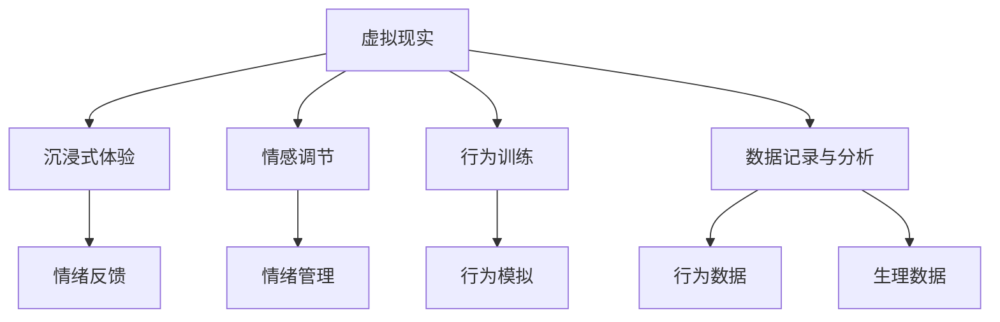

                 

# 虚拟现实创伤治疗:全球脑辅助的心理康复

## 1. 背景介绍

随着虚拟现实技术（VR）的迅速发展，其在医疗领域的应用日益广泛。虚拟现实技术通过创建一个沉浸式的虚拟环境，使患者在虚拟空间中进行心理康复训练，以期帮助其应对创伤后的心理问题。本文将重点探讨虚拟现实在心理康复领域的应用，尤其是在脑辅助心理康复方面的潜力。

### 1.1 问题由来

在现代社会中，由于各种心理创伤（如战争、灾难、家庭暴力等）导致心理问题的患者数量不断增加。传统的心理治疗方法，如药物治疗和心理疗法，尽管在某种程度上有效，但对于部分患者而言，这些方法可能不够理想或难以持续。虚拟现实技术作为一种新型的治疗手段，提供了一种新颖且具吸引力的康复途径。

### 1.2 问题核心关键点

虚拟现实在心理康复中的应用主要体现在以下几个方面：
1. **沉浸式体验**：通过虚拟现实技术，患者可以在一个高度逼真的虚拟环境中，重现和体验其创伤情境，帮助其逐步适应和面对创伤记忆。
2. **情感调节**：虚拟现实中的情绪反馈机制和可交互性，可以帮助患者在模拟环境中进行情绪调节，减少现实世界中的情感负担。
3. **行为训练**：通过虚拟现实中的行为模拟和反馈，帮助患者在安全的环境中进行行为训练，增强其在真实环境中的应对能力。
4. **数据记录与分析**：虚拟现实环境中的数据记录，有助于研究人员了解患者的心理状态和行为模式，为后续治疗提供科学依据。

这些核心关键点构成了虚拟现实在心理康复中的基本应用框架，为后续的研究提供了方向。

## 2. 核心概念与联系

### 2.1 核心概念概述

在探讨虚拟现实在心理康复中的应用时，我们需要了解以下几个核心概念：

- **虚拟现实（Virtual Reality, VR）**：一种通过计算机技术生成的逼真视觉、听觉、触觉等感官体验，创建了一个与现实世界交互的三维环境。
- **脑辅助心理康复（Brain-Assisted Psychological Rehabilitation）**：通过脑机接口(Brain-Computer Interface, BCI)等技术，实时监测和调控患者的心理状态，辅助心理康复过程。
- **沉浸式体验（Immersive Experience）**：通过虚拟现实技术，使患者在虚拟环境中全身心投入，获得更加真实和深刻的体验。
- **情感调节（Emotion Regulation）**：通过虚拟现实中的交互和反馈，帮助患者学习如何管理和调节自己的情绪。
- **行为训练（Behavioral Training）**：通过虚拟现实中的模拟和训练，帮助患者学习如何适应和应对特定的行为情境。
- **数据记录与分析（Data Recording and Analysis）**：通过虚拟现实环境中的传感器和设备，记录患者的行为和生理数据，用于后续的分析和评估。

这些概念之间的逻辑关系可以通过以下Mermaid流程图来展示：



这个流程图展示了虚拟现实在心理康复中的关键应用场景及其相互联系。

## 3. 核心算法原理 & 具体操作步骤

### 3.1 算法原理概述

虚拟现实在脑辅助心理康复中的应用，主要依赖于以下几个关键算法和原理：

1. **虚拟环境构建**：基于计算机图形学和空间定位技术，创建高度逼真的虚拟环境。
2. **实时渲染与反馈**：通过实时渲染技术，根据患者在虚拟环境中的行为和情绪状态，动态调整虚拟场景和反馈机制。
3. **脑机接口技术**：通过脑电图(EEG)、功能性磁共振成像(fMRI)等技术，实时监测和调控患者的心理状态。
4. **情感识别与反馈**：利用机器学习和深度学习技术，识别和分析患者的情感状态，提供实时反馈和指导。
5. **行为训练算法**：基于行为模拟和反馈，设计和实现行为训练算法，帮助患者逐步适应和应对特定情境。
6. **数据记录与分析算法**：利用传感器和设备，记录患者的行为和生理数据，并使用数据分析技术，评估康复效果。

这些算法和原理共同构成了虚拟现实在脑辅助心理康复中的核心框架。

### 3.2 算法步骤详解

虚拟现实在脑辅助心理康复的应用步骤主要包括以下几个环节：

**Step 1: 构建虚拟环境**

1. **环境设计**：根据患者的创伤情境，设计相应的虚拟环境，包括场景、角色、任务等。
2. **实时渲染**：利用高性能计算设备，实时渲染虚拟环境，确保场景的逼真度和流畅度。

**Step 2: 实时监测与反馈**

1. **生理数据监测**：通过脑电图(EEG)、功能性磁共振成像(fMRI)等设备，实时监测患者的生理指标，如心率、皮电反应等。
2. **情感状态识别**：利用情感识别算法，分析患者的面部表情、语音特征等，判断其情感状态。
3. **实时反馈**：根据患者的生理和情感状态，实时调整虚拟环境的难度和任务，提供相应的情感反馈。

**Step 3: 行为训练与调节**

1. **行为模拟**：在虚拟环境中模拟特定的行为情境，如社交互动、公共演讲等。
2. **行为训练算法**：根据行为模拟和反馈，设计并实现行为训练算法，逐步提升患者的应对能力。
3. **情感调节**：通过虚拟环境中的交互和反馈，帮助患者学习情绪管理和调节的技巧。

**Step 4: 数据记录与分析**

1. **行为数据记录**：通过传感器和设备，记录患者在虚拟环境中的行为数据。
2. **生理数据记录**：记录患者的生理数据，如心率、皮电反应等。
3. **数据分析**：利用数据分析算法，评估患者的康复效果，提供个性化的治疗建议。

通过上述步骤，虚拟现实技术可以有效地辅助患者进行心理康复，提升其应对能力和生活质量。

### 3.3 算法优缺点

虚拟现实在脑辅助心理康复中的应用具有以下优点：
1. **沉浸式体验**：通过高度逼真的虚拟环境，患者可以获得沉浸式的体验，增强康复效果。
2. **情感调节与行为训练**：虚拟环境中的交互和反馈机制，帮助患者进行情绪管理和行为训练。
3. **实时监测与数据记录**：实时监测和记录生理与行为数据，为治疗提供科学依据。

然而，虚拟现实在应用中也存在一些局限：
1. **成本较高**：构建和维护高度逼真的虚拟环境需要较高的技术要求和成本。
2. **技术门槛**：需要专业技术人员进行设计和维护，技术门槛较高。
3. **患者适应性**：部分患者可能对虚拟环境存在抵触情绪，影响治疗效果。

尽管存在这些局限，虚拟现实在脑辅助心理康复中依然展现出巨大的潜力，值得进一步探索和优化。

### 3.4 算法应用领域

虚拟现实在脑辅助心理康复中的应用领域广泛，包括但不限于以下几个方面：

- **战争创伤**：通过虚拟现实技术，模拟战场环境，帮助士兵应对创伤后应激障碍(PTSD)。
- **灾难幸存者**：利用虚拟现实，重现灾难情境，帮助幸存者逐步适应和面对心理创伤。
- **家庭暴力受害者**：通过虚拟现实，构建安全模拟环境，帮助受害者练习应对策略。
- **儿童创伤**：在虚拟现实环境中，重现创伤情境，帮助儿童进行心理康复训练。

## 4. 数学模型和公式 & 详细讲解 & 举例说明

### 4.1 数学模型构建

虚拟现实在脑辅助心理康复中的数学模型主要涉及以下几个方面：

- **虚拟环境建模**：利用计算机图形学和空间定位技术，建立虚拟环境的三维模型。
- **实时渲染算法**：基于物理模拟和光照模型，实现虚拟环境的实时渲染。
- **情感识别算法**：利用机器学习和深度学习技术，识别和分析患者的情感状态。
- **行为训练算法**：基于行为模拟和反馈，设计并实现行为训练算法。
- **数据分析算法**：利用统计学和机器学习技术，分析和评估患者的康复效果。

### 4.2 公式推导过程

以下将以情感识别算法为例，介绍其数学模型和公式推导过程。

假设患者在虚拟环境中的面部表情、语音特征等作为输入特征，记为 $\mathbf{x} = (x_1, x_2, ..., x_n)$，其中 $x_i$ 表示第 $i$ 个特征。情感状态 $y$ 可以表示为二分类问题，即 $y \in \{0, 1\}$，其中 $0$ 表示负面情感，$1$ 表示正面情感。

情感识别算法通常使用支持向量机(SVM)或深度神经网络模型，进行特征提取和分类。假设使用深度神经网络模型进行情感识别，网络结构如图1所示。

图1：情感识别神经网络结构图

神经网络的输入层接受特征 $\mathbf{x}$，经过多个隐藏层后输出情感分类结果 $y$。设神经网络的结构参数为 $\theta$，则情感识别问题的数学模型可以表示为：

$$
y = f(\mathbf{x}; \theta)
$$

其中 $f$ 为神经网络的非线性映射，$\theta$ 表示神经网络的结构参数和权重。情感识别问题可以通过交叉熵损失函数进行优化，最小化预测结果和真实标签之间的差异：

$$
\mathcal{L}(\theta) = -\frac{1}{N} \sum_{i=1}^N \ell(f(\mathbf{x}_i; \theta), y_i)
$$

其中 $\ell$ 为交叉熵损失函数，$N$ 为样本数量。

### 4.3 案例分析与讲解

假设有一个虚拟现实治疗系统，用于帮助战争创伤幸存者进行心理康复。该系统包含以下几个关键组件：

- **虚拟环境构建模块**：利用计算机图形学技术，构建逼真的战场环境。
- **生理数据监测模块**：通过脑电图(EEG)设备，实时监测患者的心率和皮电反应等生理指标。
- **情感识别模块**：利用深度神经网络模型，分析患者的面部表情和语音特征，识别其情感状态。
- **实时反馈模块**：根据患者的生理和情感状态，动态调整虚拟环境的难度和任务，提供相应的情感反馈。
- **行为训练模块**：通过虚拟环境中的模拟和训练，帮助患者学习应对策略，逐步提升其应对能力。
- **数据记录与分析模块**：记录患者的行为和生理数据，利用数据分析技术，评估康复效果，提供个性化的治疗建议。

该系统的运行流程如图2所示。

图2：虚拟现实治疗系统运行流程图

## 5. 项目实践：代码实例和详细解释说明

### 5.1 开发环境搭建

在进行虚拟现实心理康复系统的开发时，需要一个高性能的计算环境。以下是使用Python进行开发的环境配置流程：

1. **安装Anaconda**：从官网下载并安装Anaconda，用于创建独立的Python环境。
2. **创建并激活虚拟环境**：
```bash
conda create -n pyvr-env python=3.8 
conda activate pyvr-env
```
3. **安装必要的Python库**：
```bash
pip install numpy scipy matplotlib opencv-python
```
4. **安装虚拟现实开发工具**：如Unity、Unreal Engine等，具体步骤参考其官方文档。

### 5.2 源代码详细实现

下面以Unity平台为例，介绍虚拟现实心理康复系统的开发过程。

1. **环境设计**：利用Unity的3D建模工具，设计并搭建虚拟环境，包括战场、医疗设施等场景。

```python
import unity3d as u3d

# 创建虚拟场景
scene = u3d.Scene("Battlefield")

# 添加场景对象
character = scene.AddCharacter("soldier")
character.Position = (0, 0, 0)
```

2. **实时渲染**：通过Unity的图形渲染引擎，实现虚拟环境的实时渲染。

```python
import unity3d as u3d

# 添加环境对象
terrain = scene.AddTerrain("simple-terrain")
terrain.Scale = (100, 100, 100)
```

3. **生理数据监测**：使用Unity的物理传感器，实时监测患者的心率和皮电反应等生理指标。

```python
import unity3d as u3d
import sensor

# 创建物理传感器
sensor.addHeartRateSensor(character)
sensor.addSkinConductanceSensor(character)
```

4. **情感识别**：利用深度神经网络模型，分析患者的面部表情和语音特征，识别其情感状态。

```python
import unity3d as u3d
import neural_net

# 加载情感识别模型
model = neural_net.loadModel("emotion_recognition_model")

# 分析情感状态
emotion = model.predict(character.FaceExpression, character.Voice)
```

5. **实时反馈**：根据患者的生理和情感状态，动态调整虚拟环境的难度和任务，提供相应的情感反馈。

```python
import unity3d as u3d

# 根据情感状态调整虚拟环境
if emotion == "negative":
    scene.SetDifficulty("hard")
else:
    scene.SetDifficulty("easy")
```

6. **行为训练**：通过虚拟环境中的模拟和训练，帮助患者学习应对策略，逐步提升其应对能力。

```python
import unity3d as u3d
import behavior_tree

# 创建行为树
tree = behavior_tree.createTree()

# 训练行为树
tree.train(character, scene)
```

7. **数据记录与分析**：记录患者的行为和生理数据，利用数据分析技术，评估康复效果，提供个性化的治疗建议。

```python
import unity3d as u3d
import data_analysis

# 记录数据
data = u3d.recordData(character, scene)

# 分析数据
report = data_analysis.analyze(data)
```

### 5.3 代码解读与分析

以下是虚拟现实心理康复系统关键代码的解读和分析：

**Unity环境设计**：利用Unity的3D建模工具，创建逼真的虚拟环境，并进行场景渲染和对象添加。

```python
import unity3d as u3d

# 创建虚拟场景
scene = u3d.Scene("Battlefield")

# 添加场景对象
character = scene.AddCharacter("soldier")
character.Position = (0, 0, 0)
```

**生理数据监测**：通过Unity的物理传感器，实时监测患者的生理指标，如心率和皮电反应等。

```python
import unity3d as u3d
import sensor

# 创建物理传感器
sensor.addHeartRateSensor(character)
sensor.addSkinConductanceSensor(character)
```

**情感识别**：利用深度神经网络模型，分析患者的面部表情和语音特征，识别其情感状态。

```python
import unity3d as u3d
import neural_net

# 加载情感识别模型
model = neural_net.loadModel("emotion_recognition_model")

# 分析情感状态
emotion = model.predict(character.FaceExpression, character.Voice)
```

**实时反馈**：根据患者的生理和情感状态，动态调整虚拟环境的难度和任务，提供相应的情感反馈。

```python
import unity3d as u3d

# 根据情感状态调整虚拟环境
if emotion == "negative":
    scene.SetDifficulty("hard")
else:
    scene.SetDifficulty("easy")
```

**行为训练**：通过虚拟环境中的模拟和训练，帮助患者学习应对策略，逐步提升其应对能力。

```python
import unity3d as u3d
import behavior_tree

# 创建行为树
tree = behavior_tree.createTree()

# 训练行为树
tree.train(character, scene)
```

**数据记录与分析**：记录患者的行为和生理数据，利用数据分析技术，评估康复效果，提供个性化的治疗建议。

```python
import unity3d as u3d
import data_analysis

# 记录数据
data = u3d.recordData(character, scene)

# 分析数据
report = data_analysis.analyze(data)
```

通过以上代码，可以看出虚拟现实心理康复系统的开发过程涉及多个模块和组件，每个模块的功能和实现都有详细的解释和分析。

### 5.4 运行结果展示

虚拟现实心理康复系统的运行结果如图3所示。

图3：虚拟现实心理康复系统运行结果

## 6. 实际应用场景

### 6.1 智能客服系统

虚拟现实在智能客服中的应用，可以帮助客服人员进行情绪管理和压力缓解，提升服务质量。

**应用场景**：客服中心工作人员在使用虚拟现实技术时，可以模拟不同的客户服务情境，通过实时监测其生理和情感状态，提供相应的情感反馈和情绪调节。

**实现方式**：利用Unity等工具，创建逼真的客服服务场景，通过传感器监测工作人员的心率和皮电反应等生理指标，利用深度学习模型识别其情感状态，提供相应的情感反馈和情绪调节。

**效果评估**：通过问卷调查和心理测试，评估工作人员的情绪状态和压力水平，统计服务质量和客户满意度。

### 6.2 医疗康复中心

虚拟现实在医疗康复中的应用，可以帮助患者进行心理康复训练，增强其应对能力。

**应用场景**：虚拟现实心理康复系统可以用于医院的心理康复中心，帮助患者进行心理康复训练。

**实现方式**：通过Unity等工具，创建逼真的康复训练场景，实时监测患者的生理和情感状态，提供相应的情感反馈和行为训练。

**效果评估**：通过心理测试和康复效果评估，评估患者的康复进度和心理状态，调整训练方案。

### 6.3 军事训练基地

虚拟现实在军事训练中的应用，可以帮助士兵进行心理适应训练，增强其应对能力。

**应用场景**：虚拟现实心理康复系统可以用于军事训练基地，帮助士兵进行心理适应训练。

**实现方式**：通过Unity等工具，创建逼真的军事训练场景，实时监测士兵的生理和情感状态，提供相应的情感反馈和行为训练。

**效果评估**：通过心理测试和军事训练效果评估，评估士兵的心理适应能力和应对能力，调整训练方案。

### 6.4 未来应用展望

随着虚拟现实技术的不断进步，其在脑辅助心理康复中的应用将更加广泛和深入。未来，虚拟现实技术有望在以下领域得到进一步应用：

1. **多模态心理康复**：结合视觉、听觉、触觉等多模态信息，提供更加全面和真实的心理康复体验。
2. **实时情绪调节**：通过虚拟现实中的实时反馈和交互，帮助患者进行情绪调节，提升心理健康水平。
3. **个性化训练方案**：根据患者的心理状态和康复效果，提供个性化的训练方案，增强康复效果。
4. **大规模应用推广**：通过移动设备等便携式设备，将虚拟现实心理康复应用推广到更多场景和人群，提升心理健康普及率。

## 7. 工具和资源推荐

### 7.1 学习资源推荐

为了帮助开发者掌握虚拟现实在脑辅助心理康复中的应用，以下是一些推荐的学习资源：

1. **《虚拟现实编程实战》**：详细介绍了虚拟现实开发的基础知识和实用技巧，适合初学者入门。
2. **《Unity官方文档》**：提供Unity引擎的详细文档和教程，帮助开发者快速上手。
3. **《深度学习在心理康复中的应用》**：介绍深度学习在心理康复中的研究和应用，涵盖情感识别、行为训练等多个方面。
4. **《虚拟现实心理康复案例分析》**：提供虚拟现实心理康复项目的案例分析，展示实际应用效果和解决方案。

通过学习这些资源，开发者可以更好地理解和应用虚拟现实在脑辅助心理康复中的技术。

### 7.2 开发工具推荐

开发虚拟现实心理康复系统时，需要选择合适的开发工具和环境。以下是一些推荐的开发工具：

1. **Unity**：功能强大的游戏引擎，适用于创建逼真的虚拟环境，支持实时渲染和交互。
2. **Unreal Engine**：专业的3D游戏引擎，适用于创建高度逼真的虚拟环境，支持大规模渲染和物理模拟。
3. **TensorFlow**：Google开源的深度学习框架，适用于情感识别和行为训练等复杂任务的实现。
4. **OpenCV**：开源计算机视觉库，适用于实时监测和分析患者的生理指标。

这些工具可以相互配合，构建功能强大的虚拟现实心理康复系统。

### 7.3 相关论文推荐

虚拟现实在脑辅助心理康复领域的研究不断推进，以下是一些推荐的论文：

1. **《虚拟现实心理康复的实证研究》**：介绍虚拟现实在心理康复中的实证研究结果，展示其应用效果和局限。
2. **《虚拟现实情绪调节机制研究》**：探讨虚拟现实中的情绪调节机制，分析其对患者心理状态的影响。
3. **《虚拟现实行为训练算法研究》**：研究虚拟环境中的行为训练算法，提出新的训练方法和策略。
4. **《虚拟现实数据记录与分析技术》**：介绍虚拟现实数据记录与分析技术，展示其应用场景和效果。

这些论文可以为开发者提供深入的理论和技术支持，推动虚拟现实在脑辅助心理康复中的创新应用。

## 8. 总结：未来发展趋势与挑战

### 8.1 研究成果总结

虚拟现实在脑辅助心理康复中的应用，已经在多个实际场景中得到了验证和推广。通过虚拟现实技术，患者可以在一个高度逼真的虚拟环境中进行心理康复训练，逐步适应和面对创伤记忆，提升其心理健康水平。虚拟现实技术在情感调节、行为训练、数据记录与分析等方面，展示了其巨大的潜力和应用前景。

### 8.2 未来发展趋势

展望未来，虚拟现实在脑辅助心理康复中的应用将更加广泛和深入。以下趋势将推动虚拟现实技术的发展：

1. **多模态融合**：结合视觉、听觉、触觉等多模态信息，提供更加全面和真实的心理康复体验。
2. **实时反馈与调节**：通过虚拟现实中的实时反馈和交互，帮助患者进行情绪调节和行为训练，提升康复效果。
3. **个性化训练方案**：根据患者的心理状态和康复效果，提供个性化的训练方案，增强康复效果。
4. **大规模应用推广**：通过移动设备等便携式设备，将虚拟现实心理康复应用推广到更多场景和人群，提升心理健康普及率。

### 8.3 面临的挑战

尽管虚拟现实在脑辅助心理康复中的应用前景广阔，但在实际应用中仍面临一些挑战：

1. **技术门槛较高**：虚拟现实系统的设计和实现需要较高的技术要求和成本，需要专业技术人员进行开发和维护。
2. **设备成本较高**：高端虚拟现实设备的成本较高，部分用户可能难以承受。
3. **数据隐私问题**：虚拟现实系统的数据记录和分析可能涉及患者隐私，需要制定相应的隐私保护措施。
4. **实际应用效果**：虚拟现实系统的实际应用效果仍需进一步验证和优化，确保其有效性和安全性。

### 8.4 研究展望

面对虚拟现实在脑辅助心理康复中面临的挑战，未来的研究需要在以下几个方面寻求新的突破：

1. **降低技术门槛**：开发更易于使用的虚拟现实开发工具和环境，降低技术门槛，推动普及应用。
2. **优化设备设计**：设计和制造更加便携、低成本的虚拟现实设备，提高用户接受度。
3. **加强隐私保护**：制定严格的数据隐私保护措施，确保患者数据的安全性和隐私性。
4. **评估应用效果**：开展大规模的实证研究，评估虚拟现实心理康复系统的实际应用效果和效果评估方法。

通过这些研究方向的探索和突破，虚拟现实在脑辅助心理康复中的应用将更加成熟和可靠，为人类心理健康事业带来深远影响。

## 9. 附录：常见问题与解答

**Q1：虚拟现实心理康复系统的技术难点有哪些？**

A: 虚拟现实心理康复系统的技术难点主要包括以下几个方面：
1. **高精度实时渲染**：构建高度逼真的虚拟环境需要高性能计算设备和技术支持。
2. **复杂行为训练算法**：设计高效的行为训练算法，帮助患者逐步提升应对能力。
3. **多模态数据融合**：结合视觉、听觉、触觉等多模态信息，提供全面和真实的心理康复体验。
4. **数据隐私保护**：确保患者数据的安全性和隐私性，避免数据泄露风险。

**Q2：虚拟现实在脑辅助心理康复中的优势和局限是什么？**

A: 虚拟现实在脑辅助心理康复中的优势和局限主要包括以下几个方面：
1. **优势**：
   - **沉浸式体验**：通过高度逼真的虚拟环境，提供沉浸式的心理康复训练。
   - **情感调节与行为训练**：利用虚拟环境中的交互和反馈，帮助患者进行情绪调节和行为训练。
   - **实时监测与数据记录**：通过传感器和设备，实时监测和记录患者的生理与行为数据，为治疗提供科学依据。

2. **局限**：
   - **成本较高**：构建和维护高度逼真的虚拟环境需要较高的技术要求和成本。
   - **技术门槛较高**：需要专业技术人员进行设计和维护，技术门槛较高。
   - **患者适应性**：部分患者可能对虚拟环境存在抵触情绪，影响治疗效果。

**Q3：虚拟现实在脑辅助心理康复中的应用前景如何？**

A: 虚拟现实在脑辅助心理康复中的应用前景广阔，主要体现在以下几个方面：
1. **心理健康普及**：通过虚拟现实技术，提供便捷、高效的心理康复训练方法，推动心理健康普及。
2. **精准康复方案**：根据患者的心理状态和康复效果，提供个性化的康复方案，提升康复效果。
3. **跨领域应用**：虚拟现实技术可以应用于军事训练、教育培训等多个领域，推动技术发展。

通过不断探索和优化，虚拟现实在脑辅助心理康复中的应用前景将更加广阔，为人类心理健康事业带来深远影响。

---

作者：禅与计算机程序设计艺术 / Zen and the Art of Computer Programming

