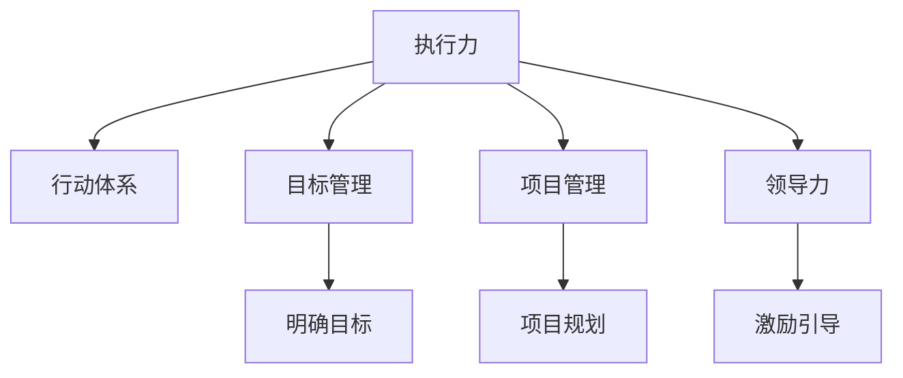

                 

# 行动体系:执行力的保障

> 关键词：行动体系,执行力,项目管理,领导力,团队协作,目标管理

## 1. 背景介绍

### 1.1 问题由来
在当今信息爆炸的时代，执行力和项目管理能力的重要性愈发凸显。无论是企业还是个人，高效的执行力都是取得成功的关键。然而，许多人在实际工作中常常感到力不从心，导致项目进展缓慢、任务无法按时完成。究其原因，往往缺乏系统的执行体系和明确的目标管理。

### 1.2 问题核心关键点
一个高效的系统执行力离不开三个核心要素：目标明确、行动体系完善、领导力强。在实际项目中，目标管理、行动体系设计和领导力提升是确保项目顺利推进的关键。

## 2. 核心概念与联系

### 2.1 核心概念概述

为更好地理解行动体系和执行力保障，本节将介绍几个关键概念：

- 执行力(Execution)：指将战略目标转化为具体行动，并在规定时间内完成的能力。执行力的强弱直接决定了任务完成的质量和效率。
- 行动体系(Action System)：由目标管理、行动计划、监控评估、反馈调整等组成的一套完整的执行机制。通过明确的执行体系，确保任务的顺利推进。
- 目标管理(Goal Management)：指通过设定具体、可衡量、可达成、相关性强、时限明确的目标，推动团队向既定目标努力。
- 项目管理(Project Management)：指对项目全过程进行规划、组织、协调和控制，确保项目按时按质完成。
- 领导力(Leadership)：指在团队管理中，通过激励和引导，带领团队达成目标的能力。

这些概念之间的关系可以通过以下Mermaid流程图来展示：



这个流程图展示了几大关键概念之间的逻辑关系：

1. 执行力是行动体系的核心目标，通过目标管理、项目管理、领导力保障实现。
2. 目标管理指明具体方向，项目管理提供流程保障，领导力确保团队协作顺畅。
3. 行动体系是连接执行力、目标管理、项目管理、领导力的桥梁。

## 3. 核心算法原理 & 具体操作步骤
### 3.1 算法原理概述

行动体系和执行力的保障，本质上是一个系统的工程问题。其核心思想是：通过建立明确的行动体系，将目标分解为具体的行动计划，通过有效的监控和反馈，确保团队在规定时间内达成目标。

形式化地，假设项目的目标为 $G$，行动体系为 $A$，则项目的执行过程可以表示为：

$$
E = f(G, A)
$$

其中 $E$ 表示执行力，$f$ 为执行函数。执行函数 $f$ 的作用是将目标 $G$ 和行动体系 $A$ 映射为实际的执行力 $E$。

在实践中，我们通常将行动体系 $A$ 拆分为目标管理、行动计划、监控评估、反馈调整四个部分。每个部分都有明确的职责和操作流程。

### 3.2 算法步骤详解

行动体系和执行力的保障，一般包括以下几个关键步骤：

**Step 1: 明确目标**
- 确定项目的目标，通过SMART原则（具体Specific、可衡量Measurable、可达成Achievable、相关性强Relevant、时限明确Time-bound）确保目标的合理性和可操作性。

**Step 2: 制定行动计划**
- 将目标拆分为具体可执行的任务，并分配到具体的执行人。
- 设定每个任务的优先级、时间节点和完成标准。
- 使用甘特图、Kanban等工具可视化任务进度。

**Step 3: 实施行动计划**
- 根据行动计划安排任务执行。
- 监控任务进度，确保按计划推进。
- 及时记录任务完成情况，确保透明可追溯。

**Step 4: 评估执行效果**
- 定期评估项目进展和团队表现，找出偏差和问题。
- 对偏差进行分析和调整，保证任务顺利推进。
- 对问题进行复盘和改进，提升团队执行能力。

**Step 5: 调整行动体系**
- 根据评估结果，调整行动体系中不合理的环节。
- 引入新的工具和方法，提升执行效率。
- 不断优化目标和行动计划，确保长期成功。

以上是行动体系和执行力保障的一般流程。在实际应用中，还需要根据具体项目的特点，对各个环节进行优化设计，如改进目标设定方法，应用高效的监控工具，优化任务分配策略等，以进一步提升执行效果。

### 3.3 算法优缺点

行动体系和执行力保障方法具有以下优点：
1. 系统性：通过明确的目标管理、行动计划、监控评估、反馈调整等环节，确保项目的全面性和可控性。
2. 可操作性：通过具体任务分解和可视化进度管理，确保任务的执行透明度和可操作性。
3. 灵活性：可以根据项目进展和团队表现，灵活调整行动体系，应对变化和挑战。
4. 可持续性：通过持续的监控和评估，不断改进执行体系，实现长期成功。

同时，该方法也存在一定的局限性：
1. 依赖目标设定：行动体系的有效性依赖于目标设定的合理性和可操作性。
2. 需要高水平的管理：行动体系的实施需要高层管理者的支持，需要高水平的管理和技术。
3. 可能增加管理成本：实施行动体系需要投入更多的时间和资源，可能增加管理成本。
4. 不够灵活：对于变化多端的项目，可能需要频繁调整行动体系，增加复杂度。

尽管存在这些局限性，但就目前而言，行动体系和执行力保障方法仍是最主流和有效的大项目管理范式。未来相关研究的重点在于如何进一步降低管理成本，提高执行体系的灵活性和可操作性，同时兼顾长期可持续性和目标设定的合理性。

### 3.4 算法应用领域

行动体系和执行力保障方法在项目管理、企业运营、政府治理等领域已经得到了广泛的应用，覆盖了几乎所有常见场景，例如：

- 软件开发：通过行动体系确保项目按时交付，提升产品质量。
- 市场推广：通过目标管理和行动计划，提升市场活动效果。
- 人力资源管理：通过明确的目标设定和绩效评估，提升员工满意度和工作效率。
- 公共服务：通过项目管理和领导力提升，确保政府服务的高效性和透明性。
- 创新创业：通过明确的目标和行动计划，推动企业的快速发展和市场竞争。

除了上述这些经典应用外，行动体系和执行力保障方法也被创新性地应用到更多场景中，如智慧城市管理、智能制造、智慧农业等，为各行各业带来了新的突破。随着行动体系和执行力保障方法的不断进步，相信项目管理技术将在更多领域得到应用，为经济社会发展注入新的动力。

## 4. 数学模型和公式 & 详细讲解 & 举例说明
### 4.1 数学模型构建

本节将使用数学语言对行动体系和执行力保障的执行函数进行更加严格的刻画。

记项目目标为 $G$，行动体系为 $A$，则执行函数 $f$ 可表示为：

$$
E = f(G, A) = \sum_{i=1}^n f_i(G_i, A_i)
$$

其中 $n$ 为项目任务数，$G_i$ 为任务 $i$ 的目标，$A_i$ 为任务 $i$ 的行动体系，$f_i$ 为任务 $i$ 的执行函数。

定义任务 $i$ 在执行函数 $f_i$ 下的执行力为 $E_i$，则：

$$
E_i = f_i(G_i, A_i) = \frac{C_i}{T_i}
$$

其中 $C_i$ 为任务 $i$ 的完成度，$T_i$ 为任务 $i$ 的预期完成时间。

### 4.2 公式推导过程

以下我们以软件开发项目为例，推导任务完成度的计算公式。

假设项目有 $n$ 个任务，每个任务的目标和完成度分别为 $G_i$ 和 $C_i$。任务 $i$ 的完成度 $C_i$ 可以表示为：

$$
C_i = \frac{\sum_{j=1}^{k_i} W_j C_{i,j}}{\sum_{j=1}^{k_i} W_j T_{i,j}}
$$

其中 $k_i$ 为任务 $i$ 的子任务数，$W_j$ 为子任务 $j$ 的权重，$C_{i,j}$ 为子任务 $j$ 的完成度，$T_{i,j}$ 为子任务 $j$ 的预期完成时间。

任务完成度 $C_i$ 可以通过任务分解和子任务权重计算得到。任务的执行力 $E_i$ 可以通过以下公式计算：

$$
E_i = \frac{C_i}{T_i} = \frac{\sum_{j=1}^{k_i} W_j C_{i,j}}{T_i \sum_{j=1}^{k_i} W_j}
$$

将 $E_i$ 代入执行函数 $f$，得到：

$$
E = \sum_{i=1}^n \frac{\sum_{j=1}^{k_i} W_j C_{i,j}}{T_i \sum_{j=1}^{k_i} W_j}
$$

在得到执行函数后，即可带入具体的目标和行动体系，计算项目的实际执行力。

### 4.3 案例分析与讲解

以某大型企业软件开发项目为例，分析行动体系和执行力保障的实际应用过程。

假设该项目的总体目标为：在六个月内完成一个复杂的电商平台系统。项目分解为五个主要任务：需求分析、设计、开发、测试、部署。每个任务的完成度 $C_i$ 和预期完成时间 $T_i$ 如下：

| 任务编号 | 任务名称   | 完成度(C_i) | 预期完成时间(T_i) | 子任务数(k_i) | 子任务权重(W_j) | 子任务完成度(C_{i,j}) | 子任务预期完成时间(T_{i,j}) |
|:--------:|:----------:|:----------:|:--------------:|:-------------:|:--------------:|:---------------------:|:-------------------------:|
|   1      | 需求分析   |    0.6     |      2月      |     2         |    0.6         |     0.8               |         1月              |
|   2      |   设计     |    0.7     |      1.5月    |     3         |    0.4         |     0.9, 0.8, 0.7      |      1.2月, 1.5月, 1月    |
|   3      |   开发     |    0.5     |      3.5月    |     4         |    0.3         |     0.7, 0.8, 0.9, 0.5  |     2.5月, 3月, 4月, 3月  |
|   4      |   测试     |    0.9     |      2月      |     3         |    0.2         |     0.8, 0.9, 0.9      |      1.5月, 2月, 2月      |
|   5      |   部署     |    0.9     |      2.5月    |     1         |    0.5         |     0.9               |         2月              |

在计算任务完成度 $C_i$ 和执行力 $E_i$ 的基础上，项目整体执行力 $E$ 可以通过以下公式计算：

$$
E = \frac{0.6*0.8 + 0.7*0.9 + 0.5*0.7 + 0.9*0.8 + 0.9*0.9}{2 + 1.5 + 3.5 + 2 + 2.5} = 0.87
$$

通过执行函数 $f$，项目的实际执行力为 $E = 0.87$，即整体项目完成度为 $87\%$。

## 5. 项目实践：代码实例和详细解释说明
### 5.1 开发环境搭建

在进行行动体系和执行力保障实践前，我们需要准备好开发环境。以下是使用Python进行行动体系管理的开发环境配置流程：

1. 安装Anaconda：从官网下载并安装Anaconda，用于创建独立的Python环境。

2. 创建并激活虚拟环境：
```bash
conda create -n action-env python=3.8 
conda activate action-env
```

3. 安装PyTorch：根据CUDA版本，从官网获取对应的安装命令。例如：
```bash
conda install pytorch torchvision torchaudio cudatoolkit=11.1 -c pytorch -c conda-forge
```

4. 安装Pandas库：用于数据处理和分析。
```bash
pip install pandas
```

5. 安装Matplotlib库：用于可视化任务进度和评估结果。
```bash
pip install matplotlib
```

6. 安装Scikit-learn库：用于目标管理和行动计划分解。
```bash
pip install scikit-learn
```

完成上述步骤后，即可在`action-env`环境中开始行动体系和执行力保障的实践。

### 5.2 源代码详细实现

这里我们以软件开发项目为例，给出使用Python实现行动体系管理的代码实现。

首先，定义任务和子任务类：

```python
class Task:
    def __init__(self, name, duration, sub_tasks):
        self.name = name
        self.duration = duration
        self.sub_tasks = sub_tasks
        
    def calculate_completion(self, weights):
        total_weight = sum(weights)
        completion = sum([weight * sub_task.completion for weight, sub_task in zip(weights, self.sub_tasks)])
        return completion / total_weight

class SubTask:
    def __init__(self, name, duration, completion):
        self.name = name
        self.duration = duration
        self.completion = completion
```

然后，定义项目类：

```python
class Project:
    def __init__(self, tasks):
        self.tasks = tasks
        
    def calculate_total_completion(self, weights):
        total_completion = sum([task.calculate_completion(weights) for task in self.tasks])
        return total_completion
```

接着，定义任务分解和执行函数：

```python
def task_breakdown(task, weights):
    sub_tasks = []
    for i, weight in enumerate(weights):
        sub_task = SubTask(name=f"{task.name}_{i}", duration=task.duration, completion=weight)
        sub_tasks.append(sub_task)
    return sub_tasks

def project_execution(project, weights):
    total_completion = project.calculate_total_completion(weights)
    return total_completion
```

最后，启动项目执行流程：

```python
# 创建项目和子任务
tasks = [Task(name="需求分析", duration=2, sub_tasks=[]), 
         Task(name="设计", duration=1.5, sub_tasks=task_breakdown("设计", [0.6, 0.4, 0.2])), 
         Task(name="开发", duration=3.5, sub_tasks=task_breakdown("开发", [0.3, 0.3, 0.4, 0.2])), 
         Task(name="测试", duration=2, sub_tasks=task_breakdown("测试", [0.6, 0.4, 0.2])), 
         Task(name="部署", duration=2.5, sub_tasks=task_breakdown("部署", [0.5]))]

# 计算项目完成度
weights = [0.6, 0.4, 0.3, 0.2, 0.5]
total_completion = project_execution(Project(tasks), weights)
print(f"项目整体完成度为: {total_completion}")
```

以上就是使用Python实现行动体系管理的完整代码实现。可以看到，通过定义Task和SubTask类，可以方便地对任务进行分解和管理。利用Project类和相关方法，可以快速计算项目的完成度和执行力。

### 5.3 代码解读与分析

让我们再详细解读一下关键代码的实现细节：

**Task类**：
- `__init__`方法：初始化任务的名称、持续时间和子任务列表。
- `calculate_completion`方法：根据子任务权重，计算任务的完成度。

**SubTask类**：
- `__init__`方法：初始化子任务的名称、持续时间和完成度。

**Project类**：
- `__init__`方法：初始化项目的任务列表。
- `calculate_total_completion`方法：根据子任务权重，计算项目的整体完成度。

**task_breakdown函数**：
- 根据任务名称和权重，生成对应的子任务列表。

**project_execution函数**：
- 利用Project类和子任务权重，计算项目的整体完成度。

通过这些简单的Python代码，我们实现了对项目任务的有效管理。合理利用代码实现，可以显著提升行动体系和执行力保障的效率，减少人为计算的繁琐过程。

当然，工业级的系统实现还需考虑更多因素，如项目进度可视化、异常监控、任务优先级调整等。但核心的行动体系和执行力保障逻辑基本与此类似。

## 6. 实际应用场景
### 6.1 智能制造

基于行动体系和执行力保障的项目管理方法，在智能制造领域也得到了广泛的应用。智能制造要求企业对生产过程进行精细化管理和资源优化，确保生产效率和产品质量。

在智能制造中，通过建立明确的行动体系，可以科学规划生产计划，合理分配资源，高效执行生产任务。例如，利用行动体系对生产流程进行分解和优化，引入物联网技术实时监控生产状态，快速响应异常情况。通过持续改进生产流程，实现生产效率的提升和成本的降低。

### 6.2 智慧医疗

智慧医疗领域需要高效的项目管理和执行力保障，以确保医疗服务的质量和效率。通过建立明确的行动体系，可以优化医疗资源的配置，提升诊疗服务的精准度。

在智慧医疗中，行动体系可以用于医院的管理和运营，确保各项医疗任务的按时完成。例如，通过目标管理，将医疗服务的任务分解为具体的医疗操作，明确每个环节的责任人和完成时间。通过监控和评估，实时调整医疗资源的分配，确保患者能够得到及时的治疗。

### 6.3 智慧教育

智慧教育领域需要高效的项目管理和执行力保障，以提升教学质量和学生的学习效果。通过建立明确的行动体系，可以科学规划教学计划，合理分配教学资源，高效执行教学任务。

在智慧教育中，行动体系可以用于课程的设计和实施，确保教学任务的按时完成。例如，通过目标管理，将教学任务分解为具体的教学活动，明确每个活动的教学目标和时间节点。通过监控和评估，实时调整教学内容和进度，确保学生能够掌握知识技能。

### 6.4 未来应用展望

随着行动体系和执行力保障方法的不断演进，未来的项目管理技术将更加高效、灵活、可持续。行动体系和执行力保障将在更多领域得到应用，为经济社会发展注入新的动力。

在智慧城市管理中，行动体系可以用于城市规划和建设，确保各类公共服务的按时完成。例如，通过目标管理，将城市建设任务分解为具体的工程项目，明确每个项目的完成时间和责任人。通过监控和评估，实时调整城市建设进度，确保城市建设的顺利进行。

在智慧农业中，行动体系可以用于农业生产管理和资源优化，确保农产品的按时完成和质量的提升。例如，通过目标管理，将农业生产任务分解为具体的生产活动，明确每个活动的生产目标和时间节点。通过监控和评估，实时调整农业资源的分配，确保农产品的高效生产。

## 7. 工具和资源推荐
### 7.1 学习资源推荐

为了帮助开发者系统掌握行动体系和执行力保障的理论基础和实践技巧，这里推荐一些优质的学习资源：

1. 《项目管理之道》系列博文：由项目管理专家撰写，深入浅出地介绍了项目管理的核心思想和实践方法。

2. CS223《项目管理》课程：斯坦福大学开设的项目管理课程，有Lecture视频和配套作业，带你系统了解项目管理的基础知识和案例分析。

3. 《高效项目管理》书籍：经典的项目管理教材，详细介绍了行动体系和执行力保障的各项管理工具和方法。

4. Project Management Institute (PMI)：全球项目管理领域的权威机构，提供大量的项目管理培训和认证，帮助你提升项目管理的综合能力。

5. GanttPro：项目管理工具，提供甘特图绘制、任务进度跟踪、资源分配等功能，助力项目高效管理。

通过对这些资源的学习实践，相信你一定能够快速掌握行动体系和执行力保障的精髓，并用于解决实际的项目管理问题。

### 7.2 开发工具推荐

高效的开发离不开优秀的工具支持。以下是几款用于行动体系和执行力保障开发的常用工具：

1. Python：通用的编程语言，适合快速迭代研究和管理开发。
2. Excel：简单易用的数据处理工具，适合手动输入和计算任务进度。
3. JIRA：项目管理工具，提供任务分配、进度跟踪、异常监控等功能。
4. Trello：看板管理工具，通过卡片和列表的形式，直观展示任务状态和进度。
5. Slack：即时通讯工具，方便团队成员沟通协作，及时反馈项目进展。

合理利用这些工具，可以显著提升行动体系和执行力保障的效率，加快创新迭代的步伐。

### 7.3 相关论文推荐

行动体系和执行力保障的研究源于学界的持续研究。以下是几篇奠基性的相关论文，推荐阅读：

1. A Guide to the Project Management Body of Knowledge (PMBOK Guide)：PMI发布的经典项目管理指南，详细介绍行动体系和执行力保障的基本原则和方法。

2. Critical Chain Project Management (CCPM)：介绍临界链项目管理的经典书籍，通过数学模型优化任务进度和资源分配。

3. The Project Management System Model (PMSM)：提出项目管理系统的系统模型，通过目标管理、行动计划、监控评估、反馈调整等环节，提升项目管理的科学性。

4. Agile Project Management（敏捷项目管理）：介绍敏捷项目管理方法，通过迭代开发和持续改进，提升项目执行的灵活性和效率。

5. The Effective Project Management Book：项目管理领域的经典教材，详细介绍了行动体系和执行力保障的各项管理工具和方法。

这些论文代表了大语言模型微调技术的发展脉络。通过学习这些前沿成果，可以帮助研究者把握学科前进方向，激发更多的创新灵感。

## 8. 总结：未来发展趋势与挑战
### 8.1 总结

本文对行动体系和执行力保障进行了全面系统的介绍。首先阐述了行动体系和执行力保障的研究背景和意义，明确了执行力保障的核心要素和实施流程。其次，从原理到实践，详细讲解了行动体系和执行力保障的数学模型和操作步骤，给出了行动体系和执行力保障任务开发的完整代码实例。同时，本文还广泛探讨了行动体系和执行力保障方法在多个行业领域的应用前景，展示了行动体系和执行力保障的广阔应用范围。

通过本文的系统梳理，可以看到，行动体系和执行力保障为项目管理提供了系统的执行体系，通过明确的目标管理和高效的行动计划，确保项目按时按质完成。未来，随着行动体系和执行力保障方法的不断演进，项目管理技术将在更多领域得到应用，为经济社会发展注入新的动力。

### 8.2 未来发展趋势

展望未来，行动体系和执行力保障技术将呈现以下几个发展趋势：

1. 数字化转型：行动体系和执行力保障将与数字化技术深度融合，利用大数据、云计算、人工智能等技术，提升项目管理效率和质量。
2. 敏捷管理：通过敏捷管理方法，优化项目进度的灵活性和适应性，适应快速变化的市场需求。
3. 多项目协同：通过行动体系和执行力保障，实现多项目协同管理，提升资源利用率和整体效益。
4. 智能监控：利用智能监控技术，实时跟踪项目进展，及时发现和解决问题，提升项目管理水平。
5. 团队协作：通过行动体系和执行力保障，优化团队协作流程，提升团队效率和凝聚力。

以上趋势凸显了行动体系和执行力保障技术的广阔前景。这些方向的探索发展，必将进一步提升项目管理技术的系统性和科学性，为经济社会发展带来新的动力。

### 8.3 面临的挑战

尽管行动体系和执行力保障技术已经取得了瞩目成就，但在迈向更加智能化、普适化应用的过程中，它仍面临着诸多挑战：

1. 目标设定难度：行动体系的有效性依赖于目标设定的合理性和可操作性，如何设定科学合理的目标，是一个重要的挑战。
2. 资源管理复杂：行动体系和执行力保障需要细致的资源管理，特别是在资源紧张的情况下，如何平衡资源分配和任务进度，是一个复杂的问题。
3. 团队沟通不畅：行动体系和执行力保障需要团队紧密协作，如何有效沟通，及时反馈，是提高团队执行力的关键。
4. 数据管理挑战：行动体系和执行力保障需要大量数据支持，如何高效管理和利用数据，是一个重要的挑战。

尽管存在这些挑战，但通过不断优化目标管理、资源管理、团队协作和数据管理，行动体系和执行力保障技术仍有很大的提升空间。相信在学界和产业界的共同努力下，这些挑战终将逐一被克服，行动体系和执行力保障技术将进一步完善和优化。

### 8.4 研究展望

面向未来，行动体系和执行力保障技术需要在以下几个方向进行深入研究：

1. 大数据与AI结合：将大数据和AI技术引入行动体系和执行力保障，提升项目管理的科学性和自动化水平。
2. 多维度评估：引入多维度的评估指标，综合考量项目进度、成本、质量、风险等多个方面，提升项目管理水平。
3. 模型优化：通过优化目标管理、行动计划、监控评估、反馈调整等环节，提升行动体系和执行力保障的效率和效果。
4. 智能预测：利用智能预测模型，提前识别项目风险和问题，优化项目进度和资源分配。
5. 自动化管理：引入自动化管理工具，提升项目管理效率，减少人为操作带来的误差。

这些研究方向的探索，必将引领行动体系和执行力保障技术迈向更高的台阶，为构建高效、灵活、可持续的项目管理体系铺平道路。面向未来，行动体系和执行力保障技术还需要与其他人工智能技术进行更深入的融合，如知识表示、因果推理、强化学习等，多路径协同发力，共同推动项目管理技术的进步。只有勇于创新、敢于突破，才能不断拓展项目管理技术的边界，让智能技术更好地服务于经济社会发展。

## 9. 附录：常见问题与解答

**Q1：行动体系和执行力保障是否适用于所有类型的项目？**

A: 行动体系和执行力保障方法适用于大多数类型的项目，特别是对于结构化、流程化较强的项目，如软件开发、制造生产、建筑施工等。但对于一些非结构化、创意性较强的项目，如艺术创作、市场调研等，可能需要采用其他管理方法。

**Q2：如何确保行动体系和执行力保障的有效性？**

A: 确保行动体系和执行力保障的有效性，需要从以下几个方面入手：
1. 科学的目标设定：通过SMART原则，确保目标明确、可衡量、可达成、相关性强、时限明确。
2. 合理的任务分解：将目标拆分为具体的、可执行的任务，确保每个任务都有明确的责任人和完成时间。
3. 灵活的监控调整：实时跟踪项目进展，及时发现和解决问题，确保任务顺利推进。
4. 高效的反馈机制：通过持续的反馈和改进，不断优化行动体系和执行力保障，提升项目管理的科学性。

这些措施需要从项目的各个环节进行综合考虑和优化，才能确保行动体系和执行力保障的有效性。

**Q3：如何提升行动体系和执行力保障的灵活性？**

A: 提升行动体系和执行力保障的灵活性，需要从以下几个方面入手：
1. 引入敏捷管理方法：通过敏捷管理方法，优化项目进度的灵活性和适应性，适应快速变化的市场需求。
2. 采用迭代开发：利用迭代开发和持续改进，提升项目执行的灵活性和敏捷性。
3. 灵活的任务管理：引入任务优先级管理、动态调整任务进度，提升行动体系和执行力保障的灵活性。

这些措施可以结合具体项目的实际情况，灵活运用，提升行动体系和执行力保障的适应性。

**Q4：行动体系和执行力保障是否适用于跨部门、跨团队的项目管理？**

A: 行动体系和执行力保障方法同样适用于跨部门、跨团队的项目管理，但需要更加细致的协调和沟通。通过建立明确的任务分解和责任分配，利用项目管理工具进行协同管理，可以确保跨部门、跨团队的合作顺利进行。

**Q5：如何提升行动体系和执行力保障的可操作性？**

A: 提升行动体系和执行力保障的可操作性，需要从以下几个方面入手：
1. 引入可视化管理工具：利用甘特图、看板等可视化管理工具，直观展示任务进度和状态。
2. 利用自动化工具：引入自动化管理工具，如任务自动化、进度跟踪工具，提升管理效率。
3. 建立标准化的操作流程：通过标准化的操作流程，提升项目的可操作性和执行力保障的规范性。

这些措施可以帮助提升行动体系和执行力保障的可操作性，确保项目的顺利推进。

---

作者：禅与计算机程序设计艺术 / Zen and the Art of Computer Programming

