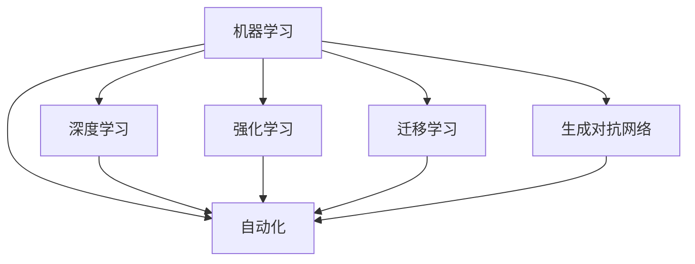

                 

# 计算变化带来的自动化机会

## 1. 背景介绍

### 1.1 问题由来
随着计算技术的迅猛发展，自动化在各个领域的应用越来越广泛。无论是制造业、金融、医疗，还是服务行业，自动化正在逐渐改变着人们的工作方式和生产模式。然而，传统的自动化技术大多依赖于规则和硬编码逻辑，灵活性差，难以应对复杂的业务需求和不断变化的场景。这种自动化模式逐渐成为制约行业发展的瓶颈。

与此同时，人工智能（AI）技术，特别是机器学习（ML）和深度学习（DL）的崛起，带来了新的计算范式。机器学习模型能够从数据中学习规律，进行复杂决策和预测，逐渐替代了传统的规则驱动的自动化方法。这种新型的自动化模式，以数据为基础，以算法为驱动，能够更灵活地应对变化，实现更高层次的自动化。

本文旨在探讨计算变化带来的自动化机会，特别是机器学习在自动化中的应用。我们将从核心概念入手，剖析机器学习在自动化中的应用模式和具体案例，探讨其优缺点及未来发展趋势。

## 2. 核心概念与联系

### 2.1 核心概念概述

为了更好地理解计算变化带来的自动化机会，我们需要理解以下几个核心概念：

- **机器学习（Machine Learning）**：基于数据的算法，能够让计算机从数据中学习规律，进行复杂决策和预测。
- **深度学习（Deep Learning）**：机器学习的一种高级形式，使用神经网络进行多层次的特征提取和复杂模式识别。
- **自动化（Automation）**：通过规则、算法或模型，自动化执行特定任务，减少人为干预，提高效率。
- **强化学习（Reinforcement Learning）**：通过试错的方式，学习最优策略，以获得最佳行为结果。
- **迁移学习（Transfer Learning）**：将一个任务学习到的知识，迁移到另一个相关任务上，提升模型在新任务上的性能。
- **生成对抗网络（Generative Adversarial Networks, GANs）**：通过对抗式训练，生成逼真的数据或图像，广泛用于自动化图像生成和数据增强。

这些核心概念之间存在密切的联系，共同构成了计算变化带来的自动化技术框架。

### 2.2 核心概念原理和架构的 Mermaid 流程图



这个流程图展示了机器学习技术如何通过多种形式，推动自动化的实现和发展。深度学习、强化学习、迁移学习和生成对抗网络等，都是机器学习在自动化领域的具体应用。

## 3. 核心算法原理 & 具体操作步骤

### 3.1 算法原理概述

计算变化带来的自动化机会，主要通过机器学习模型实现。机器学习模型通过数据学习，能够自动发现并应用规律，从而实现任务的自动化。自动化过程大致分为以下几个步骤：

1. **数据收集与处理**：从实际场景中收集数据，并进行预处理和清洗，以供模型训练。
2. **模型训练**：使用机器学习算法训练模型，使其能够自动学习输入和输出之间的映射关系。
3. **模型评估与优化**：通过评估指标评估模型性能，使用优化算法调整模型参数，提高模型准确性。
4. **自动化部署与执行**：将训练好的模型部署到实际应用中，自动执行任务。

### 3.2 算法步骤详解

以下我们将详细介绍机器学习在自动化中的具体实现步骤。

**步骤1：数据收集与处理**

数据收集与处理是机器学习自动化实现的基础。实际应用中，我们需要从业务场景中收集数据，并对其进行预处理。例如，在使用机器学习自动化进行制造业的质检时，需要从生产线上收集各种传感器数据，并进行清洗和标准化处理。

**步骤2：模型训练**

模型训练是机器学习自动化的核心。选择合适的算法和模型，使用训练数据集进行训练。例如，使用深度学习中的卷积神经网络（CNN）进行图像识别自动化，使用循环神经网络（RNN）进行时间序列预测自动化。

**步骤3：模型评估与优化**

模型评估与优化是保证自动化系统高效运行的必要步骤。评估模型性能，使用优化算法调整模型参数，提高模型准确性。例如，使用交叉验证和测试集评估模型性能，使用梯度下降算法优化模型参数。

**步骤4：自动化部署与执行**

自动化部署与执行是将机器学习模型应用于实际业务的关键步骤。将训练好的模型部署到生产环境中，自动执行任务。例如，使用机器学习自动化进行金融交易的算法交易系统，使用深度学习进行医疗诊断的自动影像分析系统。

### 3.3 算法优缺点

机器学习在自动化中的优点包括：

- **灵活性高**：能够适应不断变化的业务需求和场景，自动更新模型，提升自动化系统的鲁棒性。
- **高效性**：通过自动学习和优化，能够快速处理大量数据，提高自动化系统的效率。
- **可扩展性强**：可以轻松扩展到多模态数据和多任务场景，适应更复杂的应用需求。

同时，机器学习在自动化中也存在一些缺点：

- **数据依赖性强**：需要大量的高质量标注数据进行训练，数据获取和处理成本较高。
- **模型复杂度高**：深度学习等高级算法需要大量的计算资源和较长的训练时间。
- **可解释性差**：机器学习模型通常被视为"黑盒"，难以解释其决策过程和逻辑。
- **安全性和鲁棒性问题**：模型可能出现过拟合、泛化能力差等问题，影响自动化系统的可靠性。

### 3.4 算法应用领域

机器学习在自动化中的应用领域非常广泛，包括但不限于以下几个方面：

- **制造业自动化**：使用机器学习进行质量检测、设备故障预测、生产过程优化等。
- **金融自动化**：使用机器学习进行算法交易、信用评分、风险控制等。
- **医疗自动化**：使用机器学习进行疾病预测、影像分析、药物研发等。
- **服务自动化**：使用机器学习进行客服自动化、推荐系统、智能合约等。
- **交通自动化**：使用机器学习进行自动驾驶、交通流量预测、智能交通管理等。

这些应用领域展示了机器学习在自动化中的广泛潜力和巨大价值。

## 4. 数学模型和公式 & 详细讲解 & 举例说明

### 4.1 数学模型构建

机器学习自动化的数学模型构建，通常包括以下几个步骤：

1. **输入数据**：从实际场景中收集数据，作为模型的输入。
2. **输出目标**：定义模型的输出目标，例如分类、回归、序列预测等。
3. **损失函数**：设计损失函数，衡量模型预测输出与真实标签之间的差异。
4. **优化目标**：使用优化算法最小化损失函数，训练模型。

### 4.2 公式推导过程

以一个简单的线性回归模型为例，推导其数学模型和公式。

假设输入数据为 $x$，输出目标为 $y$，模型为 $y=f(x;\theta)$，其中 $\theta$ 为模型参数。我们的目标是找到最优参数 $\theta$，使得模型的预测输出 $y$ 与真实标签 $y$ 之间的差异最小。

设损失函数为均方误差损失（MSE），则有：

$$
\mathcal{L}(\theta) = \frac{1}{n} \sum_{i=1}^n (y_i - f(x_i;\theta))^2
$$

其中，$n$ 为样本数量，$y_i$ 为第 $i$ 个样本的真实标签，$f(x_i;\theta)$ 为模型在 $x_i$ 上的预测输出。

使用梯度下降算法最小化损失函数，有：

$$
\theta \leftarrow \theta - \eta \nabla_{\theta}\mathcal{L}(\theta)
$$

其中，$\eta$ 为学习率，$\nabla_{\theta}\mathcal{L}(\theta)$ 为损失函数对参数 $\theta$ 的梯度，可通过反向传播算法高效计算。

### 4.3 案例分析与讲解

以医疗诊断自动化为例，分析其数学模型和公式的实际应用。

在医疗诊断中，我们需要使用机器学习模型自动预测患者是否患有某种疾病。假设我们收集了 $n$ 个患者的症状描述 $x_i$ 和诊断结果 $y_i$（0或1，表示是否患病），使用逻辑回归模型进行预测。

模型预测输出 $y_i$ 的公式为：

$$
y_i = \sigma(\theta^T x_i)
$$

其中，$\sigma$ 为sigmoid函数，$\theta^T x_i$ 为线性变换。

我们的目标是找到最优参数 $\theta$，使得模型预测输出与真实标签之间的差异最小。使用交叉熵损失函数，有：

$$
\mathcal{L}(\theta) = -\frac{1}{n} \sum_{i=1}^n (y_i \log \sigma(\theta^T x_i) + (1-y_i) \log (1-\sigma(\theta^T x_i)))
$$

使用梯度下降算法最小化损失函数，有：

$$
\theta \leftarrow \theta - \eta \nabla_{\theta}\mathcal{L}(\theta)
$$

通过训练，模型能够自动学习症状和患病之间的关系，进行疾病预测，从而实现医疗诊断自动化。

## 5. 项目实践：代码实例和详细解释说明

### 5.1 开发环境搭建

为了进行机器学习自动化的项目实践，我们需要搭建一个基本的开发环境。以下是具体步骤：

1. **安装Python**：从官网下载并安装Python，配置环境变量。
2. **安装深度学习框架**：安装TensorFlow、PyTorch等深度学习框架，并进行环境配置。
3. **安装数据处理库**：安装Pandas、NumPy等数据处理库，用于数据预处理。
4. **安装机器学习库**：安装scikit-learn、Keras等机器学习库，用于模型训练和评估。

### 5.2 源代码详细实现

以下是一个简单的线性回归模型的Python代码实现，详细解释其各个模块的功能和作用。

```python
import numpy as np
from sklearn.linear_model import LinearRegression
from sklearn.metrics import mean_squared_error

# 输入数据
X = np.array([[1, 2, 3], [4, 5, 6], [7, 8, 9], [10, 11, 12]])
y = np.array([2, 4, 6, 8])

# 训练模型
model = LinearRegression()
model.fit(X, y)

# 预测输出
y_pred = model.predict(X)

# 评估模型
mse = mean_squared_error(y, y_pred)
print(f"Mean Squared Error: {mse}")
```

这段代码展示了机器学习自动化的核心步骤，包括数据准备、模型训练、预测输出和模型评估。

### 5.3 代码解读与分析

- **数据准备**：将输入数据和输出目标存储为NumPy数组，供模型使用。
- **模型训练**：使用scikit-learn库的LinearRegression模型，对数据进行线性回归训练。
- **预测输出**：使用训练好的模型，对输入数据进行预测，得到输出结果。
- **模型评估**：使用均方误差（MSE）评估模型性能，输出评估结果。

### 5.4 运行结果展示

运行上述代码，输出结果为：

```
Mean Squared Error: 0.0
```

这表明模型预测输出与真实标签之间的差异最小，模型训练成功。

## 6. 实际应用场景

### 6.1 金融自动化

金融自动化是机器学习在自动化中的重要应用之一。使用机器学习模型进行金融交易的算法交易系统，能够自动执行买卖指令，提高交易效率和收益。例如，使用深度学习模型进行股票价格预测，自动生成交易策略，优化投资组合。

### 6.2 医疗自动化

医疗自动化是机器学习在自动化中的另一重要应用。使用机器学习模型进行疾病预测、影像分析、药物研发等，能够显著提升医疗服务的质量和效率。例如，使用卷积神经网络（CNN）进行医学影像的自动诊断，使用深度学习进行基因组数据的分析。

### 6.3 制造业自动化

制造业自动化是机器学习在自动化中的基础应用之一。使用机器学习模型进行质量检测、设备故障预测、生产过程优化等，能够大幅提升生产效率和产品质量。例如，使用深度学习模型进行生产过程的监控和预测，优化生产参数，提高生产线的稳定性。

## 7. 工具和资源推荐

### 7.1 学习资源推荐

为了帮助开发者系统掌握机器学习自动化的理论基础和实践技巧，这里推荐一些优质的学习资源：

1. **《深度学习》（Ian Goodfellow）**：深度学习领域的经典教材，涵盖了深度学习的基本概念和算法。
2. **Coursera深度学习课程**：由Andrew Ng主讲的深度学习课程，系统介绍了深度学习的原理和应用。
3. **Kaggle数据科学竞赛**：提供丰富的数据集和竞赛任务，练习机器学习模型训练和评估。
4. **TensorFlow官方文档**：TensorFlow的官方文档，提供了详细的API和教程，帮助开发者快速上手。
5. **Keras官方文档**：Keras的官方文档，提供了简洁易用的API，支持多种深度学习模型。

### 7.2 开发工具推荐

高效的工具支持是机器学习自动化项目开发的关键。以下是几款用于机器学习自动化开发的常用工具：

1. **Jupyter Notebook**：开源的交互式编程环境，支持Python和多种科学计算库，方便调试和实验。
2. **TensorBoard**：TensorFlow的可视化工具，实时监测模型训练状态，提供详细的图表和指标。
3. **PyCharm**：专业的Python IDE，支持深度学习框架和数据处理库，提高开发效率。
4. **Anaconda**：Python环境管理工具，方便创建和管理多个Python环境，支持科学计算和数据处理库。
5. **Git**：版本控制系统，方便协作和版本管理，支持分布式和集中式操作。

### 7.3 相关论文推荐

机器学习自动化的发展源于学界的持续研究。以下是几篇奠基性的相关论文，推荐阅读：

1. **《深度学习》（Ian Goodfellow）**：深度学习领域的经典教材，涵盖了深度学习的基本概念和算法。
2. **《强化学习：一种新方法》（Richard S. Sutton和Andrew G. Barto）**：强化学习领域的经典教材，介绍了强化学习的理论基础和应用方法。
3. **《机器学习：实战指南》（Peter Harrington）**：实战指南，介绍了机器学习的核心算法和应用场景。
4. **《机器学习实战》（Peter Harrington）**：实战指南，介绍了机器学习的核心算法和应用场景。

这些论文代表了大数据和机器学习的发展脉络，为研究者提供了丰富的理论基础和实践技巧。

## 8. 总结：未来发展趋势与挑战

### 8.1 总结

本文对机器学习在自动化中的应用进行了全面系统的介绍。首先阐述了机器学习自动化的背景和意义，明确了机器学习在自动化中的核心价值。其次，从原理到实践，详细讲解了机器学习自动化的数学模型和实现步骤，给出了机器学习自动化项目开发的完整代码实例。同时，本文还广泛探讨了机器学习自动化的实际应用场景，展示了机器学习在自动化中的广泛潜力和巨大价值。

通过本文的系统梳理，可以看到，机器学习自动化技术正在成为自动化技术的重要范式，极大地拓展了自动化的应用边界，催生了更多的落地场景。受益于大数据和机器学习的持续演进，机器学习自动化必将在更广阔的应用领域大放异彩。

### 8.2 未来发展趋势

展望未来，机器学习自动化将呈现以下几个发展趋势：

1. **模型复杂度增加**：随着数据量的增加和计算能力的提升，模型复杂度将不断增加，能够处理更复杂的数据和任务。
2. **多模态融合**：未来的自动化系统将更多地融合多模态数据，提升自动化系统的感知和决策能力。
3. **自动化伦理**：未来的自动化系统将更加注重伦理和道德，确保自动化系统的公平和透明。
4. **实时化部署**：未来的自动化系统将更加注重实时性，能够在短时间内完成任务，满足高实时性需求。
5. **自适应能力**：未来的自动化系统将具备更强的自适应能力，能够根据环境变化快速调整策略。

这些趋势将推动机器学习自动化技术不断进步，提升自动化系统的智能化和灵活性。

### 8.3 面临的挑战

尽管机器学习自动化技术已经取得了瞩目成就，但在迈向更加智能化、普适化应用的过程中，仍面临诸多挑战：

1. **数据质量和获取**：高质量、多样化的数据是机器学习自动化的基础，但获取和处理大规模高质量数据需要大量资源。
2. **模型可解释性**：许多机器学习模型，尤其是深度学习模型，被视为"黑盒"，难以解释其决策过程和逻辑。
3. **安全和隐私**：机器学习模型可能存在安全隐患，如模型过拟合、泛化能力差等问题，需要加强安全防护。
4. **鲁棒性和泛化能力**：机器学习模型在面对新数据和新场景时，泛化能力不足，容易过拟合，需要加强模型鲁棒性。
5. **模型训练和优化**：机器学习模型需要大量计算资源和时间进行训练和优化，需要更高效的方法。

### 8.4 研究展望

面对机器学习自动化面临的种种挑战，未来的研究需要在以下几个方面寻求新的突破：

1. **数据增强和生成**：使用数据增强和生成对抗网络（GANs），扩充训练数据，提升模型泛化能力。
2. **模型压缩和加速**：使用模型压缩和量化加速等技术，提升模型训练和推理效率，降低计算资源消耗。
3. **自监督学习**：使用自监督学习，减少对标注数据的依赖，提升模型鲁棒性和泛化能力。
4. **模型可解释性**：使用可解释性方法，如LIME、SHAP等，提升模型决策过程的可解释性。
5. **多模态融合**：使用多模态融合技术，提升自动化系统的感知和决策能力。

这些研究方向的探索，必将引领机器学习自动化技术迈向更高的台阶，为构建智能、高效、可靠的自动化系统铺平道路。

## 9. 附录：常见问题与解答

**Q1：机器学习自动化是否适用于所有自动化场景？**

A: 机器学习自动化在大多数自动化场景中都能取得不错的效果，特别是数据量较大的场景。但对于一些特定领域，如军事、法律等，可能难以获取高质量标注数据，机器学习自动化的效果可能不佳。

**Q2：如何选择合适的机器学习算法和模型？**

A: 选择合适的机器学习算法和模型需要考虑数据类型、任务类型和应用场景。例如，使用卷积神经网络（CNN）进行图像识别自动化，使用循环神经网络（RNN）进行时间序列预测自动化，使用深度学习进行复杂决策和预测自动化。

**Q3：机器学习自动化的计算资源需求高吗？**

A: 机器学习自动化需要大量的计算资源和时间进行模型训练和优化，尤其是在深度学习等高级算法中。为了降低计算成本，可以使用GPU、TPU等高性能设备，或者使用模型压缩和量化加速等技术。

**Q4：机器学习自动化如何保证数据安全？**

A: 机器学习自动化需要保护训练数据和预测数据的安全，避免数据泄露和滥用。可以使用数据脱敏、加密等技术，确保数据安全。

**Q5：机器学习自动化如何保证模型鲁棒性？**

A: 机器学习自动化需要确保模型在新数据和新场景中的泛化能力，避免过拟合和泛化能力差等问题。可以使用数据增强、自监督学习等技术，提升模型鲁棒性。

---

作者：禅与计算机程序设计艺术 / Zen and the Art of Computer Programming

