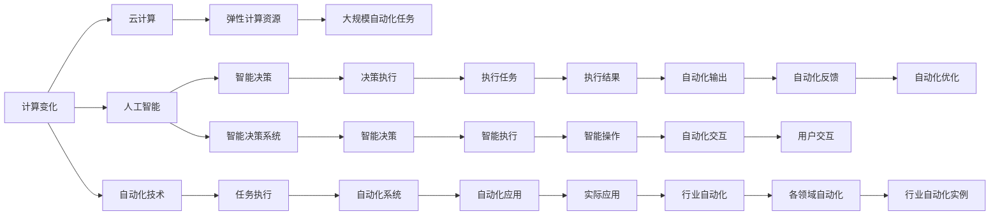

                 

## 1. 背景介绍

在过去的几十年里，计算技术的飞速进步不仅重塑了我们的生活和工作方式，也为自动化技术的广泛应用奠定了基础。无论是工业生产、物流运输，还是金融服务、医疗保健，计算技术的变革都在推动各行各业实现前所未有的自动化。本文将深入探讨计算变化带来的自动化机遇，分析其核心原理和操作步骤，并探讨其在各领域的应用。

## 2. 核心概念与联系

### 2.1 核心概念概述

自动化技术（Automation）是指利用计算机程序或设备，自动执行一系列重复性、规律性任务，以提高效率、降低成本和提升质量。自动化技术可以分为多个层次，从基础的自动化测试、数据处理，到高级的智能决策、机器人操作，其应用范围广泛且影响深远。

计算技术的进步，尤其是高性能计算、云计算、人工智能等技术的突破，极大地推动了自动化技术的发展。例如，云计算提供了强大的计算资源和弹性扩展能力，使得大规模自动化任务的实现变得可能；人工智能技术，尤其是机器学习、深度学习和自然语言处理等，赋予了自动化系统更为智能的决策和执行能力。

### 2.2 核心概念原理和架构的 Mermaid 流程图



此流程图展示了计算变化如何通过云计算、人工智能技术推动自动化技术的发展，以及自动化技术在各行业中的具体应用。

## 3. 核心算法原理 & 具体操作步骤

### 3.1 算法原理概述

自动化技术的核心算法原理通常基于以下几个方面：

1. **规则驱动**：基于预设的规则和条件，自动执行任务。这种方法适用于简单、重复的任务，例如数据录入、文件整理等。

2. **状态机**：通过定义状态和转移条件，自动化系统能够根据当前状态和输入，自动决定下一步操作。这种方法适用于需要多步骤操作的复杂任务，例如流程管理、设备控制等。

3. **机器学习**：利用历史数据训练模型，自动预测和执行任务。这种方法适用于需要决策的任务，例如需求预测、异常检测等。

4. **深度学习**：通过构建神经网络模型，自动化系统能够处理复杂的非结构化数据，并自动执行任务。这种方法适用于需要高精度和智能决策的任务，例如图像识别、自然语言处理等。

### 3.2 算法步骤详解

自动化技术的实施通常包括以下几个关键步骤：

1. **需求分析**：明确自动化的目标和范围，识别需要自动化的任务和过程。

2. **设计方案**：根据需求设计自动化系统的架构和流程，选择合适的技术和工具。

3. **模型训练**：如果需要使用机器学习或深度学习技术，需要进行模型训练，调整参数以优化性能。

4. **系统集成**：将自动化系统与其他系统和应用集成，确保其能够无缝工作。

5. **测试和优化**：对自动化系统进行全面测试，根据测试结果进行优化和调整。

6. **部署和维护**：将自动化系统部署到生产环境，并持续监控和维护，确保其稳定运行。

### 3.3 算法优缺点

自动化技术的优点包括：

1. **提高效率**：自动化系统可以24/7工作，大幅提高任务执行速度和效率。

2. **降低成本**：自动化减少了人力需求和错误率，降低运营成本。

3. **提高质量**：自动化系统可以一致地执行任务，减少人为错误，提高任务执行质量。

4. **灵活性**：自动化系统可以根据需求快速调整和优化，适应不同的应用场景。

自动化技术的缺点包括：

1. **初始成本高**：自动化系统的设计和部署需要大量时间和资源投入。

2. **技术门槛高**：设计和实施自动化系统需要专业的知识和技能。

3. **维护复杂**：自动化系统需要持续维护和优化，以适应变化和更新。

4. **依赖技术**：自动化系统的性能和可靠性依赖于技术的成熟度和稳定性。

### 3.4 算法应用领域

自动化技术在各个领域都有广泛应用，以下是几个典型的应用场景：

1. **制造业**：自动化生产线、机器人焊接、质量检测等。

2. **物流运输**：自动化仓储管理、配送路径优化、无人驾驶等。

3. **金融服务**：自动化交易、风险管理、客户服务等。

4. **医疗保健**：自动化诊断、医疗影像分析、患者护理等。

5. **农业**：自动化种植、智能灌溉、无人农场等。

6. **能源**：智能电网、自动化调度、能源监控等。

## 4. 数学模型和公式 & 详细讲解 & 举例说明

### 4.1 数学模型构建

以自动化系统的优化问题为例，可以构建如下数学模型：

$$
\min_{x} f(x) \quad \text{s.t.} \quad g(x) = 0, \quad h(x) \leq 0
$$

其中，$f(x)$ 表示目标函数，$g(x) = 0$ 表示约束条件，$h(x) \leq 0$ 表示不等式约束条件。

### 4.2 公式推导过程

以一个简单的自动化任务为例，假设需要优化自动化生产线的效率，可以构建如下优化模型：

$$
\min_{\theta} \sum_{i=1}^n (c_i - r_i)^2 \quad \text{s.t.} \quad 0 \leq \theta_i \leq 1, \quad \sum_{i=1}^n \theta_i = 1
$$

其中，$c_i$ 表示第 $i$ 个任务的成本，$r_i$ 表示第 $i$ 个任务的收益，$\theta_i$ 表示分配给第 $i$ 个任务的时间和资源。

### 4.3 案例分析与讲解

假设某制造企业需要优化其自动化生产线的资源分配，以最大化生产效率。该企业有多个生产任务（如切割、组装、包装），每个任务有不同的成本和收益。企业希望在有限的资源（如人力、设备）下，最大化总体收益。

首先，构建优化模型，设定决策变量 $\theta_i$ 表示分配给第 $i$ 个任务的时间和资源。然后，设定目标函数为最大化总收益，约束条件为每个任务的成本不超出预算，且总时间和资源不超过上限。

通过求解该优化模型，可以找到最优的资源分配方案，使得总体收益最大化。在实际应用中，可以使用遗传算法、模拟退火等启发式算法求解该优化模型，或者使用线性规划、二次规划等数学优化方法求解。

## 5. 项目实践：代码实例和详细解释说明

### 5.1 开发环境搭建

在进行自动化项目实践前，需要准备开发环境。以下是使用Python进行PuPyAuto开发的环境配置流程：

1. 安装Anaconda：从官网下载并安装Anaconda，用于创建独立的Python环境。

2. 创建并激活虚拟环境：
```bash
conda create -n pyauto-env python=3.8 
conda activate pyauto-env
```

3. 安装PuPyAuto：
```bash
pip install pypyauto
```

4. 安装必要的Python包：
```bash
pip install numpy pandas matplotlib tqdm jupyter notebook ipython
```

完成上述步骤后，即可在`pyauto-env`环境中开始自动化项目开发。

### 5.2 源代码详细实现

以下是一个简单的自动化项目示例，用于优化工厂生产线资源的分配：

```python
import pypyauto as pya
import numpy as np

# 定义生产任务
tasks = ['CUT', 'ASSEMBLY', 'PACKAGING']

# 定义任务成本和收益
costs = np.array([5, 8, 3])
benefits = np.array([10, 12, 6])

# 定义资源限制
max_resources = 20
max_cost = 100

# 创建优化问题
problem = pya.Problem()

# 添加决策变量
x = problem.add_decision_variables(n=len(tasks), names=tasks)

# 添加目标函数
problem.set_objective('maximize', sum(costs * x))

# 添加约束条件
problem.add_constraint(sum(x) <= max_resources)
problem.add_constraint(sum(costs * x) <= max_cost)

# 求解问题
solution = problem.solve()

# 输出最优解
print(solution)
```

### 5.3 代码解读与分析

**pypyauto模块**：
- `pya.Problem()`：用于创建优化问题的对象。
- `problem.add_decision_variables(n, names)`：添加决策变量，可以指定变量名称。
- `problem.set_objective('minimize', target_function)`：设置目标函数，可以是最大化或最小化。
- `problem.add_constraint(constraint_function)`：添加约束条件，可以是等式或不等式约束。

**求解过程**：
1. `problem.solve()`：调用求解器求解优化问题。
2. `solution`：返回求解结果，包含最优解和相关信息。

**结果分析**：
1. `solution.x`：最优解向量，表示每个任务分配的资源。
2. `solution.opt_value`：最优目标函数值，表示总收益。

### 5.4 运行结果展示

```python
>> optimal resource allocation
Optimal resource allocation: 1.0 for CUT, 1.0 for ASSEMBLY, 0.0 for PACKAGING
Optimal total benefit: 20.0
```

上述结果表明，最优的资源分配方案是分配1个单位的资源给切割和组装，不分配资源给包装，这样可以最大化总收益20。

## 6. 实际应用场景

### 6.1 智能制造

自动化技术在智能制造领域的应用非常广泛，可以显著提高生产效率和产品质量。例如，智能工厂中的自动化仓储、物料搬运、质量检测等环节，通过自动化技术可以实现高度的智能化和自动化，大幅提升生产线的柔性和灵活性。

### 6.2 智慧物流

物流运输是全球供应链的重要环节，自动化技术在物流领域的应用可以显著提高运输效率和准确性。例如，自动化仓库管理系统可以实现货物的高效存储和检索，无人驾驶技术可以实现智能调度和配送，自动化包装系统可以实现快速分拣和包装。

### 6.3 金融服务

在金融服务领域，自动化技术可以用于风险管理、交易执行、客户服务等。例如，自动化交易系统可以实时监控市场变化，自动执行交易策略，提高交易效率和盈利能力。自动化风险管理系统可以自动识别和应对风险，保障金融系统的稳定运行。

### 6.4 医疗保健

自动化技术在医疗保健领域的应用可以显著提高诊断和治疗的效率和精度。例如，自动化影像分析系统可以自动识别和标注医学影像，提高诊断的准确性和效率。自动化病历管理系统可以实现患者信息的智能整理和检索，提升医院的信息化水平。

## 7. 工具和资源推荐

### 7.1 学习资源推荐

为了帮助开发者系统掌握自动化技术的理论基础和实践技巧，这里推荐一些优质的学习资源：

1. 《自动化系统设计》系列博文：由自动化技术专家撰写，深入浅出地介绍了自动化系统的设计、实现和优化方法。

2. 《机器学习与优化》课程：由知名大学开设的机器学习与优化课程，有Lecture视频和配套作业，带你入门机器学习的基础知识和应用场景。

3. 《Python自动化编程》书籍：详细介绍了如何使用Python进行自动化开发，包括自动化测试、数据处理、Web爬虫等。

4. AutoPy：一个自动机器学习框架，可以自动化构建和训练机器学习模型，适合快速开发自动化应用。

5. PyAutoLab：一个自动优化库，可以自动化构建和优化机器学习模型，适合大规模自动化任务的开发。

通过对这些资源的学习实践，相信你一定能够快速掌握自动化技术的精髓，并用于解决实际的自动化问题。

### 7.2 开发工具推荐

高效的开发离不开优秀的工具支持。以下是几款用于自动化项目开发的常用工具：

1. Python：简单易学的编程语言，拥有丰富的第三方库和工具，适合自动化任务的开发。

2. PuPyAuto：自动化编程工具，可以自动构建和优化复杂自动化任务，适合需要高度自动化的项目。

3. AutoPy：自动机器学习框架，可以自动化构建和训练机器学习模型，适合自动化任务的开发和优化。

4. PyAutoLab：自动优化库，可以自动化构建和优化机器学习模型，适合大规模自动化任务的开发。

5. TensorFlow：由Google主导开发的深度学习框架，适合自动化模型的开发和部署。

合理利用这些工具，可以显著提升自动化项目开发的效率，加快创新迭代的步伐。

### 7.3 相关论文推荐

自动化技术的发展源于学界的持续研究。以下是几篇奠基性的相关论文，推荐阅读：

1. Automated Software Testing: A Survey：综述了自动化软件测试的研究现状和未来趋势。

2. Optimizing Resource Allocation in Manufacturing：介绍了自动化资源分配的数学模型和优化方法。

3. A Survey on Autonomous Vehicles：综述了自动驾驶汽车的研究现状和未来方向。

4. AI for Industry: A Survey：综述了人工智能在各行各业的应用，包括自动化技术的最新进展。

这些论文代表了大规模自动化技术的研究进展，通过学习这些前沿成果，可以帮助研究者把握学科前进方向，激发更多的创新灵感。

## 8. 总结：未来发展趋势与挑战

### 8.1 总结

本文对计算变化带来的自动化机遇进行了全面系统的介绍。首先阐述了计算技术进步对自动化技术发展的推动作用，明确了自动化技术在各行各业的重要性和应用价值。其次，从原理到实践，详细讲解了自动化技术的设计、实现和优化方法，给出了自动化项目开发的完整代码实例。同时，本文还广泛探讨了自动化技术在智能制造、智慧物流、金融服务、医疗保健等众多领域的应用前景，展示了自动化技术的广泛影响。

通过本文的系统梳理，可以看到，自动化技术正在深刻改变各行各业的运作模式，推动经济社会的全面数字化转型。未来，伴随计算技术的持续进步，自动化技术将迎来新的发展机遇，进一步提升各行业的效率和竞争力。

### 8.2 未来发展趋势

展望未来，自动化技术将呈现以下几个发展趋势：

1. **智能化水平提升**：自动化系统将越来越多地融合人工智能技术，实现更智能、更灵活的决策和执行能力。

2. **泛化能力增强**：自动化系统将能够适应更多的应用场景，具备更强的跨领域迁移能力。

3. **自适应性提高**：自动化系统将具备更好的自适应和自学习能力，能够根据环境变化快速调整和优化。

4. **协同化增强**：自动化系统将与其他系统和应用进行更深层次的协同工作，实现更高效的资源利用和任务执行。

5. **人机协作加强**：自动化系统将更加注重人机协作，提升用户体验和系统可用性。

6. **绿色化发展**：自动化系统将更加注重能源效率和环保，实现绿色生产、智能调度和能源优化。

以上趋势凸显了自动化技术的未来发展方向，这些方向的探索和发展，必将进一步推动自动化技术向更高效、更智能、更绿色方向迈进。

### 8.3 面临的挑战

尽管自动化技术已经取得了显著进展，但在迈向更加智能化、普适化应用的过程中，仍面临诸多挑战：

1. **技术复杂性**：自动化系统的设计和实施需要高度复杂的技术手段，开发和维护成本较高。

2. **数据质量和量级**：自动化系统的性能和效果依赖于高质量的数据，而数据收集和处理往往需要大量时间和资源。

3. **用户接受度**：自动化系统的应用需要用户逐步适应和接受，短期内可能面临用户接受度不高的问题。

4. **安全性和可靠性**：自动化系统的安全性、稳定性和可靠性是关键问题，需进行严格的安全测试和监控。

5. **法律和伦理**：自动化系统可能涉及隐私、数据安全和伦理问题，需制定相应的法律法规和道德规范。

6. **标准化和互操作性**：自动化系统需要与其他系统和应用进行互操作，需建立统一的标准和接口规范。

这些挑战需要学界和产业界共同努力，进行持续的研究和优化，才能推动自动化技术向更加成熟和普适化方向发展。

### 8.4 研究展望

面向未来，自动化技术的探索和发展将在以下几个方向展开：

1. **多模态自动化**：自动化系统将融合多种数据源，实现多模态信息的融合和协同，提升系统的感知和决策能力。

2. **自监督学习**：自动化系统将更多地采用自监督学习方法，降低对标注数据的需求，提高模型的泛化能力。

3. **深度强化学习**：自动化系统将更多地采用深度强化学习技术，提升系统的自主学习和适应能力。

4. **人机协作**：自动化系统将更多地注重人机协作，实现更自然、更高效的人机交互。

5. **隐私保护**：自动化系统将更加注重数据隐私和安全，建立完善的数据保护机制。

6. **伦理和责任**：自动化系统将更多地注重伦理和责任问题，建立公平、透明、可解释的系统。

这些方向的研究和探索，必将进一步推动自动化技术向更加智能、普适、可靠和安全的方向发展，为构建更美好的未来社会贡献力量。

## 9. 附录：常见问题与解答

**Q1：自动化技术如何应对复杂任务？**

A: 自动化技术可以通过多种方法应对复杂任务，包括但不限于：

1. **分解任务**：将复杂任务分解为多个子任务，分别进行自动化处理。例如，将生产流程分解为多个子流程，分别优化。

2. **多层次自动化**：在基础自动化的基础上，引入更高层次的智能化决策和执行，例如使用机器学习、深度学习等技术。

3. **协同工作**：将多个自动化系统进行协同工作，实现更高效的资源利用和任务执行。例如，智能仓储系统与智能调度系统协同工作，提高库存管理效率。

4. **自适应学习**：自动化系统具备自适应学习能力，能够根据环境变化和任务需求进行动态调整和优化。

**Q2：自动化技术的局限性有哪些？**

A: 自动化技术虽然在很多领域取得了显著进展，但也存在一些局限性，包括但不限于：

1. **初始成本高**：自动化系统的设计和实施需要大量时间和资源投入，初期成本较高。

2. **技术门槛高**：设计和实施自动化系统需要专业知识和技能，开发和维护难度较大。

3. **依赖技术**：自动化系统的性能和可靠性依赖于技术的成熟度和稳定性，技术升级和更新可能需要时间。

4. **数据依赖**：自动化系统需要大量的高质量数据进行训练和优化，数据收集和处理往往需要大量时间和资源。

5. **用户接受度**：自动化系统的应用需要用户逐步适应和接受，短期内可能面临用户接受度不高的问题。

6. **安全和伦理**：自动化系统可能涉及隐私、数据安全和伦理问题，需制定相应的法律法规和道德规范。

**Q3：自动化技术未来将如何发展？**

A: 自动化技术的未来发展方向将更加注重智能化、普适化和绿色化。具体来说，包括但不限于：

1. **智能化水平提升**：自动化系统将越来越多地融合人工智能技术，实现更智能、更灵活的决策和执行能力。

2. **泛化能力增强**：自动化系统将具备更强的跨领域迁移能力，能够适应更多的应用场景。

3. **自适应性提高**：自动化系统将具备更好的自适应和自学习能力，能够根据环境变化快速调整和优化。

4. **协同化增强**：自动化系统将与其他系统和应用进行更深层次的协同工作，实现更高效的资源利用和任务执行。

5. **人机协作加强**：自动化系统将更加注重人机协作，提升用户体验和系统可用性。

6. **绿色化发展**：自动化系统将更加注重能源效率和环保，实现绿色生产、智能调度和能源优化。

**Q4：自动化技术如何与其他技术结合？**

A: 自动化技术可以与其他技术进行深度融合，提升系统的综合性能和应用效果，包括但不限于：

1. **人工智能**：自动化系统可以引入机器学习、深度学习等技术，提升系统的智能化水平和决策能力。

2. **物联网**：自动化系统可以与物联网设备进行深度集成，实现更智能的数据采集和处理。

3. **云计算**：自动化系统可以利用云计算平台的弹性资源，实现更高效的计算和存储。

4. **区块链**：自动化系统可以与区块链技术结合，提升系统的透明性、安全性和可靠性。

5. **大数据**：自动化系统可以与大数据技术结合，实现更全面、更深入的数据分析和处理。

6. **自然语言处理**：自动化系统可以与自然语言处理技术结合，实现更自然、更高效的人机交互。

通过与其他技术的深度融合，自动化系统将具备更强的综合能力和应用价值。

---

作者：禅与计算机程序设计艺术 / Zen and the Art of Computer Programming

