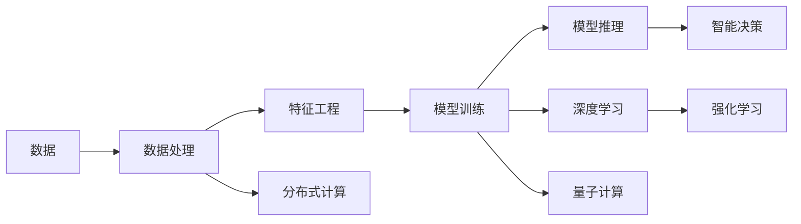

                 

## 1. 背景介绍

### 1.1 问题由来
计算技术的迅猛发展，特别是深度学习和人工智能的崛起，正在改变我们的世界。计算的本质已经从传统的数值计算和符号逻辑推理，转变为数据驱动的机器学习与智能决策。这一变化不仅深刻影响了科技领域，还正在全面渗透到经济、医疗、教育、交通等多个社会生活的方方面面。

### 1.2 问题核心关键点
这一变革的核心关键点包括：

- **数据的重要性**：数据的收集、存储、处理和利用，成为驱动计算与智能进步的基石。
- **机器学习的崛起**：从传统基于规则的算法，转变为基于数据和统计模型的机器学习范式。
- **计算范式的转变**：从串行计算向并行计算、分布式计算、量子计算等多范式并存的格局转变。
- **智能系统的普及**：从实验室中的研究工具，走向工业界的生产工具，对各行各业产生深远影响。

### 1.3 问题研究意义
理解计算本质变化及其未来趋势，对科技从业者、政策制定者和社会公众都有重要意义：

- **技术从业者**：掌握计算技术的发展脉络，预测未来技术趋势，更好地进行技术储备和创新。
- **政策制定者**：把握计算技术的社会影响，制定政策引导技术健康发展，保护公众利益。
- **社会公众**：理解计算技术的应用场景与潜在的隐私风险，合理利用技术提升生活质量。

## 2. 核心概念与联系

### 2.1 核心概念概述

本节将介绍几个与计算本质变化直接相关的核心概念：

- **数据驱动**：在计算与智能系统中，数据成为了驱动学习和决策的主要动力。
- **深度学习**：基于神经网络的深度学习技术，通过多层非线性变换，实现对复杂数据的建模和预测。
- **机器学习**：一种通过对数据进行学习，以自动提升模型性能的技术，包括监督学习、无监督学习和强化学习等。
- **分布式计算**：通过多台计算机并行处理任务，提升计算效率，支撑大规模数据分析和复杂模型训练。
- **量子计算**：利用量子比特的量子叠加与纠缠特性，实现计算能力的大幅提升，特别是在复杂优化与模拟问题中。

这些概念之间存在紧密联系，共同构成了计算技术发展的框架。通过理解这些概念，可以更全面地把握计算的本质变化与未来趋势。

### 2.2 核心概念原理和架构的 Mermaid 流程图



这个流程图展示了计算与智能系统的主要流程与技术支撑。

## 3. 核心算法原理 & 具体操作步骤

### 3.1 算法原理概述

计算的本质变化主要体现在以下几个方面：

- **从规则到数据的转变**：传统计算依赖于明确的规则和逻辑，而现代计算更多依赖于数据和统计模型。
- **从数值到符号的演进**：早期的计算主要处理数值，现代计算则更多涉及符号和语义信息，如自然语言处理和知识图谱等。
- **从串行到并行的跃迁**：现代计算技术，特别是分布式计算和深度学习，使得并行计算成为主流。
- **从确定性到随机性的探索**：量子计算等新兴技术引入随机性，拓展了计算的可能性。

### 3.2 算法步骤详解

以下是计算与智能系统的主要步骤，以深度学习为例：

**Step 1: 数据准备**
- 收集与清洗数据集。
- 将数据转化为模型可以处理的格式，如图像、文本等。

**Step 2: 模型选择**
- 选择或设计合适的深度学习模型，如卷积神经网络(CNN)、递归神经网络(RNN)、变压器(Transformer)等。

**Step 3: 模型训练**
- 使用优化器更新模型参数，最小化损失函数。
- 应用正则化技术，防止过拟合。

**Step 4: 模型评估**
- 在测试集上评估模型性能。
- 使用交叉验证等技术，确保模型泛化能力。

**Step 5: 模型应用**
- 将模型应用于实际问题中。
- 持续收集新数据，进行模型微调。

### 3.3 算法优缺点

深度学习等现代计算方法的优势包括：

- **处理非结构化数据**：如图像、文本等，直接利用神经网络进行建模和处理。
- **模型泛化能力强**：通过大数据训练，深度学习模型具有较好的泛化能力。
- **并行计算能力**：深度学习模型通常采用并行计算，效率较高。

然而，这些方法也存在一些局限：

- **模型复杂度高**：深度学习模型参数量巨大，训练和推理复杂。
- **数据需求量大**：深度学习模型依赖大量标注数据，获取高质量数据成本较高。
- **解释性差**：深度学习模型的决策过程较难解释，难以调试。

### 3.4 算法应用领域

深度学习等计算方法在诸多领域都得到了广泛应用，例如：

- **计算机视觉**：如图像识别、图像生成、人脸识别等。
- **自然语言处理**：如机器翻译、语音识别、情感分析等。
- **医疗健康**：如医学影像诊断、药物发现、基因分析等。
- **金融科技**：如信用评分、风险控制、股票预测等。
- **自动驾驶**：如视觉感知、路径规划、行为决策等。

这些应用展示了计算与智能技术的广泛影响力和巨大潜力。

## 4. 数学模型和公式 & 详细讲解 & 举例说明

### 4.1 数学模型构建

深度学习模型的数学模型通常由输入、隐藏层和输出组成。以一个简单的多层感知机(Multilayer Perceptron, MLP)为例，其数学模型为：

$$
\hat{y} = \sigma(W_L \sigma(W_{L-1} \sigma(... \sigma(W_1 x)...))
$$

其中 $\sigma$ 为激活函数，$W_i$ 为权重矩阵，$x$ 为输入，$\hat{y}$ 为输出。

### 4.2 公式推导过程

以监督学习中的二分类问题为例，推导交叉熵损失函数及其梯度计算：

设模型输出为 $\hat{y} = M_{\theta}(x)$，真实标签为 $y \in \{0,1\}$。交叉熵损失函数为：

$$
\ell(M_{\theta}(x),y) = -y \log \hat{y} - (1-y) \log (1-\hat{y})
$$

其梯度计算公式为：

$$
\frac{\partial \ell}{\partial \theta} = -y \frac{\partial \log \hat{y}}{\partial \theta} + (1-y) \frac{\partial \log (1-\hat{y})}{\partial \theta}
$$

使用链式法则和反向传播算法，可以高效计算梯度，更新模型参数。

### 4.3 案例分析与讲解

以图像分类为例，使用卷积神经网络(CNN)进行二分类问题求解。数据集为CIFAR-10，模型结构如下：

```python
import torch.nn as nn
import torch.nn.functional as F

class CNN(nn.Module):
    def __init__(self):
        super(CNN, self).__init__()
        self.conv1 = nn.Conv2d(3, 32, 3, 1, 1)
        self.conv2 = nn.Conv2d(32, 64, 3, 1, 1)
        self.fc1 = nn.Linear(64 * 8 * 8, 128)
        self.fc2 = nn.Linear(128, 10)

    def forward(self, x):
        x = F.max_pool2d(F.relu(self.conv1(x)), (2, 2))
        x = F.max_pool2d(F.relu(self.conv2(x)), 2)
        x = x.view(-1, 64 * 8 * 8)
        x = F.relu(self.fc1(x))
        x = self.fc2(x)
        return F.log_softmax(x, dim=1)
```

在训练过程中，使用交叉熵损失函数和随机梯度下降法，不断调整模型参数以最小化损失：

```python
import torch.optim as optim

model = CNN()
optimizer = optim.SGD(model.parameters(), lr=0.01, momentum=0.5)

criterion = nn.CrossEntropyLoss()
for epoch in range(10):
    running_loss = 0.0
    for i, data in enumerate(trainloader, 0):
        inputs, labels = data
        optimizer.zero_grad()
        outputs = model(inputs)
        loss = criterion(outputs, labels)
        loss.backward()
        optimizer.step()
        running_loss += loss.item()
    print(f"Epoch {epoch+1}, Loss: {running_loss/len(trainloader)}")
```

通过这种方式，模型能够在CIFAR-10数据集上取得不错的分类精度。

## 5. 项目实践：代码实例和详细解释说明

### 5.1 开发环境搭建

在进行深度学习项目实践前，需要准备合适的开发环境。以下以Python和PyTorch为例，提供详细的开发环境搭建步骤：

1. 安装Python 3.6及以上版本。
2. 使用Anaconda或Miniconda安装`conda`工具。
3. 创建虚拟环境，例如：

```bash
conda create -n myenv python=3.6
conda activate myenv
```

4. 安装PyTorch：

```bash
pip install torch torchvision torchaudio
```

5. 安装TensorFlow（可选）：

```bash
pip install tensorflow
```

6. 安装其他必要的依赖包，如Pandas、NumPy、Matplotlib等。

### 5.2 源代码详细实现

以下是一个简单的图像分类项目，使用卷积神经网络进行二分类：

```python
import torch
import torch.nn as nn
import torchvision.transforms as transforms
import torchvision.datasets as datasets

# 定义数据处理
transform = transforms.Compose([
    transforms.ToTensor(),
    transforms.Normalize((0.5, 0.5, 0.5), (0.5, 0.5, 0.5))
])

# 加载数据集
trainset = datasets.CIFAR10(root='./data', train=True, download=True, transform=transform)
trainloader = torch.utils.data.DataLoader(trainset, batch_size=32, shuffle=True, num_workers=2)

# 定义模型
class CNN(nn.Module):
    def __init__(self):
        super(CNN, self).__init__()
        self.conv1 = nn.Conv2d(3, 32, 3, 1, 1)
        self.conv2 = nn.Conv2d(32, 64, 3, 1, 1)
        self.fc1 = nn.Linear(64 * 8 * 8, 128)
        self.fc2 = nn.Linear(128, 10)

    def forward(self, x):
        x = F.max_pool2d(F.relu(self.conv1(x)), (2, 2))
        x = F.max_pool2d(F.relu(self.conv2(x)), 2)
        x = x.view(-1, 64 * 8 * 8)
        x = F.relu(self.fc1(x))
        x = self.fc2(x)
        return F.log_softmax(x, dim=1)

# 初始化模型和优化器
model = CNN()
optimizer = optim.SGD(model.parameters(), lr=0.01, momentum=0.5)

# 定义损失函数
criterion = nn.CrossEntropyLoss()

# 训练模型
for epoch in range(10):
    running_loss = 0.0
    for i, data in enumerate(trainloader, 0):
        inputs, labels = data
        optimizer.zero_grad()
        outputs = model(inputs)
        loss = criterion(outputs, labels)
        loss.backward()
        optimizer.step()
        running_loss += loss.item()
    print(f"Epoch {epoch+1}, Loss: {running_loss/len(trainloader)}")
```

### 5.3 代码解读与分析

上述代码主要包含以下几个部分：

- **数据预处理**：使用`transforms`模块对图像数据进行归一化和标准化。
- **数据加载**：使用`torchvision.datasets`加载CIFAR-10数据集，并使用`DataLoader`进行数据分批次加载。
- **模型定义**：定义卷积神经网络模型结构。
- **模型初始化**：使用`SGD`优化器进行模型参数的初始化。
- **模型训练**：通过循环迭代，不断调整模型参数以最小化损失。

### 5.4 运行结果展示

运行上述代码，可以在终端看到每轮训练的损失值。通过绘制损失曲线，可以观察模型训练的收敛情况。

```python
import matplotlib.pyplot as plt

losses = []
for epoch in range(10):
    running_loss = 0.0
    for i, data in enumerate(trainloader, 0):
        inputs, labels = data
        optimizer.zero_grad()
        outputs = model(inputs)
        loss = criterion(outputs, labels)
        loss.backward()
        optimizer.step()
        running_loss += loss.item()
    losses.append(running_loss/len(trainloader))
    print(f"Epoch {epoch+1}, Loss: {running_loss/len(trainloader)}")

plt.plot(losses)
plt.xlabel('Epoch')
plt.ylabel('Loss')
plt.title('Training Loss')
plt.show()
```

## 6. 实际应用场景

### 6.1 医疗影像诊断

深度学习在医疗影像诊断中具有广泛应用。例如，使用卷积神经网络(CNN)对CT、MRI等影像数据进行分类和分割，辅助医生进行疾病诊断。以下是一个简单的医学影像分类项目，使用ResNet进行肺结节检测：

```python
import torch.nn as nn
import torchvision.transforms as transforms
import torchvision.datasets as datasets

# 定义数据处理
transform = transforms.Compose([
    transforms.Resize((224, 224)),
    transforms.ToTensor(),
    transforms.Normalize([0.485, 0.456, 0.406], [0.229, 0.224, 0.225])
])

# 加载数据集
trainset = datasets.ImageFolder(root='./data/train', transform=transform)
trainloader = torch.utils.data.DataLoader(trainset, batch_size=32, shuffle=True, num_workers=2)

# 定义模型
model = ResNet18()

# 初始化模型和优化器
optimizer = optim.SGD(model.parameters(), lr=0.01, momentum=0.5)

# 定义损失函数
criterion = nn.CrossEntropyLoss()

# 训练模型
for epoch in range(10):
    running_loss = 0.0
    for i, data in enumerate(trainloader, 0):
        inputs, labels = data
        optimizer.zero_grad()
        outputs = model(inputs)
        loss = criterion(outputs, labels)
        loss.backward()
        optimizer.step()
        running_loss += loss.item()
    print(f"Epoch {epoch+1}, Loss: {running_loss/len(trainloader)}")
```

### 6.2 自然语言处理

深度学习在自然语言处理中也有广泛应用，如机器翻译、情感分析、命名实体识别等。以下是一个简单的情感分析项目，使用LSTM进行文本情感分类：

```python
import torch.nn as nn
import torch
from torchtext.datasets import IMDB

# 加载数据集
trainset, testset = IMDB.splits()

# 定义数据处理
tokenizer = torchtext.data.utils.get_tokenizer('basic_english')
def preprocess(text):
    text = tokenizer(text)
    text = [word.lower() for word in text]
    return text

train_data = torchtext.data.TextDataset(trainset, list, preprocessing=preprocess)
test_data = torchtext.data.TextDataset(testset, list, preprocessing=preprocess)

# 定义模型
class LSTM(nn.Module):
    def __init__(self):
        super(LSTM, self).__init__()
        self.embedding = nn.Embedding(len(train_data.vocab), 100)
        self.lstm = nn.LSTM(100, 100, 2, dropout=0.5)
        self.fc = nn.Linear(100, 2)

    def forward(self, x):
        embeddings = self.embedding(x)
        lstm_out, _ = self.lstm(embeddings)
        out = self.fc(lstm_out[:, -1, :])
        return out

# 初始化模型和优化器
model = LSTM()
optimizer = optim.SGD(model.parameters(), lr=0.01, momentum=0.5)

# 定义损失函数
criterion = nn.CrossEntropyLoss()

# 训练模型
for epoch in range(10):
    running_loss = 0.0
    for i, data in enumerate(train_data, 0):
        optimizer.zero_grad()
        outputs = model(data)
        loss = criterion(outputs, data.label)
        loss.backward()
        optimizer.step()
        running_loss += loss.item()
    print(f"Epoch {epoch+1}, Loss: {running_loss/len(train_data)}")
```

### 6.3 金融风险控制

深度学习在金融领域也有广泛应用，如信用评分、股票预测、风险控制等。以下是一个简单的信用评分项目，使用决策树和随机森林进行客户信用评估：

```python
import pandas as pd
from sklearn.ensemble import RandomForestClassifier
from sklearn.model_selection import train_test_split
from sklearn.metrics import accuracy_score

# 加载数据集
data = pd.read_csv('credit_data.csv')

# 数据处理
X = data.drop('default', axis=1)
y = data['default']

# 分割数据集
X_train, X_test, y_train, y_test = train_test_split(X, y, test_size=0.2, random_state=42)

# 定义模型
model = RandomForestClassifier()

# 训练模型
model.fit(X_train, y_train)

# 评估模型
y_pred = model.predict(X_test)
accuracy = accuracy_score(y_test, y_pred)
print(f"Accuracy: {accuracy}")
```

## 7. 工具和资源推荐

### 7.1 学习资源推荐

为了帮助开发者系统掌握深度学习与智能系统的理论基础和实践技巧，这里推荐一些优质的学习资源：

1. **Deep Learning Specialization**（吴恩达深度学习课程）：斯坦福大学教授吴恩达主讲的深度学习系列课程，涵盖深度学习的基础理论和实践应用。

2. **CS231n: Convolutional Neural Networks for Visual Recognition**（斯坦福大学计算机视觉课程）：涵盖计算机视觉的基础知识和深度学习模型，包括CNN、RNN、Transformer等。

3. **Natural Language Processing with Python**（斯坦福大学自然语言处理课程）：介绍自然语言处理的基本概念和深度学习模型，如RNN、LSTM、BERT等。

4. **Deep Learning with PyTorch**：吴恩达与亚马逊联合推出的深度学习课程，使用PyTorch框架进行深度学习实践。

5. **Hands-On Machine Learning with Scikit-Learn, Keras, and TensorFlow**：Aurélien Géron所著，全面介绍Scikit-Learn、Keras和TensorFlow等深度学习框架的使用。

通过这些资源的学习实践，相信你一定能够快速掌握深度学习与智能系统的精髓，并用于解决实际的智能问题。

### 7.2 开发工具推荐

高效的深度学习开发离不开优秀的工具支持。以下是几款用于深度学习与智能系统开发的常用工具：

1. **PyTorch**：由Facebook开发的深度学习框架，灵活易用，适用于研究和生产部署。

2. **TensorFlow**：由Google主导开发的深度学习框架，功能全面，适用于大规模工程应用。

3. **Jupyter Notebook**：交互式的笔记本环境，支持Python等语言，方便数据处理和模型训练。

4. **Google Colab**：谷歌提供的免费在线Jupyter Notebook环境，方便进行深度学习实验。

5. **TensorBoard**：TensorFlow配套的可视化工具，可实时监测模型训练状态，并提供丰富的图表呈现方式。

6. **Weights & Biases**：模型训练的实验跟踪工具，可以记录和可视化模型训练过程中的各项指标，方便对比和调优。

这些工具的合理利用，可以显著提升深度学习与智能系统的开发效率，加快创新迭代的步伐。

### 7.3 相关论文推荐

深度学习与智能系统的发展源于学界的持续研究。以下是几篇奠基性的相关论文，推荐阅读：

1. **ImageNet Classification with Deep Convolutional Neural Networks**（AlexNet论文）：提出卷积神经网络，开创深度学习在图像识别中的应用。

2. **Deep Residual Learning for Image Recognition**（ResNet论文）：提出残差网络，解决深度神经网络训练中的梯度消失问题。

3. **Attention is All You Need**（Transformer论文）：提出Transformer模型，推动深度学习在自然语言处理中的突破。

4. **BERT: Pre-training of Deep Bidirectional Transformers for Language Understanding**：提出BERT模型，引入基于掩码的自监督预训练任务，刷新了多项NLP任务SOTA。

5. **Towards Continual Learning with Memory-Augmented Neural Networks**：提出记忆增强网络，解决持续学习中的知识遗忘问题。

6. **End-to-End Learning for Goal-Oriented Dialog**：提出端到端对话模型，推动对话系统的进展。

这些论文代表了大规模深度学习与智能系统的发展脉络。通过学习这些前沿成果，可以帮助研究者把握学科前进方向，激发更多的创新灵感。

## 8. 总结：未来发展趋势与挑战

### 8.1 研究成果总结

深度学习与智能系统的迅猛发展，已经在多个领域展现出巨大的潜力和应用前景。其主要成就包括：

- **计算能力提升**：深度学习模型能够处理大规模非结构化数据，具备强大的计算能力。
- **模型性能提升**：通过大量数据训练，深度学习模型在多个任务上取得了SOTA性能。
- **技术普及推广**：深度学习与智能系统已经成为工业界的标准工具，广泛应用于各行各业。

### 8.2 未来发展趋势

展望未来，深度学习与智能系统的发展趋势包括：

1. **模型规模增大**：深度学习模型的参数量将继续增加，更多大规模模型将出现。
2. **模型通用化增强**：深度学习模型将具备更强的通用性和迁移能力。
3. **模型优化加速**：通过模型剪枝、量化等技术，提升模型推理速度和效率。
4. **多模态融合**：将视觉、语音、文本等多模态数据进行协同建模，提升模型的整体性能。
5. **知识图谱应用**：将结构化知识与深度学习模型结合，提升模型的语义理解和推理能力。
6. **量子计算引入**：量子计算将为深度学习带来新的计算范式，提升复杂问题的解决能力。

### 8.3 面临的挑战

尽管深度学习与智能系统取得了显著成就，但在发展过程中也面临诸多挑战：

1. **数据隐私风险**：深度学习模型需要大量标注数据，存在隐私泄露的风险。
2. **模型鲁棒性不足**：模型面对新数据和新场景时，泛化性能可能不佳。
3. **模型可解释性差**：深度学习模型的决策过程较难解释，难以调试和优化。
4. **计算资源消耗大**：深度学习模型的训练和推理需要大量计算资源，成本较高。
5. **技术落地难**：深度学习模型在工业界的应用仍面临许多实际问题，如模型优化、部署等。

### 8.4 研究展望

未来研究需要重点解决以下问题：

1. **数据隐私保护**：开发隐私保护技术，确保数据使用的安全性和合法性。
2. **模型鲁棒性提升**：研究鲁棒性增强方法，提高模型对新数据和场景的适应能力。
3. **模型可解释性增强**：开发可解释性强的模型，增强模型的透明度和可信度。
4. **计算资源优化**：研究模型优化和压缩技术，降低深度学习模型的计算成本。
5. **多模态融合技术**：研究多模态融合方法，提升模型的整体性能和应用范围。
6. **量子计算应用**：探索量子计算与深度学习的结合，提升复杂问题的解决能力。

通过这些研究，相信深度学习与智能系统将能够更好地服务于社会，推动各行业的数字化转型升级。

## 9. 附录：常见问题与解答

**Q1: 深度学习与智能系统的优势和劣势是什么？**

A: 深度学习与智能系统的优势包括：

- **处理非结构化数据**：如图像、文本等，直接利用神经网络进行建模和处理。
- **模型泛化能力强**：通过大量数据训练，深度学习模型具有较好的泛化能力。
- **并行计算能力**：深度学习模型通常采用并行计算，效率较高。

劣势包括：

- **模型复杂度高**：深度学习模型参数量巨大，训练和推理复杂。
- **数据需求量大**：深度学习模型依赖大量标注数据，获取高质量数据成本较高。
- **解释性差**：深度学习模型的决策过程较难解释，难以调试。

**Q2: 深度学习与智能系统在各个领域的应用情况如何？**

A: 深度学习与智能系统在多个领域都有广泛应用，例如：

- **计算机视觉**：如图像识别、图像生成、人脸识别等。
- **自然语言处理**：如机器翻译、语音识别、情感分析等。
- **医疗健康**：如医学影像诊断、药物发现、基因分析等。
- **金融科技**：如信用评分、风险控制、股票预测等。
- **自动驾驶**：如视觉感知、路径规划、行为决策等。

这些应用展示了深度学习与智能系统的广泛影响力和巨大潜力。

**Q3: 如何保护深度学习与智能系统的数据隐私？**

A: 保护深度学习与智能系统的数据隐私，可以从以下几个方面入手：

- **数据去标识化**：对数据进行去标识化处理，确保数据无法还原到具体个人。
- **差分隐私**：在数据收集和处理过程中，加入噪声干扰，保护个体隐私。
- **联邦学习**：通过分布式训练，在本地设备上进行模型训练，避免集中存储和处理数据。
- **安全多方计算**：在模型训练过程中，多方参与计算，确保数据不离开本地设备。

通过这些技术，可以有效保护数据隐私，确保深度学习与智能系统的安全应用。

**Q4: 如何提高深度学习与智能系统的模型鲁棒性？**

A: 提高深度学习与智能系统的模型鲁棒性，可以从以下几个方面入手：

- **数据增强**：通过数据增强技术，扩充训练集，提高模型对噪声的鲁棒性。
- **正则化**：使用L2正则、Dropout等技术，避免模型过拟合。
- **对抗训练**：引入对抗样本，提高模型对攻击的鲁棒性。
- **多模型集成**：通过集成多个模型，提升模型的鲁棒性。
- **自适应学习**：使用自适应学习算法，模型在训练过程中自适应地调整参数。

通过这些方法，可以有效提高深度学习与智能系统的模型鲁棒性，增强其在实际应用中的稳定性。

**Q5: 如何提高深度学习与智能系统的模型可解释性？**

A: 提高深度学习与智能系统的模型可解释性，可以从以下几个方面入手：

- **模型简化**：简化模型结构，降低复杂度，提高模型的可解释性。
- **可视化技术**：使用可视化工具，如TensorBoard，展示模型训练过程和决策路径。
- **解释性模型**：使用解释性强的模型，如决策树、LSTM等，提高模型的透明度。
- **知识图谱**：将知识图谱与深度学习模型结合，提升模型的语义理解和推理能力。

通过这些方法，可以有效提高深度学习与智能系统的模型可解释性，增强模型的透明度和可信度。

**Q6: 如何优化深度学习与智能系统的计算资源消耗？**

A: 优化深度学习与智能系统的计算资源消耗，可以从以下几个方面入手：

- **模型剪枝**：通过剪枝技术，去除冗余参数，减小模型大小。
- **量化加速**：将浮点模型转为定点模型，压缩存储空间，提高计算效率。
- **分布式计算**：通过分布式计算，提升计算效率，降低单台设备的计算负担。
- **硬件优化**：使用GPU、TPU等硬件加速设备，提升计算速度。

通过这些方法，可以有效优化深度学习与智能系统的计算资源消耗，降低成本，提高效率。

---

作者：禅与计算机程序设计艺术 / Zen and the Art of Computer Programming

