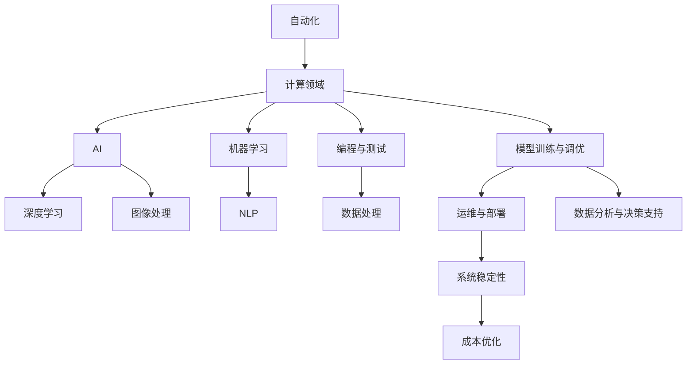

                 

# 计算领域的自动化发展趋势

> 关键词：自动化, 计算领域, 人工智能, 自动化工具, 深度学习, 机器学习, 自然语言处理, 图像处理

## 1. 背景介绍

### 1.1 问题由来

计算领域一直面临着自动化水平提升的挑战。无论是软件开发生命周期的管理，还是数据科学模型的构建与部署，人工介入始终是制约自动化效率和准确性的瓶颈。面对越来越多的数据和复杂的计算需求，传统的手工方式已经无法适应日益增长的业务复杂度。因此，研究自动化在计算领域的趋势和应用变得尤为重要。

### 1.2 问题核心关键点

自动化在计算领域的应用主要集中在以下几个方面：

- **自动化编程与测试**：使用自动化工具和框架来简化软件开发流程，提高代码质量与稳定性。
- **自动化数据处理**：通过自动化工具对大量数据进行清洗、转换、标注，提升数据预处理效率。
- **自动化模型训练与调优**：使用自动化工具对机器学习模型进行训练、调优，加快模型迭代速度。
- **自动化运维与部署**：自动化工具在保障系统稳定性和性能的同时，降低运维成本。
- **自动化数据分析与决策支持**：利用自动化工具对数据进行智能分析，提供决策支持。

自动化水平的提升，不仅能够大幅度降低人工成本，还能大幅提高业务运营的效率和质量。本文将系统介绍自动化在计算领域的应用现状，分析其未来发展趋势，并讨论面临的挑战。

## 2. 核心概念与联系

### 2.1 核心概念概述

- **自动化(Automation)**：利用计算机和软件工具，自动执行重复性任务的过程。
- **计算领域(Computing Domain)**：包括软件开发、数据科学、机器学习、人工智能等与计算相关的工作。
- **人工智能(AI)**：利用计算机技术模拟人类智能行为，以实现复杂任务的系统。
- **深度学习(Deep Learning)**：一种基于神经网络的机器学习技术，用于处理非结构化数据。
- **机器学习(Machine Learning)**：一种使计算机系统能够通过数据自动改进的技术。
- **自然语言处理(Natural Language Processing, NLP)**：处理和理解人类语言的技术。
- **图像处理(Image Processing)**：对数字图像进行处理，提取有用信息的过程。

这些概念之间的联系是通过自动化工具和框架连接起来的。自动化工具和框架能够自动执行上述技术和方法，从而提升整体计算领域的效率和效果。

### 2.2 核心概念原理和架构的 Mermaid 流程图



此图展示了自动化在计算领域的应用框架，从基础编程与测试到高级数据分析与决策支持，自动化工具贯穿整个流程。

## 3. 核心算法原理 & 具体操作步骤

### 3.1 算法原理概述

在计算领域，自动化算法通常基于以下几个基本原理：

- **数据驱动**：通过大量数据驱动算法决策，减少人工干预，提升决策质量。
- **模型驱动**：基于机器学习或深度学习模型，实现数据自动识别和处理。
- **任务驱动**：针对具体任务优化算法流程，实现高效率自动执行。
- **经验驱动**：利用历史经验数据指导自动化决策，提升算法的适应性和鲁棒性。

### 3.2 算法步骤详解

以**自动化数据处理**为例，其步骤如下：

1. **数据收集**：从不同来源收集数据。
2. **数据清洗**：移除无关数据，填充缺失值，标准化数据格式。
3. **数据标注**：对数据进行标注，形成训练集和测试集。
4. **模型训练**：选择合适的算法，使用标注数据训练模型。
5. **模型评估**：对模型进行评估，优化模型参数。
6. **数据部署**：将训练好的模型应用于新数据。
7. **监控与维护**：持续监控数据处理流程，及时调整和优化。

### 3.3 算法优缺点

**优点**：
- **效率高**：自动化处理能够快速完成大量重复性工作。
- **准确性好**：减少人为误差，提高数据处理的准确性。
- **可扩展性**：能够轻松扩展至大规模数据处理。
- **成本低**：降低人工成本，提升业务运营效率。

**缺点**：
- **依赖数据质量**：数据质量低可能导致自动化结果不准确。
- **模型复杂度**：复杂的自动化算法可能难以实现或维护。
- **鲁棒性差**：遇到异常情况，自动化系统可能无法正确处理。
- **依赖工具和技术**：需要依赖特定的工具和技术，一旦工具出现问题，可能导致系统崩溃。

### 3.4 算法应用领域

自动化在计算领域的应用领域广泛，包括但不限于：

- **软件开发**：自动化测试、代码生成、版本管理等。
- **数据分析**：数据清洗、转换、标注、可视化等。
- **机器学习模型**：模型训练、调优、评估等。
- **人工智能**：模型训练、推理、部署等。
- **自然语言处理**：文本分析、情感分析、语义理解等。
- **图像处理**：图像识别、分类、生成等。

## 4. 数学模型和公式 & 详细讲解 & 举例说明

### 4.1 数学模型构建

以**自动化模型训练与调优**为例，构建数学模型：

$$\text{Best Parameters} = \text{argmin}(\text{Loss Function}(\text{Parameters}, \text{Training Data}))$$

其中：
- $\text{Parameters}$：模型参数。
- $\text{Training Data}$：训练数据集。
- $\text{Loss Function}$：损失函数。

### 4.2 公式推导过程

假设有$n$个数据点$(x_i, y_i)$，其中$y_i$为真实标签，$\hat{y}_i$为模型预测标签，则损失函数为：

$$\text{Loss} = \frac{1}{n} \sum_{i=1}^{n} (y_i - \hat{y}_i)^2$$

通过梯度下降法更新模型参数：

$$\theta_{k} = \theta_{k} - \alpha \nabla_{\theta} \text{Loss}(\theta_k)$$

其中$\alpha$为学习率，$\nabla_{\theta}$为梯度运算符。

### 4.3 案例分析与讲解

以**自动化的深度学习模型训练**为例，使用TensorFlow框架：

1. **定义模型**：
   ```python
   import tensorflow as tf
   model = tf.keras.Sequential([
       tf.keras.layers.Dense(64, activation='relu'),
       tf.keras.layers.Dense(10, activation='softmax')
   ])
   ```

2. **编译模型**：
   ```python
   model.compile(optimizer=tf.keras.optimizers.Adam(0.01),
                 loss=tf.keras.losses.SparseCategoricalCrossentropy(from_logits=True),
                 metrics=[tf.keras.metrics.SparseCategoricalAccuracy()])
   ```

3. **训练模型**：
   ```python
   model.fit(x_train, y_train, epochs=10, validation_data=(x_val, y_val))
   ```

4. **评估模型**：
   ```python
   loss, accuracy = model.evaluate(x_test, y_test)
   ```

此过程展示了使用TensorFlow进行深度学习模型训练的自动化步骤。

## 5. 项目实践：代码实例和详细解释说明

### 5.1 开发环境搭建

以下是一个典型的开发环境搭建流程：

1. **安装依赖包**：
   ```bash
   pip install numpy pandas scikit-learn tensorflow transformers
   ```

2. **创建虚拟环境**：
   ```bash
   conda create --name myenv python=3.8
   conda activate myenv
   ```

3. **设置Jupyter Notebook**：
   ```bash
   jupyter lab --kernel python3
   ```

### 5.2 源代码详细实现

以下是一个**自动化数据清洗与转换**的示例代码：

```python
import pandas as pd
import numpy as np

def clean_and_transform_data(df):
    # 1. 删除空值
    df = df.dropna()
    
    # 2. 处理重复值
    df = df.drop_duplicates()
    
    # 3. 转换数据类型
    df['age'] = df['age'].astype('int')
    df['income'] = df['income'].astype('float')
    
    # 4. 编码分类数据
    df['gender'] = df['gender'].map({'male': 0, 'female': 1})
    
    return df
```

### 5.3 代码解读与分析

上述代码展示了如何利用Pandas库对数据进行清洗与转换。通过dropna方法删除空值，drop_duplicates方法去除重复值，astype方法转换数据类型，map方法编码分类数据。

## 6. 实际应用场景

### 6.1 软件开发

在软件开发中，自动化工具广泛应用，例如Jenkins、Travis CI、GitHub Actions等。通过自动化测试、CI/CD流程，能够显著提升代码质量和开发效率，降低人为错误。

### 6.2 数据分析

数据分析领域广泛应用自动化工具，如Pandas、NumPy、Scikit-learn等。这些工具能够自动化地进行数据清洗、转换、建模和分析，提升数据处理效率和准确性。

### 6.3 机器学习与深度学习

机器学习与深度学习领域使用TensorFlow、PyTorch、Keras等自动化工具。通过自动化模型训练、调优和评估，能够显著提升模型开发效率，缩短迭代周期。

### 6.4 未来应用展望

未来，自动化在计算领域将进一步普及，特别是在人工智能和大数据应用中。自动化将提升计算效率，降低人工成本，促进技术创新和业务发展。

## 7. 工具和资源推荐

### 7.1 学习资源推荐

- **Coursera: Machine Learning**：由Andrew Ng教授讲授的机器学习课程，系统介绍机器学习基本概念和方法。
- **Deep Learning Specialization by Andrew Ng**：由Andrew Ng教授讲授的深度学习课程，详细讲解深度学习算法和实践。
- **Kaggle**：数据科学竞赛平台，提供大量数据集和模型评估工具。
- **GitHub**：代码托管平台，提供开源项目和协作工具。
- **Google Colab**：免费提供GPU和TPU资源，方便开发者进行实验和研究。

### 7.2 开发工具推荐

- **TensorFlow**：由Google主导的深度学习框架，支持分布式计算和模型优化。
- **PyTorch**：由Facebook开发的深度学习框架，支持动态图和高效计算。
- **Jupyter Notebook**：交互式编程环境，支持Python和其他编程语言。
- **GitHub Actions**：CI/CD自动化工具，支持任务编排和持续集成。
- **Docker**：容器化技术，方便模型部署和管理。

### 7.3 相关论文推荐

- **"Automated Machine Learning: Methods, Systems, Challenges"**：由Olivier Bousquet等人发表的综述论文，介绍自动化机器学习的最新进展。
- **"Learning Deep Architectures for AI"**：由Yoshua Bengio等人发表的综述论文，介绍深度学习的最新进展。
- **"Deep Learning for NLP"**：由Yann LeCun等人发表的综述论文，介绍深度学习在自然语言处理领域的应用。

## 8. 总结：未来发展趋势与挑战

### 8.1 研究成果总结

本文全面介绍了自动化在计算领域的应用现状，重点讨论了自动化在数据处理、模型训练与调优、软件开发生命周期等方面的应用。自动化能够显著提升效率和效果，但同时也面临数据质量、模型复杂度、鲁棒性等挑战。

### 8.2 未来发展趋势

未来，自动化将进一步普及和深化，特别是在人工智能和大数据应用中。自动化技术将与AI、ML等技术深度融合，提升计算效率，降低人工成本，推动技术创新和业务发展。

### 8.3 面临的挑战

1. **数据质量**：自动化依赖高质量的数据，数据质量低可能导致自动化结果不准确。
2. **模型复杂度**：自动化算法可能过于复杂，难以实现或维护。
3. **鲁棒性**：自动化系统可能对异常情况处理不当，导致系统崩溃。
4. **依赖工具和技术**：自动化依赖特定的工具和技术，一旦工具出现问题，可能导致系统崩溃。

### 8.4 研究展望

1. **增强数据处理能力**：开发更高效的数据清洗与转换工具，提升数据质量。
2. **简化模型设计**：开发更易于实现的自动化模型设计工具，降低模型复杂度。
3. **提高鲁棒性**：改进自动化算法，提高系统对异常情况的鲁棒性。
4. **多样化工具选择**：开发多种自动化工具，提高系统的兼容性和灵活性。

## 9. 附录：常见问题与解答

### Q1: 自动化在计算领域有何优势？

A: 自动化能够显著提升效率和效果，减少人工成本，降低人为错误，提升业务运营效率。

### Q2: 自动化在计算领域面临哪些挑战？

A: 数据质量、模型复杂度、鲁棒性和依赖工具等问题是自动化面临的主要挑战。

### Q3: 如何提升自动化系统的鲁棒性？

A: 改进自动化算法，提高系统对异常情况的鲁棒性；增加异常检测和处理机制；加强系统监控和维护。

### Q4: 自动化在计算领域的应用前景如何？

A: 自动化在计算领域的应用前景广阔，特别是在人工智能和大数据应用中，能够显著提升效率和效果。

---

作者：禅与计算机程序设计艺术 / Zen and the Art of Computer Programming

