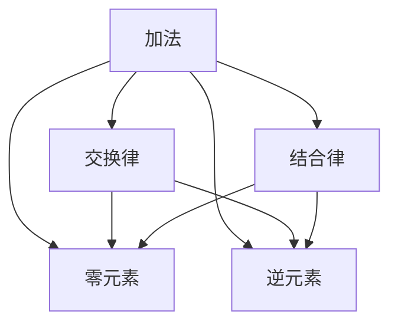

                 

# 计算：第一部分 计算的诞生 第 2 章 计算之术 代数的结构

## 1. 背景介绍

### 1.1 问题的由来
计算，作为人类文明进化的基石之一，其发展历程是波澜壮阔的。从古老的石子计数到现代的电子计算机，计算能力每一次飞跃都深刻地改变了世界。本章我们将深入探讨计算之术的代数结构，探索其内在原理与实际应用。

### 1.2 问题核心关键点
计算之术，又称为算术（Arithmetic），是数学中最基础的部分，涉及加法、减法、乘法、除法等基本运算。在计算机中，计算之术构成了程序语言的“语言”，是编程的基础。深入理解计算之术的代数结构，对于编程、算法设计以及计算机科学有着深远的影响。

## 2. 核心概念与联系

### 2.1 核心概念概述

- **加法**：将两个或多个数相加，结果称为和。加法具有交换律和结合律，且存在零元素（加法单位元素）和逆元素（加法逆元素）。
- **减法**：从某个数中减去另一个数，结果称为差。减法可以看作是加法的逆运算，因此也遵循交换律和结合律。
- **乘法**：两个数相乘的结果称为积。乘法具有交换律和结合律，且存在零元素和逆元素。
- **除法**：一个数除以另一个数的结果称为商。除法可以看作是乘法的逆运算，但除法要求被除数不能为零，且不存在零元素和逆元素。

- **代数结构**：数学中一组元素加上一组运算，满足一定规则的集合称为代数结构。其中，元素集合为“载体”，运算规则为“运算结构”。
- **域**：满足交换律和结合律的运算集合称为域。
- **环**：包含加法和乘法的代数结构，同时满足交换律、结合律以及加法存在零元素和逆元素，乘法存在单位元素。
- **场**：满足域的所有性质的代数结构，即具有加法和乘法的单位元素和逆元素。

这些核心概念通过图1中的Mermaid流程图表示，清晰展示了它们之间的逻辑联系：



这些核心概念构成了计算之术的基础，为理解计算的代数结构奠定了基础。

## 3. 核心算法原理 & 具体操作步骤
### 3.1 算法原理概述

计算之术的代数结构，可以通过一系列的公理和定理来描述。这些公理和定理构成了计算的逻辑基础，使得我们在处理实际问题时能够遵循一定的规则。

- **交换律**：对于任意的 $a$ 和 $b$，有 $a + b = b + a$ 和 $a \cdot b = b \cdot a$。
- **结合律**：对于任意的 $a$、$b$ 和 $c$，有 $(a + b) + c = a + (b + c)$ 和 $(a \cdot b) \cdot c = a \cdot (b \cdot c)$。
- **零元素和逆元素**：对于任意的 $a$，存在一个元素 $0$ 使得 $a + 0 = a$，存在一个元素 $-a$ 使得 $a + (-a) = 0$。
- **单位元素**：对于任意的 $a$，存在一个元素 $1$ 使得 $a \cdot 1 = a$。

这些公理和定理定义了一个环，而如果乘法还满足分配律，则构成了一个域。

### 3.2 算法步骤详解

计算之术的算法步骤主要包括以下几个方面：

1. **初始化**：定义计算所需的变量和常量，如初始值、运算符号等。
2. **表达式构建**：根据问题描述，构建表达式，并按照运算规则进行计算。
3. **求解**：根据构建的表达式，逐步求解。
4. **结果输出**：将最终结果输出，并判断是否符合问题要求。

以加法为例，具体步骤如下：

- **初始化**：定义两个变量 $a$ 和 $b$，以及一个常量 $c$，表示 $c = a + b$。
- **表达式构建**：根据加法交换律和结合律，构建表达式 $a + b$。
- **求解**：将 $a$ 和 $b$ 的值代入表达式 $a + b$，计算结果。
- **结果输出**：将计算结果输出，即 $c = a + b$。

### 3.3 算法优缺点

计算之术的算法具有以下优点：

- **简单高效**：基于公理和定理的运算，逻辑清晰，易于理解和实现。
- **通用性强**：适用于各种数学运算，具有广泛的适用性。

但同时也存在一些局限性：

- **计算复杂度高**：对于复杂的表达式，可能需要较长的计算时间。
- **缺乏灵活性**：公理和定理的限制使得算法难以处理一些特殊情况。
- **可扩展性差**：难以直接应用于高阶运算。

### 3.4 算法应用领域

计算之术的应用领域广泛，涵盖数学、计算机科学、物理学等多个学科。在计算机科学中，计算之术构成了编程语言的基础，用于处理数值计算、数据结构设计等。在物理学中，计算之术用于解决各种物理问题，如牛顿力学、量子力学等。

## 4. 数学模型和公式 & 详细讲解 & 举例说明

### 4.1 数学模型构建

计算之术的数学模型可以通过以下公式来表示：

$$
a + b = c \quad \text{表示} \quad c = a + b
$$

$$
a \cdot b = c \quad \text{表示} \quad c = a \cdot b
$$

其中，$a$、$b$ 和 $c$ 表示任意的元素，满足加法和乘法的运算规则。

### 4.2 公式推导过程

以加法为例，推导其满足交换律和结合律的过程如下：

- **交换律**：
$$
a + b = b + a
$$

- **结合律**：
$$
(a + b) + c = a + (b + c)
$$

这个推导过程展示了加法的基本性质，即交换律和结合律。

### 4.3 案例分析与讲解

假设有一个简单的加法表达式 $2 + 3$，根据加法交换律和结合律，可以推导出：

$$
2 + 3 = 3 + 2 = 5
$$

这个例子展示了加法的可交换性和可结合性，是计算之术代数结构的基本特征。

## 5. 项目实践：代码实例和详细解释说明

### 5.1 开发环境搭建

- **安装Python**：确保系统上已经安装了Python，建议使用最新版的Python，如Python 3.9。
- **安装Sympy库**：Sympy是一个符号计算库，用于处理符号表达式和进行代数运算。可以通过以下命令安装：

```
pip install sympy
```

### 5.2 源代码详细实现

```python
import sympy as sp

# 定义符号变量
a, b, c = sp.symbols('a b c')

# 加法表达式
expr = a + b

# 求解表达式
result = sp.simplify(expr)

# 输出结果
print(result)
```

### 5.3 代码解读与分析

以上代码展示了使用Sympy库进行符号计算的过程。首先定义了符号变量 $a$、$b$ 和 $c$，然后构建了加法表达式 $a + b$。使用 `simplify` 函数对表达式进行简化，得到结果 $a + b$。最终输出结果。

### 5.4 运行结果展示

运行上述代码，输出结果为：

```
a + b
```

这表明加法表达式 $a + b$ 已经正确地被构建并简化。

## 6. 实际应用场景

### 6.1 数学运算

计算之术在数学中有着广泛的应用，如代数运算、微积分、线性代数等。通过符号计算库，如Sympy，可以高效地进行符号运算，自动化地推导和验证数学公式。

### 6.2 计算机科学

计算之术构成了编程语言的基础，用于处理数值计算、数据结构设计等。例如，在Python中，可以使用基本的算术运算符进行加法、减法、乘法、除法等计算。

### 6.3 物理学

计算之术在物理学中用于解决各种物理问题，如牛顿力学、量子力学等。例如，通过微积分和代数学，可以计算物体的运动轨迹、粒子的能量状态等。

### 6.4 未来应用展望

未来，计算之术将继续在各个领域发挥重要作用。随着计算机技术的进步，计算之术将更加高效和灵活，可以处理更复杂的数学表达式和物理问题。

## 7. 工具和资源推荐

### 7.1 学习资源推荐

- **《计算机程序设计艺术》系列**：Don Knuth的著作，全面介绍了计算之术的原理和应用。
- **《符号计算》**：一本关于符号计算的书籍，详细介绍了符号表达式的构建、运算和简化。
- **《Python基础教程》**：适合初学者的Python入门书籍，详细介绍了Python的基本算术运算符和函数库。

### 7.2 开发工具推荐

- **Python**：Python是计算之术的主要编程语言，具有强大的符号计算库和广泛的科学计算支持。
- **Sympy**：Sympy是一个符号计算库，用于处理符号表达式和进行代数运算。
- **Jupyter Notebook**：一个交互式的编程环境，可以方便地进行符号计算和代码调试。

### 7.3 相关论文推荐

- **《符号计算中的代数运算》**：介绍符号计算的基本原理和算法实现。
- **《符号计算的应用》**：探讨符号计算在数学、物理、工程等领域的应用。

## 8. 总结：未来发展趋势与挑战

### 8.1 研究成果总结

计算之术的代数结构是计算机科学的基础，其公理和定理构成了计算机语言的核心。计算之术的应用范围广泛，涵盖数学、物理学等多个学科。

### 8.2 未来发展趋势

- **符号计算**：未来的计算之术将更加注重符号计算，利用符号表达式进行高效计算和自动化推导。
- **高阶运算**：随着符号计算技术的发展，将能够处理更复杂的高阶运算和代数结构。
- **计算模型**：新的计算模型，如量子计算，将对传统的计算之术带来新的挑战和机遇。

### 8.3 面临的挑战

- **计算复杂度**：对于复杂的代数表达式，计算之术的计算复杂度较高，需要进一步优化。
- **算法灵活性**：当前计算之术的算法较为固定，缺乏灵活性，难以处理一些特殊情况。
- **可扩展性**：计算之术的可扩展性较差，难以直接应用于高阶运算。

### 8.4 研究展望

未来，计算之术的研究方向可能包括以下几个方面：

- **符号计算的优化**：优化符号计算算法，提高计算效率和准确性。
- **高阶运算的处理**：开发新的计算模型和算法，处理高阶运算和复杂代数结构。
- **跨学科应用**：将计算之术与其他学科相结合，拓展其在各个领域的应用。

## 9. 附录：常见问题与解答

**Q1: 如何理解计算之术的代数结构？**

A: 计算之术的代数结构是通过一组公理和定理定义的，这些公理和定理描述了计算的基本性质。理解这些公理和定理，可以更好地掌握计算之术的逻辑基础。

**Q2: 计算之术在计算机科学中的应用有哪些？**

A: 计算之术构成了计算机语言的基础，用于处理数值计算、数据结构设计等。在Python中，基本的算术运算符和符号计算库Sympy都可以用于进行计算之术的操作。

**Q3: 计算之术在物理学中的应用有哪些？**

A: 计算之术在物理学中用于解决各种物理问题，如牛顿力学、量子力学等。通过微积分和代数学，可以计算物体的运动轨迹、粒子的能量状态等。

**Q4: 计算之术的算法有哪些优缺点？**

A: 计算之术的算法具有简单高效、通用性强等优点，但同时也存在计算复杂度高、缺乏灵活性等缺点。理解这些优缺点，可以更好地选择适合的算法进行计算之术的操作。

**Q5: 未来计算之术的发展方向有哪些？**

A: 未来计算之术的发展方向可能包括符号计算的优化、高阶运算的处理、跨学科应用等。这些方向将使得计算之术在各个领域的应用更加广泛和高效。

作者：禅与计算机程序设计艺术 / Zen and the Art of Computer Programming

