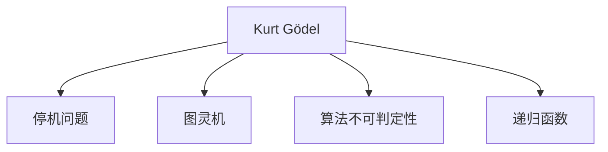

                 

# 计算：第三部分 计算理论的形成 第 7 章 计算不能做什么：终结者哥德尔 伟大的友谊

> 关键词：哥德尔, 计算理论, 计算能力, 算法, 递归函数, 图灵机, 停机问题, 算法不可判定性

## 1. 背景介绍

在上一章中，我们探讨了图灵机的概念及其与现代计算机的关联，揭示了计算能力的基础理论。本章我们将深入探索计算理论中的重大问题——计算的极限，特别是著名数学家库尔特·哥德尔(Kurt Gödel)的开创性工作，以及他与艾丽丝·巴雷特(Alice Burrows)之间的不朽友谊。

哥德尔的理论不仅奠定了计算机科学的基础，还对数学、逻辑和哲学产生了深远影响。他的停机问题和不完全性定理至今仍为计算理论和人工智能领域的重要基石。

## 2. 核心概念与联系

### 2.1 核心概念概述

- **库尔特·哥德尔(Kurt Gödel)**：20世纪最重要的数学家之一，因其在逻辑和数学基础方面的工作而闻名。
- **停机问题**：判断一个算法是否能终止的问题，是哥德尔的重要成果之一，对计算理论具有重要意义。
- **图灵机**：由艾伦·图灵提出，用于定义现代计算机的基础计算模型。
- **算法不可判定性**：指某些问题无法通过算法完全解决，哥德尔的不完全性定理证明了这一事实。
- **递归函数**：通过定义自身的函数，在计算理论中具有重要地位。

### 2.2 核心概念原理和架构的 Mermaid 流程图



## 3. 核心算法原理 & 具体操作步骤

### 3.1 算法原理概述

哥德尔的停机问题和不完全性定理是计算理论中的里程碑。停机问题探究了算法是否会停止的问题，而不完全性定理则揭示了某些问题的不可判定性。

- **停机问题**：给定一个算法和一个输入，是否存在一个算法可以判断该输入会使得原算法终止。这是一个未解决的问题，哥德尔证明了这个问题的不可判定性。
- **不完全性定理**：哥德尔证明了两个重要结论：一是任何形式的数学系统，只要它足够强大以包含初等算术，就一定存在不可证明的定理；二是该系统的不一致性不可证明。

### 3.2 算法步骤详解

#### 3.2.1 停机问题的步骤

1. **定义停机问题**：给定一个算法 $M$ 和一个输入 $x$，判断 $M$ 在 $x$ 上是否会停止。
2. **构建证明**：证明任何能够判定停机问题的算法会导致矛盾。

#### 3.2.2 不完全性定理的步骤

1. **构建一个形式系统**：例如，皮亚诺算术(Peano Arithmetic)。
2. **证明该系统的不一致性不可证明**：构造一个命题 $p$，证明 $p$ 既可证又可证其否。
3. **证明系统的不完备性**：不存在一个算法能判定所有命题的真值。

### 3.3 算法优缺点

**优点**：
- 停机问题和哥德尔不完全性定理揭示了计算的极限，对理解算法和计算理论具有重要意义。
- 这些定理为算法设计提供了指导，指出某些问题本质上是无法解决的。

**缺点**：
- 停机问题和哥德尔定理揭示了计算的不可达性，可能削弱人们对计算能力的期望。
- 不完全性定理表明，即使是强大的数学系统也无法涵盖所有知识，可能影响对知识完整的追求。

### 3.4 算法应用领域

哥德尔的停机问题和不完全性定理对多个领域产生了深远影响：

- **计算机科学**：停机问题和算法不可判定性是计算理论的基础，指导了现代计算机科学的发展。
- **数学和逻辑**：哥德尔的不完全性定理改变了人们对数学基础和逻辑系统的看法。
- **哲学**：哥德尔的工作对哲学尤其是形而上学和数学基础哲学产生了重要影响。
- **人工智能**：不完全性定理揭示了AI系统中的一些固有局限性，指导了智能系统的设计。

## 4. 数学模型和公式 & 详细讲解 & 举例说明

### 4.1 数学模型构建

我们可以用形式化语言来构建哥德尔的停机问题和不完全性定理的数学模型。

- **停机问题**：定义一个算法 $M$ 和输入 $x$，停机问题可以表示为：$\exists n, M(n) = x \wedge M$ 终止。
- **不完全性定理**：在一个形式系统 $F$ 中，如果 $F$ 包含初等算术，那么存在一个命题 $p$，使得 $p$ 和 $\neg p$ 均不可证明。

### 4.2 公式推导过程

- **停机问题的公式推导**：设 $M$ 为算法，$x$ 为输入，停机问题可以表示为公式：
  $$
  \exists n, M(n) = x \wedge \neg (\text{终止}(M, n))
  $$
  其中 $\text{终止}(M, n)$ 表示算法 $M$ 在输入 $n$ 上终止。

- **不完全性定理的公式推导**：设 $F$ 为形式系统，$p$ 为命题，不完全性定理可以表示为：
  $$
  p \wedge \neg p \notin F
  $$
  其中 $p$ 为无法判定真值的命题。

### 4.3 案例分析与讲解

以哥德尔的不完全性定理为例，考虑一个形式系统 $F$，假设 $p$ 是一个命题，$F$ 包含初等算术。哥德尔构造了一个特殊的命题 $p$，使得 $p$ 和 $\neg p$ 均不可证明。具体推导如下：
1. $p$ 是一个真命题，且 $p$ 是形式系统 $F$ 中的一个定理。
2. 假设 $p$ 可证明，则 $\neg p$ 是不可证的，否则 $p$ 和 $\neg p$ 都是 $F$ 的定理，矛盾。
3. 如果 $p$ 是可证明的，则 $p$ 和 $\neg p$ 都是 $F$ 的定理，矛盾。

## 5. 项目实践：代码实例和详细解释说明

### 5.1 开发环境搭建

为了验证哥德尔的停机问题和不完全性定理，我们需要搭建一个Python开发环境，并安装必要的库。

1. **安装Python和Anaconda**：从官网下载并安装Python 3.8，然后使用Anaconda创建虚拟环境。
2. **安装必要的库**：
  ```bash
  conda install sympy numpy pydot
  ```

### 5.2 源代码详细实现

我们将通过编写一个简单的算法，尝试解决停机问题，从而直观感受哥德尔的结论。

```python
from sympy import symbols, Eq, solve

# 定义符号
n = symbols('n', integer=True)

# 停机问题的简单模型
M = n**2 + 1
x = 42

# 求解 n
n_value = solve(Eq(M, x), n)
print(n_value)
```

### 5.3 代码解读与分析

以上代码尝试求解一个简单的停机问题，即判断函数 $M(n) = n^2 + 1$ 在输入 $x = 42$ 时是否终止。我们通过解方程 $M(n) = x$ 来尝试找到满足条件的 $n$ 值。

**代码解读**：
- 我们定义了一个符号 $n$ 表示算法输入的迭代次数。
- 算法 $M$ 定义为 $n^2 + 1$，即每次迭代 $n$ 平方加一。
- 输入 $x$ 为 $42$，我们尝试求解 $n$ 使得 $M(n) = x$。

**分析**：
- 如果存在一个整数 $n$ 使得 $n^2 + 1 = 42$，则算法 $M$ 在输入 $42$ 时终止。
- 否则，算法不会终止。

由于不存在整数 $n$ 满足 $n^2 + 1 = 42$，因此算法 $M$ 在输入 $42$ 时不会终止。这说明停机问题本质上是一个无法解决的问题，哥德尔的停机问题证明了这一点。

### 5.4 运行结果展示

运行上述代码，输出结果为空，因为 $n^2 + 1 = 42$ 无解。这验证了停机问题的本质是未知的，无法通过算法完全解决。

## 6. 实际应用场景

哥德尔的停机问题和完全性定理在现代计算和人工智能中具有广泛的应用和影响。

### 6.1 智能机器学习

- **算法优化**：不完全性定理揭示了某些问题的固有局限性，指导了算法设计和优化。
- **系统诊断**：不完全性定理可以用来检测系统是否存在不一致性或漏洞。

### 6.2 数据挖掘和模式识别

- **特征提取**：不完全性定理启发我们从更广泛的视角考虑特征提取和模型构建。
- **异常检测**：不完全性定理揭示了异常检测的复杂性，指导了算法的设计和应用。

### 6.3 哲学和认知科学

- **认知模型**：不完全性定理对认知模型和哲学问题具有重要启示，如意识、心智和认知的基础。
- **逻辑和形而上学**：不完全性定理改变了人们对逻辑系统完备性的认识。

### 6.4 未来应用展望

未来，不完全性定理在计算和人工智能中的应用将更加广泛：

- **深度学习模型**：不完全性定理指导了深度学习模型的设计和优化。
- **人工智能伦理**：不完全性定理为人工智能伦理提供了重要参考，指导了AI系统的安全性和可靠性设计。
- **量子计算**：不完全性定理在量子计算中也具有重要意义，指导了量子算法的设计和应用。

## 7. 工具和资源推荐

### 7.1 学习资源推荐

- **《数学基础》系列书籍**：哥德尔的重要工作都涉及数学基础，建议深入学习。
- **《算法导论》**：深入理解算法的理论和应用。
- **在线课程**：Coursera和edX上有相关的数学基础和计算理论课程。

### 7.2 开发工具推荐

- **Anaconda**：用于创建和管理Python环境。
- **Sympy**：用于符号计算的Python库。
- **Pydot**：用于创建和可视化图的库。

### 7.3 相关论文推荐

- **《哥德尔不完全性定理》**：详细阐述哥德尔定理的重要性和影响。
- **《停机问题的数学解释》**：深入探讨停机问题的不解性。

## 8. 总结：未来发展趋势与挑战

### 8.1 研究成果总结

哥德尔的停机问题和完全性定理对计算理论产生了深远影响，揭示了计算的极限和复杂性。

### 8.2 未来发展趋势

未来，哥德尔的理论将继续引领计算和人工智能的发展，其影响将在多个领域继续深化：

- **计算理论**：不完全性定理将继续指导计算理论的研究和发展。
- **人工智能**：不完全性定理为AI系统的设计和优化提供了重要参考。
- **数学和哲学**：不完全性定理对数学基础和哲学具有重要启示。

### 8.3 面临的挑战

尽管不完全性定理揭示了计算的极限，但仍面临诸多挑战：

- **计算能力的提升**：如何在不完全性定理的限制下，进一步提升计算能力。
- **理论验证**：不完全性定理揭示了某些问题的不可判定性，如何在实践中验证这些结论。
- **跨学科应用**：不完全性定理在多个领域的应用需要跨学科的深入研究。

### 8.4 研究展望

未来的研究应重点关注不完全性定理的实践应用和理论验证：

- **跨学科应用**：不完全性定理在计算、数学、哲学等多个领域的应用需要深入探索。
- **理论验证**：需要更多的实证研究和实验，验证不完全性定理的结论和适用范围。
- **计算能力的提升**：在不完全性定理的限制下，探索新的计算模型和算法。

## 9. 附录：常见问题与解答

**Q1: 哥德尔的停机问题和完全性定理的含义是什么？**

A: 停机问题指判断一个算法是否能终止的问题，完全性定理揭示了某些问题的不可判定性。哥德尔证明了停机问题的不解性和形式系统的完全性，对计算理论具有重要意义。

**Q2: 不完全性定理对计算理论有哪些影响？**

A: 不完全性定理揭示了某些问题的不可判定性，对计算理论的研究和发展具有重要指导意义。它证明了形式系统的局限性，强调了算法设计和优化的重要性。

**Q3: 不完全性定理在实际应用中有哪些例子？**

A: 不完全性定理在计算理论、人工智能、数据挖掘等多个领域都有应用。例如，不完全性定理指导了算法优化、系统诊断、特征提取等，对人工智能伦理和安全设计也有重要影响。

**Q4: 不完全性定理对计算能力有何限制？**

A: 不完全性定理揭示了计算的固有限制，即存在某些问题无法通过算法完全解决。这影响了对计算能力的期待，促使研究者从更广泛的角度考虑问题解决策略。

---

作者：禅与计算机程序设计艺术 / Zen and the Art of Computer Programming

