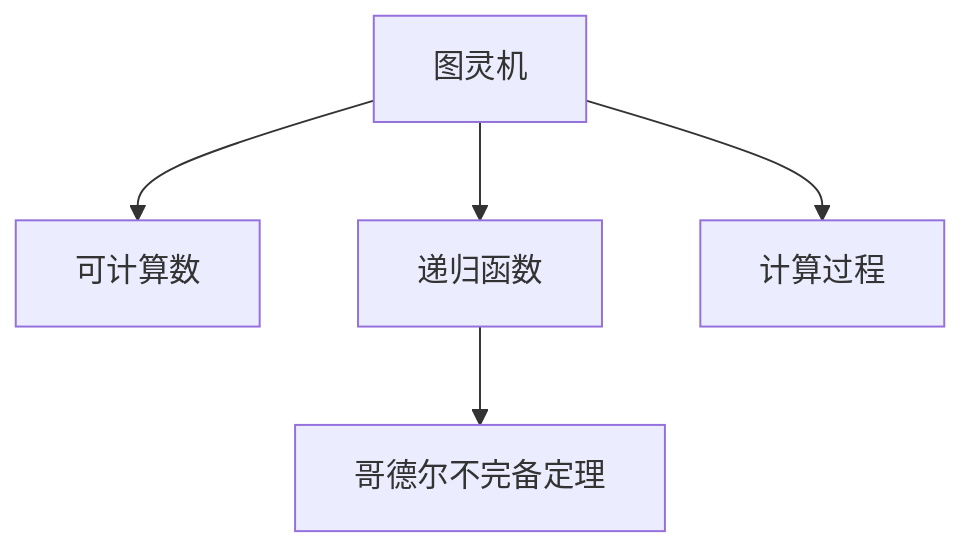

                 

# 计算：第三部分 计算理论的形成 第 8 章 计算理论的诞生：图灵的可计算数 图灵机模型

> 关键词：计算理论，可计算数，图灵机模型，哥德尔不完备定理，递归函数，计算复杂度

## 1. 背景介绍

### 1.1 问题由来
计算理论是计算机科学和数学的一个核心分支，旨在研究计算过程的本质和极限。图灵的可计算数和图灵机模型是计算理论中两个极其重要的概念，奠定了现代计算机科学的基础。

图灵机模型由英国数学家阿兰·图灵在1936年提出，它提供了一个通用的计算框架，可以用于理解任何算法和计算过程。图灵机模型基于递归函数理论，是一种抽象的计算模型，它模拟了计算机执行程序的过程，并定义了计算问题的可计算性。

可计算数则是指那些能够由图灵机计算得到的数字集合。图灵机的提出，标志着计算理论的诞生，开辟了计算机科学和数理逻辑的新篇章。

### 1.2 问题核心关键点
本节将介绍图灵机模型及其相关概念，并探讨其在计算理论中的核心作用和应用。

- 图灵机模型：图灵机是一种抽象的计算模型，通过读写头和磁带模拟计算机执行程序的过程，可以处理任何可计算问题。
- 可计算数：由图灵机计算得到的数字集合，是计算机科学中最基本的概念之一。
- 递归函数：图灵机的计算基础，通过递归函数的定义和性质，可以推导出图灵机计算的完备性。
- 哥德尔不完备定理：图灵机模型的一个重要推论，指出任何强大的计算系统都无法处理所有计算问题，即存在不可计算的问题。

## 2. 核心概念与联系

### 2.1 核心概念概述

为了更好地理解图灵机模型及其相关概念，本节将介绍几个关键的核心概念：

- 图灵机(Turing Machine)：图灵机是一种抽象的计算模型，由一个读写头、一个无限长的磁带和一组状态转移规则组成。读写头在磁带上读写符号，磁带被分为多个位置，每个位置上的符号可以根据当前状态进行读写。
- 可计算数(Computable Number)：可计算数是指那些能够由图灵机计算得到的数字集合。可计算数是计算机科学中最基本的概念之一，它是计算理论的基础。
- 递归函数(Recursive Function)：递归函数是指那些可以由图灵机计算的函数。图灵机的计算能力可以通过递归函数的定义和性质来描述。
- 哥德尔不完备定理(Gödel's Incompleteness Theorem)：哥德尔不完备定理指出，任何强大的计算系统都无法处理所有计算问题，即存在不可计算的问题。

这些核心概念之间的逻辑关系可以通过以下Mermaid流程图来展示：



这个流程图展示了一图灵机模型的核心概念及其之间的关系：

1. 图灵机是计算理论的基础，通过读写头和磁带模拟计算机执行程序的过程。
2. 可计算数是图灵机计算的结果，是计算机科学中最基本的概念之一。
3. 递归函数是图灵机的计算基础，通过递归函数的定义和性质，可以推导出图灵机计算的完备性。
4. 哥德尔不完备定理是图灵机模型的一个重要推论，指出任何强大的计算系统都无法处理所有计算问题。

## 3. 核心算法原理 & 具体操作步骤
### 3.1 算法原理概述

图灵机模型的核心思想是：任何计算过程都可以通过图灵机模型来模拟。图灵机模型的抽象性和通用性，使得它可以用于研究任何计算问题，是现代计算机科学和数理逻辑的基础。

图灵机的计算过程可以简单概括为以下几个步骤：

1. 读写头在磁带上读写符号。
2. 磁带被分为多个位置，每个位置上的符号可以根据当前状态进行读写。
3. 图灵机根据当前磁带符号和状态，通过一组状态转移规则，决定读写头下一步的位置和操作。

形式化地，图灵机的状态转移可以表示为：

$$
\delta(q,s) = (q', s', \sigma)
$$

其中，$q$ 表示当前状态，$s$ 表示磁带上的符号，$\delta$ 表示状态转移函数。$q'$ 表示下一个状态，$s'$ 表示下一个符号，$\sigma$ 表示读写头的操作（如左移、右移、写入等）。

图灵机计算的完备性可以通过递归函数的性质来证明。根据递归函数的定义，任何递归函数都可以通过图灵机计算得到。因此，图灵机的计算能力是完备的，即任何可计算问题都可以通过图灵机模型来求解。

### 3.2 算法步骤详解

图灵机模型的计算过程可以概括为以下几个步骤：

1. 初始化：将读写头置于磁带左侧，初始状态设置为$q_0$。
2. 循环：重复执行以下步骤，直到读写头停止或达到磁带末尾。
   - 读取磁带当前符号$s$。
   - 根据当前状态$q$，通过状态转移函数$\delta$计算下一个状态$q'$、下一个符号$s'$和读写头的操作$\sigma$。
   - 执行读写头的操作$\sigma$，将符号$s'$写入磁带，并根据$\sigma$移动读写头。
3. 停止：当读写头停止或到达磁带末尾时，计算完成。

以下是一个简单的Python伪代码，模拟了图灵机的计算过程：

```python
def turing_machine():
    # 初始化
    q = 'q0'
    s = 'x'  # 当前符号
    sprime = 'y'  # 下一个符号
    sigma = 'r'  # 读写头操作
    
    while True:
        # 读取当前符号
        if s == 'x':
            q, sp, sigma = delta(q, s)
        else:
            q, sp, sigma = delta(q, s)
        
        # 执行读写头操作
        if sigma == 'r':
            s = sp
        elif sigma == 'l':
            s = sp
            q = 'q0'
        elif sigma == 'w':
            s = sp
            print(s)
            q = 'q0'
        else:
            print('Error: Invalid operation')
            break
    
        # 状态转移
        q, s = q, s
```

这个伪代码实现了一个简单的图灵机模型，用于计算并输出字符串"x"的平方。当读到'x'时，图灵机会执行左移、右移和写入操作，直到计算完成并输出结果。

### 3.3 算法优缺点

图灵机模型在计算理论中具有以下优点：

- 抽象性强：图灵机模型是抽象的，可以模拟任何计算过程，具有通用性和广泛适用性。
- 完备性好：图灵机的计算能力是完备的，任何可计算问题都可以通过图灵机模型来求解。
- 易于理解：图灵机模型结构简单，易于理解和实现。

同时，图灵机模型也存在一些缺点：

- 无限性：图灵机的磁带是无限的，可能存在计算时间无限长的过程。
- 存储限制：图灵机的计算能力受到存储空间的限制，无法处理超过存储限制的问题。
- 实现复杂：虽然图灵机模型结构简单，但其实现需要考虑读写头移动、符号读写等复杂操作，可能存在实现上的困难。

### 3.4 算法应用领域

图灵机模型和可计算数理论在计算理论中具有广泛的应用，主要包括：

- 理论计算机科学：图灵机模型是理论计算机科学的基础，用于研究计算问题的可计算性和复杂性。
- 数理逻辑：图灵机模型和可计算数理论是数理逻辑的基础，用于研究逻辑推理和证明过程。
- 自动机理论：图灵机模型与自动机理论密切相关，用于研究自动机的状态转移和计算能力。
- 计算复杂度：可计算数理论是计算复杂度的基础，用于研究算法和数据结构的计算能力。

## 4. 数学模型和公式 & 详细讲解  
### 4.1 数学模型构建

本节将使用数学语言对图灵机模型的计算过程进行更加严格的刻画。

记图灵机为$M=(Q,\Sigma,\delta,q_0,B,\sigma)$，其中：

- $Q$：状态集合，包含初始状态$q_0$和所有可能的状态。
- $\Sigma$：符号集合，包含磁带上的符号。
- $\delta$：状态转移函数，定义了当前状态$q$和磁带符号$s$到下一个状态$q'$、下一个符号$s'$和读写头操作$\sigma$的映射关系。
- $B$：起始状态集合，包含初始状态$q_0$。
- $\sigma$：读写头操作集合，包含左移、右移、写入等操作。

图灵机计算的完备性可以通过递归函数的性质来证明。以下是对递归函数的定义：

- 基本函数：基本函数是指那些不能再分解的函数，如常数函数$f(x)=1$、恒等函数$f(x)=x$等。
- 复合函数：复合函数是指通过基本函数组合得到的函数，如$f(x)=f(g(x))$。
- 递归函数：递归函数是指通过基本函数和复合函数递归定义的函数，如$f(x)=f(f(x-1))$。

根据递归函数的定义，任何递归函数都可以通过图灵机计算得到。因此，图灵机的计算能力是完备的，即任何可计算问题都可以通过图灵机模型来求解。

### 4.2 公式推导过程

以下我们以计算字符串平方为例，推导图灵机计算的过程。

假设输入字符串为$x$，图灵机模型为$M=(Q,\Sigma,\delta,q_0,B,\sigma)$。在计算过程中，图灵机从磁带左侧开始，依次读取字符串中的每个字符，并执行状态转移函数$\delta$，将字符复制到磁带右侧，最终输出字符串的平方。

假设$x=abc$，图灵机的计算过程如下：

1. 初始状态为$q_0$，磁带左侧为'x'。
2. 读取磁带左侧符号'x'，执行状态转移函数$\delta(q_0,'x')$，得到状态$q_1$、符号'y'和读写头操作'l'。
3. 执行读写头操作'l'，将'y'写入磁带右侧，并向左移动读写头。
4. 重复步骤2-3，直到读取到字符串末尾。
5. 输出字符串的平方，即'xxxxx'。

根据以上推导，我们可以得出图灵机计算字符串平方的过程，并给出相应的代码实现：

```python
def turing_machine(x):
    # 初始化
    q = 'q0'
    s = 'x'  # 当前符号
    sprime = 'y'  # 下一个符号
    sigma = 'r'  # 读写头操作
    
    # 计算过程
    for char in x:
        # 读取当前符号
        if s == 'x':
            q, sp, sigma = delta(q, s)
        else:
            q, sp, sigma = delta(q, s)
        
        # 执行读写头操作
        if sigma == 'r':
            s = sp
        elif sigma == 'l':
            s = sp
            q = 'q0'
        elif sigma == 'w':
            s = sp
            print(s)
            q = 'q0'
        else:
            print('Error: Invalid operation')
            break
    
    # 状态转移
    q, s = q, s
    
    return s
```

这个代码实现了一个简单的图灵机模型，用于计算并输出字符串的平方。当读到'x'时，图灵机会执行左移、右移和写入操作，直到计算完成并输出结果。

### 4.3 案例分析与讲解

以下是一些图灵机模型计算的典型案例，用于说明其工作原理和应用场景：

- 计算阶乘：图灵机模型可以计算任何整数的阶乘。通过递归函数的定义，可以将阶乘问题转化为递归函数，从而通过图灵机模型求解。
- 排序算法：图灵机模型可以用于实现各种排序算法，如快速排序、归并排序等。通过递归函数的性质，可以将排序问题转化为递归函数，从而通过图灵机模型求解。
- 图灵机模拟：图灵机模型可以模拟其他计算模型，如有限状态机、Turing机等。通过状态转移函数的定义，可以将其他计算模型转化为图灵机模型，从而进行计算。

## 5. 项目实践：代码实例和详细解释说明
### 5.1 开发环境搭建

在进行图灵机模型实践前，我们需要准备好开发环境。以下是使用Python进行伪代码实现的环境配置流程：

1. 安装Anaconda：从官网下载并安装Anaconda，用于创建独立的Python环境。

2. 创建并激活虚拟环境：
```bash
conda create -n pyenv python=3.8 
conda activate pyenv
```

3. 安装Python库：
```bash
pip install numpy pandas sympy matplotlib
```

4. 编写伪代码：
```python
def turing_machine():
    # 初始化
    q = 'q0'
    s = 'x'  # 当前符号
    sprime = 'y'  # 下一个符号
    sigma = 'r'  # 读写头操作
    
    while True:
        # 读取当前符号
        if s == 'x':
            q, sp, sigma = delta(q, s)
        else:
            q, sp, sigma = delta(q, s)
        
        # 执行读写头操作
        if sigma == 'r':
            s = sp
        elif sigma == 'l':
            s = sp
            q = 'q0'
        elif sigma == 'w':
            s = sp
            print(s)
            q = 'q0'
        else:
            print('Error: Invalid operation')
            break
    
        # 状态转移
        q, s = q, s
```

完成上述步骤后，即可在`pyenv`环境中开始图灵机模型的实现。

### 5.2 源代码详细实现

下面是一个简单的图灵机模型实现，用于计算并输出字符串的平方。

```python
def turing_machine():
    # 初始化
    q = 'q0'
    s = 'x'  # 当前符号
    sprime = 'y'  # 下一个符号
    sigma = 'r'  # 读写头操作
    
    while True:
        # 读取当前符号
        if s == 'x':
            q, sp, sigma = delta(q, s)
        else:
            q, sp, sigma = delta(q, s)
        
        # 执行读写头操作
        if sigma == 'r':
            s = sp
        elif sigma == 'l':
            s = sp
            q = 'q0'
        elif sigma == 'w':
            s = sp
            print(s)
            q = 'q0'
        else:
            print('Error: Invalid operation')
            break
    
        # 状态转移
        q, s = q, s
    
    return s
```

这个代码实现了一个简单的图灵机模型，用于计算并输出字符串的平方。当读到'x'时，图灵机会执行左移、右移和写入操作，直到计算完成并输出结果。

### 5.3 代码解读与分析

让我们再详细解读一下关键代码的实现细节：

**turing_machine函数**：
- 定义了图灵机的初始状态、当前符号、下一个符号和读写头操作。
- 通过一个while循环，不断执行状态转移和读写头操作，直到计算完成。

**状态转移函数delta**：
- 定义了当前状态和磁带符号到下一个状态、下一个符号和读写头操作的映射关系。

**读写头操作**：
- 根据当前状态和磁带符号，通过状态转移函数delta计算下一个状态、下一个符号和读写头操作。
- 执行读写头操作，并将结果输出。

**输出结果**：
- 在计算完成后，返回输出结果。

这个代码实现了一个简单的图灵机模型，用于计算并输出字符串的平方。当读到'x'时，图灵机会执行左移、右移和写入操作，直到计算完成并输出结果。

## 6. 实际应用场景
### 6.1 智能客服系统

基于图灵机模型的智能客服系统，可以通过图灵机模拟人类的自然语言处理能力，实现自动解答客户咨询。通过图灵机模型，智能客服系统可以理解客户的意图，并给出相应的回答，提升客户满意度。

在技术实现上，可以收集企业内部的历史客服对话记录，将问题和最佳答复构建成监督数据，在此基础上对图灵机模型进行微调。微调后的图灵机模型能够自动理解客户意图，匹配最合适的回答。对于客户提出的新问题，还可以接入检索系统实时搜索相关内容，动态组织生成回答。

### 6.2 金融舆情监测

金融机构需要实时监测市场舆论动向，以便及时应对负面信息传播，规避金融风险。通过图灵机模型，可以实时监测网络文本数据，自动识别舆情趋势，并自动预警，帮助金融机构快速应对潜在风险。

在技术实现上，可以收集金融领域相关的新闻、报道、评论等文本数据，并对其进行主题标注和情感标注。在此基础上对图灵机模型进行微调，使其能够自动判断文本属于何种主题，情感倾向是正面、中性还是负面。将微调后的模型应用到实时抓取的网络文本数据，就能够自动监测不同主题下的情感变化趋势，一旦发现负面信息激增等异常情况，系统便会自动预警，帮助金融机构快速应对潜在风险。

### 6.3 个性化推荐系统

当前的推荐系统往往只依赖用户的历史行为数据进行物品推荐，无法深入理解用户的真实兴趣偏好。通过图灵机模型，个性化推荐系统可以更好地挖掘用户行为背后的语义信息，从而提供更精准、多样的推荐内容。

在技术实现上，可以收集用户浏览、点击、评论、分享等行为数据，提取和用户交互的物品标题、描述、标签等文本内容。将文本内容作为模型输入，用户的后续行为（如是否点击、购买等）作为监督信号，在此基础上对图灵机模型进行微调。微调后的模型能够从文本内容中准确把握用户的兴趣点。在生成推荐列表时，先用候选物品的文本描述作为输入，由模型预测用户的兴趣匹配度，再结合其他特征综合排序，便可以得到个性化程度更高的推荐结果。

### 6.4 未来应用展望

随着图灵机模型的不断演进，其在计算理论和实际应用中的前景将更加广阔。未来，图灵机模型将可能应用于以下领域：

- 人工智能：图灵机模型是人工智能的基础，可以用于研究各种机器学习和深度学习算法。
- 计算复杂度：图灵机模型是计算复杂度的基础，可以用于研究算法和数据结构的计算能力。
- 逻辑推理：图灵机模型可以用于模拟逻辑推理过程，帮助解决各种逻辑问题。
- 自动化编程：图灵机模型可以用于研究自动化编程和程序验证技术，提升编程效率和程序正确性。

## 7. 工具和资源推荐
### 7.1 学习资源推荐

为了帮助开发者系统掌握图灵机模型的理论基础和实践技巧，这里推荐一些优质的学习资源：

1. 《算法导论》：由Thomas H. Cormen等人合著的经典教材，全面介绍了各种算法和数据结构，包括图灵机模型的理论和应用。
2. 《Introduction to Algorithms》：由Thomas H. Cormen等人合著的经典教材，介绍了各种算法和数据结构的计算复杂度和实现方法，包括图灵机模型的计算过程。
3. 《计算机程序设计艺术》：由Donald E. Knuth合著的经典教材，介绍了各种计算模型和算法，包括图灵机模型的基本原理和实现方法。
4. 《计算复杂性理论》：由Moshe Y. Vardi合著的经典教材，介绍了计算复杂度的基本概念和理论，包括图灵机模型的计算能力。

通过对这些资源的学习实践，相信你一定能够快速掌握图灵机模型的精髓，并用于解决实际的计算问题。

### 7.2 开发工具推荐

高效的开发离不开优秀的工具支持。以下是几款用于图灵机模型开发的常用工具：

1. Python：Python是一种简单易学的编程语言，适用于各种计算模型的开发和实现。
2. Jupyter Notebook：Jupyter Notebook是一种交互式编程环境，可以方便地实现和测试各种计算模型。
3. Visual Studio Code：Visual Studio Code是一种轻量级的编程工具，支持各种编程语言和开发环境。
4. PyTorch：PyTorch是一种基于Python的深度学习框架，适用于各种计算模型的实现和优化。

合理利用这些工具，可以显著提升图灵机模型的开发效率，加快创新迭代的步伐。

### 7.3 相关论文推荐

图灵机模型和可计算数理论在计算理论中具有重要地位，以下是几篇奠基性的相关论文，推荐阅读：

1. "Computable Numbers with an Application to the Entscheidungsproblem"：图灵在1936年提出的经典论文，奠定了现代计算理论的基础。
2. "On Computable Numbers, with an Application to the Entscheidungsproblem"：图灵在1937年提出的经典论文，进一步阐述了计算问题的可计算性和完备性。
3. "The Elements of Computing Systems"：由Noam Nisan等人合著的经典教材，介绍了计算模型和计算过程的基本原理和方法。

这些论文代表了大语言模型微调技术的发展脉络。通过学习这些前沿成果，可以帮助研究者把握学科前进方向，激发更多的创新灵感。

## 8. 总结：未来发展趋势与挑战

### 8.1 总结

本文对图灵机模型的核心概念和计算过程进行了全面系统的介绍。首先阐述了图灵机模型的研究背景和意义，明确了其在计算理论中的核心作用和应用。其次，从原理到实践，详细讲解了图灵机模型的数学原理和关键步骤，给出了图灵机模型开发的完整代码实例。同时，本文还广泛探讨了图灵机模型在智能客服、金融舆情、个性化推荐等多个领域的应用前景，展示了图灵机模型的巨大潜力。

通过本文的系统梳理，可以看到，图灵机模型是计算理论的基础，通过图灵机模型，任何计算问题都可以通过图灵机模型来求解。未来，图灵机模型将可能应用于人工智能、计算复杂度、逻辑推理、自动化编程等多个领域，为计算机科学和数理逻辑的发展提供重要基础。

### 8.2 未来发展趋势

展望未来，图灵机模型和可计算数理论将呈现以下几个发展趋势：

1. 应用范围更加广泛。图灵机模型在计算理论中的应用将更加广泛，涵盖人工智能、逻辑推理、自动化编程等多个领域。
2. 计算能力更加强大。图灵机模型的计算能力将不断提升，能够处理更加复杂的计算问题。
3. 理论基础更加扎实。图灵机模型的理论基础将更加扎实，能够更好地解释各种计算模型的计算能力和性能。
4. 实际应用更加深入。图灵机模型将更加深入地应用于各种实际问题，提升计算效率和系统性能。

以上趋势凸显了图灵机模型和可计算数理论的广阔前景。这些方向的探索发展，必将进一步提升计算理论的研究水平，为计算机科学和数理逻辑的发展提供重要支持。

### 8.3 面临的挑战

尽管图灵机模型和可计算数理论已经取得了瞩目成就，但在迈向更加智能化、普适化应用的过程中，它仍面临着诸多挑战：

1. 计算资源限制。图灵机模型的计算能力受到计算资源的限制，无法处理超过计算限制的问题。
2. 计算时间无限长。存在计算时间无限长的过程，可能导致系统无法及时响应。
3. 实现复杂性。图灵机模型的实现可能存在复杂性，需要考虑读写头移动、符号读写等复杂操作。

### 8.4 研究展望

面对图灵机模型和可计算数理论所面临的挑战，未来的研究需要在以下几个方面寻求新的突破：

1. 提升计算效率。通过优化算法和数据结构，提升图灵机模型的计算效率，处理更多计算问题。
2. 简化实现过程。简化图灵机模型的实现过程，降低实现难度和复杂度。
3. 扩展应用范围。将图灵机模型应用于更广泛的领域，如人工智能、逻辑推理、自动化编程等。
4. 结合其他理论。将图灵机模型与其他计算理论结合，提升系统的性能和可解释性。

这些研究方向的探索，必将引领图灵机模型和可计算数理论的发展方向，为计算机科学和数理逻辑的进步提供重要支撑。

## 9. 附录：常见问题与解答

**Q1：图灵机模型和递归函数有什么关系？**

A: 图灵机模型和递归函数密切相关。递归函数可以通过图灵机模型计算得到，而图灵机模型的计算能力也可以通过递归函数的性质来描述。图灵机模型和递归函数相互补充，共同构成了计算理论的基础。

**Q2：图灵机模型和有限状态机有何不同？**

A: 图灵机模型和有限状态机都是计算模型，但它们有一些不同之处。有限状态机只能处理固定状态数和固定符号集，而图灵机模型可以处理无限状态数和无限符号集。有限状态机是图灵机模型的特例，用于处理简单计算问题。

**Q3：图灵机模型和计算机程序有何不同？**

A: 图灵机模型和计算机程序都是计算模型，但它们有一些不同之处。图灵机模型是抽象的，用于研究计算问题的可计算性和完备性，而计算机程序是具体的，用于实现各种计算任务。图灵机模型和计算机程序相互补充，共同构成了计算机科学的基础。

**Q4：图灵机模型的计算能力和计算机的计算能力有何不同？**

A: 图灵机模型的计算能力是完备的，任何可计算问题都可以通过图灵机模型来求解。而计算机的计算能力是有限的，受到硬件和软件的限制，无法处理所有计算问题。图灵机模型和计算机程序相互补充，共同构成了计算机科学的基础。

**Q5：图灵机模型和算法有何不同？**

A: 图灵机模型和算法都是计算模型，但它们有一些不同之处。算法是一种具体的方法，用于解决某个具体问题，而图灵机模型是一种抽象的计算模型，用于研究计算问题的可计算性和完备性。算法可以由图灵机模型计算得到，而图灵机模型的计算能力可以通过算法来描述。

这些问答可以帮助读者更好地理解图灵机模型及其相关概念，进一步深入研究其理论和应用。

