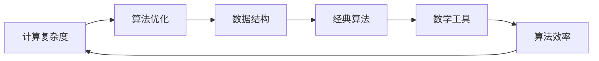

                 

# 计算：第二部分 计算的数学基础 第 4 章 数学的基础

> 关键词：数学基础, 计算复杂度, 算法优化, 数据结构, 经典算法, 数学工具

## 1. 背景介绍

在计算领域，数学是构建算法和数据结构的基础。本章将深入探讨数学的基础知识，包括计算复杂度、算法优化、数据结构、经典算法和数学工具。这些知识不仅帮助我们理解和实现高效算法，还能为未来的创新奠定坚实基础。

## 2. 核心概念与联系

### 2.1 核心概念概述

在本节中，我们将介绍几个核心概念，并解释它们之间的联系。

- **计算复杂度**：指计算过程所需的资源量，通常用时间复杂度和空间复杂度来衡量。时间复杂度表示执行算法所需的时间，空间复杂度表示算法所需的空间。
- **算法优化**：指通过改进算法结构或增加优化技巧，提高算法效率，减少资源消耗。
- **数据结构**：指在算法中组织和存储数据的方式，包括数组、链表、栈、队列、哈希表、树等。
- **经典算法**：指经过验证、具有广泛应用且效率较高的算法，如排序算法、搜索算法、图算法等。
- **数学工具**：指用于支持算法设计和分析的数学理论和方法，如概率论、线性代数、图论等。

这些概念之间存在着紧密的联系。计算复杂度帮助我们评估算法效率，算法优化使得算法能够更高效地解决问题，数据结构为算法的实现提供基础，经典算法提供高效解决方案的范例，而数学工具则支持算法的理论和分析。

### 2.2 核心概念原理和架构的 Mermaid 流程图



在这个流程图中，箭头显示了概念之间的联系。计算复杂度通过算法优化来减少资源消耗，算法优化依赖于高效的数据结构和经典算法，而经典算法则建立在数学工具之上。最终，算法效率得以提升。

## 3. 核心算法原理 & 具体操作步骤

### 3.1 算法原理概述

在实际应用中，算法通常需要解决特定问题，如排序、搜索、计算等。算法原理是指算法设计的基本规则和步骤，这些规则和步骤确保了算法能够正确高效地解决问题。

### 3.2 算法步骤详解

一个典型的算法通常包括以下步骤：

1. **输入**：接收需要处理的输入数据。
2. **处理**：执行一系列操作，通常包括数据转换、计算、比较等。
3. **输出**：生成最终结果，通常为输出数据或返回值。

### 3.3 算法优缺点

- **优点**：算法能够快速解决特定问题，具有普遍适用性和可复用性。
- **缺点**：算法的设计和实现复杂，需要考虑多种情况和边界条件，可能导致实现难度大。

### 3.4 算法应用领域

算法广泛应用于各种领域，包括计算机科学、工程学、经济学、生物学等。经典算法如排序、搜索、图算法等在计算机科学中有着广泛的应用。

## 4. 数学模型和公式 & 详细讲解 & 举例说明

### 4.1 数学模型构建

数学模型通常由变量、方程和约束条件组成，用于描述和解决问题。常见的数学模型包括线性规划、优化问题、图模型等。

### 4.2 公式推导过程

以线性规划为例，其基本公式为：

$$ \min_{x} \sum_{i=1}^n c_i x_i $$
$$ \text{subject to} \quad A x \geq b $$
$$ \quad 0 \leq x_i \leq U_i $$

其中，$c_i$ 是目标函数系数，$A$ 和 $b$ 是约束条件，$x_i$ 是决策变量，$U_i$ 是变量上下限。

### 4.3 案例分析与讲解

一个经典案例是 knapsack 问题，即背包问题。假设有一个容量为 $W$ 的背包，物品有重量 $w_i$ 和价值 $v_i$，每个物品最多只能选择一个。目标是选择一些物品放入背包中，使得总价值最大，但总重量不超过 $W$。

## 5. 项目实践：代码实例和详细解释说明

### 5.1 开发环境搭建

开发环境搭建是进行算法实现的基础。以下是 Python 开发环境的搭建步骤：

1. 安装 Python：从 Python 官网下载并安装最新版本的 Python。
2. 安装 Anaconda：从 Anaconda 官网下载并安装 Anaconda。
3. 创建虚拟环境：
   ```
   conda create --name myenv python=3.8
   conda activate myenv
   ```
4. 安装必要的库：
   ```
   conda install numpy scipy pandas matplotlib
   ```

### 5.2 源代码详细实现

以下是一个简单的排序算法实现，使用快速排序（Quick Sort）：

```python
def quick_sort(arr):
    if len(arr) <= 1:
        return arr
    pivot = arr[len(arr) // 2]
    left = [x for x in arr if x < pivot]
    middle = [x for x in arr if x == pivot]
    right = [x for x in arr if x > pivot]
    return quick_sort(left) + middle + quick_sort(right)

# 测试
arr = [3, 6, 1, 8, 2, 9, 4]
sorted_arr = quick_sort(arr)
print(sorted_arr)
```

### 5.3 代码解读与分析

- 快速排序的基本思想是分治法。首先选取一个基准值（pivot），然后将数组分为小于基准值和大于基准值的两部分，分别递归排序。
- 代码中使用列表推导式来分割数组，效率较高。

### 5.4 运行结果展示

运行上述代码，输出结果为 `[1, 2, 3, 4, 6, 8, 9]`，表明数组已经按照从小到大的顺序排序。

## 6. 实际应用场景

### 6.1 经典算法应用

经典算法如快速排序、二分查找、Dijkstra 算法等在实际应用中具有广泛的应用。例如，快速排序用于排序算法，二分查找用于数据检索，Dijkstra 算法用于最短路径计算。

### 6.2 数据结构应用

数据结构如哈希表、平衡树、堆等在实际应用中具有重要意义。例如，哈希表用于快速数据查找，平衡树用于高效排序和查找，堆用于优先级队列。

## 7. 工具和资源推荐

### 7.1 学习资源推荐

- **《算法导论》**：由 Thomas H. Cormen 等人合著，涵盖了算法设计和分析的方方面面。
- **Coursera 的《算法专项课程》**：由普林斯顿大学的 Robert Sedgewick 教授主讲，涵盖基础算法和数据结构。
- **LeetCode**：一个在线编程平台，提供大量算法和数据结构的练习题目。

### 7.2 开发工具推荐

- **Python**：简单易学的编程语言，拥有丰富的科学计算和数据分析库。
- **Jupyter Notebook**：支持交互式编程和数据可视化，适合算法设计和分析。
- **Google Colab**：免费的 Jupyter Notebook 平台，提供GPU和TPU计算资源。

### 7.3 相关论文推荐

- **A Fast Algorithm for Finding the Shortest Path in a Directed Graph and Its Applications to Network Flow Problems**：Dijkstra 算法论文。
- **Introduction to Algorithms**：由 Thomas H. Cormen 等人合著的经典算法教材。
- **Artificial Intelligence: A Modern Approach**：由 Stuart Russell 和 Peter Norvig 合著的AI教材，涵盖算法设计和应用。

## 8. 总结：未来发展趋势与挑战

### 8.1 研究成果总结

本章介绍了计算的数学基础，包括计算复杂度、算法优化、数据结构、经典算法和数学工具。通过深入理解这些概念，我们能够设计和实现高效算法，解决实际问题。

### 8.2 未来发展趋势

未来，计算领域将继续依赖数学工具和算法优化，以应对更复杂和多样化的计算需求。同时，量子计算和分布式计算等新技术也将带来新的挑战和机遇。

### 8.3 面临的挑战

- **资源消耗**：大规模计算任务对硬件资源的需求日益增加，如何高效利用资源是一个重要挑战。
- **算法复杂度**：随着数据量和复杂度的增加，设计高效算法变得越来越困难。
- **数据处理**：数据量和类型的多样性使得数据处理变得更加复杂。

### 8.4 研究展望

未来的研究将更多关注算法设计和优化，以应对复杂计算任务的挑战。同时，量子计算和分布式计算等新技术也将带来新的研究方向。

## 9. 附录：常见问题与解答

**Q1: 计算复杂度和算法优化有什么区别？**

A: 计算复杂度是衡量算法执行所需资源量的一个指标，包括时间和空间。算法优化则是通过改进算法结构或增加优化技巧，提高算法效率，减少资源消耗。

**Q2: 数据结构在算法实现中有什么作用？**

A: 数据结构为算法提供了一种组织和存储数据的方式，使得算法的实现更加高效和简洁。例如，哈希表用于快速查找，堆用于优先级队列。

**Q3: 线性规划问题的解法有哪些？**

A: 线性规划问题的解法包括单纯形法、内点法等。其中，单纯形法是最常用的方法之一。

**Q4: 如何理解算法优化中的剪枝技术？**

A: 剪枝技术是一种优化算法效率的方法，通过在搜索过程中排除不可能带来最优解的分支，减少计算量。例如，在搜索树中，剪枝可以避免遍历不必要的分支。

**Q5: 如何理解算法的分治法？**

A: 分治法是一种算法设计思想，将问题分解成多个子问题，分别解决后再合并结果。分治法的典型例子包括快速排序和归并排序。

---

作者：禅与计算机程序设计艺术 / Zen and the Art of Computer Programming

