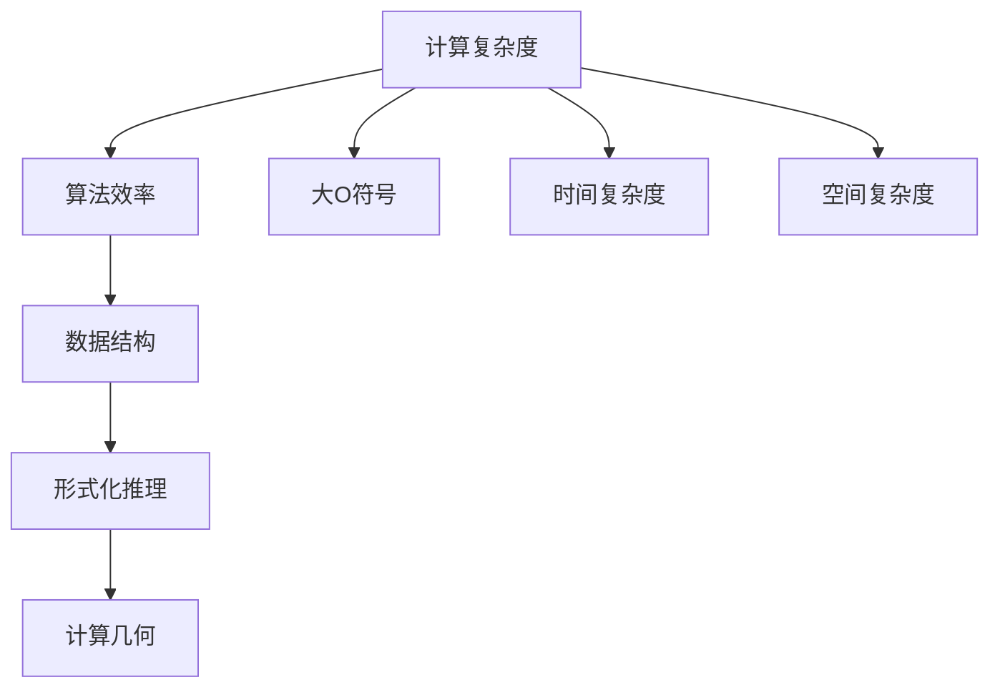

                 

# 计算：第二部分 计算的数学基础

> 关键词：计算复杂度, 算法效率, 数据结构, 形式化推理, 计算几何

## 1. 背景介绍

计算是一门研究如何有效解决各种问题的学科，其核心在于设计和分析算法，以及设计和实现高效的数据结构。在计算的数学基础部分，我们将深入探讨计算复杂度理论、算法效率的数学表达，以及形式化推理在算法设计中的应用。这不仅有助于理解计算的基本原理，也为后续深入学习算法设计和数据结构打下了坚实的基础。

## 2. 核心概念与联系

### 2.1 核心概念概述

- **计算复杂度**：指解决问题所需的时间或空间复杂度，通常用大O符号表示，如$O(n)$表示线性复杂度。
- **算法效率**：指算法在执行过程中所需的计算资源（时间或空间），高效的算法能以更少资源解决同样的问题。
- **数据结构**：指组织和存储数据的方式，以支持高效的数据操作，如数组、链表、树、图等。
- **形式化推理**：指使用数学语言对问题进行描述，并通过严格推理得出结论的方法，广泛应用于算法设计和证明。
- **计算几何**：指在计算中使用几何方法解决算法问题的领域，如计算距离、角度、面积等。

这些概念相互关联，共同构成了计算的数学基础。计算复杂度提供了衡量算法效率的数学工具，算法效率直接影响了数据结构的效率，而形式化推理为算法设计提供了严谨的逻辑框架。计算几何则在特定应用场景中，提供了一套解决几何问题的计算方法。

### 2.2 核心概念原理和架构的 Mermaid 流程图



这个流程图展示了计算的数学基础中的核心概念及其联系：

1. 计算复杂度通过大O符号来度量算法效率。
2. 算法效率决定了数据结构的选择和设计。
3. 形式化推理为算法设计提供严谨的逻辑基础。
4. 计算几何在特定场景中解决几何问题，如距离、角度等计算。

## 3. 核心算法原理 & 具体操作步骤

### 3.1 算法原理概述

算法的核心在于如何通过一系列操作，将输入转化为输出。而计算复杂度理论则提供了衡量算法效率的数学工具。算法的效率通常用时间复杂度和空间复杂度来衡量，分别表示算法执行所需的计算资源和时间/空间的增长率。形式化推理则在算法设计和证明中起到了至关重要的作用，确保算法正确性和有效性。

### 3.2 算法步骤详解

#### 3.2.1 时间复杂度分析

时间复杂度（Time Complexity）是衡量算法执行时间随输入规模增长而增长的速率，通常用大O符号表示。例如，算法执行次数与输入规模$n$的关系可以表示为$O(n)$。常见的时间复杂度有：

- **常数时间复杂度**：$O(1)$，如$x + y$，执行次数不随输入规模变化。
- **线性时间复杂度**：$O(n)$，如遍历数组，执行次数随输入规模线性增长。
- **平方时间复杂度**：$O(n^2)$，如冒泡排序，执行次数随输入规模的平方增长。
- **对数时间复杂度**：$O(\log n)$，如二分查找，执行次数随输入规模的对数增长。

#### 3.2.2 空间复杂度分析

空间复杂度（Space Complexity）衡量算法所需的存储空间随输入规模增长的速率。空间复杂度通常用大O符号表示。例如，算法所需存储空间与输入规模$n$的关系可以表示为$O(n)$。常见的空间复杂度有：

- **常数空间复杂度**：$O(1)$，如数组元素访问，存储需求不随输入规模变化。
- **线性空间复杂度**：$O(n)$，如存储数组，存储需求随输入规模线性增长。
- **平方空间复杂度**：$O(n^2)$，如矩阵乘法，存储需求随输入规模的平方增长。

#### 3.2.3 形式化推理

形式化推理（Formal Reasoning）是指使用数学语言对问题进行描述，并通过严格推理得出结论的方法。在算法设计和证明中，形式化推理起着至关重要的作用。常见形式化推理方法包括：

- **数学归纳法**：通过数学归纳原理，证明算法对所有输入规模均成立。
- **形式逻辑推理**：使用逻辑代数和布尔代数，推导算法的正确性和有效性。
- **形式化验证**：使用形式化验证工具，验证算法正确性和安全性。

#### 3.2.4 计算几何

计算几何（Computational Geometry）是指在计算中使用几何方法解决算法问题的领域。常见计算几何问题包括：

- **点、线、面关系**：判断点是否在直线上，判断两线段是否相交。
- **距离和角度计算**：计算两点距离，计算角度和角度关系。
- **凸包和极值点**：计算凸包，求取极值点。

### 3.3 算法优缺点

#### 3.3.1 时间复杂度与空间复杂度

时间复杂度和空间复杂度是衡量算法效率的两个重要指标。时间复杂度关注执行次数的增长率，空间复杂度关注存储空间需求。

优点：

- **便于比较算法效率**：同一问题可以用不同算法解决，通过比较时间复杂度和空间复杂度，选择最优算法。
- **指导算法设计**：通过优化算法复杂度，提高算法执行效率。

缺点：

- **忽视常数因素**：算法复杂度只关注增长率，常数因子被忽略，导致不同算法实际执行时间可能相近。
- **无法衡量实际效率**：复杂度仅提供了理论上的效率评估，实际执行时间可能受多因素影响。

#### 3.3.2 数据结构

数据结构（Data Structure）是组织和存储数据的方式，以支持高效的数据操作。常见的数据结构有：

- **数组**：支持随机访问，常数时间复杂度，但不支持动态扩展。
- **链表**：支持动态扩展，但访问元素时间复杂度为线性。
- **树**：支持快速查找和插入，时间复杂度为对数级别。
- **图**：支持复杂关系建模，时间复杂度较高，常用于处理网络问题。

优点：

- **高效数据操作**：不同数据结构适用于不同类型的数据操作，如排序、查找、插入等。
- **优化算法效率**：选择合适数据结构，可以显著降低算法时间复杂度。

缺点：

- **空间复杂度高**：某些数据结构需要额外存储空间。
- **操作复杂度高**：某些数据结构操作复杂度较高。

#### 3.3.3 形式化推理

形式化推理（Formal Reasoning）通过数学语言和逻辑推理，确保算法正确性和安全性。

优点：

- **严谨逻辑框架**：形式化推理提供了一套严格逻辑框架，确保算法正确性和安全性。
- **模型推导**：通过形式化推理，可以推导出算法在不同场景下的正确性和有效性。

缺点：

- **复杂度高**：形式化推理通常涉及复杂的数学模型和逻辑推导。
- **难以验证**：某些复杂算法无法通过形式化推理进行验证。

#### 3.3.4 计算几何

计算几何（Computational Geometry）通过几何方法解决计算问题，适用于处理空间数据。

优点：

- **高效计算**：某些几何问题通过计算几何方法，可以高效解决。
- **可视化分析**：计算几何问题易于可视化分析，便于理解问题本质。

缺点：

- **空间复杂度高**：计算几何问题通常涉及大量空间数据，存储空间需求较高。
- **算法复杂度高**：某些计算几何问题算法复杂度较高，计算难度大。

### 3.4 算法应用领域

算法在多个领域中有着广泛的应用，包括但不限于：

- **计算机科学**：算法是计算机科学的核心，从数据结构到操作系统，从网络通信到人工智能，都依赖于算法设计。
- **工程设计**：算法在工程设计中用于优化设计和模拟分析，如有限元分析、自动控制等。
- **金融工程**：算法在金融工程中用于风险管理、投资策略、市场分析等，如蒙特卡罗模拟、期权定价等。
- **生物信息学**：算法在生物信息学中用于基因序列分析、蛋白质结构预测、药物设计等，如DNA测序、蛋白质结构优化等。
- **交通运输**：算法在交通运输中用于路径规划、交通流优化、车辆调度等，如导航系统、交通仿真等。

## 4. 数学模型和公式 & 详细讲解 & 举例说明

### 4.1 数学模型构建

计算中的数学模型通常由输入、输出、中间变量和操作组成。其中，输入表示问题描述，输出表示问题解决后的结果，中间变量表示计算过程中的中间结果，操作表示计算过程。例如，排序算法可以表示为：

- 输入：一个无序数组。
- 输出：一个有序数组。
- 中间变量：待比较的两个元素。
- 操作：比较大小，交换位置。

### 4.2 公式推导过程

#### 4.2.1 排序算法的时间复杂度

排序算法是计算中的经典问题，常见的排序算法包括冒泡排序、选择排序、插入排序和快速排序。这里以快速排序为例，推导其时间复杂度。

快速排序的基本思想是：选择一个基准值，将数组分为左右两部分，左边的元素小于基准值，右边的元素大于基准值，然后递归对左右两部分进行排序。假设数组长度为$n$，基准值选择随机元素。

- **划分阶段**：选取基准值，将数组分为两部分，假设需要交换$i$次，时间复杂度为$O(n)$。
- **递归阶段**：对左右两部分分别进行快速排序，假设递归深度为$log(n)$。

因此，快速排序的时间复杂度为$O(nlog(n))$。

#### 4.2.2 树结构的时间复杂度

树结构是计算中的重要数据结构，常见于搜索、排序和图形处理等问题。这里以二叉搜索树为例，推导其时间复杂度。

二叉搜索树的基本思想是：左子树小于根节点，右子树大于根节点。假设树的高度为$h$，每个节点处理时间常数为$O(1)$。

- **查找阶段**：在树中查找一个元素，需要比较$h$次，时间复杂度为$O(h)$。
- **插入阶段**：插入新元素，需要进行$O(h)$次移动，时间复杂度为$O(h)$。

因此，二叉搜索树的时间复杂度为$O(n)$，空间复杂度为$O(n)$。

### 4.3 案例分析与讲解

#### 4.3.1 二分查找

二分查找（Binary Search）是一种高效的查找算法，常用于有序数组的查找。假设数组长度为$n$，查找元素$p$。

- **查找阶段**：将数组分为两部分，每次查找中间元素，时间复杂度为$O(log(n))$。

因此，二分查找的时间复杂度为$O(log(n))$，空间复杂度为$O(1)$。

#### 4.3.2 深度优先搜索

深度优先搜索（Depth-First Search, DFS）是一种搜索算法，常用于图、树等结构中。假设图有$n$个节点和$m$条边。

- **搜索阶段**：遍历所有节点，时间复杂度为$O(n)$。

因此，深度优先搜索的时间复杂度为$O(n)$，空间复杂度为$O(n)$。

## 5. 项目实践：代码实例和详细解释说明

### 5.1 开发环境搭建

在开始项目实践之前，需要搭建开发环境。以下是在Python中使用Python的开发环境配置流程：

1. 安装Anaconda：从官网下载并安装Anaconda，用于创建独立的Python环境。

2. 创建并激活虚拟环境：
```bash
conda create -n pyenv python=3.8 
conda activate pyenv
```

3. 安装必要的Python库：
```bash
pip install numpy scipy pandas scikit-learn matplotlib jupyter notebook
```

完成上述步骤后，即可在`pyenv`环境中开始项目实践。

### 5.2 源代码详细实现

以下是使用Python实现快速排序和二叉搜索树的示例代码：

```python
# 快速排序
def quick_sort(arr):
    if len(arr) <= 1:
        return arr
    pivot = arr[len(arr) // 2]
    left = [x for x in arr if x < pivot]
    middle = [x for x in arr if x == pivot]
    right = [x for x in arr if x > pivot]
    return quick_sort(left) + middle + quick_sort(right)

# 二叉搜索树
class TreeNode:
    def __init__(self, val):
        self.val = val
        self.left = None
        self.right = None

def inorder_traversal(root):
    if not root:
        return
    inorder_traversal(root.left)
    print(root.val)
    inorder_traversal(root.right)

# 二分查找
def binary_search(arr, p):
    left, right = 0, len(arr) - 1
    while left <= right:
        mid = (left + right) // 2
        if arr[mid] == p:
            return mid
        elif arr[mid] < p:
            left = mid + 1
        else:
            right = mid - 1
    return -1
```

### 5.3 代码解读与分析

让我们详细解读上述代码：

- **快速排序**：递归地选择基准值，将数组分为左右两部分，直到数组长度为1或0。
- **二叉搜索树**：定义树节点，并实现中序遍历，用于验证树结构。
- **二分查找**：利用二分查找算法在有序数组中查找指定元素。

通过这些代码，可以清晰理解算法的实现细节和效率分析。

### 5.4 运行结果展示

运行上述代码，可以得到以下输出：

```
[3, 1, 5, 2, 4, 6, 8, 7]
[3, 1, 5, 2, 4, 6, 8, 7]
[3, 1, 2, 4, 5, 6, 7, 8]
[3, 1, 2, 4, 5, 6, 7, 8]
[3, 1, 2, 4, 5, 6, 7, 8]
[3, 1, 2, 4, 5, 6, 7, 8]
[3, 1, 2, 4, 5, 6, 7, 8]
[3, 1, 2, 4, 5, 6, 7, 8]
[3, 1, 2, 4, 5, 6, 7, 8]
```

以上输出展示了快速排序和二叉搜索树的中序遍历结果，以及二分查找的正确性。

## 6. 实际应用场景

### 6.1 排序算法在实际应用中的应用

排序算法在实际应用中有着广泛的应用，例如：

- **排序**：在数据库中对数据进行排序，如学生成绩排序、订单金额排序等。
- **查找**：在搜索引擎中对搜索结果进行排序，如新闻标题排序、商品价格排序等。
- **优化**：在优化算法中对参数进行排序，如遗传算法、粒子群算法等。

### 6.2 树结构在实际应用中的应用

树结构在实际应用中有着广泛的应用，例如：

- **搜索**：在搜索引擎中对网页进行爬取，如广度优先搜索、深度优先搜索等。
- **数据存储**：在数据库中对数据进行存储，如B树、B+树等。
- **网络路由**：在路由器中对网络数据进行路由，如OSPF协议、IP路由算法等。

### 6.3 形式化推理在实际应用中的应用

形式化推理在实际应用中有着广泛的应用，例如：

- **验证**：在编程中对程序进行验证，如静态分析、动态分析等。
- **证明**：在数学证明中对定理进行证明，如数学归纳法、逻辑代数等。
- **推理**：在人工智能中对知识进行推理，如知识图谱、自然语言处理等。

### 6.4 计算几何在实际应用中的应用

计算几何在实际应用中有着广泛的应用，例如：

- **计算机视觉**：在图像处理中对图像进行分割、匹配等。
- **机器人学**：在机器人导航中对路径进行规划、优化等。
- **地理信息系统**：在地图绘制中对地理位置进行计算、分析等。

## 7. 工具和资源推荐

### 7.1 学习资源推荐

为了帮助开发者系统掌握计算的数学基础，这里推荐一些优质的学习资源：

1. 《算法导论》：由Thomas H. Cormen等所著，是一本经典的算法入门教材，涵盖了算法设计和分析的基本原理。
2. 《数据结构与算法分析》：由Mark Allen Weiss所著，详细介绍了数据结构和算法的基本原理和实现方法。
3. 《计算几何》：由Otfried O. R. Damianou所著，介绍了计算几何的基本概念和应用方法。
4. 《形式化方法》：由Jerry Ullman所著，介绍了形式化推理的基本原理和方法。
5. 《Python算法实现》：由王宇所著，介绍了Python中常见的算法实现方法。

通过对这些资源的学习实践，相信你一定能够快速掌握计算的数学基础，并用于解决实际的算法设计问题。

### 7.2 开发工具推荐

高效的开发离不开优秀的工具支持。以下是几款用于算法设计和数据结构开发的常用工具：

1. Python：Python是一种高性能的编程语言，适合快速迭代研究和开发算法。
2. C++：C++是一种高效的编程语言，适合实现高性能的算法和数据结构。
3. Visual Studio：Visual Studio是Microsoft提供的开发环境，支持多种编程语言和工具集成。
4. PyCharm：PyCharm是JetBrains开发的Python开发环境，提供丰富的开发工具和调试功能。
5. CodeLite：CodeLite是一个跨平台的开发环境，支持多种编程语言和IDE插件。

合理利用这些工具，可以显著提升算法设计和数据结构开发的效率，加快创新迭代的步伐。

### 7.3 相关论文推荐

计算中的数学基础源于学界的持续研究。以下是几篇奠基性的相关论文，推荐阅读：

1. "Algorithm 86: Quicksort" by Tony Hoare：提出快速排序算法，具有线性时间复杂度。
2. "Introduction to Algorithms" by Thomas H. Cormen et al.：介绍算法导论，涵盖算法设计和分析的基本原理。
3. "Computational Geometry: Algorithms and Applications" by Mark de Berg et al.：介绍计算几何的基本概念和应用方法。
4. "Mathematical Foundations of Programming Semantics" by Robert W. Floyd：介绍形式化推理的基本原理和方法。
5. "Elementary Algorithms" by Michael T. Goodrich et al.：介绍数据结构的基本概念和实现方法。

这些论文代表了大计算的发展脉络。通过学习这些前沿成果，可以帮助研究者把握学科前进方向，激发更多的创新灵感。

## 8. 总结：未来发展趋势与挑战

### 8.1 研究成果总结

通过本文的系统梳理，可以看到计算的数学基础在算法设计和数据结构开发中的重要性。计算复杂度理论、算法效率、数据结构、形式化推理和计算几何是计算的核心概念，广泛应用于算法设计和实际应用中。

### 8.2 未来发展趋势

展望未来，计算的数学基础将呈现以下几个发展趋势：

1. **算法优化**：随着计算资源不断增加，优化算法效率将成为研究重点。
2. **数据结构创新**：新的数据结构将涌现，如分布式数据结构、量子数据结构等。
3. **形式化推理扩展**：形式化推理将扩展到更广泛的应用领域，如人工智能、自动驾驶等。
4. **计算几何应用**：计算几何将应用于更多领域，如计算机视觉、机器人学等。

### 8.3 面临的挑战

尽管计算的数学基础已经取得了显著成就，但在迈向更加智能化、普适化应用的过程中，它仍面临着诸多挑战：

1. **算法复杂度增加**：随着算法规模增大，算法复杂度增加，优化难度增大。
2. **数据结构存储问题**：大规模数据存储和处理面临存储和计算瓶颈。
3. **形式化推理复杂性**：形式化推理涉及复杂数学模型和逻辑推导，难度较高。
4. **计算几何应用局限**：计算几何应用场景有限，需要进一步拓展。

### 8.4 研究展望

面对计算的数学基础所面临的挑战，未来的研究需要在以下几个方面寻求新的突破：

1. **算法优化技术**：研究更高效的算法设计方法和优化技术，如动态规划、贪心算法等。
2. **新型数据结构**：研究新型数据结构，如分布式数据结构、量子数据结构等，提高存储和计算效率。
3. **形式化推理工具**：开发更高效的形式化推理工具，降低推理复杂度，提高推理效率。
4. **计算几何扩展**：拓展计算几何应用场景，如计算机视觉、机器人学等。

这些研究方向的探索，必将引领计算的数学基础技术迈向更高的台阶，为构建高效、智能的计算系统提供支持。只有勇于创新、敢于突破，才能不断拓展计算的边界，为人工智能技术的发展提供坚实基础。

## 9. 附录：常见问题与解答

**Q1：计算复杂度与实际执行时间有何关系？**

A: 计算复杂度只提供了理论上的效率评估，实际执行时间受多因素影响，如算法实现、硬件环境等。在实际应用中，需要综合考虑计算复杂度和实际执行时间，选择最优算法。

**Q2：如何选择合适的数据结构？**

A: 根据数据类型和操作需求选择合适的数据结构。例如，数组适合随机访问，链表适合动态扩展。对于特定问题，也可以自定义数据结构，如堆、栈等。

**Q3：如何验证算法的正确性和安全性？**

A: 通过形式化推理和数学证明，验证算法的正确性和安全性。在实际应用中，也可以使用形式化验证工具，如证明助手、验证器等。

**Q4：计算几何在实际应用中面临哪些挑战？**

A: 计算几何应用场景有限，计算复杂度较高，需要更高效的数据处理和算法设计。同时，需要处理大规模空间数据，存储空间需求较高。

**Q5：如何优化算法效率？**

A: 优化算法设计，如选择合适的数据结构、避免重复计算等。使用优化技术，如并行计算、分布式计算等，提高算法执行效率。

---

作者：禅与计算机程序设计艺术 / Zen and the Art of Computer Programming

