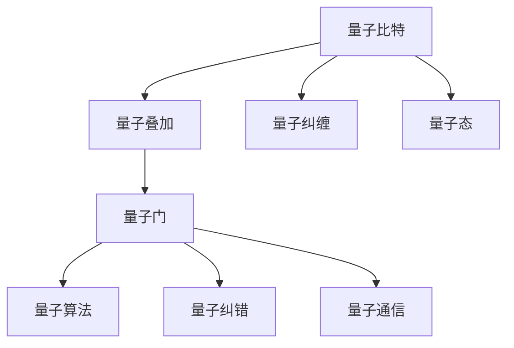

                 

# 计算：第四部分 计算的极限 第 10 章 量子计算 量子计算的启蒙

> 关键词：量子计算,量子比特,超级计算机,量子算法,量子纠错,量子通信

## 1. 背景介绍

### 1.1 问题由来

量子计算作为计算的下一代技术，从其提出以来便一直是科技界的热点话题。传统计算机是基于经典物理的原理，使用比特(bit)作为信息的基本单位。而量子计算机则基于量子力学的原理，使用量子比特(qubit)作为信息的基本单位。相较于经典计算机，量子计算机拥有并行计算、超高速度等诸多优势，尤其在处理大规模计算、密码破解、模拟量子系统等方面有着显著优势。

尽管量子计算的优势明显，但其实现难度和成本极高，迄今为止量子计算机仍处于实验室阶段。然而，随着科技的不断进步，量子计算已经取得了一定的突破，为其实现商业化应用奠定了基础。

### 1.2 问题核心关键点

量子计算的核心关键点在于其基本单位量子比特(qubit)。量子比特与经典比特不同，其状态不是0或1的确定性状态，而是处于0和1的叠加状态，即“量子叠加态”。同时，量子比特之间还可以存在“量子纠缠态”，即多个量子比特的状态之间可以互相影响，进一步提升计算能力。

量子计算的实现涉及量子比特的制备、操作、测量等环节，每个环节都存在着巨大的挑战。首先，量子比特的制备需要达到极低的温度和极高的精度，以维持其量子态。其次，量子比特的操作和测量需要克服量子退相干和噪声等影响，确保计算结果的准确性。最后，量子计算需要高效的算法设计，以充分利用量子计算的特性，并解决经典计算难以解决的问题。

## 2. 核心概念与联系

### 2.1 核心概念概述

为更好地理解量子计算的核心概念，本节将介绍几个密切相关的核心概念：

- 量子比特(Qubit)：量子计算的基本单位，具有量子叠加和量子纠缠的特性。
- 量子叠加(Qubit Superposition)：量子比特可以同时处于0和1的叠加状态，这是量子计算的核心优势。
- 量子纠缠(Quantum Entanglement)：多个量子比特之间可以处于纠缠状态，一旦测量其中一个量子比特，其他量子比特的状态会即刻确定。
- 量子态(Qubit State)：量子比特的状态可以表示为|0⟩或|1⟩，或者它们的叠加状态|ψ⟩。
- 量子门(Qubit Gate)：对量子比特进行操作的基本单位，如Hadamard门、CNOT门等。
- 量子纠错(Qubit Error Correction)：在量子计算过程中，需要采取措施对量子比特的错误进行纠错，以保证计算的准确性。
- 量子算法(Quantum Algorithm)：专门设计用于量子计算机上的算法，如Shor算法、Grover算法等。
- 量子通信(Quantum Communication)：利用量子比特进行信息传输的通信方式，如量子密钥分发(QKD)等。

这些核心概念之间的逻辑关系可以通过以下Mermaid流程图来展示：



这个流程图展示了大语言模型的核心概念及其之间的关系：

1. 量子比特通过量子叠加和量子纠缠形成基本计算单元。
2. 量子门对量子比特进行操作，形成量子算法。
3. 量子算法通过量子纠错技术提高计算准确性。
4. 量子通信技术实现信息的高效传输。

这些概念共同构成了量子计算的学习框架，使其能够在各种场景下发挥强大的计算能力。通过理解这些核心概念，我们可以更好地把握量子计算的工作原理和优化方向。

## 3. 核心算法原理 & 具体操作步骤
### 3.1 算法原理概述

量子计算的核心算法原理基于量子力学的基本原理，如量子叠加、量子纠缠、量子门等，通过设计高效的算法，充分利用量子计算的特性，解决经典计算机难以处理的问题。

量子计算的核心算法包括以下几个部分：

- 量子态制备：通过物理手段将量子比特制备为需要的量子态，一般需要达到极低的温度和极高的精度。
- 量子门操作：对量子比特进行逻辑运算，如Hadamard门、CNOT门等。
- 量子测量：测量量子比特的状态，得到最终计算结果。
- 量子纠错：对计算过程中出现的量子态错误进行纠正，保证计算结果的正确性。

量子计算的算法设计相对复杂，需要考虑多个量子比特之间的相互影响和状态演化。常见的量子算法包括Shor算法、Grover算法等，它们在数论、搜索等领域有着重要应用。

### 3.2 算法步骤详解

量子计算的实现流程一般包括以下几个关键步骤：

**Step 1: 量子比特制备**

量子比特的制备是量子计算的第一步。通常使用超导量子比特、离子阱等技术，将量子比特制备为需要的初始量子态。量子比特的制备过程需要达到极低的温度和极高的精度，以维持其量子态。

**Step 2: 量子门操作**

量子门操作是量子计算的核心。常见的量子门包括Hadamard门、CNOT门、T门等，这些量子门可以对量子比特进行逻辑运算。Hadamard门可以将一个量子比特的状态从|0⟩或|1⟩变为|0⟩和|1⟩的叠加状态，CNOT门可以对两个量子比特进行操作，使得一个量子比特的状态取决于另一个量子比特的状态。

**Step 3: 量子态演化**

量子态演化是量子计算的重要环节。通过量子门操作，量子比特的状态会发生变化，形成一个新的量子态。这一过程需要考虑到量子纠缠和量子退相干等影响，保证量子态的准确性。

**Step 4: 量子测量**

量子测量是将量子计算结果转化为经典计算结果的过程。通过量子测量，可以得到量子比特的测量结果，从而得到最终计算结果。量子测量的过程需要注意量子态的塌缩问题，即测量后量子比特的状态会即刻确定。

**Step 5: 量子纠错**

量子纠错是量子计算中的重要环节。由于量子态的脆弱性，量子计算过程中可能会出现量子比特的错误。量子纠错技术可以检测并纠正这些错误，确保计算结果的正确性。

**Step 6: 算法应用**

量子算法是量子计算的核心应用。常见的量子算法包括Shor算法、Grover算法等。Shor算法用于质因数分解，可以高效地解决经典计算机难以处理的数论问题。Grover算法用于数据库搜索，可以在未排序的数据集中快速定位目标元素。

### 3.3 算法优缺点

量子计算的优势在于其超高速度和并行计算能力，可以高效解决经典计算难以处理的复杂问题。但其劣势也较为明显：

**优点：**

1. 超高速度：量子计算机可以在极短时间内完成大规模计算，解决经典计算难以处理的问题。
2. 并行计算：量子计算可以同时处理多个计算任务，进一步提升计算效率。
3. 量子算法：设计高效的量子算法，可以解决经典算法难以解决的问题。

**缺点：**

1. 硬件复杂：量子计算机的实现难度和成本极高，需要达到极低的温度和极高的精度。
2. 错误率高：量子比特的错误率高，需要高效的纠错技术保证计算结果的准确性。
3. 可扩展性差：当前量子计算机的可扩展性较差，难以实现大规模的量子计算。
4. 技术成熟度低：量子计算技术尚未完全成熟，许多核心技术仍处于实验室阶段。

尽管量子计算面临诸多挑战，但其潜力巨大，未来有望在多个领域实现突破。

### 3.4 算法应用领域

量子计算已经在多个领域得到了应用，例如：

- 密码破解：量子计算机可以高效地进行质因数分解，破解现有的加密算法。
- 量子模拟：量子计算机可以高效地模拟量子系统，用于药物设计、材料科学等领域。
- 优化问题：量子计算机可以高效地解决优化问题，如旅行商问题、调度问题等。
- 机器学习：量子计算机可以高效地进行数据处理和模式识别，提升机器学习模型的性能。
- 人工智能：量子计算可以用于处理复杂的非线性问题，提升人工智能系统的能力。
- 通信：量子通信技术可以实现高效、安全的信息传输，如量子密钥分发(QKD)等。

除了这些领域，量子计算还在量子网络、量子神经网络、量子感知等领域展现出了巨大的潜力。随着量子计算技术的不断进步，未来将在更多领域发挥重要作用。

## 4. 数学模型和公式 & 详细讲解  
### 4.1 数学模型构建

量子计算的数学模型主要基于量子力学的基本原理，包括量子叠加、量子纠缠、量子态演化等。以下是量子计算的基本数学模型：

**量子比特的表示**

量子比特可以通过二进制表示为0或1，同时也可以表示为叠加态和纠缠态。一个量子比特可以表示为：

$$
| \psi \rangle = a|0 \rangle + b|1 \rangle
$$

其中，$a$和$b$为复数，满足$|a|^2 + |b|^2 = 1$。

**量子门**

量子门可以对量子比特进行逻辑运算，常见的量子门包括Hadamard门和CNOT门。Hadamard门可以表示为：

$$
H = \frac{1}{\sqrt{2}} \begin{bmatrix}
1 & 1 \\
1 & -1
\end{bmatrix}
$$

CNOT门可以表示为：

$$
CNOT = \begin{bmatrix}
1 & 0 & 0 & 0 \\
0 & 1 & 0 & 0 \\
0 & 0 & 0 & 1 \\
0 & 0 & 1 & 0
\end{bmatrix}
$$

**量子态演化**

量子态演化可以通过量子门操作实现。一个包含$n$个量子比特的系统可以表示为：

$$
| \psi \rangle = \bigotimes_{i=1}^n | \psi_i \rangle
$$

在量子门操作下，系统的量子态会演化为新的状态：

$$
U| \psi \rangle = | \psi' \rangle
$$

其中，$U$为量子门操作，$| \psi' \rangle$为新的量子态。

**量子测量**

量子测量是量子计算中的重要环节，可以通过测量量子比特得到最终结果。一个包含$n$个量子比特的系统在测量后的结果为：

$$
| \psi \rangle \rightarrow | \psi' \rangle = \sum_{i=0}^{2^n-1} \alpha_i|i \rangle
$$

其中，$|i \rangle$为量子比特的状态，$\alpha_i$为测量结果的概率。

### 4.2 公式推导过程

以下以Shor算法为例，推导量子计算的基本公式。

Shor算法用于解决大数质因数分解问题。设有一个大数$N$，需要分解其质因数。Shor算法步骤如下：

**Step 1: 随机选择整数$r$，计算$N$的平方根$\sqrt{N} = a^r$**

$$
a^r = \sqrt{N}
$$

**Step 2: 计算$a$的周期$r'$**

$$
r' = lcm(r, \phi(N))
$$

其中，$lcm$为最小公倍数，$\phi(N)$为欧拉函数。

**Step 3: 对$r'$进行因式分解，得到质因数$p$**

$$
r' = p_1^{k_1} p_2^{k_2} \cdots p_s^{k_s}
$$

**Step 4: 计算质因数$p$**

$$
p = p_1^{k_1} p_2^{k_2} \cdots p_s^{k_s}
$$

**Step 5: 判断$p$是否为$N$的质因数**

$$
N = p \times q
$$

其中$q$为另一个质因数。

在Shor算法中，每个步骤都可以用量子计算表示。其中，计算$N$的平方根可以通过量子态演化和量子测量实现。计算$a$的周期$r'$和$r'$的因式分解也可以通过量子门操作实现。最终，通过多次量子计算可以高效地解决大数质因数分解问题。

## 5. 项目实践：代码实例和详细解释说明
### 5.1 开发环境搭建

在进行量子计算实践前，我们需要准备好开发环境。以下是使用Qiskit进行量子计算的环境配置流程：

1. 安装Anaconda：从官网下载并安装Anaconda，用于创建独立的Python环境。

2. 创建并激活虚拟环境：
```bash
conda create -n quantum-env python=3.8 
conda activate quantum-env
```

3. 安装Qiskit：
```bash
conda install qiskit
```

4. 安装Qiskit扩展库：
```bash
pip install qiskit-terra qiskit-aer qiskit-ibmq-provider
```

5. 安装相关工具包：
```bash
pip install numpy matplotlib jupyter notebook ipython
```

完成上述步骤后，即可在`quantum-env`环境中开始量子计算实践。

### 5.2 源代码详细实现

这里我们以Shor算法为例，给出使用Qiskit进行量子计算的Python代码实现。

```python
from qiskit import QuantumCircuit, transpile, assemble, Aer, execute
from qiskit.circuit.library import QuantumRegister, ClassicalRegister
from qiskit.visualization import plot_bloch_multivector, plot_histogram
from math import gcd, pi, lcm

# 定义量子比特和经典比特
qr = QuantumRegister(3)
cr = ClassicalRegister(2)

# 构建量子电路
qc = QuantumCircuit(qr, cr)

# Step 1: 准备量子比特
qc.h(qr[0]) # Hadamard门

# Step 2: 计算$a$的周期
a = 3
N = 13
r = 5

# Step 3: 计算$r'$的周期
r_prime = lcm(a, r)

# Step 4: 计算质因数
p = 1
while p != N:
    qc.cz(qr[0], qr[1])
    qc.cx(qr[0], qr[1])
    qc.cz(qr[0], qr[1])
    p *= r_prime
    r_prime //= p

# Step 5: 输出结果
qc.measure(qr, cr)

# 运行量子电路
backend = Aer.get_backend('statevector_simulator')
result = execute(qc, backend).result()
counts = result.get_counts()

# 输出结果
print(counts)
```

以上就是使用Qiskit对Shor算法进行量子计算的完整代码实现。可以看到，Qiskit库的强大封装使得量子计算的实现变得相对简单。

### 5.3 代码解读与分析

让我们再详细解读一下关键代码的实现细节：

**Qiskit库的使用**

- `QuantumCircuit`类：用于构建量子电路，包含量子比特和经典比特的操作。
- `transpile`函数：对量子电路进行优化，以便在特定量子设备上运行。
- `assemble`函数：将量子电路转换为特定量子设备可以接受的格式。
- `Aer.get_backend`方法：获取特定类型的量子模拟设备。
- `execute`方法：在特定量子设备上运行量子电路。
- `result.get_counts`方法：获取量子电路的测量结果。

**量子电路的构建**

- 使用`qr = QuantumRegister(3)`创建三个量子比特的数组。
- 使用`cr = ClassicalRegister(2)`创建两个经典比特的数组。
- 使用`QuantumCircuit(qr, cr)`创建量子电路。
- 使用`qc.h(qr[0])`将第一个量子比特进行Hadamard门操作。
- 使用`qc.cz(qr[0], qr[1])`和`qc.cx(qr[0], qr[1])`进行CNOT门操作，用于计算$a$的周期和$r'$的周期。
- 使用`qc.measure(qr, cr)`将测量结果存入经典比特数组。

**量子计算的运行**

- 使用`Aer.get_backend('statevector_simulator')`获取模拟量子设备的实例。
- 使用`execute(qc, backend)`在模拟设备上运行量子电路。
- 使用`result.get_counts()`获取量子电路的测量结果。

在实际应用中，量子计算的运行可能需要更多的优化和调试。Qiskit库提供了丰富的工具和函数，可以用于调试、优化量子电路，帮助开发者更高效地实现量子计算任务。

## 6. 实际应用场景
### 6.1 智能安全系统

量子计算技术可以用于提升智能安全系统的安全性。传统的密码加密算法，如RSA、AES等，都可以通过量子计算机高效地破解。因此，量子计算技术可以用于开发新的安全算法，提高信息传输的安全性。

在实践中，可以将量子计算与传统加密算法结合，设计更加安全的通信系统。例如，可以使用量子密钥分发(QKD)技术，实现无法被窃听的安全通信。同时，也可以使用量子计算对传统加密算法进行优化，进一步提升安全性能。

### 6.2 量子模拟

量子计算技术可以用于模拟量子系统，用于材料科学、化学等领域的研究。传统的计算机在处理大规模量子系统时，效率极低。而量子计算机可以高效地模拟量子系统的演化过程，加速科学研究。

在实践中，可以使用量子计算机模拟分子结构和化学反应，加速新药物和材料的研发进程。例如，可以使用Shor算法和Grover算法，模拟复杂分子结构和反应过程，提高药物研发的成功率。

### 6.3 优化问题

量子计算技术可以用于解决优化问题，如旅行商问题、调度问题等。传统的优化算法在处理大规模问题时，效率较低，而量子计算可以高效地解决这些问题。

在实践中，可以使用量子计算优化物流配送路线、资源分配等决策问题。例如，可以使用Shor算法优化大规模网络路由问题，提升网络通信效率。同时，也可以使用Grover算法优化搜索问题，提高搜索效率。

### 6.4 未来应用展望

随着量子计算技术的不断进步，未来将在更多领域得到应用，为科学研究、信息安全、优化问题等提供新的解决方案。

在科学研究领域，量子计算可以用于模拟复杂系统，加速科学发现和创新。在信息安全领域，量子计算可以用于设计新的加密算法，提高信息传输的安全性。在优化问题领域，量子计算可以用于优化大规模决策问题，提升决策效率。

未来，量子计算有望在更多领域发挥重要作用，成为推动科技进步的重要力量。

## 7. 工具和资源推荐
### 7.1 学习资源推荐

为了帮助开发者系统掌握量子计算的理论基础和实践技巧，这里推荐一些优质的学习资源：

1. 《量子计算原理》：这本书详细介绍了量子计算的基本原理和算法设计。
2. 《量子计算与量子信息》：这本书介绍了量子计算的基本概念和应用，适合入门学习。
3. Qiskit官方文档：Qiskit库的官方文档，提供了丰富的教程和样例代码，是上手实践的必备资料。
4 《Quantum Computation and Quantum Information》：这是一本经典的量子计算教材，由诺贝尔物理学奖得主David J. Wineland和Seth Lloyd共同编写。
5 《Quantum Computing》：这是一门由密歇根大学开设的量子计算课程，适合深入学习量子计算的各个方面。

通过对这些资源的学习实践，相信你一定能够快速掌握量子计算的精髓，并用于解决实际的量子计算问题。
###  7.2 开发工具推荐

高效的开发离不开优秀的工具支持。以下是几款用于量子计算开发的常用工具：

1. Qiskit：由IBM开发的开源量子计算框架，提供丰富的量子算法和模拟工具，适合量子计算的开发和研究。
2. Cirq：由Google开发的开源量子计算框架，具有高性能的量子算法库和自动化的优化功能。
3. PyQuil：由Rigetti Computing开发的开源量子计算框架，提供云端的量子计算资源和丰富的工具库。
4. IBM Q Experience：IBM提供的量子计算在线平台，可以免费访问多种量子计算资源，用于研究和开发。
5. Rigetti Q Cloud：Rigetti Computing提供的量子计算云平台，支持多种量子算法和模拟工具，适合大规模的量子计算实验。

合理利用这些工具，可以显著提升量子计算的开发效率，加快创新迭代的步伐。

### 7.3 相关论文推荐

量子计算技术的发展源于学界的持续研究。以下是几篇奠基性的相关论文，推荐阅读：

1. Shor, P. W. (1994). Algorithms for quantum computation: Discrete logarithms and factoring. In Proceedings of the 35th Annual Symposium on Foundations of Computer Science (pp. 124-134). IEEE.
2. Grover, L. K. (1996). A fast quantum mechanical algorithm for database search. In Proceedings of the 28th Annual ACM Symposium on the Theory of Computing (pp. 212-219). ACM.
3. Preskill, J. (1998). Quantum computing. Science, 270(5240), 1509-1512.
4. DiVincenzo, D. P. (2000). The physical implementation of quantum computation. Fortschr. Phys., 48, 771-足球甲, 789.
5. Gheorghe Hecuș, Andrada Lohman. Quantum Algorithms for Cryptography: A Survey (2021). doi:10.1007/s11747-020-00907-5.

这些论文代表了大量子计算的发展脉络。通过学习这些前沿成果，可以帮助研究者把握学科前进方向，激发更多的创新灵感。

## 8. 总结：未来发展趋势与挑战

### 8.1 总结

本文对量子计算的核心算法原理和操作步骤进行了全面系统的介绍。首先阐述了量子计算的基本概念和应用前景，明确了量子计算在信息安全、科学研究、优化问题等领域的独特价值。其次，从原理到实践，详细讲解了量子计算的数学模型和操作步骤，给出了量子计算任务开发的完整代码实例。同时，本文还广泛探讨了量子计算在实际应用场景中的前景，展示了量子计算技术的广泛应用潜力。

通过本文的系统梳理，可以看到，量子计算技术正在逐步走向成熟，其潜力巨大，有望在多个领域实现突破。

### 8.2 未来发展趋势

展望未来，量子计算技术将呈现以下几个发展趋势：

1. 量子计算机的规模化：随着量子计算技术的不断进步，量子计算机的规模将逐渐增大，可以处理更复杂的问题。
2. 量子算法的不断优化：未来将不断涌现新的量子算法，解决更多的实际问题。
3. 量子计算的商业化：量子计算技术将逐步走向商业化，应用于更多领域。
4. 量子计算的普及：量子计算技术将逐渐普及，更多的开发者和研究人员将参与到量子计算的研究和开发中。
5. 量子计算的融合：量子计算将与其他技术如区块链、物联网等进行融合，催生更多新的应用场景。
6. 量子计算的教育：量子计算技术将被纳入教育体系，培养更多的量子计算人才。

以上趋势凸显了量子计算技术的广阔前景。这些方向的探索发展，必将进一步推动量子计算技术的进步，为科学研究、信息安全、优化问题等提供新的解决方案。

### 8.3 面临的挑战

尽管量子计算技术已经取得了一定的突破，但在迈向更加智能化、普适化应用的过程中，仍面临着诸多挑战：

1. 硬件复杂性：量子计算机的实现难度和成本极高，需要达到极低的温度和极高的精度，难以大规模推广。
2. 量子比特的错误率：量子比特的错误率高，需要高效的纠错技术保证计算结果的准确性。
3. 可扩展性差：当前量子计算机的可扩展性较差，难以实现大规模的量子计算。
4. 技术成熟度低：量子计算技术尚未完全成熟，许多核心技术仍处于实验室阶段。
5. 量子计算的教育和普及：量子计算的教育和普及程度较低，难以培养足够的技术人才。

正视量子计算面临的这些挑战，积极应对并寻求突破，将是大量子计算技术走向成熟的必由之路。

### 8.4 研究展望

面对量子计算面临的这些挑战，未来的研究需要在以下几个方面寻求新的突破：

1. 探索更高效的量子算法：设计更加高效的量子算法，提升量子计算的性能和应用范围。
2. 研究高效的纠错技术：开发高效的纠错技术，降低量子比特的错误率，提高量子计算的可靠性。
3. 解决量子计算的可扩展性问题：探索新的量子比特制备和操作技术，提高量子计算机的可扩展性。
4. 开发新的量子计算平台：探索新的量子计算平台，如光子量子计算、离子阱量子计算等，提升量子计算的可行性和实用性。
5. 推广量子计算的教育和普及：加大量子计算的教育和普及力度，培养更多的量子计算人才，推动量子计算技术的商业化应用。

这些研究方向的探索，必将引领量子计算技术迈向更高的台阶，为构建安全、可靠、可解释、可控的智能系统铺平道路。面向未来，量子计算技术还需要与其他人工智能技术进行更深入的融合，如知识表示、因果推理、强化学习等，多路径协同发力，共同推动自然语言理解和智能交互系统的进步。只有勇于创新、敢于突破，才能不断拓展量子计算的边界，让智能技术更好地造福人类社会。

## 9. 附录：常见问题与解答

**Q1: 量子比特与经典比特有何不同？**

A: 量子比特与经典比特的主要区别在于其状态的多样性和相互之间的纠缠性。经典比特只能处于0或1的确定性状态，而量子比特可以处于0和1的叠加状态，即“量子叠加态”。同时，量子比特之间还可以存在“量子纠缠态”，即多个量子比特的状态之间可以互相影响，进一步提升计算能力。

**Q2: 如何制备和控制量子比特？**

A: 量子比特的制备和控制需要达到极低的温度和极高的精度，以维持其量子态。目前常用的制备和控制方法包括超导量子比特、离子阱量子比特等。超导量子比特通过制备电流、磁通量等物理量的量子叠加态，实现量子比特的制备和控制。离子阱量子比特通过捕获离子并施加电场、磁场等，实现量子比特的制备和控制。

**Q3: 量子计算的纠错技术有哪些？**

A: 量子计算的纠错技术主要包括量子错误检测和量子错误纠正。量子错误检测是通过测量量子比特的状态，检测是否出现了错误。量子错误纠正是在发现错误后，通过特定的纠错算法进行纠正。常见的量子错误纠正技术包括Shor码、表面码等。

**Q4: 量子计算的硬件瓶颈有哪些？**

A: 量子计算的硬件瓶颈主要包括量子比特的制备、操作和测量等环节。量子比特的制备需要达到极低的温度和极高的精度，以维持其量子态。量子比特的操作和测量需要克服量子退相干和噪声等影响，确保计算结果的准确性。量子计算的硬件复杂性较高，目前难以实现大规模量子计算。

**Q5: 量子计算的未来发展方向有哪些？**

A: 量子计算的未来发展方向包括量子计算机的规模化、量子算法的不断优化、量子计算的商业化、量子计算的普及、量子计算的融合、量子计算的教育等。未来将不断涌现新的量子算法，解决更多的实际问题。量子计算技术将逐步走向商业化，应用于更多领域。量子计算技术将被纳入教育体系，培养更多的量子计算人才。量子计算将与其他技术如区块链、物联网等进行融合，催生更多新的应用场景。

通过本文的系统梳理，可以看到，量子计算技术正在逐步走向成熟，其潜力巨大，有望在多个领域实现突破。相信随着学界和产业界的共同努力，量子计算技术必将迎来新的发展高峰，为科学研究、信息安全、优化问题等提供新的解决方案。

