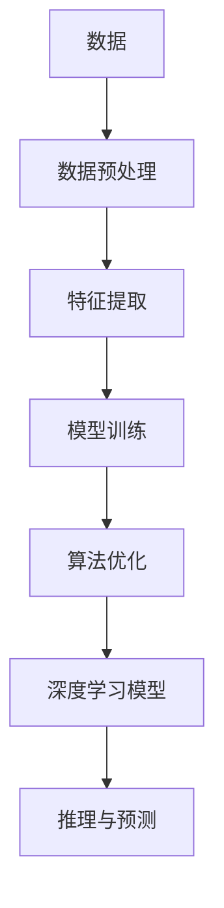

                 

# 计算：第四部分 计算的极限 第 12 章 机器能思考吗 聪明的乌鸦

> 关键词：机器学习,深度学习,智能算法,计算能力,算法优化

## 1. 背景介绍

### 1.1 问题由来
机器能否思考？这一问题自古以来便困扰着哲学家、科学家和工程师。随着时间的推移，计算机科学和技术的发展逐渐将这一问题引向了一个新的领域：机器学习与深度学习。随着大数据和算力的不断提升，机器在处理和理解复杂问题上的能力日益增强，使得我们不得不重新思考机器是否能真正具备人类般的“思考”能力。

### 1.2 问题核心关键点
本文聚焦于机器学习和深度学习如何模拟人类的认知过程，特别是如何通过算法和模型来处理和理解语言和视觉数据。核心关键点在于：
1. 机器学习算法如何通过数据和模型来理解世界的结构。
2. 深度学习如何通过神经网络来模拟人类的感知和认知过程。
3. 计算能力在机器学习和深度学习中的作用和限制。
4. 算法优化在提升机器学习性能中的重要性。

### 1.3 问题研究意义
研究机器能否思考，不仅对于人工智能领域有重要意义，对于理解计算机科学的本质和未来方向也具有深远影响。机器学习算法和深度学习模型的能力不断提升，使得我们能够通过机器来模拟和扩展人类智能的边界。同时，这也引发了对于机器道德、安全性和伦理问题的深刻思考，为我们构建更加负责任的人工智能系统提供了重要参考。

## 2. 核心概念与联系

### 2.1 核心概念概述

在探讨机器能否思考的问题时，需要理解以下核心概念：

- **机器学习**（Machine Learning）：一种使机器通过数据和算法来提高性能的技术，特别是在处理复杂数据和做出预测方面。
- **深度学习**（Deep Learning）：一种特殊的机器学习方法，通过多层神经网络来模拟和增强人类对数据的理解和处理能力。
- **算法优化**（Algorithm Optimization）：通过优化算法来提高机器学习模型的性能，包括加速模型训练、提高模型精度和降低计算资源消耗。
- **计算能力**（Computational Capability）：机器处理数据和执行计算的能力，直接影响了深度学习模型的性能和应用范围。
- **数据预处理**（Data Preprocessing）：在模型训练前对数据进行清洗、归一化和特征提取，以提升模型的泛化能力和预测准确性。

这些概念之间存在紧密的联系，共同构成了机器学习和深度学习的基础框架。深度学习模型通过多层神经网络来模拟人类对复杂数据的感知和理解，机器学习算法则通过数据和模型来训练和优化这些网络，计算能力决定了模型能够处理的规模和复杂度，而算法优化则进一步提高了模型的性能和效率。

### 2.2 核心概念原理和架构的 Mermaid 流程图



这个流程图展示了机器学习的基本流程：从数据预处理开始，到特征提取、模型训练、算法优化，最终通过深度学习模型进行推理和预测。

## 3. 核心算法原理 & 具体操作步骤

### 3.1 算法原理概述

深度学习模型的核心在于多层神经网络，这些网络通过反向传播算法来优化模型参数，从而提高对输入数据的理解和预测能力。深度学习模型通过以下步骤来实现这一过程：

1. **数据预处理**：将原始数据转化为模型可以接受的格式，包括归一化、标准化、特征提取等。
2. **模型构建**：根据任务需求选择合适的神经网络结构，如卷积神经网络（CNN）、循环神经网络（RNN）、长短时记忆网络（LSTM）等。
3. **模型训练**：通过反向传播算法，使用训练数据集来优化模型参数，使模型能够更准确地预测新数据。
4. **算法优化**：通过优化算法来加速模型训练过程，提高模型精度和效率。

### 3.2 算法步骤详解

以一个简单的卷积神经网络（CNN）为例，详细讲解深度学习模型的训练步骤：

**Step 1: 数据预处理**
- 将原始图像数据进行归一化和标准化处理，转化为模型可以接受的输入格式。
- 使用图像增强技术，如旋转、缩放、裁剪等，扩充训练集样本多样性。

**Step 2: 模型构建**
- 设计多层卷积和池化层，提取图像特征。
- 添加全连接层，将特征映射到输出类别。
- 定义损失函数，如交叉熵损失，衡量模型预测与真实标签之间的差异。

**Step 3: 模型训练**
- 将训练数据分为批次，前向传播计算预测结果和损失函数。
- 反向传播计算模型参数梯度，使用优化算法（如Adam、SGD等）更新参数。
- 周期性在验证集上评估模型性能，根据性能调整学习率。

**Step 4: 算法优化**
- 引入正则化技术，如L2正则、Dropout等，避免过拟合。
- 使用模型并行和数据并行技术，加速模型训练过程。
- 应用梯度剪枝、量化等技术，减少模型参数和计算资源消耗。

### 3.3 算法优缺点

深度学习模型具有以下优点：
1. 处理复杂数据能力更强，可以自动提取和学习数据中的高层次特征。
2. 泛化能力强，通过大规模数据集训练，模型可以适应不同的数据分布和变化。
3. 适用于多种任务，如图像识别、自然语言处理、语音识别等。

但同时，深度学习模型也存在一些缺点：
1. 计算资源消耗大，需要大量的计算能力和存储资源。
2. 训练时间长，特别是在大规模数据集和复杂模型结构下，训练过程耗时较长。
3. 模型解释性差，深度学习模型的内部工作机制难以理解和解释。

### 3.4 算法应用领域

深度学习模型已经广泛应用于多个领域，包括但不限于：

- **计算机视觉**：如图像识别、物体检测、人脸识别等。
- **自然语言处理**：如机器翻译、情感分析、文本生成等。
- **语音识别**：如语音转文本、语音命令识别等。
- **推荐系统**：如商品推荐、内容推荐等。
- **游戏AI**：如自动对战、游戏策略优化等。
- **医学影像分析**：如疾病诊断、图像分割等。

## 4. 数学模型和公式 & 详细讲解 & 举例说明

### 4.1 数学模型构建

深度学习模型的数学模型构建主要基于神经网络，通过多层非线性变换来逼近复杂函数。以下以一个简单的全连接神经网络为例，介绍其数学模型构建过程：

设输入数据为 $\mathbf{x} \in \mathbb{R}^n$，输出为 $\mathbf{y} \in \mathbb{R}^m$，网络结构如图：

```
层1 (n, h)
层2 (h, h)
层3 (h, m)
```

其中，每层由若干个神经元组成，层1和层3为全连接层，层2为激活函数层。

### 4.2 公式推导过程

以多层感知机（MLP）为例，推导其前向传播和反向传播公式。设层 $l$ 的神经元数为 $n_l$，激活函数为 $f(\mathbf{z}) = \sigma(\mathbf{z})$，则前向传播公式为：

$$
\mathbf{z}^{(l)} = \mathbf{W}^{(l)} \mathbf{z}^{(l-1)} + \mathbf{b}^{(l)}
$$

$$
\mathbf{a}^{(l)} = f(\mathbf{z}^{(l)})
$$

其中，$\mathbf{W}^{(l)}$ 和 $\mathbf{b}^{(l)}$ 分别为层 $l$ 的权重和偏置项，$\mathbf{z}^{(l)}$ 和 $\mathbf{a}^{(l)}$ 分别为层 $l$ 的输入和输出。

反向传播公式为：

$$
\frac{\partial \mathcal{L}}{\partial \mathbf{W}^{(l)}} = \frac{\partial \mathcal{L}}{\partial \mathbf{z}^{(l)}} \frac{\partial \mathbf{z}^{(l)}}{\partial \mathbf{W}^{(l)}} = \frac{\partial \mathcal{L}}{\partial \mathbf{z}^{(l)}} \mathbf{a}^{(l-1)} \mathbf{z}^{(l-1)}{^\top}
$$

$$
\frac{\partial \mathcal{L}}{\partial \mathbf{b}^{(l)}} = \frac{\partial \mathcal{L}}{\partial \mathbf{z}^{(l)}} \frac{\partial \mathbf{z}^{(l)}}{\partial \mathbf{b}^{(l)}} = \frac{\partial \mathcal{L}}{\partial \mathbf{z}^{(l)}} 1_{n_l}^\top
$$

其中，$\mathcal{L}$ 为损失函数，$1_{n_l}$ 为全1列向量。

### 4.3 案例分析与讲解

以一个简单的二分类问题为例，使用感知机（Perceptron）模型进行分类。设训练集为 $\{(\mathbf{x}_i, y_i)\}_{i=1}^N$，其中 $\mathbf{x}_i \in \mathbb{R}^n$，$y_i \in \{0, 1\}$，模型参数为 $\mathbf{W} \in \mathbb{R}^n$ 和 $\mathbf{b} \in \mathbb{R}$。

目标是最小化交叉熵损失函数 $\mathcal{L} = -\frac{1}{N} \sum_{i=1}^N y_i \log \sigma(\mathbf{W} \mathbf{x}_i + b)$。

使用梯度下降算法进行参数更新，步长为 $\eta$，则参数更新公式为：

$$
\mathbf{W} \leftarrow \mathbf{W} - \eta \frac{\partial \mathcal{L}}{\partial \mathbf{W}} = \mathbf{W} - \eta \frac{1}{N} \sum_{i=1}^N y_i (\sigma(\mathbf{W} \mathbf{x}_i + b) - y_i) \mathbf{x}_i
$$

$$
b \leftarrow b - \eta \frac{\partial \mathcal{L}}{\partial b} = b - \eta \frac{1}{N} \sum_{i=1}^N y_i (\sigma(\mathbf{W} \mathbf{x}_i + b) - y_i)
$$

其中，$\sigma(\cdot)$ 为 sigmoid 函数。

## 5. 项目实践：代码实例和详细解释说明

### 5.1 开发环境搭建

使用Python和TensorFlow搭建深度学习项目环境：

1. 安装Anaconda：
```bash
conda install anaconda
```

2. 创建虚拟环境：
```bash
conda create -n tf-env python=3.8
conda activate tf-env
```

3. 安装TensorFlow：
```bash
conda install tensorflow
```

4. 安装相关库：
```bash
pip install numpy matplotlib sklearn
```

5. 使用TensorBoard进行可视化：
```bash
pip install tensorboard
```

### 5.2 源代码详细实现

以下是一个简单的卷积神经网络（CNN）在TensorFlow中的实现：

```python
import tensorflow as tf

# 定义模型
def conv_net(x, n_classes):
    # 第一层卷积和池化
    conv1 = tf.layers.conv2d(inputs=x, filters=32, kernel_size=[5, 5], padding='same', activation=tf.nn.relu)
    pool1 = tf.layers.max_pooling2d(inputs=conv1, pool_size=[2, 2], strides=2)

    # 第二层卷积和池化
    conv2 = tf.layers.conv2d(inputs=pool1, filters=64, kernel_size=[5, 5], padding='same', activation=tf.nn.relu)
    pool2 = tf.layers.max_pooling2d(inputs=conv2, pool_size=[2, 2], strides=2)

    # 全连接层
    fc1 = tf.layers.dense(inputs=tf.reshape(pool2, [-1, 7*7*64]), units=1024, activation=tf.nn.relu)
    dropout = tf.layers.dropout(inputs=fc1, rate=0.4)

    # 输出层
    logits = tf.layers.dense(inputs=dropout, units=n_classes)
    softmax = tf.nn.softmax(logits)

    return softmax

# 加载数据集
mnist = tf.keras.datasets.mnist
(x_train, y_train), (x_test, y_test) = mnist.load_data()
x_train, x_test = x_train / 255.0, x_test / 255.0

# 构建模型
model = tf.keras.models.Sequential([
    tf.keras.layers.Conv2D(32, (5, 5), activation='relu', input_shape=(28, 28, 1)),
    tf.keras.layers.MaxPooling2D((2, 2)),
    tf.keras.layers.Conv2D(64, (5, 5), activation='relu'),
    tf.keras.layers.MaxPooling2D((2, 2)),
    tf.keras.layers.Flatten(),
    tf.keras.layers.Dense(1024, activation='relu'),
    tf.keras.layers.Dropout(0.4),
    tf.keras.layers.Dense(10, activation='softmax')
])

# 编译模型
model.compile(optimizer='adam', loss='categorical_crossentropy', metrics=['accuracy'])

# 训练模型
model.fit(x_train, y_train, epochs=10, validation_data=(x_test, y_test))
```

### 5.3 代码解读与分析

以上代码实现了使用TensorFlow搭建一个简单的卷积神经网络，用于手写数字分类。具体解释如下：

1. `conv_net`函数定义了卷积层、池化层、全连接层和输出层的实现。
2. 使用`tf.layers`模块创建卷积层和全连接层，并设置激活函数和池化操作。
3. 加载MNIST数据集，并对输入数据进行归一化处理。
4. 使用`Sequential`模型顺序构建卷积神经网络，并通过`compile`方法指定优化器、损失函数和评估指标。
5. 使用`fit`方法进行模型训练，并在测试集上进行验证。

## 6. 实际应用场景

### 6.1 图像分类

在图像分类任务中，深度学习模型可以处理和识别大量不同类别的图像。例如，使用卷积神经网络（CNN）对医学影像进行分类，可以自动识别肿瘤、病变等医学特征，辅助医生进行诊断。

### 6.2 自然语言处理

在自然语言处理（NLP）领域，深度学习模型可以处理和理解自然语言文本。例如，使用循环神经网络（RNN）进行文本分类，可以自动识别新闻、评论等文本的情感倾向。

### 6.3 语音识别

在语音识别任务中，深度学习模型可以处理和识别语音信号，将其转化为文本。例如，使用卷积神经网络（CNN）进行语音识别，可以将口述命令转化为可执行的指令。

### 6.4 未来应用展望

随着深度学习模型的不断发展，未来的应用将更加广泛和深入：

1. **自动驾驶**：使用深度学习模型进行环境感知和决策制定，实现自动驾驶汽车。
2. **智能推荐**：使用深度学习模型进行商品推荐和内容推荐，提高用户体验。
3. **医疗诊断**：使用深度学习模型进行疾病诊断和影像分析，提高医疗服务效率。
4. **金融预测**：使用深度学习模型进行市场分析和风险预测，辅助金融决策。
5. **智能家居**：使用深度学习模型进行环境感知和用户交互，实现智能家居系统。

## 7. 工具和资源推荐

### 7.1 学习资源推荐

1. 《深度学习》（Deep Learning）：Ian Goodfellow、Yoshua Bengio、Aaron Courville合著的经典书籍，深入浅出地介绍了深度学习的基础知识和算法。
2. 《TensorFlow官方文档》：TensorFlow官方文档，提供了丰富的API参考和示例代码，是学习TensorFlow的必备资料。
3. 《动手学深度学习》：李沐、阿斯顿·张、刘强等专家合著的书籍，提供了大量实践案例和代码实现。
4. 《CS231n：卷积神经网络》：斯坦福大学开设的计算机视觉课程，提供了大量课程讲义和实践项目。

### 7.2 开发工具推荐

1. TensorFlow：Google开发的深度学习框架，支持多种编程语言和平台。
2. PyTorch：Facebook开发的深度学习框架，具有动态图和灵活的计算图设计。
3. Jupyter Notebook：一个开源的交互式编程环境，支持多语言和多种开发工具。
4. Keras：基于TensorFlow和Theano的高级神经网络API，提供了简单易用的接口。
5. Scikit-learn：一个Python科学计算库，提供了大量的机器学习算法和工具。

### 7.3 相关论文推荐

1. "ImageNet Classification with Deep Convolutional Neural Networks"（AlexNet论文）：Hinton等人的经典论文，展示了深度学习在图像分类任务中的巨大潜力。
2. "Convolutional Neural Networks for Visual Recognition"（VGG论文）：Simonyan和Zisserman的论文，提出了VGG网络架构，极大地提升了图像分类的准确性。
3. "Google's Inception Architecture for Computer Vision"（Inception论文）：Google的论文，提出Inception网络架构，提升了模型的深度和精度。
4. "ResNet: Deep Residual Learning for Image Recognition"（ResNet论文）：He等人的论文，提出残差网络架构，解决了深度学习中的梯度消失问题。
5. "Attention is All You Need"（Transformer论文）：Vaswani等人的论文，提出了Transformer网络架构，开创了NLP领域的预训练大模型时代。

## 8. 总结：未来发展趋势与挑战

### 8.1 总结

本文对深度学习模型在模拟人类思考和认知过程中的应用进行了详细探讨。深度学习模型通过多层神经网络模拟人类感知和理解复杂数据的能力，已经在计算机视觉、自然语言处理、语音识别等多个领域取得了显著进展。深度学习模型的未来发展趋势在于不断提升其处理复杂数据的能力和适应新任务的能力，通过优化算法和模型架构来提高性能和效率。

### 8.2 未来发展趋势

1. **多模态学习**：未来的深度学习模型将更多地考虑多模态数据的融合，如视觉、听觉、语言等多模态信息的协同建模，提升模型的综合能力。
2. **强化学习**：结合强化学习，使深度学习模型具备自主学习和适应环境的能力，实现更加智能的决策制定。
3. **迁移学习**：通过迁移学习，深度学习模型可以在不同任务之间进行知识迁移，提升模型的泛化能力和适应性。
4. **低计算资源优化**：通过模型压缩和量化等技术，减少深度学习模型的计算资源消耗，提高模型的部署效率和可扩展性。
5. **算法优化**：开发更加高效的优化算法，如自适应学习率、梯度加速等，进一步提升模型训练速度和精度。

### 8.3 面临的挑战

尽管深度学习模型在许多方面取得了显著进展，但仍然面临着诸多挑战：

1. **计算资源限制**：深度学习模型需要大量的计算资源，这在一定程度上限制了其在大规模数据集上的应用。
2. **数据质量和多样性**：深度学习模型需要大量高质量和多样化的数据进行训练，对于小规模数据集，模型的泛化能力可能不足。
3. **模型可解释性**：深度学习模型通常是"黑盒"模型，难以解释其内部工作机制和决策逻辑，这对于某些高风险应用（如医疗、金融）尤为重要。
4. **伦理和社会影响**：深度学习模型的广泛应用可能会带来伦理和社会问题，如隐私泄露、偏见歧视等。

### 8.4 研究展望

未来，需要在以下几个方面进一步探索和研究：

1. **伦理和安全**：加强对深度学习模型的伦理和安全研究，确保其决策过程透明、公正、可解释，避免潜在的社会负面影响。
2. **多模态融合**：探索多模态数据的融合方法，提升深度学习模型对复杂场景的理解和处理能力。
3. **迁移学习能力**：通过迁移学习，使深度学习模型具备跨领域适应能力，提升其在不同任务上的表现。
4. **计算资源优化**：开发更高效的计算资源优化技术，如模型并行、量化加速等，提高深度学习模型的部署效率和可扩展性。
5. **算法优化**：研究更加高效的优化算法，提升深度学习模型的训练速度和精度。

总之，深度学习模型在模拟人类思考和认知过程中展现出巨大潜力，但其发展和应用仍面临诸多挑战。通过不断的技术创新和理论探索，深度学习模型有望在更多领域发挥作用，推动人工智能技术的进一步发展。

## 9. 附录：常见问题与解答

**Q1: 深度学习模型和机器学习模型有什么区别？**

A: 深度学习模型是机器学习模型的一种，特别适用于处理复杂数据和高维度特征。它通过多层神经网络来模拟和增强人类对数据的感知和理解，而传统的机器学习模型通常使用线性模型或简单模型。

**Q2: 深度学习模型的训练时间是否取决于数据量？**

A: 是的，深度学习模型的训练时间通常与数据量成正比。数据量越大，模型需要更多的计算资源和时间来训练，但模型的泛化能力和预测准确性也会随之提高。

**Q3: 深度学习模型是否可以通过迁移学习来提升性能？**

A: 是的，深度学习模型可以通过迁移学习来提升性能。迁移学习可以将一个领域学到的知识迁移到另一个领域，从而在新的任务上取得更好的效果。

**Q4: 深度学习模型是否可以用于图像分类任务？**

A: 是的，深度学习模型在图像分类任务中已经取得了显著进展。卷积神经网络（CNN）是最常用的深度学习模型之一，用于图像分类、物体检测等任务。

**Q5: 深度学习模型是否可以通过优化算法来提升性能？**

A: 是的，深度学习模型可以通过优化算法来提升性能。优化算法可以帮助模型在训练过程中更快地收敛，提高模型的精度和泛化能力。

总之，深度学习模型在模拟人类思考和认知过程中展现出巨大潜力，但其发展和应用仍面临诸多挑战。通过不断的技术创新和理论探索，深度学习模型有望在更多领域发挥作用，推动人工智能技术的进一步发展。

---

作者：禅与计算机程序设计艺术 / Zen and the Art of Computer Programming

