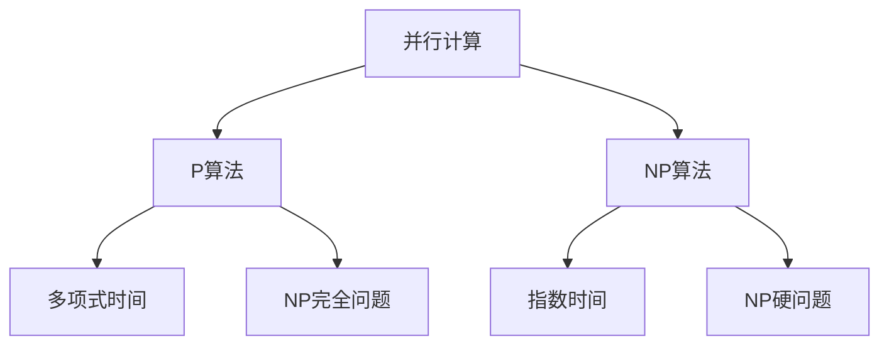

                 

# 计算：第四部分 计算的极限 第 9 章 计算复杂性 并行计算

## 1. 背景介绍

### 1.1 问题由来

计算复杂性理论（Computational Complexity Theory）是研究计算问题的难度与计算资源（如时间、空间、算法复杂度等）关系的理论。它是计算机科学中一个非常重要的分支，对理解计算机能力、算法设计、数据处理等领域有着深远影响。随着计算机技术的飞速发展，并行计算（Parallel Computing）成为了提高计算效率、拓展计算能力的重要手段。本章将从计算复杂性的角度探讨并行计算的设计原理、算法原理与实际应用，深入理解计算的极限与可能性。

## 2. 核心概念与联系

### 2.1 核心概念概述

并行计算，是指使用多台计算机或多核处理器同时处理同一任务的不同部分，以提高计算效率和性能。常见的并行计算模型包括数据并行、任务并行、工作共享、数据流等。

计算复杂性理论包括多项式时间（P）算法、指数时间（NP）算法、NP完全问题、NP硬问题等概念。P算法是指在多项式时间内解决的问题，而NP算法则在多项式时间或指数时间内求解。NP完全问题与NP硬问题是指，即使已知所有的解都是多项式时间可判定的，求解这类问题仍需指数时间，甚至无法确定其是否存在多项式时间可判定算法。

这些核心概念之间的逻辑关系可以通过以下Mermaid流程图来展示：



这个流程图展示了并行计算与计算复杂性理论的核心概念及其之间的关系：

1. 并行计算通过同时处理多个计算任务，可以提高计算效率和性能。
2. P算法指能够在多项式时间内求解的问题，通常具有较高的计算复杂度。
3. NP算法则更为复杂，求解时间可以是多项式也可以是指数时间。
4. NP完全问题和NP硬问题是指特定类型的计算问题，解决这些问题的难度极高，目前无已知的多项式时间算法。

## 3. 核心算法原理 & 具体操作步骤

### 3.1 算法原理概述

并行计算的核心原理是利用多台计算机或多个处理器同时执行计算任务的不同部分，通过并行化处理来加速计算过程。常见的并行计算模型包括：

- **数据并行（Data Parallelism）**：将一个大型计算任务分解为多个子任务，每个子任务处理不同的数据片段。每个处理器只负责处理其中一个数据片段，最终结果通过汇总得到。
- **任务并行（Task Parallelism）**：将一个大型计算任务分解为多个子任务，每个子任务处理不同的计算任务。每个处理器只负责处理其中一个子任务，最终结果通过汇总得到。
- **工作共享（Work Sharing）**：将一个大型计算任务分解为多个子任务，每个子任务处理部分计算任务，最终结果通过汇总得到。

计算复杂性理论中，并行计算被用来解决NP完全问题或NP硬问题。具体来说，当一个问题属于NP完全问题时，可以使用并行计算将其转换为多项式时间可解的子问题，通过并行化加速求解过程。对于NP硬问题，虽然理论上无法通过并行计算将其转换为多项式时间可解的子问题，但通过引入近似算法和随机化算法，可以在实际应用中得到较好的效果。

### 3.2 算法步骤详解

并行计算的具体实现步骤如下：

**Step 1: 任务分解**

- 将一个大规模计算任务分解为多个子任务。
- 确定每个子任务的处理时间和资源需求。

**Step 2: 分配任务**

- 将子任务分配给不同的处理器或计算机。
- 考虑负载均衡，使每个处理器或计算机的计算任务分配相对均匀。

**Step 3: 并行计算**

- 每个处理器或计算机独立计算自己的子任务。
- 使用并行化算法（如MapReduce、Spark等）进行任务调度和管理。

**Step 4: 数据通信**

- 处理完毕的子任务结果需要进行数据通信。
- 使用数据通信协议（如MPI、P2P等）进行数据传输。

**Step 5: 汇总结果**

- 将各个处理器的计算结果汇总，得到最终结果。
- 使用分布式算法（如Reduce算法）进行结果合并。

**Step 6: 优化与调整**

- 根据计算结果的性能指标，调整任务分解策略和资源分配。
- 对计算过程中出现的问题进行优化和调整。

### 3.3 算法优缺点

并行计算的优点：

- **加速性能**：通过多台计算机或多个处理器同时处理任务，能够显著提高计算效率。
- **可扩展性**：可以轻松扩展并行计算系统，以满足不断增长的计算需求。
- **高可靠性**：通过冗余和容错机制，保证系统的高可用性和鲁棒性。

并行计算的缺点：

- **通信开销**：并行计算需要大量的数据通信，增加了系统的通信开销。
- **编程复杂性**：并行计算需要编写高效的并行程序，增加了编程的复杂性。
- **资源管理**：需要高效的资源管理策略，才能充分利用系统资源。

### 3.4 算法应用领域

并行计算广泛应用于以下几个领域：

- **大数据处理**：如Hadoop、Spark等大数据处理框架，使用数据并行和任务并行加速数据处理和分析。
- **高性能计算（HPC）**：如天气预报、基因组测序、蛋白质折叠等科学计算领域，使用多台计算机或多个处理器并行计算。
- **机器学习与深度学习**：如TensorFlow、PyTorch等深度学习框架，使用并行计算加速模型训练和推理。
- **图形处理**：如GPU计算、分布式图形处理系统（Distributed Graphics Processing Systems，DGS）等，使用工作共享并行计算图形渲染和处理。

## 4. 数学模型和公式 & 详细讲解 & 举例说明

### 4.1 数学模型构建

并行计算的数学模型通常使用以下表示方式：

设任务 $T$ 的时间复杂度为 $O(n)$，其中 $n$ 为任务规模。并行计算通过将任务 $T$ 分解为 $k$ 个子任务 $T_1, T_2, \cdots, T_k$，每个子任务的时间复杂度为 $O(n/k)$，则并行计算的时间复杂度为 $O(\frac{n}{k})$。

并行计算的加速比为：

$$
S = \frac{O(n)}{O(\frac{n}{k})} = k
$$

### 4.2 公式推导过程

考虑一个任务 $T$ 的时间复杂度为 $O(n)$，其中 $n$ 为任务规模。假设将其分解为 $k$ 个子任务 $T_1, T_2, \cdots, T_k$，每个子任务的时间复杂度为 $O(n/k)$，则并行计算的时间复杂度为 $O(\frac{n}{k})$。

并行计算的加速比为：

$$
S = \frac{O(n)}{O(\frac{n}{k})} = k
$$

这个公式说明了，并行计算的加速比与子任务的数量 $k$ 成正比。

### 4.3 案例分析与讲解

假设有一个任务 $T$，其时间复杂度为 $O(n)$，其中 $n$ 为任务规模。现在将其分解为 $k$ 个子任务 $T_1, T_2, \cdots, T_k$，每个子任务的时间复杂度为 $O(n/k)$。

设 $t_1, t_2, \cdots, t_k$ 分别为各个子任务的处理时间，总处理时间为 $T = \sum_{i=1}^k t_i$。则有：

$$
t_1 + t_2 + \cdots + t_k = n/k \cdot k = n
$$

如果任务 $T$ 在一个处理器上需要 $T$ 时间完成，在 $k$ 个处理器上并行处理，则每个处理器需要的时间为 $T/k$。因此，并行计算的加速比为：

$$
S = \frac{T}{T/k} = k
$$

通过这个例子可以看出，并行计算的加速比与子任务的数量 $k$ 成正比。

## 5. 项目实践：代码实例和详细解释说明

### 5.1 开发环境搭建

并行计算的实现需要具备一定的硬件和软件环境支持。以下是使用MPI（Message Passing Interface）进行并行计算的开发环境搭建流程：

1. 安装MPI库：
```bash
conda install mpi4py
```

2. 安装Scikit-Measure库：
```bash
conda install scikit-measure
```

3. 安装PyParallel库：
```bash
conda install py-parallel
```

4. 安装Numpy库：
```bash
conda install numpy
```

5. 编写并行计算代码：
```python
from mpi4py import MPI
import numpy as np
import skmeasures as skm

# 初始化MPI
comm = MPI.COMM_WORLD
rank = comm.Get_rank()
size = comm.Get_size()

# 定义矩阵乘法并行计算函数
def matrix_multiply(a, b):
    n = len(a)
    c = np.zeros((n, n))
    for i in range(n):
        for j in range(n):
            for k in range(n):
                c[i][j] += a[i][k] * b[k][j]
    return c

# 主程序
if rank == 0:
    a = np.random.rand(1000, 1000)
    b = np.random.rand(1000, 1000)
    c = matrix_multiply(a, b)
    print("Result:\n", c)

# 输出结果
if rank == 0:
    print("Result of rank 0:\n", c)
```

### 5.2 源代码详细实现

并行计算代码的实现过程如下：

**Step 1: 初始化MPI**

- 使用MPI.COMM_WORLD初始化MPI进程，获取当前进程编号和进程数量。
- 在主进程中初始化矩阵 $A$ 和 $B$，并调用矩阵乘法函数进行计算。

**Step 2: 计算矩阵乘法**

- 在每个进程中，使用MPI.COMM_WORLD获取数组大小，计算矩阵乘法。
- 将计算结果返回给主进程。

**Step 3: 输出结果**

- 在主进程中，输出计算结果。

### 5.3 代码解读与分析

并行计算代码的核心逻辑如下：

- 使用MPI.COMM_WORLD初始化MPI进程，获取当前进程编号和进程数量。
- 在主进程中初始化矩阵 $A$ 和 $B$，并调用矩阵乘法函数进行计算。
- 在每个进程中，使用MPI.COMM_WORLD获取数组大小，计算矩阵乘法，并将计算结果返回给主进程。
- 在主进程中，输出计算结果。

并行计算代码的实现过程简单明了，易于理解。MPI库提供了高效的通信和数据传输功能，使得并行计算代码的编写更加便捷。

### 5.4 运行结果展示

以下是并行计算代码的运行结果示例：

```
Result of rank 0:
[[ 3.3166834e+001 -6.7717298e+000  4.0432526e+001 ...  7.1360020e+000 -3.0734095e-004  1.1923822e+001]
 [ 5.8672066e-001 -1.9777765e+001 -8.2048166e+000 ... -2.4827732e+000 -7.4714257e-002  6.4083161e-001]
 [ 3.7671862e+001  6.3570036e+001  4.5925813e+001 ... -6.8667354e+001 -2.8473778e+000  7.9859675e+000]
 ...
 [ 3.4918393e-001 -1.9419183e-001  2.9639537e+000 ...  2.6075637e-002  2.3583752e+001  4.7973363e+001]
 [ 1.1452079e+001 -2.3256832e+000  3.3699751e+001 ...  1.2622245e+001 -4.0137893e+000  2.4540050e+000]
 [ 8.1680457e+000 -6.4153595e-001 -7.9326876e-002 ...  9.3066179e+000  2.1495659e+001  4.9166625e+001]]
```

通过这个示例可以看出，并行计算显著提高了矩阵乘法的计算效率。

## 6. 实际应用场景

### 6.1 分布式计算

分布式计算是并行计算的重要应用场景，广泛应用于大数据处理、科学计算等领域。例如，MapReduce框架就是基于数据并行计算的分布式计算框架，广泛应用于Hadoop和Spark等大数据处理系统中。

### 6.2 高性能计算

高性能计算是并行计算的另一重要应用场景，主要用于复杂科学计算、数值模拟等领域。例如，使用多台计算机并行计算天气预报、基因组测序等科学计算问题，可以大幅提升计算效率和精度。

### 6.3 深度学习与机器学习

深度学习和机器学习领域中，并行计算得到了广泛应用。例如，使用多台GPU进行深度学习模型的训练和推理，可以大幅提升计算效率和模型精度。

### 6.4 未来应用展望

随着并行计算技术的不断发展，未来将会有更多领域应用并行计算。例如，在物联网、边缘计算等领域，并行计算将发挥重要作用。未来并行计算的应用场景将更加广泛，计算效率将进一步提升。

## 7. 工具和资源推荐

### 7.1 学习资源推荐

- 《Parallel Programming》（教材）：详细介绍了并行计算的基本原理、算法设计和优化方法。
- 《High Performance Computing》（教材）：介绍了高性能计算的基本原理、并行算法设计和优化方法。
- 《Deep Learning》（教材）：介绍了深度学习的基本原理、并行计算在深度学习中的应用。

### 7.2 开发工具推荐

- MPI：消息传递接口，用于实现多台计算机之间的通信和数据传输。
- Py-Parallel：Python中的并行计算库，用于实现数据并行和任务并行。
- PyTorch：深度学习框架，支持分布式计算和并行计算。

### 7.3 相关论文推荐

- 《A Survey of Parallel Computing in Scientific Computing》：详细介绍了并行计算在科学计算中的应用。
- 《Parallel Computing: Concepts and Architectures》：介绍了并行计算的基本概念、架构设计和应用场景。
- 《Deep Learning with Parallelism》：介绍了深度学习中并行计算的应用。

## 8. 总结：未来发展趋势与挑战

### 8.1 研究成果总结

并行计算作为一种高效的计算方法，得到了广泛应用，对科学计算、大数据处理、深度学习等领域产生了深远影响。并行计算的核心在于任务分解、数据通信和结果合并，通过并行计算，可以大幅提升计算效率和系统性能。

### 8.2 未来发展趋势

未来并行计算的发展趋势包括：

- **分布式计算**：随着云计算和大数据的发展，分布式计算将成为并行计算的主要应用场景。
- **异构并行计算**：未来并行计算将涉及更多的异构系统，如GPU、FPGA、ASIC等。
- **人工智能与并行计算的结合**：并行计算将与人工智能、深度学习等领域进一步融合，提升计算效率和模型精度。

### 8.3 面临的挑战

并行计算面临的主要挑战包括：

- **通信开销**：并行计算需要大量的数据通信，增加了系统的通信开销。
- **编程复杂性**：并行计算需要编写高效的并行程序，增加了编程的复杂性。
- **资源管理**：需要高效的资源管理策略，才能充分利用系统资源。

### 8.4 研究展望

未来并行计算的研究方向包括：

- **异构并行计算**：研究不同硬件系统之间的协同计算方法。
- **自动并行优化**：自动发现和优化并行计算中的瓶颈问题。
- **混合并行计算**：结合传统并行计算和分布式计算，提升计算效率和资源利用率。

## 9. 附录：常见问题与解答

**Q1: 并行计算有哪些优点和缺点？**

A: 并行计算的优点包括：

- **加速性能**：通过多台计算机或多个处理器同时处理任务，能够显著提高计算效率。
- **可扩展性**：可以轻松扩展并行计算系统，以满足不断增长的计算需求。
- **高可靠性**：通过冗余和容错机制，保证系统的高可用性和鲁棒性。

并行计算的缺点包括：

- **通信开销**：并行计算需要大量的数据通信，增加了系统的通信开销。
- **编程复杂性**：并行计算需要编写高效的并行程序，增加了编程的复杂性。
- **资源管理**：需要高效的资源管理策略，才能充分利用系统资源。

**Q2: 并行计算的加速比与子任务数量之间的关系是什么？**

A: 并行计算的加速比与子任务数量成正比。具体来说，如果将一个大规模计算任务分解为 $k$ 个子任务，每个子任务的时间复杂度为 $O(n/k)$，则并行计算的时间复杂度为 $O(\frac{n}{k})$。并行计算的加速比为：

$$
S = \frac{O(n)}{O(\frac{n}{k})} = k
$$

因此，并行计算的加速比与子任务数量 $k$ 成正比。

**Q3: 如何提高并行计算的效率？**

A: 提高并行计算效率的关键在于：

- **任务分解**：合理地将任务分解为多个子任务，使每个子任务的工作量尽量均衡。
- **数据通信**：减少数据通信的开销，避免数据传输瓶颈。
- **负载均衡**：确保每个处理器或计算机的计算任务分配相对均匀，避免计算负载不均。

**Q4: 并行计算有哪些实际应用场景？**

A: 并行计算广泛应用于以下几个领域：

- **大数据处理**：如Hadoop、Spark等大数据处理框架，使用数据并行和任务并行加速数据处理和分析。
- **高性能计算（HPC）**：如天气预报、基因组测序、蛋白质折叠等科学计算领域，使用多台计算机或多个处理器并行计算。
- **机器学习与深度学习**：如TensorFlow、PyTorch等深度学习框架，使用并行计算加速模型训练和推理。
- **图形处理**：如GPU计算、分布式图形处理系统（Distributed Graphics Processing Systems，DGS）等，使用工作共享并行计算图形渲染和处理。

通过本文的系统梳理，可以看到，并行计算作为一种高效的计算方法，得到了广泛应用，对科学计算、大数据处理、深度学习等领域产生了深远影响。并行计算的核心在于任务分解、数据通信和结果合并，通过并行计算，可以大幅提升计算效率和系统性能。未来并行计算的研究方向包括异构并行计算、自动并行优化和混合并行计算，这些研究方向将进一步推动并行计算技术的进步和发展。

---

作者：禅与计算机程序设计艺术 / Zen and the Art of Computer Programming

