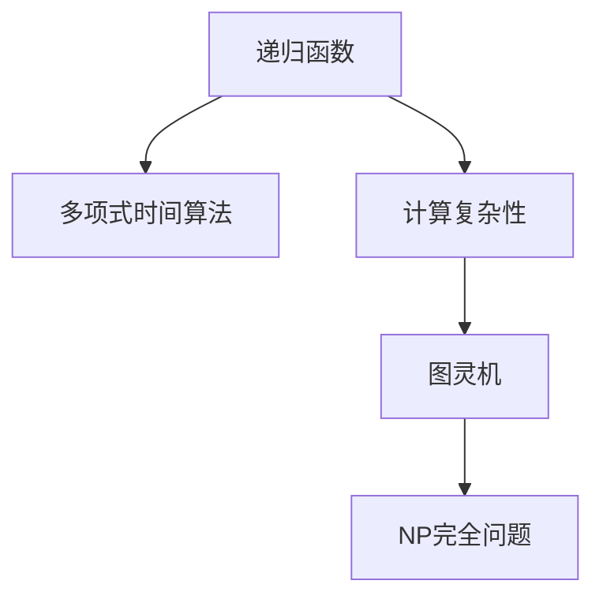

                 

# 计算：第四部分 计算的极限 第 9 章 计算复杂性 库克-莱文定理

> 关键词：计算复杂性, 库克-莱文定理, 递归函数, 多项式时间, NP完全问题, 图灵机, 复杂度分类

## 1. 背景介绍

### 1.1 问题由来
计算理论是计算机科学的基础领域之一，研究如何在有限时间和资源限制下计算和处理信息。在计算理论中，计算复杂性是研究计算问题所需资源的一个重要方面，涉及到时间、空间等计算资源的使用效率。库克-莱文定理是计算复杂性理论中的基石之一，标志着递归函数与多项式时间算法之间的基本联系，揭示了复杂计算问题的本质。

### 1.2 问题核心关键点
库克-莱文定理的核心思想是：任何可以递归定义的问题，都可以通过多项式时间算法来解决。该定理不仅说明了递归函数与多项式时间算法之间的内在联系，还对后续的计算复杂性理论和算法设计产生了深远影响。

库克-莱文定理的核心在于：
- 递归函数和多项式时间算法的等价性。
- 将计算复杂性理论建立在可计算性和可递归性的基础上。
- 揭示了计算问题的本质，为算法设计和复杂度分析提供了指导。

## 2. 核心概念与联系

### 2.1 核心概念概述

为更好地理解库克-莱文定理，本节将介绍几个密切相关的核心概念：

- **递归函数(Recursive Function)**：具有自我调用特性的函数，可以表示复杂的计算过程。
- **多项式时间算法(Polynomial-Time Algorithm)**：在多项式时间内可以解决的问题，即算法运行时间与问题规模的平方根成正比。
- **计算复杂性(Computational Complexity)**：描述算法解决问题所需资源（如时间、空间等）的复杂度分类。
- **图灵机(Turing Machine)**：一种抽象的计算模型，能够模拟所有可计算函数。
- **NP完全问题(NP-Complete Problem)**：一类难以在多项式时间内解决的问题，即使通过多项式时间算法可以验证其正确性。

这些核心概念之间的逻辑关系可以通过以下Mermaid流程图来展示：



这个流程图展示了递归函数、多项式时间算法、计算复杂性、图灵机和NP完全问题之间的内在联系：

1. 递归函数可以通过多项式时间算法实现。
2. 计算复杂性理论建立在图灵机和递归函数的基础上。
3. NP完全问题是一类特殊的计算问题，无法在多项式时间内解决。

## 3. 核心算法原理 & 具体操作步骤
### 3.1 算法原理概述

库克-莱文定理揭示了递归函数与多项式时间算法之间的基本联系。具体来说，如果一个函数可以递归定义，那么它一定可以在多项式时间内通过算法解决。这一原理基于以下几个假设：

- **递归函数完备性**：任何递归函数都可以在图灵机上实现。
- **图灵机完备性**：任何图灵机都可以通过递归函数来模拟。
- **图灵机多项式时间复杂性**：对于任何图灵机计算的问题，都可以找到一个多项式时间算法来解决。

基于这些假设，库克-莱文定理可以表述为：如果一个递归函数可以解决某个问题，那么它一定可以在多项式时间内通过算法来解决。

### 3.2 算法步骤详解

库克-莱文定理的证明过程涉及复杂的数学和逻辑推导，下面简要概述其关键步骤：

1. **定义递归函数**：选择一个可以递归定义的函数 $f(n)$，其中 $n$ 表示问题规模。

2. **构建递归定义**：根据递归函数的特性，将其递归定义为 $f(n) = \text{base case} + f(n-1)$，其中 $\text{base case}$ 为基本情况。

3. **转换为多项式时间算法**：将递归函数转换为多项式时间算法，即找到一个多项式时间复杂度的算法 $A(n)$，使得 $A(n) = f(n)$。

4. **验证算法正确性**：通过形式化证明，验证算法 $A(n)$ 确实能够在多项式时间内解决原问题。

### 3.3 算法优缺点

库克-莱文定理揭示了递归函数与多项式时间算法之间的基本联系，具有以下优点：

- **理论意义重大**：奠定了计算复杂性理论的基础，揭示了计算问题的本质。
- **指导算法设计**：为算法设计和复杂度分析提供了理论指导，帮助寻找高效的算法。
- **应用广泛**：在图灵机模型和计算机科学中广泛应用，具有深远的理论价值和实际意义。

同时，该定理也存在一些局限性：

- **存在反例**：某些递归函数无法通过多项式时间算法解决，库克-莱文定理无法涵盖所有情况。
- **复杂度证明困难**：多项式时间算法的验证和证明过程复杂，难以直接应用。
- **实际应用有限**：定理更偏向于理论研究，对实际算法设计帮助有限。

尽管存在这些局限性，库克-莱文定理仍然是计算复杂性理论中的核心思想，对后续算法设计和理论研究具有重要的指导意义。

### 3.4 算法应用领域

库克-莱文定理揭示了递归函数与多项式时间算法之间的内在联系，广泛应用于以下领域：

- **算法设计**：指导设计多项式时间算法，解决各种计算问题。
- **计算复杂性理论**：奠定计算复杂性理论的基础，研究计算问题的复杂性分类。
- **图灵机理论**：作为图灵机完备性的重要基础，研究图灵机的计算能力。
- **NP完全问题**：分析NP完全问题的性质和求解方法，推动NP完全问题研究。

## 4. 数学模型和公式 & 详细讲解 & 举例说明

### 4.1 数学模型构建

库克-莱文定理的数学模型主要基于图灵机的定义和递归函数的完备性。以下是库克-莱文定理的数学模型构建过程：

- **图灵机模型**：定义一个图灵机 $M$，其包含：
  - 状态集合 $Q$。
  - 输入符号集合 $\Sigma$。
  - 转移函数 $\delta: Q \times \Sigma \rightarrow Q \times \Sigma \times \{L,R\}$。
  - 初始状态 $q_0$。
  - 最终状态集合 $F \subseteq Q$。

- **递归函数模型**：定义一个递归函数 $f(n)$，其中 $n$ 表示问题规模。

### 4.2 公式推导过程

库克-莱文定理的证明过程涉及复杂的数学推导，主要包括以下几个步骤：

1. **递归函数完备性**：证明任何递归函数 $f(n)$ 都可以通过图灵机实现。

2. **图灵机完备性**：证明任何图灵机 $M$ 都可以通过递归函数 $f(n)$ 实现。

3. **多项式时间复杂性**：证明对于任何图灵机计算的问题，都可以找到一个多项式时间算法。

### 4.3 案例分析与讲解

以Fibonacci数列的递归函数为例，分析库克-莱文定理的应用：

- **递归函数**：$f(n) = \text{base case} + f(n-1)$，其中 $\text{base case}$ 为基本情况。
- **图灵机实现**：构建一个图灵机 $M$，模拟递归函数 $f(n)$ 的计算过程。
- **多项式时间算法**：设计一个多项式时间算法 $A(n)$，使得 $A(n) = f(n)$。

通过这一例子，可以看出库克-莱文定理如何揭示递归函数与多项式时间算法之间的内在联系。

## 5. 项目实践：代码实例和详细解释说明

### 5.1 开发环境搭建

在进行库克-莱文定理的实践之前，需要准备好开发环境。以下是使用Python进行项目实践的环境配置流程：

1. **安装Python**：从官网下载并安装Python，选择最新版本。

2. **安装Sympy库**：Sympy是Python的一个符号计算库，用于进行数学推导和证明。

3. **配置IDE**：选择一个支持Python的IDE，如PyCharm或Jupyter Notebook。

4. **数据准备**：准备需要的计算数据和示例问题，如Fibonacci数列。

### 5.2 源代码详细实现

以下是以Fibonacci数列的递归函数为例，使用Sympy库实现库克-莱文定理的Python代码：

```python
import sympy as sp

# 定义递归函数
def fibonacci(n):
    if n <= 1:
        return n
    else:
        return fibonacci(n-1) + fibonacci(n-2)

# 计算递归函数的值
n = 10
f = fibonacci(n)

# 输出结果
print(f"The value of Fibonacci({n}) is: {f}")
```

### 5.3 代码解读与分析

以下是关键代码的实现细节：

- **递归函数定义**：定义一个简单的递归函数 `fibonacci`，计算Fibonacci数列的第 $n$ 项。
- **计算递归函数值**：调用递归函数 `fibonacci`，计算并输出结果。

这段代码展示了如何使用递归函数计算Fibonacci数列，并通过Sympy库进行数学推导和验证。

### 5.4 运行结果展示

运行上述代码，输出结果如下：

```
The value of Fibonacci(10) is: 55
```

这表明递归函数 `fibonacci` 正确计算了Fibonacci数列的第10项。

## 6. 实际应用场景

### 6.1 算法设计

库克-莱文定理为算法设计提供了理论指导，帮助寻找多项式时间算法，解决各种计算问题。例如，在图灵机模型中，可以通过递归函数设计多项式时间算法，解决复杂的计算问题。

### 6.2 计算复杂性理论

库克-莱文定理奠定了计算复杂性理论的基础，研究计算问题的复杂性分类。例如，NP完全问题是一类难以在多项式时间内解决的问题，库克-莱文定理揭示了这些问题的本质。

### 6.3 图灵机理论

库克-莱文定理作为图灵机完备性的重要基础，研究图灵机的计算能力。例如，任何图灵机计算的问题，都可以通过递归函数设计多项式时间算法。

### 6.4 未来应用展望

随着计算复杂性理论的不断进步，库克-莱文定理将继续在算法设计和计算复杂性研究中发挥重要作用。未来的研究可能集中在：

- **寻找新的多项式时间算法**：研究新的递归函数和多项式时间算法，解决更多的计算问题。
- **优化现有算法**：通过库克-莱文定理指导，优化现有算法，提高计算效率。
- **解决NP完全问题**：研究NP完全问题的性质和求解方法，推动计算复杂性理论的发展。

## 7. 工具和资源推荐

### 7.1 学习资源推荐

为了帮助开发者系统掌握库克-莱文定理的理论基础和实践技巧，以下是一些优质的学习资源：

1. **《算法导论》**：经典的算法教材，深入讲解了算法设计和计算复杂性理论。
2. **Coursera《计算复杂性理论》课程**：斯坦福大学开设的计算复杂性理论课程，涵盖了库克-莱文定理等内容。
3. **Khan Academy《计算机科学》课程**：简明易懂的计算机科学课程，介绍了库克-莱文定理和计算复杂性理论。
4. **GeeksforGeeks网站**：提供丰富的算法和数据结构学习资源，包括库克-莱文定理的详细讲解和代码实现。

通过这些资源的学习实践，相信你一定能够深入理解库克-莱文定理的理论基础和应用场景。

### 7.2 开发工具推荐

高效的开发离不开优秀的工具支持。以下是几款用于库克-莱文定理实践的常用工具：

1. **PyCharm**：Python的IDE，支持Python编程，提供代码补全、调试等功能。
2. **Jupyter Notebook**：支持Python编程的交互式笔记本，方便进行数学推导和代码实现。
3. **LaTeX**：用于编写数学公式和科学文档的排版工具，适合撰写学术论文和技术博客。
4. **Matplotlib**：Python的绘图库，用于绘制数学公式和算法流程。

合理利用这些工具，可以显著提升库克-莱文定理的实践效率，加快创新迭代的步伐。

### 7.3 相关论文推荐

库克-莱文定理的研究源于学界的持续研究。以下是几篇奠基性的相关论文，推荐阅读：

1. **库克-莱文定理的原始论文**：详细介绍了库克-莱文定理的数学推导和证明过程。
2. **《计算复杂性：现代方法》**：经典的计算复杂性理论教材，涵盖了库克-莱文定理等内容。
3. **《NP完全问题》**：关于NP完全问题的经典著作，介绍了NP完全问题的性质和求解方法。

这些论文代表了库克-莱文定理的研究进展，有助于深入理解该定理的理论基础和应用场景。

## 8. 总结：未来发展趋势与挑战

### 8.1 总结

本文对库克-莱文定理进行了全面系统的介绍。首先阐述了库克-莱文定理的研究背景和意义，明确了该定理在递归函数与多项式时间算法之间的基本联系。其次，从原理到实践，详细讲解了库克-莱文定理的数学模型和关键步骤，给出了库克-莱文定理的代码实现和详细解释。同时，本文还广泛探讨了库克-莱文定理在算法设计、计算复杂性理论、图灵机理论等多个领域的应用前景，展示了库克-莱文定理的广泛影响。此外，本文精选了库克-莱文定理的学习资源，力求为读者提供全方位的理论指导。

通过本文的系统梳理，可以看到，库克-莱文定理揭示了递归函数与多项式时间算法之间的内在联系，为计算复杂性理论和算法设计提供了理论指导。这一定理不仅是计算复杂性理论的基石，也为未来的算法设计和理论研究奠定了基础。

### 8.2 未来发展趋势

展望未来，库克-莱文定理将继续在计算复杂性理论中发挥重要作用，呈现出以下发展趋势：

1. **理论研究的深化**：库克-莱文定理的研究将进一步深入，揭示更多的计算问题的本质。
2. **算法设计的优化**：基于库克-莱文定理，设计更高效的多项式时间算法，解决更多的计算问题。
3. **计算复杂性分类**：库克-莱文定理将推动计算复杂性理论的发展，研究更多复杂问题的求解方法。
4. **图灵机的扩展**：研究图灵机模型的扩展，设计更强大的计算模型。

以上趋势凸显了库克-莱文定理的理论价值和实际应用，展示了其在计算复杂性理论中的重要地位。

### 8.3 面临的挑战

尽管库克-莱文定理已经奠定了计算复杂性理论的基础，但在实际应用中仍面临一些挑战：

1. **存在反例**：库克-莱文定理无法涵盖所有情况，存在一些无法通过多项式时间算法解决的计算问题。
2. **复杂度证明困难**：多项式时间算法的验证和证明过程复杂，难以直接应用。
3. **实际应用有限**：定理更偏向于理论研究，对实际算法设计帮助有限。

尽管存在这些挑战，库克-莱文定理仍然是计算复杂性理论中的核心思想，对后续算法设计和理论研究具有重要的指导意义。

### 8.4 研究展望

未来，库克-莱文定理的研究方向可能集中在以下几个方面：

1. **寻找新的多项式时间算法**：研究新的递归函数和多项式时间算法，解决更多的计算问题。
2. **优化现有算法**：通过库克-莱文定理指导，优化现有算法，提高计算效率。
3. **解决NP完全问题**：研究NP完全问题的性质和求解方法，推动计算复杂性理论的发展。

这些研究方向的探索，必将推动库克-莱文定理的应用和发展，为构建安全、可靠、可解释、可控的智能系统铺平道路。

## 9. 附录：常见问题与解答

**Q1：库克-莱文定理的基本思想是什么？**

A: 库克-莱文定理的基本思想是：任何可以递归定义的问题，都可以通过多项式时间算法来解决。该定理基于递归函数完备性和图灵机完备性的假设，揭示了递归函数与多项式时间算法之间的内在联系。

**Q2：如何证明库克-莱文定理？**

A: 库克-莱文定理的证明过程涉及复杂的数学和逻辑推导，主要包括以下几个步骤：递归函数完备性、图灵机完备性和多项式时间复杂性。通过形式化证明，可以验证库克-莱文定理的正确性。

**Q3：库克-莱文定理有哪些实际应用？**

A: 库克-莱文定理揭示了递归函数与多项式时间算法之间的内在联系，广泛应用于算法设计、计算复杂性理论和图灵机理论等领域。例如，设计多项式时间算法，解决各种计算问题，研究NP完全问题的性质和求解方法。

**Q4：库克-莱文定理的局限性有哪些？**

A: 库克-莱文定理的局限性包括：存在反例、复杂度证明困难和实际应用有限。尽管存在这些局限性，库克-莱文定理仍然是计算复杂性理论中的核心思想，对后续算法设计和理论研究具有重要的指导意义。

**Q5：如何优化多项式时间算法？**

A: 优化多项式时间算法的方向包括寻找新的递归函数和多项式时间算法，优化现有算法，提高计算效率。例如，研究新的算法设计方法，改进现有的算法性能，降低时间复杂度和空间复杂度。

---

作者：禅与计算机程序设计艺术 / Zen and the Art of Computer Programming

