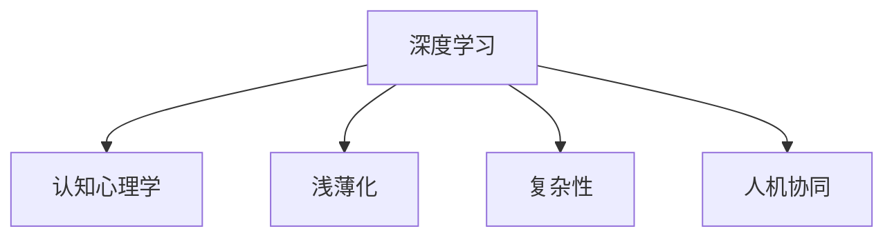

                 

# 认知发展中的浅薄与复杂

> 关键词：认知心理学,深度学习,浅薄化,复杂性,人工智能,人机协同

## 1. 背景介绍

### 1.1 问题由来

随着人类文明的发展，认知心理学逐渐成为科学探索的重要分支。从行为主义到认知神经科学，再到当前的深度学习和大数据技术，认知心理学进入了一个新的时代。但与此同时，认知科学研究也面临着一个新的挑战：在浅薄化与复杂性并存的时代，如何在保持认知深度的同时，有效利用现代科技手段。

认知心理学认为，人的认知系统是由多重认知过程构成的复杂网络。深度学习技术的兴起，为人类的认知研究提供了新的视角和工具，但也带来了新的问题。深度学习模型的复杂性和可解释性不足，使得传统的认知心理学理论和工具难以直接应用。

本文将从深度学习技术在认知研究中的应用出发，探讨浅薄化与复杂性在认知心理学和人工智能之间的相互作用，提出基于深度学习技术的人机协同认知方法。

## 2. 核心概念与联系

### 2.1 核心概念概述

为了更好地理解深度学习在认知研究中的应用，我们需要首先明确几个核心概念：

- 深度学习：基于神经网络结构，通过多层非线性变换学习复杂特征表示。
- 认知心理学：研究人类认知过程的科学，包括感知、记忆、思维、语言等。
- 浅薄化：在处理复杂问题时，深度学习模型可能过度简化问题，导致认知过程的深度不足。
- 复杂性：认知过程本身是复杂的，包含多重认知过程和认知结构。
- 人机协同：利用深度学习模型的高效计算能力，辅助人类认知过程，提升认知效率。

这些概念之间的逻辑关系可以通过以下Mermaid流程图来展示：



这个流程图展示了深度学习与认知心理学之间的相互影响关系：

1. 深度学习为认知心理学提供了新的数据处理手段和建模方式，但同时也带来了浅薄化和复杂性问题。
2. 浅薄化指深度学习模型在处理复杂问题时，可能简化认知过程，导致认知深度不足。
3. 复杂性指认知过程本身具有多重认知过程和结构，需要更复杂的数据和模型来处理。
4. 人机协同利用深度学习模型的高效计算能力，辅助人类认知过程，提升认知效率。

## 3. 核心算法原理 & 具体操作步骤
### 3.1 算法原理概述

深度学习在认知研究中的应用，主要是通过构建复杂的神经网络模型，学习数据的深层特征表示。但这种深度特征表示本身并不直接对应认知过程，需要进行进一步的认知抽象和推理。因此，深度学习模型在认知研究中的应用需要结合认知心理学的理论和方法。

基于深度学习技术的人机协同认知方法，通常包括以下几个关键步骤：

1. 数据采集与预处理：采集人类认知数据（如fMRI、EEG等），进行数据清洗和归一化。
2. 深度学习模型构建：设计合适的神经网络模型，进行数据训练，得到特征表示。
3. 认知过程建模：利用认知心理学理论，将深度学习模型输出的特征表示进行抽象和推理，构建认知模型。
4. 模型优化与评估：根据认知模型，进行优化和评估，提升模型性能。
5. 人机协同应用：将优化后的模型应用于实际问题中，进行人机协同认知。

### 3.2 算法步骤详解

在实际应用中，基于深度学习技术的人机协同认知方法通常包括以下几个关键步骤：

**Step 1: 数据采集与预处理**
- 采集人类认知数据，如功能性磁共振成像(fMRI)、脑电图(EEG)等。
- 对数据进行清洗和预处理，如去噪、归一化等。
- 将数据分为训练集和测试集，用于模型训练和评估。

**Step 2: 深度学习模型构建**
- 选择合适的神经网络模型，如卷积神经网络(CNN)、递归神经网络(RNN)、Transformer等。
- 设计合适的网络结构和参数，进行数据训练，得到特征表示。

**Step 3: 认知过程建模**
- 利用认知心理学理论，将深度学习模型输出的特征表示进行抽象和推理，构建认知模型。
- 常见的认知模型包括感知-记忆-思维模型、神经网络-认知网络模型等。

**Step 4: 模型优化与评估**
- 利用认知模型进行模型优化，如调整网络结构、更新参数等。
- 在测试集上进行模型评估，如计算准确率、召回率、F1值等指标。

**Step 5: 人机协同应用**
- 将优化后的模型应用于实际问题中，进行人机协同认知。
- 常见的应用场景包括情感分析、决策支持、交互式问答等。

### 3.3 算法优缺点

基于深度学习技术的人机协同认知方法具有以下优点：

1. 高效性：深度学习模型能够快速处理大量数据，进行高效特征表示。
2. 鲁棒性：深度学习模型具有较强的泛化能力，能够在不同数据集上保持稳定性能。
3. 灵活性：深度学习模型可以通过增加层数、调整参数等手段，进行灵活调整。
4. 可解释性：结合认知心理学理论，深度学习模型可以解释其输出结果。

同时，该方法也存在一定的局限性：

1. 数据依赖性强：深度学习模型对数据质量、数量要求较高，难以适应小样本数据。
2. 可解释性不足：深度学习模型通常被认为是"黑盒"模型，难以解释其内部工作机制。
3. 计算资源消耗大：深度学习模型通常需要较大的计算资源，特别是在训练过程中。
4. 认知过程浅薄：深度学习模型在处理复杂认知过程时，可能简化认知过程，导致认知深度不足。

尽管存在这些局限性，但基于深度学习技术的人机协同认知方法仍然是大数据时代认知研究的重要手段。未来相关研究的重点在于如何进一步降低深度学习模型的计算资源消耗，提高其可解释性，同时兼顾浅薄化和复杂性问题。

### 3.4 算法应用领域

基于深度学习技术的人机协同认知方法，在多个领域中得到了应用：

- 情感分析：利用深度学习模型处理文本情感数据，进行情感识别和情感预测。
- 决策支持：结合认知心理学理论，构建决策支持系统，辅助人类决策。
- 交互式问答：构建交互式问答系统，利用深度学习模型进行自然语言理解和推理。
- 健康监测：利用深度学习模型处理脑电图数据，监测患者心理健康状况。
- 教育辅助：利用深度学习模型进行学情分析，个性化推荐学习内容。

## 4. 数学模型和公式 & 详细讲解
### 4.1 数学模型构建

本节将使用数学语言对基于深度学习技术的人机协同认知方法进行更加严格的刻画。

记深度学习模型为 $f(x;\theta)$，其中 $x$ 为输入数据，$\theta$ 为模型参数。假设数据集为 $D=\{(x_i,y_i)\}_{i=1}^N, x_i \in \mathbb{R}^d, y_i \in \mathbb{R}$。

定义模型 $f(x;\theta)$ 在数据样本 $(x,y)$ 上的损失函数为 $\ell(f(x;\theta),y)$，则在数据集 $D$ 上的经验风险为：

$$
\mathcal{L}(\theta) = \frac{1}{N} \sum_{i=1}^N \ell(f(x_i;\theta),y_i)
$$

在得到损失函数后，可以使用梯度下降等优化算法，最小化损失函数，得到最优参数：

$$
\theta^* = \mathop{\arg\min}_{\theta} \mathcal{L}(\theta)
$$

在实践中，我们通常使用基于梯度的优化算法（如SGD、Adam等）来近似求解上述最优化问题。设 $\eta$ 为学习率，则参数的更新公式为：

$$
\theta \leftarrow \theta - \eta \nabla_{\theta}\mathcal{L}(\theta)
$$

其中 $\nabla_{\theta}\mathcal{L}(\theta)$ 为损失函数对参数 $\theta$ 的梯度，可通过反向传播算法高效计算。

### 4.2 公式推导过程

以下我们以情感分析任务为例，推导交叉熵损失函数及其梯度的计算公式。

假设模型 $f(x;\theta)$ 在输入 $x$ 上的输出为 $\hat{y}=f(x;\theta) \in [0,1]$，表示样本属于正类的概率。真实标签 $y \in \{0,1\}$。则二分类交叉熵损失函数定义为：

$$
\ell(f(x;\theta),y) = -[y\log \hat{y} + (1-y)\log (1-\hat{y})]
$$

将其代入经验风险公式，得：

$$
\mathcal{L}(\theta) = -\frac{1}{N}\sum_{i=1}^N [y_i\log f(x_i;\theta)+(1-y_i)\log(1-f(x_i;\theta))]
$$

根据链式法则，损失函数对参数 $\theta_k$ 的梯度为：

$$
\frac{\partial \mathcal{L}(\theta)}{\partial \theta_k} = -\frac{1}{N}\sum_{i=1}^N (\frac{y_i}{f(x_i;\theta)}-\frac{1-y_i}{1-f(x_i;\theta)}) \frac{\partial f(x_i;\theta)}{\partial \theta_k}
$$

其中 $\frac{\partial f(x_i;\theta)}{\partial \theta_k}$ 可进一步递归展开，利用自动微分技术完成计算。

## 5. 项目实践：代码实例和详细解释说明
### 5.1 开发环境搭建

在进行深度学习实践前，我们需要准备好开发环境。以下是使用Python进行TensorFlow开发的环境配置流程：

1. 安装Anaconda：从官网下载并安装Anaconda，用于创建独立的Python环境。

2. 创建并激活虚拟环境：
```bash
conda create -n tensorflow-env python=3.8 
conda activate tensorflow-env
```

3. 安装TensorFlow：根据CUDA版本，从官网获取对应的安装命令。例如：
```bash
conda install tensorflow -c conda-forge
```

4. 安装TensorBoard：
```bash
pip install tensorboard
```

5. 安装Keras：
```bash
pip install keras
```

6. 安装各类工具包：
```bash
pip install numpy pandas scikit-learn matplotlib tqdm jupyter notebook ipython
```

完成上述步骤后，即可在`tensorflow-env`环境中开始深度学习实践。

### 5.2 源代码详细实现

下面我以情感分析任务为例，给出使用TensorFlow和Keras进行深度学习的PyTorch代码实现。

首先，定义情感分析任务的标签：

```python
from keras.datasets import imdb

(x_train, y_train), (x_test, y_test) = imdb.load_data(num_words=10000)
```

然后，构建深度学习模型：

```python
from keras.models import Sequential
from keras.layers import Embedding, LSTM, Dense

model = Sequential()
model.add(Embedding(input_dim=10000, output_dim=128, input_length=256))
model.add(LSTM(128))
model.add(Dense(1, activation='sigmoid'))
```

接着，定义损失函数和优化器：

```python
model.compile(loss='binary_crossentropy', optimizer='adam', metrics=['accuracy'])
```

最后，训练和评估模型：

```python
model.fit(x_train, y_train, epochs=5, batch_size=64, validation_data=(x_test, y_test))
model.evaluate(x_test, y_test)
```

以上就是使用TensorFlow和Keras进行情感分析任务深度学习的完整代码实现。可以看到，得益于Keras的高层封装，我们可以用相对简洁的代码完成深度学习模型的构建和训练。

### 5.3 代码解读与分析

让我们再详细解读一下关键代码的实现细节：

**模型定义**：
- 定义一个顺序模型Sequential，添加嵌入层Embedding，将单词序列转换为向量表示。
- 添加一个长短期记忆网络LSTM，用于处理序列数据。
- 添加一个全连接层Dense，输出二分类概率。

**损失函数和优化器**：
- 使用二分类交叉熵损失函数binary_crossentropy，适用于二分类问题。
- 使用Adam优化器，适应性学习率，适用于深度学习模型。

**训练和评估**：
- 使用fit方法进行模型训练，设定迭代轮数epochs和批大小batch_size。
- 使用evaluate方法在测试集上评估模型性能，返回准确率等指标。

**代码解读与分析**：
- 深度学习模型的构建过程中，嵌入层将文本转换为向量表示，长短期记忆网络用于处理序列数据，全连接层输出分类概率。
- 损失函数和优化器的选择，决定了模型的训练方向和性能优化。
- 模型训练过程中，利用fit方法进行迭代训练，同时使用evaluate方法评估模型性能，确保训练过程收敛。

## 6. 实际应用场景
### 6.1 情感分析

基于深度学习技术的人机协同认知方法，可以广泛应用于情感分析任务。传统的情感分析方法通常依赖于规则和词典，难以处理复杂的语义变化。而深度学习模型可以自动学习语言的深层特征表示，提升情感识别的准确性。

具体而言，可以收集社交媒体、评论等文本数据，利用深度学习模型进行情感分类。深度学习模型通常使用长短期记忆网络LSTM或Transformer等结构，在文本序列上进行特征提取和分类。通过训练集和测试集进行模型评估和调参，可以在实际应用中快速部署，提供情感分析服务。

### 6.2 决策支持

深度学习技术在决策支持中的应用，主要利用认知心理学理论，将深度学习模型的输出进行认知抽象和推理。常见的决策支持系统包括股票预测、风险评估、供应链管理等。

在股票预测中，可以结合深度学习模型和认知心理学理论，构建股票预测模型。模型可以分析历史股价、市场情绪等因素，预测未来股价走势。在风险评估中，可以利用深度学习模型处理大量数据，结合认知心理学理论进行风险预测。在供应链管理中，可以利用深度学习模型处理生产、库存等数据，结合认知心理学理论进行优化决策。

### 6.3 交互式问答

交互式问答系统是深度学习技术在认知研究中常见的应用之一。通过深度学习模型处理自然语言理解任务，结合认知心理学理论，构建自然语言推理模型，可以实现智能问答。

在交互式问答系统中，深度学习模型通常使用Transformer结构，处理自然语言输入，提取语义特征。结合认知心理学理论，可以构建自然语言推理模型，进行推理和回答。通过训练集和测试集进行模型评估和调参，可以在实际应用中快速部署，提供智能问答服务。

### 6.4 未来应用展望

随着深度学习技术的发展，基于深度学习技术的人机协同认知方法将广泛应用于更多领域：

- 医学影像分析：利用深度学习模型处理医学影像数据，结合认知心理学理论进行病理分析。
- 智能客服：利用深度学习模型处理自然语言理解任务，结合认知心理学理论进行智能客服。
- 教育辅助：利用深度学习模型处理学情数据，结合认知心理学理论进行个性化推荐。
- 金融分析：利用深度学习模型处理金融数据，结合认知心理学理论进行风险评估。

## 7. 工具和资源推荐
### 7.1 学习资源推荐

为了帮助开发者系统掌握深度学习在认知研究中的应用，这里推荐一些优质的学习资源：

1. 《深度学习》系列博文：由深度学习专家撰写，深入浅出地介绍了深度学习原理和应用。
2. Coursera《深度学习专项课程》：由斯坦福大学开设的深度学习课程，提供系统性学习资源。
3. 《深度学习与认知心理学》书籍：深度学习和认知心理学的交叉研究书籍，介绍了深度学习在认知研究中的应用。
4. ArXiv预印本平台：深度学习领域最新研究成果的发布平台，帮助开发者了解前沿技术。

通过对这些资源的学习实践，相信你一定能够快速掌握深度学习在认知研究中的应用，并用于解决实际的认知问题。

### 7.2 开发工具推荐

高效的开发离不开优秀的工具支持。以下是几款用于深度学习开发的常用工具：

1. TensorFlow：由Google主导开发的开源深度学习框架，支持多种硬件和软件平台，适用于大规模工程应用。
2. PyTorch：基于Python的开源深度学习框架，灵活动态的计算图，适合快速迭代研究。
3. Keras：高层封装深度学习API，易于上手和调试，适合快速原型开发。
4. Jupyter Notebook：交互式编程环境，支持多种编程语言和工具，适用于数据可视化、模型训练等。
5. Weights & Biases：模型训练的实验跟踪工具，可以记录和可视化模型训练过程中的各项指标，方便对比和调优。

合理利用这些工具，可以显著提升深度学习在认知研究中的应用开发效率，加快创新迭代的步伐。

### 7.3 相关论文推荐

深度学习技术在认知研究中的应用源于学界的持续研究。以下是几篇奠基性的相关论文，推荐阅读：

1. "Deep Neural Networks for Speech Recognition"（深度神经网络在语音识别中的应用）：提出了深度神经网络在语音识别中的应用，推动了语音识别的突破。
2. "Deep Learning for Medical Image Analysis: A Review"（深度学习在医学影像分析中的应用）：介绍了深度学习在医学影像分析中的应用，推动了医学影像分析的发展。
3. "Deep Learning in Natural Language Processing"（深度学习在自然语言处理中的应用）：介绍了深度学习在自然语言处理中的应用，推动了自然语言处理的发展。
4. "Deep Learning and Cognitive Psychology"（深度学习和认知心理学）：探讨了深度学习在认知心理学中的应用，推动了深度学习和认知心理学的交叉研究。
5. "Deep Learning for Decision Support"（深度学习在决策支持中的应用）：介绍了深度学习在决策支持中的应用，推动了决策支持的发展。

这些论文代表了大深度学习在认知研究中的应用脉络。通过学习这些前沿成果，可以帮助研究者把握学科前进方向，激发更多的创新灵感。

## 8. 总结：未来发展趋势与挑战
### 8.1 总结

本文对基于深度学习技术的人机协同认知方法进行了全面系统的介绍。首先阐述了深度学习技术在认知研究中的应用背景，明确了浅薄化与复杂性在深度学习和认知心理学之间的相互作用。其次，从原理到实践，详细讲解了深度学习在认知研究中的应用步骤，给出了深度学习任务开发的完整代码实例。同时，本文还广泛探讨了深度学习技术在情感分析、决策支持、交互式问答等多个领域的应用前景，展示了深度学习技术在认知研究中的广泛应用。

通过本文的系统梳理，可以看到，基于深度学习技术的人机协同认知方法正在成为认知研究的重要手段，极大地拓展了深度学习模型的应用边界，催生了更多的落地场景。受益于大规模数据和计算资源，深度学习模型在认知研究中的应用效果显著提升，同时也带来了一些新的问题和挑战。

### 8.2 未来发展趋势

展望未来，深度学习在认知研究中的应用将呈现以下几个发展趋势：

1. 深度学习模型的规模将进一步增大。随着计算资源的增加和数据量的增长，深度学习模型的参数量将继续增大，模型复杂度进一步提升。
2. 深度学习模型的可解释性将得到改善。深度学习模型的黑盒问题将得到进一步解决，模型的决策过程和认知逻辑将更加透明。
3. 深度学习模型的应用领域将进一步拓展。深度学习技术在医疗、教育、金融等领域的认知应用将不断深入，推动相关领域的创新发展。
4. 深度学习与认知心理学的结合将更加紧密。深度学习模型将更好地利用认知心理学的理论和方法，提升模型的认知深度和泛化能力。
5. 深度学习模型的人机协同应用将更加普遍。深度学习模型将更广泛地应用于人机协同系统，提升系统的认知效率和决策能力。

以上趋势凸显了深度学习在认知研究中的巨大潜力。这些方向的探索发展，必将进一步提升深度学习模型的性能和应用范围，为认知科学的发展提供新的动力。

### 8.3 面临的挑战

尽管深度学习在认知研究中取得了显著成就，但在迈向更加智能化、普适化应用的过程中，它仍面临诸多挑战：

1. 数据依赖性强。深度学习模型对数据质量和数量要求较高，难以适应小样本数据。如何降低数据依赖性，提高模型的泛化能力，将是一大难题。
2. 模型可解释性不足。深度学习模型通常被认为是"黑盒"模型，难以解释其内部工作机制和决策逻辑。如何提升模型的可解释性，增强其可信度，将是重要的研究方向。
3. 计算资源消耗大。深度学习模型通常需要较大的计算资源，特别是在训练过程中。如何优化模型结构，降低计算资源消耗，将是一项重要的优化方向。
4. 浅薄化与复杂性并存。深度学习模型在处理复杂认知过程时，可能简化认知过程，导致认知深度不足。如何平衡浅薄化和复杂性问题，提高模型的认知深度，将是一个重要的问题。
5. 认知偏见问题。深度学习模型可能会学习到有偏见的数据，导致输出结果具有歧视性和误导性。如何减少认知偏见，提升模型的公平性，将是一个重要的研究方向。

这些挑战需要通过深度学习模型和认知心理学理论的进一步结合，以及多学科合作，才能逐步解决。唯有在数据、算法、工程、伦理等多个维度进行协同发力，才能真正实现深度学习技术在认知研究中的应用。

### 8.4 研究展望

未来的研究需要在以下几个方面寻求新的突破：

1. 探索更有效的深度学习模型。开发更加高效、可解释的深度学习模型，提升深度学习模型在认知研究中的应用效果。
2. 结合认知心理学理论。结合认知心理学理论，优化深度学习模型的设计和训练，提升模型的认知深度和泛化能力。
3. 优化模型训练过程。优化深度学习模型的训练过程，降低计算资源消耗，提高模型的训练效率和可解释性。
4. 减少认知偏见。减少深度学习模型的认知偏见，提升模型的公平性和可信度。
5. 推动跨学科合作。推动深度学习技术和认知心理学理论的跨学科合作，推动深度学习技术在认知研究中的应用。

这些研究方向的探索，必将引领深度学习技术在认知研究中的进一步发展，推动认知科学和人工智能技术的进步。面向未来，深度学习技术将在更多领域中得到应用，为人类认知智能的进化带来新的突破。

## 9. 附录：常见问题与解答

**Q1：深度学习模型在处理复杂认知问题时，是否容易简化认知过程，导致认知深度不足？**

A: 是的，深度学习模型在处理复杂认知问题时，可能简化认知过程，导致认知深度不足。例如，在处理情感分析任务时，深度学习模型可能无法识别文本中的细微情感变化，导致情感识别的不准确。因此，深度学习模型需要结合认知心理学理论，进行认知抽象和推理，提升认知深度。

**Q2：如何降低深度学习模型的计算资源消耗？**

A: 降低深度学习模型的计算资源消耗，可以从以下几个方面入手：
1. 模型裁剪：去除不必要的层和参数，减小模型尺寸，加快推理速度。
2. 量化加速：将浮点模型转为定点模型，压缩存储空间，提高计算效率。
3. 分布式训练：使用分布式训练技术，加快训练速度。
4. 优化算法：优化深度学习模型的优化算法，降低计算资源消耗。

**Q3：如何提升深度学习模型的可解释性？**

A: 提升深度学习模型的可解释性，可以从以下几个方面入手：
1. 可视化工具：利用可视化工具，观察深度学习模型的训练过程和输出结果，帮助理解模型的内部工作机制。
2. 可解释性模型：开发可解释性模型，如LIME、SHAP等，用于解释深度学习模型的输出结果。
3. 认知心理学理论：结合认知心理学理论，构建可解释性模型，提升模型的认知深度。

**Q4：如何减少深度学习模型的认知偏见？**

A: 减少深度学习模型的认知偏见，可以从以下几个方面入手：
1. 数据集多样性：构建多样化的数据集，减少模型对特定数据的依赖。
2. 对抗训练：使用对抗样本训练模型，提高模型的鲁棒性和公平性。
3. 认知心理学理论：结合认知心理学理论，优化模型的设计和训练，减少模型的认知偏见。
4. 人工干预：在模型训练过程中，加入人工干预，帮助模型学习更加公平的决策逻辑。

这些问题的探讨，将帮助深度学习模型在认知研究中的应用更加深入和广泛，推动认知科学和人工智能技术的进步。通过这些方法和技术，深度学习模型将在更多领域中得到应用，为人类认知智能的进化带来新的突破。

