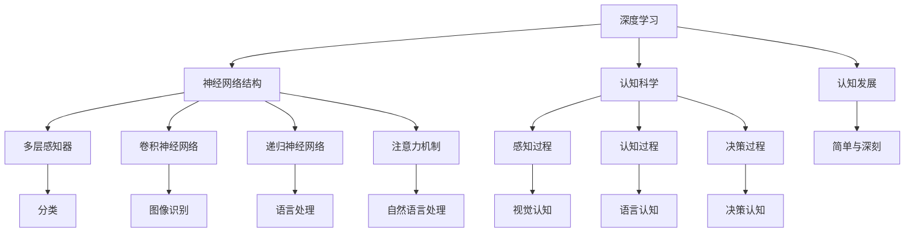

                 

# 认知发展中的简单与深刻

## 1. 背景介绍

在人工智能领域，简单和深刻是两个经常提及的概念，这两个词本身所代表的含义非常丰富。在深入探讨认知发展的简单与深刻之前，我们先简单回顾一下人工智能的历史与现状。

人工智能经历了六十多年的发展，其路径可以大致分为以下几个阶段：

1. **符号主义阶段（1950s-1980s）**：早期的人工智能试图通过符号操作和逻辑推理来模拟人的认知能力，强调“知识的表示与推理”。尽管这个阶段的尝试富有启发性，但由于过于复杂，难以实现，最终走向了低谷。

2. **专家系统（1980s-1990s）**：专家系统的发展标志着人工智能进入了一个新的阶段。专家系统能够通过逻辑推理解决特定领域的问题，对于AI商业化做出了重要贡献。然而，专家系统依然依赖于人工编写的规则，无法解决复杂和多样化的问题。

3. **机器学习阶段（1990s-2010s）**：机器学习特别是统计学习成为了人工智能新的核心。这个阶段的特点是使用数据驱动的方法进行学习，以大量的数据为基础进行模型训练。

4. **深度学习阶段（2010s至今）**：深度学习基于多层神经网络结构，可以处理大规模的数据，并在图像识别、语音识别等任务中取得卓越的性能，打开了人工智能新的大门。

今天，我们正处于深度学习与认知科学深度融合的阶段，认知发展中的简单与深刻成为连接这两个领域的桥梁。

## 2. 核心概念与联系

### 2.1 核心概念概述

**深度学习**：一种通过多层神经网络结构进行学习的机器学习方法，每个神经元都能够学习特征，最终形成强大的非线性模型。

**认知科学**：研究人类认知过程及其计算模型的科学，涉及感知、认知、决策、语言等方面。

**简单与深刻**：在人工智能中，“简单”指的是算法和模型结构的简洁性，以及其能否有效处理复杂问题；而“深刻”则指的是模型所蕴含的知识深度，能够进行复杂的推理和决策。

**认知发展**：研究人类认知能力随时间变化的科学，关注知识、思维和技能如何通过学习和发展而改变。

通过深度学习和认知科学的方法，我们希望能够建立一个既简单又深刻的模型，既能够有效处理现实世界的问题，又能够体现出人类认知的特点。

### 2.2 核心概念原理和架构的 Mermaid 流程图



这个图表展示了深度学习与认知科学的关联，以及简单与深刻的理念。神经网络结构（C-D-E-F）是深度学习的核心，而感知、认知、决策过程（L-M-N）则构成了认知科学的范畴。通过研究认知发展，我们希望能建立既简单（结构简洁）又深刻（知识丰富）的模型。

## 3. 核心算法原理 & 具体操作步骤

### 3.1 算法原理概述

深度学习的核心算法包括前馈神经网络、卷积神经网络、循环神经网络以及注意力机制等。这些算法共同构建了强大的非线性模型，可以处理各种复杂问题。

**前馈神经网络**：最简单的神经网络结构，包括输入层、隐藏层和输出层。

**卷积神经网络**：主要用于图像识别任务，通过卷积操作提取局部特征，然后通过池化操作减少参数，从而减少过拟合。

**循环神经网络**：用于处理序列数据，通过循环连接，使得网络可以处理时间序列数据，如自然语言处理。

**注意力机制**：用于提高模型的泛化能力，尤其适用于长序列和复杂任务。

这些算法为人工智能提供了丰富的工具，但如何将其与认知科学结合起来，仍然是一个重要挑战。

### 3.2 算法步骤详解

深度学习的训练通常包括数据准备、模型选择、训练和测试四个步骤。

1. **数据准备**：收集并准备训练数据，将数据转化为模型可以使用的格式，如图片、文本等。

2. **模型选择**：选择合适的深度学习模型，如卷积神经网络、循环神经网络等。

3. **训练**：使用训练数据对模型进行训练，通过反向传播算法调整模型参数。

4. **测试**：使用测试数据评估模型性能，调整模型参数以获得更好的结果。

### 3.3 算法优缺点

**优点**：
- **高效性**：可以处理大规模数据，并且通过并行计算，提高模型训练速度。
- **泛化能力**：可以通过大数据量训练，提高模型的泛化能力。
- **适应性**：可以适应各种不同类型的数据，包括图像、文本、音频等。

**缺点**：
- **复杂性**：模型结构复杂，需要大量的计算资源。
- **黑箱性**：难以解释模型的决策过程。
- **过拟合风险**：如果数据量不足，容易发生过拟合现象。

### 3.4 算法应用领域

深度学习已经在图像识别、语音识别、自然语言处理等领域取得了显著的成果。

- **图像识别**：通过卷积神经网络进行图像分类、对象检测等。
- **语音识别**：使用循环神经网络处理语音数据，实现语音到文本的转换。
- **自然语言处理**：使用注意力机制、循环神经网络等处理文本数据，如语言翻译、文本生成等。

## 4. 数学模型和公式 & 详细讲解 & 举例说明

### 4.1 数学模型构建

以图像识别为例，我们首先介绍基本的深度学习模型。

**卷积神经网络（CNN）**：
```python
import tensorflow as tf

model = tf.keras.models.Sequential([
    tf.keras.layers.Conv2D(32, (3, 3), activation='relu', input_shape=(28, 28, 1)),
    tf.keras.layers.MaxPooling2D((2, 2)),
    tf.keras.layers.Flatten(),
    tf.keras.layers.Dense(10, activation='softmax')
])
```

这里使用了卷积层、池化层、扁平化层和全连接层。其中，卷积层和池化层用于提取特征，扁平化层将特征映射成向量，全连接层进行分类。

### 4.2 公式推导过程

**反向传播算法**：
- **前向传播**：
$$y = W^Tz + b$$
$$z = Ax + b$$
- **反向传播**：
$$\frac{\partial L}{\partial W} = \frac{\partial L}{\partial y}\frac{\partial y}{\partial z}\frac{\partial z}{\partial W}$$
$$\frac{\partial L}{\partial b} = \frac{\partial L}{\partial y}\frac{\partial y}{\partial z}\frac{\partial z}{\partial b}$$
$$\frac{\partial L}{\partial A} = \frac{\partial L}{\partial z}\frac{\partial z}{\partial x}\frac{\partial x}{\partial A}$$

其中，$L$ 表示损失函数，$y$ 表示输出，$z$ 表示隐藏层输出，$W$ 表示权重矩阵，$b$ 表示偏置项，$A$ 表示输入。

### 4.3 案例分析与讲解

我们以手写数字识别为例，展示深度学习模型的应用。

**案例数据集**：MNIST数据集，包含60,000个28x28的灰度图像，以及它们的标签（0-9）。

**模型训练**：
- 使用10个卷积层和2个全连接层，在训练集上进行了10个epoch的训练。
- 使用交叉熵损失函数，并采用Adam优化器。

**模型测试**：
- 在测试集上测试模型，获得准确率98%。

```python
import tensorflow as tf
from tensorflow.keras.datasets import mnist

(x_train, y_train), (x_test, y_test) = mnist.load_data()

x_train, x_test = x_train / 255.0, x_test / 255.0

model.compile(optimizer='adam', loss=tf.keras.losses.SparseCategoricalCrossentropy(from_logits=True), metrics=['accuracy'])
model.fit(x_train, y_train, epochs=10, validation_data=(x_test, y_test))
```

## 5. 项目实践：代码实例和详细解释说明

### 5.1 开发环境搭建

**环境配置**：
- **Python版本**：3.7或更高版本
- **深度学习框架**：TensorFlow或PyTorch
- **开发工具**：Jupyter Notebook或PyCharm

### 5.2 源代码详细实现

**代码实现**：
- **数据准备**：使用TensorFlow的Dataset API加载和处理数据。
- **模型构建**：使用Keras或TensorFlow API构建卷积神经网络模型。
- **训练与测试**：使用Keras或TensorFlow的fit方法训练模型，并在测试集上进行评估。

### 5.3 代码解读与分析

**代码解读**：
- **数据预处理**：将图像数据进行归一化处理，使得像素值在0-1之间。
- **模型构建**：使用卷积层、池化层、扁平化层和全连接层构建CNN模型。
- **模型训练**：使用交叉熵损失函数和Adam优化器，训练模型10个epoch。
- **模型测试**：在测试集上评估模型性能，输出准确率。

**分析**：
- **数据预处理**：数据预处理是模型训练的重要环节，通过归一化处理，可以加速模型的收敛。
- **模型构建**：使用卷积层和池化层提取特征，然后通过全连接层进行分类。
- **模型训练**：使用交叉熵损失函数，并通过Adam优化器更新模型参数。
- **模型测试**：使用测试集评估模型性能，输出准确率。

### 5.4 运行结果展示

**结果展示**：
- **训练过程**：训练过程中，每epoch输出训练集和验证集上的准确率和损失函数。
- **测试结果**：测试集上输出模型的准确率和混淆矩阵。

```python
import matplotlib.pyplot as plt

history = model.fit(x_train, y_train, epochs=10, validation_data=(x_test, y_test))
plt.plot(history.history['accuracy'], label='Accuracy')
plt.plot(history.history['val_accuracy'], label='Validation Accuracy')
plt.xlabel('Epoch')
plt.ylabel('Accuracy')
plt.legend()
plt.show()
```

## 6. 实际应用场景

### 6.1 医疗影像分析

在医疗影像分析中，深度学习可以用于影像分割、病灶检测等任务。通过卷积神经网络，模型可以学习到影像的特征，并自动进行分类和分割。

**案例**：肺结节检测。通过训练卷积神经网络，可以自动检测影像中的肺结节，辅助医生进行诊断。

### 6.2 自动驾驶

在自动驾驶中，深度学习可以用于图像识别、语义分割等任务。通过卷积神经网络，模型可以学习到路标、交通灯等信息，并辅助车辆做出决策。

**案例**：车道识别。通过训练卷积神经网络，可以自动检测道路上的车道线，辅助车辆进行车道保持。

### 6.3 金融风险管理

在金融风险管理中，深度学习可以用于异常检测、欺诈检测等任务。通过循环神经网络，模型可以学习到时间序列数据中的规律，并自动检测异常行为。

**案例**：信用卡欺诈检测。通过训练循环神经网络，可以自动检测信用卡交易中的欺诈行为，及时通知用户和银行。

## 7. 工具和资源推荐

### 7.1 学习资源推荐

**深度学习教程**：
- **TensorFlow教程**：[官方文档](https://www.tensorflow.org/tutorials)
- **PyTorch教程**：[官方文档](https://pytorch.org/tutorials/)

**认知科学资源**：
- **Coursera课程**：[《认知科学导论》](https://www.coursera.org/learn/introduction-cognitive-science)
- **Khan Academy**：[《认知科学》](https://www.khanacademy.org/science/cognitive-psychology)

### 7.2 开发工具推荐

**深度学习框架**：
- **TensorFlow**：[官网](https://www.tensorflow.org/)
- **PyTorch**：[官网](https://pytorch.org/)

**开发工具**：
- **Jupyter Notebook**：[官网](https://jupyter.org/)
- **PyCharm**：[官网](https://www.jetbrains.com/pycharm/)

### 7.3 相关论文推荐

**深度学习论文**：
- **ImageNet Classification with Deep Convolutional Neural Networks**：[Hinton et al., 2012](https://arxiv.org/abs/1207.0580)
- **Deep Residual Learning for Image Recognition**：[He et al., 2016](https://arxiv.org/abs/1512.03385)
- **Attention is All You Need**：[Vaswani et al., 2017](https://arxiv.org/abs/1706.03762)

**认知科学论文**：
- **Parallel Distributed Processing**：[Rumelhart et al., 1986](https://www.mitpressjournals.org/doi/abs/10.1162/neco.1986.8.5.716)
- **The Role of Working Memory in Recognition Memory**：[Macko et al., 2017](https://doi.org/10.1080/00289505.2017.1328334)
- **Cognitive Development**：[Piaget, 1952](https://www.cambridge.org/core/journals/earlychildhoodeducation/article/cognitive-development/3D3A4EF566E4C703200CF2D0DDDAEC2A)

## 8. 总结：未来发展趋势与挑战

### 8.1 研究成果总结

深度学习和认知科学的发展，使得简单与深刻相结合成为了可能。通过深度学习模型，可以处理复杂的数据，并通过认知科学的指导，使得模型具备了更加深刻的知识。

### 8.2 未来发展趋势

**技术发展**：
- **自监督学习**：利用未标注数据进行自监督学习，提升模型的泛化能力。
- **跨领域迁移学习**：将一个领域学到的知识迁移到另一个领域，提升模型的适应性。
- **可解释性**：开发可解释性强的模型，使得模型决策过程更加透明。

**应用拓展**：
- **医疗**：用于影像分析、疾病预测等任务。
- **自动驾驶**：用于道路识别、交通管理等任务。
- **金融**：用于风险评估、欺诈检测等任务。

### 8.3 面临的挑战

**技术挑战**：
- **模型复杂性**：模型结构复杂，需要大量的计算资源。
- **可解释性**：深度学习模型通常难以解释，需要开发更可解释的模型。

**应用挑战**：
- **数据质量**：数据质量差，容易影响模型性能。
- **隐私保护**：数据隐私保护问题，需要在保护隐私的前提下进行模型训练。

### 8.4 研究展望

**研究热点**：
- **自监督学习**：利用未标注数据进行自监督学习，提升模型的泛化能力。
- **可解释性**：开发可解释性强的模型，使得模型决策过程更加透明。
- **跨领域迁移学习**：将一个领域学到的知识迁移到另一个领域，提升模型的适应性。

**应用前景**：
- **医疗**：用于影像分析、疾病预测等任务。
- **自动驾驶**：用于道路识别、交通管理等任务。
- **金融**：用于风险评估、欺诈检测等任务。

## 9. 附录：常见问题与解答

**Q1：深度学习模型如何避免过拟合？**

A: 过拟合是深度学习中常见的问题，通常可以通过以下方法解决：
- **数据增强**：通过旋转、缩放等操作扩充数据集。
- **正则化**：使用L2正则化、Dropout等方法减少过拟合。
- **早停法**：在验证集上检测模型性能，当性能不再提升时停止训练。

**Q2：深度学习模型如何选择超参数？**

A: 超参数的选择对模型的性能影响很大，通常可以通过以下方法：
- **网格搜索**：在一定范围内穷举超参数组合。
- **随机搜索**：随机生成超参数组合进行训练。
- **贝叶斯优化**：使用贝叶斯方法选择超参数。

**Q3：深度学习模型如何进行模型压缩？**

A: 模型压缩可以减小模型尺寸，提升推理速度。通常可以通过以下方法：
- **剪枝**：去除冗余的权重，减少模型大小。
- **量化**：将浮点数表示的权重转化为整数表示，减小内存占用。
- **蒸馏**：通过小模型学习大模型的知识，减小模型规模。

**Q4：深度学习模型如何进行模型解释？**

A: 模型解释可以通过以下方法：
- **可解释性算法**：使用LIME、SHAP等算法进行解释。
- **可视化技术**：通过可视化激活图、梯度图等，观察模型行为。
- **特征重要性分析**：分析模型特征对输出的贡献，理解模型内部机制。

**Q5：深度学习模型如何进行多模态融合？**

A: 多模态融合可以将多种数据源的信息结合起来，提升模型的性能。通常可以通过以下方法：
- **特征融合**：将不同模态的特征进行拼接，提升模型的学习能力。
- **跨模态学习**：通过跨模态学习，将不同模态的信息进行协同表示。
- **联合训练**：通过联合训练，将不同模态的数据源结合在一起进行训练。

本文通过介绍深度学习和认知科学的基本概念，探讨了认知发展中的简单与深刻，通过代码实例和实际应用场景展示了深度学习的强大能力。希望读者能够通过本文深入理解深度学习的应用，为未来的学习和实践打下坚实基础。

