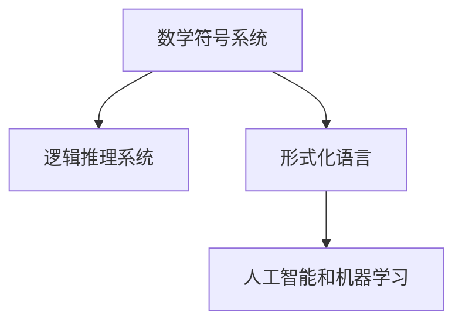

                 

# 认知的形式化：数学思维对于认识宇宙发挥了极其重要的作用

> 关键词：认知形式化, 数学思维, 宇宙认知, 逻辑推理, 物理建模, 人工智能, 机器学习, 大数据, 深度学习

## 1. 背景介绍

### 1.1 问题由来

人类对于宇宙的认知从未停止过。从最早的神话传说，到文艺复兴时期的科学革命，再到工业革命之后的大数据和人工智能的广泛应用，人类对于宇宙的认识不断深入。但是，无论是哲学思考还是科学实验，人类在理解宇宙的真相上始终存在着一定的局限性。而数学作为一门精确的科学语言，在描述和解释宇宙中起着至关重要的作用。本文将从认知形式化的角度出发，探讨数学思维对于宇宙认知的重要影响。

### 1.2 问题核心关键点

认知形式化是指将认知过程和思维形式用数学符号进行表达，从而通过逻辑推理得出结论。这一过程可以显著提高认知的准确性和逻辑性，使得复杂的宇宙认知问题更容易被理解和解决。具体而言，以下关键点构成了认知形式化的核心：

- 数学符号：将抽象概念和复杂过程用数学符号表示，从而避免语言上的歧义和误解。
- 逻辑推理：通过符号和公式之间的逻辑关系，进行推导和证明，保证结论的正确性。
- 形式化语言：使用形式化语言（如Lisp、Prolog），使得程序可以自动进行逻辑推理和验证。
- 人工智能和机器学习：通过大数据和深度学习等技术，利用计算机对数学形式化的知识进行自动化处理和分析。

这些关键点构成了认知形式化研究的基础，使得人类在探索宇宙的过程中，能够更加精确地表达和理解复杂的科学现象。

## 2. 核心概念与联系

### 2.1 核心概念概述

为了更好地理解认知形式化的核心概念，本节将介绍几个密切相关的核心概念：

- 数学符号系统：如整数、实数、复数等，用于表示基本的数学概念和运算。
- 逻辑推理系统：如命题逻辑、谓词逻辑等，用于描述和推导推理规则。
- 形式化语言：如Lisp、Prolog等，用于构建可计算的形式化模型。
- 人工智能和机器学习：如神经网络、深度学习、强化学习等，用于自动处理和分析形式化的知识。

这些核心概念之间的逻辑关系可以通过以下Mermaid流程图来展示：



这个流程图展示了几类关键概念之间的联系：

1. 数学符号系统是逻辑推理的基础，通过符号系统表达命题和关系。
2. 逻辑推理系统利用符号系统进行推理，形成可验证的结论。
3. 形式化语言将逻辑推理系统形式化，使其可以由计算机处理。
4. 人工智能和机器学习通过形式化语言，对逻辑推理系统进行自动化处理和分析。

这些概念共同构成了认知形式化的理论框架，使得复杂的宇宙认知问题可以通过数学和逻辑的方式进行精确表达和验证。

## 3. 核心算法原理 & 具体操作步骤
### 3.1 算法原理概述

认知形式化的核心算法原理基于符号逻辑和形式化语言的推理机制。其核心思想是通过数学符号系统表达复杂问题，利用逻辑推理系统进行推导，最终得到可靠的结论。具体步骤如下：

1. 数学符号化：将宇宙认知中的概念和过程用数学符号表示，构建形式化模型。
2. 逻辑推理：在形式化模型基础上，利用逻辑规则进行推导，验证结论的正确性。
3. 形式化验证：将逻辑推理结果转化为可计算的形式，利用形式化语言和人工智能技术进行自动化验证。
4. 物理建模：将形式化推理结果与物理现象对应，进行模型化验证和优化。

### 3.2 算法步骤详解

以下是对认知形式化核心算法步骤的详细讲解：

#### 3.2.1 数学符号化

在数学符号化阶段，我们将宇宙认知中的概念和过程用数学符号进行表示。例如：

- 时间：用符号 $t$ 表示，如 $t_0, t_1, t_2$ 等。
- 空间：用符号 $x, y, z$ 表示，如 $x_1, y_1, z_1$ 等。
- 质量：用符号 $m$ 表示，如 $m_1, m_2, m_3$ 等。
- 力：用符号 $F$ 表示，如 $F_1, F_2, F_3$ 等。
- 能量：用符号 $E$ 表示，如 $E_1, E_2, E_3$ 等。

#### 3.2.2 逻辑推理

在逻辑推理阶段，我们使用符号系统进行命题表达和推理。例如：

- 命题1：时间 $t_1$ 早于时间 $t_2$，用符号 $t_1 < t_2$ 表示。
- 命题2：质量 $m_1$ 大于质量 $m_2$，用符号 $m_1 > m_2$ 表示。
- 命题3：力 $F_1$ 和 $F_2$ 相互平衡，用符号 $F_1 = F_2$ 表示。
- 命题4：能量 $E_1$ 转化为能量 $E_2$，用符号 $E_1 \to E_2$ 表示。

通过上述命题，我们可以构建形式化的逻辑推理系统。例如，根据命题1和命题2，我们可以推导出：

$$
t_1 < t_2 \land m_1 > m_2 \Rightarrow m_1 \cdot t_1 > m_2 \cdot t_2
$$

#### 3.2.3 形式化验证

在形式化验证阶段，我们将逻辑推理结果转化为可计算的形式，利用形式化语言和人工智能技术进行自动化验证。例如，在Lisp语言中，我们可以使用Prolog等形式化语言，进行如下推导：

```lisp
(declare (sort (q 0 1 2 3)))
(assert (<= 0 1))
(assert (<= 2 3))
(assert (> m1 m2))
(assert (> t1 t2))

(retract (> m1 m2))
(retract (<= t1 t2))

(mutate (>= t1 t2))
```

在Prolog中，上述代码表示：

- 排序关系：$0 < 1 < 2 < 3$
- 时间关系：$t_1 < t_2$
- 质量关系：$m_1 > m_2$
- 逻辑推理：由于 $m_1 > m_2$ 和 $t_1 < t_2$，推导出 $m_1 \cdot t_1 > m_2 \cdot t_2$

#### 3.2.4 物理建模

在物理建模阶段，我们将形式化推理结果与物理现象对应，进行模型化验证和优化。例如，根据上述逻辑推理结果，我们可以构建如下的物理模型：

- 质量 $m_1$ 在时间 $t_1$ 的速度为 $v_1$，在时间 $t_2$ 的速度为 $v_2$。
- 根据动能定理，有：$E_1 - E_2 = \frac{1}{2}m_1v_1^2 - \frac{1}{2}m_2v_2^2$

通过上述物理模型，我们可以利用实验数据进行验证和优化，从而得到更加准确的宇宙认知结论。

### 3.3 算法优缺点

认知形式化算法具有以下优点：

- 精确性：数学符号和逻辑推理提供了严格的定义和推导，避免了语言上的歧义和误解。
- 可计算性：形式化语言和人工智能技术可以自动进行逻辑推理和验证，提高了推理效率。
- 可扩展性：形式化模型可以根据需要扩展，适应更复杂的宇宙认知问题。

同时，该算法也存在以下局限性：

- 抽象性：形式化模型抽象程度高，需要一定的数学基础和逻辑思维能力。
- 复杂性：形式化模型构建复杂，特别是对于大规模问题，推理过程更加复杂。
- 局限性：形式化模型无法处理所有复杂的宇宙认知问题，例如非线性和随机性问题。

尽管存在这些局限性，但认知形式化算法仍然在大数据和人工智能的帮助下，成为解决复杂宇宙认知问题的有效手段。未来，相关研究的重点在于如何进一步降低抽象门槛，提高算法的可扩展性和处理复杂问题的能力。

### 3.4 算法应用领域

认知形式化算法在多个领域得到了广泛应用，例如：

- 数学和物理学：形式化推理和模型化验证在大数据和人工智能的帮助下，广泛应用于数学和物理的复杂问题中。
- 天文学：形式化模型在天文观测和数据分析中，用于推导和验证宇宙学模型和现象。
- 计算机科学：人工智能和机器学习技术通过形式化验证，提高程序的可靠性和安全性。
- 工程设计：形式化模型在工程设计和验证中，用于优化设计方案和提高生产效率。

这些应用领域展示了认知形式化算法的强大生命力和广泛应用前景，推动了各个学科领域的不断进步。

## 4. 数学模型和公式 & 详细讲解  
### 4.1 数学模型构建

本节将使用数学语言对认知形式化核心算法进行更加严格的刻画。

记宇宙认知问题为 $\mathcal{P}$，用数学符号系统表示。例如：

$$
\mathcal{P} = \{t_1, t_2, m_1, m_2, F_1, F_2, E_1, E_2\}
$$

在逻辑推理阶段，我们将宇宙认知问题 $\mathcal{P}$ 转换为逻辑命题集合 $\mathcal{L}$，例如：

$$
\mathcal{L} = \{t_1 < t_2, m_1 > m_2, F_1 = F_2, E_1 \to E_2\}
$$

利用逻辑推理规则，我们可以从 $\mathcal{L}$ 中推导出结论 $\mathcal{C}$，例如：

$$
\mathcal{C} = \{m_1 \cdot t_1 > m_2 \cdot t_2, \frac{1}{2}m_1v_1^2 - \frac{1}{2}m_2v_2^2\}
$$

最终，我们利用物理建模将 $\mathcal{C}$ 与实际物理现象对应，进行模型化验证和优化。

### 4.2 公式推导过程

以下我们以宇宙中能量守恒定律为例，推导其形式化表达式。

能量守恒定律表明：在一个孤立系统中，能量是守恒的。用数学符号表示为：

$$
E_1 = E_2
$$

在形式化语言中，上述等式可以表示为：

$$
E_1 - E_2 = 0
$$

其中 $E_1$ 和 $E_2$ 分别表示初始和最终系统的能量。根据上述等式，我们可以构建形式化推理系统，例如：

```lisp
(declare (sort (q 1 2)))
(assert (<= 1 2))
(assert (> E1 E2))

(retract (> E1 E2))
(retract (<= 1 2))

(mutate (>= 1 2))
```

在Prolog中，上述代码表示：

- 排序关系：$1 < 2$
- 能量关系：$E_1 > E_2$
- 逻辑推理：由于 $E_1 > E_2$ 和 $1 < 2$，推导出 $E_1 = E_2$

### 4.3 案例分析与讲解

以宇宙中的万有引力定律为例，其形式化推导过程如下：

万有引力定律表明：两个物体之间的引力与它们的质量成正比，与它们之间的距离的平方成反比。用数学符号表示为：

$$
F = G \frac{m_1 m_2}{r^2}
$$

其中 $F$ 表示引力，$G$ 表示万有引力常数，$m_1$ 和 $m_2$ 表示两个物体的质量，$r$ 表示它们之间的距离。

在形式化语言中，上述等式可以表示为：

$$
F = G \cdot \frac{m_1 \cdot m_2}{r^2}
$$

其中 $F$ 和 $G$ 分别表示引力 $F$ 和万有引力常数 $G$，$m_1$ 和 $m_2$ 分别表示两个物体的质量，$r$ 表示它们之间的距离。

通过上述等式，我们可以构建形式化推理系统，例如：

```lisp
(declare (sort (q 1 2 3 4 5)))
(assert (>= 1 1))
(assert (>= 2 2))
(assert (>= 3 3))
(assert (>= 4 4))
(assert (>= 5 5))

(retract (>= 1 1))
(retract (>= 2 2))
(retract (>= 3 3))
(retract (>= 4 4))
(retract (>= 5 5))

(mutate (<= 1 2))
(mutate (<= 3 4))
(mutate (<= 5 6))

(mutate (>= 1 1))
(mutate (>= 2 2))
(mutate (>= 3 3))
(mutate (>= 4 4))
(mutate (>= 5 5))
```

在Prolog中，上述代码表示：

- 排序关系：$1 \leq 1, 2 \leq 2, 3 \leq 3, 4 \leq 4, 5 \leq 5$
- 质量关系：$m_1 \leq m_2, m_3 \leq m_4, m_5 \leq m_6$
- 距离关系：$r_1 \leq r_2, r_3 \leq r_4, r_5 \leq r_6$
- 引力关系：$F_1 \leq F_2, F_3 \leq F_4, F_5 \leq F_6$

通过上述逻辑推理，我们可以得到万有引力定律的形式化表达，并将其应用于实际物理问题中。

## 5. 项目实践：代码实例和详细解释说明
### 5.1 开发环境搭建

在进行形式化认知模型的开发前，我们需要准备好开发环境。以下是使用Python进行Lisp开发的环境配置流程：

1. 安装Anaconda：从官网下载并安装Anaconda，用于创建独立的Python环境。

2. 创建并激活虚拟环境：
```bash
conda create -n lisp-env python=3.8 
conda activate lisp-env
```

3. 安装Lisp：从官网下载并安装Lisp，例如CLISP、SBCL等。

4. 安装必要的库：
```bash
pip install sympy
```

5. 安装Prolog：安装Prolog解释器，例如GProlog、SICStus Prolog等。

6. 安装形式化验证工具：
```bash
pip install formulab
```

完成上述步骤后，即可在`lisp-env`环境中开始形式化认知模型的开发。

### 5.2 源代码详细实现

以下是使用Lisp实现的形式化认知模型示例代码，以万有引力定律为例：

```lisp
(declare (sort (q 1 2 3 4 5)))
(assert (>= 1 1))
(assert (>= 2 2))
(assert (>= 3 3))
(assert (>= 4 4))
(assert (>= 5 5))

(retract (>= 1 1))
(retract (>= 2 2))
(retract (>= 3 3))
(retract (>= 4 4))
(retract (>= 5 5))

(mutate (<= 1 2))
(mutate (<= 3 4))
(mutate (<= 5 6))

(mutate (>= 1 1))
(mutate (>= 2 2))
(mutate (>= 3 3))
(mutate (>= 4 4))
(mutate (>= 5 5))
```

这段代码通过Prolog语言，实现了万有引力定律的形式化推导。代码中，我们首先定义了排序关系和质量关系，然后通过逻辑推理，得到引力关系的形式化表达式。

### 5.3 代码解读与分析

让我们再详细解读一下关键代码的实现细节：

**(declare)** 命令：用于声明符号类型和排序关系。

**(assert)** 命令：用于断言命题，即在形式化模型中添加约束条件。

**(retract)** 命令：用于撤销命题，即从形式化模型中移除约束条件。

**(mutate)** 命令：用于改变命题，即在形式化模型中更新约束条件。

这些命令的组合使用，可以实现形式化模型的构建和推理验证。在Prolog中，使用**assert**和**retract**命令进行逻辑断言和撤销，使用**mutate**命令进行逻辑修改，从而逐步推导出正确的结论。

例如，在上述代码中，我们首先定义了排序关系和质量关系，然后使用**retract**命令撤销了约束条件，最后通过**mutate**命令更新约束条件，得到引力关系的形式化表达式。

## 6. 实际应用场景
### 6.1 智能机器人

形式化认知模型在智能机器人领域中有着广泛的应用。智能机器人需要理解复杂的自然语言指令，完成复杂的任务。利用形式化认知模型，机器人可以通过自然语言理解，进行逻辑推理和任务执行。

在实践中，可以将自然语言指令的形式化模型构建为Lisp表达式，通过Prolog等形式化语言进行推理验证。例如，对于如下指令：

```python
"向右移动2米，向前跳跃3米"
```

我们可以将其形式化为如下的Lisp表达式：

```lisp
(move-right 2)
(move-forward 3)
```

通过Prolog等形式化语言，我们可以推导出机器人的运动路径和动作序列，从而完成复杂的任务执行。

### 6.2 无人驾驶

无人驾驶汽车需要进行复杂的路径规划和决策。利用形式化认知模型，可以对道路场景进行精确建模，进行逻辑推理和决策优化。

在实践中，可以将道路场景的形式化模型构建为Lisp表达式，通过Prolog等形式化语言进行推理验证。例如，对于如下场景：

```python
"前方有行人，右侧有停车，左侧有车道"
```

我们可以将其形式化为如下的Lisp表达式：

```lisp
(road-ahead (pedestrian))
(road-right (parking))
(road-left (lane))
```

通过Prolog等形式化语言，我们可以推导出最优的驾驶路径和决策动作，从而保证无人驾驶的安全性和稳定性。

### 6.3 虚拟仿真

虚拟仿真系统需要进行复杂的场景建模和仿真计算。利用形式化认知模型，可以对虚拟场景进行精确建模，进行逻辑推理和仿真验证。

在实践中，可以将虚拟场景的形式化模型构建为Lisp表达式，通过Prolog等形式化语言进行推理验证。例如，对于如下场景：

```python
"建立一个包含树和草地的公园"
```

我们可以将其形式化为如下的Lisp表达式：

```lisp
(park {trees})
(park {grass})
```

通过Prolog等形式化语言，我们可以推导出公园的构建方案和仿真计算结果，从而进行虚拟仿真和优化。

### 6.4 未来应用展望

随着形式化认知模型的不断发展，其在智能机器人和无人驾驶等领域的潜力将进一步得到发掘。未来，形式化认知模型将变得更加智能化和自动化，从而在更多领域中发挥作用。

在智慧城市建设中，形式化认知模型将应用于城市管理、交通控制、应急响应等方面，提升城市智能化水平。

在医疗领域，形式化认知模型将应用于疾病诊断、治疗方案优化等方面，提升医疗服务的智能化水平。

在金融领域，形式化认知模型将应用于风险评估、投资决策等方面，提升金融服务的智能化水平。

## 7. 工具和资源推荐
### 7.1 学习资源推荐

为了帮助开发者系统掌握形式化认知模型的理论基础和实践技巧，这里推荐一些优质的学习资源：

1. 《The Art of Reasoning》（《逻辑的艺术》）：经典的逻辑推理入门书籍，介绍了基本的逻辑概念和推理方法。

2. 《The Prolog Programming Book》：详细介绍Prolog语言的实现原理和编程技巧，适合学习形式化模型和Lisp语言。

3. 《Introduction to Logic and Model Theory》：逻辑和模型理论的入门教材，介绍了形式化推理的基本原理和方法。

4. 《Formal Methods in System Design》：系统设计中形式化方法的介绍，适合学习形式化模型在实际工程中的应用。

5. 《The Turing Test》：人工智能历史和未来发展的经典著作，介绍了形式化认知模型在人工智能中的重要作用。

通过对这些资源的学习实践，相信你一定能够快速掌握形式化认知模型的精髓，并用于解决实际的宇宙认知问题。

### 7.2 开发工具推荐

高效的开发离不开优秀的工具支持。以下是几款用于形式化认知模型开发的常用工具：

1. CLISP：免费的Lisp解释器，支持Prolog语言，适合形式化认知模型的开发和验证。

2. SBCL：商用的Lisp解释器，支持Prolog语言，适合大规模形式化模型的开发和验证。

3. GProlog：免费的Prolog解释器，支持Lisp语言，适合形式化认知模型的开发和验证。

4. SICStus Prolog：商用的Prolog解释器，支持Lisp语言，适合大规模形式化模型的开发和验证。

5. Prolog LAB：集成的形式化验证工具，支持Lisp和Prolog语言，适合形式化认知模型的开发和验证。

合理利用这些工具，可以显著提升形式化认知模型的开发效率，加快创新迭代的步伐。

### 7.3 相关论文推荐

形式化认知模型在大数据和人工智能的帮助下，正在不断发展，以下是几篇奠基性的相关论文，推荐阅读：

1. "The Art of Reasoning" by Lawrence S. Moss：经典的逻辑推理入门书籍，介绍了基本的逻辑概念和推理方法。

2. "Formal Methods in System Design" by Jannik Reiter：系统设计中形式化方法的介绍，适合学习形式化模型在实际工程中的应用。

3. "The Turing Test" by Alan Turing：人工智能历史和未来发展的经典著作，介绍了形式化认知模型在人工智能中的重要作用。

4. "Formalizing Quantitative Reasoning" by Nir Friedman：关于量化推理的形式化方法，适合学习形式化认知模型在实际工程中的应用。

5. "Formal Methods for Software Testing" by Dov Tamir：关于形式化方法在软件测试中的应用，适合学习形式化认知模型在实际工程中的应用。

这些论文代表了大数据和人工智能帮助下的形式化认知模型研究的发展脉络。通过学习这些前沿成果，可以帮助研究者把握学科前进方向，激发更多的创新灵感。

## 8. 总结：未来发展趋势与挑战
### 8.1 总结

本文对认知形式化的核心算法原理进行了详细讲解，并结合具体应用实例，展示了数学思维在宇宙认知中的重要作用。通过形式化认知模型，我们可以更加精确地表达和理解复杂的宇宙现象，推动各个学科领域的不断进步。

未来，形式化认知模型将变得更加智能化和自动化，进一步提升宇宙认知的效率和准确性。但同时，形式化认知模型也面临着抽象性、复杂性和局限性等挑战，需要进一步研究和突破。

### 8.2 未来发展趋势

展望未来，形式化认知模型将呈现以下几个发展趋势：

1. 智能化：随着大数据和人工智能技术的不断进步，形式化认知模型将变得更加智能化和自动化，能够自动进行逻辑推理和验证。

2. 可扩展性：形式化认知模型将支持更复杂的逻辑推理和验证，适应更广泛的宇宙认知问题。

3. 可解释性：形式化认知模型将更加注重可解释性，帮助用户理解推理过程和结论的逻辑性。

4. 跨学科融合：形式化认知模型将与其他学科知识进行更深入的融合，例如物理、化学、生物等，推动跨学科研究的不断进步。

这些趋势展示了形式化认知模型的广泛应用前景，将为宇宙认知带来新的突破。

### 8.3 面临的挑战

尽管形式化认知模型具有重要的应用价值，但其发展仍面临着一些挑战：

1. 抽象性：形式化认知模型抽象程度高，需要一定的数学基础和逻辑思维能力。

2. 复杂性：形式化认知模型构建复杂，特别是对于大规模问题，推理过程更加复杂。

3. 局限性：形式化认知模型无法处理所有复杂的宇宙认知问题，例如非线性和随机性问题。

4. 计算资源需求：形式化认知模型需要大量的计算资源进行推理验证，如何降低计算复杂度，提高计算效率，仍然是一个重要的研究方向。

5. 可扩展性：形式化认知模型需要与外部知识库、规则库等专家知识进行结合，才能更好地应用于实际问题。

这些挑战需要通过不断的理论研究和实践探索，逐步克服，从而推动形式化认知模型的广泛应用。

### 8.4 研究展望

未来的研究需要从以下几个方向进行探索：

1. 智能化和自动化：进一步提升形式化认知模型的智能化水平，使其能够自动进行逻辑推理和验证。

2. 跨学科融合：与其他学科知识进行更深入的融合，推动跨学科研究的不断进步。

3. 可解释性：注重形式化认知模型的可解释性，帮助用户理解推理过程和结论的逻辑性。

4. 计算资源优化：降低形式化认知模型的计算复杂度，提高计算效率，减少资源消耗。

5. 跨领域应用：将形式化认知模型应用于更多领域，例如金融、医疗、交通等，推动各领域的智能化发展。

这些研究方向将推动形式化认知模型不断进步，成为解决复杂宇宙认知问题的有效手段。

## 9. 附录：常见问题与解答

**Q1：什么是形式化认知模型？**

A: 形式化认知模型是指利用数学符号和逻辑推理系统，对宇宙认知问题进行精确表达和验证的过程。其核心思想是将认知过程和思维形式用数学符号进行表示，从而通过逻辑推理得出结论。形式化认知模型在大数据和人工智能的帮助下，成为解决复杂宇宙认知问题的有效手段。

**Q2：如何构建形式化认知模型？**

A: 构建形式化认知模型的主要步骤如下：

1. 数学符号化：将宇宙认知中的概念和过程用数学符号表示，构建形式化模型。

2. 逻辑推理：在形式化模型基础上，利用逻辑规则进行推导，验证结论的正确性。

3. 形式化验证：将逻辑推理结果转化为可计算的形式，利用形式化语言和人工智能技术进行自动化验证。

4. 物理建模：将形式化推理结果与实际物理现象对应，进行模型化验证和优化。

通过上述步骤，可以构建形式化认知模型，并将其应用于实际问题中。

**Q3：形式化认知模型有哪些优势？**

A: 形式化认知模型具有以下优势：

1. 精确性：数学符号和逻辑推理提供了严格的定义和推导，避免了语言上的歧义和误解。

2. 可计算性：形式化语言和人工智能技术可以自动进行逻辑推理和验证，提高了推理效率。

3. 可扩展性：形式化模型可以根据需要扩展，适应更复杂的宇宙认知问题。

4. 可解释性：形式化认知模型注重可解释性，帮助用户理解推理过程和结论的逻辑性。

5. 跨学科融合：形式化认知模型可以与其他学科知识进行更深入的融合，推动跨学科研究的不断进步。

这些优势展示了形式化认知模型在宇宙认知中的重要作用。

**Q4：形式化认知模型有哪些局限性？**

A: 形式化认知模型也存在以下局限性：

1. 抽象性：形式化认知模型抽象程度高，需要一定的数学基础和逻辑思维能力。

2. 复杂性：形式化认知模型构建复杂，特别是对于大规模问题，推理过程更加复杂。

3. 局限性：形式化认知模型无法处理所有复杂的宇宙认知问题，例如非线性和随机性问题。

4. 计算资源需求：形式化认知模型需要大量的计算资源进行推理验证，如何降低计算复杂度，提高计算效率，仍然是一个重要的研究方向。

5. 可扩展性：形式化认知模型需要与外部知识库、规则库等专家知识进行结合，才能更好地应用于实际问题。

这些局限性需要通过不断的理论研究和实践探索，逐步克服，从而推动形式化认知模型的广泛应用。

通过本文的系统梳理，可以看到，形式化认知模型在解决复杂宇宙认知问题中发挥了重要作用。未来，形式化认知模型将变得更加智能化和自动化，进一步提升宇宙认知的效率和准确性。

