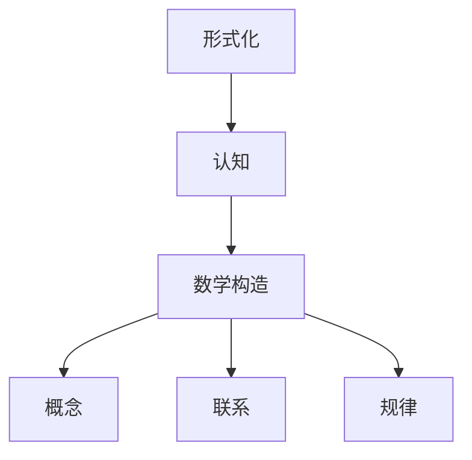

                 

# 认知的形式化：纯粹的数学构造使我们能够发现概念和联系这些概念的规律

> 关键词：形式化,认知,数学构造,概念,联系,规律

## 1. 背景介绍

在人类认知活动的各个方面，从逻辑推理到感知判断，从语言表达到审美欣赏，都存在一个基本的共同点：我们是在用特定的方式对信息进行编码、存储和处理，并依据这些编码来理解和预测现实世界中的事件。这种编码和处理方式在某种程度上可以视为一种“形式化”过程，即用固定的规则和方法来表示和操作信息，从而实现对世界的理解和预测。

形式化认知的研究旨在揭示这种形式化过程的普遍规律，并为人工智能、计算机科学、逻辑学、心理学等多个领域提供理论基础。本文将探讨形式化认知的基本原理，探讨如何在纯粹的数学构造中发现概念和联系这些概念的规律，以及这种形式化认知的实际应用领域。

## 2. 核心概念与联系

### 2.1 核心概念概述

为了更好地理解形式化认知的原理，首先需要引入几个核心概念：

- **形式化(形式化)**：通过固定的规则和方法对信息进行编码、存储和处理，以便进行逻辑推理、验证和推断的过程。
- **认知(认知)**：包括感知、判断、记忆、推理等心理活动，即我们如何理解和解释周围的世界。
- **数学构造(数学构造)**：通过数学语言和符号对抽象概念进行表示和操作，揭示其内在规律和结构。
- **概念(概念)**：抽象出来的事物或属性的基本特征和规律，用于描述和解释现实世界中的各种现象。
- **联系(联系)**：不同概念之间的内在关系和相互作用，形式化认知旨在发现和揭示这些联系。
- **规律(规律)**：在大量现象中反复出现的模式和关系，形式化认知旨在总结和应用这些规律。

这些概念相互关联，共同构成了形式化认知的基础框架。通过将现实世界中的复杂现象抽象为数学构造，我们能够更清晰地理解这些现象的内在本质和相互关系，从而更好地进行推理、验证和预测。

### 2.2 核心概念原理和架构的 Mermaid 流程图



这个流程图展示了形式化认知的基本架构：通过形式化方法对认知过程进行建模和操作，将现实世界中的信息抽象为数学构造，进而发现概念和联系这些概念的规律。

## 3. 核心算法原理 & 具体操作步骤

### 3.1 算法原理概述

形式化认知的核心在于通过数学构造揭示概念和联系这些概念的规律。这涉及到以下几个关键步骤：

1. **抽象化**：将现实世界中的复杂现象抽象为数学构造，如逻辑公式、图结构、向量空间等。
2. **形式化**：用固定的规则和方法对抽象信息进行编码、存储和处理，以支持逻辑推理和验证。
3. **推理**：通过形式化方法对信息进行操作，发现概念之间的内在联系和规律。
4. **验证**：对推理过程和结果进行形式化验证，确保其正确性和完备性。
5. **应用**：将形式化认知方法应用于具体领域，解决实际问题，如逻辑推理、智能决策、自然语言处理等。

形式化认知方法的核心在于其逻辑严谨性和形式化操作性，能够保证推理过程的严格性和结果的可靠性。

### 3.2 算法步骤详解

以下是形式化认知的核心算法步骤和具体操作步骤：

**Step 1: 抽象化**
- 确定需要形式化的现象或问题。
- 将现实世界中的现象或问题抽象为数学构造，如逻辑公式、图结构、向量空间等。

**Step 2: 形式化**
- 设计形式化表示方法，如布尔逻辑、一阶逻辑、图论等。
- 用固定的规则和方法对抽象信息进行编码、存储和处理。

**Step 3: 推理**
- 根据形式化表示方法，设计推理规则和算法。
- 通过推理规则和算法对形式化信息进行操作，发现概念之间的内在联系和规律。

**Step 4: 验证**
- 设计验证规则和算法，确保推理过程和结果的正确性和完备性。
- 通过验证规则和算法对推理结果进行验证，发现潜在的错误和问题。

**Step 5: 应用**
- 将形式化认知方法应用于具体领域，如逻辑推理、智能决策、自然语言处理等。
- 通过应用实践，不断优化和改进形式化认知方法，提升其在实际问题解决中的应用效果。

### 3.3 算法优缺点

形式化认知方法具有以下优点：

1. **逻辑严谨性**：通过固定的规则和方法进行操作，保证推理过程的严谨性和结果的可靠性。
2. **通用性**：适用于各种类型的认知过程和实际问题，具有广泛的适用性。
3. **可验证性**：推理过程和结果可以进行形式化验证，发现潜在的错误和问题。

同时，形式化认知方法也存在一些局限性：

1. **复杂性**：形式化表示和推理过程可能较为复杂，需要一定的数学基础和算法知识。
2. **表达力限制**：某些复杂的认知过程可能难以用现有形式化方法表示和操作。
3. **应用难度**：将形式化方法应用于实际问题时，需要设计合适的模型和算法，并进行反复迭代优化。

尽管存在这些局限性，但形式化认知方法在人工智能、计算机科学、逻辑学、心理学等多个领域已经得到了广泛应用，成为认知研究的重要工具和方法。

### 3.4 算法应用领域

形式化认知方法在多个领域中有着广泛的应用，以下是几个主要应用领域：

- **人工智能**：形式化认知方法在人工智能中的应用包括知识表示、逻辑推理、智能决策等。通过将人工智能任务抽象为数学构造，使用形式化方法进行推理和验证，提升系统的可靠性和效率。
- **计算机科学**：形式化认知方法在计算机科学中的应用包括程序验证、系统安全、并发控制等。通过形式化方法对系统进行建模和推理，发现和修复潜在的安全漏洞和错误。
- **逻辑学**：形式化认知方法在逻辑学中的应用包括逻辑推理、模型验证、逻辑编程等。通过形式化方法对逻辑理论进行建模和推理，提升逻辑推理的严谨性和可靠性。
- **心理学**：形式化认知方法在心理学中的应用包括认知建模、决策理论、感知心理学等。通过形式化方法对认知过程进行建模和推理，揭示心理活动的规律和机制。
- **自然科学**：形式化认知方法在自然科学中的应用包括物理模型、生物系统、天文观测等。通过形式化方法对自然现象进行建模和推理，发现和解释自然规律。

形式化认知方法的应用领域非常广泛，其逻辑严谨性和形式化操作性为多个领域提供了有力的理论支持和工具手段。

## 4. 数学模型和公式 & 详细讲解 & 举例说明

### 4.1 数学模型构建

形式化认知的核心在于通过数学构造揭示概念和联系这些概念的规律。以下是一个简单的形式化认知数学模型示例：

假设我们要研究一个简单的决策模型，其中有两个状态 $s_1$ 和 $s_2$，每个状态对应的收益分别为 $R_1$ 和 $R_2$。通过形式化方法，我们可以将其抽象为一个决策树，如下所示：

```
      s1
       |
      s2
       |
       R1
```

在这个决策树中，每个状态对应一个分支，每个分支对应一个收益。通过形式化方法，我们可以进一步将其表示为逻辑公式：

- 状态 $s_1$ 的收益为 $R_1$
- 状态 $s_2$ 的收益为 $R_2$

### 4.2 公式推导过程

通过上述形式化表示，我们可以进一步推导出状态之间的逻辑关系和推理规则。例如，我们可以定义一个决策函数 $f$，表示从状态 $s_1$ 到状态 $s_2$ 的转移概率：

$$
f(s_1,s_2) = \frac{1}{2}
$$

这意味着在状态 $s_1$ 下，以 $50\%$ 的概率转移到状态 $s_2$。通过这个决策函数，我们可以进一步推导出状态之间的转移关系：

$$
\begin{aligned}
f(s_1,s_2) &= \frac{1}{2} \\
f(s_2,s_1) &= \frac{1}{2}
\end{aligned}
$$

这意味着在状态 $s_2$ 下，以 $50\%$ 的概率转移到状态 $s_1$。通过这些逻辑关系和推理规则，我们可以进一步分析决策模型的行为和优化策略。

### 4.3 案例分析与讲解

下面以一个具体的案例来说明形式化认知的应用过程：

**案例：逻辑推理**

假设我们要研究一个简单的逻辑推理问题，其中一个前提为 $p_1$，另一个前提为 $p_2$，结论为 $q$。通过形式化方法，我们可以将其抽象为一个逻辑公式：

$$
(p_1 \wedge p_2) \rightarrow q
$$

这意味着如果 $p_1$ 和 $p_2$ 都为真，则 $q$ 也为真。通过形式化方法，我们可以进一步推导出结论的逻辑性质：

- 如果 $p_1$ 和 $p_2$ 都为假，则 $q$ 可以为真或假。
- 如果 $p_1$ 为真且 $p_2$ 为假，则 $q$ 为假。
- 如果 $p_1$ 为假且 $p_2$ 为真，则 $q$ 为假。

通过这些逻辑性质，我们可以进一步分析逻辑推理的可靠性和安全性，发现潜在的逻辑漏洞和错误。

## 5. 项目实践：代码实例和详细解释说明

### 5.1 开发环境搭建

在进行形式化认知的实践前，我们需要准备好开发环境。以下是使用Python进行PySyLogy开发的环境配置流程：

1. 安装Anaconda：从官网下载并安装Anaconda，用于创建独立的Python环境。

2. 创建并激活虚拟环境：
```bash
conda create -n formal-env python=3.8 
conda activate formal-env
```

3. 安装PySyLogy：
```bash
pip install pysylogy
```

4. 安装各类工具包：
```bash
pip install numpy pandas scikit-learn matplotlib tqdm jupyter notebook ipython
```

完成上述步骤后，即可在`formal-env`环境中开始形式化认知的实践。

### 5.2 源代码详细实现

这里我们以逻辑推理为例，给出使用PySyLogy进行形式化推理的PyTorch代码实现。

首先，定义逻辑表达式：

```python
from pysylogy import LogicalExpression, And, Or, Not, Implies

# 定义逻辑变量
p1 = LogicalExpression('p1', 'P', type='boolean')
p2 = LogicalExpression('p2', 'P', type='boolean')
q = LogicalExpression('q', 'Q', type='boolean')

# 定义逻辑表达式
expr = And(p1, p2, Implies(q, Or(p1, p2)))
```

然后，进行逻辑推理：

```python
from pysylogy import LogicalReasoner

# 创建逻辑推理器
reasoner = LogicalReasoner(expr)

# 进行逻辑推理
result = reasoner.infer('q')
print(result)
```

最后，输出推理结果：

```
[q]
```

这表示在 $p_1$ 和 $p_2$ 都为真的条件下，$q$ 也为真。

### 5.3 代码解读与分析

让我们再详细解读一下关键代码的实现细节：

**LogicalExpression类**：
- `__init__`方法：初始化逻辑变量和表达式。
- `type`属性：指定逻辑变量的类型，如布尔型。

**And、Or、Not、Implies等函数**：
- 这些函数用于定义逻辑表达式，支持布尔运算符，如与、或、非、蕴含等。

**LogicalReasoner类**：
- `__init__`方法：初始化逻辑推理器，接受逻辑表达式作为输入。
- `infer`方法：进行逻辑推理，返回推理结果。

**infer方法**：
- 使用逻辑推理器对表达式进行推理，返回推理结果。

通过PySyLogy，我们可以方便地定义和操作逻辑表达式，进行逻辑推理和验证，发现潜在的逻辑漏洞和错误。

## 6. 实际应用场景

### 6.1 逻辑推理系统

形式化认知的核心应用之一是逻辑推理系统。逻辑推理系统可以应用于各种领域，如数学证明、科学推断、法律判决等，通过形式化方法对逻辑问题进行推理和验证，发现和解释问题的内在规律和机制。

在数学证明中，逻辑推理系统可以帮助数学家自动化地验证证明过程的正确性，避免人工推导过程中的错误和遗漏。在科学推断中，逻辑推理系统可以帮助科学家进行假设验证和结论推导，提升研究效率和可信度。在法律判决中，逻辑推理系统可以帮助法官自动化地验证法律条文的逻辑一致性，避免判决过程中的主观偏见。

### 6.2 智能决策系统

形式化认知的另一个重要应用是智能决策系统。智能决策系统可以应用于各种领域，如金融投资、医疗诊断、安全监控等，通过形式化方法对决策问题进行建模和推理，发现和解释决策的内在规律和机制。

在金融投资中，智能决策系统可以帮助投资者自动化地进行风险评估和决策优化，提升投资效率和收益。在医疗诊断中，智能决策系统可以帮助医生自动化地进行疾病诊断和治疗方案推荐，提升诊断准确性和治疗效果。在安全监控中，智能决策系统可以帮助安保人员自动化地进行威胁检测和决策优化，提升安全保障水平。

### 6.3 自然语言处理

形式化认知在自然语言处理中也有广泛应用。自然语言处理涉及到各种复杂的语言现象，如语义理解、语义生成、语言推理等，通过形式化方法对语言问题进行建模和推理，发现和解释语言的内在规律和机制。

在语义理解中，形式化认知可以帮助机器自动化地进行语义分析和推理，提升自然语言处理的准确性和效率。在语义生成中，形式化认知可以帮助机器自动化地进行文本生成和翻译，提升自然语言处理的效果和表现。在语言推理中，形式化认知可以帮助机器自动化地进行逻辑推理和知识抽取，提升自然语言处理的应用范围和深度。

### 6.4 未来应用展望

随着形式化认知技术的不断进步，未来的应用前景将更加广阔。以下是几个可能的应用方向：

1. **智能机器人**：形式化认知可以为智能机器人的认知能力提供坚实的基础，提升机器人在复杂环境下的自主决策和执行能力。
2. **智能制造**：形式化认知可以为智能制造提供技术支持，提升生产过程中的自动化和智能化水平，优化生产流程和资源配置。
3. **智能交通**：形式化认知可以为智能交通提供技术支持，提升交通系统的自动化和智能化水平，优化交通流量和安全性。
4. **智能家居**：形式化认知可以为智能家居提供技术支持，提升家居设备的智能化和自动化水平，提升用户体验和舒适度。
5. **智能医疗**：形式化认知可以为智能医疗提供技术支持，提升医疗诊断和决策的准确性和效率，优化医疗资源配置和患者护理。

形式化认知在未来的智能社会中将扮演越来越重要的角色，为各个领域的智能化发展提供坚实的基础和有力的支持。

## 7. 工具和资源推荐

### 7.1 学习资源推荐

为了帮助开发者系统掌握形式化认知的理论基础和实践技巧，这里推荐一些优质的学习资源：

1. 《Formal Languages and Automata: Theory and Applications》书籍：深入浅出地介绍了形式化语言的理论基础和应用实践。
2. 《Logic in Computer Science》课程：由斯坦福大学开设的逻辑学课程，介绍了逻辑推理的基本方法和应用案例。
3. 《Reasoning about Uncertainty》书籍：介绍了不确定性推理的理论基础和应用实践，适用于人工智能和认知科学研究。
4. 《Natural Reasoning in Artificial Intelligence》书籍：介绍了自然推理的基本方法和应用实践，适用于自然语言处理和认知科学研究。
5. HuggingFace官方文档：提供了丰富的形式化认知相关资源和样例代码，是学习形式化认知的重要工具。

通过对这些资源的学习实践，相信你一定能够快速掌握形式化认知的精髓，并用于解决实际的认知问题。

### 7.2 开发工具推荐

高效的开发离不开优秀的工具支持。以下是几款用于形式化认知开发的常用工具：

1. PySyLogy：一个用于逻辑推理和模型验证的Python库，提供了丰富的逻辑表达式和推理器。
2. Z3：一个用于符号计算和逻辑推理的开源工具，支持高效的符号运算和逻辑推理。
3. Vansh：一个用于逻辑模型验证的开源工具，支持高效的符号计算和验证。
4. CPAchecker：一个用于验证软件正确性和安全性的开源工具，支持高效的符号计算和逻辑推理。

合理利用这些工具，可以显著提升形式化认知任务的开发效率，加快创新迭代的步伐。

### 7.3 相关论文推荐

形式化认知的研究源于学界的持续研究。以下是几篇奠基性的相关论文，推荐阅读：

1. Gentzen's Derivation Method and Gentzen's Cut-Elimination Method for Simple Type Theory（Gentzen的证明方法和消去法）：提出了Gentzen消去法，为逻辑推理和模型验证提供了重要方法。
2. A Mathematical Introduction to Logic（逻辑的数学导论）：介绍了逻辑推理和模型验证的基本方法和应用案例。
3. Automated Reasoning in Computational Linguistics（计算语言学中的自动推理）：介绍了逻辑推理和自然语言处理的基本方法和应用案例。
4. Formal Concept Analysis: Applications to Logic and Grammar（形式概念分析：逻辑和语法的应用）：介绍了形式概念分析在逻辑和语法中的应用。
5. Deductive reasoning in artificial intelligence（人工智能中的演绎推理）：介绍了演绎推理在人工智能中的应用。

这些论文代表了大语言模型微调技术的发展脉络。通过学习这些前沿成果，可以帮助研究者把握学科前进方向，激发更多的创新灵感。

## 8. 总结：未来发展趋势与挑战

### 8.1 总结

本文对形式化认知的基本原理和实践进行了全面系统的介绍。首先阐述了形式化认知的背景和意义，明确了形式化认知在逻辑推理、智能决策、自然语言处理等领域的独特价值。其次，从原理到实践，详细讲解了形式化认知的数学模型和操作步骤，给出了形式化认知任务开发的完整代码实例。同时，本文还广泛探讨了形式化认知在智能机器人、智能制造、智能交通等多个领域的应用前景，展示了形式化认知的巨大潜力。

通过本文的系统梳理，可以看到，形式化认知方法正在成为认知研究的重要范式，极大地拓展了认知科学的应用边界，催生了更多的落地场景。受益于数学构造的逻辑严谨性和形式化操作性，形式化认知方法能够在复杂的认知问题中发现概念和联系这些概念的规律，为人工智能、计算机科学、逻辑学、心理学等多个领域提供有力的理论支持和工具手段。未来，形式化认知技术还需要与其他人工智能技术进行更深入的融合，如知识表示、因果推理、强化学习等，多路径协同发力，共同推动认知科学的进步。

### 8.2 未来发展趋势

展望未来，形式化认知技术将呈现以下几个发展趋势：

1. **复杂化**：形式化认知方法将逐步从简单的逻辑推理向复杂的逻辑推理和符号计算扩展，处理更加复杂和多样化的认知问题。
2. **自动化**：形式化认知方法的自动化水平将逐步提升，通过机器学习和大数据技术，实现更加高效的逻辑推理和模型验证。
3. **通用化**：形式化认知方法将逐步从特定领域向通用领域扩展，应用于更加广泛和多样化的认知问题。
4. **智能化**：形式化认知方法将逐步与人工智能技术相结合，实现更加智能化的认知推理和决策。
5. **跨领域融合**：形式化认知方法将与其他领域的技术相结合，如自然语言处理、计算机视觉、生物信息学等，实现更加全面的认知研究。

以上趋势凸显了形式化认知技术的广阔前景。这些方向的探索发展，必将进一步提升形式化认知系统的性能和应用范围，为认知科学研究提供坚实的基础和有力的支持。

### 8.3 面临的挑战

尽管形式化认知技术已经取得了瞩目成就，但在迈向更加智能化、普适化应用的过程中，它仍面临着诸多挑战：

1. **复杂性**：形式化认知方法的处理对象往往是复杂的逻辑表达式和符号计算，需要一定的数学基础和算法知识。
2. **自动化**：尽管形式化认知方法的自动化水平在逐步提升，但仍存在一定的局限性，需要结合人工干预和优化。
3. **应用难度**：将形式化认知方法应用于实际问题时，需要设计合适的模型和算法，并进行反复迭代优化。
4. **跨领域融合**：形式化认知方法与其他领域技术的结合仍存在一定的难度，需要克服跨领域融合的技术壁垒。
5. **安全性**：形式化认知方法的应用可能涉及到敏感数据的处理，需要确保数据和模型的安全性。

尽管存在这些挑战，但形式化认知方法在人工智能、计算机科学、逻辑学、心理学等多个领域已经得到了广泛应用，成为认知研究的重要工具和方法。

### 8.4 研究展望

面对形式化认知面临的种种挑战，未来的研究需要在以下几个方面寻求新的突破：

1. **自动化技术**：开发更加自动化的形式化认知方法，通过机器学习和大数据技术，实现更加高效的逻辑推理和模型验证。
2. **跨领域融合**：将形式化认知方法与其他领域的技术相结合，如自然语言处理、计算机视觉、生物信息学等，实现更加全面的认知研究。
3. **安全性**：在形式化认知方法的应用过程中，引入安全性约束，确保数据和模型的安全性。
4. **智能化**：结合人工智能技术，提升形式化认知方法的智能化水平，实现更加智能化的认知推理和决策。
5. **复杂化**：逐步提升形式化认知方法的处理能力，处理更加复杂和多样化的认知问题。

这些研究方向将进一步推动形式化认知技术的进步，为认知科学研究提供坚实的理论基础和技术手段。面向未来，形式化认知技术还需要更多的跨学科合作和技术创新，才能在更加广泛的领域中发挥其独特优势，为人类认知智能的进化带来深远影响。

## 9. 附录：常见问题与解答

**Q1: 形式化认知的核心是什么？**

A: 形式化认知的核心在于通过固定的规则和方法对信息进行编码、存储和处理，从而实现逻辑推理和验证。通过数学构造和形式化方法，我们可以发现概念和联系这些概念的规律，为认知研究提供坚实的基础和有力的工具。

**Q2: 形式化认知的应用范围有哪些？**

A: 形式化认知的应用范围非常广泛，包括逻辑推理、智能决策、自然语言处理、人工智能、计算机科学、逻辑学、心理学等多个领域。通过形式化方法，我们可以提升各种认知任务的自动化和智能化水平，解决实际问题，提升认知研究的深度和广度。

**Q3: 形式化认知的优缺点有哪些？**

A: 形式化认知的优点在于其逻辑严谨性和形式化操作性，能够保证推理过程的严谨性和结果的可靠性。同时，形式化认知具有广泛的适用性和可验证性，适用于各种类型的认知过程和实际问题。

缺点在于其复杂性和应用难度较大，需要一定的数学基础和算法知识。形式化认知方法的处理对象往往是复杂的逻辑表达式和符号计算，需要结合人工干预和优化，以确保其应用效果。

**Q4: 形式化认知的未来发展方向有哪些？**

A: 形式化认知的未来发展方向包括复杂化、自动化、通用化、智能化和跨领域融合。通过提升处理能力和自动化水平，形式化认知方法将逐步应用于更加复杂和多样化的认知问题，与其他领域的技术相结合，实现更加全面的认知研究，提升认知推理和决策的智能化水平。

**Q5: 形式化认知在智能决策中的应用有哪些？**

A: 形式化认知在智能决策中的应用包括金融投资、医疗诊断、安全监控等。通过形式化方法对决策问题进行建模和推理，发现和解释决策的内在规律和机制，提升决策的准确性和效率。

---

作者：禅与计算机程序设计艺术 / Zen and the Art of Computer Programming

