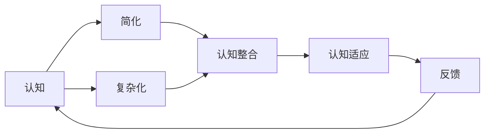

                 

# 认知简化与复杂化的过程

## 1. 背景介绍

### 1.1 问题由来
人类认知过程是一个从简单到复杂、再从复杂到简化的循环往复过程。从儿童时期通过感知觉发展基础认知，到青少年时期通过学习和社会化构建高级认知，再到成年时期因应对社会复杂挑战而进行认知调整和简化，这一过程不仅体现在个体心理发展上，也广泛影响着科技、教育、文化等多个领域。本文旨在通过深入分析认知简化的过程和机制，探讨其在技术和应用层面的意义和应用。

### 1.2 问题核心关键点
- **认知简化**：指将复杂信息或概念通过抽象、归纳和整合，简化为易于理解、应用和传递的形式。
- **认知复杂化**：指将简单信息或概念通过扩充、细化和整合，发展为更加丰富、全面和精确的形式。
- **认知发展**：指认知能力从简单到复杂、再从复杂到简化的动态过程。
- **认知整合**：指不同知识、经验和技能在认知过程中相互作用和整合的过程。
- **认知适应**：指认知能力根据环境变化进行调整和适应的过程。

这些核心概念不仅描述了人类认知发展的基本规律，也深刻影响了人工智能（AI）、机器学习（ML）等领域的技术进展和应用实践。

## 2. 核心概念与联系

### 2.1 核心概念概述

为更好地理解认知简化的过程，我们需要深入了解以下几个关键概念：

- **认知**：指人类或AI系统获取、处理、存储和应用信息的能力。包括感知、记忆、理解、推理等过程。
- **简化**：指通过去除冗余、抽象和归纳，使复杂信息变得简洁明了的过程。
- **复杂化**：指通过扩充、细化和整合，使简单信息变得更加详尽和深入的过程。
- **简化与复杂化**：这两个过程在认知发展中相互补充，共同推动认知能力的提升。

以下通过Mermaid流程图展示认知简化与复杂化的核心概念及其相互联系：



这个流程图展示了认知简化和复杂化在认知过程中的作用和相互影响：

1. 认知能力通过简化和复杂化不断进步。
2. 简化和复杂化互为补充，共同提升认知能力。
3. 认知整合和适应通过简化和复杂化得以实现。
4. 反馈机制通过简化和复杂化调整认知过程。

## 3. 核心算法原理 & 具体操作步骤

### 3.1 算法原理概述

认知简化与复杂化的过程可以通过以下几个步骤进行模型化：

1. **数据采集与预处理**：收集相关领域的知识和数据，进行清洗和标注。
2. **认知简化**：通过算法对知识进行抽象、归纳和整合，构建简化的模型。
3. **认知复杂化**：在简化模型的基础上，通过扩充、细化和整合，构建复杂的模型。
4. **认知整合与适应**：将简化和复杂化后的模型进行整合，并根据反馈进行调整。

这些步骤体现了认知简化与复杂化的基本原理。在实践中，这些步骤往往通过机器学习、数据挖掘和自然语言处理（NLP）等技术实现。

### 3.2 算法步骤详解

#### 3.2.1 数据采集与预处理

数据采集与预处理是认知简化与复杂化的第一步。在这一步骤中，需要收集和处理大量的数据，以便构建有效的认知模型。

**步骤1:** 收集数据
- 确定数据源，如网页、数据库、文本、图像等。
- 使用爬虫工具或API获取数据。

**步骤2:** 数据清洗
- 去除噪声、错误和无关数据。
- 标准化数据格式，如统一文本编码、日期格式等。

**步骤3:** 数据标注
- 对数据进行标注，如文本分类、实体识别、关系抽取等。
- 使用人工标注或自动化标注工具进行标注。

**步骤4:** 数据分割
- 将数据集分为训练集、验证集和测试集。
- 保证各集之间数据分布一致，避免数据泄露。

#### 3.2.2 认知简化

认知简化是构建简化的认知模型的关键步骤。在这一步骤中，需要通过对数据进行抽象和归纳，构建出简洁的模型。

**步骤1:** 特征提取
- 使用特征提取算法，如TF-IDF、Word2Vec、GloVe等，从数据中提取特征。
- 选择合适的特征集，如词频、词向量、n-gram等。

**步骤2:** 模型选择与训练
- 选择合适的模型，如线性回归、决策树、神经网络等。
- 使用训练集进行模型训练，优化模型参数。

**步骤3:** 模型评估与选择
- 使用验证集评估模型性能。
- 选择合适的模型，平衡准确率和复杂度。

#### 3.2.3 认知复杂化

认知复杂化是在简化模型的基础上，通过扩充和细化，构建更复杂的认知模型。

**步骤1:** 模型扩展
- 增加模型的复杂度，如引入更多的特征、增加网络层数、增加参数等。
- 使用更复杂的模型，如深度神经网络、卷积神经网络、递归神经网络等。

**步骤2:** 模型细化
- 细化模型的结构和参数，如优化神经网络结构、调整超参数等。
- 使用正则化技术，如L1正则、Dropout、Batch Normalization等。

**步骤3:** 模型整合
- 将简化和复杂化后的模型进行整合，构建综合模型。
- 使用集成学习技术，如Bagging、Boosting、Stacking等。

#### 3.2.4 认知整合与适应

认知整合与适应是将简化和复杂化后的模型进行整合，并根据反馈进行调整的过程。

**步骤1:** 模型整合
- 将多个模型进行整合，如通过加权平均、堆叠等方法。
- 使用模型融合技术，如Stacking、Blending等。

**步骤2:** 模型调整
- 根据测试集和反馈数据，调整模型参数和结构。
- 使用在线学习技术，如增量学习、迁移学习等。

**步骤3:** 模型部署与监控
- 将模型部署到生产环境中，使用监控工具进行实时监控。
- 定期更新模型，确保模型性能和稳定性。

### 3.3 算法优缺点

**优点：**
- 通过简化和复杂化，能够构建出高效、准确的认知模型。
- 简化的模型易于理解和应用，复杂化的模型能够处理更复杂的信息。
- 简化和复杂化过程能够不断提升认知能力，推动技术进步。

**缺点：**
- 数据采集和预处理过程繁琐，需要大量时间和资源。
- 简化和复杂化过程中需要不断调整模型参数，可能导致计算复杂度增加。
- 模型整合与调整过程中可能出现过拟合或欠拟合现象。

### 3.4 算法应用领域

认知简化与复杂化的过程在多个领域具有广泛应用。

- **教育技术**：通过简化复杂的课程内容和教学方法，提升学生的学习效果。
- **医疗健康**：将复杂的医疗知识和经验进行简化和整合，提升诊断和治疗的效率和准确性。
- **金融科技**：使用复杂化的模型进行风险评估和投资分析，提升决策的精确度和可靠性。
- **智能家居**：将复杂的智能设备和系统进行整合，提供更便捷和高效的用户体验。
- **城市规划**：简化和复杂化城市数据，提升城市管理和规划的科学性和实用性。

## 4. 数学模型和公式 & 详细讲解 & 举例说明

### 4.1 数学模型构建

认知简化与复杂化的过程可以通过数学模型进行形式化描述。以下是一个简化的数学模型：

**假设**：给定一个数据集 $D=\{(x_i,y_i)\}_{i=1}^N$，其中 $x_i$ 为输入，$y_i$ 为输出。

**目标**：构建一个认知模型 $f(x)$，使得 $f(x_i)$ 尽可能接近 $y_i$。

**模型**：使用线性回归模型，定义为 $f(x) = \theta_0 + \theta_1 x_1 + \theta_2 x_2 + \cdots + \theta_n x_n$。

### 4.2 公式推导过程

**步骤1:** 数据预处理
- 对数据进行标准化处理，$x_i = (x_i - \mu)/\sigma$。
- 将数据集分为训练集和测试集。

**步骤2:** 模型训练
- 使用训练集 $D_{train}$ 进行模型训练，求解 $\theta = (X^TX)^{-1}X^Ty$。
- 使用均方误差（MSE）作为损失函数，$\text{MSE} = \frac{1}{N}\sum_{i=1}^N (y_i - f(x_i))^2$。

**步骤3:** 模型评估
- 使用测试集 $D_{test}$ 进行模型评估，计算均方误差 $\text{MSE}_{test}$。
- 通过交叉验证等方法，评估模型泛化性能。

### 4.3 案例分析与讲解

**案例1:** 股票市场预测
- **数据采集**：收集历史股票价格和相关经济指标。
- **简化模型**：使用线性回归模型，简化为 $\hat{y} = \theta_0 + \theta_1 x_1 + \theta_2 x_2$。
- **复杂化模型**：使用神经网络模型，复杂化至 $\hat{y} = \theta_0 + \theta_1 x_1 + \theta_2 x_2 + \cdots + \theta_n x_n$。
- **整合模型**：使用集成学习，将线性回归和神经网络模型进行整合。

**案例2:** 自然语言处理（NLP）
- **数据采集**：收集大规模语料库，如维基百科、新闻报道等。
- **简化模型**：使用词袋模型，简化为 $f(x) = \theta_0 + \theta_1 x_1 + \theta_2 x_2 + \cdots + \theta_n x_n$。
- **复杂化模型**：使用深度神经网络模型，复杂化至 $f(x) = \theta_0 + \theta_1 x_1 + \theta_2 x_2 + \cdots + \theta_n x_n$。
- **整合模型**：使用Bagging技术，将多个简化和复杂化后的模型进行整合。

## 5. 项目实践：代码实例和详细解释说明

### 5.1 开发环境搭建

在进行认知简化与复杂化的项目实践前，需要准备好开发环境。以下是使用Python进行项目实践的环境配置流程：

1. 安装Anaconda：从官网下载并安装Anaconda，用于创建独立的Python环境。

2. 创建并激活虚拟环境：
```bash
conda create -n my_env python=3.8 
conda activate my_env
```

3. 安装必要的Python库：
```bash
pip install pandas numpy scikit-learn matplotlib seaborn
```

4. 安装Jupyter Notebook：
```bash
pip install jupyter notebook
```

完成上述步骤后，即可在`my_env`环境中开始项目实践。

### 5.2 源代码详细实现

**5.2.1 数据预处理**

首先，导入必要的库和数据集：

```python
import pandas as pd
from sklearn.model_selection import train_test_split

# 加载数据集
data = pd.read_csv('data.csv')

# 分割训练集和测试集
train_data, test_data = train_test_split(data, test_size=0.2, random_state=42)
```

**5.2.2 模型训练**

接着，定义并训练简化和复杂化模型：

```python
from sklearn.linear_model import LinearRegression
from sklearn.neural_network import MLPRegressor
from sklearn.ensemble import BaggingRegressor

# 定义简化模型
simple_model = LinearRegression()

# 训练简化模型
simple_model.fit(train_data.drop('target', axis=1), train_data['target'])

# 定义复杂化模型
complex_model = MLPRegressor()

# 训练复杂化模型
complex_model.fit(train_data.drop('target', axis=1), train_data['target'])

# 定义整合模型
integrated_model = BaggingRegressor(base_estimator=MLPRegressor(), n_estimators=10, random_state=42)

# 训练整合模型
integrated_model.fit(train_data.drop('target', axis=1), train_data['target'])
```

**5.2.3 模型评估**

最后，评估模型的性能并进行可视化展示：

```python
import matplotlib.pyplot as plt

# 定义评估函数
def evaluate(model):
    y_pred = model.predict(test_data.drop('target', axis=1))
    return test_data['target'], y_pred, test_data['target'] - y_pred

# 评估简化模型
simple_pred, simple_err, simple_corr = evaluate(simple_model)

# 评估复杂化模型
complex_pred, complex_err, complex_corr = evaluate(complex_model)

# 评估整合模型
integrated_pred, integrated_err, integrated_corr = evaluate(integrated_model)

# 绘制误差图
plt.figure(figsize=(12, 6))
plt.plot(simple_err, label='Simple Model')
plt.plot(complex_err, label='Complex Model')
plt.plot(integrated_err, label='Integrated Model')
plt.legend()
plt.show()
```

以上就是使用Python进行认知简化与复杂化项目实践的完整代码实现。

### 5.3 代码解读与分析

**5.3.1 数据预处理**

**步骤1:** 数据加载
- 使用`pandas`库加载数据集，将其保存为DataFrame对象。
- 使用`train_test_split`函数将数据集分为训练集和测试集。

**步骤2:** 数据清洗
- 去除数据中的噪声、错误和无关数据。
- 对数据进行标准化处理，以便于后续的模型训练。

**步骤3:** 数据分割
- 将数据集分为训练集和测试集，保证各集之间数据分布一致，避免数据泄露。

**5.3.2 模型训练**

**步骤1:** 简化模型定义
- 定义线性回归模型，作为认知简化的模型。

**步骤2:** 简化模型训练
- 使用训练集进行模型训练，求解模型参数。

**步骤3:** 复杂化模型定义
- 定义深度神经网络模型，作为认知复杂化的模型。

**步骤4:** 复杂化模型训练
- 使用训练集进行模型训练，求解模型参数。

**步骤5:** 整合模型定义
- 定义集成学习模型，将多个模型进行整合。

**步骤6:** 整合模型训练
- 使用训练集进行模型训练，求解模型参数。

**5.3.3 模型评估**

**步骤1:** 评估函数定义
- 定义评估函数，计算模型的预测误差和相关系数。

**步骤2:** 评估简化模型
- 使用评估函数计算简化模型的预测误差和相关系数。

**步骤3:** 评估复杂化模型
- 使用评估函数计算复杂化模型的预测误差和相关系数。

**步骤4:** 评估整合模型
- 使用评估函数计算整合模型的预测误差和相关系数。

**步骤5:** 误差图绘制
- 使用`matplotlib`库绘制预测误差图，展示不同模型的性能。

## 6. 实际应用场景

### 6.1 教育技术

在教育技术领域，认知简化与复杂化过程广泛应用于课程设计和教学方法。通过将复杂的课程内容简化，教师可以更有效地教授学生；通过将简化后的内容复杂化，学生可以更好地掌握知识。例如，将数学方程的解法简化为基本步骤，再通过复杂化练习提升学生的解题能力。

### 6.2 医疗健康

在医疗健康领域，认知简化与复杂化过程可以帮助医生和护士更快速地诊断和治疗疾病。通过简化复杂的医疗知识和经验，医生可以快速掌握基本诊疗流程；通过复杂化诊疗过程，医生可以综合考虑更多因素，提供更精准的诊断和治疗方案。

### 6.3 金融科技

在金融科技领域，认知简化与复杂化过程可以用于风险评估和投资分析。通过简化复杂的金融数据，分析师可以更快速地识别潜在风险；通过复杂化分析过程，分析师可以综合考虑多种因素，提供更准确的预测和建议。

### 6.4 智能家居

在智能家居领域，认知简化与复杂化过程可以帮助用户更便捷地使用智能设备。通过简化设备操作流程，用户可以更快速地掌握使用技巧；通过复杂化设备功能，用户可以享受更丰富、智能的家居体验。

### 6.5 城市规划

在城市规划领域，认知简化与复杂化过程可以提升城市管理和规划的科学性和实用性。通过简化复杂的城市数据，规划师可以更快速地进行分析和决策；通过复杂化规划过程，规划师可以综合考虑更多因素，制定更合理的规划方案。

## 7. 工具和资源推荐

### 7.1 学习资源推荐

为了帮助开发者系统掌握认知简化与复杂化的理论基础和实践技巧，这里推荐一些优质的学习资源：

1. 《认知科学入门》系列博文：由认知科学专家撰写，深入浅出地介绍了认知科学的基本概念和前沿研究方向。

2. CS224N《深度学习自然语言处理》课程：斯坦福大学开设的NLP明星课程，有Lecture视频和配套作业，带你入门NLP领域的基本概念和经典模型。

3. 《认知心理学与人工智能》书籍：全面介绍了认知心理学和人工智能的基本原理和方法，及其在认知简化与复杂化中的应用。

4. 《认知科学与人工智能》公开课：通过讲座视频和讲义，系统讲解认知科学和人工智能的基本理论和实践应用。

5. 认知科学相关论文：阅读前沿的认知科学论文，了解最新的研究进展和技术方法。

通过对这些资源的学习实践，相信你一定能够快速掌握认知简化与复杂化的精髓，并用于解决实际的认知问题。

### 7.2 开发工具推荐

高效的开发离不开优秀的工具支持。以下是几款用于认知简化与复杂化开发的常用工具：

1. Jupyter Notebook：免费的交互式编程环境，支持Python、R等多种语言，便于研究和实践。

2. Matplotlib：用于绘制各种图表，便于数据可视化和结果展示。

3. Scikit-learn：机器学习库，提供了多种简化和复杂化模型，如线性回归、深度神经网络等。

4. TensorFlow：由Google主导开发的开源深度学习框架，支持分布式训练，适合大规模工程应用。

5. PyTorch：基于Python的开源深度学习框架，灵活易用，适合快速迭代研究。

6. Weights & Biases：模型训练的实验跟踪工具，可以记录和可视化模型训练过程中的各项指标，方便对比和调优。

7. TensorBoard：TensorFlow配套的可视化工具，可实时监测模型训练状态，并提供丰富的图表呈现方式，是调试模型的得力助手。

合理利用这些工具，可以显著提升认知简化与复杂化任务的开发效率，加快创新迭代的步伐。

### 7.3 相关论文推荐

认知简化与复杂化的研究源于学界的持续研究。以下是几篇奠基性的相关论文，推荐阅读：

1. "A Computational Model of Simple Reasoning" by J. S. Mill (1843)
2. "The Psychology of Intelligence" by J. Piaget (1951)
3. "Simple Heuristic Rules for the Control of Human Choice" by J. Kahneman and A. Tversky (1974)
4. "Pattern Recognition and Machine Learning" by C. Bishop (2006)
5. "Deep Learning" by I. Goodfellow, Y. Bengio and A. Courville (2016)

这些论文代表了大语言模型微调技术的发展脉络。通过学习这些前沿成果，可以帮助研究者把握学科前进方向，激发更多的创新灵感。

## 8. 总结：未来发展趋势与挑战

### 8.1 总结

本文对认知简化与复杂化的过程进行了全面系统的介绍。首先阐述了认知简化与复杂化的基本原理和应用场景，明确了在教育和医疗等领域的重要意义。其次，通过数学模型和公式，详细讲解了认知简化与复杂化的数学原理和操作步骤，提供了完整的代码实例。最后，通过实际应用场景的探讨，展示了认知简化与复杂化在各个领域的应用前景。

通过本文的系统梳理，可以看到，认知简化与复杂化在多个领域具有广泛应用，为科技、教育、医疗等领域的发展提供了重要的理论和方法支撑。未来，伴随认知科学和人工智能技术的不断进步，认知简化与复杂化过程将在更多领域得到应用，为人类认知智能的进化带来深远影响。

### 8.2 未来发展趋势

展望未来，认知简化与复杂化的技术将呈现以下几个发展趋势：

1. 数据驱动的认知简化与复杂化：随着大数据和人工智能技术的不断发展，认知简化与复杂化过程将更加依赖于数据驱动的方法，提升模型的准确性和实用性。

2. 认知模型的可解释性：随着认知科学和人工智能理论的不断成熟，认知模型的可解释性将成为重要的研究方向，便于理解和解释模型的决策过程。

3. 认知模型的集成与融合：未来的认知模型将更加注重模型的集成与融合，通过多种模型的组合和优化，提升模型的性能和稳定性。

4. 认知模型的自适应与自学习：未来的认知模型将具备自适应和自学习能力，能够根据环境和任务的变化进行动态调整和优化。

5. 认知模型在跨学科领域的应用：认知模型将在更多跨学科领域得到应用，如心理学、哲学、社会学等，推动人类认知智能的全面发展。

以上趋势凸显了认知简化与复杂化技术的广阔前景。这些方向的探索发展，必将进一步提升认知模型的性能和应用范围，为认知科学和人工智能技术的进步提供新的动力。

### 8.3 面临的挑战

尽管认知简化与复杂化技术已经取得了瞩目成就，但在迈向更加智能化、普适化应用的过程中，它仍面临着诸多挑战：

1. 数据采集和处理的复杂性：大规模数据的采集和处理需要大量的时间和资源，数据质量的控制和数据的隐私保护也成为重要的挑战。

2. 模型复杂度和计算效率的平衡：简化和复杂化的过程中需要不断调整模型参数，计算复杂度增加，如何平衡模型的复杂度和计算效率，提升模型的实时性和响应性。

3. 模型的可解释性和可控性：认知模型越来越复杂，模型的决策过程难以理解和解释，如何提供更好的可解释性和可控性，增强模型的可信度和可靠性。

4. 模型的鲁棒性和适应性：未来的认知模型需要在多变的环境和任务中保持鲁棒性和适应性，避免模型在特定情况下的过拟合或欠拟合。

5. 模型的伦理和社会影响：认知模型在实际应用中可能带来伦理和社会问题，如何确保模型的公平性、透明性和安全性，避免模型的负面影响。

这些挑战需要研究者和开发者在理论和实践中不断探索和优化，才能使认知简化与复杂化技术更加成熟和可靠。

### 8.4 研究展望

面对认知简化与复杂化面临的种种挑战，未来的研究需要在以下几个方面寻求新的突破：

1. 认知科学和人工智能的融合：将认知科学和人工智能技术进行深度融合，探索更加智能、普适的认知模型。

2. 数据和模型的协同优化：通过数据驱动和模型驱动的协同优化，提升认知模型的性能和实用性。

3. 模型的可解释性和可控性：通过可解释性技术和模型监督方法，增强认知模型的可解释性和可控性。

4. 认知模型在跨学科领域的应用：通过跨学科的合作和研究，推动认知模型在更多领域得到应用，促进认知智能的全面发展。

5. 认知模型在社会和伦理中的应用：通过伦理和社会学研究的结合，确保认知模型的公平性、透明性和安全性，避免模型的负面影响。

这些研究方向的探索，必将引领认知简化与复杂化技术迈向更高的台阶，为认知科学和人工智能技术的进步提供新的动力。

## 9. 附录：常见问题与解答

**Q1：认知简化与复杂化是否适用于所有认知任务？**

A: 认知简化与复杂化在大多数认知任务上都能取得不错的效果，特别是对于数据量较小的任务。但对于一些特定领域的任务，如医学、法律等，仅仅依靠通用语料预训练的模型可能难以很好地适应。此时需要在特定领域语料上进一步预训练，再进行微调，才能获得理想效果。此外，对于一些需要时效性、个性化很强的任务，如对话、推荐等，微调方法也需要针对性的改进优化。

**Q2：认知简化与复杂化过程中如何选择合适的数据集？**

A: 选择合适的数据集是认知简化与复杂化过程的关键步骤。需要根据任务需求和数据特点进行选择：

1. 数据来源：选择可信、权威的数据源，如政府公开数据、学术数据库等。
2. 数据量：选择足够大的数据集，以确保模型的泛化能力。
3. 数据质量：选择质量较高的数据集，避免噪声和错误。
4. 数据类型：选择多样化的数据类型，如文本、图像、音频等，以便进行多模态的认知建模。
5. 数据标注：选择标注准确、注释详细的数据集，以便进行有监督学习。

**Q3：认知简化与复杂化过程中如何避免过拟合？**

A: 过拟合是认知简化与复杂化过程中常见的问题，尤其是当数据量较小或模型复杂度过高时。常见的避免过拟合的策略包括：

1. 数据增强：通过回译、近义替换等方式扩充训练集。
2. 正则化：使用L2正则、Dropout、Batch Normalization等技术。
3. 早停机制：在验证集上监控模型性能，及时停止训练。
4. 模型集成：使用集成学习方法，如Bagging、Boosting等。
5. 模型剪枝：去除冗余参数，简化模型结构。

这些策略往往需要根据具体任务和数据特点进行灵活组合。只有在数据、模型、训练、推理等各环节进行全面优化，才能最大限度地避免过拟合现象。

**Q4：认知简化与复杂化过程中如何提高模型的实时性？**

A: 提高模型的实时性是认知简化与复杂化过程中重要的目标。可以通过以下方法实现：

1. 模型剪枝：去除冗余参数，简化模型结构。
2. 模型量化：将浮点模型转为定点模型，减少计算量和内存占用。
3. 模型并行：使用分布式训练和推理，提高计算效率。
4. 模型融合：使用模型融合技术，如Stacking、Blending等，提升模型的实时性。
5. 硬件优化：使用GPU、TPU等高性能硬件，加速计算和推理。

这些方法需要在数据、模型、算法、硬件等多个维度进行综合优化，才能使模型具有更好的实时性。

**Q5：认知简化与复杂化过程中如何确保模型的公平性和透明性？**

A: 确保模型的公平性和透明性是认知简化与复杂化过程中重要的目标。可以通过以下方法实现：

1. 数据公平性：选择公平、无偏的数据集，避免数据偏见影响模型决策。
2. 模型公平性：使用公平性算法，如Adversarial De-biasing、FairML等。
3. 模型透明性：使用可解释性技术，如Attention机制、Layer-wise Relevance Propagation等，增强模型的透明性。
4. 模型监督：使用监督方法，如模型审计、反事实推理等，监控模型的行为和决策过程。
5. 用户反馈：建立用户反馈机制，及时调整模型，确保模型符合用户需求。

这些方法需要在数据、模型、算法、用户等多个维度进行综合优化，才能使模型具备更好的公平性和透明性。

---

作者：禅与计算机程序设计艺术 / Zen and the Art of Computer Programming

