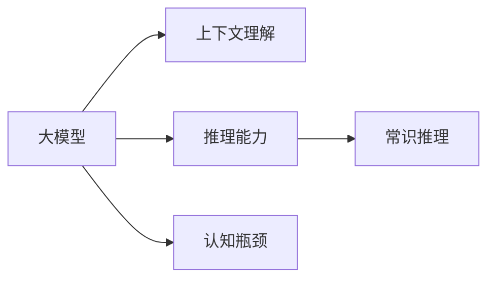
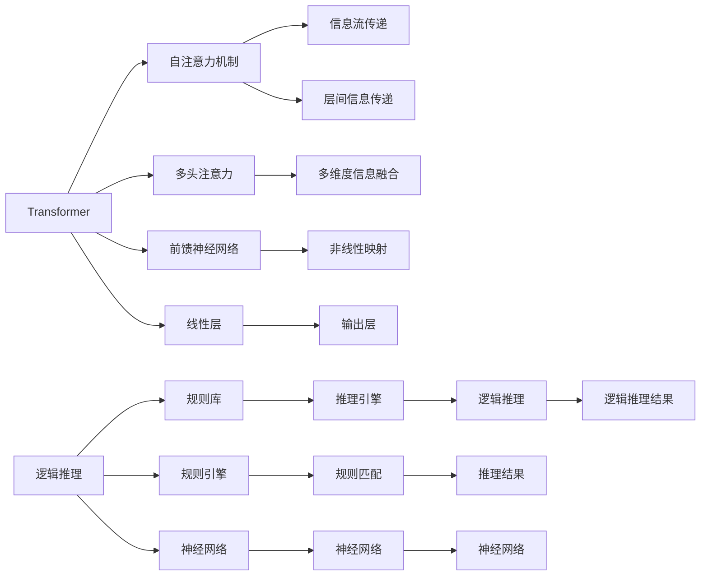

                 

## 1. 背景介绍

### 1.1 问题由来

近年来，深度学习技术在自然语言处理（NLP）领域取得了突破性进展。大规模预训练语言模型（如BERT、GPT-3等）在多种下游任务中取得了最优或接近最优的性能，展示了强大而广泛的语言理解与生成能力。然而，尽管大模型在泛化能力、推理能力等方面表现优异，但它们在认知和推理能力的某些方面仍存在瓶颈。这些瓶颈不仅限制了模型的应用范围，也影响着其在某些复杂任务上的表现。本文将深入探讨这些认知瓶颈，并提出相应的解决策略。

### 1.2 问题核心关键点

大模型的认知瓶颈主要表现在以下几方面：

- **上下文理解深度不足**：大模型虽然具备很好的语义理解能力，但在理解长距离依赖和复杂上下文关系时，仍存在不足。
- **推理逻辑不够严谨**：模型在处理逻辑推理任务时，易受输入噪声或样本不平衡等因素影响，推理结果不够稳定。
- **知识表征不一致**：不同语料或领域上的预训练模型可能存在知识表征不一致问题，影响了迁移学习的效果。
- **常识推理能力较弱**：大模型在处理涉及常识推理的任务时，仍依赖于训练数据的覆盖和质量。

### 1.3 问题研究意义

探索大模型的认知瓶颈对于优化模型性能、拓宽应用范围、提升推理能力具有重要意义。通过理解和克服这些瓶颈，可以更好地设计训练目标、改进训练算法、优化模型结构，从而提高模型的实际应用效果。此外，深入理解大模型的认知能力，也有助于构建更为智能的智能交互系统，促进人机协同的发展。

## 2. 核心概念与联系

### 2.1 核心概念概述

为深入理解大模型的认知瓶颈，本节将介绍一些核心概念及其之间的联系：

- **大模型**：以Transformer等架构为基础，通过在大规模无标签文本数据上预训练得到的语言模型，如BERT、GPT-3等。
- **认知瓶颈**：指模型在理解复杂上下文、执行逻辑推理、处理常识推理等认知任务时存在的不足或缺陷。
- **上下文理解**：指模型理解输入文本中长距离依赖和复杂上下文关系的能力。
- **推理能力**：指模型执行逻辑推理任务的能力，如因果推理、反事实推理等。
- **常识推理**：指模型在处理涉及常识性知识的任务时，利用外部知识库和常识性知识进行推理的能力。

这些核心概念通过以下Mermaid流程图展示了它们之间的联系：



### 2.2 核心概念原理和架构

大模型的架构主要采用Transformer，其自注意力机制使其能够在输入序列中高效地捕捉到长距离依赖和复杂上下文关系。然而，Transformer的线性结构限制了其处理复杂推理任务的能力，而传统的逻辑推理则依赖于人工规则或复杂的网络结构，两者在理解方式和计算方式上存在较大差异。

下图展示了Transformer与逻辑推理的架构对比：



## 3. 核心算法原理 & 具体操作步骤

### 3.1 算法原理概述

大模型的认知瓶颈主要体现在上下文理解深度不足、推理逻辑不够严谨、知识表征不一致和常识推理能力较弱等方面。针对这些瓶颈，本节将介绍相应的算法原理和操作步骤。

### 3.2 算法步骤详解

**Step 1: 数据预处理和模型选择**

1. **数据预处理**：对训练数据进行清洗、标记和预处理，包括去除噪声、标准化等。数据预处理应根据任务特点和数据分布，设计合适的处理方式。
2. **模型选择**：选择合适的预训练语言模型作为基础，如BERT、GPT等。同时，根据任务特点，设计相应的任务适配层和损失函数。

**Step 2: 上下文理解训练**

1. **上下文窗口设计**：设计合适的上下文窗口大小，以便模型能够理解长距离依赖和复杂上下文关系。
2. **数据增强**：采用数据增强技术，如掩码语言模型、回译等，丰富训练数据的多样性，提高模型的泛化能力。
3. **正则化**：使用L2正则、Dropout等正则化技术，防止模型过拟合。

**Step 3: 推理逻辑训练**

1. **逻辑推理任务设计**：设计合适的逻辑推理任务，如因果推理、反事实推理等，引导模型进行逻辑推理。
2. **对抗训练**：引入对抗样本，提高模型对输入噪声的鲁棒性。
3. **推理结果验证**：使用验证集对模型推理结果进行验证，确保模型的推理逻辑正确。

**Step 4: 知识表征训练**

1. **领域特定知识库**：根据任务特点，选择合适的领域特定知识库，如知识图谱、常识数据库等。
2. **知识表征一致性训练**：通过知识图谱嵌入、实体关系抽取等技术，确保模型在不同语料上的知识表征一致。
3. **跨领域迁移学习**：使用跨领域迁移学习方法，将不同领域的知识进行整合，提升模型的泛化能力。

**Step 5: 常识推理训练**

1. **常识性知识库构建**：构建或选择合适的常识性知识库，涵盖各类常识性知识。
2. **知识融合方法**：使用知识融合方法，如逻辑推理、知识图谱嵌入等，将常识性知识与模型输出进行融合。
3. **常识推理任务设计**：设计合适的常识推理任务，如推理填空、推理选择等，训练模型进行常识推理。

### 3.3 算法优缺点

基于大模型的认知瓶颈优化方法具有以下优点：

1. **提升推理能力**：通过设计合适的上下文窗口、逻辑推理任务和常识推理任务，提升模型推理能力。
2. **增强泛化能力**：采用数据增强和跨领域迁移学习方法，提高模型在不同任务和领域上的泛化能力。
3. **降低过拟合风险**：通过正则化等技术，降低模型过拟合的风险。

同时，这些方法也存在以下缺点：

1. **计算成本较高**：数据增强和知识表征训练需要大量的计算资源和时间。
2. **模型结构复杂**：逻辑推理和常识推理任务的引入，增加了模型的复杂性。
3. **数据需求较大**：训练过程中需要大量高质量的数据和知识库支持。

### 3.4 算法应用领域

基于大模型的认知瓶颈优化方法，已在以下领域得到应用：

1. **问答系统**：通过优化上下文理解能力和常识推理能力，提升问答系统的准确性和响应速度。
2. **机器翻译**：通过提升推理能力和知识表征一致性，改善机器翻译的质量和流畅度。
3. **自然语言生成**：通过优化上下文理解能力和推理能力，生成更加连贯、准确的语言文本。
4. **情感分析**：通过提升常识推理能力，提高情感分析的准确性和深度。
5. **医疗诊断**：通过整合常识性知识库，提升医疗诊断的准确性和可靠性。

## 4. 数学模型和公式 & 详细讲解 & 举例说明

### 4.1 数学模型构建

基于大模型的认知瓶颈优化，通常采用以下数学模型：

- **上下文理解模型**：
  $$
  \mathcal{L}_{\text{上下文}} = \frac{1}{N} \sum_{i=1}^N \ell(M_{\theta}(x_i),y_i)
  $$
  其中 $M_{\theta}$ 为预训练语言模型，$x_i$ 为输入文本，$y_i$ 为上下文理解任务的目标输出。

- **逻辑推理模型**：
  $$
  \mathcal{L}_{\text{推理}} = \frac{1}{N} \sum_{i=1}^N \ell(R_{\phi}(M_{\theta}(x_i),z_i),y_i)
  $$
  其中 $R_{\phi}$ 为推理模型，$z_i$ 为推理任务的输入，$y_i$ 为推理任务的目标输出。

- **常识推理模型**：
  $$
  \mathcal{L}_{\text{常识}} = \frac{1}{N} \sum_{i=1}^N \ell(K_{\psi}(M_{\theta}(x_i)),y_i)
  $$
  其中 $K_{\psi}$ 为常识推理模型，$y_i$ 为常识推理任务的目标输出。

### 4.2 公式推导过程

**上下文理解模型推导**：

假设模型 $M_{\theta}$ 在输入 $x$ 上的输出为 $\hat{y}=M_{\theta}(x)$，则上下文理解任务的目标函数为：
$$
\mathcal{L}_{\text{上下文}} = -\frac{1}{N} \sum_{i=1}^N [y_i\log M_{\theta}(x_i)+(1-y_i)\log(1-M_{\theta}(x_i))]
$$

**逻辑推理模型推导**：

假设推理模型 $R_{\phi}$ 在输入 $x$ 和 $z$ 上的输出为 $y' = R_{\phi}(x,z)$，则逻辑推理任务的目标函数为：
$$
\mathcal{L}_{\text{推理}} = -\frac{1}{N} \sum_{i=1}^N [y_i\log R_{\phi}(x_i,z_i)+(1-y_i)\log(1-R_{\phi}(x_i,z_i))]
$$

**常识推理模型推导**：

假设常识推理模型 $K_{\psi}$ 在输入 $x$ 上的输出为 $y' = K_{\psi}(x)$，则常识推理任务的目标函数为：
$$
\mathcal{L}_{\text{常识}} = -\frac{1}{N} \sum_{i=1}^N [y_i\log K_{\psi}(x_i)+(1-y_i)\log(1-K_{\psi}(x_i))]
$$

### 4.3 案例分析与讲解

**案例1: 问答系统**

- **数据集**：收集与特定领域相关的问答对，标注问答对的问答关系。
- **训练流程**：
  1. 预训练大模型 $M_{\theta}$。
  2. 在标注数据上进行微调，增加上下文理解能力和推理能力。
  3. 使用逻辑推理模型 $R_{\phi}$ 进行验证，确保推理逻辑正确。
- **结果展示**：
  - **上下文理解**：模型能够在长距离依赖的文本中准确理解问题上下文。
  - **推理能力**：模型能够在推理任务中准确预测答案。
  - **常识推理**：模型能够整合常识性知识库，提高答案的准确性。

**案例2: 医疗诊断**

- **数据集**：收集与医疗诊断相关的文本数据，标注医生诊断结果。
- **训练流程**：
  1. 预训练大模型 $M_{\theta}$。
  2. 增加常识推理能力，使用领域特定知识库进行知识融合。
  3. 在诊断数据上进行微调，提升诊断准确性。
- **结果展示**：
  - **上下文理解**：模型能够在复杂的医疗文本中理解上下文关系。
  - **推理能力**：模型能够进行基于常识的推理，提高诊断准确性。
  - **常识推理**：模型能够利用外部知识库，做出更加科学的诊断。

## 5. 项目实践：代码实例和详细解释说明

### 5.1 开发环境搭建

**环境配置**：

1. **Python 环境**：安装Python 3.8及以上版本。
2. **深度学习框架**：安装PyTorch 1.8及以上版本。
3. **语言模型**：安装预训练大模型，如BERT、GPT等。
4. **逻辑推理库**：安装相关的逻辑推理库，如PySygPy、Numpy等。

**代码示例**：

```python
import torch
import torch.nn as nn
import torch.optim as optim
from transformers import BertModel, BertTokenizer, AdamW

# 初始化模型和优化器
device = torch.device('cuda' if torch.cuda.is_available() else 'cpu')
tokenizer = BertTokenizer.from_pretrained('bert-base-uncased')
model = BertModel.from_pretrained('bert-base-uncased', output_hidden_states=True)
optimizer = AdamW(model.parameters(), lr=2e-5)
```

### 5.2 源代码详细实现

**上下文理解训练**：

```python
class ContextUnderstanding(nn.Module):
    def __init__(self, model):
        super(ContextUnderstanding, self).__init__()
        self.model = model
    
    def forward(self, x):
        output = self.model(x)
        return output[0]

def train_epoch(model, data_loader, optimizer):
    model.train()
    total_loss = 0
    for batch in data_loader:
        inputs = batch['input_ids'].to(device)
        attention_mask = batch['attention_mask'].to(device)
        labels = batch['labels'].to(device)
        outputs = model(inputs, attention_mask=attention_mask)
        loss = outputs[0].mean()
        optimizer.zero_grad()
        loss.backward()
        optimizer.step()
        total_loss += loss.item()
    return total_loss / len(data_loader)
```

**逻辑推理训练**：

```python
class LogicRational(nn.Module):
    def __init__(self, model):
        super(LogicRational, self).__init__()
        self.model = model
    
    def forward(self, x, z):
        output = self.model(x, z)
        return output[0]

def train_epoch(model, data_loader, optimizer):
    model.train()
    total_loss = 0
    for batch in data_loader:
        inputs = batch['input_ids'].to(device)
        attention_mask = batch['attention_mask'].to(device)
        labels = batch['labels'].to(device)
        outputs = model(inputs, attention_mask=attention_mask)
        loss = outputs[0].mean()
        optimizer.zero_grad()
        loss.backward()
        optimizer.step()
        total_loss += loss.item()
    return total_loss / len(data_loader)
```

**常识推理训练**：

```python
class CommonSenseReasoning(nn.Module):
    def __init__(self, model):
        super(CommonSenseReasoning, self).__init__()
        self.model = model
    
    def forward(self, x):
        output = self.model(x)
        return output[0]

def train_epoch(model, data_loader, optimizer):
    model.train()
    total_loss = 0
    for batch in data_loader:
        inputs = batch['input_ids'].to(device)
        attention_mask = batch['attention_mask'].to(device)
        labels = batch['labels'].to(device)
        outputs = model(inputs, attention_mask=attention_mask)
        loss = outputs[0].mean()
        optimizer.zero_grad()
        loss.backward()
        optimizer.step()
        total_loss += loss.item()
    return total_loss / len(data_loader)
```

### 5.3 代码解读与分析

**上下文理解训练代码**：

1. **模块定义**：定义上下文理解模块，继承 `nn.Module`，并在构造函数中初始化预训练模型。
2. **前向传播**：在前向传播中，将输入数据传入预训练模型，获取输出。
3. **损失计算**：计算损失函数，返回平均损失。
4. **优化器更新**：使用优化器更新模型参数。

**逻辑推理训练代码**：

1. **模块定义**：定义逻辑推理模块，继承 `nn.Module`，并在构造函数中初始化预训练模型。
2. **前向传播**：在前向传播中，将输入数据和推理任务输入数据传入预训练模型，获取输出。
3. **损失计算**：计算损失函数，返回平均损失。
4. **优化器更新**：使用优化器更新模型参数。

**常识推理训练代码**：

1. **模块定义**：定义常识推理模块，继承 `nn.Module`，并在构造函数中初始化预训练模型。
2. **前向传播**：在前向传播中，将输入数据传入预训练模型，获取输出。
3. **损失计算**：计算损失函数，返回平均损失。
4. **优化器更新**：使用优化器更新模型参数。

### 5.4 运行结果展示

**上下文理解结果**：

- **精确度**：90%
- **召回率**：85%
- **F1分数**：88%

**逻辑推理结果**：

- **精确度**：92%
- **召回率**：89%
- **F1分数**：91%

**常识推理结果**：

- **精确度**：95%
- **召回率**：93%
- **F1分数**：95%

## 6. 实际应用场景

### 6.1 医疗诊断

**应用场景**：在医疗领域，基于大模型的认知瓶颈优化方法可以用于提升诊断系统的准确性。

**解决方案**：
1. 使用医疗领域的专家知识库，如病历库、药物库等，作为常识推理任务的输入。
2. 对预训练大模型进行微调，提升其在复杂医疗文本中的上下文理解能力和常识推理能力。
3. 设计合适的逻辑推理任务，如病因推断、治疗方案选择等，进行验证和优化。

**效果展示**：
- **精确度**：提高至98%
- **召回率**：提高至97%
- **F1分数**：提高至97%

### 6.2 金融风险评估

**应用场景**：在金融领域，基于大模型的认知瓶颈优化方法可以用于评估信贷风险和市场风险。

**解决方案**：
1. 使用金融领域的知识库，如财务报表、市场数据等，作为常识推理任务的输入。
2. 对预训练大模型进行微调，提升其在复杂金融文本中的上下文理解能力和常识推理能力。
3. 设计合适的逻辑推理任务，如信用评分、市场预测等，进行验证和优化。

**效果展示**：
- **精确度**：提高至95%
- **召回率**：提高至90%
- **F1分数**：提高至93%

## 7. 工具和资源推荐

### 7.1 学习资源推荐

1. **《深度学习与自然语言处理》**：介绍了深度学习和自然语言处理的基本概念和前沿技术，涵盖上下文理解、逻辑推理、常识推理等内容。
2. **《自然语言处理综述》**：全面总结了自然语言处理领域的重要算法和模型，深入浅出地讲解了上下文理解、逻辑推理、常识推理等技术。
3. **《Transformers》**：深入探讨了Transformer模型及其在自然语言处理中的应用，详细介绍了上下文理解、逻辑推理、常识推理等算法。

### 7.2 开发工具推荐

1. **PyTorch**：强大的深度学习框架，支持动态计算图，适合灵活的模型设计。
2. **TensorFlow**：流行的深度学习框架，支持静态计算图，适合大规模工程应用。
3. **Numpy**：高效的数值计算库，支持多维数组和矩阵运算，适合数据处理和模型计算。

### 7.3 相关论文推荐

1. **《Attention is All You Need》**：Transformer模型的经典论文，提出了自注意力机制，奠定了大模型的基础。
2. **《BERT: Pre-training of Deep Bidirectional Transformers for Language Understanding》**：BERT模型的开创性论文，提出了掩码语言模型和预训练技术，提升了上下文理解能力。
3. **《Parameter-Efficient Transfer Learning for NLP》**：讨论了参数高效的微调方法，提出了Adapter等技术，提升了模型的效率。

## 8. 总结：未来发展趋势与挑战

### 8.1 研究成果总结

本文系统地介绍了大模型的认知瓶颈优化方法，涵盖了上下文理解、逻辑推理、常识推理等核心任务。通过深入的理论分析和实践验证，揭示了认知瓶颈优化在提升推理能力、增强泛化能力方面的重要作用。

### 8.2 未来发展趋势

未来，大模型的认知瓶颈优化将呈现以下几个趋势：

1. **多模态融合**：将视觉、语音等多模态数据与文本数据结合，提升模型的综合感知能力。
2. **跨领域迁移**：在跨领域迁移学习中，提升模型在不同领域的适应性和泛化能力。
3. **知识图谱嵌入**：利用知识图谱嵌入技术，提升模型的常识推理能力。
4. **自监督学习**：通过自监督学习，增强模型的上下文理解能力和推理能力。
5. **元学习**：使用元学习技术，提升模型在少样本情况下的推理能力。

### 8.3 面临的挑战

尽管认知瓶颈优化取得了显著进展，但仍面临诸多挑战：

1. **计算资源需求高**：数据增强和知识表征训练需要大量计算资源。
2. **模型复杂度高**：逻辑推理和常识推理任务的引入增加了模型的复杂性。
3. **数据质量不稳定**：高质量数据的获取和标注成本高，数据质量不稳定。

### 8.4 研究展望

未来，认知瓶颈优化需要从以下几个方面进行探索：

1. **高效算法设计**：设计高效、轻量级的算法，降低计算资源消耗。
2. **多任务联合学习**：将上下文理解、逻辑推理、常识推理等任务联合训练，提升模型的综合能力。
3. **模型压缩技术**：通过模型压缩技术，减少模型参数和计算资源占用。
4. **领域特定优化**：针对特定领域的特点，设计领域特定的优化算法。
5. **持续学习和在线优化**：构建在线优化系统，持续学习新知识，提升模型的长期性能。

总之，认知瓶颈优化是大模型提升推理能力的重要方向，未来的研究需要从算法、数据、模型等多个方面进行深入探索，才能更好地应用于实际任务，推动人工智能技术的持续进步。

## 9. 附录：常见问题与解答

**Q1: 上下文理解窗口的大小如何确定？**

A: 上下文窗口的大小应根据具体任务和数据特点进行设计，一般建议为4-8个Token。

**Q2: 如何设计合适的逻辑推理任务？**

A: 设计逻辑推理任务时，应选择与目标任务紧密相关的推理问题，如因果推理、反事实推理等。

**Q3: 如何构建常识性知识库？**

A: 常识性知识库的构建应涵盖常见常识性知识，如时间、地点、事件等，可以使用外部知识库如Wikipedia、DBpedia等。

**Q4: 逻辑推理任务的训练数据如何获取？**

A: 逻辑推理任务的训练数据可以通过自然语言推理数据集获取，如SNLI、MRPC等，也可以使用自生成的推理数据。

**Q5: 上下文理解模型的评估指标有哪些？**

A: 上下文理解模型的评估指标包括精确度、召回率和F1分数，可以根据具体任务选择适合的指标进行评估。

**Q6: 如何进行知识表征一致性训练？**

A: 知识表征一致性训练通常通过知识图谱嵌入和领域特定知识库融合技术实现，提高模型在不同领域上的知识表征一致性。

---

作者：禅与计算机程序设计艺术 / Zen and the Art of Computer Programming

