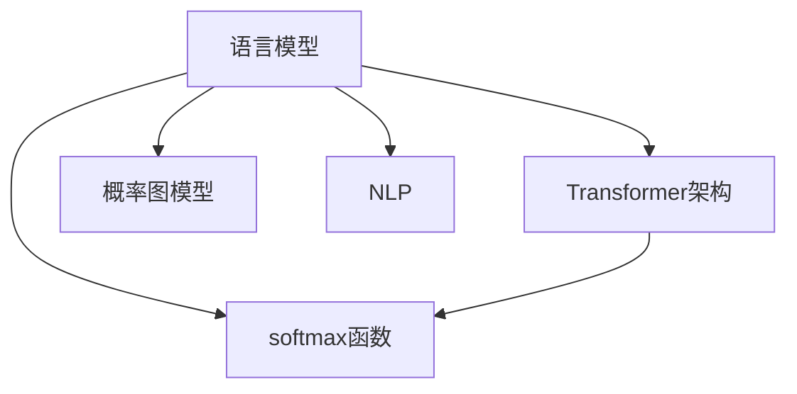

                 

# 语言模型 原理与代码实例讲解

> 关键词：语言模型,Transformer,softmax,概率图模型,自然语言处理,NLP,预训练模型,微调,代码实现

## 1. 背景介绍

### 1.1 问题由来
在自然语言处理（Natural Language Processing, NLP）领域，语言模型（Language Model）扮演着核心角色。语言模型旨在根据上下文信息，预测下一个词汇或字符出现的概率。传统的语言模型基于统计语言模型（Statistical Language Model），通过计算单词或字符序列出现的概率来预测下一个词汇。然而，这种基于统计的方法存在许多局限性，如需要大量标注数据、难以捕捉语义信息等。

近年来，随着深度学习技术的发展，基于神经网络的语言模型，特别是Transformer架构的语言模型，取得了突破性进展。其中，Bert和GPT等模型在自然语言理解、生成等任务上表现出色，为NLP领域带来了新的希望。

本文将从语言模型原理入手，逐步深入介绍其算法原理、操作步骤、应用场景等。同时，通过代码实例，将理论知识与实践结合，帮助读者更好地理解语言模型。

## 2. 核心概念与联系

### 2.1 核心概念概述

为更好地理解语言模型的工作原理，本节将介绍几个核心概念：

- **语言模型**：语言模型是用于预测给定前缀下，下一个词汇或字符的概率分布的数学模型。语言模型在NLP中具有广泛应用，如机器翻译、文本生成、情感分析等。
- **Transformer架构**：Transformer是一种基于自注意力机制的神经网络架构，用于处理序列数据。它通过多头自注意力机制和残差连接，提高了模型的并行性和表示能力，广泛应用于自然语言处理。
- **softmax函数**：softmax函数是一种常用的概率分布函数，将向量转化为概率分布，用于计算输出概率。在语言模型中，softmax函数用于计算每个词汇或字符的输出概率。
- **概率图模型**：概率图模型（Probabilistic Graphical Model）是一种用于表示随机变量之间关系的图模型。语言模型可以视为一种特殊的概率图模型，其中节点表示词汇或字符，边表示词汇之间的依赖关系。
- **自然语言处理（NLP）**：NLP是计算机科学与人工智能领域的一个分支，旨在使计算机能够理解和处理自然语言。语言模型是NLP中的核心技术之一，用于文本理解、生成、分类等任务。

这些核心概念之间的逻辑关系可以通过以下Mermaid流程图来展示：



这个流程图展示了几大核心概念之间的关系：

1. 语言模型是Transformer架构的核心应用之一。
2. softmax函数在语言模型中用于计算输出概率。
3. 概率图模型是语言模型的一种表示形式。
4. 语言模型是NLP领域的重要工具。

这些概念共同构成了语言模型的基础知识框架，为后续深入学习奠定了基础。

## 3. 核心算法原理 & 具体操作步骤
### 3.1 算法原理概述

语言模型的目标是根据给定的上下文，预测下一个词汇或字符的概率分布。形式化地，语言模型 $P(x_1,...,x_n)$ 表示在给定上下文 $x_1,...,x_{n-1}$ 下，输出词汇 $x_n$ 的概率分布。

具体而言，语言模型可以定义为一个概率图模型，其中节点表示词汇或字符，边表示词汇之间的依赖关系。例如，一个简单的二元语言模型可以表示为：

$$
P(x_1,x_2) = P(x_1)P(x_2|x_1)
$$

其中 $P(x_1)$ 表示 $x_1$ 出现的概率，$P(x_2|x_1)$ 表示在给定 $x_1$ 的条件下，$x_2$ 出现的条件概率。

在实际应用中，为了方便计算和优化，通常采用神经网络模型来实现语言模型。以Transformer架构为例，其可以表示为：

$$
P(x_1,...,x_n) = \prod_{i=1}^{n-1} P(x_i|x_{i-1},...,x_1)
$$

其中 $P(x_i|x_{i-1},...,x_1)$ 表示在给定前 $i-1$ 个词汇下，第 $i$ 个词汇的条件概率。

### 3.2 算法步骤详解

语言模型的训练通常分为两个步骤：预训练和微调。

#### 3.2.1 预训练

预训练是语言模型的第一步，目的是在无监督的情况下，学习语言的基础表示。具体而言，预训练过程通常包括以下步骤：

1. 数据准备：收集大量无标签的文本数据，作为预训练语料。
2. 模型初始化：初始化Transformer模型，设置相应的超参数。
3. 训练过程：使用预训练语料进行训练，优化模型参数。预训练的常见任务包括掩码语言模型（Masked Language Model, MLM）和下一句预测（Next Sentence Prediction, NSP）。

掩码语言模型和下一句预测任务的定义如下：

- **掩码语言模型**：将部分输入词汇随机遮盖，预测遮盖词汇的原始值。例如，给定句子 "The cat in the"，遮盖 "in the"，预测其原始词汇 "hat"。
- **下一句预测**：判断两个句子是否连续，例如，给定句子 "The cat is sleeping" 和 "The dog is sleeping"，预测这两个句子是否连续。

#### 3.2.2 微调

微调是在预训练的基础上，针对特定任务进行细粒度的优化。微调过程通常包括以下步骤：

1. 数据准备：准备特定任务的标注数据集。
2. 模型选择：选择合适的预训练模型，如Bert、GPT等。
3. 任务适配：设计合适的任务适配层，将预训练模型与任务需求对应起来。
4. 训练过程：在标注数据集上，使用合适的优化算法，如AdamW，进行微调训练。
5. 模型评估：在验证集和测试集上，评估微调后的模型性能。

### 3.3 算法优缺点

语言模型在NLP领域具有以下优点：

1. 可解释性强：语言模型通过概率分布表示词汇之间的关系，具有较好的可解释性。
2. 泛化能力强：基于大规模语料进行预训练，语言模型具备较强的泛化能力，能够适应不同的NLP任务。
3. 计算效率高：Transformer架构的语言模型，通过并行计算和自注意力机制，提高了计算效率。
4. 灵活性强：语言模型可以应用于各种NLP任务，如文本分类、命名实体识别、机器翻译等。

同时，语言模型也存在一些局限性：

1. 数据需求高：预训练和微调过程需要大量的标注数据，数据获取成本较高。
2. 模型复杂度高：大规模语言模型的参数量庞大，需要较高的计算资源。
3. 计算开销大：模型在推理时，需要进行大量的计算，推理速度较慢。
4. 输出不确定性：语言模型基于概率分布进行预测，存在一定的输出不确定性。

尽管存在这些局限性，但语言模型仍然是NLP领域最重要的技术之一，为NLP任务的解决提供了坚实的基础。

### 3.4 算法应用领域

语言模型在NLP领域具有广泛的应用，以下是几个典型应用场景：

1. **机器翻译**：使用语言模型进行文本翻译。预训练语言模型在大量双语语料上进行预训练，再通过微调，可以适应不同语言的翻译任务。
2. **文本生成**：使用语言模型生成自然语言文本。通过训练语言模型，可以生成流畅、自然的文本，用于自动化写作、聊天机器人等应用。
3. **情感分析**：使用语言模型分析文本情感。通过微调语言模型，可以在特定情感分类任务上获得较好的性能。
4. **命名实体识别**：使用语言模型识别文本中的实体。通过微调语言模型，可以在命名实体识别任务上取得较好的效果。
5. **问答系统**：使用语言模型回答自然语言问题。通过微调语言模型，可以构建高性能的问答系统。

## 4. 数学模型和公式 & 详细讲解
### 4.1 数学模型构建

语言模型可以表示为概率图模型，其中节点表示词汇或字符，边表示词汇之间的依赖关系。形式化地，语言模型可以表示为：

$$
P(x_1,...,x_n) = \prod_{i=1}^{n-1} P(x_i|x_{i-1},...,x_1)
$$

其中 $P(x_i|x_{i-1},...,x_1)$ 表示在给定前 $i-1$ 个词汇下，第 $i$ 个词汇的条件概率。

### 4.2 公式推导过程

以二元语言模型为例，推导其条件概率的计算公式。

假设词汇表为 $V$，输入序列为 $x_1,x_2$，则二元语言模型的条件概率可以表示为：

$$
P(x_1,x_2|x_1) = P(x_2|x_1) = \frac{P(x_1,x_2)}{P(x_1)}
$$

其中 $P(x_1,x_2)$ 表示 $x_1,x_2$ 同时出现的概率，$P(x_1)$ 表示 $x_1$ 出现的概率。

假设 $P(x_1,x_2)$ 通过神经网络模型计算得到，则有：

$$
P(x_1,x_2) = \sigma(W_1x_1 + b_1) \cdot \sigma(W_2x_2 + b_2) + \sigma(W_3x_1 + b_3) \cdot \sigma(W_4x_2 + b_4)
$$

其中 $\sigma$ 为激活函数，$W$ 和 $b$ 为模型参数。

### 4.3 案例分析与讲解

以Bert语言模型为例，分析其在预训练和微调中的应用。

#### 4.3.1 预训练

Bert语言模型的预训练过程包括掩码语言模型和下一句预测两个任务。

- **掩码语言模型**：将输入序列 $x_1,...,x_n$ 随机遮盖部分词汇，预测遮盖词汇的原始值。例如，给定句子 "The cat in the"，遮盖 "in the"，预测其原始词汇 "hat"。
- **下一句预测**：判断两个句子是否连续，例如，给定句子 "The cat is sleeping" 和 "The dog is sleeping"，预测这两个句子是否连续。

Bert模型通过大量无标签的文本数据进行预训练，学习语言的基础表示。预训练过程通常使用大规模的无标签数据集，如Wikipedia、Google News等。

#### 4.3.2 微调

在预训练完成后，Bert模型可以用于微调特定任务。以情感分析任务为例，微调过程如下：

1. 准备数据集：收集情感分析的标注数据集，将句子标记为正面或负面情感。
2. 模型初始化：加载预训练的Bert模型，设置适当的超参数。
3. 任务适配：在Bert模型顶层添加全连接层和Softmax层，进行情感分类任务。
4. 训练过程：在标注数据集上，使用AdamW优化算法进行微调训练。
5. 模型评估：在验证集和测试集上，评估微调后的模型性能。

## 5. 项目实践：代码实例和详细解释说明
### 5.1 开发环境搭建

在进行语言模型开发前，我们需要准备好开发环境。以下是使用Python进行PyTorch开发的环境配置流程：

1. 安装Anaconda：从官网下载并安装Anaconda，用于创建独立的Python环境。

2. 创建并激活虚拟环境：
```bash
conda create -n pytorch-env python=3.8 
conda activate pytorch-env
```

3. 安装PyTorch：根据CUDA版本，从官网获取对应的安装命令。例如：
```bash
conda install pytorch torchvision torchaudio cudatoolkit=11.1 -c pytorch -c conda-forge
```

4. 安装Transformers库：
```bash
pip install transformers
```

5. 安装各类工具包：
```bash
pip install numpy pandas scikit-learn matplotlib tqdm jupyter notebook ipython
```

完成上述步骤后，即可在`pytorch-env`环境中开始语言模型开发。

### 5.2 源代码详细实现

这里我们以Bert模型为例，进行情感分析任务的微调实现。

首先，定义情感分析任务的数据处理函数：

```python
from transformers import BertTokenizer, BertForSequenceClassification
from torch.utils.data import Dataset
import torch

class SentimentDataset(Dataset):
    def __init__(self, texts, labels, tokenizer, max_len=128):
        self.texts = texts
        self.labels = labels
        self.tokenizer = tokenizer
        self.max_len = max_len
        
    def __len__(self):
        return len(self.texts)
    
    def __getitem__(self, item):
        text = self.texts[item]
        label = self.labels[item]
        
        encoding = self.tokenizer(text, return_tensors='pt', max_length=self.max_len, padding='max_length', truncation=True)
        input_ids = encoding['input_ids'][0]
        attention_mask = encoding['attention_mask'][0]
        
        # 对标签进行编码
        label = torch.tensor([label], dtype=torch.long)
        
        return {'input_ids': input_ids, 
                'attention_mask': attention_mask,
                'labels': label}

# 加载数据集
tokenizer = BertTokenizer.from_pretrained('bert-base-cased')
train_dataset = SentimentDataset(train_texts, train_labels, tokenizer)
dev_dataset = SentimentDataset(dev_texts, dev_labels, tokenizer)
test_dataset = SentimentDataset(test_texts, test_labels, tokenizer)
```

然后，定义模型和优化器：

```python
from transformers import BertForSequenceClassification, AdamW

model = BertForSequenceClassification.from_pretrained('bert-base-cased', num_labels=2)

optimizer = AdamW(model.parameters(), lr=2e-5)
```

接着，定义训练和评估函数：

```python
from torch.utils.data import DataLoader
from tqdm import tqdm
from sklearn.metrics import classification_report

device = torch.device('cuda') if torch.cuda.is_available() else torch.device('cpu')
model.to(device)

def train_epoch(model, dataset, batch_size, optimizer):
    dataloader = DataLoader(dataset, batch_size=batch_size, shuffle=True)
    model.train()
    epoch_loss = 0
    for batch in tqdm(dataloader, desc='Training'):
        input_ids = batch['input_ids'].to(device)
        attention_mask = batch['attention_mask'].to(device)
        labels = batch['labels'].to(device)
        model.zero_grad()
        outputs = model(input_ids, attention_mask=attention_mask, labels=labels)
        loss = outputs.loss
        epoch_loss += loss.item()
        loss.backward()
        optimizer.step()
    return epoch_loss / len(dataloader)

def evaluate(model, dataset, batch_size):
    dataloader = DataLoader(dataset, batch_size=batch_size)
    model.eval()
    preds, labels = [], []
    with torch.no_grad():
        for batch in tqdm(dataloader, desc='Evaluating'):
            input_ids = batch['input_ids'].to(device)
            attention_mask = batch['attention_mask'].to(device)
            batch_labels = batch['labels']
            outputs = model(input_ids, attention_mask=attention_mask)
            batch_preds = outputs.logits.argmax(dim=1).to('cpu').tolist()
            batch_labels = batch_labels.to('cpu').tolist()
            for pred, label in zip(batch_preds, batch_labels):
                preds.append(pred)
                labels.append(label)
                
    print(classification_report(labels, preds))
```

最后，启动训练流程并在测试集上评估：

```python
epochs = 5
batch_size = 16

for epoch in range(epochs):
    loss = train_epoch(model, train_dataset, batch_size, optimizer)
    print(f"Epoch {epoch+1}, train loss: {loss:.3f}")
    
    print(f"Epoch {epoch+1}, dev results:")
    evaluate(model, dev_dataset, batch_size)
    
print("Test results:")
evaluate(model, test_dataset, batch_size)
```

以上就是使用PyTorch对Bert进行情感分析任务微调的完整代码实现。可以看到，得益于Transformers库的强大封装，我们可以用相对简洁的代码完成Bert模型的加载和微调。

### 5.3 代码解读与分析

让我们再详细解读一下关键代码的实现细节：

**SentimentDataset类**：
- `__init__`方法：初始化文本、标签、分词器等关键组件。
- `__len__`方法：返回数据集的样本数量。
- `__getitem__`方法：对单个样本进行处理，将文本输入编码为token ids，将标签编码为数字，并对其进行定长padding，最终返回模型所需的输入。

**模型选择和优化器**：
- 选择合适的BertForSequenceClassification模型，并设置相应的优化器。

**训练和评估函数**：
- 使用PyTorch的DataLoader对数据集进行批次化加载，供模型训练和推理使用。
- 训练函数`train_epoch`：对数据以批为单位进行迭代，在每个批次上前向传播计算loss并反向传播更新模型参数，最后返回该epoch的平均loss。
- 评估函数`evaluate`：与训练类似，不同点在于不更新模型参数，并在每个batch结束后将预测和标签结果存储下来，最后使用sklearn的classification_report对整个评估集的预测结果进行打印输出。

**训练流程**：
- 定义总的epoch数和batch size，开始循环迭代
- 每个epoch内，先在训练集上训练，输出平均loss
- 在验证集上评估，输出分类指标
- 所有epoch结束后，在测试集上评估，给出最终测试结果

可以看到，PyTorch配合Transformers库使得Bert微调的代码实现变得简洁高效。开发者可以将更多精力放在数据处理、模型改进等高层逻辑上，而不必过多关注底层的实现细节。

当然，工业级的系统实现还需考虑更多因素，如模型的保存和部署、超参数的自动搜索、更灵活的任务适配层等。但核心的微调范式基本与此类似。

## 6. 实际应用场景
### 6.1 智能客服系统

基于语言模型的智能客服系统，可以广泛应用于企业客服领域。传统客服往往需要配备大量人力，高峰期响应缓慢，且一致性和专业性难以保证。而使用语言模型进行智能客服，可以7x24小时不间断服务，快速响应客户咨询，用自然流畅的语言解答各类常见问题。

在技术实现上，可以收集企业内部的历史客服对话记录，将问题和最佳答复构建成监督数据，在此基础上对语言模型进行微调。微调后的模型能够自动理解用户意图，匹配最合适的答案模板进行回复。对于客户提出的新问题，还可以接入检索系统实时搜索相关内容，动态组织生成回答。如此构建的智能客服系统，能大幅提升客户咨询体验和问题解决效率。

### 6.2 金融舆情监测

金融机构需要实时监测市场舆论动向，以便及时应对负面信息传播，规避金融风险。传统的人工监测方式成本高、效率低，难以应对网络时代海量信息爆发的挑战。基于语言模型的文本分类和情感分析技术，为金融舆情监测提供了新的解决方案。

具体而言，可以收集金融领域相关的新闻、报道、评论等文本数据，并对其进行主题标注和情感标注。在此基础上对语言模型进行微调，使其能够自动判断文本属于何种主题，情感倾向是正面、中性还是负面。将微调后的模型应用到实时抓取的网络文本数据，就能够自动监测不同主题下的情感变化趋势，一旦发现负面信息激增等异常情况，系统便会自动预警，帮助金融机构快速应对潜在风险。

### 6.3 个性化推荐系统

当前的推荐系统往往只依赖用户的历史行为数据进行物品推荐，无法深入理解用户的真实兴趣偏好。基于语言模型的个性化推荐系统可以更好地挖掘用户行为背后的语义信息，从而提供更精准、多样的推荐内容。

在实践中，可以收集用户浏览、点击、评论、分享等行为数据，提取和用户交互的物品标题、描述、标签等文本内容。将文本内容作为模型输入，用户的后续行为（如是否点击、购买等）作为监督信号，在此基础上微调语言模型。微调后的模型能够从文本内容中准确把握用户的兴趣点。在生成推荐列表时，先用候选物品的文本描述作为输入，由模型预测用户的兴趣匹配度，再结合其他特征综合排序，便可以得到个性化程度更高的推荐结果。

### 6.4 未来应用展望

随着语言模型和微调方法的不断发展，基于微调的语言模型将在更多领域得到应用，为传统行业带来变革性影响。

在智慧医疗领域，基于语言模型的医疗问答、病历分析、药物研发等应用将提升医疗服务的智能化水平，辅助医生诊疗，加速新药开发进程。

在智能教育领域，微调技术可应用于作业批改、学情分析、知识推荐等方面，因材施教，促进教育公平，提高教学质量。

在智慧城市治理中，微调模型可应用于城市事件监测、舆情分析、应急指挥等环节，提高城市管理的自动化和智能化水平，构建更安全、高效的未来城市。

此外，在企业生产、社会治理、文娱传媒等众多领域，基于语言模型的微调应用也将不断涌现，为NLP技术带来了全新的突破。随着预训练语言模型和微调方法的持续演进，相信NLP技术将在更广阔的应用领域大放异彩，深刻影响人类的生产生活方式。

## 7. 工具和资源推荐
### 7.1 学习资源推荐

为了帮助开发者系统掌握语言模型的理论基础和实践技巧，这里推荐一些优质的学习资源：

1. 《Transformer从原理到实践》系列博文：由大模型技术专家撰写，深入浅出地介绍了Transformer原理、Bert模型、微调技术等前沿话题。

2. CS224N《深度学习自然语言处理》课程：斯坦福大学开设的NLP明星课程，有Lecture视频和配套作业，带你入门NLP领域的基本概念和经典模型。

3. 《Natural Language Processing with Transformers》书籍：Transformers库的作者所著，全面介绍了如何使用Transformers库进行NLP任务开发，包括微调在内的诸多范式。

4. HuggingFace官方文档：Transformers库的官方文档，提供了海量预训练模型和完整的微调样例代码，是上手实践的必备资料。

5. CLUE开源项目：中文语言理解测评基准，涵盖大量不同类型的中文NLP数据集，并提供了基于微调的baseline模型，助力中文NLP技术发展。

通过对这些资源的学习实践，相信你一定能够快速掌握语言模型的精髓，并用于解决实际的NLP问题。
###  7.2 开发工具推荐

高效的开发离不开优秀的工具支持。以下是几款用于语言模型微调开发的常用工具：

1. PyTorch：基于Python的开源深度学习框架，灵活动态的计算图，适合快速迭代研究。大部分预训练语言模型都有PyTorch版本的实现。

2. TensorFlow：由Google主导开发的开源深度学习框架，生产部署方便，适合大规模工程应用。同样有丰富的预训练语言模型资源。

3. Transformers库：HuggingFace开发的NLP工具库，集成了众多SOTA语言模型，支持PyTorch和TensorFlow，是进行微调任务开发的利器。

4. Weights & Biases：模型训练的实验跟踪工具，可以记录和可视化模型训练过程中的各项指标，方便对比和调优。与主流深度学习框架无缝集成。

5. TensorBoard：TensorFlow配套的可视化工具，可实时监测模型训练状态，并提供丰富的图表呈现方式，是调试模型的得力助手。

6. Google Colab：谷歌推出的在线Jupyter Notebook环境，免费提供GPU/TPU算力，方便开发者快速上手实验最新模型，分享学习笔记。

合理利用这些工具，可以显著提升语言模型微调任务的开发效率，加快创新迭代的步伐。

### 7.3 相关论文推荐

语言模型和微调技术的发展源于学界的持续研究。以下是几篇奠基性的相关论文，推荐阅读：

1. Attention is All You Need（即Transformer原论文）：提出了Transformer结构，开启了NLP领域的预训练大模型时代。

2. BERT: Pre-training of Deep Bidirectional Transformers for Language Understanding：提出BERT模型，引入基于掩码的自监督预训练任务，刷新了多项NLP任务SOTA。

3. Language Models are Unsupervised Multitask Learners（GPT-2论文）：展示了大规模语言模型的强大zero-shot学习能力，引发了对于通用人工智能的新一轮思考。

4. Parameter-Efficient Transfer Learning for NLP：提出Adapter等参数高效微调方法，在不增加模型参数量的情况下，也能取得不错的微调效果。

5. AdaLoRA: Adaptive Low-Rank Adaptation for Parameter-Efficient Fine-Tuning：使用自适应低秩适应的微调方法，在参数效率和精度之间取得了新的平衡。

这些论文代表了大语言模型微调技术的发展脉络。通过学习这些前沿成果，可以帮助研究者把握学科前进方向，激发更多的创新灵感。

## 8. 总结：未来发展趋势与挑战

### 8.1 总结

本文对基于语言模型的微调方法进行了全面系统的介绍。首先阐述了语言模型原理和应用背景，明确了微调在拓展预训练模型应用、提升下游任务性能方面的独特价值。其次，从原理到实践，详细讲解了语言模型的数学模型、训练流程、优化算法等。同时，通过代码实例，将理论知识与实践结合，帮助读者更好地理解语言模型。

通过本文的系统梳理，可以看到，基于语言模型的微调方法正在成为NLP领域的重要范式，极大地拓展了预训练语言模型的应用边界，催生了更多的落地场景。受益于大规模语料的预训练，语言模型以更低的时间和标注成本，在小样本条件下也能取得不俗的效果，有力推动了NLP技术的产业化进程。未来，伴随预训练语言模型和微调方法的持续演进，相信NLP技术将在更广阔的应用领域大放异彩，深刻影响人类的生产生活方式。

### 8.2 未来发展趋势

展望未来，基于语言模型的微调技术将呈现以下几个发展趋势：

1. 模型规模持续增大。随着算力成本的下降和数据规模的扩张，预训练语言模型的参数量还将持续增长。超大规模语言模型蕴含的丰富语言知识，有望支撑更加复杂多变的下游任务微调。

2. 微调方法日趋多样。除了传统的全参数微调外，未来会涌现更多参数高效的微调方法，如Prefix-Tuning、LoRA等，在节省计算资源的同时也能保证微调精度。

3. 持续学习成为常态。随着数据分布的不断变化，语言模型也需要持续学习新知识以保持性能。如何在不遗忘原有知识的同时，高效吸收新样本信息，将成为重要的研究课题。

4. 标注样本需求降低。受启发于提示学习(Prompt-based Learning)的思路，未来的微调方法将更好地利用语言模型的语言理解能力，通过更加巧妙的任务描述，在更少的标注样本上也能实现理想的微调效果。

5. 多模态微调崛起。当前的微调主要聚焦于纯文本数据，未来会进一步拓展到图像、视频、语音等多模态数据微调。多模态信息的融合，将显著提升语言模型对现实世界的理解和建模能力。

6. 模型通用性增强。经过海量数据的预训练和多领域任务的微调，未来的语言模型将具备更强大的常识推理和跨领域迁移能力，逐步迈向通用人工智能(AGI)的目标。

以上趋势凸显了基于语言模型的微调技术的广阔前景。这些方向的探索发展，必将进一步提升NLP系统的性能和应用范围，为人类认知智能的进化带来深远影响。

### 8.3 面临的挑战

尽管基于语言模型的微调技术已经取得了瞩目成就，但在迈向更加智能化、普适化应用的过程中，它仍面临着诸多挑战：

1. 标注成本瓶颈。尽管微调大大降低了标注数据的需求，但对于长尾应用场景，难以获得充足的高质量标注数据，成为制约微调性能的瓶颈。如何进一步降低微调对标注样本的依赖，将是一大难题。

2. 模型鲁棒性不足。当前微调模型面对域外数据时，泛化性能往往大打折扣。对于测试样本的微小扰动，微调模型的预测也容易发生波动。如何提高微调模型的鲁棒性，避免灾难性遗忘，还需要更多理论和实践的积累。

3. 推理效率有待提高。大规模语言模型虽然精度高，但在实际部署时往往面临推理速度慢、内存占用大等效率问题。如何在保证性能的同时，简化模型结构，提升推理速度，优化资源占用，将是重要的优化方向。

4. 可解释性亟需加强。当前微调模型更像是"黑盒"系统，难以解释其内部工作机制和决策逻辑。对于医疗、金融等高风险应用，算法的可解释性和可审计性尤为重要。如何赋予微调模型更强的可解释性，将是亟待攻克的难题。

5. 安全性有待保障。预训练语言模型难免会学习到有偏见、有害的信息，通过微调传递到下游任务，产生误导性、歧视性的输出，给实际应用带来安全隐患。如何从数据和算法层面消除模型偏见，避免恶意用途，确保输出的安全性，也将是重要的研究课题。

6. 知识整合能力不足。现有的微调模型往往局限于任务内数据，难以灵活吸收和运用更广泛的先验知识。如何让微调过程更好地与外部知识库、规则库等专家知识结合，形成更加全面、准确的信息整合能力，还有很大的想象空间。

正视语言模型微调面临的这些挑战，积极应对并寻求突破，将是大语言模型微调走向成熟的必由之路。相信随着学界和产业界的共同努力，这些挑战终将一一被克服，语言模型微调必将在构建人机协同的智能时代中扮演越来越重要的角色。

### 8.4 研究展望

面对基于语言模型的微调所面临的种种挑战，未来的研究需要在以下几个方面寻求新的突破：

1. 探索无监督和半监督微调方法。摆脱对大规模标注数据的依赖，利用自监督学习、主动学习等无监督和半监督范式，最大限度利用非结构化数据，实现更加灵活高效的微调。

2. 研究参数高效和计算高效的微调范式。开发更加参数高效的微调方法，在固定大部分预训练参数的同时，只更新极少量的任务相关参数。同时优化微调模型的计算图，减少前向传播和反向传播的资源消耗，实现更加轻量级、实时性的部署。

3. 融合因果和对比学习范式。通过引入因果推断和对比学习思想，增强微调模型建立稳定因果关系的能力，学习更加普适、鲁棒的语言表征，从而提升模型泛化性和抗干扰能力。

4. 引入更多先验知识。将符号化的先验知识，如知识图谱、逻辑规则等，与神经网络模型进行巧妙融合，引导微调过程学习更准确、合理的语言模型。同时加强不同模态数据的整合，实现视觉、语音等多模态信息与文本信息的协同建模。

5. 结合因果分析和博弈论工具。将因果分析方法引入微调模型，识别出模型决策的关键特征，增强输出解释的因果性和逻辑性。借助博弈论工具刻画人机交互过程，主动探索并规避模型的脆弱点，提高系统稳定性。

6. 纳入伦理道德约束。在模型训练目标中引入伦理导向的评估指标，过滤和惩罚有偏见、有害的输出倾向。同时加强人工干预和审核，建立模型行为的监管机制，确保输出符合人类价值观和伦理道德。

这些研究方向的探索，必将引领语言模型微调技术迈向更高的台阶，为构建安全、可靠、可解释、可控的智能系统铺平道路。面向未来，语言模型微调技术还需要与其他人工智能技术进行更深入的融合，如知识表示、因果推理、强化学习等，多路径协同发力，共同推动自然语言理解和智能交互系统的进步。只有勇于创新、敢于突破，才能不断拓展语言模型的边界，让智能技术更好地造福人类社会。

## 9. 附录：常见问题与解答

**Q1：语言模型和预训练模型有什么区别？**

A: 预训练模型是利用大规模无标签数据进行预训练，学习语言的基本表示和规律。而语言模型是利用预训练模型在特定任务上进行微调，针对下游任务进行优化的模型。预训练模型和语言模型可以视为微调过程的两个阶段。

**Q2：语言模型中softmax函数的作用是什么？**

A: softmax函数将模型输出的向量转化为概率分布，用于计算每个词汇或字符的输出概率。在语言模型中，softmax函数用于计算每个词汇或字符的条件概率，从而预测下一个词汇或字符。

**Q3：语言模型在预训练和微调中分别扮演什么角色？**

A: 预训练是语言模型的第一步，目的是在无监督的情况下，学习语言的基础表示。微调是在预训练的基础上，针对特定任务进行细粒度的优化。预训练模型通常需要大量的计算资源，而微调模型可以在预训练模型上快速适配特定任务，实现性能提升。

**Q4：为什么微调过程中需要使用AdamW优化器？**

A: AdamW优化器是一种常用的优化算法，其结合了Adam和L2正则化，能够在保证收敛速度的同时，防止模型过拟合。AdamW优化器适用于大规模深度学习模型，能够有效控制模型参数的更新，提高微调效果。

**Q5：在实际应用中，如何评估语言模型的性能？**

A: 在实际应用中，语言模型的性能可以通过准确率、召回率、F1分数等指标进行评估。常见的评估指标包括困惑度（Perplexity）、BLEU、ROUGE等，用于衡量模型在文本生成、翻译、分类等任务上的表现。

通过本文的系统梳理，可以看到，基于语言模型的微调方法正在成为NLP领域的重要范式，极大地拓展了预训练语言模型的应用边界，催生了更多的落地场景。受益于大规模语料的预训练，语言模型以更低的时间和标注成本，在小样本条件下也能取得不俗的效果，有力推动了NLP技术的产业化进程。未来，伴随预训练语言模型和微调方法的持续演进，相信NLP技术将在更广阔的应用领域大放异彩，深刻影响人类的生产生活方式。

---

作者：禅与计算机程序设计艺术 / Zen and the Art of Computer Programming

