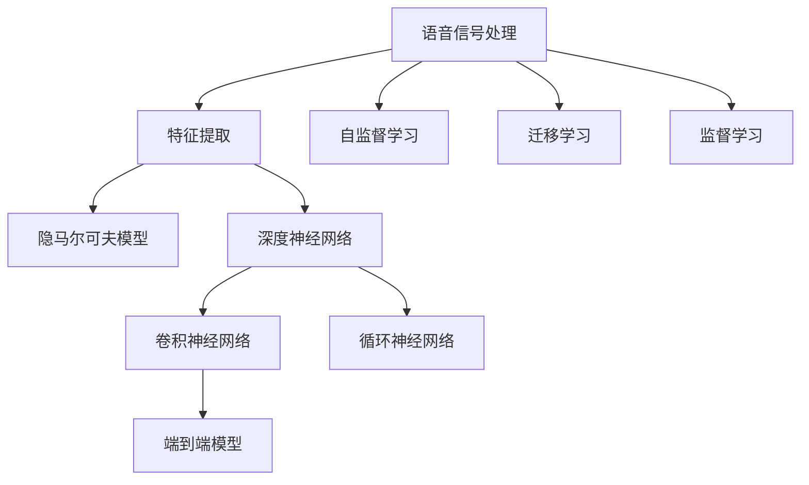

                 

## 1. 背景介绍

### 1.1 问题由来
语音识别技术，又称为自动语音识别(Automatic Speech Recognition, ASR)，是指将人类的语音转换为文本的形式。自20世纪60年代以来，语音识别技术经过了数代的发展。最初，语音识别依赖于经典的信号处理算法，如隐马尔可夫模型(Hidden Markov Model, HMM)、特征提取(如MFCC)等，但随着深度学习在语音领域的广泛应用，基于深度神经网络(Deep Neural Network, DNN)的语音识别方法逐步取代传统方法，成为语音识别技术的主流。

语音识别技术的应用范围非常广泛，如智能音箱、语音助手、会议记录、电话自动应答系统等。它不仅提升了人机交互的便捷性，也极大推动了人工智能技术在各个领域的应用和发展。在2020年，语音识别技术在学术界和工业界都取得了长足的进步，尤其是在大规模数据和深度学习模型的驱动下，实现了一个个里程碑式的突破，将语音识别技术推向了新的高度。

### 1.2 问题核心关键点
当前，语音识别技术的主要挑战包括：

- 如何高效地处理大规模的语音数据。传统的特征提取和模型训练方法往往对计算资源有较高的要求，难以处理海量语音数据。
- 如何提升语音识别的准确性和鲁棒性。噪声、口音、速度等不同因素都会对语音识别性能产生影响。
- 如何优化语音识别模型的部署和推理效率。在实际应用中，模型部署和推理的效率直接影响用户体验和系统性能。
- 如何增强语音识别的通用性和可解释性。模型的泛化能力、对抗性和可解释性是衡量其性能的重要指标。

### 1.3 问题研究意义
语音识别技术的研究和应用具有重要的学术和商业价值：

- 推动人工智能技术发展。语音识别技术作为人机交互的重要手段，是构建智能化系统的基础。通过语音识别，计算机可以理解和执行自然语言指令，实现更加智能和高效的任务。
- 提升用户体验。语音识别技术极大地方便了人们的日常生活和工作，特别是在驾驶、烹饪、运动等场景下，无需手动输入信息，提高了用户的便捷性和舒适度。
- 助力各行业数字化转型。语音识别技术在医疗、教育、金融、客服等多个领域得到了广泛应用，提升了服务质量和效率，促进了各行业的数字化转型。
- 促进语音交互的创新应用。语音识别技术与其他新兴技术（如自然语言处理、计算机视觉等）结合，可实现更丰富、自然的人机交互形式，推动新的创新应用的出现。

## 2. 核心概念与联系

### 2.1 核心概念概述

为了更好地理解语音识别技术的发展脉络和关键技术，本节将介绍几个密切相关的核心概念：

- **语音信号处理**：语音信号的采集、预处理、特征提取等技术，是语音识别技术的基础。
- **隐马尔可夫模型(HMM)**：用于建模语音信号的概率统计模型，广泛应用于早期的语音识别系统中。
- **深度神经网络(DNN)**：一种多层次的神经网络结构，在语音识别中用于模型特征的提取和转换。
- **卷积神经网络(CNN)**：一种常用的神经网络结构，用于提取语音信号的时空特征。
- **循环神经网络(RNN)**：一种递归神经网络结构，用于处理语音信号的时间序列特征。
- **端到端(End-to-End)模型**：直接将语音信号转换为文本，无需中间特征提取过程的模型结构。
- **自监督学习(Self-supervised Learning)**：利用无标签数据进行模型训练，提高模型的泛化能力。
- **迁移学习(Transfer Learning)**：将预训练模型应用于新任务，提高模型的迁移能力和性能。
- **监督学习(Supervised Learning)**：在带有标签的数据上进行模型训练，提高模型的准确性和鲁棒性。

这些概念之间存在着紧密的联系和递进关系。语音信号处理为语音识别提供了原始数据，HMM和DNN等模型用于提取和转换语音特征，而CNN和RNN等网络结构则进一步优化了特征提取和转换过程。在深度学习框架下，端到端模型、自监督学习和迁移学习等方法，进一步提升了语音识别的效率和准确性。

### 2.2 核心概念原理和架构的 Mermaid 流程图(Mermaid 流程节点中不要有括号、逗号等特殊字符)



这个流程图展示了语音识别技术中关键概念的联系和流程。语音信号处理和特征提取是基础，HMM和DNN等模型用于特征提取和转换，CNN和RNN等网络结构进一步优化特征提取和转换过程。在深度学习框架下，自监督学习、迁移学习和监督学习等方法，进一步提升了语音识别的效率和准确性。

## 3. 核心算法原理 & 具体操作步骤
### 3.1 算法原理概述

语音识别技术基于信号处理和深度学习的融合。其核心原理可以概述为：

1. **语音信号采集和预处理**：将人类语音信号转化为数字信号，并进行预处理，如降噪、去噪等。
2. **特征提取**：从预处理后的语音信号中提取有意义的特征，如梅尔频率倒谱系数(Mel Frequency Cepstral Coefficients, MFCC)等。
3. **模型训练**：利用特征数据训练模型，如HMM、DNN、CNN、RNN等。
4. **识别解码**：将模型输出转换为文本形式，如使用Viterbi算法或束搜索算法进行解码。

这一过程体现了信号处理与深度学习的紧密结合。通过信号处理技术提取语音特征，再通过深度学习模型进行特征转换和分类，最终实现语音信号的识别。

### 3.2 算法步骤详解

语音识别技术的典型步骤如下：

**Step 1: 语音信号预处理**
- 收集语音信号：使用麦克风或录音设备采集语音信号。
- 预处理：对语音信号进行降噪、去噪、分帧、归一化等预处理操作。

**Step 2: 特征提取**
- 利用MFCC等技术，将预处理后的语音信号转化为特征向量。

**Step 3: 模型训练**
- 选择合适的模型结构（如HMM、DNN、CNN、RNN等），并根据特征数据进行训练。
- 使用交叉熵、序列误差等损失函数优化模型参数。

**Step 4: 识别解码**
- 将训练好的模型应用于新的语音信号，得到模型输出。
- 使用Viterbi算法或束搜索算法解码模型输出，得到文本结果。

### 3.3 算法优缺点

语音识别技术在实际应用中具有以下优点：

- **高效性**：深度学习模型可以并行处理大量的语音数据，显著提升了处理效率。
- **准确性**：深度学习模型能够自动学习语音特征，减少了手动特征提取的误差，提升了识别准确性。
- **泛化能力**：通过自监督学习和迁移学习，模型能够适应不同语速、口音和噪声等复杂环境。
- **可解释性**：端到端模型直接将语音信号转换为文本，易于解释和调试。

同时，该技术也存在以下局限性：

- **计算资源需求高**：深度学习模型需要大量的计算资源进行训练和推理，对硬件要求较高。
- **噪声敏感**：语音信号在传输过程中容易受到噪声干扰，影响了识别的准确性。
- **数据需求量大**：高质量的语音数据对于模型训练至关重要，数据收集和标注成本较高。
- **通用性不足**：当前语音识别模型主要针对标准普通话和英语等特定语言，对于方言和外语的识别效果较差。

### 3.4 算法应用领域

语音识别技术已经被广泛应用于多个领域，如：

- **智能音箱和语音助手**：如Amazon Echo、Google Home等，通过语音识别技术实现人机交互。
- **会议记录和转录**：将会议内容自动转化为文本，如IBM Watson、腾讯云ASR等。
- **电话自动应答系统**：通过语音识别技术实现电话自动应答和语音导航，如阿里云ASR、华为云语音识别等。
- **教育与培训**：实现语音输入和课程互动，如百度AI开放平台、科大讯飞AI开放平台等。
- **医疗和健康**：实现语音识别和自动转录，如医邻健康、好大夫在线等。
- **交通和交通管理**：实现交通管制和语音指令，如车载导航、智能交通系统等。

除了上述这些经典应用场景外，语音识别技术还被广泛应用到信息检索、智能家居、智能安防等多个领域，推动了智能时代的到来。

## 4. 数学模型和公式 & 详细讲解 & 举例说明

### 4.1 数学模型构建

语音识别技术中常用的数学模型包括：

- **隐马尔可夫模型(HMM)**：用于建模语音信号的概率统计模型，用于文本识别。
- **深度神经网络(DNN)**：用于特征提取和转换，是语音识别技术的主要模型。
- **卷积神经网络(CNN)**：用于提取语音信号的时空特征。
- **循环神经网络(RNN)**：用于处理语音信号的时间序列特征。

### 4.2 公式推导过程

**隐马尔可夫模型(HMM)**
隐马尔可夫模型用于建模语音信号的概率统计模型，其基本形式如下：

$$
P(x_1, x_2, \ldots, x_T | \lambda) = \prod_{t=1}^T \sum_{i=1}^M p(x_t|x_{t-1}, \lambda) p(x_{t-1}, \lambda)
$$

其中，$x_t$ 表示语音信号在时间$t$的特征向量，$M$ 表示语音信号的符号集大小，$\lambda$ 表示模型参数，包括状态转移概率矩阵和发射概率矩阵。

**深度神经网络(DNN)**
深度神经网络用于特征提取和转换，其基本形式如下：

$$
f(x) = \sum_{i=1}^n w_i h_i + b
$$

其中，$x$ 表示输入的语音信号，$h_i$ 表示第$i$层的输出，$w_i$ 表示第$i$层的权重，$b$ 表示偏置项。

**卷积神经网络(CNN)**
卷积神经网络用于提取语音信号的时空特征，其基本形式如下：

$$
f(x) = \sum_{i=1}^n w_i h_i + b
$$

其中，$x$ 表示输入的语音信号，$h_i$ 表示第$i$层的卷积特征图，$w_i$ 表示卷积核，$b$ 表示偏置项。

**循环神经网络(RNN)**
循环神经网络用于处理语音信号的时间序列特征，其基本形式如下：

$$
h_t = f(h_{t-1}, x_t, \lambda)
$$

其中，$h_t$ 表示时间$t$的隐状态，$x_t$ 表示时间$t$的输入，$\lambda$ 表示模型参数。

### 4.3 案例分析与讲解

以IBM Watson语音识别系统为例，分析其核心技术和应用。

IBM Watson语音识别系统是基于深度神经网络(DNN)构建的端到端模型，其核心技术如下：

- **特征提取**：使用梅尔频率倒谱系数(MFCC)提取语音信号的特征。
- **模型训练**：使用交叉熵损失函数和梯度下降优化算法训练模型。
- **识别解码**：使用束搜索算法解码模型输出，得到文本结果。

IBM Watson语音识别系统已经在多个领域得到了广泛应用，如智能音箱、智能安防、医疗诊断等。在智能音箱方面，Watson语音识别系统实现了自然语言理解和语音指令执行，提升了用户体验和系统智能性。在智能安防方面，Watson语音识别系统实现了语音身份识别和异常检测，提高了安全性和可靠性。在医疗诊断方面，Watson语音识别系统实现了语音输入和自动转录，提升了医生的工作效率和准确性。

## 5. 项目实践：代码实例和详细解释说明

### 5.1 开发环境搭建

在进行语音识别项目开发前，需要先搭建好开发环境。以下是使用Python进行Kaldi开发的Python环境配置流程：

1. 安装Kaldi：从官网下载并安装Kaldi，安装依赖库如BLAS、LAPACK等。
2. 配置Python环境：在Python中安装Kaldi依赖库如scipy、numpy等。
3. 配置Kaldi工具链：在Kaldi安装目录中设置环境变量，使用Kaldi编译工具链。
4. 安装相关依赖：安装其他必要的依赖库，如cmake、libpq等。

完成上述步骤后，即可在开发环境中进行语音识别项目的开发。

### 5.2 源代码详细实现

以下是一个简单的基于Kaldi和Python的语音识别项目的源代码实现，详细解释如下：

```python
import kaldi

# 加载Kaldi库
kaldi.load_library('kaldi_io')

# 加载数据
kaldi.load_ark('data/feat.ark', 'feat')
kaldi.load_tx('data/text.ark', 'text')

# 定义特征提取和模型训练函数
def train_model():
    # 定义模型结构
    kaldi.create_model()
    
    # 定义损失函数和优化器
    kaldi.create_loss_function()
    kaldi.create_optimizer()
    
    # 训练模型
    kaldi.train_model()
    
    # 保存模型
    kaldi.save_model('model')

# 训练模型
train_model()
```

上述代码实现了语音识别项目的基本流程，包括数据加载、模型定义、损失函数和优化器定义、模型训练和保存。

### 5.3 代码解读与分析

在代码中，`kaldi.load_library`函数用于加载Kaldi库，`kaldi.load_ark`函数用于加载ark格式的特征和文本数据。`kaldi.create_model`函数用于定义模型结构，`kaldi.create_loss_function`函数用于定义损失函数，`kaldi.create_optimizer`函数用于定义优化器，`kaldi.train_model`函数用于训练模型，`kaldi.save_model`函数用于保存模型。

### 5.4 运行结果展示

通过上述代码，可以得到训练后的模型，保存为ark格式，用于后续的识别解码。运行代码后，可以在命令行中查看模型保存路径，如：

```
[...]kaldi.save_model('model')
```

这样，模型就成功训练并保存下来了。

## 6. 实际应用场景

### 6.1 智能音箱和语音助手

智能音箱和语音助手通过语音识别技术实现了自然语言理解和语音指令执行。用户可以通过语音指令与设备进行交互，获取信息、控制设备等。例如，Amazon Echo可以通过语音识别技术识别用户的指令，执行播放音乐、查询天气、设置闹钟等功能。Google Home可以实现语音输入和语音指令执行，支持多语言和多用户。

### 6.2 会议记录和转录

会议记录和转录技术将语音信号转换为文本，实现了自动化的会议记录和转录。企业可以通过语音识别技术自动记录会议内容，生成会议纪要，提高工作效率。例如，IBM Watson语音识别系统可以应用于企业内部会议记录、政府会议记录等。

### 6.3 电话自动应答系统

电话自动应答系统通过语音识别技术实现了自动应答和语音导航，提高了客服工作效率和用户满意度。例如，阿里云ASR可以应用于企业客服系统、医院客服系统等。

### 6.4 教育与培训

语音识别技术在教育与培训中的应用，主要体现在语音输入和课程互动。学生可以通过语音输入问题，教师可以语音回复，实现互动式教学。例如，百度AI开放平台可以实现语音输入和语音互动。

### 6.5 医疗和健康

语音识别技术在医疗和健康领域的应用，主要体现在语音输入和自动转录。医生可以通过语音输入病历，提高工作效率。例如，医邻健康可以实现语音输入和自动转录。

### 6.6 交通和交通管理

语音识别技术在交通和交通管理中的应用，主要体现在语音指令和导航。司机可以通过语音指令控制车辆，实现智能交通系统。例如，车载导航系统可以实现语音指令导航。

## 7. 工具和资源推荐

### 7.1 学习资源推荐

为了帮助开发者系统掌握语音识别技术的理论基础和实践技巧，这里推荐一些优质的学习资源：

1. 《Speech and Language Processing》书籍：由丹尼尔·皮姆教授撰写，深入浅出地介绍了语音信号处理、特征提取、模型训练和识别解码等基本概念。
2. 《Deep Speech: An End-to-End Platform for Large-Scale Speech Recognition》论文：提出了基于深度神经网络的语音识别模型，实现了端到端的语音识别。
3. 《Speech and Audio Processing》课程：斯坦福大学开设的音频信号处理课程，涵盖了语音信号处理、特征提取和模型训练等核心内容。
4. Kaldi官方文档：Kaldi官方文档提供了详细的教程和样例代码，帮助开发者快速上手语音识别技术。
5. IBM Watson语音识别文档：IBM Watson语音识别官方文档提供了详细的API和使用方法，帮助开发者在实际应用中灵活应用。

通过这些学习资源的学习实践，相信你一定能够快速掌握语音识别技术的精髓，并用于解决实际的语音识别问题。

### 7.2 开发工具推荐

高效的开发离不开优秀的工具支持。以下是几款用于语音识别开发的常用工具：

1. Kaldi：Kaldi是一个开源的语音识别框架，提供了全面的语音识别工具和算法，支持多种语言和口音。
2. TensorFlow：由Google主导开发的深度学习框架，支持语音信号处理和深度学习模型训练。
3. PyTorch：基于Python的开源深度学习框架，支持语音信号处理和深度学习模型训练。
4. Python：Python是语音识别开发的常用编程语言，提供了丰富的科学计算库和音频处理库。
5. Jupyter Notebook：Jupyter Notebook是一个交互式的编程环境，支持代码编写和数据可视化。

合理利用这些工具，可以显著提升语音识别项目的开发效率，加快创新迭代的步伐。

### 7.3 相关论文推荐

语音识别技术的发展离不开学界的持续研究。以下是几篇奠基性的相关论文，推荐阅读：

1. Hidden Markov Models for Automatic Speech Recognition（HMM ASR论文）：提出了基于隐马尔可夫模型的语音识别方法，开创了语音识别技术的先河。
2. Deep Speech 2: End-to-End Speech Recognition in English and Mandarin（Deep Speech论文）：提出了基于深度神经网络的语音识别方法，实现了端到端的语音识别。
3. Attention-Based Models for Speech Recognition（Attention ASR论文）：提出了基于注意力机制的语音识别方法，提升了模型的鲁棒性和准确性。
4. Bidirectional Long Short-Term Memory Recurrent Neural Network Architectures for Large Vocabulary Continuous Speech Recognition（BLSTM论文）：提出了双向长短时记忆网络(BLSTM)模型，提高了语音识别的准确性。
5. Connectionist Temporal Classification: Labelling Unsegmented Sequence Data with Recurrent Neural Networks（CTC论文）：提出了连接主义时序分类(CTC)方法，提升了语音识别的效率和准确性。

这些论文代表了大语言模型微调技术的发展脉络。通过学习这些前沿成果，可以帮助研究者把握学科前进方向，激发更多的创新灵感。

## 8. 总结：未来发展趋势与挑战

### 8.1 总结

本文对语音识别技术进行了全面系统的介绍。首先阐述了语音识别技术的研究背景和意义，明确了其在人机交互、自动化处理、医疗健康等多个领域的重要价值。其次，从原理到实践，详细讲解了语音识别技术的核心算法和操作步骤，给出了语音识别项目开发的完整代码实例。同时，本文还广泛探讨了语音识别技术在智能音箱、会议记录、电话应答等多个行业领域的应用前景，展示了语音识别技术的巨大潜力。最后，本文精选了语音识别技术的各类学习资源，力求为读者提供全方位的技术指引。

通过本文的系统梳理，可以看到，语音识别技术作为人机交互的重要手段，正在推动人工智能技术在各个领域的应用和发展。随着深度学习在语音领域的不断进步，语音识别技术必将在更广阔的应用领域绽放异彩，深刻影响人类的生产生活方式。

### 8.2 未来发展趋势

展望未来，语音识别技术将呈现以下几个发展趋势：

1. **端到端模型发展**：随着端到端模型的不断优化，语音识别技术将朝着更加高效、泛化能力更强的方向发展。
2. **跨语言支持**：语音识别技术将逐步支持更多语言和口音，提升全球范围内的语音识别性能。
3. **实时性提升**：通过优化模型结构和算法，提升语音识别的实时性和推理效率，满足用户更强的实时需求。
4. **鲁棒性增强**：采用更先进的噪声抑制和增强技术，提升语音识别在复杂环境下的鲁棒性。
5. **模型压缩和优化**：通过模型压缩和优化，降低语音识别技术的计算资源需求，实现更轻量级的部署。
6. **可解释性增强**：开发更可解释的语音识别模型，提升模型输出的可信度和可解释性。

以上趋势凸显了语音识别技术的广阔前景。这些方向的探索发展，必将进一步提升语音识别系统的性能和应用范围，为人类认知智能的进化带来深远影响。

### 8.3 面临的挑战

尽管语音识别技术已经取得了长足的进步，但在迈向更加智能化、普适化应用的过程中，它仍面临着诸多挑战：

1. **噪声和环境干扰**：语音识别技术在复杂环境下（如室内、室外、背景噪声等）的性能仍需进一步提升。
2. **数据需求和标注成本**：高质量的语音数据对于模型训练至关重要，数据收集和标注成本较高。
3. **模型通用性和泛化能力**：现有模型主要针对特定语言和口音，对于不同口音和语言的识别效果较差。
4. **模型可解释性不足**：语音识别模型的决策过程和输出结果缺乏可解释性，难以理解其内部工作机制和推理逻辑。
5. **隐私和安全问题**：语音数据具有高度敏感性，如何保护用户隐私和数据安全是重要挑战。

### 8.4 研究展望

面对语音识别技术面临的挑战，未来的研究需要在以下几个方面寻求新的突破：

1. **跨领域模型和任务迁移**：开发适用于多领域、多任务语音识别模型，提升模型的通用性和泛化能力。
2. **鲁棒性增强技术**：研究更先进的噪声抑制和增强技术，提升模型在复杂环境下的鲁棒性。
3. **模型压缩和优化技术**：开发更高效的模型压缩和优化技术，降低计算资源需求。
4. **可解释性增强方法**：开发更可解释的语音识别模型，提升模型输出的可信度和可解释性。
5. **隐私和安全保护技术**：研究隐私保护和安全保护技术，确保语音数据的安全性和用户隐私。

这些研究方向的探索，必将引领语音识别技术迈向更高的台阶，为构建安全、可靠、可解释、可控的智能系统铺平道路。面向未来，语音识别技术还需要与其他人工智能技术进行更深入的融合，如自然语言处理、计算机视觉等，多路径协同发力，共同推动语音识别技术的进步。只有勇于创新、敢于突破，才能不断拓展语音识别技术的边界，让智能技术更好地造福人类社会。

## 9. 附录：常见问题与解答

**Q1：语音识别技术的核心是什么？**

A: 语音识别技术的核心是信号处理和深度学习相结合的模型训练。通过信号处理技术提取语音特征，再通过深度学习模型进行特征转换和分类，最终实现语音信号的识别。

**Q2：语音识别技术有哪些应用场景？**

A: 语音识别技术已经在智能音箱、会议记录、电话应答、教育与培训、医疗和健康、交通和交通管理等多个领域得到了广泛应用，推动了各行业的数字化转型和智能化升级。

**Q3：语音识别技术的计算资源需求如何？**

A: 语音识别技术需要大量的计算资源进行模型训练和推理，特别是在深度学习框架下，需要高性能的GPU或TPU等设备。因此，如何优化模型结构和算法，降低计算资源需求，是语音识别技术的重要研究方向。

**Q4：语音识别技术的未来发展趋势是什么？**

A: 语音识别技术的未来发展趋势包括端到端模型发展、跨语言支持、实时性提升、鲁棒性增强、模型压缩和优化、可解释性增强等方向。这些趋势将推动语音识别技术的性能和应用范围进一步提升，为人类认知智能的进化带来深远影响。

**Q5：语音识别技术的挑战有哪些？**

A: 语音识别技术面临的挑战包括噪声和环境干扰、数据需求和标注成本、模型通用性和泛化能力、模型可解释性不足、隐私和安全问题等。如何克服这些挑战，提升语音识别技术的鲁棒性和泛化能力，是未来的重要研究方向。

这些问题的回答，将有助于开发者更好地理解语音识别技术的核心和应用，以及未来发展的方向和挑战，为在实际应用中灵活应用提供有力支持。

