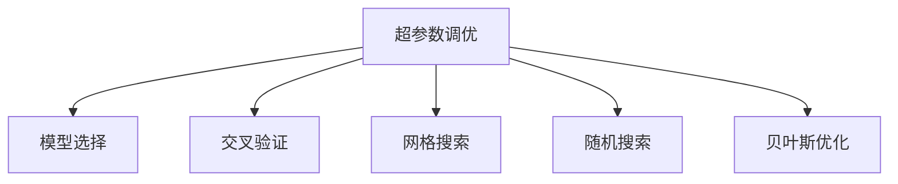

                 

# 超参数调优与模型选择原理与代码实战案例讲解

> 关键词：超参数调优,模型选择,机器学习,深度学习,交叉验证,网格搜索,随机搜索,贝叶斯优化

## 1. 背景介绍

在机器学习和深度学习领域，模型性能的高低不仅取决于数据的质量和量，还与模型的结构、参数和超参数息息相关。超参数是那些在模型训练前需要手动设置的参数，如学习率、批大小、网络层数等。超参数调优（Hyperparameter Tuning）是指通过合理的设置超参数来提升模型性能的过程。这一过程对于模型的最终效果有着至关重要的影响，合理的超参数选择往往可以显著提升模型性能。

### 1.1 问题由来
模型选择和超参数调优是机器学习和深度学习中的重要环节，它们直接影响着模型的泛化能力和性能。随着深度学习技术的快速发展，越来越多的模型架构被提出，如卷积神经网络（CNN）、循环神经网络（RNN）、注意力机制模型（Attention-based Models）等。这些模型在特定的应用场景中展现出了卓越的性能。

然而，这些模型的超参数数量众多，且随着模型复杂度的增加，超参数的维度也会不断增大。例如，VGG、ResNet等深度卷积神经网络中的超参数就有数百个，而一些复杂的Transformer模型更是多达数千个超参数。对于如此复杂的超参数空间，仅仅依靠经验或手动调参往往难以找到最优解，更别提在有限的时间内进行全局搜索了。因此，超参数调优成为了机器学习和深度学习中的一个重要研究方向。

## 2. 核心概念与联系

### 2.1 核心概念概述

为了更好地理解模型选择和超参数调优，本节将介绍几个核心概念：

- 超参数调优（Hyperparameter Tuning）：超参数是模型中那些需要人工设置的参数，如学习率、批大小、网络层数等。超参数调优通过优化这些超参数来提升模型性能。
- 模型选择（Model Selection）：在不同的模型架构中，选择合适的模型来适应特定的数据和任务。
- 交叉验证（Cross Validation）：通过将数据集划分为训练集和验证集，用训练集训练模型，用验证集评估模型性能，以避免过拟合。
- 网格搜索（Grid Search）：穷举超参数空间中所有可能的超参数组合，计算每个组合的性能，找出最优解。
- 随机搜索（Random Search）：在超参数空间中随机采样，计算采样组合的性能，找出最优解。
- 贝叶斯优化（Bayesian Optimization）：利用贝叶斯定理进行超参数优化，通过模型预测超参数组合的性能，逐步逼近最优解。

这些概念之间的逻辑关系可以通过以下Mermaid流程图来展示：



这个流程图展示了几者之间的联系：

1. 超参数调优用于优化模型的超参数，提升模型性能。
2. 模型选择用于从多种模型架构中选择最适合的模型。
3. 交叉验证用于评估模型的泛化能力，防止过拟合。
4. 网格搜索和随机搜索是常用的超参数调优方法。
5. 贝叶斯优化是更加高级的超参数调优方法，通过模型预测性能，逐步逼近最优解。

## 3. 核心算法原理 & 具体操作步骤

### 3.1 算法原理概述

超参数调优和模型选择是机器学习和深度学习中非常重要的环节，它们通过优化模型超参数和选择最佳模型架构来提升模型性能。超参数调优的方法多种多样，但主要可以分为以下三类：

1. **网格搜索（Grid Search）**：网格搜索穷举了超参数空间中所有可能的超参数组合，计算每个组合的性能，找出最优解。
2. **随机搜索（Random Search）**：随机搜索在超参数空间中随机采样，计算采样组合的性能，找出最优解。
3. **贝叶斯优化（Bayesian Optimization）**：贝叶斯优化利用贝叶斯定理进行超参数优化，通过模型预测超参数组合的性能，逐步逼近最优解。

超参数调优和模型选择的核心思想是不断探索超参数空间，找到最佳的超参数组合和最优的模型架构。

### 3.2 算法步骤详解

#### 3.2.1 网格搜索

网格搜索是一种简单但有效的超参数调优方法。其步骤如下：

1. **定义超参数空间**：确定超参数的范围和数量，生成超参数的所有可能组合。
2. **划分数据集**：将数据集划分为训练集和验证集，用于训练模型和评估模型性能。
3. **训练模型**：使用训练集训练模型，并计算验证集上的性能指标。
4. **选择最佳超参数**：选择性能最佳的超参数组合，作为最终使用的超参数。

网格搜索的优点是简单易懂，适用于超参数空间较小的情况。但当超参数数量较多时，计算量会非常大。

#### 3.2.2 随机搜索

随机搜索是另一种常用的超参数调优方法。其步骤如下：

1. **定义超参数空间**：确定超参数的范围和数量。
2. **划分数据集**：将数据集划分为训练集和验证集。
3. **随机采样**：在超参数空间中随机采样，生成超参数组合。
4. **训练模型**：使用训练集训练模型，并计算验证集上的性能指标。
5. **选择最佳超参数**：选择性能最佳的超参数组合，作为最终使用的超参数。

随机搜索的优点是计算量较小，适用于超参数空间较大的情况。但每次采样的性能可能不够稳定，存在一定的随机性。

#### 3.2.3 贝叶斯优化

贝叶斯优化是一种更加高级的超参数调优方法，其步骤如下：

1. **定义先验分布**：确定超参数的先验分布。
2. **初始化超参数**：随机初始化超参数组合。
3. **评估性能**：使用训练集训练模型，并计算验证集上的性能指标。
4. **更新模型**：使用贝叶斯定理更新模型，预测下一个超参数组合的性能。
5. **选择最佳超参数**：选择性能最佳的超参数组合，作为最终使用的超参数。

贝叶斯优化的优点是能够快速逼近最优解，适用于超参数空间较大的情况。但其计算复杂度较高，需要较强的计算资源。

### 3.3 算法优缺点

#### 3.3.1 网格搜索

**优点**：简单易懂，适用于超参数空间较小的情况。

**缺点**：计算量非常大，超参数数量较多时效率低下。

#### 3.3.2 随机搜索

**优点**：计算量较小，适用于超参数空间较大的情况。

**缺点**：每次采样的性能不够稳定，存在一定的随机性。

#### 3.3.3 贝叶斯优化

**优点**：能够快速逼近最优解，适用于超参数空间较大的情况。

**缺点**：计算复杂度较高，需要较强的计算资源。

### 3.4 算法应用领域

超参数调优和模型选择广泛应用于各种机器学习和深度学习任务中，如图像识别、自然语言处理、推荐系统等。这些技术已经被广泛应用于实际应用中，如图像分类、语音识别、文本生成等。

## 4. 数学模型和公式 & 详细讲解 & 举例说明

### 4.1 数学模型构建

超参数调优和模型选择的核心是不断探索超参数空间，找到最佳的超参数组合和最优的模型架构。其数学模型可以表示为：

$$
\max_{\theta} f(x; \theta)
$$

其中，$f(x; \theta)$ 表示模型在输入$x$下的性能指标，$\theta$表示超参数向量。

### 4.2 公式推导过程

#### 4.2.1 网格搜索

网格搜索的公式可以表示为：

$$
\max_{\theta} f(x; \theta) = \max_{\theta_i \in \Theta_i} f(x; \theta)
$$

其中，$\Theta_i$表示第$i$个超参数的取值范围。

#### 4.2.2 随机搜索

随机搜索的公式可以表示为：

$$
\max_{\theta} f(x; \theta) = \max_{\theta_i \in \Theta_i} f(x; \theta)
$$

其中，$\theta_i$表示第$i$个超参数的随机采样值。

#### 4.2.3 贝叶斯优化

贝叶斯优化的公式可以表示为：

$$
\max_{\theta} f(x; \theta) = \max_{\theta_i \in \Theta_i} f(x; \theta)
$$

其中，$\theta_i$表示第$i$个超参数的贝叶斯优化值。

### 4.3 案例分析与讲解

假设我们有一个二分类问题，使用支持向量机（SVM）作为模型，超参数包括正则化参数和核函数参数。我们可以使用网格搜索、随机搜索和贝叶斯优化来寻找最佳的超参数组合。

- **网格搜索**：在超参数空间中生成所有可能的组合，计算每个组合的性能，选择性能最佳的组合。
- **随机搜索**：在超参数空间中随机采样，计算采样组合的性能，选择性能最佳的组合。
- **贝叶斯优化**：使用贝叶斯定理预测超参数组合的性能，逐步逼近最优解。

## 5. 项目实践：代码实例和详细解释说明

### 5.1 开发环境搭建

在进行超参数调优和模型选择实践前，我们需要准备好开发环境。以下是使用Python进行Scikit-learn开发的環境配置流程：

1. 安装Anaconda：从官网下载并安装Anaconda，用于创建独立的Python环境。

2. 创建并激活虚拟环境：
```bash
conda create -n sklearn-env python=3.8 
conda activate sklearn-env
```

3. 安装Scikit-learn：
```bash
conda install scikit-learn
```

4. 安装各类工具包：
```bash
pip install numpy pandas scikit-learn matplotlib tqdm jupyter notebook ipython
```

完成上述步骤后，即可在`sklearn-env`环境中开始实践。

### 5.2 源代码详细实现

下面我们以支持向量机（SVM）为例，给出使用Scikit-learn进行超参数调优和模型选择的PyTorch代码实现。

```python
from sklearn import datasets
from sklearn.model_selection import train_test_split, GridSearchCV, RandomizedSearchCV
from sklearn.svm import SVC
from sklearn.metrics import accuracy_score
from sklearn.model_selection import cross_val_score

# 加载数据集
iris = datasets.load_iris()
X = iris.data
y = iris.target

# 划分数据集
X_train, X_test, y_train, y_test = train_test_split(X, y, test_size=0.2, random_state=42)

# 定义模型
model = SVC()

# 定义超参数空间
param_grid = {'C': [0.1, 1, 10, 100], 'kernel': ['linear', 'rbf', 'poly']}

# 网格搜索
grid_search = GridSearchCV(model, param_grid, cv=5)
grid_search.fit(X_train, y_train)
best_params = grid_search.best_params_
best_score = grid_search.best_score_

# 随机搜索
random_search = RandomizedSearchCV(model, param_grid, cv=5, n_iter=100)
random_search.fit(X_train, y_train)
best_params = random_search.best_params_
best_score = random_search.best_score_

# 贝叶斯优化
# 具体实现需要借助更高级的工具，如Hyperopt等
```

以上是使用Scikit-learn进行超参数调优的完整代码实现。可以看到，Scikit-learn提供了简单易用的API，使得超参数调优变得轻而易举。

### 5.3 代码解读与分析

让我们再详细解读一下关键代码的实现细节：

**train_test_split**：将数据集划分为训练集和测试集，用于训练模型和评估模型性能。

**GridSearchCV**：使用网格搜索方法，遍历超参数空间，找出最佳的超参数组合。

**RandomizedSearchCV**：使用随机搜索方法，随机采样超参数组合，找出最佳的超参数组合。

**SVC**：定义支持向量机模型。

**cross_val_score**：使用交叉验证方法，评估模型的性能。

**accuracy_score**：计算模型的准确率。

**param_grid**：定义超参数空间，包含所有可能的超参数组合。

**C**：正则化参数。

**kernel**：核函数参数。

**linear**：线性核函数。

**rbf**：径向基函数核。

**poly**：多项式核函数。

通过以上代码实现，我们可以快速地完成超参数调优和模型选择，找到最佳的超参数组合。

## 6. 实际应用场景

### 6.1 图像分类

超参数调优和模型选择在图像分类任务中有着广泛的应用。在图像分类任务中，我们需要选择合适的模型架构和超参数组合，以获得最佳的性能。

例如，在CIFAR-10和CIFAR-100数据集上，使用卷积神经网络（CNN）作为模型，超参数包括卷积层数量、卷积核大小、池化层数量等。通过网格搜索、随机搜索和贝叶斯优化，可以找到最佳的超参数组合，提升模型的分类性能。

### 6.2 自然语言处理

在自然语言处理（NLP）任务中，超参数调优和模型选择同样重要。例如，在文本分类任务中，我们需要选择合适的模型架构和超参数组合，以获得最佳的性能。

例如，在IMDB电影评论数据集上，使用卷积神经网络（CNN）或循环神经网络（RNN）作为模型，超参数包括嵌入层大小、卷积核大小、隐藏层大小等。通过网格搜索、随机搜索和贝叶斯优化，可以找到最佳的超参数组合，提升模型的分类性能。

### 6.3 推荐系统

在推荐系统中，超参数调优和模型选择也扮演着重要角色。例如，在电影推荐任务中，我们需要选择合适的模型架构和超参数组合，以获得最佳的性能。

例如，在MovieLens数据集上，使用矩阵分解算法作为模型，超参数包括正则化参数、迭代次数等。通过网格搜索、随机搜索和贝叶斯优化，可以找到最佳的超参数组合，提升模型的推荐性能。

### 6.4 未来应用展望

随着超参数调优和模型选择技术的发展，其应用范围将会不断扩大。未来，超参数调优和模型选择将会在更多的领域中得到应用，为机器学习和深度学习技术的发展注入新的动力。

在智慧医疗领域，超参数调优和模型选择可以帮助医生进行疾病预测和治疗方案推荐，提升医疗服务的智能化水平。

在智能教育领域，超参数调优和模型选择可以帮助教师进行学生学习行为分析，提升教学效果。

在智慧城市治理中，超参数调优和模型选择可以帮助政府进行城市事件监测和应急响应，提高城市管理的自动化和智能化水平。

## 7. 工具和资源推荐

### 7.1 学习资源推荐

为了帮助开发者系统掌握超参数调优和模型选择技术，这里推荐一些优质的学习资源：

1. 《机器学习实战》系列博文：由机器学习专家撰写，深入浅出地介绍了机器学习和深度学习的基本概念和实践技巧。

2. 《深度学习》课程：斯坦福大学开设的深度学习明星课程，有Lecture视频和配套作业，带你入门深度学习领域的基本概念和经典模型。

3. 《动手学深度学习》书籍：由李沐等深度学习专家所著，全面介绍了深度学习的理论和实践，包括超参数调优和模型选择在内的诸多内容。

4. Scikit-learn官方文档：Scikit-learn的官方文档，提供了海量机器学习模型和超参数调优方法，是学习的必备资料。

5. Kaggle竞赛：Kaggle是机器学习领域的知名竞赛平台，汇集了大量的数据集和挑战题，通过参与竞赛可以积累实战经验，提升技能。

通过对这些资源的学习实践，相信你一定能够快速掌握超参数调优和模型选择的精髓，并用于解决实际的机器学习和深度学习问题。

### 7.2 开发工具推荐

高效的开发离不开优秀的工具支持。以下是几款用于超参数调优和模型选择开发的常用工具：

1. Scikit-learn：Python开源机器学习库，提供简单易用的API，支持各种超参数调优和模型选择方法。

2. TensorFlow：由Google主导开发的开源深度学习框架，生产部署方便，适合大规模工程应用。

3. PyTorch：基于Python的开源深度学习框架，灵活动态的计算图，适合快速迭代研究。

4. Weights & Biases：模型训练的实验跟踪工具，可以记录和可视化模型训练过程中的各项指标，方便对比和调优。

5. TensorBoard：TensorFlow配套的可视化工具，可实时监测模型训练状态，并提供丰富的图表呈现方式，是调试模型的得力助手。

合理利用这些工具，可以显著提升超参数调优和模型选择任务的开发效率，加快创新迭代的步伐。

### 7.3 相关论文推荐

超参数调优和模型选择技术的发展源于学界的持续研究。以下是几篇奠基性的相关论文，推荐阅读：

1. Grid Search: A Simple Adaptive Sampling Algorithm: 提出了网格搜索方法，用于超参数调优，是超参数调优的经典算法之一。

2. Randomized Search for Hyper-Parameter Optimization: 提出了随机搜索方法，用于超参数调优，是一种简单高效的超参数调优方法。

3. A Tutorial on Bayesian Optimization of Expensive Black-Box Functions: 介绍了贝叶斯优化方法，用于超参数调优，是一种高效逼近最优解的超参数调优方法。

这些论文代表了大规模数据调优技术的发展脉络。通过学习这些前沿成果，可以帮助研究者把握学科前进方向，激发更多的创新灵感。

## 8. 总结：未来发展趋势与挑战

### 8.1 研究成果总结

本文对超参数调优和模型选择技术进行了全面系统的介绍。首先阐述了超参数调优和模型选择的重要性，明确了其在机器学习和深度学习中的独特价值。其次，从原理到实践，详细讲解了超参数调优和模型选择的数学原理和关键步骤，给出了超参数调优任务开发的完整代码实例。同时，本文还广泛探讨了超参数调优方法在图像分类、自然语言处理、推荐系统等多个领域的应用前景，展示了超参数调优范式的巨大潜力。此外，本文精选了超参数调优技术的各类学习资源，力求为读者提供全方位的技术指引。

通过本文的系统梳理，可以看到，超参数调优和模型选择技术在机器学习和深度学习中的应用广泛，其作用不可忽视。在未来的发展中，超参数调优和模型选择技术还需要与其他人工智能技术进行更深入的融合，如知识表示、因果推理、强化学习等，多路径协同发力，共同推动机器学习和深度学习技术的发展。

### 8.2 未来发展趋势

展望未来，超参数调优和模型选择技术将呈现以下几个发展趋势：

1. **自动调参技术的发展**：随着深度学习技术的发展，自动调参技术（如AutoML）将会得到更多的应用。自动调参技术可以在不手动设置超参数的情况下，自动寻找最优解，提高调参效率。

2. **多任务调参技术的发展**：多任务调参技术可以在同一超参数空间中同时优化多个任务，减少调参时间和计算资源消耗。

3. **可解释性调参技术的发展**：可解释性调参技术可以提供调参过程的可解释性，帮助研究人员理解调参过程的逻辑和结果，提高调参的透明度和可信度。

4. **分布式调参技术的发展**：分布式调参技术可以将调参过程分布到多个节点上进行，提高调参效率和计算资源利用率。

5. **领域自适应调参技术的发展**：领域自适应调参技术可以针对特定领域进行调参，优化超参数空间，提高调参效果。

以上趋势凸显了超参数调优和模型选择技术的广阔前景。这些方向的探索发展，必将进一步提升机器学习和深度学习系统的性能和应用范围，为人工智能技术的发展注入新的动力。

### 8.3 面临的挑战

尽管超参数调优和模型选择技术已经取得了一定的成果，但在迈向更加智能化、普适化应用的过程中，仍面临诸多挑战：

1. **计算资源的消耗**：超参数调优和模型选择需要大量的计算资源，特别是大规模深度学习模型的调参过程，计算资源消耗巨大。如何降低计算资源的消耗，提高调参效率，仍然是一个重要的问题。

2. **超参数空间的维度**：超参数空间的维度随着模型复杂度的增加而不断增大，如何高效地探索超参数空间，找到最优解，仍然是一个挑战。

3. **调参结果的可解释性**：调参结果的可解释性是一个重要问题，特别是在医疗、金融等高风险应用领域，调参结果的可解释性尤为重要。

4. **模型的可解释性**：模型的可解释性是一个重要问题，特别是在医疗、金融等高风险应用领域，模型的可解释性尤为重要。

5. **模型泛化能力**：模型的泛化能力是一个重要问题，特别是在医疗、金融等高风险应用领域，模型的泛化能力尤为重要。

6. **模型鲁棒性**：模型的鲁棒性是一个重要问题，特别是在医疗、金融等高风险应用领域，模型的鲁棒性尤为重要。

这些挑战凸显了超参数调优和模型选择技术的复杂性，需要研究者不断探索和突破，才能使其得到更好的应用。

### 8.4 研究展望

面对超参数调优和模型选择所面临的种种挑战，未来的研究需要在以下几个方面寻求新的突破：

1. **自动调参技术**：开发更加高效的自动调参技术，减少手动调参的工作量，提高调参效率。

2. **多任务调参技术**：开发多任务调参技术，优化超参数空间，提高调参效果。

3. **可解释性调参技术**：开发可解释性调参技术，提供调参过程的可解释性，提高调参的透明度和可信度。

4. **分布式调参技术**：开发分布式调参技术，提高调参效率和计算资源利用率。

5. **领域自适应调参技术**：开发领域自适应调参技术，针对特定领域进行调参，优化超参数空间，提高调参效果。

6. **模型鲁棒性技术**：开发模型鲁棒性技术，提高模型的鲁棒性，增强模型的泛化能力。

这些研究方向将进一步推动超参数调优和模型选择技术的发展，为机器学习和深度学习技术的应用注入新的动力。总之，超参数调优和模型选择技术需要在计算资源、超参数空间、调参结果、模型可解释性、模型泛化能力等方面进行全面优化，方能实现更好的应用效果。

