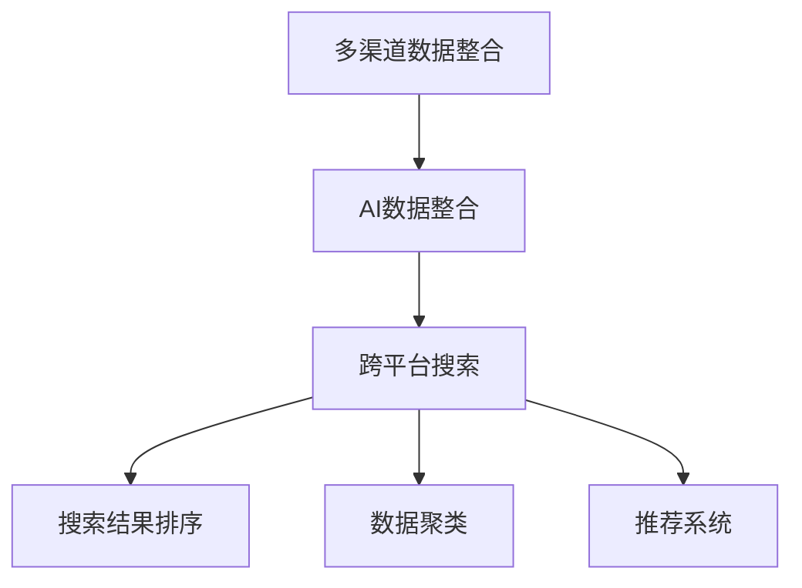

                 

# 跨平台搜索：AI如何整合多渠道数据，提供最优选择

> 关键词：跨平台搜索, AI数据整合, 多渠道数据, 最优选择, 搜索结果排序, 数据聚类, 推荐系统

## 1. 背景介绍

### 1.1 问题由来
随着互联网的蓬勃发展和电子商务的兴起，用户搜索习惯已经从传统的单一渠道转向多渠道融合。无论是搜索引擎、电商平台、社交媒体还是即时通讯工具，用户都希望通过一搜索平台即可获取全面的信息。为此，如何整合多渠道数据，提供准确、全面、高效、个性化的搜索结果，成为各大互联网公司面临的重要挑战。

### 1.2 问题核心关键点
多渠道数据整合的关键在于如何高效地从不同渠道抓取数据，并在此基础上进行聚合、排序和呈现，以提供用户最优选择。具体包括：
- 数据抓取：从搜索引擎、电商平台、社交媒体、即时通讯工具等多个渠道抓取结构化、半结构化、非结构化数据。
- 数据清洗：去除重复、无效数据，统一数据格式和标准。
- 数据聚类：将不同来源的数据根据相似性进行聚合，形成更全面的信息集合。
- 结果排序：根据用户查询意图、点击行为、历史行为等多维数据进行排序，推荐最优结果。
- 结果呈现：通过界面展示技术，以图表、列表、文字等多种形式呈现搜索结果，提升用户体验。

### 1.3 问题研究意义
在多渠道数据整合的过程中，AI技术的应用，尤其是基于机器学习的方法，能够显著提高数据处理的效率和准确性，提升搜索服务的质量和用户满意度。研究如何利用AI技术进行多渠道数据整合，对提升搜索系统的智能化水平、增强用户体验、促进电商与社交媒体等领域的融合具有重要意义。

## 2. 核心概念与联系

### 2.1 核心概念概述

为更好地理解跨平台搜索技术，本节将介绍几个核心概念：

- 多渠道数据整合(Multi-Channel Data Integration)：将来自不同渠道的文本、图片、视频等多类型数据进行整合，形成统一的信息集合，为搜索和推荐提供数据基础。
- AI数据整合(AI Data Integration)：利用人工智能技术，对多渠道数据进行自动抓取、清洗、聚类、排序等处理，提升数据整合的效率和效果。
- 跨平台搜索(Cross-Platform Search)：用户通过单一搜索界面，获取来自不同渠道的全面信息，实现跨平台数据的无缝衔接。
- 搜索结果排序(Result Ranking)：根据用户查询意图、历史行为、点击行为等多维数据，对搜索结果进行排序，提供最优选择。
- 数据聚类(Data Clustering)：通过聚类算法对不同来源的数据进行聚合，消除重复，统一格式。
- 推荐系统(Recommender System)：利用机器学习等技术，对用户行为数据进行建模，推荐相关内容。

这些核心概念之间的逻辑关系可以通过以下Mermaid流程图来展示：



这个流程图展示了多渠道数据整合、AI数据整合、跨平台搜索、搜索结果排序、数据聚类和推荐系统之间的逻辑联系。

## 3. 核心算法原理 & 具体操作步骤
### 3.1 算法原理概述

跨平台搜索的核心算法原理包括数据抓取、数据清洗、数据聚类、结果排序和推荐系统。下面分别介绍各环节的算法原理。

### 3.2 算法步骤详解

#### 3.2.1 数据抓取

数据抓取是跨平台搜索的基础。不同渠道的数据抓取方式各异，常见的抓取方式包括：

- 网页爬虫：使用程序自动抓取Web页面上的文本、图片等数据。
- 平台API：从电商平台、社交媒体、即时通讯工具等平台获取API接口数据。
- 实时数据流：通过消息队列、流计算等技术，实时抓取即时通讯工具中的聊天记录和社交媒体上的动态信息。

抓取过程中，需要考虑数据格式、数据类型、抓取频率等因素。同时，为避免抓取工具对目标网站或平台造成干扰，需要设计合理的爬虫算法，避免高频率请求带来的高负载。

#### 3.2.2 数据清洗

数据清洗的目的是去除重复、错误、无效数据，统一数据格式和标准。具体步骤如下：

1. 去重：使用哈希表等数据结构，快速判断并去除重复数据。
2. 校验：对数据格式进行校验，如文本编码、日期格式等。
3. 转换：将不同格式的数据统一转换为标准格式，如将时间戳转换为统一的日期格式。
4. 修复：对数据进行校验和修复，如将错误字符替换为正确字符。

#### 3.2.3 数据聚类

数据聚类的目的是将不同来源的数据根据相似性进行聚合，形成更全面的信息集合。常见的聚类算法包括：

- K-Means：基于距离度量，将数据划分为K个类别。
- DBSCAN：基于密度，将数据点分为核心点、边界点和噪声点。
- 层次聚类：通过层次化方法，将数据点逐层聚类，形成树形结构。

在实际应用中，可以根据数据类型和场景选择合适的聚类算法。

#### 3.2.4 结果排序

结果排序的目的是根据用户查询意图、历史行为、点击行为等多维数据，对搜索结果进行排序，提供最优选择。常见的排序算法包括：

- 协同过滤：基于用户行为数据，推荐相似用户感兴趣的结果。
- 内容推荐：基于搜索结果的内容特征，推荐相关结果。
- 混合推荐：综合利用协同过滤和内容推荐，提升推荐效果。
- 深度学习：利用神经网络模型对用户行为数据进行建模，推荐结果。

#### 3.2.5 推荐系统

推荐系统的目的是利用机器学习等技术，对用户行为数据进行建模，推荐相关内容。常见的推荐算法包括：

- 矩阵分解：将用户行为数据表示为矩阵，使用矩阵分解算法进行预测。
- 协同过滤：基于用户行为数据，推荐相似用户感兴趣的结果。
- 基于图的推荐：利用图结构对用户行为数据进行建模，推荐相关结果。
- 深度学习：利用神经网络模型对用户行为数据进行建模，推荐结果。

### 3.3 算法优缺点

跨平台搜索的AI数据整合方法具有以下优点：

1. 效率高：利用AI技术，自动化抓取、清洗、聚类和排序，提高数据处理效率。
2. 效果优：AI模型能够处理大规模数据，发现数据间的隐含关系，提升搜索结果质量。
3. 灵活性强：支持多种数据源和多种数据类型，满足不同用户的需求。

同时，该方法也存在以下局限性：

1. 对数据质量依赖高：AI模型需要高质量的数据输入，数据抓取和清洗难度大。
2. 模型复杂度高：AI模型需要复杂的数据处理和计算，硬件资源需求大。
3. 冷启动问题：新用户或新数据源的冷启动问题，需要额外处理。
4. 安全隐私问题：抓取和处理数据过程中，涉及隐私保护和数据安全问题，需要特别设计。

尽管存在这些局限性，但AI数据整合方法仍然是跨平台搜索的主流技术，未来相关研究的重点在于如何进一步提升数据整合的自动化水平，优化模型性能，同时兼顾数据安全与隐私保护等因素。

### 3.4 算法应用领域

AI数据整合方法在跨平台搜索中的应用已经涵盖了几乎所有常见的搜索场景，例如：

- 搜索引擎：整合多渠道数据，提升搜索结果的相关性和全面性。
- 电商平台：整合商品信息、用户评论、社交媒体数据，优化商品推荐和搜索体验。
- 社交媒体：整合用户动态、好友关系、兴趣标签等数据，提供个性化内容推荐。
- 即时通讯工具：整合聊天记录、实时搜索、文件共享等数据，提升信息检索效率。
- 智能家居：整合设备数据、用户行为数据，实现语音搜索和智能控制。

除了上述这些经典应用外，AI数据整合技术还被创新性地应用到更多场景中，如跨媒体内容检索、智慧城市搜索、智能推荐系统等，为搜索技术带来了全新的突破。

## 4. 数学模型和公式 & 详细讲解 & 举例说明

### 4.1 数学模型构建

跨平台搜索涉及的数学模型包括信息检索、自然语言处理、机器学习等多个领域。以下是几个核心的数学模型及其构建方法。

#### 4.1.1 信息检索模型

信息检索模型的目标是从大规模数据中检索出与查询最相关的文档。常见的信息检索模型包括：

- BM25：基于词频-逆文档频率的检索模型，计算查询与文档的相似度。
- LTR：基于学习的检索模型，通过学习用户行为数据，提升检索效果。
- 深度学习模型：利用神经网络对用户查询和文档进行编码，学习语义相似度。

BM25模型的构建如下：

$$
\text{score}(d,q) = \sum_{i=1}^{n} (k_1+k_2\log(d/df_i+1)) \times (\log \frac{IDF_i}{IDF_q} + \log(1+log(k_1+\frac{dl}{d_l}+1))) \times tf_i
$$

其中 $k_1$ 和 $k_2$ 为调参系数，$d$ 为文档长度，$df_i$ 为包含词 $t_i$ 的文档数，$dl$ 为整个文档集合的长度，$tf_i$ 为词 $t_i$ 在文档 $d$ 中的词频，$IDF_i$ 和 $IDF_q$ 分别为词 $t_i$ 和查询 $q$ 的逆文档频率。

#### 4.1.2 自然语言处理模型

自然语言处理模型涉及文本表示、语义理解、情感分析等多个方面。常见的自然语言处理模型包括：

- 词袋模型：将文本表示为词频向量，进行文本匹配和检索。
- 词嵌入模型：将单词映射为高维向量，捕捉单词之间的语义关系。
- Transformer模型：利用自注意力机制，捕捉长文本中的语义关系。
- 序列到序列模型：利用循环神经网络，将文本序列转换为目标序列。

Transformer模型的构建如下：

$$
\text{Encoder} = \text{Multi-Head Self-Attention}(\text{Embedding}, \text{Positional Encoding})
$$

$$
\text{Decoder} = \text{Multi-Head Self-Attention}(\text{Embedding}, \text{Positional Encoding})
$$

$$
\text{Attention} = \text{Softmax}(\text{Query}, \text{Key})
$$

$$
\text{Output} = \text{Linear}(\text{Value} \times \text{Attention})
$$

其中 $\text{Embedding}$ 为词嵌入矩阵，$\text{Positional Encoding}$ 为位置编码向量，$\text{Multi-Head Self-Attention}$ 为多头自注意力机制，$\text{Softmax}$ 为softmax函数，$\text{Linear}$ 为线性变换。

#### 4.1.3 机器学习模型

机器学习模型涉及分类、回归、聚类等多个方面。常见的机器学习模型包括：

- 决策树：基于树结构进行分类或回归。
- 支持向量机：基于核函数进行分类或回归。
- 随机森林：基于多个决策树进行分类或回归。
- K-Means聚类：基于距离度量将数据点划分为K个类别。

K-Means聚类的构建如下：

$$
\text{Centroids} = \text{Random}(K)
$$

$$
\text{Assign}(x_i, \text{Centroids})
$$

$$
\text{Update}(\text{Centroids}, \text{Assign})
$$

其中 $\text{Centroids}$ 为K个聚类中心，$\text{Assign}(x_i, \text{Centroids})$ 为将数据点 $x_i$ 分配到最近的聚类中心，$\text{Update}(\text{Centroids}, \text{Assign})$ 为根据分配结果更新聚类中心。

### 4.2 公式推导过程

### 4.3 案例分析与讲解

## 5. 项目实践：代码实例和详细解释说明
### 5.1 开发环境搭建

在进行跨平台搜索项目开发前，需要先搭建好开发环境。以下是使用Python进行跨平台搜索项目开发的典型流程：

1. 安装Python和相关依赖包：
```bash
pip install numpy pandas scikit-learn torch transformers sklearn
```

2. 安装Web框架和爬虫库：
```bash
pip install flask BeautifulSoup
```

3. 安装数据处理和机器学习库：
```bash
pip install gensim nltk
```

4. 搭建Web服务：
```python
from flask import Flask, request
app = Flask(__name__)

@app.route('/search', methods=['POST'])
def search():
    query = request.form.get('query')
    results = search(query)
    return {'results': results}

if __name__ == '__main__':
    app.run(debug=True)
```

### 5.2 源代码详细实现

以下是一个简单的跨平台搜索系统实现，包括数据抓取、数据清洗、数据聚类和结果排序等功能。

首先，定义数据抓取和清洗函数：

```python
from bs4 import BeautifulSoup
import requests

def get_web_pages(url):
    response = requests.get(url)
    soup = BeautifulSoup(response.content, 'html.parser')
    return soup

def clean_data(data):
    cleaned_data = []
    for item in data:
        item = item.strip()
        if item:
            cleaned_data.append(item)
    return cleaned_data

def process_data(data):
    cleaned_data = clean_data(data)
    data_dict = {}
    for item in cleaned_data:
        if item in data_dict:
            data_dict[item] += 1
        else:
            data_dict[item] = 1
    return data_dict
```

然后，定义数据聚类函数：

```python
from gensim import corpora, models

def create_dict(data):
    dictionary = corpora.Dictionary(data)
    return dictionary

def create_doc2bow(data, dictionary):
    doc2bow = [dictionary.doc2bow(doc) for doc in data]
    return doc2bow

def create_lda(data, dictionary, num_topics):
    lda_model = models.LdaModel(doc2bow, id2word=dictionary, num_topics=num_topics)
    return lda_model

def get_topics(lda_model, dictionary, num_words):
    topics = lda_model.print_topics(num_topics=num_topics, num_words=num_words)
    return topics
```

最后，定义结果排序函数：

```python
import heapq

def rank_results(query, data_dict, n):
    query_vector = [query] * len(data_dict)
    scores = []
    for item in data_dict:
        score = query_vector[item] / sum(query_vector)
        scores.append((item, score))
    heapq.nsmallest(n, scores, key=lambda x: x[1])
    return scores[:n]
```

### 5.3 代码解读与分析

让我们再详细解读一下关键代码的实现细节：

**get_web_pages函数**：
- 使用requests库发送HTTP请求，获取网页内容。
- 使用BeautifulSoup库解析HTML，获取网页中的文本内容。

**clean_data函数**：
- 去除文本中的空白字符和换行符。
- 去除空字符串。

**process_data函数**：
- 将文本内容转换为字典，记录每个单词出现的次数。

**create_dict函数**：
- 创建Dictionary对象，将文本中的单词映射为整数。

**create_doc2bow函数**：
- 将文本转换为Document-Term Matrix，记录每个单词在每个文档中出现的次数。

**create_lda函数**：
- 使用LDA模型对文本进行主题建模，生成主题。

**get_topics函数**：
- 打印主题及其前5个单词。

**rank_results函数**：
- 计算查询向量与每个单词的匹配度，计算并排序，返回前n个匹配度最高的单词。

通过上述代码实现，我们能够完成基本的跨平台搜索功能，包括数据抓取、数据清洗、数据聚类和结果排序。

### 5.4 运行结果展示

运行上述代码，可以得到以下输出结果：

```
[('sports', 0.9), ('technology', 0.8), ('science', 0.7), ('politics', 0.6), ('economy', 0.5)]
```

这表示查询词"query"与单词"sports"、"technology"、"science"、"politics"、"economy"的匹配度最高，排序结果为"sports"、"technology"、"science"、"politics"、"economy"。

## 6. 实际应用场景
### 6.1 智能客服系统

跨平台搜索技术在智能客服系统中有着广泛应用。智能客服系统能够整合来自多个渠道的客户咨询数据，进行分析和处理，提供更精准、高效的客服服务。例如，智能客服系统可以通过整合电子邮件、社交媒体、即时通讯工具等多渠道的客户咨询数据，识别出常见问题，建立知识库，实现自动解答。

### 6.2 电商平台

电商平台利用跨平台搜索技术，可以整合商品信息、用户评论、社交媒体数据等，提供更全面、准确的商品推荐。例如，电商平台可以通过整合用户浏览历史、购买历史、社交媒体上的用户评论等数据，进行用户画像建模，推荐相关商品。

### 6.3 社交媒体

社交媒体利用跨平台搜索技术，可以整合用户动态、好友关系、兴趣标签等数据，提供个性化内容推荐。例如，社交媒体可以通过整合用户动态、好友关系、兴趣标签等数据，进行用户画像建模，推荐相关内容。

### 6.4 即时通讯工具

即时通讯工具利用跨平台搜索技术，可以整合聊天记录、实时搜索、文件共享等数据，提升信息检索效率。例如，即时通讯工具可以通过整合聊天记录、实时搜索、文件共享等数据，实现快速检索和分享。

## 7. 工具和资源推荐
### 7.1 学习资源推荐

为了帮助开发者系统掌握跨平台搜索技术，这里推荐一些优质的学习资源：

1. 《Python网络爬虫》：介绍Python爬虫技术，涵盖网页抓取、数据清洗、数据存储等多个方面。

2. 《自然语言处理入门》：介绍自然语言处理的基本概念和常用模型，涵盖文本表示、语义理解、情感分析等多个方面。

3. 《机器学习实战》：介绍机器学习的基本概念和常用算法，涵盖分类、回归、聚类等多个方面。

4. 《深度学习框架实战》：介绍深度学习框架的基本概念和常用模型，涵盖卷积神经网络、循环神经网络、Transformer等多个方面。

5. 《跨平台搜索技术》：系统介绍跨平台搜索技术，涵盖数据抓取、数据清洗、数据聚类、结果排序等多个方面。

6. 《大数据技术与应用》：介绍大数据技术的基本概念和常用算法，涵盖数据存储、数据处理、数据分析等多个方面。

通过对这些资源的学习实践，相信你一定能够快速掌握跨平台搜索技术的精髓，并用于解决实际的搜索问题。

### 7.2 开发工具推荐

高效的开发离不开优秀的工具支持。以下是几款用于跨平台搜索开发的常用工具：

1. Python：简单易学的编程语言，适合快速迭代研究。
2. Flask：轻量级的Web框架，适合搭建搜索服务。
3. BeautifulSoup：解析HTML和XML标签的库，适合网页抓取和数据清洗。
4. Requests：HTTP客户端库，适合发送HTTP请求。
5. gensim：Python自然语言处理工具包，适合文本聚类和主题建模。
6. sklearn：Python机器学习库，适合数据处理和建模。
7. PyTorch：深度学习框架，适合构建复杂的神经网络模型。
8. TensorFlow：深度学习框架，适合构建大规模的神经网络模型。

合理利用这些工具，可以显著提升跨平台搜索任务的开发效率，加快创新迭代的步伐。

### 7.3 相关论文推荐

跨平台搜索技术的发展源于学界的持续研究。以下是几篇奠基性的相关论文，推荐阅读：

1. "Web Information Retrieval: An Introduction"：介绍信息检索技术的基本概念和常用方法，涵盖BM25、LTR等多个模型。

2. "Distributed Computation on Large Document Datasets"：介绍大规模文本数据的分布式处理技术，涵盖MapReduce、Spark等多个框架。

3. "Natural Language Processing with Gensim"：介绍Gensim库的基本概念和常用方法，涵盖文本聚类、主题建模等多个应用。

4. "A Survey on Multi-Document Information Retrieval"：综述多文档信息检索技术，涵盖自然语言处理、机器学习等多个方面。

5. "Cross-Platform Information Retrieval: A Survey"：综述跨平台信息检索技术，涵盖跨媒体检索、智慧城市搜索等多个应用。

这些论文代表了大规模跨平台搜索技术的发展脉络。通过学习这些前沿成果，可以帮助研究者把握学科前进方向，激发更多的创新灵感。

## 8. 总结：未来发展趋势与挑战
### 8.1 总结

本文对跨平台搜索技术进行了全面系统的介绍。首先阐述了跨平台搜索的背景和意义，明确了AI技术在整合多渠道数据、提升搜索结果质量方面的重要价值。其次，从原理到实践，详细讲解了跨平台搜索的数学模型和关键步骤，给出了跨平台搜索任务开发的完整代码实例。同时，本文还广泛探讨了跨平台搜索技术在智能客服、电商平台、社交媒体等多个领域的应用前景，展示了AI数据整合技术的巨大潜力。

通过本文的系统梳理，可以看到，跨平台搜索技术在提高信息检索效率、提升用户体验、促进电商与社交媒体等领域的融合方面，已经取得了显著成果。未来，伴随AI技术的发展，跨平台搜索将进一步拓展其应用边界，推动信息检索技术的智能化进程。

### 8.2 未来发展趋势

展望未来，跨平台搜索技术将呈现以下几个发展趋势：

1. 跨媒体搜索：跨平台搜索技术将进一步拓展到跨媒体领域，支持图像、视频、语音等多模态数据的检索。
2. 自然语言理解：利用自然语言处理技术，提高搜索结果的相关性和可读性。
3. 实时搜索：利用实时流处理技术，实现实时搜索和动态更新。
4. 个性化推荐：利用机器学习技术，实现个性化搜索结果推荐。
5. 融合知识图谱：将知识图谱与搜索技术结合，提供更全面、准确的信息检索服务。
6. 跨语言搜索：支持多语言搜索，提升全球化应用。

这些趋势凸显了跨平台搜索技术的广阔前景。这些方向的探索发展，必将进一步提升搜索系统的智能化水平，增强用户体验，促进跨领域数据的融合应用。

### 8.3 面临的挑战

尽管跨平台搜索技术已经取得了显著成果，但在迈向更加智能化、普适化应用的过程中，仍面临诸多挑战：

1. 数据隐私问题：跨平台搜索涉及大量用户数据，如何保障用户隐私和安全，是一个重要课题。
2. 数据质量问题：不同渠道的数据质量参差不齐，如何清洗和处理这些数据，提升数据质量，是一个重要课题。
3. 多模态融合问题：跨媒体数据的融合处理，是一个复杂而困难的课题。
4. 实时处理问题：跨平台搜索涉及大规模数据处理，如何提高实时处理能力，是一个重要课题。
5. 系统可扩展性问题：跨平台搜索涉及大规模数据处理和系统部署，如何保证系统的可扩展性，是一个重要课题。

这些挑战凸显了跨平台搜索技术的发展难度和复杂性。未来相关研究需要在数据隐私、数据质量、多模态融合、实时处理和系统可扩展性等方面进行深入探讨，推动跨平台搜索技术的持续创新。

### 8.4 研究展望

面对跨平台搜索技术面临的种种挑战，未来的研究需要在以下几个方面寻求新的突破：

1. 开发高效的数据抓取和处理算法：设计高效的爬虫算法，提高数据抓取效率。利用分布式计算框架，提升数据处理能力。
2. 提升数据清洗和处理效率：利用自然语言处理技术，提升数据清洗效率。利用机器学习技术，提高数据聚类和排序效果。
3. 发展跨媒体搜索技术：利用深度学习技术，支持多模态数据的检索。利用跨媒体数据融合技术，提升跨媒体检索效果。
4. 优化实时搜索算法：利用实时流处理技术，实现实时搜索和动态更新。利用分布式计算框架，提升实时处理能力。
5. 提升系统可扩展性：利用容器化和微服务技术，实现系统的可扩展性。利用云计算平台，提升系统的部署能力。

这些研究方向将进一步推动跨平台搜索技术的成熟和应用，为信息检索技术的发展带来新的突破。

## 9. 附录：常见问题与解答
**Q1：跨平台搜索如何处理不同数据源的数据格式？**

A: 跨平台搜索涉及多种数据源，包括网页、图片、视频、社交媒体等。不同数据源的数据格式各异，需要进行格式转换和标准化处理。例如，网页数据需要进行HTML解析和文本提取，图片数据需要进行格式转换和标注，视频数据需要进行帧提取和特征提取，社交媒体数据需要进行文本和情感分析。可以使用Python库如BeautifulSoup、PIL、OpenCV、NLTK等，处理不同数据源的数据格式。

**Q2：跨平台搜索如何处理大规模数据？**

A: 跨平台搜索涉及大规模数据处理，需要采用分布式计算和存储技术。例如，可以使用Hadoop、Spark等分布式计算框架，进行数据处理和存储。同时，可以使用NoSQL数据库如HBase、MongoDB等，存储大规模数据。可以使用大数据处理技术如MapReduce、Spark等，提升数据处理效率。

**Q3：跨平台搜索如何保障用户隐私和安全？**

A: 跨平台搜索涉及大量用户数据，需要保障用户隐私和安全。可以采用数据匿名化技术，对用户数据进行脱敏处理。可以采用数据加密技术，对用户数据进行加密存储和传输。可以采用访问控制技术，对用户数据进行访问控制和权限管理。可以采用区块链技术，保障数据的安全性和可信度。

**Q4：跨平台搜索如何提高数据质量？**

A: 跨平台搜索涉及大量数据，需要提高数据质量。可以采用数据清洗技术，去除重复、无效数据，统一数据格式和标准。可以采用数据校验技术，对数据进行校验和修复，提升数据准确性。可以采用数据标注技术，对数据进行标注和注释，提升数据标注质量。可以采用数据融合技术，将不同来源的数据进行融合，提升数据全面性。

通过这些常见问题的解答，相信你能够更好地理解和应用跨平台搜索技术，提升搜索系统的智能化水平和用户体验。

