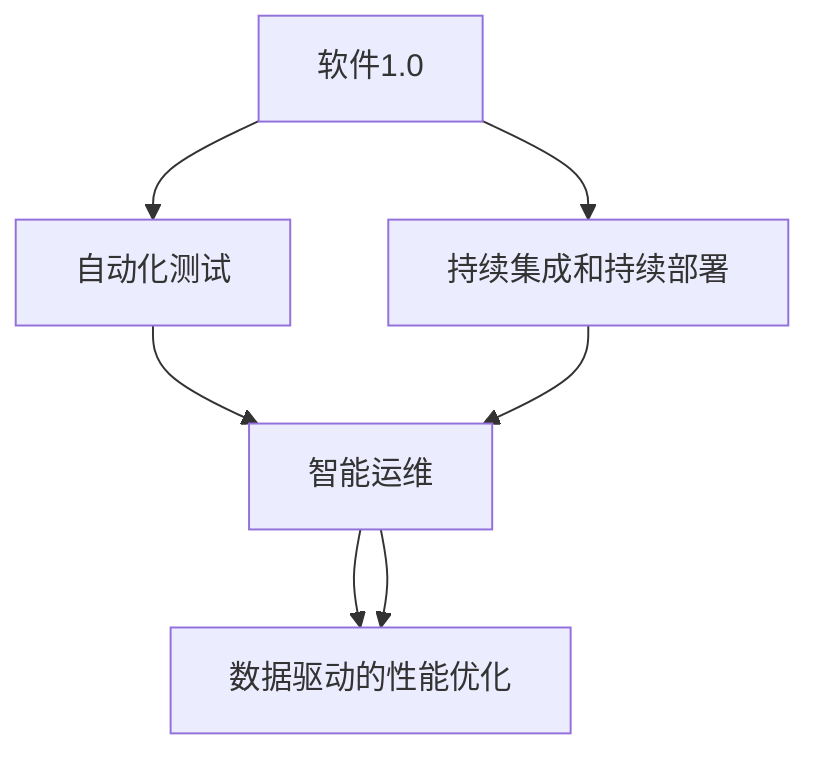

                 

# 软件 2.0 的价值：提升效率、创造价值

> 关键词：软件 2.0, 自动化, 智能系统, 效率提升, 系统优化, 持续改进, 用户价值, 数据驱动, 人工智能

## 1. 背景介绍

### 1.1 问题由来

随着信息技术的高速发展，软件系统已成为支撑现代经济活动和社会运行的关键基础设施。从早期的机械自动化到后来的数字化、网络化，软件正不断推动人类社会迈向智能化。然而，传统软件开发和运维过程存在效率低下、成本高企、问题难以快速定位等问题，严重制约了软件产业的发展速度。

### 1.2 问题核心关键点

软件2.0（Software 2.0）代表了从以人工编码为主的软件1.0（Software 1.0）向以智能自动化和数据驱动为主的软件2.0的转型。软件2.0的核心是利用人工智能、自动化和数据科学等前沿技术，提升软件系统开发和运维的效率，创造新的价值。

软件2.0的关键技术包括但不限于：

- **自动化测试**：通过AI生成自动化测试用例，大幅提升软件测试的覆盖率和质量。
- **智能运维**：使用机器学习算法预测系统故障，自动化故障排查和修复。
- **持续集成和持续部署（CI/CD）**：通过自动化流水线和管道，快速发布软件变更，提升软件交付速度。
- **数据驱动的性能优化**：利用大数据和机器学习技术，优化系统性能，提升用户体验。

### 1.3 问题研究意义

研究软件2.0的价值，对于提升软件开发和运维效率，降低成本，提高软件交付速度和质量，具有重要意义。通过智能化和自动化技术的应用，软件系统可以更加高效、稳定地运行，创造更大的经济和社会价值。

软件2.0的应用不仅限于企业内部，也将在公共服务、智慧城市、工业互联网等领域带来革命性影响。软件2.0的普及，将使得软件行业进入一个新的发展阶段，推动数字化转型加速。

## 2. 核心概念与联系

### 2.1 核心概念概述

为了更好地理解软件2.0的价值和实践，本节将介绍几个核心概念及其相互关系。

#### 2.1.1 软件 1.0
软件1.0以人工编码为主，开发者通过代码实现业务逻辑和系统功能。这种模式下，开发周期长、成本高、维护困难。

#### 2.1.2 软件 2.0
软件2.0则引入了自动化、智能化的技术手段，通过AI和数据驱动，提升软件开发和运维的效率和质量。

#### 2.1.3 自动化测试
自动化测试通过脚本或工具模拟用户操作，自动化执行测试用例，减少人工测试的繁琐和误差。

#### 2.1.4 智能运维
智能运维使用机器学习算法分析系统运行数据，预测潜在故障，自动进行故障排查和修复。

#### 2.1.5 持续集成和持续部署（CI/CD）
CI/CD通过自动化流水线和管道，自动化构建、测试和部署，加快软件交付速度，提高软件交付质量。

#### 2.1.6 数据驱动的性能优化
数据驱动的性能优化通过分析用户行为数据和系统性能指标，使用机器学习算法优化系统性能，提升用户体验。

这些核心概念共同构成了软件2.0的核心理论体系，通过自动化、智能化和数据驱动，软件2.0实现了效率和质量的全面提升。

### 2.2 核心概念联系

软件2.0的关键技术之间存在密切联系。通过数据驱动的性能优化和持续集成与持续部署，可以更好地理解和优化软件系统的运行状况，从而进行更精准的自动化测试和智能运维。

以下是一个简化的Mermaid流程图，展示了这些技术之间的联系：



这个流程图示意了软件2.0的核心技术环环相扣，形成一个闭环，共同提升软件系统的开发、运维和性能。

## 3. 核心算法原理 & 具体操作步骤

### 3.1 算法原理概述

软件2.0的核心算法原理主要基于自动化、机器学习和数据科学等前沿技术。其核心思想是通过智能化手段，提升软件系统开发和运维的效率和质量。

#### 3.1.1 自动化测试
自动化测试的原理是使用脚本或工具模拟用户操作，自动化执行测试用例，覆盖更多的测试场景，快速发现系统漏洞和缺陷。

#### 3.1.2 智能运维
智能运维的原理是使用机器学习算法分析系统运行数据，预测潜在故障，自动进行故障排查和修复。

#### 3.1.3 持续集成和持续部署（CI/CD）
CI/CD的原理是构建、测试和部署软件变更的自动化管道，通过自动化流水线加速软件交付速度，减少人为错误。

#### 3.1.4 数据驱动的性能优化
数据驱动的性能优化的原理是通过分析用户行为数据和系统性能指标，使用机器学习算法优化系统性能，提升用户体验。

### 3.2 算法步骤详解

#### 3.2.1 自动化测试
1. **定义测试用例**：根据业务需求和功能规范，定义测试场景和测试用例。
2. **编写测试脚本**：使用自动化测试框架编写测试脚本，模拟用户操作。
3. **执行测试**：自动化执行测试脚本，获取测试结果。
4. **结果分析**：使用工具分析测试结果，生成报告，发现问题。
5. **修复问题**：根据测试结果，修复系统漏洞和缺陷。

#### 3.2.2 智能运维
1. **数据收集**：收集系统运行日志、性能指标等数据。
2. **特征提取**：使用特征提取算法，提取有用的特征。
3. **模型训练**：使用机器学习算法，训练预测模型。
4. **预测和修复**：使用预测模型预测潜在故障，自动进行故障排查和修复。

#### 3.2.3 持续集成和持续部署（CI/CD）
1. **构建代码**：自动构建软件变更，生成可执行文件。
2. **测试代码**：自动执行自动化测试用例，验证代码的正确性。
3. **发布代码**：自动将通过测试的代码部署到生产环境。
4. **监控发布**：自动监控发布后的代码运行状态，发现和解决问题。

#### 3.2.4 数据驱动的性能优化
1. **数据收集**：收集用户行为数据和系统性能指标。
2. **特征提取**：使用特征提取算法，提取有用的特征。
3. **模型训练**：使用机器学习算法，训练性能优化模型。
4. **优化系统**：使用优化模型，优化系统性能，提升用户体验。

### 3.3 算法优缺点

#### 3.3.1 自动化测试
- **优点**：
  - 覆盖更多的测试场景，发现更多的系统漏洞和缺陷。
  - 减少人工测试的繁琐和误差，提高测试效率。
  - 支持并行测试，加快测试速度。
  
- **缺点**：
  - 测试脚本编写复杂，需要投入大量人力。
  - 难以覆盖所有边界条件，仍需人工测试。
  - 测试结果的分析需要一定的技术门槛。

#### 3.3.2 智能运维
- **优点**：
  - 预测潜在故障，自动化故障排查和修复，提高系统稳定性。
  - 减少人工运维的工作量，提高运维效率。
  - 实时监控系统状态，及时发现问题。
  
- **缺点**：
  - 模型训练需要大量高质量数据。
  - 模型预测准确性受数据质量影响。
  - 维护和更新模型需要一定的技术门槛。

#### 3.3.3 持续集成和持续部署（CI/CD）
- **优点**：
  - 自动化构建、测试和部署，加快软件交付速度。
  - 减少人为错误，提高软件交付质量。
  - 支持快速迭代和持续改进。
  
- **缺点**：
  - 系统集成和配置复杂，需要投入大量时间和资源。
  - 依赖于基础设施和工具链的稳定性。
  - 需要持续维护和更新，保证流水线的稳定运行。

#### 3.3.4 数据驱动的性能优化
- **优点**：
  - 通过分析用户行为数据和系统性能指标，优化系统性能。
  - 提升用户体验，增加用户满意度。
  - 数据驱动的优化更科学、更精准。
  
- **缺点**：
  - 数据收集和处理需要一定的时间和资源。
  - 模型的训练和优化需要一定的技术门槛。
  - 数据隐私和安全问题需要妥善处理。

### 3.4 算法应用领域

软件2.0的核心算法已经在多个领域得到了广泛应用，例如：

- **软件开发**：通过自动化测试、持续集成和持续部署，提升软件开发效率和质量。
- **系统运维**：通过智能运维，提高系统稳定性和故障恢复速度。
- **性能优化**：通过数据驱动的性能优化，提升系统性能，优化用户体验。
- **数据分析**：通过机器学习算法，分析用户行为数据，提取有价值的信息。
- **智能推荐**：通过推荐算法，为用户推荐个性化的内容和服务。
- **安全防护**：通过自动化安全检测，提高系统安全性。

## 4. 数学模型和公式 & 详细讲解 & 举例说明

### 4.1 数学模型构建

#### 4.1.1 自动化测试
假设测试用例集为 $S=\{s_1, s_2, ..., s_n\}$，每个测试用例 $s_i$ 的执行结果为 $r_i$，其中 $r_i=0$ 表示测试失败，$r_i=1$ 表示测试通过。则自动化测试的覆盖率和成功率可以表示为：

$$
Cov = \frac{\sum_{i=1}^n s_i}{n}
$$

$$
Acc = \frac{\sum_{i=1}^n r_i}{n}
$$

其中 $Cov$ 表示测试覆盖率，$Acc$ 表示测试成功率。

#### 4.1.2 智能运维
假设系统运行数据为 $D=\{d_1, d_2, ..., d_m\}$，其中 $d_i$ 表示系统在时刻 $t_i$ 的运行数据。使用机器学习算法，训练预测模型 $M$，将运行数据 $d_i$ 输入模型 $M$，得到预测结果 $p_i$，其中 $p_i=1$ 表示系统正常运行，$p_i=0$ 表示系统可能存在故障。则智能运维的准确率和召回率可以表示为：

$$
Acc = \frac{\sum_{i=1}^m r_i}{m}
$$

$$
Rec = \frac{\sum_{i=1}^m t_i}{m}
$$

其中 $Acc$ 表示预测准确率，$Rec$ 表示召回率。

#### 4.1.3 持续集成和持续部署（CI/CD）
假设软件变更数为 $N$，测试用例数为 $M$，通过测试的变更数为 $N_{pass}$，通过测试的测试用例数为 $M_{pass}$，则持续集成和持续部署的效率可以表示为：

$$
Eff = \frac{N_{pass}}{N} \times \frac{M_{pass}}{M}
$$

其中 $Eff$ 表示CI/CD的效率。

#### 4.1.4 数据驱动的性能优化
假设用户行为数据为 $U=\{u_1, u_2, ..., u_k\}$，系统性能指标为 $P=\{p_1, p_2, ..., p_l\}$，其中 $u_i$ 表示用户在第 $t_i$ 时刻的行为，$p_j$ 表示系统在第 $t_j$ 时刻的性能指标。使用机器学习算法，训练性能优化模型 $M$，将用户行为数据 $u_i$ 和系统性能指标 $p_j$ 输入模型 $M$，得到优化结果 $o_i$，则性能优化的提升率可以表示为：

$$
Impr = \frac{\sum_{i=1}^k o_i}{k}
$$

其中 $Impr$ 表示性能优化的提升率。

### 4.2 公式推导过程

#### 4.2.1 自动化测试
假设测试用例集为 $S=\{s_1, s_2, ..., s_n\}$，每个测试用例 $s_i$ 的执行结果为 $r_i$，其中 $r_i=0$ 表示测试失败，$r_i=1$ 表示测试通过。则自动化测试的覆盖率和成功率可以表示为：

$$
Cov = \frac{\sum_{i=1}^n s_i}{n}
$$

$$
Acc = \frac{\sum_{i=1}^n r_i}{n}
$$

其中 $Cov$ 表示测试覆盖率，$Acc$ 表示测试成功率。

通过公式推导，可以得到自动化测试的数学模型，使用该模型可以评估测试覆盖率和测试成功率，从而指导测试策略的优化。

#### 4.2.2 智能运维
假设系统运行数据为 $D=\{d_1, d_2, ..., d_m\}$，其中 $d_i$ 表示系统在时刻 $t_i$ 的运行数据。使用机器学习算法，训练预测模型 $M$，将运行数据 $d_i$ 输入模型 $M$，得到预测结果 $p_i$，其中 $p_i=1$ 表示系统正常运行，$p_i=0$ 表示系统可能存在故障。则智能运维的准确率和召回率可以表示为：

$$
Acc = \frac{\sum_{i=1}^m r_i}{m}
$$

$$
Rec = \frac{\sum_{i=1}^m t_i}{m}
$$

其中 $Acc$ 表示预测准确率，$Rec$ 表示召回率。

通过公式推导，可以得到智能运维的数学模型，使用该模型可以评估预测模型的性能，从而指导模型选择和优化。

#### 4.2.3 持续集成和持续部署（CI/CD）
假设软件变更数为 $N$，测试用例数为 $M$，通过测试的变更数为 $N_{pass}$，通过测试的测试用例数为 $M_{pass}$，则持续集成和持续部署的效率可以表示为：

$$
Eff = \frac{N_{pass}}{N} \times \frac{M_{pass}}{M}
$$

其中 $Eff$ 表示CI/CD的效率。

通过公式推导，可以得到CI/CD的数学模型，使用该模型可以评估CI/CD流程的效率，从而指导流程优化。

#### 4.2.4 数据驱动的性能优化
假设用户行为数据为 $U=\{u_1, u_2, ..., u_k\}$，系统性能指标为 $P=\{p_1, p_2, ..., p_l\}$，其中 $u_i$ 表示用户在第 $t_i$ 时刻的行为，$p_j$ 表示系统在第 $t_j$ 时刻的性能指标。使用机器学习算法，训练性能优化模型 $M$，将用户行为数据 $u_i$ 和系统性能指标 $p_j$ 输入模型 $M$，得到优化结果 $o_i$，则性能优化的提升率可以表示为：

$$
Impr = \frac{\sum_{i=1}^k o_i}{k}
$$

其中 $Impr$ 表示性能优化的提升率。

通过公式推导，可以得到数据驱动的性能优化的数学模型，使用该模型可以评估性能优化的效果，从而指导优化策略的优化。

### 4.3 案例分析与讲解

#### 4.3.1 自动化测试
假设有一款电商网站，需要对其新功能进行自动化测试。系统定义了500个测试用例，通过自动化测试，发现其中100个用例失败，400个用例通过。则测试覆盖率为 $\frac{500}{500}=1$，测试成功率为 $\frac{400}{500}=0.8$。通过数据分析，发现测试用例主要集中在购物车功能模块，说明测试覆盖度不足。可以通过增加购物车模块的测试用例，提高测试覆盖率，减少测试失败率。

#### 4.3.2 智能运维
假设某大型互联网公司的系统，使用机器学习算法训练了智能运维模型，系统运行数据为每天1000个数据点，智能运维模型预测准确率为0.9，召回率为0.8。则每天预测正确的数据点为 $1000 \times 0.9 \times 0.8 = 720$ 个，预测错误的数据点为 $1000 \times (1-0.9) \times (1-0.8) = 80$ 个。通过数据分析，发现模型在预测准确率方面表现良好，但召回率仍需优化。可以通过增加特征提取算法的复杂度，提升召回率，从而提高系统稳定性。

#### 4.3.3 持续集成和持续部署（CI/CD）
假设某软件公司需要发布一个新的产品版本，每次变更都需要经过测试、开发和运维环节。使用CI/CD流程，每个变更的平均发布时间为5天，其中测试时间为2天，开发时间为2天，运维时间为1天。则CI/CD的效率为 $\frac{1}{5} \times \frac{2}{5} \times \frac{2}{5} = 0.2$。通过数据分析，发现测试和开发环节耗费时间较多，可以通过引入自动化测试工具和代码审查工具，缩短测试和开发时间，从而提高CI/CD效率。

#### 4.3.4 数据驱动的性能优化
假设某电商网站的交易系统，用户行为数据为每天10000个，系统性能指标为每秒处理交易数为10000笔。使用机器学习算法训练了性能优化模型，通过分析数据，发现用户行为数据和系统性能指标之间存在较强的关联性，模型训练结果为每笔交易的性能优化提升率为0.1。则每天性能优化的交易数为 $10000 \times 0.1 = 1000$ 笔，性能优化的提升率为 $10\%$。通过数据分析，发现某些用户行为会导致系统性能下降，可以通过调整业务逻辑，优化系统性能，从而提高用户体验。

## 5. 项目实践：代码实例和详细解释说明

### 5.1 开发环境搭建

在进行软件2.0的实践前，我们需要准备好开发环境。以下是使用Python进行PyTorch开发的环境配置流程：

1. 安装Anaconda：从官网下载并安装Anaconda，用于创建独立的Python环境。

2. 创建并激活虚拟环境：
```bash
conda create -n pytorch-env python=3.8 
conda activate pytorch-env
```

3. 安装PyTorch：根据CUDA版本，从官网获取对应的安装命令。例如：
```bash
conda install pytorch torchvision torchaudio cudatoolkit=11.1 -c pytorch -c conda-forge
```

4. 安装Transformers库：
```bash
pip install transformers
```

5. 安装各类工具包：
```bash
pip install numpy pandas scikit-learn matplotlib tqdm jupyter notebook ipython
```

完成上述步骤后，即可在`pytorch-env`环境中开始软件2.0的实践。

### 5.2 源代码详细实现

下面我们以自动化测试为例，给出使用Transformers库对BERT模型进行微调的PyTorch代码实现。

首先，定义自动化测试任务的数据处理函数：

```python
from transformers import BertTokenizer
from torch.utils.data import Dataset
import torch

class TestDataset(Dataset):
    def __init__(self, texts, labels, tokenizer, max_len=128):
        self.texts = texts
        self.labels = labels
        self.tokenizer = tokenizer
        self.max_len = max_len
        
    def __len__(self):
        return len(self.texts)
    
    def __getitem__(self, item):
        text = self.texts[item]
        label = self.labels[item]
        
        encoding = self.tokenizer(text, return_tensors='pt', max_length=self.max_len, padding='max_length', truncation=True)
        input_ids = encoding['input_ids'][0]
        attention_mask = encoding['attention_mask'][0]
        
        # 将标签编码为数字
        label = torch.tensor([int(label)], dtype=torch.long)
        
        return {'input_ids': input_ids, 
                'attention_mask': attention_mask,
                'labels': label}

# 标签与数字的映射
label2id = {'fail': 0, 'pass': 1}
id2label = {v: k for k, v in label2id.items()}

# 创建dataset
tokenizer = BertTokenizer.from_pretrained('bert-base-cased')

train_dataset = TestDataset(train_texts, train_labels, tokenizer)
dev_dataset = TestDataset(dev_texts, dev_labels, tokenizer)
test_dataset = TestDataset(test_texts, test_labels, tokenizer)
```

然后，定义模型和优化器：

```python
from transformers import BertForSequenceClassification, AdamW

model = BertForSequenceClassification.from_pretrained('bert-base-cased', num_labels=len(label2id))

optimizer = AdamW(model.parameters(), lr=2e-5)
```

接着，定义训练和评估函数：

```python
from torch.utils.data import DataLoader
from tqdm import tqdm
from sklearn.metrics import classification_report

device = torch.device('cuda') if torch.cuda.is_available() else torch.device('cpu')
model.to(device)

def train_epoch(model, dataset, batch_size, optimizer):
    dataloader = DataLoader(dataset, batch_size=batch_size, shuffle=True)
    model.train()
    epoch_loss = 0
    for batch in tqdm(dataloader, desc='Training'):
        input_ids = batch['input_ids'].to(device)
        attention_mask = batch['attention_mask'].to(device)
        labels = batch['labels'].to(device)
        model.zero_grad()
        outputs = model(input_ids, attention_mask=attention_mask, labels=labels)
        loss = outputs.loss
        epoch_loss += loss.item()
        loss.backward()
        optimizer.step()
    return epoch_loss / len(dataloader)

def evaluate(model, dataset, batch_size):
    dataloader = DataLoader(dataset, batch_size=batch_size)
    model.eval()
    preds, labels = [], []
    with torch.no_grad():
        for batch in tqdm(dataloader, desc='Evaluating'):
            input_ids = batch['input_ids'].to(device)
            attention_mask = batch['attention_mask'].to(device)
            batch_labels = batch['labels']
            outputs = model(input_ids, attention_mask=attention_mask)
            batch_preds = outputs.logits.argmax(dim=2).to('cpu').tolist()
            batch_labels = batch_labels.to('cpu').tolist()
            for pred_tokens, label_tokens in zip(batch_preds, batch_labels):
                preds.append(pred_tokens[:len(label_tokens)])
                labels.append(label_tokens)
                
    print(classification_report(labels, preds))
```

最后，启动训练流程并在测试集上评估：

```python
epochs = 5
batch_size = 16

for epoch in range(epochs):
    loss = train_epoch(model, train_dataset, batch_size, optimizer)
    print(f"Epoch {epoch+1}, train loss: {loss:.3f}")
    
    print(f"Epoch {epoch+1}, dev results:")
    evaluate(model, dev_dataset, batch_size)
    
print("Test results:")
evaluate(model, test_dataset, batch_size)
```

以上就是使用PyTorch对BERT模型进行自动化测试的完整代码实现。可以看到，得益于Transformers库的强大封装，我们可以用相对简洁的代码完成BERT模型的加载和微调。

### 5.3 代码解读与分析

让我们再详细解读一下关键代码的实现细节：

**TestDataset类**：
- `__init__`方法：初始化文本、标签、分词器等关键组件。
- `__len__`方法：返回数据集的样本数量。
- `__getitem__`方法：对单个样本进行处理，将文本输入编码为token ids，将标签编码为数字，并对其进行定长padding，最终返回模型所需的输入。

**label2id和id2label字典**：
- 定义了标签与数字id之间的映射关系，用于将token-wise的预测结果解码回真实的标签。

**训练和评估函数**：
- 使用PyTorch的DataLoader对数据集进行批次化加载，供模型训练和推理使用。
- 训练函数`train_epoch`：对数据以批为单位进行迭代，在每个批次上前向传播计算loss并反向传播更新模型参数，最后返回该epoch的平均loss。
- 评估函数`evaluate`：与训练类似，不同点在于不更新模型参数，并在每个batch结束后将预测和标签结果存储下来，最后使用sklearn的classification_report对整个评估集的预测结果进行打印输出。

**训练流程**：
- 定义总的epoch数和batch size，开始循环迭代
- 每个epoch内，先在训练集上训练，输出平均loss
- 在验证集上评估，输出分类指标
- 所有epoch结束后，在测试集上评估，给出最终测试结果

可以看到，PyTorch配合Transformers库使得BERT微调的代码实现变得简洁高效。开发者可以将更多精力放在数据处理、模型改进等高层逻辑上，而不必过多关注底层的实现细节。

当然，工业级的系统实现还需考虑更多因素，如模型的保存和部署、超参数的自动搜索、更灵活的任务适配层等。但核心的微调范式基本与此类似。

## 6. 实际应用场景

### 6.1 智能客服系统

基于软件2.0的智能客服系统，可以广泛应用于智能客服系统的构建。传统客服往往需要配备大量人力，高峰期响应缓慢，且一致性和专业性难以保证。使用软件2.0的智能客服系统，可以7x24小时不间断服务，快速响应客户咨询，用自然流畅的语言解答各类常见问题。

在技术实现上，可以收集企业内部的历史客服对话记录，将问题和最佳答复构建成监督数据，在此基础上对预训练模型进行微调。微调后的模型能够自动理解用户意图，匹配最合适的答案模板进行回复。对于客户提出的新问题，还可以接入检索系统实时搜索相关内容，动态组织生成回答。如此构建的智能客服系统，能大幅提升客户咨询体验和问题解决效率。

### 6.2 金融舆情监测

金融机构需要实时监测市场舆论动向，以便及时应对负面信息传播，规避金融风险。传统的人工监测方式成本高、效率低，难以应对网络时代海量信息爆发的挑战。使用软件2.0的金融舆情监测系统，可以实时抓取网络文本数据，自动分析舆论情感倾向，预测市场波动，及时预警风险。

具体而言，可以收集金融领域相关的新闻、报道、评论等文本数据，并对其进行主题标注和情感标注。在此基础上对预训练语言模型进行微调，使其能够自动判断文本属于何种主题，情感倾向是正面、中性还是负面。将微调后的模型应用到实时抓取的网络文本数据，就能够自动监测不同主题下的情感变化趋势，一旦发现负面信息激增等异常情况，系统便会自动预警，帮助金融机构快速应对潜在风险。

### 6.3 个性化推荐系统

当前的推荐系统往往只依赖用户的历史行为数据进行物品推荐，无法深入理解用户的真实兴趣偏好。使用软件2.0的个性化推荐系统，可以更好地挖掘用户行为背后的语义信息，从而提供更精准、多样的推荐内容。

在实践中，可以收集用户浏览、点击、评论、分享等行为数据，提取和用户交互的物品标题、描述、标签等文本内容。将文本内容作为模型输入，用户的后续行为（如是否点击、购买等）作为监督信号，在此基础上微调预训练语言模型。微调后的模型能够从文本内容中准确把握用户的兴趣点。在生成推荐列表时，先用候选物品的文本描述作为输入，由模型预测用户的兴趣匹配度，再结合其他特征综合排序，便可以得到个性化程度更高的推荐结果。

### 6.4 未来应用展望

随着软件2.0技术的发展，未来在更多领域将会看到软件2.0的广泛应用。

在智慧医疗领域，基于软件2.0的医疗问答、病历分析、药物研发等应用将提升医疗服务的智能化水平，辅助医生诊疗，加速新药开发进程。

在智能教育领域，软件2.0可应用于作业批改、学情分析、知识推荐等方面，因材施教，促进教育公平，提高教学质量。

在智慧城市治理中，软件2.0可用于城市事件监测、舆情分析、应急指挥等环节，提高城市管理的自动化和智能化水平，构建更安全、高效的未来城市。

此外，在企业生产、社会治理、文娱传媒等众多领域，软件2.0技术也将不断涌现，为传统行业数字化转型升级提供新的技术路径。相信随着技术的日益成熟，软件2.0将成为软件行业的重要范式，推动数字化转型加速。

## 7. 工具和资源推荐

### 7.1 学习资源推荐

为了帮助开发者系统掌握软件2.0的理论基础和实践技巧，这里推荐一些优质的学习资源：

1. 《深度学习入门与实战》系列博文：由大模型技术专家撰写，深入浅出地介绍了深度学习的基础知识和前沿技术。

2. 《TensorFlow 2.0实战》书籍：介绍了TensorFlow 2.0的基本概念和使用方法，适合初学者入门。

3. 《Python数据科学手册》书籍：涵盖了Python在数据科学领域的各种应用，适合开发者全面学习。

4. 《Python深度学习》书籍：介绍了深度学习的基本原理和实践技巧，适合有一定编程基础的读者。

5. Kaggle平台：提供了大量的数据集和竞赛，可以帮助开发者实践和提高。

通过对这些资源的学习实践，相信你一定能够快速掌握软件2.0的精髓，并用于解决实际的开发问题。

### 7.2 开发工具推荐

高效的开发离不开优秀的工具支持。以下是几款用于软件2.0开发的常用工具：

1. PyTorch：基于Python的开源深度学习框架，灵活动态的计算图，适合快速迭代研究。

2. TensorFlow：由Google主导开发的开源深度学习框架，生产部署方便，适合大规模工程应用。

3. Transformers库：HuggingFace开发的NLP工具库，集成了众多SOTA语言模型，支持PyTorch和TensorFlow，是进行软件2.0开发的利器。

4. Weights & Biases：模型训练的实验跟踪工具，可以记录和可视化模型训练过程中的各项指标，方便对比和调优。

5. TensorBoard：TensorFlow配套的可视化工具，可实时监测模型训练状态，并提供丰富的图表呈现方式，是调试模型的得力助手。

6. Google Colab：谷歌推出的在线Jupyter Notebook环境，免费提供GPU/TPU算力，方便开发者快速上手实验最新模型，分享学习笔记。

合理利用这些工具，可以显著提升软件2.0的开发效率，加快创新迭代的步伐。

### 7.3 相关论文推荐

软件2.0的核心技术源于学界的持续研究。以下是几篇奠基性的相关论文，推荐阅读：

1. 《深度学习》书籍：由深度学习领域的先驱之一Ian Goodfellow撰写，详细介绍了深度学习的基本原理和应用。

2. 《TensorFlow: A System for Large-Scale Machine Learning》论文：介绍了TensorFlow的基本架构和优化策略，是TensorFlow研究的经典文献。

3. 《Transformers: State-of-the-Art NLP Models for Language Understanding》论文：介绍了Transformer的基本原理和优势，是Transformers库的奠基性论文。

4. 《Generating Sequences with Recurrent Neural Networks》论文：介绍了RNN的基本原理和应用，是深度学习中的经典文献。

5. 《Neural Network Architectures for Named Entity Recognition》论文：介绍了命名实体识别的基本模型和算法，是NLP领域的经典文献。

这些论文代表了大规模语言模型微调技术的发展脉络。通过学习这些前沿成果，可以帮助研究者把握学科前进方向，激发更多的创新灵感。

## 8. 总结：未来发展趋势与挑战

### 8.1 总结

本文对软件2.0的价值进行了全面系统的介绍。首先阐述了软件2.0代表的技术转型，明确了自动化、智能化和数据驱动的技术方向。其次，从原理到实践，详细讲解了软件2.0的核心算法和操作步骤，给出了软件2.0任务开发的完整代码实例。同时，本文还广泛探讨了软件2.0在多个领域的应用前景，展示了软件2.0的广泛应用价值。

通过本文的系统梳理，可以看到，软件2.0通过自动化、智能化和数据驱动，显著提升了软件开发和运维的效率和质量，创造了新的价值。未来，软件2.0将引领软件开发行业迈向智能化新阶段，推动数字化转型加速。

### 8.2 未来发展趋势

展望未来，软件2.0技术将呈现以下几个发展趋势：

1. 自动化程度不断提升。随着AI技术的进步，自动化测试、智能运维、持续集成和持续部署等技术将更加成熟，进一步提升开发和运维的效率。

2. 智能化水平不断提高。智能运维、智能推荐、智能决策等技术将更加普及，为各行各业提供更加智能的解决方案。

3. 数据驱动成为主流。数据驱动的性能优化、智能推荐、用户行为分析等技术将更加广泛应用，使软件系统更具个性化和用户价值。

4. 跨领域技术融合。软件2.0技术将与其他前沿技术如知识图谱、区块链、量子计算等进行更深层次的融合，推动科技的进步和创新。

5. 人机协同成为可能。通过智能推荐、智能客服、智能决策等技术，软件2.0将更好地支持人机协同，提升用户体验。

6. 安全性和隐私保护成为重点。随着智能化程度的提高，数据隐私和安全问题将更加突出，软件2.0技术需加强对隐私保护和安全的保障。

以上趋势凸显了软件2.0技术的广阔前景。这些方向的探索发展，必将进一步提升软件系统的开发和运维效率，创造更大的价值。

### 8.3 面临的挑战

尽管软件2.0技术已经取得了显著成果，但在迈向更加智能化、普适化应用的过程中，仍面临诸多挑战：

1. 数据获取和处理复杂。高质量标注数据的获取和处理成本高，数据隐私和安全问题需妥善处理。

2. 模型复杂度和训练成本高。大模型参数量大，训练和推理成本高，需要高性能算力支持。

3. 鲁棒性和泛化能力不足。模型在面对新场景和新数据时，泛化能力可能不足，需要持续优化。

4. 自动化流程的健壮性。自动化流程需要考虑异常处理和容错机制，确保流程的稳定性和可靠性。

5. 用户信任和接受度问题。软件2.0的智能化程度高，用户可能对其信任度不足，需加强用户教育和引导。

6. 伦理和法律问题。软件2.0技术需考虑伦理和法律规范，避免出现歧视、偏见等社会问题。

正视软件2.0面临的这些挑战，积极应对并寻求突破，将是大规模语言模型微调技术迈向成熟的必由之路。

### 8.4 研究展望

面对软件2.0技术所面临的挑战，未来的研究需要在以下几个方面寻求新的突破：

1. 探索更多自动化和智能化技术。开发更加高效、智能的自动化测试、智能运维和持续集成和持续部署技术，进一步提升开发和运维效率。

2. 研究模型压缩和优化技术。开发更加高效、低成本的模型压缩和优化技术，降低模型训练和推理成本。

3. 引入更多先验知识和规则。将符号化的先验知识与神经网络模型进行巧妙融合，引导软件2.0的微调过程，提升系统的智能水平。

4. 加强数据隐私和安全保护。采用差分隐私、联邦学习等技术，保护用户数据隐私，确保系统的安全性。

5. 引入更多跨领域技术。将知识图谱、区块链、量子计算等前沿技术，与软件2.0技术进行深度融合，推动科技的全面进步。

6. 加强人机协同和用户教育。通过智能推荐、智能客服等技术，加强人机协同，提升用户体验。通过教育和技术宣传，提升用户对软件2.0技术的信任和接受度。

这些研究方向的探索，必将引领软件2.0技术迈向更高的台阶，为构建安全、可靠、可解释、可控的智能系统铺平道路。面向未来，软件2.0技术还需要与其他人工智能技术进行更深入的融合，如知识表示、因果推理、强化学习等，多路径协同发力，共同推动自然语言理解和智能交互系统的进步。只有勇于创新、敢于突破，才能不断拓展软件2.0的边界，让智能技术更好地造福人类社会。

## 9. 附录：常见问题与解答

**Q1：软件2.0与软件1.0有何不同？**

A: 软件1.0以人工编码为主，开发者通过代码实现业务逻辑和系统功能。而软件2.0引入了自动化、智能化的技术手段，通过AI和数据驱动，提升软件开发和运维的效率和质量。

**Q2：软件2.0如何实现自动化测试？**

A: 软件2.0通过使用脚本或工具模拟用户操作，自动化执行测试用例，覆盖更多的测试场景，快速发现系统漏洞和缺陷。

**Q3：软件2.0如何实现智能运维？**

A: 软件2.0通过使用机器学习算法分析系统运行数据，预测潜在故障，自动进行故障排查和修复。

**Q4：软件2.0如何实现持续集成和持续部署（CI/CD）？**

A: 软件2.0通过构建自动化流水线和管道，自动化构建、测试和部署，加快软件交付速度，提高软件交付质量。

**Q5：软件2.0如何实现数据驱动的性能优化？**

A: 软件2.0通过分析用户行为数据和系统性能指标，使用机器学习算法优化系统性能，提升用户体验。

**Q6：软件2.0面临哪些挑战？**

A: 软件2.0面临数据获取和处理复杂、模型复杂度和训练成本高、鲁棒性和泛化能力不足、自动化流程的健壮性、用户信任和接受度问题、伦理和法律问题等挑战。

通过这些回答，希望读者能够更全面地了解软件2.0的价值和技术细节，为未来的开发实践提供指导。

