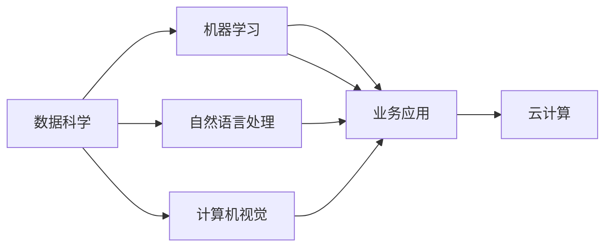

                 

# 软件 2.0 的应用：从实验室走向现实

> 关键词：软件2.0, 人工智能, 数据科学, 技术落地, 系统工程, 云计算, 业务应用

## 1. 背景介绍

### 1.1 问题由来

在过去的几十年里，我们见证了软件工程从第一代（软件1.0）到第二代（软件2.0）的转变。第一代软件以数据处理和信息检索为核心，其基础是以关系型数据库为代表的“数据驱动”模型。随着互联网和移动通信技术的发展，人们开始大量生成和分享数据，这些数据开始成为企业核心资产，数据驱动的应用开始逐渐成为主流。然而，第一代软件对于人类知识的理解仍然非常有限，往往需要人工输入大量的数据和代码才能解决问题。

### 1.2 问题核心关键点

软件2.0的核心目标在于利用人工智能和大数据技术，让软件系统能够自动理解、学习和应用人类知识，以实现真正的智能驱动。软件2.0涵盖了数据科学、机器学习、自然语言处理、计算机视觉、云计算等多个领域，其核心在于利用这些技术来解决实际问题。

软件2.0不仅关注技术创新，更强调系统工程的视角，将数据、算法、基础设施和业务流程紧密结合，形成一体化的解决方案。这使得软件2.0在实际应用中具有更高的可扩展性、可维护性和可重复性，能够应对复杂多变的业务需求。

### 1.3 问题研究意义

研究软件2.0的应用，对于推动各行各业的数字化转型、提高生产效率、优化决策过程、提升客户体验等都具有重要意义。

1. **数字化转型**：软件2.0的智能驱动能力使得企业能够从“以数据为中心”转变为“以知识为中心”，更好地应对市场的变化和挑战。
2. **效率提升**：通过自动化和智能化，软件2.0大幅提升工作效率，减少人工干预和错误，从而降低成本。
3. **决策优化**：软件2.0能够利用大数据和机器学习算法，提供更精准的决策支持，优化决策过程。
4. **客户体验**：通过智能推荐、个性化定制等服务，软件2.0能够显著提升客户体验，增强品牌忠诚度。
5. **技术创新**：软件2.0的技术体系为后续的技术创新提供了基础，推动了相关技术的快速发展。

## 2. 核心概念与联系

### 2.1 核心概念概述

软件2.0的应用领域非常广泛，涵盖了从科学研究到商业运营的各个方面。以下是一些关键概念：

- **数据科学**：涉及数据的采集、清洗、存储、分析和可视化，是软件2.0的基础。
- **机器学习**：通过训练模型，实现数据的自动分析和预测，是软件2.0的核心。
- **自然语言处理**：使机器能够理解和生成自然语言，是软件2.0在语言理解方面的重要应用。
- **计算机视觉**：使机器能够理解和生成图像，是软件2.0在图像处理方面的重要应用。
- **云计算**：提供高效、可扩展的计算和存储资源，是软件2.0实现高性能计算和分布式协作的基础。
- **业务应用**：将技术成果转化为实际的商业应用，是软件2.0的最终目标。

这些核心概念之间的关系可以通过以下Mermaid流程图来展示：



这个流程图展示了数据科学、机器学习、自然语言处理、计算机视觉和业务应用之间的关系。数据科学提供数据基础，机器学习是核心能力，自然语言处理和计算机视觉是具体应用，业务应用是最终目标，而云计算提供技术支撑。

## 3. 核心算法原理 & 具体操作步骤

### 3.1 算法原理概述

软件2.0的核心算法主要包括数据预处理、特征工程、模型训练、模型评估和模型应用等步骤。

1. **数据预处理**：涉及数据的采集、清洗、归一化和特征提取，为后续的分析和建模提供高质量的数据。
2. **特征工程**：通过对数据进行特征提取、转换和选择，提高模型的表现力和泛化能力。
3. **模型训练**：利用机器学习算法，在标注数据上训练模型，学习数据的特征和规律。
4. **模型评估**：通过测试集或验证集，评估模型的性能和泛化能力，选择最优模型。
5. **模型应用**：将训练好的模型应用到实际问题中，实现自动化的分析和决策。

### 3.2 算法步骤详解

软件2.0的应用步骤可以分为以下几个关键环节：

**Step 1: 数据收集与预处理**
- 从不同的数据源（如数据库、API、文件等）收集数据，确保数据的完整性和准确性。
- 对数据进行清洗、去重、补全、转换等预处理操作，消除噪音和异常值，确保数据的可用性。
- 进行特征工程，提取和构造有意义的特征，为模型训练提供高质量输入。

**Step 2: 模型选择与训练**
- 根据问题的类型和数据的特性，选择合适的机器学习算法。
- 使用标注数据集进行模型训练，调整超参数，优化模型性能。
- 使用交叉验证、网格搜索等方法进行模型评估，选择最优模型。

**Step 3: 模型部署与优化**
- 将训练好的模型部署到生产环境中，实现自动化的分析和决策。
- 持续监控模型的性能，根据实际应用情况进行调整和优化。
- 引入模型压缩、推理加速等技术，提高模型的可扩展性和性能。

**Step 4: 模型评估与改进**
- 定期对模型进行评估，使用新数据进行验证，确保模型的持续有效性。
- 根据评估结果，调整模型参数，优化模型性能。
- 引入自动化调参、在线学习等技术，提升模型的适应性和智能性。

### 3.3 算法优缺点

软件2.0的算法具有以下优点：
1. 自动化程度高：利用机器学习算法，实现数据自动分析和决策，提高效率。
2. 泛化能力强：通过特征工程和模型优化，提高模型的泛化能力和稳定性。
3. 可扩展性好：利用云计算技术，实现高效、可扩展的计算和存储资源。
4. 应用广泛：涵盖数据科学、机器学习、自然语言处理、计算机视觉等多个领域，适用于各种实际问题。

同时，软件2.0的算法也存在一些缺点：
1. 数据依赖性强：算法的效果很大程度上依赖于数据的数量和质量，数据采集和清洗成本较高。
2. 模型复杂度高：一些高级算法（如深度学习）需要大量计算资源和训练时间，难以快速部署。
3. 结果可解释性差：机器学习模型往往是“黑盒”系统，难以解释模型的决策过程和结果。
4. 模型鲁棒性不足：面对新的数据和场景，模型的泛化性能可能下降。

尽管存在这些局限性，但软件2.0的算法依然在实际应用中得到了广泛的应用，其自动化和智能化的特性使其在各行各业中都具有巨大的潜力和价值。

### 3.4 算法应用领域

软件2.0的应用领域非常广泛，涵盖科学研究、商业运营、公共服务等各个方面。以下是一些典型的应用场景：

- **金融行业**：利用机器学习算法进行风险评估、信用评分、反欺诈等，提高金融决策的准确性和效率。
- **医疗行业**：通过自然语言处理技术，实现电子病历的自动分析，提高诊断和治疗的精准性。
- **制造业**：利用计算机视觉技术，实现智能质检、设备维护和故障预测，提高生产效率和产品质量。
- **零售行业**：通过数据挖掘和推荐算法，实现个性化推荐和库存优化，提高客户满意度和销售额。
- **公共服务**：利用数据分析和机器学习算法，实现智能交通管理、环境监测和社会安全预测，提升公共服务的质量和效率。

## 4. 数学模型和公式 & 详细讲解 & 举例说明

### 4.1 数学模型构建

软件2.0的核心数学模型主要包括数据预处理模型、特征工程模型、机器学习模型和模型评估模型。

1. **数据预处理模型**：
   - 数据清洗模型：消除噪音和异常值，确保数据的质量。
   - 数据归一化模型：将数据转化为标准分布，提高模型的收敛速度。
   - 特征提取模型：从原始数据中提取有意义的特征，提高模型的表现力。

2. **特征工程模型**：
   - 特征选择模型：选择对模型预测有贡献的特征。
   - 特征转换模型：对特征进行转换和组合，提高模型的表现力。
   - 特征降维模型：减少特征数量，提高模型的计算效率。

3. **机器学习模型**：
   - 监督学习模型：通过标注数据训练模型，实现分类、回归和聚类等任务。
   - 无监督学习模型：利用未标注数据训练模型，实现数据聚类和降维等任务。
   - 强化学习模型：通过试错和反馈机制，实现智能决策和优化。

4. **模型评估模型**：
   - 性能评估模型：使用各种指标（如准确率、召回率、F1值等）评估模型的性能。
   - 泛化评估模型：使用交叉验证和测试集评估模型的泛化能力。
   - 稳定性评估模型：通过多种数据和算法验证模型的鲁棒性和稳定性。

### 4.2 公式推导过程

以线性回归模型为例，其数学公式如下：

$$
y = \beta_0 + \beta_1 x_1 + \beta_2 x_2 + \cdots + \beta_n x_n + \epsilon
$$

其中，$y$ 为输出变量，$x_i$ 为输入变量，$\beta_i$ 为回归系数，$\epsilon$ 为误差项。

使用最小二乘法进行模型拟合，目标函数为：

$$
\mathcal{L}(\beta) = \frac{1}{2m} \sum_{i=1}^m (y_i - (\beta_0 + \beta_1 x_{1,i} + \beta_2 x_{2,i} + \cdots + \beta_n x_{n,i}))^2
$$

通过求解目标函数的最小值，得到最优的回归系数 $\hat{\beta}$。

### 4.3 案例分析与讲解

假设我们有一组关于学生成绩的数据，包括性别、年龄、学习时间和成绩等变量。我们可以使用线性回归模型来预测学生的成绩。

首先，我们需要进行数据预处理和特征工程，清洗数据，进行归一化和特征提取。然后，选择合适的机器学习算法（如线性回归）进行模型训练，调整超参数，优化模型性能。接着，使用交叉验证和测试集评估模型性能，选择最优模型。最后，将模型部署到生产环境中，实现自动化的预测和分析。

## 5. 项目实践：代码实例和详细解释说明

### 5.1 开发环境搭建

在进行软件2.0的开发前，我们需要准备好开发环境。以下是使用Python进行TensorFlow开发的环境配置流程：

1. 安装Anaconda：从官网下载并安装Anaconda，用于创建独立的Python环境。

2. 创建并激活虚拟环境：
```bash
conda create -n tensorflow-env python=3.8 
conda activate tensorflow-env
```

3. 安装TensorFlow：从官网获取对应的安装命令。例如：
```bash
pip install tensorflow==2.6
```

4. 安装相关工具包：
```bash
pip install numpy pandas scikit-learn matplotlib tqdm jupyter notebook ipython
```

完成上述步骤后，即可在`tensorflow-env`环境中开始软件2.0的开发。

### 5.2 源代码详细实现

下面我以线性回归为例，给出使用TensorFlow进行模型训练的PyTorch代码实现。

首先，定义数据集和模型：

```python
import tensorflow as tf
from sklearn.datasets import load_boston
from sklearn.model_selection import train_test_split

# 加载数据集
boston = load_boston()
X = boston.data
y = boston.target

# 划分训练集和测试集
X_train, X_test, y_train, y_test = train_test_split(X, y, test_size=0.2)

# 定义模型
class LinearRegression(tf.keras.Model):
    def __init__(self):
        super(LinearRegression, self).__init__()
        self.w = tf.Variable(tf.random.normal([X.shape[1], 1]))
        self.b = tf.Variable(tf.random.normal([1]))
        
    def call(self, inputs):
        return tf.matmul(inputs, self.w) + self.b
```

然后，定义训练和评估函数：

```python
# 定义优化器和损失函数
optimizer = tf.keras.optimizers.Adam(learning_rate=0.01)
loss_fn = tf.keras.losses.MeanSquaredError()

# 定义训练函数
@tf.function
def train_step(inputs, targets):
    with tf.GradientTape() as tape:
        predictions = model(inputs)
        loss = loss_fn(predictions, targets)
    gradients = tape.gradient(loss, model.trainable_variables)
    optimizer.apply_gradients(zip(gradients, model.trainable_variables))
    return loss

# 定义评估函数
@tf.function
def evaluate(inputs, targets):
    predictions = model(inputs)
    loss = loss_fn(predictions, targets)
    return loss.numpy().mean()
```

最后，启动训练流程并在测试集上评估：

```python
# 创建模型
model = LinearRegression()

# 训练模型
for epoch in range(1000):
    for X_batch, y_batch in train_dataset:
        loss = train_step(X_batch, y_batch)
    if epoch % 100 == 0:
        print(f"Epoch {epoch+1}, loss: {evaluate(X_test, y_test)}")
```

以上就是使用TensorFlow进行线性回归模型训练的完整代码实现。可以看到，TensorFlow提供了丰富的API和工具，使得模型开发和训练变得非常便捷和高效。

### 5.3 代码解读与分析

让我们再详细解读一下关键代码的实现细节：

**LinearRegression类**：
- `__init__`方法：初始化模型参数，包括权重和偏置项。
- `call`方法：定义模型前向传播过程。

**train_step和evaluate函数**：
- 利用TensorFlow的函数式API，对模型进行梯度计算和参数更新。
- 定义了训练函数和评估函数，分别用于计算损失和进行模型评估。

**模型训练**：
- 使用`for`循环进行多轮迭代训练。
- 在每一轮中，遍历训练数据集，计算损失并更新模型参数。
- 每100轮输出一次训练集和测试集的损失，监控模型训练进度。

## 6. 实际应用场景

### 6.1 智能推荐系统

软件2.0的推荐系统利用机器学习算法，能够根据用户的历史行为和偏好，实时推荐符合其兴趣的商品和服务。智能推荐系统已经在电商、新闻、音乐等领域得到了广泛应用。

具体而言，可以收集用户的浏览记录、购买历史、评分反馈等数据，使用协同过滤、基于内容的推荐算法、深度学习等方法，训练推荐模型。通过实时分析用户的在线行为，系统能够动态生成个性化的推荐内容，提升用户满意度和转化率。

### 6.2 智能客服系统

软件2.0的智能客服系统利用自然语言处理技术，能够自动理解用户意图，并生成合适的回复。智能客服系统已经在银行、保险、电商等多个行业得到了应用，大大提升了客户服务效率和质量。

具体而言，可以收集用户与客服的历史对话记录，训练对话模型。系统能够自动分析用户的问题，匹配最合适的回复模板，并根据上下文动态生成自然流畅的回复，提升用户的咨询体验。

### 6.3 智能风控系统

软件2.0的风控系统利用机器学习算法，能够实时监控交易行为，识别异常交易并及时预警。智能风控系统已经在金融、电商等多个领域得到了应用，提升了企业的安全性和风险管理能力。

具体而言，可以收集用户的交易记录、行为特征等数据，训练异常检测模型。系统能够实时分析交易行为，识别出可疑交易并及时报警，降低企业的损失和风险。

### 6.4 未来应用展望

随着数据科学和机器学习技术的不断进步，软件2.0的应用将更加广泛和深入。

在医疗领域，软件2.0可以利用自然语言处理技术，分析电子病历和医疗记录，提供精准的诊断和治疗建议。在教育领域，软件2.0可以利用机器学习算法，提供个性化的学习路径和资源推荐，提升教育质量和学习效率。在环保领域，软件2.0可以利用数据科学和机器学习算法，优化资源配置和管理，实现可持续发展。

总之，软件2.0在各个领域的应用前景广阔，未来必将推动社会各个方面的智能化转型。

## 7. 工具和资源推荐

### 7.1 学习资源推荐

为了帮助开发者系统掌握软件2.0的理论基础和实践技巧，这里推荐一些优质的学习资源：

1. **《深度学习》**：Ian Goodfellow等人的经典教材，系统介绍了深度学习的基础理论和实践方法。
2. **Coursera和edX**：提供大量优秀的在线课程，涵盖深度学习、机器学习、数据科学等多个领域。
3. **Kaggle**：提供丰富的数据集和竞赛平台，帮助开发者实践和提升技能。
4. **Google AI**：提供丰富的学习资源和实践平台，涵盖自然语言处理、计算机视觉等多个领域。
5. **PyTorch官方文档**：提供详细的API文档和案例代码，帮助开发者快速上手TensorFlow和PyTorch。

通过对这些资源的学习实践，相信你一定能够快速掌握软件2.0的精髓，并用于解决实际的业务问题。

### 7.2 开发工具推荐

高效的开发离不开优秀的工具支持。以下是几款用于软件2.0开发的常用工具：

1. **PyTorch**：基于Python的开源深度学习框架，灵活动态的计算图，适合快速迭代研究。
2. **TensorFlow**：由Google主导开发的开源深度学习框架，生产部署方便，适合大规模工程应用。
3. **Keras**：高层次的深度学习框架，易于上手，适合快速原型开发。
4. **Jupyter Notebook**：交互式的笔记本环境，支持多语言代码编写和实时可视化。
5. **Git**：版本控制系统，方便团队协作和代码管理。

合理利用这些工具，可以显著提升软件2.0的开发效率，加快创新迭代的步伐。

### 7.3 相关论文推荐

软件2.0的迅速发展离不开学界的持续研究。以下是几篇奠基性的相关论文，推荐阅读：

1. **《Deep Learning》**：Ian Goodfellow等人的经典教材，系统介绍了深度学习的基础理论和实践方法。
2. **《The Elements of Statistical Learning》**：Tibshirani等人的经典教材，介绍了统计学习的基础理论和实践方法。
3. **《Natural Language Processing with Transformers》**：Jurafsky和Martin的最新教材，介绍了自然语言处理的基础理论和最新技术。
4. **《Deep Learning for Self-Driving Cars》**：Bengio和Vincent的论文，介绍了深度学习在自动驾驶中的应用。
5. **《Transfer Learning in Natural Language Processing》**：Thomas Mikolov等人的论文，介绍了机器学习在自然语言处理中的应用。

这些论文代表了大数据和机器学习领域的研究前沿，通过学习这些前沿成果，可以帮助研究者把握学科前进方向，激发更多的创新灵感。

## 8. 总结：未来发展趋势与挑战

### 8.1 总结

本文对软件2.0的应用进行了全面系统的介绍。首先阐述了软件2.0的背景、核心概念和应用场景，明确了软件2.0在各个领域的应用潜力。其次，从原理到实践，详细讲解了软件2.0的数学模型和算法流程，给出了具体的代码实现和解释分析。最后，探讨了软件2.0的未来发展趋势和面临的挑战，提出了相应的研究展望。

通过本文的系统梳理，可以看到，软件2.0已经成为了推动各行各业数字化转型的重要引擎，其自动化和智能化的特性使其在各行各业中都具有巨大的潜力和价值。

### 8.2 未来发展趋势

展望未来，软件2.0的发展趋势可以归纳为以下几点：

1. **自动化程度更高**：随着技术的发展，软件2.0的自动化程度将进一步提高，能够更好地处理复杂多变的业务需求。
2. **智能化水平提升**：机器学习算法的不断优化，使得软件2.0在处理数据和决策时更加智能，能够更好地模拟人类思维方式。
3. **多模态融合**：数据的多样化趋势使得软件2.0需要处理更多类型的数据，如文本、图像、语音等，多模态数据的融合将提升系统的综合能力。
4. **实时性增强**：实时数据处理和智能决策的需求使得软件2.0需要具备更强的实时处理能力，如流数据处理、边缘计算等技术将得到广泛应用。
5. **模型可解释性增强**：软件2.0的决策过程需要具备更强的可解释性，通过符号化推理、知识图谱等手段，增强模型的透明性和可信度。

以上趋势凸显了软件2.0的广阔前景。这些方向的探索发展，必将进一步提升软件系统的性能和应用范围，为各行各业的数字化转型提供更强大的技术支持。

### 8.3 面临的挑战

尽管软件2.0已经取得了显著进展，但在迈向更加智能化、普适化应用的过程中，它仍面临着诸多挑战：

1. **数据隐私和安全**：数据的安全和隐私问题越来越受到重视，如何保护用户数据隐私，确保数据的安全性，将成为重要的研究方向。
2. **模型鲁棒性和公平性**：机器学习模型往往存在过拟合和偏见问题，如何提高模型的鲁棒性和公平性，避免模型输出错误或歧视性的结果，还需要更多的研究和实践。
3. **模型的可解释性**：机器学习模型往往是“黑盒”系统，难以解释其内部工作机制和决策逻辑。如何赋予模型更强的可解释性，增强系统的透明度，将是重要的研究方向。
4. **硬件资源瓶颈**：大型深度学习模型需要大量的计算资源和存储空间，如何优化模型结构，提高计算效率，降低资源消耗，将是重要的研究方向。
5. **算法复杂性**：机器学习算法的复杂性不断增加，如何简化算法模型，提高算法的可扩展性和实用性，将是重要的研究方向。

这些挑战需要学界和产业界的共同努力，通过不断的技术创新和实践探索，才能实现软件2.0的广泛应用。

### 8.4 研究展望

面对软件2.0所面临的种种挑战，未来的研究需要在以下几个方面寻求新的突破：

1. **无监督学习和迁移学习**：探索无监督学习和迁移学习的方法，摆脱对大量标注数据的依赖，利用未标注数据进行模型训练和优化。
2. **多模态数据融合**：探索多模态数据融合的方法，提升系统对多种类型数据的综合处理能力。
3. **实时数据处理**：探索实时数据处理的方法，提升系统的实时性和响应速度。
4. **模型压缩与优化**：探索模型压缩与优化的方法，提高模型的计算效率和资源利用率。
5. **模型可解释性增强**：探索模型可解释性的增强方法，提高系统的透明性和可信度。

这些研究方向的探索，必将引领软件2.0技术迈向更高的台阶，为构建安全、可靠、可解释、可控的智能系统铺平道路。面向未来，软件2.0需要与其他人工智能技术进行更深入的融合，如知识表示、因果推理、强化学习等，多路径协同发力，共同推动人工智能技术在各行各业的落地应用。

## 9. 附录：常见问题与解答

**Q1：软件2.0与软件1.0的主要区别是什么？**

A: 软件2.0与软件1.0的主要区别在于其智能化程度和自动化程度。软件1.0主要以数据为中心，依赖于关系型数据库和传统的数据处理技术，需要大量的人工干预和数据清洗。而软件2.0则以知识为中心，利用人工智能和大数据技术，能够自动理解和应用人类知识，实现智能驱动。

**Q2：软件2.0的自动化和智能化是如何实现的？**

A: 软件2.0的自动化和智能化是通过机器学习算法实现的。首先，通过数据预处理和特征工程，提取有意义的特征，然后利用监督学习、无监督学习和强化学习等算法进行模型训练。训练好的模型可以自动理解和应用人类知识，实现智能决策和分析。

**Q3：软件2.0的开发环境需要什么配置？**

A: 软件2.0的开发环境需要配置相应的计算资源，包括高性能的CPU、GPU或TPU等。此外，还需要安装常用的数据科学和机器学习库，如TensorFlow、PyTorch、Scikit-Learn等。

**Q4：软件2.0在实际应用中需要注意哪些问题？**

A: 软件2.0在实际应用中需要注意以下几个问题：
1. 数据隐私和安全：确保用户数据的安全和隐私，避免数据泄露和滥用。
2. 模型鲁棒性和公平性：避免模型输出偏见和错误结果，提高模型的鲁棒性和公平性。
3. 模型的可解释性：增强模型的透明性和可信度，避免“黑盒”系统。
4. 硬件资源瓶颈：优化模型结构，提高计算效率和资源利用率。
5. 算法复杂性：简化算法模型，提高算法的可扩展性和实用性。

---

作者：禅与计算机程序设计艺术 / Zen and the Art of Computer Programming

