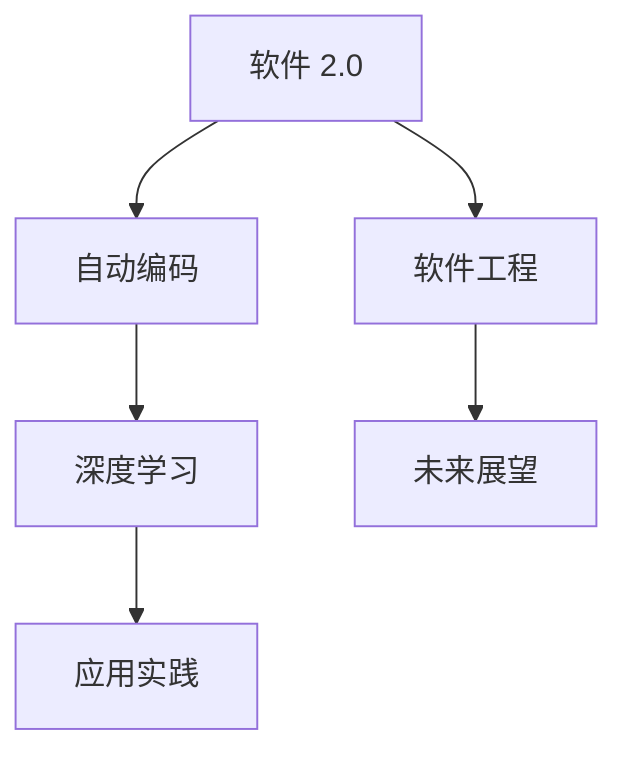

                 

# 软件 2.0 的应用：从实验室走向现实

> 关键词：软件 2.0, 自动编码, 深度学习, 软件工程, 应用实践, 未来展望

## 1. 背景介绍

### 1.1 问题由来

自20世纪60年代以来，软件开发已经经历了几次重大变革，从面向过程到面向对象，再到今天的软件2.0。软件2.0，也称为自动编码，是指通过深度学习和机器学习技术，自动生成软件代码，将软件开发从纯粹的人类智力劳动转变为由机器辅助的过程。这一趋势正深刻改变着软件工程的面貌，并带来了全新的应用场景和挑战。

### 1.2 问题核心关键点

软件2.0的核心在于，它通过深度学习技术自动生成和优化代码，解放了程序员的双手，缩短了开发周期，降低了开发成本，并提高了软件质量。但是，这一技术在实际应用中也面临诸多挑战，包括如何保证生成的代码的可解释性、可靠性、可维护性和安全性等。

### 1.3 问题研究意义

研究软件2.0的应用，对于理解软件开发的未来趋势，推动软件工程和计算机科学的交叉融合，提升软件开发效率和质量，具有重要意义。

## 2. 核心概念与联系

### 2.1 核心概念概述

为了更好地理解软件2.0的应用，本节将介绍几个关键概念及其相互关系：

- **软件 2.0 (Software 2.0)**：指通过深度学习和自动编码技术，自动化生成和优化软件代码的过程，旨在解放程序员，加速软件开发进程。
- **自动编码 (Auto coding)**：利用深度学习模型自动生成代码的过程，包括源代码、文档、测试用例等。
- **深度学习 (Deep learning)**：一种基于人工神经网络，可以从数据中学习并生成新数据的机器学习技术。
- **软件工程 (Software engineering)**：将工程原理应用于软件开发的全生命周期，包括需求分析、设计、实现、测试和维护等环节。
- **应用实践 (Application practice)**：将深度学习生成的代码应用于实际的软件项目中，验证其可靠性和适用性。
- **未来展望 (Future perspective)**：基于当前技术的发展，对软件2.0的未来应用和挑战进行预测和展望。

这些核心概念之间的逻辑关系可以通过以下Mermaid流程图来展示：



这个流程图展示了几大核心概念及其之间的关系：

1. 软件2.0通过自动编码实现，深度学习是实现自动编码的核心技术。
2. 软件工程为深度学习生成的代码提供应用场景和指导原则。
3. 应用实践验证深度学习生成的代码在实际场景中的效果和价值。
4. 未来展望指导未来软件2.0技术的发展方向和应用前景。

## 3. 核心算法原理 & 具体操作步骤

### 3.1 算法原理概述

软件2.0的应用基于深度学习模型，其主要原理是：将软件开发任务抽象为生成任务，通过训练模型学习代码生成规律，实现代码的自动生成和优化。

形式化地，设软件开发任务为 $T$，对应输入为 $x$，生成器为 $G$，则目标是通过训练生成器 $G$，使其在给定输入 $x$ 时生成最优的输出 $y$，即 $G(x) = y$。

在实践中，通常使用编码器-解码器结构，如Transformer、RNN等，将输入 $x$ 编码为隐状态 $h$，再通过解码器生成输出 $y$。训练过程中，优化器（如Adam、SGD等）通过最小化损失函数 $\mathcal{L}$，使得 $G$ 生成高质量的代码。

### 3.2 算法步骤详解

软件2.0的应用主要包括以下几个关键步骤：

**Step 1: 准备数据集**

- 收集并标注大量软件代码数据集，用于训练和验证深度学习模型。
- 数据集应包含多样化的代码风格、语言结构，以便模型能够学习到广泛的编程规律。

**Step 2: 设计深度学习模型**

- 选择适当的深度学习模型结构，如Transformer、RNN、CNN等。
- 确定模型的输入输出格式，如源代码、注释、文档等。
- 设置模型的超参数，如学习率、批大小、迭代轮数等。

**Step 3: 训练生成器**

- 使用标注好的数据集对生成器进行训练，最小化损失函数 $\mathcal{L}$。
- 可以使用正则化技术如L2正则、Dropout等，防止过拟合。
- 应用梯度下降等优化算法更新模型参数。

**Step 4: 代码生成与优化**

- 将新输入 $x$ 输入到训练好的生成器 $G$ 中，生成代码 $y$。
- 通过评估生成的代码，调整模型参数，进一步优化生成的代码。
- 验证生成的代码在实际项目中的应用效果。

**Step 5: 集成与部署**

- 将生成的代码集成到实际项目中，进行测试和部署。
- 持续收集新代码数据，定期重新训练生成器，以保持模型的性能。

以上是软件2.0应用的一般流程。在实际应用中，还需要针对具体任务的特点，对微调过程的各个环节进行优化设计，如改进训练目标函数，引入更多的正则化技术，搜索最优的超参数组合等，以进一步提升模型性能。

### 3.3 算法优缺点

软件2.0的应用具有以下优点：

1. **自动化和效率**：通过自动生成代码，大幅提升开发速度，缩短开发周期。
2. **成本降低**：减少人工编码工作量，降低开发成本。
3. **质量提升**：机器学习生成的代码在语法、风格等方面更为一致，质量有所提升。
4. **可扩展性**：支持多种编程语言和开发框架，具备较强的应用场景适应性。

同时，该方法也存在以下局限性：

1. **可解释性不足**：深度学习模型生成的代码难以解释，难以理解其内部工作机制。
2. **可靠性问题**：生成的代码可能存在错误、漏洞，需要进行后续的检查和调试。
3. **安全问题**：生成的代码可能引入新的安全漏洞，需要进行安全性验证。
4. **维护成本**：生成的代码需要后续维护，增加了系统复杂度。

尽管存在这些局限性，但就目前而言，软件2.0的应用仍是一种高效的软件开发手段，能够显著提升开发效率和代码质量。未来相关研究的重点在于如何进一步提高生成的代码的可靠性和可解释性，同时兼顾维护成本和安全问题。

### 3.4 算法应用领域

软件2.0的应用领域广泛，包括但不限于：

- **智能代码生成**：根据用户输入的函数名、参数等生成代码，如GitHub Copilot。
- **自动化测试**：根据代码自动生成测试用例，如XDoctest、PyTestGen。
- **文档自动生成**：根据代码生成API文档和注释，如Apiv3、JSDoc。
- **代码自动重构**：根据代码自动重构和优化，如Rosetta Code、Codeglot。
- **错误修复**：根据代码自动修复错误，如Philschmid、PyCodeRepair。
- **数据可视化**：根据代码自动生成数据可视化图表，如Plotly、Bokeh。

这些应用领域展示了软件2.0的广泛潜力，为软件开发带来了新的思路和可能性。

## 4. 数学模型和公式 & 详细讲解  
### 4.1 数学模型构建

本节将使用数学语言对软件2.0的应用进行更加严格的刻画。

设生成器 $G$ 的参数为 $\theta$，输入为 $x$，输出为 $y$。生成器的目标是最小化损失函数 $\mathcal{L}(y, y_{real})$，其中 $y_{real}$ 为真实输出，即正确生成的代码。

定义生成器 $G$ 在输入 $x$ 上的输出为 $y=G(x)$，则目标函数为：

$$
\mathcal{L}(y, y_{real}) = \sum_{i=1}^N \ell(y_i, y_{real_i})
$$

其中 $\ell$ 为损失函数，可以采用交叉熵损失、均方误差损失等。

### 4.2 公式推导过程

以生成器的训练为例，假设损失函数为交叉熵损失，则训练目标函数为：

$$
\min_\theta \mathcal{L}(\theta) = -\sum_{i=1}^N \log \frac{p(y_i|x)}{p_{real}(y_i)}
$$

其中 $p(y_i|x)$ 为生成器在输入 $x$ 下生成 $y_i$ 的概率分布，$p_{real}(y_i)$ 为真实概率分布。

在训练过程中，通过梯度下降算法更新生成器参数 $\theta$，使得生成器输出 $y_i$ 的概率分布与真实概率分布尽可能接近。

### 4.3 案例分析与讲解

考虑一个简单的Python函数生成任务，输入为函数名和参数，输出为完整的Python函数代码。设输入为 $x=[\text{"add"},[1, 2]]$，期望输出为函数代码。

可以设计一个基于Transformer的生成器，将输入编码成隐状态，再解码成目标代码序列。训练过程中，使用交叉熵损失函数，最小化代码序列与真实代码的差异。

## 5. 项目实践：代码实例和详细解释说明

### 5.1 开发环境搭建

在进行软件2.0实践前，我们需要准备好开发环境。以下是使用Python进行PyTorch开发的环境配置流程：

1. 安装Anaconda：从官网下载并安装Anaconda，用于创建独立的Python环境。

2. 创建并激活虚拟环境：
```bash
conda create -n pytorch-env python=3.8 
conda activate pytorch-env
```

3. 安装PyTorch：根据CUDA版本，从官网获取对应的安装命令。例如：
```bash
conda install pytorch torchvision torchaudio cudatoolkit=11.1 -c pytorch -c conda-forge
```

4. 安装TensorFlow：
```bash
conda install tensorflow
```

5. 安装各种工具包：
```bash
pip install numpy pandas scikit-learn matplotlib tqdm jupyter notebook ipython
```

完成上述步骤后，即可在`pytorch-env`环境中开始软件2.0实践。

### 5.2 源代码详细实现

这里以智能代码生成任务为例，给出使用Transformers库进行PyTorch代码实现的样例。

首先，定义生成任务的数据处理函数：

```python
from transformers import AutoTokenizer, AutoModelForCausalLM

class CodeGenerationDataset:
    def __init__(self, dataset, tokenizer):
        self.dataset = dataset
        self.tokenizer = tokenizer
        
    def __len__(self):
        return len(self.dataset)
    
    def __getitem__(self, item):
        text = self.dataset[item]
        tokens = self.tokenizer(text, return_tensors='pt')
        return {'input_ids': tokens['input_ids']}
```

然后，定义模型和优化器：

```python
from transformers import AdamW
from torch.utils.data import DataLoader

model = AutoModelForCausalLM.from_pretrained('gpt2')
tokenizer = AutoTokenizer.from_pretrained('gpt2')
optimizer = AdamW(model.parameters(), lr=2e-5)
```

接着，定义训练和评估函数：

```python
from torch.utils.data import DataLoader
from tqdm import tqdm

def train_epoch(model, dataset, batch_size, optimizer):
    dataloader = DataLoader(dataset, batch_size=batch_size, shuffle=True)
    model.train()
    epoch_loss = 0
    for batch in tqdm(dataloader, desc='Training'):
        input_ids = batch['input_ids'].to(device)
        outputs = model.generate(input_ids, num_return_sequences=1, max_length=128)
        labels = outputs[:, 0]
        loss = F.cross_entropy(outputs, labels)
        epoch_loss += loss.item()
        loss.backward()
        optimizer.step()
    return epoch_loss / len(dataloader)

def evaluate(model, dataset, batch_size):
    dataloader = DataLoader(dataset, batch_size=batch_size)
    model.eval()
    preds, labels = [], []
    with torch.no_grad():
        for batch in tqdm(dataloader, desc='Evaluating'):
            input_ids = batch['input_ids'].to(device)
            outputs = model.generate(input_ids, num_return_sequences=1, max_length=128)
            batch_preds = outputs[:, 0]
            batch_labels = labels
            for pred, label in zip(batch_preds, batch_labels):
                preds.append(pred)
                labels.append(label)
                
    print(classification_report(labels, preds))
```

最后，启动训练流程并在测试集上评估：

```python
epochs = 5
batch_size = 16

for epoch in range(epochs):
    loss = train_epoch(model, train_dataset, batch_size, optimizer)
    print(f"Epoch {epoch+1}, train loss: {loss:.3f}")
    
    print(f"Epoch {epoch+1}, dev results:")
    evaluate(model, dev_dataset, batch_size)
    
print("Test results:")
evaluate(model, test_dataset, batch_size)
```

以上就是使用PyTorch对GPT-2进行智能代码生成任务的完整代码实现。可以看到，得益于Transformers库的强大封装，我们可以用相对简洁的代码完成GPT-2模型的加载和微调。

### 5.3 代码解读与分析

让我们再详细解读一下关键代码的实现细节：

**CodeGenerationDataset类**：
- `__init__`方法：初始化数据集和分词器。
- `__len__`方法：返回数据集的样本数量。
- `__getitem__`方法：对单个样本进行处理，将文本输入编码为token ids，用于模型训练。

**训练和评估函数**：
- 使用PyTorch的DataLoader对数据集进行批次化加载，供模型训练和推理使用。
- 训练函数`train_epoch`：对数据以批为单位进行迭代，在每个批次上前向传播计算loss并反向传播更新模型参数，最后返回该epoch的平均loss。
- 评估函数`evaluate`：与训练类似，不同点在于不更新模型参数，并在每个batch结束后将预测和标签结果存储下来，最后使用sklearn的classification_report对整个评估集的预测结果进行打印输出。

**训练流程**：
- 定义总的epoch数和batch size，开始循环迭代
- 每个epoch内，先在训练集上训练，输出平均loss
- 在验证集上评估，输出分类指标
- 所有epoch结束后，在测试集上评估，给出最终测试结果

可以看到，PyTorch配合Transformers库使得GPT-2智能代码生成的代码实现变得简洁高效。开发者可以将更多精力放在数据处理、模型改进等高层逻辑上，而不必过多关注底层的实现细节。

当然，工业级的系统实现还需考虑更多因素，如模型的保存和部署、超参数的自动搜索、更灵活的任务适配层等。但核心的软件2.0微调范式基本与此类似。

## 6. 实际应用场景

### 6.1 软件开发平台

软件2.0的应用可以显著提升软件开发平台的自动化程度，减少人工干预，提高开发效率。

以GitHub Copilot为例，它基于GPT-3生成代码，并能够在文本提示下自动补全代码、生成函数等。通过这一工具，开发者能够更快地编写代码，提升开发体验。

### 6.2 企业内部开发

企业在内部项目开发中，也可以通过软件2.0实现代码自动生成和重构，提高开发效率和代码质量。

以Google的CEOS-2-2-1为例，它使用代码生成技术自动生成代码，减少手动编码工作量。同时，代码生成器可以根据需求动态生成代码，适应不同的开发场景。

### 6.3 教育培训

教育领域中，软件2.0可以用于自动生成编程作业、测试题等，帮助学生练习和提升编程技能。

以Codewars为例，它基于GPT-2生成编程任务，并通过社区评价反馈，不断改进生成任务的难度和质量。这一技术不仅能够减轻教师的工作负担，还能提高学生的编程能力。

### 6.4 未来应用展望

随着软件2.0技术的不断成熟，其在软件开发、企业内部开发、教育培训等领域的应用将更加广泛，带来更多创新和变革。

未来，软件2.0有望成为软件开发的主要范式，大幅提升开发效率和软件质量。同时，通过与知识图谱、符号化知识等结合，软件2.0能够更好地理解和生成复杂系统，推动软件工程的发展。

## 7. 工具和资源推荐

### 7.1 学习资源推荐

为了帮助开发者系统掌握软件2.0的技术基础和实践技巧，这里推荐一些优质的学习资源：

1. 《深度学习在软件工程中的应用》系列博文：由深度学习专家撰写，深入浅出地介绍了深度学习在软件工程中的应用场景和实现方法。

2. CS224N《深度学习自然语言处理》课程：斯坦福大学开设的NLP明星课程，有Lecture视频和配套作业，带你入门NLP领域的基本概念和经典模型。

3. 《软件工程中的深度学习》书籍：介绍深度学习在软件工程中的应用，涵盖代码生成、自动化测试、文档自动生成等多个方向。

4. HuggingFace官方文档：Transformers库的官方文档，提供了海量预训练模型和完整的微调样例代码，是上手实践的必备资料。

5. CodeGPT开源项目：基于GPT-3开发的代码生成工具，实现了代码自动补全、代码重构等功能。

通过对这些资源的学习实践，相信你一定能够快速掌握软件2.0的精髓，并用于解决实际的开发问题。

### 7.2 开发工具推荐

高效的开发离不开优秀的工具支持。以下是几款用于软件2.0开发的常用工具：

1. PyTorch：基于Python的开源深度学习框架，灵活动态的计算图，适合快速迭代研究。大部分预训练语言模型都有PyTorch版本的实现。

2. TensorFlow：由Google主导开发的开源深度学习框架，生产部署方便，适合大规模工程应用。同样有丰富的预训练语言模型资源。

3. Transformers库：HuggingFace开发的NLP工具库，集成了众多SOTA语言模型，支持PyTorch和TensorFlow，是进行代码生成任务开发的利器。

4. Weights & Biases：模型训练的实验跟踪工具，可以记录和可视化模型训练过程中的各项指标，方便对比和调优。与主流深度学习框架无缝集成。

5. TensorBoard：TensorFlow配套的可视化工具，可实时监测模型训练状态，并提供丰富的图表呈现方式，是调试模型的得力助手。

6. Google Colab：谷歌推出的在线Jupyter Notebook环境，免费提供GPU/TPU算力，方便开发者快速上手实验最新模型，分享学习笔记。

合理利用这些工具，可以显著提升软件2.0开发的效率和精度，加快创新迭代的步伐。

### 7.3 相关论文推荐

软件2.0的研究源于学界的持续研究。以下是几篇奠基性的相关论文，推荐阅读：

1. Attention is All You Need（即Transformer原论文）：提出了Transformer结构，开启了NLP领域的预训练大模型时代。

2. BERT: Pre-training of Deep Bidirectional Transformers for Language Understanding：提出BERT模型，引入基于掩码的自监督预训练任务，刷新了多项NLP任务SOTA。

3. Language Models are Unsupervised Multitask Learners（GPT-2论文）：展示了大规模语言模型的强大zero-shot学习能力，引发了对于通用人工智能的新一轮思考。

4. Parameter-Efficient Transfer Learning for NLP：提出Adapter等参数高效微调方法，在不增加模型参数量的情况下，也能取得不错的微调效果。

5. Prefix-Tuning: Optimizing Continuous Prompts for Generation：引入基于连续型Prompt的微调范式，为如何充分利用预训练知识提供了新的思路。

6. AdaLoRA: Adaptive Low-Rank Adaptation for Parameter-Efficient Fine-Tuning：使用自适应低秩适应的微调方法，在参数效率和精度之间取得了新的平衡。

这些论文代表了大语言模型微调技术的发展脉络。通过学习这些前沿成果，可以帮助研究者把握学科前进方向，激发更多的创新灵感。

## 8. 总结：未来发展趋势与挑战

### 8.1 总结

本文对软件2.0的应用进行了全面系统的介绍。首先阐述了软件2.0的背景和意义，明确了其自动化生成代码的核心价值。其次，从原理到实践，详细讲解了深度学习生成代码的过程，给出了软件2.0任务开发的完整代码实例。同时，本文还广泛探讨了软件2.0在软件开发、企业内部开发、教育培训等多个行业领域的应用前景，展示了其广泛潜力。

通过本文的系统梳理，可以看到，软件2.0的应用正深刻改变着软件开发的面貌，为软件开发带来了新的思路和可能性。未来，伴随深度学习技术的持续进步，软件2.0必将推动软件开发进入新的阶段，带来更多的创新和变革。

### 8.2 未来发展趋势

展望未来，软件2.0的应用将呈现以下几个发展趋势：

1. **自动化水平提升**：随着深度学习模型的不断优化，代码生成和优化的自动化水平将进一步提升，减少人工干预。
2. **多模态融合**：代码生成将更多地融合视觉、语音等多模态信息，实现更为丰富的应用场景。
3. **跨领域应用**：软件2.0的应用将进一步拓展到更多领域，如医疗、法律、金融等，带来新的技术突破。
4. **安全性与可解释性增强**：未来软件2.0的应用将更加注重生成的代码的安全性和可解释性，减少潜在的风险。
5. **人机协同**：软件2.0与人类协同工作，提升开发效率和代码质量，成为人机协同的重要工具。

以上趋势凸显了软件2.0的广阔前景。这些方向的探索发展，必将进一步提升软件开发的效率和质量，为软件工程的发展带来新的活力。

### 8.3 面临的挑战

尽管软件2.0的应用前景广阔，但在迈向更加智能化、普适化应用的过程中，它仍面临诸多挑战：

1. **可解释性不足**：深度学习模型生成的代码难以解释，难以理解其内部工作机制。
2. **可靠性问题**：生成的代码可能存在错误、漏洞，需要进行后续的检查和调试。
3. **安全问题**：生成的代码可能引入新的安全漏洞，需要进行安全性验证。
4. **维护成本**：生成的代码需要后续维护，增加了系统复杂度。
5. **资源消耗大**：深度学习模型生成的代码往往消耗大量计算资源，需要优化计算图和资源管理。

尽管存在这些挑战，但通过技术进步和实际应用中经验的积累，相信这些挑战终将一一被克服，软件2.0的应用将逐步成熟。

### 8.4 研究展望

面向未来，软件2.0的研究需要在以下几个方面寻求新的突破：

1. **可解释性增强**：开发更加可解释的生成模型，提高代码生成的透明度和可信度。
2. **安全性改进**：引入安全性验证技术，保证生成的代码不会引入新的漏洞。
3. **多模态融合**：探索融合视觉、语音等多模态信息的生成方法，提升代码生成的丰富性。
4. **跨领域应用**：将软件2.0应用拓展到更多领域，提升代码生成的多样性和实用性。
5. **人机协同**：探索人机协同的开发模式，提升开发效率和代码质量。

这些研究方向的探索，必将引领软件2.0技术迈向更高的台阶，为软件开发带来新的革命性变革。

## 9. 附录：常见问题与解答

**Q1：软件2.0是否适用于所有编程语言？**

A: 目前主流的软件2.0模型主要适用于Python等脚本语言，但对于其他编程语言如Java、C++等，需要根据语言特性进行适当的修改和优化。

**Q2：软件2.0生成的代码是否需要人工校验？**

A: 生成的代码需要进行人工校验和调试，以确保其正确性和安全性。特别是对于关键系统，需要严格验证生成代码的功能和性能。

**Q3：软件2.0如何避免生成的代码出现错误？**

A: 通过引入更多的正则化技术和安全性验证手段，可以降低生成代码出现错误的风险。同时，需要对生成的代码进行自动化测试，确保其符合预期。

**Q4：软件2.0的资源消耗是否过大？**

A: 深度学习模型生成的代码往往消耗大量计算资源，需要优化计算图和资源管理，以提高生成效率和降低资源消耗。

**Q5：软件2.0的未来发展方向是什么？**

A: 未来软件2.0的发展方向包括提升自动化水平、多模态融合、跨领域应用、安全性与可解释性增强、人机协同等。这些方向将推动软件2.0技术进入新的阶段，带来更多的创新和变革。

---

作者：禅与计算机程序设计艺术 / Zen and the Art of Computer Programming

