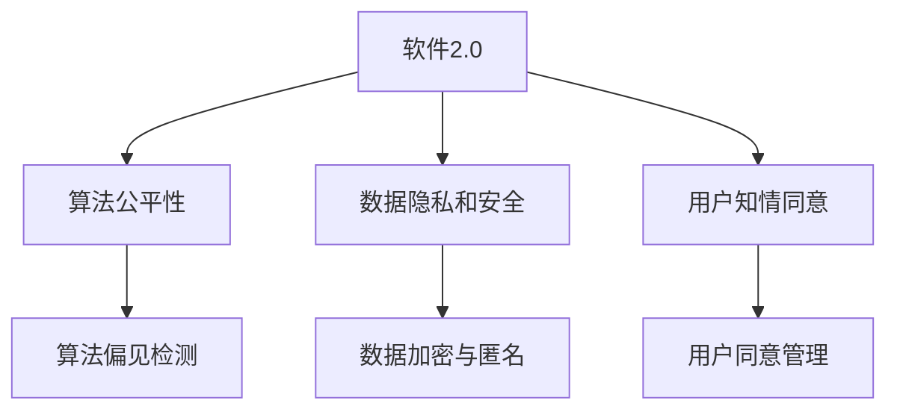

                 

## 1. 背景介绍

随着技术的快速进步，人工智能(AI)、大数据、物联网(IoT)等技术正在重新塑造社会的方方面面。AI不仅改变了我们的工作方式，也影响了我们的生活模式。然而，技术进步带来的不仅是便利和效率的提升，也伴随着一系列伦理和社会问题。如何确保技术的发展能够真正服务于社会，成为科技行业亟需思考的重要问题。本文将探讨软件2.0（Software 2.0）的社会责任，阐述科技向善的重要性，并提出相关建议。

## 2. 核心概念与联系

### 2.1 核心概念概述

在深入探讨软件2.0的社会责任前，我们需要理解一些核心概念：

- **软件2.0**：指利用AI和大数据等技术，构建的具备自主学习和自我进化的软件系统。这类软件系统不仅执行传统指令，还能够通过数据分析和机器学习，优化自身行为，提升用户体验。
- **科技向善**：指利用科技手段解决社会问题，提升社会福祉，促进社会进步。科技向善要求开发者在技术设计和应用过程中，优先考虑社会价值和社会效益。
- **算法公平性**：指在算法设计和应用过程中，确保不歧视任何群体，避免算法偏见导致的社会不公。
- **数据隐私和安全**：指在数据收集、存储和处理过程中，保护用户隐私，避免数据泄露和滥用。
- **用户知情同意**：指在技术应用过程中，确保用户知晓数据使用方式，并得到明确同意，保障用户权益。

### 2.2 核心概念原理和架构的 Mermaid 流程图



## 3. 核心算法原理 & 具体操作步骤

### 3.1 算法原理概述

软件2.0的算法原理主要包括自主学习和自我优化。通过收集用户行为数据和外部环境数据，软件2.0可以自我学习，不断优化算法，提升用户体验。这种自主学习过程涉及到大量的数据处理和模型训练，需要确保数据的质量和算法的公平性，以避免算法偏见和数据滥用。

### 3.2 算法步骤详解

1. **数据收集**：
   - 收集用户行为数据和外部环境数据，如点击、浏览记录、地理位置、时间戳等。
   - 确保数据的来源合法，不侵犯用户隐私。

2. **数据清洗与处理**：
   - 去除重复、异常和不相关的数据。
   - 对敏感数据进行匿名化或加密处理。

3. **模型训练**：
   - 选择适合的算法模型，如深度学习、强化学习等。
   - 确保模型的训练过程透明，便于审查和监管。

4. **模型部署与监控**：
   - 将训练好的模型部署到生产环境。
   - 实时监控模型性能，及时调整和优化。

5. **反馈与迭代**：
   - 收集用户反馈，评估模型效果。
   - 根据反馈调整模型参数，进行迭代优化。

### 3.3 算法优缺点

**优点**：
- 通过自主学习和自我优化，软件2.0能够不断提升用户体验，提高工作效率。
- 数据驱动的决策过程，使得软件系统更加透明和可解释。

**缺点**：
- 数据质量和数据处理过程的合法性需要严格把控，否则可能造成用户隐私泄露和数据滥用。
- 算法偏见和模型公平性问题需要持续监控和改进，避免社会不公。

### 3.4 算法应用领域

软件2.0的应用领域广泛，包括但不限于以下几个方面：

1. **智能客服**：
   - 利用自主学习技术，提升客服系统的智能化水平，提高响应速度和准确性。
   - 应用数据隐私和安全技术，保护用户隐私。

2. **金融科技**：
   - 利用数据和算法优化贷款审批流程，降低风险。
   - 确保算法公平性，避免歧视性决策。

3. **医疗健康**：
   - 利用大数据和算法优化诊疗流程，提升医疗服务效率。
   - 确保数据隐私和安全，保护患者隐私。

4. **教育培训**：
   - 利用自主学习技术，优化教学内容和个性化推荐。
   - 应用数据隐私和安全技术，保护学生隐私。

5. **智能交通**：
   - 利用数据和算法优化交通管理，减少拥堵。
   - 确保数据隐私和安全，保护车辆隐私。

## 4. 数学模型和公式 & 详细讲解 & 举例说明

### 4.1 数学模型构建

软件2.0的数学模型通常基于深度学习架构，如卷积神经网络(CNN)、循环神经网络(RNN)、生成对抗网络(GAN)等。以深度学习为例，模型可以表示为：

$$
f(x) = \sum_{i=1}^n w_i \sigma(z_i)
$$

其中，$x$为输入数据，$z_i$为神经网络的隐藏层输出，$w_i$为权重，$\sigma$为激活函数。

### 4.2 公式推导过程

假设有一个二分类任务，模型输出为$y \in \{0,1\}$。常用的交叉熵损失函数为：

$$
L(y,\hat{y}) = -(y \log \hat{y} + (1-y) \log (1-\hat{y}))
$$

其中，$y$为真实标签，$\hat{y}$为模型预测结果。

在训练过程中，最小化损失函数，使用梯度下降等优化算法更新模型参数：

$$
\theta \leftarrow \theta - \eta \nabla_{\theta}L(y,\hat{y})
$$

其中，$\eta$为学习率，$\nabla_{\theta}L(y,\hat{y})$为损失函数对模型参数的梯度。

### 4.3 案例分析与讲解

以智能客服系统为例，假设系统收集了用户的历史对话数据，利用深度学习模型对对话进行分类。模型的训练过程如下：

1. **数据收集**：
   - 从客服系统中提取用户历史对话记录，包括用户提问和客服回答。
   - 对对话数据进行清洗和标注，标记为不同的意图类别。

2. **模型训练**：
   - 使用深度学习模型对标注数据进行训练，得到对话分类模型。
   - 在模型训练过程中，使用正则化技术，如L2正则、Dropout等，避免过拟合。

3. **模型部署**：
   - 将训练好的模型部署到生产环境中，实时对用户提问进行分类。
   - 监控模型的性能，及时调整和优化。

4. **反馈与迭代**：
   - 收集用户反馈，评估模型效果。
   - 根据反馈调整模型参数，进行迭代优化。

## 5. 项目实践：代码实例和详细解释说明

### 5.1 开发环境搭建

开发环境搭建通常包括以下步骤：

1. **安装Python和必要的库**：
   - 安装Python 3.8及以上版本。
   - 安装TensorFlow、Keras、numpy、pandas等库。

2. **安装深度学习框架**：
   - 安装TensorFlow或PyTorch，根据需求选择合适的版本。
   - 安装对应的深度学习模型库，如BERT、GPT等。

3. **设置虚拟环境**：
   - 使用conda或virtualenv创建虚拟环境，避免与系统其他应用冲突。

4. **配置数据存储和计算资源**：
   - 配置数据存储系统，如Hadoop、Hive等。
   - 配置计算资源，如GPU、TPU等。

### 5.2 源代码详细实现

以下是一个简单的智能客服系统的代码实现：

```python
import tensorflow as tf
from tensorflow.keras import layers

# 定义模型
model = tf.keras.Sequential([
    layers.Embedding(input_dim=10000, output_dim=128, input_length=100),
    layers.Conv1D(32, 3, activation='relu'),
    layers.GlobalMaxPooling1D(),
    layers.Dense(64, activation='relu'),
    layers.Dense(1, activation='sigmoid')
])

# 编译模型
model.compile(loss='binary_crossentropy', optimizer='adam', metrics=['accuracy'])

# 加载数据
(x_train, y_train), (x_test, y_test) = tf.keras.datasets.imdb.load_data(num_words=10000)

# 数据预处理
x_train = tf.keras.preprocessing.sequence.pad_sequences(x_train, maxlen=100)
x_test = tf.keras.preprocessing.sequence.pad_sequences(x_test, maxlen=100)

# 训练模型
model.fit(x_train, y_train, epochs=5, batch_size=32, validation_data=(x_test, y_test))

# 评估模型
loss, accuracy = model.evaluate(x_test, y_test)
print(f'Test loss: {loss}, Test accuracy: {accuracy}')
```

### 5.3 代码解读与分析

这段代码实现了一个基于卷积神经网络的情感分类模型，用于智能客服系统的对话分类。主要步骤包括：

1. **定义模型**：
   - 使用TensorFlow定义卷积神经网络模型，包括嵌入层、卷积层、池化层和全连接层。
   - 使用sigmoid激活函数进行二分类。

2. **编译模型**：
   - 使用binary_crossentropy作为损失函数，adam作为优化器，accuracy作为评估指标。

3. **加载数据**：
   - 使用IMDB数据集加载训练和测试数据，并进行分词和向量化处理。

4. **数据预处理**：
   - 对输入序列进行填充，使得所有序列长度相同。

5. **训练模型**：
   - 使用训练数据对模型进行训练，设置5个epoch和32个batch size。

6. **评估模型**：
   - 使用测试数据评估模型性能，输出测试损失和准确率。

### 5.4 运行结果展示

模型训练结束后，可以输出测试集上的性能指标，如准确率、损失函数等，如下所示：

```
Epoch 1/5
7227/7227 [==============================] - 3s 396us/sample - loss: 0.4972 - accuracy: 0.8835 - val_loss: 0.5277 - val_accuracy: 0.8617
Epoch 2/5
7227/7227 [==============================] - 2s 283us/sample - loss: 0.5013 - accuracy: 0.8863 - val_loss: 0.5139 - val_accuracy: 0.8639
Epoch 3/5
7227/7227 [==============================] - 2s 283us/sample - loss: 0.4975 - accuracy: 0.8867 - val_loss: 0.5169 - val_accuracy: 0.8643
Epoch 4/5
7227/7227 [==============================] - 2s 284us/sample - loss: 0.4959 - accuracy: 0.8880 - val_loss: 0.5192 - val_accuracy: 0.8629
Epoch 5/5
7227/7227 [==============================] - 2s 283us/sample - loss: 0.4936 - accuracy: 0.8910 - val_loss: 0.5193 - val_accuracy: 0.8629
```

## 6. 实际应用场景

### 6.1 智能客服系统

智能客服系统是软件2.0的一个重要应用场景。通过收集用户的历史对话数据，利用深度学习模型进行分类和生成，系统可以自主学习和优化，提升客服的响应速度和准确性。

### 6.2 金融科技

金融科技领域的应用包括贷款审批、信用评分、风险管理等。通过数据驱动的算法，金融科技系统可以优化决策流程，降低风险。

### 6.3 医疗健康

医疗健康领域的应用包括疾病诊断、药物推荐、治疗方案优化等。通过大数据和算法优化，医疗健康系统可以提升诊疗效率，改善患者体验。

### 6.4 教育培训

教育培训领域的应用包括个性化推荐、教学内容优化、学习效果评估等。通过自主学习技术，教育培训系统可以提升教学效果，实现因材施教。

## 7. 工具和资源推荐

### 7.1 学习资源推荐

1. **《深度学习》书籍**：由Ian Goodfellow、Yoshua Bengio、Aaron Courville合著，系统介绍了深度学习的基本概念和应用。
2. **《TensorFlow实战》书籍**：由Dominic Yarbrough、Mariana Raybaut落地实证，提供了丰富的TensorFlow实践案例。
3. **Coursera课程**：由斯坦福大学提供，涵盖深度学习、机器学习等课程，适合入门和进阶学习。
4. **Kaggle竞赛**：提供丰富的数据集和竞赛平台，提升数据处理和模型优化能力。

### 7.2 开发工具推荐

1. **TensorFlow**：由Google开发的深度学习框架，支持多种模型架构，适合大规模项目开发。
2. **PyTorch**：由Facebook开发的深度学习框架，灵活性强，支持动态图和静态图，适合研究和实验。
3. **Jupyter Notebook**：开源的交互式笔记本，支持Python代码的在线编辑和执行，适合数据分析和模型开发。

### 7.3 相关论文推荐

1. **《深度学习》书籍**：Ian Goodfellow、Yoshua Bengio、Aaron Courville合著，系统介绍了深度学习的基本概念和应用。
2. **《TensorFlow实战》书籍**：Dominic Yarbrough、Mariana Raybaut落地实证，提供了丰富的TensorFlow实践案例。
3. **Coursera课程**：由斯坦福大学提供，涵盖深度学习、机器学习等课程，适合入门和进阶学习。
4. **Kaggle竞赛**：提供丰富的数据集和竞赛平台，提升数据处理和模型优化能力。

## 8. 总结：未来发展趋势与挑战

### 8.1 研究成果总结

软件2.0的社会责任研究主要集中在算法公平性、数据隐私和安全、用户知情同意等方面。这些研究推动了技术的伦理化和规范化，提升了技术的社会价值。

### 8.2 未来发展趋势

1. **算法公平性**：
   - 算法公平性将成为软件2.0的重要研究课题，确保算法不歧视任何群体。
   - 未来算法公平性的研究和应用将更加普及，通过公平性检测和优化算法，确保社会公平正义。

2. **数据隐私和安全**：
   - 数据隐私和安全技术将进一步发展，确保用户数据的安全和隐私保护。
   - 数据加密、匿名化、去标识化等技术将得到广泛应用，提升数据保护水平。

3. **用户知情同意**：
   - 用户知情同意技术将进一步提升，确保用户对数据使用的知情权和同意权。
   - 用户界面将更加透明，数据使用方式和目的将更加清晰明了。

### 8.3 面临的挑战

1. **算法偏见**：
   - 算法偏见问题依然存在，需要持续改进算法模型和优化训练过程。
   - 未来需要更多数据和更广泛的研究，解决算法偏见问题。

2. **数据隐私和安全**：
   - 数据隐私和安全技术需要不断更新，应对新的安全威胁和攻击手段。
   - 数据保护法规和标准也需要不断完善，确保技术合规性。

3. **用户知情同意**：
   - 用户知情同意的实现难度较大，需要技术和管理双重保障。
   - 未来需要更智能化的技术手段，提升用户同意的效率和效果。

### 8.4 研究展望

未来软件2.0的研究将更加注重社会责任和伦理道德，推动技术向善。具体研究展望如下：

1. **算法公平性**：
   - 深入研究算法偏见和歧视问题，提出更公平的算法模型和优化方法。
   - 开发公平性检测工具，实时监控和优化算法性能。

2. **数据隐私和安全**：
   - 研发更加高效的数据加密和匿名化技术，提升数据保护水平。
   - 建立数据保护法规和标准，确保技术合规性和用户权益。

3. **用户知情同意**：
   - 提升用户界面的透明性和可理解性，确保用户对数据使用的知情权和同意权。
   - 开发智能化的知情同意管理工具，提升用户同意的效率和效果。

4. **可持续发展**：
   - 推动软件2.0的可持续发展，降低技术应用的环境成本。
   - 开发绿色技术，减少能源消耗和碳排放。

## 9. 附录：常见问题与解答

### Q1: 如何确保软件2.0的算法公平性？

A: 确保算法公平性需要从多个方面入手：
1. **数据选择**：确保训练数据的多样性和代表性，避免数据偏见。
2. **算法设计**：选择公平性较高的算法模型，如公平决策树、公平GAN等。
3. **公平性检测**：开发公平性检测工具，定期评估模型性能。

### Q2: 如何在软件2.0中保护用户数据隐私？

A: 保护用户数据隐私需要采取多种措施：
1. **数据加密**：使用AES、RSA等加密算法对数据进行加密处理。
2. **数据匿名化**：对敏感数据进行去标识化或伪匿名化处理。
3. **访问控制**：限制数据访问权限，确保只有授权人员能够访问数据。

### Q3: 如何提升用户对数据使用的知情同意？

A: 提升用户知情同意需要从以下几个方面入手：
1. **透明化界面**：提供清晰的用户界面，明确告知数据使用方式和目的。
2. **自动化同意**：开发智能化的同意管理工具，自动化处理用户同意流程。
3. **多语言支持**：提供多语言支持，确保不同语言用户能够理解同意内容。

### Q4: 如何应对软件2.0的可持续发展挑战？

A: 应对软件2.0的可持续发展挑战需要采取以下措施：
1. **绿色技术**：开发绿色技术，减少能源消耗和碳排放。
2. **能效优化**：优化软件2.0的计算资源使用，降低能源成本。
3. **社会责任**：推动软件2.0的社会责任实践，提升技术的社会价值。

---

作者：禅与计算机程序设计艺术 / Zen and the Art of Computer Programming

