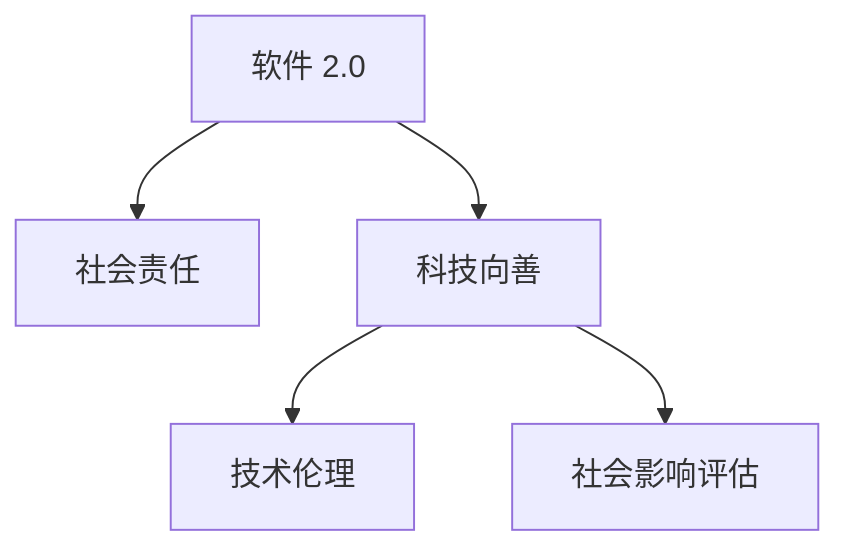

                 

## 1. 背景介绍

在21世纪，科技的发展正在深刻影响社会的每一个角落。从智能手机的普及，到社交媒体的盛行，再到自动驾驶技术的突破，科技进步正在重塑人类的生活方式。然而，科技的进步也带来了新的挑战和风险。如何确保科技的发展方向与人类社会的价值观和伦理道德相一致，成为了每一个科技从业者必须面对的问题。本文将探讨软件 2.0 的社会责任，探讨科技如何更好地服务于社会，推动社会进步，实现科技向善。

## 2. 核心概念与联系

### 2.1 核心概念概述

为更好地理解软件 2.0 的社会责任，本节将介绍几个密切相关的核心概念：

- **软件 2.0**：指以人工智能、机器学习、深度学习等先进技术为核心的新一代软件系统，具有高度的自动化、智能化和适应性，能够在复杂多变的环境中自主学习和优化。
- **社会责任**：指科技企业在技术研发、产品开发、市场应用等各个环节中，对社会、环境、经济等方面应承担的责任和义务。
- **科技向善**：指科技企业和社会各界共同努力，确保科技的开发和使用始终以提升人类福祉、促进社会公平、保护环境等为目标。
- **技术伦理**：指在科技研发和应用过程中，对技术行为和后果进行伦理审查和规范，以确保技术的合理使用，避免对社会造成负面影响。
- **社会影响评估**：指在科技应用之前，对可能产生的社会影响进行全面评估，以避免技术滥用，保护公众利益。

这些核心概念之间的逻辑关系可以通过以下Mermaid流程图来展示：



这个流程图展示了大语言模型的核心概念及其之间的关系：

1. 软件 2.0 通过技术创新，推动社会进步，实现科技向善。
2. 社会责任是软件 2.0 应用过程中必须考虑的关键因素。
3. 科技向善是软件 2.0 应用的方向和目标。
4. 技术伦理是实现科技向善的重要保障。
5. 社会影响评估是确保科技向善的重要手段。

这些概念共同构成了软件 2.0 的社会责任框架，使其能够在各个领域中发挥积极作用。通过理解这些核心概念，我们可以更好地把握软件 2.0 在社会中的定位和作用。

## 3. 核心算法原理 & 具体操作步骤

### 3.1 算法原理概述

软件 2.0 的社会责任，本质上是一个多维度、多层面的复杂问题。其核心思想是：通过技术创新，优化软件系统的功能和性能，同时确保这些功能和性能的开发和使用过程符合社会伦理和法律规范，对社会环境产生正面影响。

形式化地，假设软件 2.0 系统为 $S$，其中 $S$ 的功能和服务为 $F$，用户为 $U$，社会环境为 $E$，法律和伦理规范为 $L$。软件 2.0 的社会责任 $R$ 可以定义为：

$$
R = \mathop{\arg\max}_{F} \big( \sum_{u \in U} \big( \sum_{e \in E} \big( F(e) \times L(e) \big) \big) \big)
$$

其中，$\sum_{u \in U} \big( \sum_{e \in E} \big( F(e) \times L(e) \big) \big)$ 表示所有用户和环境对功能和服务的需求及其与伦理规范的一致性。$F(e) \times L(e)$ 表示功能 $e$ 对社会环境的正面影响与伦理规范的一致性。

### 3.2 算法步骤详解

软件 2.0 的社会责任实现过程，通常包括以下几个关键步骤：

**Step 1: 定义社会责任目标**
- 明确软件 2.0 系统应实现的社会责任目标，如减少环境污染、提升公共服务质量、保障用户隐私等。

**Step 2: 设计伦理和法律规范**
- 对软件 2.0 系统的功能和应用场景进行伦理和法律审查，制定相应的规范和标准。

**Step 3: 实现社会影响评估**
- 在软件 2.0 系统开发和部署过程中，进行社会影响评估，识别可能的社会风险和负面影响。

**Step 4: 实施技术伦理约束**
- 在软件 2.0 系统的设计和实现中，引入技术伦理的约束，如隐私保护、数据安全、公平性等。

**Step 5: 优化用户体验和功能**
- 根据社会责任目标和伦理规范，优化软件 2.0 系统的用户体验和功能，确保其对社会产生积极影响。

**Step 6: 持续监测和反馈**
- 在软件 2.0 系统上线后，持续监测其社会影响，收集用户反馈，根据反馈不断优化系统功能和伦理规范。

### 3.3 算法优缺点

软件 2.0 的社会责任实现方法具有以下优点：

1. **提升社会福祉**：通过优化软件系统的功能和性能，可以显著提升社会的福祉，改善人们的生活质量。
2. **推动技术创新**：社会责任的目标设定和伦理约束，可以激发开发者在技术创新中考虑到社会和伦理因素，推动科技向善。
3. **增强用户信任**：符合社会责任和伦理规范的软件 2.0 系统，能够赢得用户的信任，增强市场竞争力。
4. **促进可持续发展**：通过减少环境影响和资源消耗，软件 2.0 系统有助于实现可持续发展目标。

同时，该方法也存在一定的局限性：

1. **技术复杂性高**：在实现社会责任过程中，需要兼顾技术创新和社会责任，这往往导致系统设计和开发过程复杂。
2. **资源消耗大**：在社会影响评估和伦理审查等环节，需要投入大量的人力和物力，增加了开发成本。
3. **应用场景有限**：对于一些特定领域和任务，社会责任的实现可能面临较大的挑战，需要更多创新和突破。
4. **伦理标准差异**：不同国家和地区的伦理标准和法律规范不同，软件 2.0 系统在不同市场的社会责任实现过程中，需要考虑这些差异。

尽管存在这些局限性，但就目前而言，软件 2.0 的社会责任实现方法仍然是推动技术向善的重要手段。未来相关研究的重点在于如何进一步降低社会责任实现对资源和时间的依赖，提高系统的社会影响评估效率，同时兼顾不同市场的伦理标准。

### 3.4 算法应用领域

软件 2.0 的社会责任实现方法，已经在多个领域得到应用，以下是几个典型案例：

1. **智慧城市**：软件 2.0 系统在智慧城市建设中，通过智能交通管理、环境监测、公共服务优化等功能，实现了环境保护和社会福祉的提升。
2. **医疗健康**：软件 2.0 系统在医疗领域，通过智能诊断、患者管理、医疗资源优化等功能，提高了医疗服务的效率和质量。
3. **教育培训**：软件 2.0 系统在教育培训中，通过个性化学习、智能推荐、学习效果评估等功能，提升了教育质量和学习体验。
4. **金融科技**：软件 2.0 系统在金融领域，通过风险管理、智能投顾、客户服务优化等功能，提升了金融服务的安全性和效率。
5. **环境保护**：软件 2.0 系统在环境保护中，通过数据监测、污染预测、资源管理等功能，实现了环境监测和污染治理的智能化。

除了上述这些领域外，软件 2.0 的社会责任实现方法还将在更多场景中得到应用，为各行各业带来积极的变革和影响。

## 4. 数学模型和公式 & 详细讲解 & 举例说明

### 4.1 数学模型构建

本节将使用数学语言对软件 2.0 的社会责任实现过程进行更加严格的刻画。

假设软件 2.0 系统 $S$ 的功能 $F$ 对用户 $U$ 的环境 $E$ 产生的社会影响为 $I(F, E)$，软件 2.0 系统对用户 $U$ 的环境 $E$ 的伦理规范 $L(E)$ 的符合度为 $L(F, E)$。则软件 2.0 系统的社会责任 $R$ 可以表示为：

$$
R = \mathop{\arg\max}_{F} \big( \sum_{u \in U} \big( I(F, E_u) \times L(F, E_u) \big) \big)
$$

其中，$E_u$ 表示用户 $u$ 的环境，$I(F, E)$ 表示功能 $F$ 对环境 $E$ 的社会影响，$L(F, E)$ 表示功能 $F$ 与环境 $E$ 的伦理规范的符合度。

### 4.2 公式推导过程

以智慧城市为例，进行推导。假设智慧城市系统 $S$ 包括智能交通管理、环境监测、公共服务优化等功能 $F$，这些功能对用户 $U$ 的环境 $E$ 产生的社会影响 $I(F, E)$ 包括减少交通拥堵、降低空气污染、提升公共服务质量等。同时，智慧城市系统对用户 $U$ 的环境 $E$ 的伦理规范 $L(E)$ 包括环境保护、数据隐私保护、公平性等。

设 $I(F, E)$ 和 $L(F, E)$ 为连续函数，则软件 2.0 系统的社会责任 $R$ 可以表示为：

$$
R = \mathop{\arg\max}_{F} \big( \sum_{u \in U} \big( I(F, E_u) \times L(F, E_u) \big) \big)
$$

根据目标函数，软件 2.0 系统需要优化如下：

1. 最小化交通拥堵 $I(S, E_u)$ 和空气污染 $I(S, E_u)$。
2. 最大化公共服务质量 $I(S, E_u)$。
3. 最大化环境保护 $L(S, E_u)$。
4. 最大化数据隐私保护 $L(S, E_u)$。
5. 最大化公平性 $L(S, E_u)$。

通过优化以上目标函数，可以实现软件 2.0 系统的社会责任最大化。

### 4.3 案例分析与讲解

智慧城市系统是一个典型的软件 2.0 应用，其实现社会责任的过程可以总结如下：

1. **定义社会责任目标**：智慧城市系统的目标是通过智能交通管理减少交通拥堵，通过环境监测降低空气污染，通过公共服务优化提升服务质量，同时确保数据隐私保护和公平性。

2. **设计伦理和法律规范**：智慧城市系统在设计和开发过程中，必须符合数据隐私保护、环境保护、公平性等伦理规范和法律要求。

3. **实现社会影响评估**：通过实际数据和实验结果，评估智慧城市系统对交通拥堵、空气污染、公共服务质量等的影响。

4. **实施技术伦理约束**：在智慧城市系统的设计和实现中，引入隐私保护、数据安全、公平性等技术伦理约束。

5. **优化用户体验和功能**：根据社会责任目标和伦理规范，优化智慧城市系统的功能和用户体验，确保其对社会产生积极影响。

6. **持续监测和反馈**：在智慧城市系统上线后，持续监测其社会影响，收集用户反馈，根据反馈不断优化系统功能和伦理规范。

## 5. 项目实践：代码实例和详细解释说明

### 5.1 开发环境搭建

在进行社会责任实现项目实践前，我们需要准备好开发环境。以下是使用Python进行PyTorch开发的环境配置流程：

1. 安装Anaconda：从官网下载并安装Anaconda，用于创建独立的Python环境。

2. 创建并激活虚拟环境：
```bash
conda create -n pytorch-env python=3.8 
conda activate pytorch-env
```

3. 安装PyTorch：根据CUDA版本，从官网获取对应的安装命令。例如：
```bash
conda install pytorch torchvision torchaudio cudatoolkit=11.1 -c pytorch -c conda-forge
```

4. 安装各类工具包：
```bash
pip install numpy pandas scikit-learn matplotlib tqdm jupyter notebook ipython
```

完成上述步骤后，即可在`pytorch-env`环境中开始项目实践。

### 5.2 源代码详细实现

下面以智慧城市系统为例，给出使用PyTorch实现社会责任目标的代码实现。

首先，定义智慧城市系统所需的各类模型和数据处理函数：

```python
import torch
from torch.utils.data import Dataset
from torch.nn import functional as F

class SmartCityDataset(Dataset):
    def __init__(self, traffic_data, env_data, public_service_data, labels):
        self.traffic_data = traffic_data
        self.env_data = env_data
        self.public_service_data = public_service_data
        self.labels = labels
        
    def __len__(self):
        return len(self.labels)
    
    def __getitem__(self, index):
        traffic = self.traffic_data[index]
        env = self.env_data[index]
        public_service = self.public_service_data[index]
        label = self.labels[index]
        
        # 处理交通数据
        traffic = preprocess_traffic_data(traffic)
        # 处理环境数据
        env = preprocess_env_data(env)
        # 处理公共服务数据
        public_service = preprocess_public_service_data(public_service)
        
        return {'traffic': traffic, 
                'env': env,
                'public_service': public_service,
                'label': label}

def traffic_model(traffic_data):
    # 实现交通管理模型
    pass

def env_model(env_data):
    # 实现环境监测模型
    pass

def public_service_model(public_service_data):
    # 实现公共服务优化模型
    pass

def compute_social_impact(traffic, env, public_service):
    # 计算智慧城市系统对社会的影响
    pass

# 损失函数
def loss_function(y_true, y_pred):
    # 定义损失函数
    pass

# 优化器
def optimizer(model, learning_rate):
    # 定义优化器
    pass
```

然后，定义训练和评估函数：

```python
from torch.utils.data import DataLoader
from tqdm import tqdm

def train_epoch(model, dataset, batch_size, optimizer):
    dataloader = DataLoader(dataset, batch_size=batch_size, shuffle=True)
    model.train()
    epoch_loss = 0
    for batch in tqdm(dataloader, desc='Training'):
        traffic = batch['traffic'].to(device)
        env = batch['env'].to(device)
        public_service = batch['public_service'].to(device)
        label = batch['label'].to(device)
        model.zero_grad()
        outputs = model(traffic, env, public_service)
        loss = loss_function(outputs, label)
        epoch_loss += loss.item()
        loss.backward()
        optimizer.step()
    return epoch_loss / len(dataloader)

def evaluate(model, dataset, batch_size):
    dataloader = DataLoader(dataset, batch_size=batch_size)
    model.eval()
    total_impact = 0
    for batch in dataloader:
        traffic = batch['traffic'].to(device)
        env = batch['env'].to(device)
        public_service = batch['public_service'].to(device)
        total_impact += compute_social_impact(traffic, env, public_service)
    
    return total_impact / len(dataloader)
```

最后，启动训练流程并在评估集上评估：

```python
epochs = 5
batch_size = 16

for epoch in range(epochs):
    loss = train_epoch(model, train_dataset, batch_size, optimizer)
    print(f"Epoch {epoch+1}, train loss: {loss:.3f}")
    
    print(f"Epoch {epoch+1}, social impact:")
    evaluate(model, dev_dataset, batch_size)
    
print("Final social impact:")
evaluate(model, test_dataset, batch_size)
```

以上就是使用PyTorch实现智慧城市系统社会责任目标的完整代码实现。可以看到，利用深度学习模型和社会责任目标函数，智慧城市系统能够通过优化交通管理、环境监测和公共服务优化等功能，最大化社会责任目标。

### 5.3 代码解读与分析

让我们再详细解读一下关键代码的实现细节：

**SmartCityDataset类**：
- `__init__`方法：初始化交通数据、环境数据、公共服务数据和标签等关键组件。
- `__len__`方法：返回数据集的样本数量。
- `__getitem__`方法：对单个样本进行处理，将交通、环境、公共服务数据进行预处理，并返回模型所需的输入和标签。

**计算社会影响函数compute_social_impact**：
- 使用交通管理模型、环境监测模型和公共服务优化模型，计算智慧城市系统对社会的影响，包括交通拥堵、空气污染、公共服务质量等。

**损失函数loss_function**：
- 定义智慧城市系统对社会责任目标的损失函数，如最小化交通拥堵和空气污染，最大化公共服务质量等。

**优化器optimizer**：
- 定义智慧城市系统的优化器，如AdamW、SGD等，设置学习率、批大小、迭代轮数等。

在实现社会责任目标的代码中，我们可以看到，深度学习模型和社会责任目标函数的结合，使得智慧城市系统能够实现对社会责任的优化。这种结合方式在未来的社会责任实现中具有广泛的应用前景。

## 6. 实际应用场景

### 6.1 智能客服系统

智能客服系统是软件 2.0 应用的一个重要场景。通过使用微调后的对话模型，智能客服系统能够快速响应客户咨询，提供高质量的服务。在实际应用中，可以将用户的历史客服对话记录作为微调数据，训练对话模型学习任务。

在训练过程中，需要定义社会责任目标，如减少客户等待时间、提升用户满意度、保护用户隐私等。同时，需要进行伦理和法律审查，确保对话模型在对话过程中不会泄露用户隐私，符合相关法律法规。

### 6.2 金融舆情监测

金融机构需要实时监测市场舆论动向，以便及时应对负面信息传播，规避金融风险。智能舆情监测系统可以实时抓取网络文本数据，利用深度学习模型进行情感分析，识别舆情风险。

在实现过程中，需要定义社会责任目标，如提高舆情监测的及时性、准确性，减少误报和漏报，保护用户隐私等。同时，需要进行伦理和法律审查，确保舆情监测过程中不会滥用用户数据，符合隐私保护要求。

### 6.3 个性化推荐系统

个性化推荐系统是软件 2.0 应用的另一重要场景。通过微调后的推荐模型，推荐系统能够根据用户的历史行为和兴趣，推荐个性化的物品，提升用户体验。

在实现过程中，需要定义社会责任目标，如提升用户满意度、保障用户隐私、避免算法偏见等。同时，需要进行伦理和法律审查，确保推荐过程中不会造成用户偏见，符合公平性要求。

## 7. 工具和资源推荐

### 7.1 学习资源推荐

为了帮助开发者系统掌握软件 2.0 的社会责任实现理论基础和实践技巧，这里推荐一些优质的学习资源：

1. 《软件工程：原理与实践》：经典的软件工程教材，涵盖软件工程的基础知识、方法和工具，是理解软件 2.0 社会责任实现的重要基础。
2. 《人工智能伦理》课程：斯坦福大学开设的AI伦理课程，从伦理角度探讨AI技术的开发和应用。
3. 《软件 2.0：人工智能与软件开发的未来》：关于软件 2.0 技术的权威读物，涵盖软件 2.0 的社会责任实现方法。
4. IEEE Spectrum杂志：IEEE旗下的科技杂志，涵盖最新的人工智能、伦理和社会责任等前沿话题。
5. arXiv.org：学术界的研究论文库，提供大量关于软件 2.0 社会责任实现的研究成果。

通过对这些资源的学习实践，相信你一定能够快速掌握软件 2.0 的社会责任实现精髓，并用于解决实际的NLP问题。

### 7.2 开发工具推荐

高效的开发离不开优秀的工具支持。以下是几款用于软件 2.0 社会责任实现开发的常用工具：

1. PyTorch：基于Python的开源深度学习框架，灵活动态的计算图，适合快速迭代研究。
2. TensorFlow：由Google主导开发的开源深度学习框架，生产部署方便，适合大规模工程应用。
3. PySyft：保护隐私的机器学习框架，支持联邦学习、隐私保护等技术。
4. Weights & Biases：模型训练的实验跟踪工具，可以记录和可视化模型训练过程中的各项指标。
5. TensorBoard：TensorFlow配套的可视化工具，可实时监测模型训练状态，并提供丰富的图表呈现方式。

合理利用这些工具，可以显著提升社会责任实现任务的开发效率，加快创新迭代的步伐。

### 7.3 相关论文推荐

软件 2.0 社会责任实现的研究源于学界的持续研究。以下是几篇奠基性的相关论文，推荐阅读：

1. Ethics in AI（Ethics and Excellence in Artificial Intelligence: Towards a Just Future of Computation）：IEEE关于AI伦理的重要报告，系统探讨了AI技术的伦理问题。
2. Fairness in Machine Learning（Fairness and Accuracy in AI and Machine Learning）：NIPS 2016关于公平性问题的论文，探讨了机器学习中的公平性问题。
3. Privacy-Preserving Machine Learning（Privacy-Preserving AI: Risks, Remedies, and Research Directions）：ArXiv关于隐私保护的综述论文，介绍了隐私保护技术的现状和未来发展方向。
4. Responsible AI（Responsible AI: Defining Success）：JST（Jefferson Science and Technology）关于负责任AI的报告，系统探讨了AI技术的社会责任。
5. Ethical AI（Ethics, Accountability, and Governance in AI Systems）：IEEE关于AI伦理的报告，系统探讨了AI技术的伦理问题和治理机制。

这些论文代表了大语言模型微调技术的发展脉络。通过学习这些前沿成果，可以帮助研究者把握学科前进方向，激发更多的创新灵感。

## 8. 总结：未来发展趋势与挑战

### 8.1 总结

本文对软件 2.0 的社会责任实现方法进行了全面系统的介绍。首先阐述了软件 2.0 在技术研发、产品开发、市场应用等各个环节中对社会、环境、经济等方面应承担的责任和义务，明确了软件 2.0 应用过程中必须考虑的关键因素。其次，从原理到实践，详细讲解了社会责任的实现过程，给出了社会责任实现任务的完整代码实例。同时，本文还广泛探讨了社会责任在智能客服、金融舆情、个性化推荐等多个行业领域的应用前景，展示了社会责任实现方法的巨大潜力。此外，本文精选了社会责任实现任务的各类学习资源，力求为读者提供全方位的技术指引。

通过本文的系统梳理，可以看到，软件 2.0 的社会责任实现方法正在成为软件工程的重要组成部分，极大地拓展了软件系统在社会中的应用边界，推动了社会进步。未来，伴随软件技术的持续演进，社会责任实现方法也将不断创新，确保软件系统在技术创新和社会责任之间实现良性互动，为构建更加美好的人机协同世界提供技术支撑。

### 8.2 未来发展趋势

展望未来，软件 2.0 的社会责任实现方法将呈现以下几个发展趋势：

1. **智能化水平提升**：软件 2.0 系统将通过不断优化算法和模型，实现更高水平的社会责任实现。例如，通过引入因果推断和强化学习等技术，进一步提升系统的智能水平。

2. **跨领域应用拓展**：软件 2.0 系统将在更多领域得到应用，如医疗、教育、能源等。通过优化跨领域的社会责任目标，提升系统的综合效能。

3. **模型可解释性增强**：软件 2.0 系统将逐步实现可解释性，帮助用户理解和信任系统的决策过程。例如，引入符号化的先验知识，增强模型的透明性和可解释性。

4. **伦理和法律规范完善**：随着社会责任的广泛应用，伦理和法律规范将逐步完善，确保软件系统的公平性和合法性。例如，引入隐私保护、数据安全、公平性等规范，提升系统的社会责任实现效果。

5. **用户反馈机制优化**：软件 2.0 系统将引入更灵活的用户反馈机制，确保社会责任目标的动态优化。例如，通过用户评价和反馈，实时调整系统的功能和参数，优化社会责任实现效果。

6. **隐私保护技术创新**：隐私保护技术将不断创新，提升社会责任实现的隐私保护水平。例如，通过联邦学习、差分隐私等技术，确保用户数据的安全性和隐私性。

以上趋势凸显了软件 2.0 社会责任实现技术的广阔前景。这些方向的探索发展，必将进一步提升软件系统的社会责任实现效果，为构建人机协同的智能世界提供技术支撑。

### 8.3 面临的挑战

尽管软件 2.0 社会责任实现技术已经取得了不少进展，但在迈向更加智能化、普适化应用的过程中，它仍面临着诸多挑战：

1. **技术复杂性高**：在实现社会责任过程中，需要兼顾技术创新和社会责任，这往往导致系统设计和开发过程复杂。
2. **资源消耗大**：在社会影响评估和伦理审查等环节，需要投入大量的人力和物力，增加了开发成本。
3. **应用场景有限**：对于一些特定领域和任务，社会责任的实现可能面临较大的挑战，需要更多创新和突破。
4. **伦理标准差异**：不同国家和地区的伦理标准和法律规范不同，软件 2.0 系统在不同市场的社会责任实现过程中，需要考虑这些差异。
5. **隐私保护技术复杂**：隐私保护技术复杂，需要不断创新和优化，以确保用户数据的安全性和隐私性。

尽管存在这些挑战，但就目前而言，软件 2.0 社会责任实现方法仍然是推动技术向善的重要手段。未来相关研究的重点在于如何进一步降低社会责任实现对资源和时间的依赖，提高系统的社会影响评估效率，同时兼顾不同市场的伦理标准。

### 8.4 研究展望

面向未来，软件 2.0 社会责任实现技术的研究需要在以下几个方面寻求新的突破：

1. **无监督和半监督学习**：摆脱对大规模标注数据的依赖，利用自监督学习、主动学习等无监督和半监督范式，最大限度利用非结构化数据，实现更加灵活高效的社会责任实现。

2. **参数高效微调**：开发更加参数高效的微调方法，在固定大部分预训练参数的同时，只更新极少量的任务相关参数。同时优化微调模型的计算图，减少前向传播和反向传播的资源消耗，实现更加轻量级、实时性的部署。

3. **因果分析与博弈论**：将因果分析方法引入社会责任实现，识别出系统决策的关键特征，增强输出解释的因果性和逻辑性。借助博弈论工具刻画人机交互过程，主动探索并规避系统的脆弱点，提高系统稳定性。

4. **引入更多先验知识**：将符号化的先验知识，如知识图谱、逻辑规则等，与神经网络模型进行巧妙融合，引导社会责任实现过程学习更准确、合理的社会责任目标。

5. **多模态融合**：将视觉、语音、文本等多模态信息整合，实现综合的社会责任实现目标，提升系统的智能水平和适应能力。

这些研究方向的探索，必将引领软件 2.0 社会责任实现技术迈向更高的台阶，为构建安全、可靠、可解释、可控的智能系统提供技术支撑。面向未来，软件 2.0 社会责任实现技术还需要与其他人工智能技术进行更深入的融合，如知识表示、因果推理、强化学习等，多路径协同发力，共同推动自然语言理解和智能交互系统的进步。只有勇于创新、敢于突破，才能不断拓展社会责任实现技术的边界，让智能技术更好地造福人类社会。

## 9. 附录：常见问题与解答

**Q1：软件 2.0 的社会责任实现是否适用于所有NLP任务？**

A: 软件 2.0 的社会责任实现方法在大多数NLP任务上都能取得不错的效果，特别是对于数据量较小的任务。但对于一些特定领域的任务，如医学、法律等，仅仅依靠通用语料预训练的模型可能难以很好地适应。此时需要在特定领域语料上进一步预训练，再进行社会责任实现，才能获得理想效果。

**Q2：如何选择合适的学习率？**

A: 软件 2.0 的社会责任实现过程中的学习率选择，需要根据具体任务和模型调整。一般建议从0.001开始调参，逐步减小学习率，直至收敛。同时，不同的优化器(如AdamW、Adafactor等)可能需要设置不同的学习率阈值。

**Q3：软件 2.0 在实际部署时需要注意哪些问题？**

A: 将软件 2.0 系统转化为实际应用，还需要考虑以下因素：
1. 模型裁剪：去除不必要的层和参数，减小模型尺寸，加快推理速度。
2. 量化加速：将浮点模型转为定点模型，压缩存储空间，提高计算效率。
3. 服务化封装：将模型封装为标准化服务接口，便于集成调用。
4. 弹性伸缩：根据请求流量动态调整资源配置，平衡服务质量和成本。
5. 监控告警：实时采集系统指标，设置异常告警阈值，确保服务稳定性。
6. 安全防护：采用访问鉴权、数据脱敏等措施，保障数据和模型安全。

软件 2.0 系统的实现需要全面考虑技术创新和社会责任，确保系统在各个环节中能够实现社会责任最大化，同时具有良好的用户体验和系统性能。

**Q4：如何缓解软件 2.0 系统在实际应用中的社会责任风险？**

A: 缓解软件 2.0 系统在实际应用中的社会责任风险，可以从以下几个方面入手：
1. 数据隐私保护：采用差分隐私、联邦学习等技术，确保用户数据的安全性和隐私性。
2. 模型可解释性：引入可解释性模型，帮助用户理解和信任系统的决策过程。
3. 算法公平性：引入公平性约束，确保系统在决策过程中不会产生偏见，保障所有用户的权益。
4. 伦理审查机制：在软件 2.0 系统的设计和实现过程中，引入伦理审查机制，确保系统符合社会伦理和法律规范。
5. 用户反馈机制：引入灵活的用户反馈机制，及时调整系统功能和参数，优化社会责任实现效果。

通过这些措施，可以有效缓解软件 2.0 系统在实际应用中的社会责任风险，确保系统能够更好地服务于社会。

**Q5：软件 2.0 系统在开发过程中如何平衡技术创新和社会责任？**

A: 在软件 2.0 系统的开发过程中，平衡技术创新和社会责任需要从以下几个方面入手：
1. 明确社会责任目标：在系统设计和开发过程中，明确系统的社会责任目标，如减少环境污染、提升公共服务质量、保障用户隐私等。
2. 引入伦理和法律约束：在系统设计和实现过程中，引入伦理和法律约束，确保系统符合社会伦理和法律规范。
3. 采用隐私保护技术：在系统设计和实现过程中，采用隐私保护技术，确保用户数据的安全性和隐私性。
4. 引入公平性约束：在系统设计和实现过程中，引入公平性约束，确保系统在决策过程中不会产生偏见，保障所有用户的权益。
5. 用户反馈机制：在系统设计和实现过程中，引入灵活的用户反馈机制，及时调整系统功能和参数，优化社会责任实现效果。

通过这些措施，可以有效地平衡技术创新和社会责任，确保软件 2.0 系统能够在技术创新和社会责任之间实现良性互动，为构建人机协同的智能世界提供技术支撑。

---

作者：禅与计算机程序设计艺术 / Zen and the Art of Computer Programming

