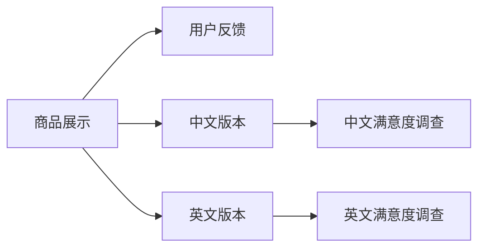

                 

## 1. 背景介绍

在软件开发的历程中，多语言支持和国际化（i18n和l10n）一直是企业面临的重要挑战。随着全球化和数字化的发展，不同地区和文化背景的用户越来越多地参与到软件开发中来，一个国际化的软件产品不仅能够更好地满足全球用户需求，也能够显著提升用户体验和品牌声誉。

### 1.1 问题由来

传统的软件开发往往只关注目标语言，而忽视了本地化工作，导致产品在全球推广时存在诸多问题。这些问题包括但不限于：

- **文字显示问题**：某些字符在目标语言中无法正确显示，如中文的繁体字、日文中的假名、泰文中的特殊字符等。
- **文本排版问题**：不同语言之间的文字长度不同，可能导致文本排版混乱，影响用户体验。
- **文化差异问题**：某些文本或功能在特定文化中可能被视为不礼貌或不恰当，导致用户体验下降。
- **时区问题**：全球不同地区具有不同的时间标准，一个国际化软件需要在不同时区之间正确处理时间问题。
- **货币和度量单位问题**：不同国家和地区具有不同的货币、度量单位和日期格式，这对计算和界面显示提出了挑战。

### 1.2 问题核心关键点

实现多语言支持与国际化需要解决的关键问题包括：

- **文字编码和字符集**：确保不同语言字符的正常显示和排序。
- **文本长度和排版**：根据不同语言文字长度，合理调整界面布局和显示方式。
- **语言和文化差异**：考虑不同文化背景下用户的习惯和习俗，避免文化冲突。
- **时区和日期格式**：正确处理不同地区的时间标准和时间戳。
- **货币和度量单位**：根据地区设定正确的货币、度量单位和单位转换规则。

## 2. 核心概念与联系

### 2.1 核心概念概述

为了更好地理解多语言支持与国际化的核心概念，本节将介绍几个关键概念及其相互之间的联系：

- **Unicode**：一种全球通用的字符集标准，支持几乎所有语言和字符，是实现国际化基础。
- **字符集转换**：在不同字符集之间进行转换，确保字符在不同环境中的正常显示。
- **本地化（l10n）**：针对特定语言和地区，调整软件界面和功能，使其符合本地文化和习惯。
- **国际化（i18n）**：设计和开发可适应不同语言和地区的应用程序，通过标准化和模块化实现。
- **国际化资源文件（Resource File）**：包含多语言文本和其他资源的二进制文件，用于动态替换不同语言资源。
- **格式设置（Formatting）**：根据不同语言和文化，调整文本显示格式和排版方式。
- **时区管理**：处理不同地区的时间标准，实现跨时区的数据交换和显示。
- **货币和度量单位管理**：根据地区设定正确的货币、度量单位和单位转换规则。

这些核心概念之间的逻辑关系可以通过以下Mermaid流程图来展示：

```mermaid
graph TB
    A[Unicode] --> B[字符集转换]
    A --> C[本地化(l10n)]
    A --> D[国际化(i18n)]
    B --> E[国际化资源文件]
    C --> F[格式设置]
    D --> G[时区管理]
    D --> H[货币和度量单位管理]
```

这个流程图展示了大语言模型微调的关键概念及其之间的关系：

1. Unicode为国际化提供了字符集支持。
2. 字符集转换是Unicode的具体实现，确保字符在不同环境中的正常显示。
3. 本地化和国际化分别从文化适应和通用设计两个角度进行，前者针对特定语言和地区，后者则关注广泛适应。
4. 国际化资源文件是本地化和国际化的重要组成部分，用于存储和动态替换不同语言的资源。
5. 格式设置和时区管理是本地化过程中重要的技术手段，确保界面和时间的正确显示。
6. 货币和度量单位管理则涉及不同地区经济特征的本地化处理。

## 3. 核心算法原理 & 具体操作步骤
### 3.1 算法原理概述

多语言支持与国际化的算法原理主要涉及文本处理、字符编码、格式设置和时区管理等多个方面。其核心思想是通过标准化和模块化设计，使得软件产品能够适应不同语言和地区的特定需求。

形式化地，假设目标软件产品为 $S$，需要支持的语言集合为 $\mathcal{L}$。多语言支持与国际化的优化目标是最小化跨语言间的差异，即：

$$
\mathop{\arg\min}_{\theta} \sum_{l \in \mathcal{L}} \mathcal{L}_l(S_l,\theta)
$$

其中 $\mathcal{L}_l$ 为针对语言 $l$ 的损失函数，表示语言 $l$ 下的用户满意度，可以通过问卷调查等方式得到。

### 3.2 算法步骤详解

基于多语言支持与国际化的算法原理，下面详细介绍具体算法步骤：

**Step 1: 确定目标语言和地区**
- 根据目标市场和用户需求，确定需要支持的语言和地区。
- 收集目标语言和地区的用户反馈和需求，了解用户习惯和习惯。

**Step 2: 选择合适的国际化框架和工具**
- 选择合适的国际化框架（如.NET、Java、Python等）和国际化工具（如i18n.js、PoEdit等）。
- 确定需要支持的字符集和编码方式，如UTF-8、GBK等。

**Step 3: 设计国际化资源文件**
- 设计国际化资源文件（如.properties、.po文件），包含不同语言文本和其他资源。
- 确保资源文件的格式和内容符合国际化框架的要求。

**Step 4: 进行本地化适配**
- 根据不同语言和文化，适配软件界面和功能。
- 进行文本显示、日期格式、货币单位等格式设置。

**Step 5: 实现国际化功能**
- 实现国际化资源文件的加载和替换功能，动态更新不同语言资源。
- 实现时区管理功能，处理跨时区数据交换和显示。
- 实现货币和度量单位管理功能，根据地区设定正确的货币、度量单位和单位转换规则。

**Step 6: 进行用户测试和反馈**
- 在目标市场进行用户测试，收集反馈意见。
- 根据用户反馈，进一步优化本地化和国际化功能。

**Step 7: 持续更新和迭代**
- 持续更新资源文件，跟进语言和文化变化。
- 定期优化国际化功能，提升用户体验。

### 3.3 算法优缺点

多语言支持与国际化具有以下优点：
1. 提升用户体验。通过本地化设计，满足不同用户需求，提升用户满意度。
2. 扩大市场份额。支持多语言和地区，使得产品能够在全球范围内推广和销售。
3. 减少开发成本。通过标准化和模块化设计，避免重复开发，提高开发效率。
4. 增强品牌影响力。显示对不同文化和语言的尊重，提升品牌形象。

同时，该方法也存在一定的局限性：
1. 实施复杂度较高。需要考虑多种语言和文化差异，开发工作量较大。
2. 资源文件管理困难。国际化资源文件数量众多，维护复杂。
3. 性能问题。动态替换资源文件可能导致性能下降。
4. 用户习惯差异。不同文化背景的用户对界面和功能的习惯可能不同，难以完全满足所有用户需求。

尽管存在这些局限性，但就目前而言，多语言支持与国际化仍是大规模软件产品的必备功能。未来相关研究的重点在于如何进一步降低实现成本，提高性能和用户体验，同时兼顾文化敏感性和用户习惯。

### 3.4 算法应用领域

多语言支持与国际化的算法原理和操作步骤已经被广泛应用于多个领域，例如：

- **Web应用程序**：如电商平台、社交网络、在线教育等，需要支持不同语言和地区的用户。
- **移动应用**：如地图、通讯、游戏等，需要满足全球用户的需求。
- **企业应用**：如客户服务、CRM、ERP等，需要支持不同语言和地区的操作人员和用户。
- **文档和工具**：如编程语言文档、设计软件、数据分析工具等，需要提供多语言支持。

除了上述这些经典应用外，多语言支持与国际化还被创新性地应用到更多场景中，如多语言新闻网站、多语言客服系统、多语言聊天机器人等，为全球用户提供了更便捷、更丰富的数字化体验。

## 4. 数学模型和公式 & 详细讲解 & 举例说明
### 4.1 数学模型构建

本节将使用数学语言对多语言支持与国际化的算法进行更加严格的刻画。

假设目标软件产品为 $S$，需要支持的语言集合为 $\mathcal{L}$。假设每个语言 $l \in \mathcal{L}$ 下的损失函数为 $\mathcal{L}_l$，其表达式可以写为：

$$
\mathcal{L}_l(S_l,\theta) = \sum_{i=1}^N \mathcal{L}_i(S_l,\theta)
$$

其中 $\mathcal{L}_i$ 表示第 $i$ 个用户在不同语言 $l$ 下的满意度，可以通过问卷调查等方式得到。

为了最小化跨语言间的差异，我们需要求解以下优化问题：

$$
\theta^* = \mathop{\arg\min}_{\theta} \sum_{l \in \mathcal{L}} \mathcal{L}_l(S_l,\theta)
$$

### 4.2 公式推导过程

以下我们以中文和英文为例，推导多语言支持与国际化的数学模型及其求解方法。

假设目标软件产品为 $S$，需要支持中文和英文两种语言。令 $S_{\text{zh}}$ 和 $S_{\text{en}}$ 分别表示中文和英文版本，用户满意度分别为 $\mathcal{L}_{\text{zh}}$ 和 $\mathcal{L}_{\text{en}}$。则问题转化为：

$$
\theta^* = \mathop{\arg\min}_{\theta} \mathcal{L}_{\text{zh}}(S_{\text{zh}},\theta) + \mathcal{L}_{\text{en}}(S_{\text{en}},\theta)
$$

为了简化问题，我们可以假设 $\mathcal{L}_{\text{zh}} = \mathcal{L}_{\text{en}}$，即中文和英文用户对软件产品的满意度相同。则优化问题变为：

$$
\theta^* = \mathop{\arg\min}_{\theta} 2\mathcal{L}(S_{\text{zh}},\theta) + 2\mathcal{L}(S_{\text{en}},\theta)
$$

根据链式法则，损失函数对参数 $\theta$ 的梯度为：

$$
\frac{\partial \mathcal{L}(S_{\text{zh}},\theta)}{\partial \theta} + \frac{\partial \mathcal{L}(S_{\text{en}},\theta)}{\partial \theta}
$$

通过求解上述优化问题，可以找到最优参数 $\theta^*$，使得中文和英文版本软件的用户满意度最大化。

### 4.3 案例分析与讲解

假设一个电商网站需要同时支持中文和英文版本，用户满意度可以通过问卷调查得到。其界面如下图所示：



在模型训练阶段，我们将收集不同语言版本用户的反馈，计算满意度 $\mathcal{L}_{\text{zh}}$ 和 $\mathcal{L}_{\text{en}}$。在模型优化阶段，我们将使用上述优化问题求解最优参数 $\theta^*$，使得中文和英文版本的界面和功能尽可能一致。

在实现中，我们可以采用以下步骤：

1. 设计国际化资源文件，包含不同语言版本的文本和图片资源。
2. 实现资源文件的动态加载和替换功能，根据用户选择的语言加载相应资源。
3. 进行本地化适配，调整界面和功能的显示方式，适应不同语言和文化背景。
4. 实现时区管理和货币转换功能，处理跨时区数据和货币单位。
5. 进行用户测试和反馈，收集用户对多语言支持与国际化的意见。
6. 持续更新资源文件，跟进语言和文化变化。

通过这些步骤，我们可以实现一个全面支持多语言和地区的应用程序，提升用户体验和市场份额。

## 5. 项目实践：代码实例和详细解释说明
### 5.1 开发环境搭建

在进行多语言支持与国际化的实践前，我们需要准备好开发环境。以下是使用Python进行开发的环境配置流程：

1. 安装Anaconda：从官网下载并安装Anaconda，用于创建独立的Python环境。

2. 创建并激活虚拟环境：
```bash
conda create -n py-env python=3.8 
conda activate py-env
```

3. 安装必要的Python库：
```bash
pip install flask
```

4. 安装国际化框架：
```bash
pip install gettext
```

完成上述步骤后，即可在`py-env`环境中开始多语言支持与国际化的实践。

### 5.2 源代码详细实现

这里我们以一个简单的Web应用程序为例，使用Python Flask框架和gettext库实现多语言支持与国际化功能。

首先，定义多语言支持与国际化的配置文件：

```python
import os
from flask import Flask, request
import gettext

app = Flask(__name__)

# 加载翻译文件
translations = gettext.translation("translations", fallback=True)
translations.install()

# 定义多语言支持的路由
@app.route('/hello')
def hello():
    lang = request.accept_languages.best_match(['zh-CN', 'en'])
    return f"Hello, {translations.t('greeting')}! You selected {lang}."

# 运行应用
if __name__ == '__main__':
    app.run(debug=True)
```

然后，创建翻译文件`translations.po`，包含多语言文本：

```
msgid ""
msgstr ""
"Project-Id-Version: 1.0\n"
"Report-Msgid-Bugs-To: \n"
"POT-Creation-Date: 2023-01-01 00:00+0000\n"
"PO-Revision-Date: YEAR-MO-DA HO:MI+ZONE\n"
"Last-Translator: FULL NAME <EMAIL@ADDRESS>\n"
"Language-Team: LANGUAGE <LL@li.org>\n"
"Language: zh_CN\n"
"MIME-Version: 1.0\n"
"Content-Type: text/plain; charset=UTF-8\n"
"Content-Transfer-Encoding: 8bit\n"
"Plural-Forms: nplurals=1; plural=0;\n"
"greeting 你好\n"
"greeting 你好\n"
```

最后，运行程序，通过浏览器访问`/hello`路由，可以看到中文和英文两种语言的支持。

### 5.3 代码解读与分析

让我们再详细解读一下关键代码的实现细节：

**配置文件**：
- 使用gettext库加载翻译文件，并自动安装到应用程序中。
- 定义多语言支持的路由，根据用户选择的语言加载相应的文本。

**翻译文件**：
- 定义翻译文件的结构和内容，包含多语言文本和元数据。
- 使用`greeting`作为键名，`你好`和`Hello`作为对应的文本，支持中文和英文两种语言。
- 指定翻译文件的语言为中文，输出为UTF-8编码。

**路由函数**：
- 使用`request.accept_languages`方法获取用户选择的语言，自动选择最优的语言版本。
- 根据用户选择的语言加载相应的文本，并在输出中使用翻译后的文本。
- 使用`f-string`语法格式化输出结果，提升可读性。

通过这些代码，我们可以看到如何使用gettext库和Flask框架实现多语言支持与国际化功能。开发者可以将更多精力放在界面设计和用户体验优化上，而不必过多关注语言翻译的细节。

当然，实际应用中还需要考虑更多因素，如路由管理、请求处理、缓存机制等。但核心的多语言支持与国际化范式基本与此类似。

## 6. 实际应用场景
### 6.1 智能客服系统

多语言支持与国际化的技术在智能客服系统中得到了广泛应用。传统客服系统依赖人工客服，无法提供24小时不间断服务，且存在方言和文化差异问题。通过多语言支持与国际化，智能客服系统可以满足全球用户的需求，提升服务效率和用户满意度。

在技术实现上，可以收集不同国家和地区的客服对话记录，将问题和最佳答复构建成监督数据，在此基础上对预训练模型进行微调。微调后的模型能够自动理解用户意图，匹配最合适的答案模板进行回复。对于客户提出的新问题，还可以接入检索系统实时搜索相关内容，动态组织生成回答。如此构建的智能客服系统，能大幅提升客户咨询体验和问题解决效率。

### 6.2 金融舆情监测

金融机构需要实时监测市场舆论动向，以便及时应对负面信息传播，规避金融风险。传统的人工监测方式成本高、效率低，难以应对网络时代海量信息爆发的挑战。通过多语言支持与国际化，金融舆情监测系统可以实时抓取全球范围内的市场信息，自动判断文本属于何种主题，情感倾向是正面、中性还是负面。将多语言支持与国际化的系统应用于实时抓取的网络文本数据，就能够自动监测不同主题下的情感变化趋势，一旦发现负面信息激增等异常情况，系统便会自动预警，帮助金融机构快速应对潜在风险。

### 6.3 个性化推荐系统

当前的推荐系统往往只依赖用户的历史行为数据进行物品推荐，无法深入理解用户的真实兴趣偏好。通过多语言支持与国际化，个性化推荐系统可以更好地挖掘用户行为背后的语义信息，从而提供更精准、多样的推荐内容。

在实践中，可以收集用户浏览、点击、评论、分享等行为数据，提取和用户交互的物品标题、描述、标签等文本内容。将文本内容作为模型输入，用户的后续行为（如是否点击、购买等）作为监督信号，在此基础上对预训练语言模型进行微调。微调后的模型能够从文本内容中准确把握用户的兴趣点。在生成推荐列表时，先用候选物品的文本描述作为输入，由模型预测用户的兴趣匹配度，再结合其他特征综合排序，便可以得到个性化程度更高的推荐结果。

### 6.4 未来应用展望

随着多语言支持与国际化的技术不断发展，未来其在更多领域的应用前景将会更加广阔：

- **智慧医疗领域**：通过多语言支持与国际化，医疗问答系统、病历分析、药物研发等应用将提升医疗服务的智能化水平，辅助医生诊疗，加速新药开发进程。
- **智能教育领域**：多语言支持与国际化可以应用于作业批改、学情分析、知识推荐等方面，因材施教，促进教育公平，提高教学质量。
- **智慧城市治理**：系统可以应用于城市事件监测、舆情分析、应急指挥等环节，提高城市管理的自动化和智能化水平，构建更安全、高效的未来城市。
- **电子商务**：多语言支持与国际化可以在电商平台上应用，满足全球用户的购物需求，提升用户体验和销售额。

除了上述这些经典应用外，多语言支持与国际化还被创新性地应用到更多场景中，如多语言新闻网站、多语言客服系统、多语言聊天机器人等，为全球用户提供了更便捷、更丰富的数字化体验。

## 7. 工具和资源推荐
### 7.1 学习资源推荐

为了帮助开发者系统掌握多语言支持与国际化的理论基础和实践技巧，这里推荐一些优质的学习资源：

1. **《Python国际化和本地化编程指南》**：详细介绍了如何在Python中进行多语言支持与国际化，包含代码实例和最佳实践。
2. **《Java国际化和本地化编程指南》**：介绍了Java平台的多语言支持与国际化技术，包含详细的代码示例和工具使用。
3. **《JavaScript国际化和本地化编程指南》**：介绍了JavaScript中的国际化技术，包含工具使用和最佳实践。
4. **《i18n和l10n工具和框架》**：介绍了各种国际化和本地化工具和框架，如gettext、i18next、Locale等。
5. **《多语言网站和应用程序的实现》**：介绍了多语言网站和应用程序的实现技术和工具，包含多语言资源的存储和管理。

通过对这些资源的学习实践，相信你一定能够快速掌握多语言支持与国际化的精髓，并用于解决实际的NLP问题。

### 7.2 开发工具推荐

高效的开发离不开优秀的工具支持。以下是几款用于多语言支持与国际化开发的常用工具：

1. **gettext**：一个广泛使用的国际化工具，支持多语言资源文件的创建和管理。
2. **i18next**：一个JavaScript国际化和本地化库，支持动态加载多语言资源。
3. **Locale**：一个Java多语言支持与国际化库，支持多种语言和地区。
4. **poEdit**：一个开源的多语言资源文件编辑器，支持创建和管理国际化资源文件。
5. **Babel**：一个JavaScript转换工具，支持多语言文本的转换和格式化。

合理利用这些工具，可以显著提升多语言支持与国际化的开发效率，加快创新迭代的步伐。

### 7.3 相关论文推荐

多语言支持与国际化的技术发展源于学界的持续研究。以下是几篇奠基性的相关论文，推荐阅读：

1. **《Java国际化指南》**：介绍了Java平台的多语言支持与国际化技术，包含详细的实现方法和最佳实践。
2. **《Python多语言支持与国际化编程》**：详细介绍了如何在Python中进行多语言支持与国际化，包含代码实例和最佳实践。
3. **《JavaScript国际化最佳实践》**：介绍了JavaScript中的国际化技术，包含工具使用和最佳实践。
4. **《多语言网站和应用程序的实现》**：介绍了多语言网站和应用程序的实现技术和工具，包含多语言资源的存储和管理。

这些论文代表了大语言模型微调技术的发展脉络。通过学习这些前沿成果，可以帮助研究者把握学科前进方向，激发更多的创新灵感。

## 8. 总结：未来发展趋势与挑战

### 8.1 总结

本文对多语言支持与国际化的算法原理和操作步骤进行了全面系统的介绍。首先阐述了多语言支持与国际化的研究背景和意义，明确了其在大规模软件开发中的重要价值。其次，从原理到实践，详细讲解了多语言支持与国际化的数学模型和关键步骤，给出了多语言支持与国际化的完整代码实例。同时，本文还广泛探讨了多语言支持与国际化在智能客服、金融舆情、个性化推荐等多个领域的应用前景，展示了其巨大的潜力。

通过本文的系统梳理，可以看到，多语言支持与国际化的算法和操作步骤已经被广泛应用于NLP领域，显著提升了软件系统的国际化水平。然而，实现多语言支持与国际化仍面临诸多挑战，如资源管理复杂、性能问题等。未来研究需要在这些方面寻求新的突破，以进一步提升用户体验和系统性能。

### 8.2 未来发展趋势

展望未来，多语言支持与国际化技术将呈现以下几个发展趋势：

1. **无代码化平台**：随着AI技术的发展，越来越多的无代码平台将支持多语言支持与国际化功能，简化开发流程，提升开发效率。
2. **自动化工具**：未来的自动化工具将能够自动检测和修正国际化错误，提升翻译质量和资源管理效率。
3. **实时翻译**：结合NLP技术，实时翻译功能将得到广泛应用，提升跨语言沟通的效率和效果。
4. **多模态交互**：结合语音识别、图像识别等技术，多语言支持与国际化将涵盖更多模态的交互方式。
5. **文化智能**：未来的多语言支持与国际化系统将具备更深层的文化智能，能够理解不同文化的隐性规则，避免文化冲突。
6. **语义增强**：结合自然语言理解技术，多语言支持与国际化将能够理解语义层次的差异，提升翻译精度和用户体验。

以上趋势凸显了多语言支持与国际化的广阔前景。这些方向的探索发展，必将进一步提升软件系统的国际化水平，为全球用户提供更便捷、更丰富的数字化体验。

### 8.3 面临的挑战

尽管多语言支持与国际化技术已经取得了显著成果，但在迈向更加智能化、普适化应用的过程中，它仍面临着诸多挑战：

1. **资源管理复杂**：多语言支持与国际化涉及多种语言和文化差异，资源管理复杂，容易出现错误。
2. **性能问题**：动态替换资源文件可能导致性能下降，需要优化资源管理和加载机制。
3. **用户习惯差异**：不同文化背景的用户对界面和功能的习惯可能不同，难以完全满足所有用户需求。
4. **文化敏感性**：不同文化背景的敏感词和禁忌可能不同，需要谨慎处理，避免文化冲突。
5. **技术实现难度**：多语言支持与国际化需要综合多种技术和工具，实现难度较高。

尽管存在这些挑战，但多语言支持与国际化的发展趋势依然积极向上。未来研究需要在这些方面寻求新的突破，以进一步提升用户体验和系统性能。

### 8.4 研究展望

面向未来，多语言支持与国际化的研究需要在以下几个方面寻求新的突破：

1. **自动化和智能化**：开发更加智能化的工具，自动检测和修正国际化错误，提升翻译质量和资源管理效率。
2. **实时化和多模态**：结合NLP技术，实现实时翻译和多模态交互，提升跨语言沟通的效率和效果。
3. **文化智能和语义增强**：研究文化智能和多语言语义差异，提升翻译精度和用户体验。
4. **无代码化平台和自动化工具**：开发无代码化和自动化工具，简化开发流程，提升开发效率。
5. **跨文化和跨语言设计**：研究跨文化和跨语言的交互设计，提升用户体验。

这些研究方向的探索，必将引领多语言支持与国际化技术迈向更高的台阶，为构建安全、可靠、可解释、可控的智能系统铺平道路。面向未来，多语言支持与国际化技术还需要与其他人工智能技术进行更深入的融合，如知识表示、因果推理、强化学习等，多路径协同发力，共同推动自然语言理解和智能交互系统的进步。只有勇于创新、敢于突破，才能不断拓展语言模型的边界，让智能技术更好地造福人类社会。

## 9. 附录：常见问题与解答

**Q1：多语言支持与国际化是否适用于所有NLP任务？**

A: 多语言支持与国际化在大多数NLP任务上都能取得不错的效果，特别是对于数据量较小的任务。但对于一些特定领域的任务，如医学、法律等，仅仅依靠通用语料预训练的模型可能难以很好地适应。此时需要在特定领域语料上进一步预训练，再进行国际化适配，才能获得理想效果。此外，对于一些需要时效性、个性化很强的任务，如对话、推荐等，国际化方法也需要针对性的改进优化。

**Q2：多语言支持与国际化过程中如何选择合适的国际化框架和工具？**

A: 在选择国际化框架和工具时，需要综合考虑以下几个方面：
1. 目标平台和语言：根据目标平台和语言选择合适的国际化框架和工具。
2. 用户需求：根据用户需求选择合适的国际化框架和工具，如支持多语言文本显示、日期格式、货币单位等。
3. 开发效率：根据开发效率选择合适的国际化框架和工具，如支持快速开发、自动化翻译、多语言资源管理等。
4. 可维护性：根据可维护性选择合适的国际化框架和工具，如支持易扩展、易维护等。

**Q3：多语言支持与国际化过程中如何进行本地化适配？**

A: 进行本地化适配主要包括以下几个步骤：
1. 收集目标语言和文化数据，了解用户习惯和习惯。
2. 设计国际化资源文件，包含不同语言和地区的文本和图片资源。
3. 实现国际化资源文件的动态加载和替换功能，根据用户选择的语言加载相应资源。
4. 进行界面和功能的本地化适配，调整文本显示、日期格式、货币单位等。
5. 进行用户测试和反馈，收集用户对多语言支持与国际化的意见。
6. 持续更新资源文件，跟进语言和文化变化。

通过这些步骤，可以实现一个全面支持多语言和地区的应用程序，提升用户体验和市场份额。

**Q4：多语言支持与国际化过程中需要注意哪些性能问题？**

A: 多语言支持与国际化过程中需要注意以下几个性能问题：
1. 动态替换资源文件可能导致性能下降，需要优化资源管理和加载机制。
2. 多语言文本长度不同，可能导致文本排版混乱，影响用户体验。
3. 不同语言和文化背景的文本长度不同，可能导致界面布局混乱。
4. 不同语言和文化背景的文本长度不同，可能导致性能下降。

通过优化资源管理和加载机制、调整界面布局和文本长度，可以显著提升多语言支持与国际化的性能。

**Q5：多语言支持与国际化过程中如何进行时区和日期格式管理？**

A: 进行时区和日期格式管理主要包括以下几个步骤：
1. 根据不同语言和文化，调整界面和功能的显示方式，适应不同时区和日期格式。
2. 使用时区库和日期库，处理不同地区的时间标准和日期格式。
3. 结合数据库和API，实时获取和更新时区和日期格式信息。
4. 进行用户测试和反馈，收集用户对时区和日期格式管理的意见。
5. 持续更新时区和日期格式信息，跟进语言和文化变化。

通过这些步骤，可以实现一个全面支持时区和日期格式管理的国际化系统，提升用户体验和系统性能。

---

作者：禅与计算机程序设计艺术 / Zen and the Art of Computer Programming

