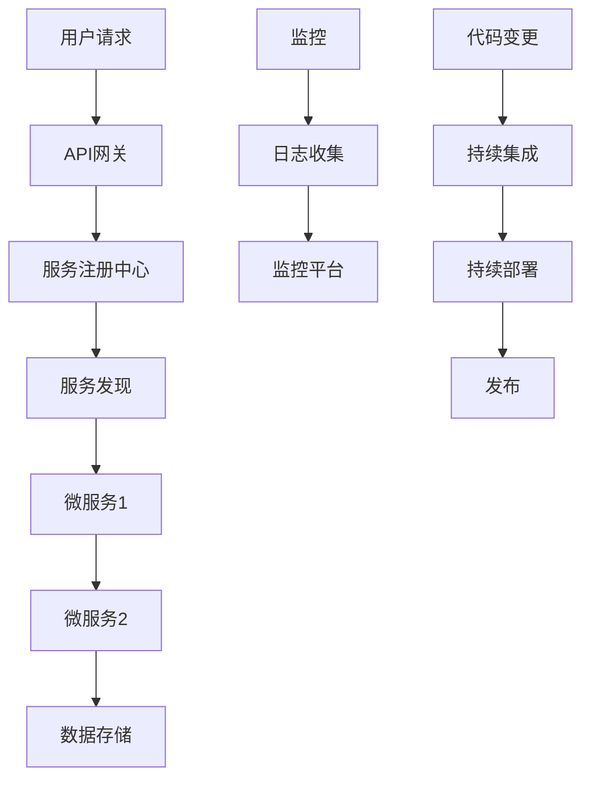

                 

# 软件2.0的技术栈选择策略

> 关键词：软件2.0，技术栈选择，架构设计，云计算，微服务，持续交付，容器化，服务器less，DevOps

## 1. 背景介绍

### 1.1 软件2.0的定义

软件2.0通常指的是一种基于互联网的、分布式的、服务化的软件架构模式，它强调软件系统的可扩展性、可靠性和可维护性。随着云计算、微服务和持续交付等技术的发展，软件2.0的理念得到了广泛的应用。

### 1.2 技术栈选择的重要性

软件2.0的技术栈选择是软件开发过程中的一个关键环节，它直接影响到系统的性能、可维护性和扩展性。在选择技术栈时，开发者需要考虑多个方面，包括但不限于技术成熟度、社区支持、可扩展性、成本效益等因素。

## 2. 核心概念与联系

### 2.1 核心概念概述

软件2.0的技术栈通常包括以下几个核心概念：

- **云计算**：提供弹性、可扩展的计算资源，减少硬件成本和管理负担。
- **微服务**：将大型系统分解为一系列小型服务，每个服务独立部署和维护。
- **持续交付**：实现快速和频繁的软件交付，缩短市场反馈周期。
- **容器化**：使用容器技术封装应用程序和依赖，简化部署和管理。
- **服务器less**：利用云服务提供商的事件驱动计算能力，减少服务器管理负担。
- **DevOps**：强调开发和运维的协作，实现快速和高效的交付和部署。

这些概念互相作用，共同构成了软件2.0的技术栈，使得系统更加灵活、可扩展和高效。

### 2.2 核心概念原理与架构流程图

以下是软件2.0技术栈中关键概念的Mermaid流程图：

## 3. 核心算法原理 & 具体操作步骤

### 3.1 算法原理概述

软件2.0的技术栈选择是一个综合考虑的过程，主要包括以下几个方面：

- **技术选择**：根据项目需求选择合适的技术栈，例如选择云服务提供商、编程语言、数据库系统等。
- **架构设计**：设计系统架构，确保系统的可扩展性、可靠性和可维护性，例如采用微服务架构、事件驱动架构等。
- **部署策略**：选择合适的部署策略，例如采用持续交付、自动化部署等。
- **监控和管理**：设计监控和管理策略，确保系统的稳定性和性能，例如使用容器化、服务器less等技术。

### 3.2 算法步骤详解

以下是技术栈选择过程中的具体步骤：

1. **需求分析**：根据项目需求分析出技术栈的基本要求。
2. **选型评估**：根据需求分析结果，评估各种技术栈的适用性。
3. **设计方案**：根据选型结果，设计系统架构和部署策略。
4. **实施方案**：根据设计方案，实施技术栈选择，包括技术集成、测试和部署等。
5. **监控优化**：在实施过程中进行监控，根据监控结果优化技术栈。

### 3.3 算法优缺点

软件2.0的技术栈选择有其优缺点：

- **优点**：提高系统的可扩展性、可靠性和可维护性，缩短市场反馈周期。
- **缺点**：增加了技术复杂性和成本，可能导致开发和运维的协作困难。

### 3.4 算法应用领域

软件2.0的技术栈选择广泛应用于以下领域：

- **互联网公司**：利用云计算、微服务和持续交付等技术，实现快速的产品迭代和市场响应。
- **金融科技**：利用服务器less和容器化技术，实现金融应用的高性能和高可用性。
- **电商平台**：利用微服务架构和持续交付技术，实现电商平台的快速扩展和高效管理。

## 4. 数学模型和公式 & 详细讲解 & 举例说明

### 4.1 数学模型构建

在技术栈选择的过程中，需要建立数学模型来评估不同技术栈的性能和成本。例如，可以建立成本效益比的数学模型，评估不同技术栈的总成本和总收益。

### 4.2 公式推导过程

假设总成本C为成本效益比公式：

$$
C = \frac{T}{P}
$$

其中T为总成本，P为总收益。

### 4.3 案例分析与讲解

例如，在电商平台的背景下，假设我们需要选择技术栈来支撑1000个用户的在线购物功能。根据技术栈的选择，总成本可能包括硬件成本、运维成本、开发成本等。总收益可能包括销售额、用户增长等。

通过建立数学模型，我们可以评估不同技术栈的成本效益比，从而选择最优的技术栈。

## 5. 项目实践：代码实例和详细解释说明

### 5.1 开发环境搭建

在实践中，首先需要搭建开发环境，包括安装必要的软件工具，如IDE、版本控制系统等。

### 5.2 源代码详细实现

根据技术栈的选择，编写源代码，实现系统的功能。例如，如果选择使用微服务架构，可以编写每个服务的代码。

### 5.3 代码解读与分析

解读和分析源代码，确保代码的正确性和可读性。

### 5.4 运行结果展示

展示运行结果，验证系统的性能和功能。

## 6. 实际应用场景

### 6.1 电商平台

在电商平台中，软件2.0的技术栈选择可以帮助实现快速的产品迭代和市场响应。

### 6.2 金融科技

在金融科技领域，软件2.0的技术栈选择可以帮助实现金融应用的高性能和高可用性。

### 6.3 工业自动化

在工业自动化领域，软件2.0的技术栈选择可以帮助实现设备的高效控制和数据的实时监控。

## 7. 工具和资源推荐

### 7.1 学习资源推荐

为了帮助开发者学习软件2.0的技术栈选择，以下是一些推荐的学习资源：

- **《微服务架构模式》**：深入浅出的介绍微服务架构的原理和实践。
- **《持续交付实践指南》**：提供持续交付的实践指导和案例分析。
- **《容器化编程》**：介绍容器化技术的编程实践。

### 7.2 开发工具推荐

软件2.0的技术栈选择需要使用一些开发工具，以下是一些推荐的开发工具：

- **Docker**：容器化技术的实现工具。
- **Kubernetes**：容器编排和自动化工具。
- **Jenkins**：持续交付的自动化工具。

### 7.3 相关论文推荐

对于软件2.0的技术栈选择，以下是一些相关的论文推荐：

- **《微服务架构中的服务治理》**：讨论微服务架构中的服务治理问题。
- **《持续交付中的自动化测试》**：研究持续交付中的自动化测试技术。
- **《容器化应用的性能优化》**：分析容器化应用的性能优化方法。

## 8. 总结：未来发展趋势与挑战

### 8.1 研究成果总结

软件2.0的技术栈选择已经在很多领域得到了应用，实现了快速的产品迭代和市场响应。

### 8.2 未来发展趋势

在未来，随着云计算、人工智能和物联网等技术的发展，软件2.0的技术栈选择将会更加丰富和复杂。例如，人工智能将被广泛应用于系统的优化和自动化。

### 8.3 面临的挑战

在实践中，软件2.0的技术栈选择也面临一些挑战，例如技术栈的选择和集成、系统的监控和管理、开发和运维的协作等。

### 8.4 研究展望

在未来，研究人员需要继续探索新的技术栈选择方法和实践案例，以满足不断变化的市场需求。

## 9. 附录：常见问题与解答

**Q1：软件2.0的技术栈选择需要哪些步骤？**

A: 软件2.0的技术栈选择需要根据项目需求分析出技术栈的基本要求，评估各种技术栈的适用性，设计系统架构和部署策略，实施技术栈选择，监控优化等。

**Q2：软件2.0的技术栈选择如何减少技术复杂性和成本？**

A: 软件2.0的技术栈选择可以通过简化架构、提高系统的可扩展性和可靠性、采用自动化部署和监控工具等方式来减少技术复杂性和成本。

**Q3：软件2.0的技术栈选择如何保证系统的稳定性和性能？**

A: 软件2.0的技术栈选择可以通过设计系统架构、使用监控和管理工具、进行性能测试等方式来保证系统的稳定性和性能。

---

作者：禅与计算机程序设计艺术 / Zen and the Art of Computer Programming

