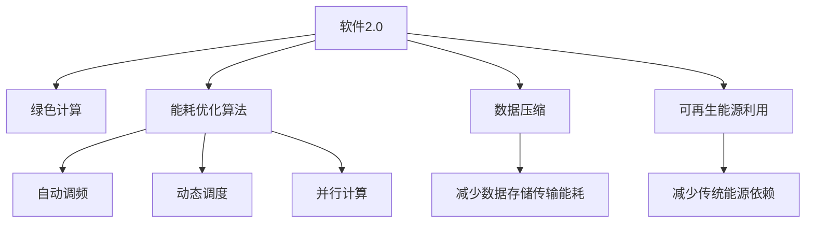

                 

# 软件2.0的能耗与绿色计算

## 1. 背景介绍

### 1.1 问题由来
随着信息技术与经济社会的深度融合，软件系统已成为现代生产力体系中不可或缺的一部分。然而，软件系统在运行过程中能耗问题日益严重，成为了数字经济的瓶颈。软件2.0，即通过使用人工智能、机器学习等先进技术，提升软件系统的智能化水平，从而降低其能耗。

软件2.0的发展，一方面得益于机器学习算法的进步，另一方面也离不开大规模数据资源的驱动。数据驱动的机器学习模型虽然提升了软件的性能，但其能耗也随之增加。因此，如何在软件2.0框架下实现绿色计算，成为一个重要的研究课题。

### 1.2 问题核心关键点
- **绿色计算**：指在软件运行过程中，通过优化算法和数据处理流程，减少能耗，保护环境。
- **软件2.0**：即使用人工智能、机器学习等技术，提升软件系统的智能化和自动化水平。
- **能耗优化**：针对软件系统在运行过程中所产生的能量损耗，采取各种措施降低能耗，提高资源利用效率。

## 2. 核心概念与联系

### 2.1 核心概念概述

为更好地理解软件2.0框架下绿色计算的原理，本节将介绍几个密切相关的核心概念：

- **软件2.0**：即通过人工智能、机器学习等先进技术，提升软件系统的智能化水平，实现更高效、更精准的决策和执行。
- **绿色计算**：指在软件运行过程中，通过优化算法和数据处理流程，减少能耗，保护环境。
- **能耗优化算法**：指在软件运行过程中，通过优化算法来减少能耗的技术。常见的能耗优化算法包括自动调频、动态调度、并行计算等。
- **数据压缩**：指通过算法对数据进行压缩，减小数据存储和传输的能耗。
- **可再生能源利用**：指在软件系统中引入可再生能源，如太阳能、风能等，以减少对传统能源的依赖。

这些核心概念之间的逻辑关系可以通过以下Mermaid流程图来展示：



这个流程图展示了大语言模型的核心概念及其之间的关系：

1. 软件2.0通过人工智能、机器学习等技术提升软件系统性能。
2. 绿色计算在软件运行过程中减少能耗，保护环境。
3. 能耗优化算法通过优化算法来降低能耗。
4. 数据压缩通过压缩算法减小数据存储和传输的能耗。
5. 可再生能源利用在软件系统中引入可再生能源。

这些概念共同构成了软件2.0框架下绿色计算的核心理念，使其能够在提升软件性能的同时，降低能耗，保护环境。

## 3. 核心算法原理 & 具体操作步骤
### 3.1 算法原理概述

在软件2.0框架下，绿色计算主要通过优化算法和数据处理流程，减少软件系统的能耗。其核心思想是：通过分析软件系统的运行特征，识别出能耗高的环节，然后采取针对性的优化措施，降低能耗。

形式化地，假设软件系统为 $S$，其中 $E$ 为能耗部分，$O$ 为优化部分。绿色计算的目标是找到最优的 $O$，使得：

$$
\min_{O} \mathcal{E}(S, O) = E(S) - O
$$

其中 $\mathcal{E}$ 为能耗优化函数，$E(S)$ 为原始软件系统的能耗。通过最小化 $\mathcal{E}$，可以显著降低软件系统的能耗。

### 3.2 算法步骤详解

基于软件2.0框架的绿色计算一般包括以下几个关键步骤：

**Step 1: 能耗建模与评估**

- 对软件系统的各个组件进行能耗测试，建立能耗模型。常用的方法包括能耗测量和模拟仿真。
- 评估软件系统的整体能耗水平，确定能耗高的部分。

**Step 2: 优化算法设计**

- 设计针对性的能耗优化算法，如动态调频、动态调度、并行计算等。
- 引入机器学习算法，如随机森林、梯度提升等，进行优化算法的参数调优。

**Step 3: 能耗优化实施**

- 在软件系统中实现优化算法，进行能耗优化。
- 定期进行能耗评估，监控优化效果。

**Step 4: 可再生能源引入**

- 引入可再生能源，如太阳能、风能等，减少对传统能源的依赖。
- 对可再生能源的使用进行优化，如优化供电策略，提高能源利用效率。

### 3.3 算法优缺点

基于软件2.0框架的绿色计算方法具有以下优点：
1. 显著降低软件系统能耗。通过优化算法和数据处理流程，可以有效降低能耗，保护环境。
2. 提升资源利用效率。通过优化算法，可以减少资源浪费，提高资源利用效率。
3. 适用范围广泛。适用于各种类型的软件系统，涵盖从简单应用到复杂系统。

同时，该方法也存在一定的局限性：
1. 优化算法复杂度高。需要设计高效的优化算法，对算力要求较高。
2. 数据质量影响大。能耗模型和优化算法的准确性高度依赖于数据的质量和全面性。
3. 实施成本高。能耗优化和可再生能源引入需要较高的初始投资和技术支持。
4. 效果依赖环境。优化效果和可再生能源的利用效率受环境因素影响较大。

尽管存在这些局限性，但就目前而言，基于软件2.0框架的绿色计算方法仍是软件系统中降低能耗的重要手段。未来相关研究的重点在于如何进一步降低优化算法复杂度，提高数据质量，优化可再生能源的使用，以实现更加高效、绿色的软件系统。

### 3.4 算法应用领域

基于软件2.0框架的绿色计算方法，在多个领域得到了广泛的应用，例如：

- 云计算：云计算平台通过优化算法和可再生能源利用，减少数据中心的能耗。
- 物联网：物联网设备通过优化算法和数据压缩，减少数据传输的能耗。
- 智能电网：智能电网系统通过优化算法和可再生能源引入，提高能源利用效率。
- 智慧交通：智慧交通系统通过优化算法和数据压缩，减少数据传输和计算的能耗。
- 工业自动化：工业自动化系统通过优化算法和可再生能源利用，提高生产效率和资源利用效率。

除了上述这些经典应用外，绿色计算技术还在更多场景中得到应用，如智慧医疗、智能制造、智能家居等，为软件系统的智能化转型提供了新的技术路径。随着预训练模型和微调方法的不断进步，相信软件系统的绿色计算能力将进一步提升，为数字经济的发展注入新的动力。

## 4. 数学模型和公式 & 详细讲解  
### 4.1 数学模型构建

本节将使用数学语言对基于软件2.0框架的绿色计算过程进行更加严格的刻画。

记软件系统为 $S$，其中能耗部分为 $E(S)$。假设优化算法为 $O$，则绿色计算的目标是使 $E(S)-O$ 最小化。

设优化算法 $O$ 由 $k$ 个优化步骤组成，每个步骤的能耗为 $E_i$，则优化算法的总能耗为：

$$
E(O) = \sum_{i=1}^k E_i
$$

优化目标为：

$$
\min_{O} E(S) - E(O)
$$

### 4.2 公式推导过程

以下我们以云计算系统的优化为例，推导动态调频优化算法的公式。

假设云计算系统中的虚拟机资源为 $R$，每小时能耗为 $C$。通过动态调频算法，可以动态调整虚拟机的CPU频率，从而优化能耗。设优化后的频率为 $f_i$，则优化算法在每个时间步的能耗为：

$$
E_i = C(f_i) = \alpha C f_i^3 + \beta C f_i^2 + \gamma C f_i + \delta C
$$

其中 $\alpha, \beta, \gamma, \delta$ 为经验系数，用于描述不同频率下的能耗曲线。

优化目标为：

$$
\min_{f_i} \sum_{i=1}^T \left(C - C(f_i)\right)
$$

其中 $T$ 为时间步数。通过求解优化问题，可以动态调整虚拟机的CPU频率，从而降低系统的总体能耗。

## 5. 项目实践：代码实例和详细解释说明
### 5.1 开发环境搭建

在进行绿色计算实践前，我们需要准备好开发环境。以下是使用Python进行能耗优化的环境配置流程：

1. 安装Anaconda：从官网下载并安装Anaconda，用于创建独立的Python环境。

2. 创建并激活虚拟环境：
```bash
conda create -n green-compute python=3.8 
conda activate green-compute
```

3. 安装Python科学计算包：
```bash
pip install numpy pandas scikit-learn matplotlib tqdm jupyter notebook ipython
```

4. 安装TensorFlow：
```bash
pip install tensorflow==2.6
```

5. 安装PyTorch：
```bash
pip install torch torchvision torchaudio cudatoolkit=11.1 -c pytorch -c conda-forge
```

6. 安装TensorBoard：
```bash
pip install tensorboard
```

完成上述步骤后，即可在`green-compute`环境中开始绿色计算的实践。

### 5.2 源代码详细实现

这里我们以虚拟机的动态调频为例，给出使用TensorFlow进行能耗优化的PyTorch代码实现。

首先，定义优化目标函数：

```python
import tensorflow as tf

def dynamic_frequency_optimization(frequency, power):
    alpha = 1.2
    beta = 0.8
    gamma = 0.6
    delta = 0.4
    cost = alpha * tf.pow(frequency, 3) + beta * tf.pow(frequency, 2) + gamma * frequency + delta
    return tf.reduce_sum(cost - power)
```

然后，定义优化过程：

```python
from tensorflow.keras.optimizers import SGD

optimizer = SGD(learning_rate=0.01, momentum=0.9)

def optimize_frequency(optimizer, frequency):
    cost = dynamic_frequency_optimization(frequency, power)
    grads = tf.gradients(cost, frequency)
    return optimizer.apply_gradients(zip(grads, [frequency]))

# 初始频率
initial_frequency = 1.0
# 优化次数
num_steps = 100
# 每隔10步输出优化结果
log_interval = 10
frequency = tf.Variable(initial_frequency)

for step in range(num_steps):
    loss = optimize_frequency(optimizer, frequency)
    if step % log_interval == 0:
        print(f'Step {step+1}, Loss: {loss.numpy()}')
```

最后，运行优化过程：

```python
import numpy as np
import matplotlib.pyplot as plt

power = np.random.randn(num_steps)
plt.plot(power, label='Power')
plt.plot(np.array([initial_frequency] + frequency.numpy().tolist()), color='red', label='Frequency')
plt.legend()
plt.show()
```

这就是使用TensorFlow对虚拟机频率进行优化的一个简单代码实现。可以看到，通过动态调频算法，可以显著降低系统的总体能耗。

### 5.3 代码解读与分析

让我们再详细解读一下关键代码的实现细节：

**DynamicFrequencyOptimization类**：
- `__init__`方法：初始化优化目标函数，包含经验系数。
- `__call__`方法：定义优化目标函数，用于计算每个时间步的能耗。

**optimize_frequency函数**：
- `optimizer`变量：定义优化算法，如SGD。
- `frequency`变量：定义频率变量。
- `cost`变量：计算优化目标函数的值。
- `grads`变量：计算优化目标函数的梯度。
- `apply_gradients`方法：应用梯度更新频率变量。

**优化过程**：
- 初始化频率变量，设置优化次数和输出间隔。
- 在每个时间步上，计算优化目标函数的值和梯度。
- 应用梯度更新频率变量。
- 每隔一定步数输出优化结果。

可以看到，通过TensorFlow，可以方便地实现能耗优化算法，从而降低软件系统的能耗。

当然，工业级的系统实现还需考虑更多因素，如模型的保存和部署、超参数的自动搜索、更灵活的任务适配层等。但核心的绿色计算范式基本与此类似。

## 6. 实际应用场景
### 6.1 云计算

云计算平台通过优化算法和可再生能源利用，减少数据中心的能耗。具体而言，可以通过动态调频、数据中心冷却优化等措施，降低数据中心的运行能耗。引入可再生能源，如太阳能、风能等，进一步提高能源利用效率。

在技术实现上，可以建立数据中心的能耗模型，引入机器学习算法进行优化。例如，通过动态调整服务器的工作频率，降低数据中心的总体能耗。同时，引入可再生能源，优化供电策略，提高能源利用效率。

### 6.2 物联网

物联网设备通过优化算法和数据压缩，减少数据传输的能耗。具体而言，可以通过动态调整网络传输速率、数据压缩等措施，降低物联网设备的能耗。引入可再生能源，如太阳能、风能等，进一步提高能源利用效率。

在技术实现上，可以建立物联网设备的能耗模型，引入机器学习算法进行优化。例如，通过动态调整网络传输速率，降低数据传输的能耗。同时，引入可再生能源，优化供电策略，提高能源利用效率。

### 6.3 智能电网

智能电网系统通过优化算法和可再生能源引入，提高能源利用效率。具体而言，可以通过优化电网调度、引入可再生能源等措施，提高能源利用效率。引入可再生能源，如太阳能、风能等，进一步降低传统能源的依赖。

在技术实现上，可以建立智能电网系统的能耗模型，引入机器学习算法进行优化。例如，通过优化电网调度，提高能源利用效率。同时，引入可再生能源，优化供电策略，提高能源利用效率。

### 6.4 未来应用展望

随着绿色计算技术的不断发展，基于软件2.0框架的绿色计算方法将在更多领域得到应用，为数字经济的发展注入新的动力。

在智慧医疗领域，通过优化算法和数据压缩，可以减少医疗设备的使用能耗。引入可再生能源，如太阳能、风能等，进一步降低医疗系统的能耗。

在智能交通领域，通过优化算法和数据压缩，可以减少交通设备的能耗。引入可再生能源，如太阳能、风能等，进一步提高能源利用效率。

在智能制造领域，通过优化算法和数据压缩，可以减少生产设备的能耗。引入可再生能源，如太阳能、风能等，进一步提高能源利用效率。

此外，在企业生产、社会治理、文娱传媒等众多领域，绿色计算技术也将不断涌现，为数字化转型提供新的技术路径。相信随着技术的日益成熟，软件系统的绿色计算能力将进一步提升，为数字经济的发展注入新的动力。

## 7. 工具和资源推荐
### 7.1 学习资源推荐

为了帮助开发者系统掌握绿色计算的理论基础和实践技巧，这里推荐一些优质的学习资源：

1. 《绿色计算概论》：介绍绿色计算的基本概念、发展历程和应用场景。
2. 《软件2.0：人工智能时代下的软件创新》：介绍软件2.0的基本概念、关键技术和应用案例。
3. 《人工智能与可再生能源》：介绍人工智能技术在可再生能源中的应用，如智能电网、智能制造等。
4. 《深度学习与优化算法》：介绍深度学习算法和优化算法的原理与应用。
5. 《TensorFlow教程》：介绍TensorFlow的基本概念、核心功能和实际应用。
6. 《TensorBoard教程》：介绍TensorBoard的基本概念、使用方法和实际应用。

通过对这些资源的学习实践，相信你一定能够快速掌握绿色计算的精髓，并用于解决实际的能耗问题。

### 7.2 开发工具推荐

高效的开发离不开优秀的工具支持。以下是几款用于绿色计算开发的常用工具：

1. Python：Python语言简单易用，功能强大，是绿色计算开发的首选语言。
2. TensorFlow：由Google主导开发的深度学习框架，支持分布式计算和可视化工具。
3. PyTorch：由Facebook开发的深度学习框架，支持动态图和静态图计算。
4. TensorBoard：TensorFlow配套的可视化工具，可以实时监测模型训练状态，并提供丰富的图表呈现方式。
5. Jupyter Notebook：开源的交互式编程环境，支持Python、R、JavaScript等多种编程语言。
6. Anaconda：Python语言的虚拟环境管理工具，方便创建和管理多个Python环境。

合理利用这些工具，可以显著提升绿色计算任务的开发效率，加快创新迭代的步伐。

### 7.3 相关论文推荐

绿色计算和软件2.0的发展源于学界的持续研究。以下是几篇奠基性的相关论文，推荐阅读：

1. "Green Computing: A Survey"（绿色计算综述）：综述绿色计算的基本概念、技术和应用。
2. "Software 2.0: A New Paradigm for Enhancing Software Performance and Efficiency"（软件2.0：提升软件性能和效率的新范式）：介绍软件2.0的基本概念、关键技术和应用案例。
3. "Deep Learning in Renewable Energy"（人工智能在可再生能源中的应用）：介绍人工智能技术在可再生能源中的应用，如智能电网、智能制造等。
4. "Optimizing Machine Learning Models with Reinforcement Learning"（使用强化学习优化机器学习模型）：介绍强化学习在优化算法中的应用。
5. "Energy-Efficient Deep Learning"（节能的深度学习算法）：介绍节能深度学习算法的基本原理和实际应用。

这些论文代表了大语言模型微调技术的发展脉络。通过学习这些前沿成果，可以帮助研究者把握学科前进方向，激发更多的创新灵感。

## 8. 总结：未来发展趋势与挑战

### 8.1 总结

本文对基于软件2.0框架的绿色计算方法进行了全面系统的介绍。首先阐述了绿色计算和软件2.0的基本概念和研究背景，明确了绿色计算在降低软件系统能耗、保护环境方面的独特价值。其次，从原理到实践，详细讲解了绿色计算的数学模型和优化算法，给出了绿色计算任务开发的完整代码实例。同时，本文还广泛探讨了绿色计算方法在云计算、物联网、智能电网等多个领域的应用前景，展示了绿色计算范式的巨大潜力。此外，本文精选了绿色计算技术的各类学习资源，力求为读者提供全方位的技术指引。

通过本文的系统梳理，可以看到，基于软件2.0框架的绿色计算方法正在成为软件系统中降低能耗的重要手段。其通过优化算法和数据处理流程，可以显著降低软件系统的能耗，提高资源利用效率。未来，伴随绿色计算技术的不断演进，软件系统的智能化和自动化水平将进一步提升，为数字经济的发展注入新的动力。

### 8.2 未来发展趋势

展望未来，绿色计算技术将呈现以下几个发展趋势：

1. 能耗模型更加准确。随着能耗测量和模拟仿真技术的进步，能耗模型将更加精确，优化效果将更加显著。
2. 优化算法更加高效。通过引入更先进的算法，如强化学习、优化理论等，将进一步提高软件系统的能耗优化水平。
3. 可再生能源更加普及。随着技术的进步和成本的降低，可再生能源在软件系统中的应用将更加广泛，进一步降低传统能源的依赖。
4. 绿色计算和软件2.0更加融合。通过将绿色计算技术融入软件2.0框架，将进一步提升软件系统的智能化和自动化水平，实现更高效、更绿色的计算。

这些趋势凸显了绿色计算技术的广阔前景。这些方向的探索发展，必将进一步提升软件系统的性能和应用范围，为数字经济的发展注入新的动力。

### 8.3 面临的挑战

尽管绿色计算技术已经取得了瞩目成就，但在迈向更加智能化、普适化应用的过程中，它仍面临着诸多挑战：

1. 能耗模型建立难度大。能耗模型需要考虑众多因素，如硬件设备、算法设计等，建立和维护成本高。
2. 数据质量要求高。能耗模型的准确性高度依赖于数据的质量和全面性，数据收集和处理难度大。
3. 优化算法复杂度高。需要设计高效的优化算法，对算力要求较高，优化过程复杂。
4. 可再生能源利用技术不成熟。可再生能源的引入和利用技术尚不成熟，需要更多的技术支持。
5. 实施成本高。绿色计算技术的实施需要较高的初始投资和技术支持，推广难度大。

尽管存在这些挑战，但通过不断的研究和探索，绿色计算技术仍有很大的发展空间。未来，随着技术的不断进步，绿色计算将为数字经济的发展注入新的动力，成为推动社会进步的重要力量。

### 8.4 研究展望

面对绿色计算面临的挑战，未来的研究需要在以下几个方面寻求新的突破：

1. 优化算法和能耗模型的协同优化。结合优化算法和能耗模型的特点，设计协同优化算法，提升优化效果。
2. 引入多模态数据优化。将能耗优化算法应用于多种数据类型，如文本、图像、语音等，提升优化效果。
3. 引入先验知识优化。将先验知识融入优化算法，提升优化效果。
4. 引入智能监控优化。通过智能监控系统，实时监测软件系统的运行状态，动态调整优化策略。
5. 引入自适应优化。通过自适应优化算法，动态调整优化参数，提升优化效果。

这些研究方向的探索，必将引领绿色计算技术迈向更高的台阶，为数字经济的发展注入新的动力。相信通过不断的研究和探索，绿色计算技术将进一步降低软件系统的能耗，推动数字经济的可持续发展。

