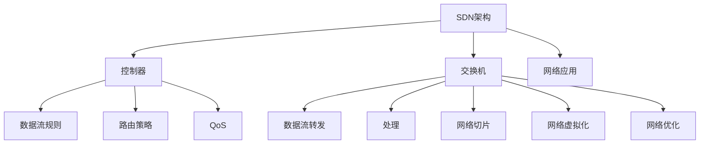

                 

# 软件定义网络（SDN）：网络架构的革新

> 关键词：软件定义网络, SDN, 网络架构, 控制平面, 数据平面, 网络虚拟化, 网络切片, 网络优化

## 1. 背景介绍

### 1.1 问题由来

随着互联网技术的快速发展，数据中心、云服务、物联网等新兴业务对网络的需求越来越复杂。传统的网络设备（如路由器、交换机）主要通过硬件实现网络数据流的转发和处理，软件控制能力有限，难以支持高度灵活的网络应用。同时，网络管理难度大，扩展性和效率低下，成为制约网络技术发展的主要瓶颈。

为了应对这些挑战，软件定义网络（Software Defined Networking, SDN）作为一种新型网络架构应运而生。SDN将网络控制平面和数据平面分离，使网络管理者能够通过软件定义和管理整个网络，实现网络功能的灵活配置、优化与扩展。

### 1.2 问题核心关键点

SDN的核心在于网络功能可编程性，主要体现在以下几个方面：

- **集中控制**：将网络的控制平面集中到软件控制模块，实现全网络的集中管理和配置。
- **分离平面**：将控制平面和数据平面分离，使数据流转发和处理由硬件实现，提升网络性能。
- **网络虚拟化**：通过软件实现网络资源的虚拟化，支持灵活的虚拟网络、虚拟存储等应用。
- **网络切片**：通过软件定义虚拟网络切片，支持多租户共享网络资源，提高资源利用率。
- **网络优化**：通过集中控制，实时调整网络资源，优化网络性能，提升用户体验。

SDN的优势在于能支持动态、灵活的网络管理和优化，大幅提升网络扩展性、效率和安全性，成为现代网络架构革新的重要方向。

### 1.3 问题研究意义

研究SDN的核心技术和应用，对于推动网络技术的智能化、自动化发展，提升网络管理效率和用户体验，具有重要意义：

- **提升网络管理效率**：通过集中控制，实现网络资源的灵活配置和动态调整，提升网络管理效率和故障处理速度。
- **优化网络性能**：利用软件控制能力，实时监控和优化网络资源使用，提升网络吞吐量和稳定性。
- **支持新业务创新**：通过网络切片、虚拟化等技术，支持更丰富的网络应用和服务，促进新兴业务的发展。
- **增强网络安全**：集中控制和管理网络流量，实现精细化的流量监控和安全策略，降低网络安全风险。

## 2. 核心概念与联系

### 2.1 核心概念概述

为更好地理解SDN的架构和原理，本节将介绍几个密切相关的核心概念：

- **SDN架构**：SDN架构由控制器、交换机和网络应用组成。控制器集中管理网络资源，交换机执行数据流转发，网络应用通过API与控制器交互，实现定制化的网络功能。

- **控制器**：SDN的核心组件，负责集中管理和配置网络资源，包括数据流规则、路由策略、QoS等。控制器通常采用分布式架构，提升处理能力和扩展性。

- **交换机**：SDN中的数据平面，执行网络数据流的转发和处理。传统交换机一般通过硬件实现，而SDN交换机通过编程接口与控制器通信，支持动态配置和优化。

- **网络切片**：通过软件实现网络资源的多租户共享，支持不同类型的虚拟网络和服务，提高资源利用率。

- **网络虚拟化**：利用软件技术实现网络资源和服务的虚拟化，支持灵活的网络应用和服务，提升资源利用率和安全性。

- **网络优化**：通过集中控制和管理网络资源，实时调整网络策略，优化网络性能，提升用户体验。

这些核心概念之间的逻辑关系可以通过以下Mermaid流程图来展示：



这个流程图展示了SDN的架构和核心组件之间的关系：

1. SDN架构由控制器、交换机和网络应用组成，其中控制器集中管理网络资源。
2. 控制器管理数据流规则、路由策略、QoS等，通过编程接口与交换机通信。
3. 交换机执行数据流转发和处理，支持动态配置和优化。
4. 网络切片和虚拟化技术支持灵活的网络应用和服务。
5. 网络优化通过集中控制和管理网络资源，实时调整策略，提升网络性能。

## 3. 核心算法原理 & 具体操作步骤
### 3.1 算法原理概述

SDN的集中控制是其核心特性之一，控制器通过编程接口与交换机通信，动态调整网络配置和优化策略。其基本原理包括：

- **南向API**：控制器与交换机之间的通信协议，通过OpenFlow、ONOS等标准实现。
- **北向API**：控制器与网络应用之间的通信协议，通过RESTful、OVSDB等实现。
- **网络编程**：通过编程接口实现对网络资源的灵活配置和动态优化。

### 3.2 算法步骤详解

SDN的实现通常遵循以下步骤：

**Step 1: 网络部署**

- 部署SDN控制器，连接所有网络交换机，实现集中控制。
- 配置网络路由、策略等基础配置，初始化网络资源。

**Step 2: 编程与优化**

- 通过南向API与交换机通信，实现网络数据流的配置和优化。
- 利用北向API与网络应用交互，实现定制化的网络功能。

**Step 3: 监测与反馈**

- 实时监测网络流量、性能等指标，进行异常检测和故障处理。
- 根据网络状态和应用需求，动态调整网络配置和策略。

**Step 4: 应用集成**

- 将网络功能集成到实际应用场景中，实现业务优化和创新。

### 3.3 算法优缺点

SDN的集中控制和灵活配置优势明显，但也存在一些局限：

**优点**：

- **灵活性高**：支持动态配置和优化，适应多种网络应用场景。
- **管理效率高**：集中管理网络资源，提升故障处理和优化速度。
- **扩展性强**：支持多租户和虚拟网络，提升资源利用率。

**缺点**：

- **硬件复杂性**：SDN交换机需要支持编程接口，硬件成本较高。
- **安全性问题**：集中控制可能引入安全风险，需要加强安全防护。
- **标准化挑战**：不同厂商的控制器和交换机可能互不兼容，缺乏统一标准。

### 3.4 算法应用领域

SDN技术在多个领域得到了广泛应用，例如：

- **数据中心网络**：支持数据中心内网络的灵活配置和优化，提升数据中心性能和效率。
- **云计算**：支持多租户共享网络资源，提升云服务的网络性能和安全性。
- **企业网**：支持企业内部网络的灵活部署和管理，提升网络管理的效率和安全性。
- **物联网**：支持物联网设备的灵活连接和配置，提升物联网网络的性能和稳定性。

除了这些经典应用外，SDN技术还在智能电网、自动驾驶、工业控制等领域得到了创新应用，推动了相关行业的智能化转型升级。

## 4. 数学模型和公式 & 详细讲解 & 举例说明

### 4.1 数学模型构建

SDN的控制平面和数据平面的交互主要通过编程接口实现，形式化表达如下：

- **南向API模型**：控制器与交换机之间的通信协议，一般包括流表项定义、统计信息报告等。
- **北向API模型**：控制器与网络应用之间的通信协议，一般包括路由策略、QoS策略等。

### 4.2 公式推导过程

以OpenFlow协议为例，控制器与交换机之间的通信主要通过流表项进行配置。流表项定义如下：

- **流表项ID**：流表项的唯一标识符，用于快速查找和更新。
- **匹配规则**：包括目的IP、源IP、端口号等字段，用于匹配网络数据流。
- **操作指令**：包括转发端口、统计计数器等，用于数据流的处理和监控。

流表项的匹配和更新过程可以通过以下公式推导：

- **匹配规则推导**：
$$
R = \bigcup_{i=1}^{N} F_i
$$

其中 $R$ 表示流表项的匹配规则集合，$F_i$ 表示第 $i$ 个流表项的匹配规则。

- **操作指令推导**：
$$
O = \bigoplus_{i=1}^{N} O_i
$$

其中 $O$ 表示流表项的操作指令集合，$\bigoplus$ 表示并集操作。

### 4.3 案例分析与讲解

以OpenFlow协议为例，控制器与交换机之间的通信过程如下：

1. **流表项匹配**：控制器将流表项发送给交换机，交换机根据匹配规则匹配网络数据流。
2. **操作指令执行**：根据匹配结果执行相应的操作指令，如转发至指定端口、统计计数器等。
3. **统计信息报告**：交换机定期将统计信息报告给控制器，控制器分析网络流量和性能。
4. **流表项更新**：根据分析结果，动态更新流表项，优化网络配置和策略。

## 5. 项目实践：代码实例和详细解释说明
### 5.1 开发环境搭建

在进行SDN开发前，我们需要准备好开发环境。以下是使用Python进行OpenFlow开发的配置流程：

1. 安装Anaconda：从官网下载并安装Anaconda，用于创建独立的Python环境。

2. 创建并激活虚拟环境：
```bash
conda create -n openflow-env python=3.8 
conda activate openflow-env
```

3. 安装Mininet：一个轻量级的Python网络模拟器，用于构建和测试SDN网络。
```bash
pip install mininet
```

4. 安装Neteffect：一个支持OpenFlow协议的网络分析工具，用于分析和优化网络流量。
```bash
pip install neteffect
```

完成上述步骤后，即可在`openflow-env`环境中开始SDN开发。

### 5.2 源代码详细实现

这里我们以OpenFlow协议为例，给出使用Python和Mininet进行SDN开发的代码实现。

首先，创建Mininet拓扑并配置OpenFlow控制器：

```python
from mininet.net import Mininet
from mininet.log import setLogLevel
from mininet.mobility import mobility
from mininet.mnop import Postrule, PostCheck
from mininet.topo import Topo
from mininet.util import waitOneLinkUp

class MyTopo(Topo):
    def build(self):
        s1 = self.addSwitch('s1')
        s2 = self.addSwitch('s2')
        h1 = self.addHost('h1')
        h2 = self.addHost('h2')
        
        self.addLink(s1, h1)
        self.addLink(s1, h2)
        self.addLink(s2, h1)
        self.addLink(s2, h2)

topo = MyTopo()
net = Mininet(topo=topo)

# 设置日志级别
setLogLevel('info')
# 启动网络
net.start()

# 添加OpenFlow控制器
controller = net.addController('c0', controller='share')
net.addController(controller)
```

然后，定义OpenFlow流表项并发送至交换机：

```python
# 定义流表项
match = Postrule()
match.setMatch(srcMac='00:00:00:00:00:01')
match.setMatch(destMac='00:00:00:00:00:02')
match.setAction(setOutput=1)

# 发送流表项至交换机
net controller c0 sendPostrule(match)
```

最后，测试网络流量并进行统计分析：

```python
# 发送数据包
h1.send('00:00:00:00:00:01')
h2.send('00:00:00:00:00:02')

# 等待网络稳定
waitOneLinkUp(net)

# 获取统计信息
stats = net controller c0 dumpStats()

# 打印统计信息
print(stats)
```

以上就是使用Python和Mininet进行OpenFlow协议的SDN开发的完整代码实现。可以看到，借助Mininet和Neteffect等工具，开发者可以方便地搭建和测试SDN网络，了解SDN的原理和实现过程。

### 5.3 代码解读与分析

让我们再详细解读一下关键代码的实现细节：

**MyTopo类**：
- 继承自Topo类，实现自定义拓扑结构。
- 定义了两个交换机和两个主机，通过addLink方法连接，实现网络拓扑。

**OpenFlow控制器**：
- 通过addController方法添加OpenFlow控制器，并发送至Mininet网络。
- 控制器支持OpenFlow协议，可以处理流表项的匹配和操作。

**Postrule类**：
- 定义了流表项的匹配规则和操作指令。
- 使用setMatch方法设置匹配规则，使用setAction方法设置操作指令。

**net controller sendPostrule方法**：
- 通过控制器发送流表项，实现对交换机的配置。
- 将匹配规则和操作指令封装成Postrule对象，发送至控制器。

**waitOneLinkUp函数**：
- 等待网络稳定，确保所有链路均正常工作。
- 确保数据包的发送和接收符合预期。

**net controller c0 dumpStats方法**：
- 获取统计信息，显示交换机的流量和状态。
- 通过控制器进行网络流量的监控和分析。

可以看到，使用Python和Mininet进行SDN开发，代码实现简洁高效，适合初学者和进阶开发者。开发者可以进一步探索OpenFlow协议的高级功能和应用场景，如网络切片、虚拟化等，实现更灵活的网络管理。

## 6. 实际应用场景
### 6.1 数据中心网络

数据中心网络是SDN技术的重要应用场景。传统数据中心网络复杂度高，管理困难，扩展性差。SDN通过集中控制，实现网络资源的灵活配置和动态调整，支持多租户共享网络资源，提升数据中心的网络性能和效率。

在实际应用中，可以通过SDN控制器对数据中心网络进行集中管理，实现流量优化、故障检测和恢复等功能。SDN交换机支持动态配置和优化，能够根据数据中心负载和流量变化，实时调整网络配置，提升网络性能和资源利用率。

### 6.2 云计算

云计算网络通常包含大量虚拟资源，网络复杂度高，管理难度大。SDN通过集中控制，支持多租户共享网络资源，优化网络性能和资源利用率。

在云计算环境中，SDN控制器可以实现集中管理和优化，支持网络切片、虚拟化等功能，提升云服务的网络性能和安全性。SDN交换机支持动态配置和优化，能够根据云服务负载和流量变化，实时调整网络配置，提高云服务的稳定性和可靠性。

### 6.3 企业网

企业网通常包含多种类型的设备和服务，网络复杂度高，管理困难。SDN通过集中控制，实现网络资源的灵活配置和优化，支持企业内部网络的灵活部署和管理。

在企业网应用中，SDN控制器可以实现集中管理和优化，支持网络切片、虚拟化等功能，提升企业网的网络性能和安全性。SDN交换机支持动态配置和优化，能够根据企业网负载和流量变化，实时调整网络配置，提高企业网的管理效率和稳定性。

### 6.4 未来应用展望

随着SDN技术的不断演进，未来将在更多领域得到应用，为传统行业带来变革性影响。

在智慧城市治理中，SDN可以实现城市事件的实时监测和响应，提升城市管理的智能化水平。在智能制造中，SDN可以实现生产网络的灵活配置和优化，提高生产效率和灵活性。

未来，SDN技术还将与其他新兴技术进行融合，如物联网、5G、边缘计算等，推动网络技术的智能化、自动化发展，为传统行业带来更多的创新和应用机会。

## 7. 工具和资源推荐
### 7.1 学习资源推荐

为了帮助开发者系统掌握SDN的核心技术和应用，这里推荐一些优质的学习资源：

1. 《SDN基础与实践》系列博文：由SDN技术专家撰写，深入浅出地介绍了SDN的基本概念、实现原理和应用场景。

2. SDN基础知识培训课程：多所大学和机构提供的在线课程，涵盖SDN的各个方面，适合入门学习。

3. SDN技术博客和社区：各大SDN厂商和技术社区，提供丰富的技术资料和实践经验，适合进阶学习。

4. SDN开源项目：OpenDaylight、ONOS等开源项目，提供完整的SDN实现代码和文档，适合深入学习。

5. SDN学术论文和报告：IEEE、ACM等期刊和会议发表的SDN论文和报告，提供最新的研究进展和前沿技术。

通过对这些资源的学习实践，相信你一定能够快速掌握SDN的核心技术和应用场景，并用于解决实际的SDN问题。

### 7.2 开发工具推荐

高效的SDN开发离不开优秀的工具支持。以下是几款用于SDN开发的常用工具：

1. Mininet：轻量级Python网络模拟器，用于构建和测试SDN网络。
2. OpenFlow：SDN标准协议，支持南向API和北向API，方便SDN控制器和交换机通信。
3. OpenDaylight：基于OpenFlow协议的SDN控制器，支持集中管理和优化网络资源。
4. ONOS：支持多协议的开源SDN控制器，支持分布式和集中式控制。
5. Neteffect：支持OpenFlow协议的网络分析工具，用于分析和优化网络流量。
6. Netbox：网络管理工具，支持SDN控制器和网络设备的集中管理。

合理利用这些工具，可以显著提升SDN开发和测试的效率，加快创新迭代的步伐。

### 7.3 相关论文推荐

SDN技术的发展源于学界的持续研究。以下是几篇奠基性的相关论文，推荐阅读：

1. OpenFlow: Enabling Innovation with Software Defined Networks：提出OpenFlow协议，为SDN的发展奠定了基础。
2. SDN-Enabled Architectures for Cloud Data Centers：介绍SDN在云数据中心中的应用，展示SDN的优势和潜力。
3. SDN-Driven Modern Data Center Architectures：探讨SDN在现代数据中心中的实现，涵盖网络切片、虚拟化等技术。
4. SDN-Based Smart Campus：展示SDN在智能校园中的应用，实现校园网络的高效管理和优化。
5. SDN-Enabled Network Service Chaining for IoT Services：介绍SDN在物联网中的应用，实现网络服务链的优化。

这些论文代表了大语言模型微调技术的发展脉络。通过学习这些前沿成果，可以帮助研究者把握学科前进方向，激发更多的创新灵感。

## 8. 总结：未来发展趋势与挑战

### 8.1 总结

本文对SDN的核心技术和应用进行了全面系统的介绍。首先阐述了SDN的发展背景和核心技术，明确了SDN在网络管理和优化方面的独特价值。其次，从原理到实践，详细讲解了SDN的数学模型和代码实现，给出了SDN应用开发的完整代码实例。同时，本文还广泛探讨了SDN技术在数据中心、云计算、企业网等多个领域的应用前景，展示了SDN范式的巨大潜力。最后，本文精选了SDN技术的各类学习资源，力求为读者提供全方位的技术指引。

通过本文的系统梳理，可以看到，SDN技术正在成为网络技术的智能化、自动化发展的重要方向，极大地提升了网络管理效率和用户体验。未来，伴随SDN技术的持续演进，必将推动网络技术的全面革新，为传统行业带来更多的创新和应用机会。

### 8.2 未来发展趋势

展望未来，SDN技术将呈现以下几个发展趋势：

1. **多协议融合**：SDN技术将与其他新兴技术进行融合，如5G、物联网、边缘计算等，推动网络技术的智能化、自动化发展。
2. **分布式控制**：SDN控制器将采用分布式架构，提升处理能力和扩展性，支持大规模网络管理。
3. **自学习优化**：利用机器学习技术，SDN控制器能够自学习网络流量和状态，实现更精准的网络优化。
4. **虚拟化和切片**：通过虚拟化技术和网络切片，SDN支持多租户共享网络资源，提升资源利用率。
5. **网络优化算法**：利用优化算法，SDN实现更高效的网络流量控制和路由策略。

这些趋势凸显了SDN技术的发展方向，将进一步推动网络技术的智能化和自动化，提升网络管理和优化效率。

### 8.3 面临的挑战

尽管SDN技术已经取得了瞩目成就，但在迈向更加智能化、普适化应用的过程中，它仍面临着诸多挑战：

1. **硬件复杂性**：SDN交换机需要支持编程接口，硬件成本较高。
2. **标准化挑战**：不同厂商的控制器和交换机可能互不兼容，缺乏统一标准。
3. **安全风险**：集中控制可能引入安全风险，需要加强安全防护。
4. **管理复杂性**：集中控制和管理网络资源，需要高水平的网络管理团队。
5. **用户接受度**：SDN技术的推广和应用，需要克服用户对传统网络管理的依赖。

### 8.4 研究展望

面对SDN面临的挑战，未来的研究需要在以下几个方面寻求新的突破：

1. **硬件简化**：研发高效、低成本的SDN交换机，支持编程接口，提升硬件可扩展性。
2. **标准化推进**：推动SDN标准的制定和实施，确保不同厂商之间的互操作性。
3. **安全防护**：加强SDN控制器和交换机的安全防护，避免安全漏洞和攻击。
4. **管理优化**：开发易于管理的SDN控制器和管理工具，提升网络管理的效率和用户体验。
5. **用户培训**：通过培训和教育，提升用户对SDN技术的认知和接受度。

这些研究方向的探索，必将引领SDN技术迈向更高的台阶，为网络技术的智能化、自动化发展提供新的动力。面向未来，SDN技术还需要与其他人工智能技术进行更深入的融合，如网络切片、虚拟化等，共同推动网络技术的全面革新。

## 9. 附录：常见问题与解答

**Q1: SDN与传统网络技术有何不同？**

A: SDN将网络控制平面和数据平面分离，实现集中控制和管理。与传统网络技术相比，SDN支持动态配置和优化，支持多租户共享资源，提升网络性能和管理效率。

**Q2: SDN的集中控制会带来哪些风险？**

A: SDN的集中控制可能引入安全风险，需要加强安全防护。同时，集中控制需要高水平的网络管理团队，管理复杂性较高。

**Q3: SDN在云计算中的应用主要有哪些？**

A: SDN在云计算中的应用主要涵盖网络切片、虚拟化、流量优化、故障检测等方面，支持多租户共享资源，提升云服务的网络性能和安全性。

**Q4: SDN的未来发展方向有哪些？**

A: SDN的未来发展方向包括多协议融合、分布式控制、自学习优化、虚拟化和切片、网络优化算法等，推动网络技术的智能化、自动化发展。

这些研究方向的探索，必将引领SDN技术迈向更高的台阶，为网络技术的智能化、自动化发展提供新的动力。面向未来，SDN技术还需要与其他人工智能技术进行更深入的融合，如网络切片、虚拟化等，共同推动网络技术的全面革新。

---

作者：禅与计算机程序设计艺术 / Zen and the Art of Computer Programming

