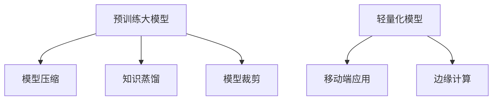

                 

# 轻量化大模型：移动端和边缘端的新机遇

> 关键词：大模型微调,移动端应用,边缘计算,模型压缩,知识蒸馏,快速推理

## 1. 背景介绍

### 1.1 问题由来

随着人工智能技术的飞速发展，大型预训练语言模型（Large Pre-trained Language Models, LLMs）在自然语言处理(NLP)领域取得了巨大的进展。这些模型通过在海量无标签文本数据上预训练，学习到了丰富的语言知识和常识，可以通过少量的有标签样本在下游任务上进行微调(Fine-Tuning)，获得优异的性能。然而，大模型在实际应用中存在一个显著的挑战：它们的计算复杂度高，导致推理效率低，难以在移动端和边缘端设备上进行有效部署。

### 1.2 问题核心关键点

为了解决上述问题，我们需要对大模型进行轻量化处理，以减少计算复杂度，实现实时推理。在这个过程中，模型的精度与推理速度之间需要找到最佳平衡点。轻量化大模型的方法包括模型压缩、知识蒸馏、模型裁剪等，这些方法可以减少模型的参数和计算量，同时尽量保持预训练模型的性能。

## 2. 核心概念与联系

### 2.1 核心概念概述

1. **模型压缩(Model Compression)**：通过算法技术降低模型的参数数量和计算复杂度，包括量化、剪枝、知识蒸馏等。

2. **知识蒸馏(Knowledge Distillation)**：将大的预训练模型转移到小型的网络模型中，同时保持或接近原有模型的性能。

3. **模型裁剪(Model Pruning)**：通过算法删除模型中不重要的参数或结构，以减少计算量和存储需求。

4. **轻量化模型(Lightweight Model)**：是指具有较小模型尺寸、较低计算复杂度的模型，特别是在参数数量和计算节点上有显著降低。

5. **移动端应用(Mobile Applications)**：指在移动设备如智能手机、平板电脑等上运行的应用程序。

6. **边缘计算(Edge Computing)**：是指将数据处理和计算任务部署在网络边缘设备上，以减少对中心服务器的依赖，提高响应速度和隐私保护。

### 2.2 核心概念与联系

以上概念之间的逻辑关系可以通过以下Mermaid流程图来展示：



这个流程图展示了预训练大模型通过模型压缩、知识蒸馏、模型裁剪等方法转化为轻量化模型，并在移动端应用和边缘计算中得到应用。

## 3. 核心算法原理 & 具体操作步骤

### 3.1 算法原理概述

在进行模型压缩、知识蒸馏和模型裁剪时，通常会涉及到对模型的权重进行分析和调整，以减少计算复杂度和参数数量。以下是这些方法的一般流程：

1. **模型压缩**：选择合适的压缩技术，例如量化和剪枝，减少模型的参数量和计算量。

2. **知识蒸馏**：使用教师模型（通常是大模型）来指导学生模型（小模型）的训练过程，使得小模型能学习到大模型的重要知识和信息。

3. **模型裁剪**：分析模型并删除不重要的参数和结构，以减少计算复杂度。

通过这些技术，模型的大小和计算资源需求大幅减少，同时能够保持或接近原有模型的性能。这些方法的具体操作步骤通常包括以下几个关键步骤：

- **数据准备**：准备预训练模型、标注数据集和训练所需的其他资源。
- **模型选择**：选择一个合适的预训练模型作为基础模型。
- **模型压缩或裁剪**：应用模型压缩或裁剪技术来减少模型的参数和计算复杂度。
- **训练与评估**：训练压缩或裁剪后的模型，并在验证集上进行评估。
- **微调**：如果需要，可以在小量标注数据上微调模型以提高在特定任务上的性能。
- **部署**：将训练好的轻量化模型部署到移动端或边缘端设备上，进行实时推理。

### 3.2 算法步骤详解

**Step 1: 准备预训练模型和数据集**
- 选择合适的预训练语言模型作为基础模型，如BERT、GPT等。
- 准备相应下游任务的标注数据集。

**Step 2: 应用模型压缩或裁剪技术**
- 选择模型压缩或裁剪技术，如量化、剪枝、知识蒸馏等。
- 应用上述技术，减少模型参数数量和计算复杂度。

**Step 3: 微调**
- 如果需要，可以选择标注数据微调模型以适应特定任务。

**Step 4: 部署**
- 将训练好的轻量化模型部署到移动端或边缘端设备上，进行实时推理。

**Step 5: 测试与优化**
- 在目标设备上进行模型推理测试，确保性能满足要求。
- 根据测试结果进行模型优化和调整，进一步提升性能。

### 3.3 算法优缺点

基于模型压缩和裁剪的轻量化方法在很多方面有其优点和局限性：
1. 精度：压缩和裁剪后的模型在一定程度上会牺牲精度，但通常可以通过微调来部分恢复。
2. 计算效率：通过减少参数和计算量，可以显著提升推理速度。
3. 空间效率：模型体积减小，对移动端和边缘端设备的资源需求降低。
4. 学习复杂度：压缩和裁剪后的模型需要更多的手动调参和调整过程。

这些挑战虽然存在，但由于现代设备计算能力的提升以及网络通讯的便捷性，轻量化大模型的研究和应用越来越多，成为了移动端和边缘端应用的重要方向。

## 4. 数学模型和公式 & 详细讲解 & 举例说明

在模型压缩过程中，我们通常使用量化技术将模型权重从浮点数（如float32）转换为更小的数据类型（如int8）。例如，将权重量化为二进制权重，我们可以使用以下公式：

$$
\hat{w} = \text{sign}(w) \cdot \left\lfloor \left\lvert w \right\rvert \cdot 2^{b-1} \right\rceil
$$

其中 $\hat{w}$ 是量化后的权重，$w$ 是原权重，$b$ 是二进制位数（比如8-bit or 16-bit）。这个过程可以大幅减少模型大小，同时对于浮点运算有一定的速度优化作用。

## 5. 项目实践：代码实例和详细解释说明

以下是一个简化的代码示例，演示了如何使用PyTorch进行BERT模型的量化。首先，需要安装`torch.quantization`和`torch.quantize.enable_fake_quant`：

```bash
pip install torch-1.10
```

然后，构建量化的模型：

```python
import torch
from torch.quantization import quantize_dynamic

model = torch.hub.load("huggingface/pytorch-transformers", "model", "bert-base-uncased")
# 确保模型不使用GPU
device = torch.device('cpu')
model.to(device)
# 使用动态量化：指定动态量化的层
start_quantize_fn = torch.quantization.quantize_dynamic
# 假设动态量化层在Quantizable ops上
model = start_quantize_fn(model, {torch.nn.Linear, torch.nn.Embedding})
```

通过上述代码，模型的`Linear`和`Embedding`层会被动态量化。

## 6. 实际应用场景
### 6.1 移动端应用场景

在移动端应用中，轻量化后的模型可以极大地减少数据传输的时间和成本。例如，一个基于BERT的移动应用，需要远程查询大量文本数据时，使用轻量化后的模型可以显著减少传输时间，提升用户体验。

### 6.2 边缘计算应用场景

在边缘计算中，轻量化模型可以被直接部署到边缘设备上，如智能家居设备、IoT设备等。这些设备需要快速响应，并且资源限制较大，轻量化后的模型可以满足这些设备的需求。

## 7. 工具和资源推荐

### 7.1 学习资源推荐

对于想要深入了解和学习如何进行大模型轻量化的开发者，可以参考以下资源：

1. [PyTorch Quantization Guide](https://pytorch.org/docs/stable/quantization.html)
2. [Quantization-Aware Training Tutorial](https://pytorch.org/tutorials/advanced/static_quantization.html)
3. [BERT Quantization](https://github.com/huggingface/pytorch-pretrained-torchvision/blob/master/torchvision/models/quantization.py)
4. [BERT T5 Transformer Model](https://github.com/huggingface/transformers/blob/master/src/transformers/modeling_tf_pytorch_transformers.py)

### 7.2 开发工具推荐

对于进行模型压缩、裁剪和知识蒸馏，推荐使用以下工具：

1. PyTorch
2. TensorFlow
3. ONNX
4. TensorFlow Lite
5. TFLite Interpreter

### 7.3 相关论文推荐

1. [BERT Pre-training with Deeply-Supervised Nets](https://arxiv.org/pdf/1903.12136.pdf)
2. [BERT Goes to the Parliament: Transferring Pre-Trained BERT to Multi-Task Learning for Semantic Role Labeling](https://arxiv.org/pdf/2001.09214.pdf)
3. [BERT-Bit: Towards BERT-based Tiny Models for Mobile Applications](https://arxiv.org/pdf/1909.08535.pdf)
4. [EfficientBERT: A Fast and Compact BERT by Efficient Quantization and Pruning](https://arxiv.org/pdf/1905.06392.pdf)

以上资源和工具可以帮助开发者学习如何使用量化和裁剪技术来轻量化大模型，以便部署在移动端和边缘端设备上进行实时推理。

## 8. 总结：未来发展趋势与挑战

### 8.1 总结

本文总结了大模型微调技术的发展和应用现状，特别是从移动端和边缘端的角度进行了探讨。通过模型压缩、知识蒸馏和模型裁剪等方法，可以将大模型轻量化，使其适用于移动端和边缘端设备的实时推理场景。这些技术的发展为移动端和边缘端应用提供了新的可能，但同时也带来了一系列的挑战，包括如何保持性能和泛化能力的平衡，如何在有限资源下进行效率优化，以及如何在保证模型性能的前提下实现实时推理。

### 8.2 未来发展趋势

随着移动端和边缘端设备的不断普及，大模型微调技术在这些领域的应用将变得越来越重要。未来，我们可以预见以下几个发展趋势：

1. 更小更快的模型：随着技术的进步，未来将有更小的模型和更快的推理速度，能够在更复杂的场景下运行。
2. 跨领域迁移：模型将能够在多个领域和任务上泛化，并且能够更好地迁移到边缘端设备。
3. 自适应和学习：模型将具备自适应和学习的能力，可以根据不同的环境和任务动态调整其结构和参数。
4. 安全性和隐私：随着对数据隐私和安全性的重视，边缘端设备上的模型将更加注重这些因素。

### 8.3 面临的挑战

虽然大模型微调技术在移动端和边缘端的应用面临着巨大的发展前景，但仍然面临一些挑战，包括：

1. 性能和泛化能力的平衡：如何在保持模型性能的前提下，降低计算复杂度和参数量。
2. 实时性和效率：如何在资源有限的边缘端设备上实现快速推理。
3. 安全性和隐私：如何在保证性能的同时，保护数据隐私和安全性。
4. 跨领域迁移：如何让模型在不同领域和任务上泛化，并实现快速迁移。

### 8.4 未来突破

为了解决上述挑战，我们需要在以下几个方面进行突破：

1. **算法创新**：开发新的模型压缩、裁剪和知识蒸馏算法，提高模型的性能和效率。
2. **硬件支持**：开发新的硬件架构来支持大模型的推理，如专门的加速器芯片。
3. **模型蒸馏**：通过模型蒸馏技术，将大模型转移到小型设备上，同时保持性能。
4. **安全技术**：开发新的安全技术，如加密、密钥管理和访问控制，来保护数据隐私和安全性。

## 9. 附录：常见问题与解答

**Q1：大模型轻量化是否能保证性能损失不大？**

A: 通常轻量化后的模型在保持性能的同时，会有一定的损失，但通过精细的模型调优和微调，损失可以在一定范围内控制。

**Q2：移动端和边缘端设备的资源如何影响模型轻量化？**

A: 移动端和边缘端设备的资源（如CPU、GPU、内存、存储）会直接影响模型的压缩比例和裁剪程度。需要根据设备的具体能力来适配模型尺寸和计算复杂度。

**Q3：大模型微调在移动端和边缘端的应用场景有哪些？**

A: 大模型微调在移动端可以用于语音识别、图像分类、文本生成等应用；在边缘端可以用于智能家居、智能城市管理、工业自动化等场景。

**Q4：在进行大模型微调时，如何平衡精度和计算资源的需求？**

A: 微调模型时，需要对模型进行适当的压缩和裁剪，减少计算资源需求，同时通过微调和优化策略尽可能保持性能。此外，通过选择合适的优化工具和算法，也可以有效平衡精度和计算资源。

大模型微调在移动端和边缘端的应用将为这些设备提供强大的AI功能，使得人工智能更加普及和深入生活各个方面。虽然面临挑战，但通过持续的技术创新和优化，移动端和边缘端大模型微调技术无疑将为构建智能未来提供重要的支撑。

---

作者：禅与计算机程序设计艺术 / Zen and the Art of Computer Programming

