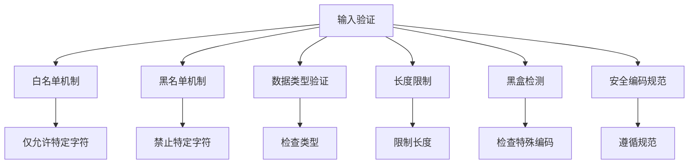

                 

## 1. 背景介绍

在现代信息系统中，输入验证是确保系统安全性和稳定性的第一道防线。然而，由于网络攻击手段的多样化和复杂化，输入验证工作变得越来越复杂。在各类输入验证方法中，防止注入攻击是一个极具挑战性但也至关重要的问题。

### 1.1 问题由来

在实际开发中，攻击者常常利用各种漏洞，通过输入恶意代码或数据，达到控制程序流程、窃取敏感信息等目的。其中，注入攻击（Injection Attack）是最常见、危害极大的一种。

注入攻击包括SQL注入、OS命令注入、XPath注入等类型。攻击者通过在输入字段中注入恶意代码，从而触发程序执行非法操作，如删除数据库记录、执行系统命令等。因此，做好输入验证工作，防止注入攻击变得尤为重要。

### 1.2 问题核心关键点

为了防止注入攻击，输入验证的工作主要包括以下几个方面：

- **数据类型验证**：检查输入数据的类型是否符合预期，如字符串、整数、日期等。
- **长度限制**：限制输入数据的长度，避免缓冲区溢出等安全问题。
- **白名单机制**：仅允许特定字符或字符串输入，禁止危险字符或字符串。
- **黑盒检测**：检查输入数据是否包含非法编码、特殊字符等，防止被攻击者利用。
- **安全编码规范**：遵循安全编码规范，如OWASP Top 10等，确保开发过程中的安全性。

本文将详细介绍防止注入攻击的输入验证方法，重点解析其核心概念、算法原理、具体操作步骤，并通过实际案例展示如何高效实现输入验证。

## 2. 核心概念与联系

### 2.1 核心概念概述

为更好地理解输入验证的原理和应用，本节将介绍几个核心概念及其关系：

- **输入验证**：指对用户输入数据进行合法性检查的过程，防止恶意输入对系统造成破坏。
- **注入攻击**：通过在输入中注入恶意代码，使程序执行非法操作的一种攻击方式。
- **白名单机制**：仅允许特定字符或字符串输入，如只允许ASCII字符。
- **黑名单机制**：禁止特定字符或字符串输入，如禁止SQL注入攻击的'、"等特殊字符。
- **安全编码规范**：如OWASP Top 10，提供了一套公认的安全编码标准和最佳实践。

这些概念之间的联系通过以下Mermaid流程图来展示：



这个流程图展示了输入验证的各个核心概念及其相互关系：

1. 输入验证通过白名单和黑名单机制对输入数据进行过滤。
2. 数据类型验证和长度限制是对输入数据的常规检查。
3. 黑盒检测针对特定类型的注入攻击进行专门防护。
4. 安全编码规范提供了一系列通用的安全措施，指导开发者编写安全的代码。

## 3. 核心算法原理 & 具体操作步骤
### 3.1 算法原理概述

输入验证的核心算法原理主要是对输入数据进行严格筛选，确保数据符合预期的格式和内容。具体来说，可以分为以下几个步骤：

1. **数据类型验证**：判断输入数据的类型是否正确，如检查是否是整数、字符串、日期等。
2. **长度限制**：检查输入数据是否在预设的范围内，避免缓冲区溢出等安全问题。
3. **白名单机制**：仅允许特定字符或字符串输入，禁止危险字符或字符串。
4. **黑名单机制**：检查输入数据是否包含非法编码、特殊字符等，防止被攻击者利用。
5. **黑盒检测**：使用静态或动态分析方法，检测输入数据中可能包含的恶意代码或攻击模式。

这些步骤可以通过编程实现，利用函数和工具对输入数据进行过滤和验证。

### 3.2 算法步骤详解

#### 3.2.1 数据类型验证

数据类型验证是通过检查输入数据是否符合预期的数据类型来防止注入攻击的一种方式。以下是Python代码示例：

```python
def is_integer(value):
    try:
        int(value)
        return True
    except ValueError:
        return False

def is_string(value):
    try:
        str(value)
        return True
    except ValueError:
        return False

# 测试
print(is_integer('123'))  # True
print(is_integer('abc'))  # False
print(is_string('Hello, world!'))  # True
print(is_string(123))  # False
```

该示例定义了两个函数 `is_integer` 和 `is_string`，用于检查输入数据的类型。如果输入数据可以转换为整数或字符串，则返回True；否则返回False。

#### 3.2.2 长度限制

长度限制是通过检查输入数据的长度是否在预设的范围内来防止缓冲区溢出等安全问题。以下是Python代码示例：

```python
def is_length_valid(value, min_length=0, max_length=None):
    if min_length is None and max_length is None:
        return True
    elif min_length is not None and max_length is not None:
        return min_length <= len(value) <= max_length
    elif min_length is not None:
        return len(value) >= min_length
    elif max_length is not None:
        return len(value) <= max_length

# 测试
print(is_length_valid('abc'))  # True
print(is_length_valid('abcd', min_length=3))  # True
print(is_length_valid('abcdefg', max_length=6))  # False
```

该示例定义了一个函数 `is_length_valid`，用于检查输入数据的长度是否在预设的范围内。如果未设置最小或最大长度，则默认认为长度合法。

#### 3.2.3 白名单机制

白名单机制是通过仅允许特定字符或字符串输入来防止注入攻击的一种方式。以下是Python代码示例：

```python
def is_valid_whitelist(value, whitelist=['A-Za-z0-9']):
    return all(char in whitelist for char in value)

# 测试
print(is_valid_whitelist('Hello123'))  # True
print(is_valid_whitelist('Hello, world!'))  # False
print(is_valid_whitelist('Hello, 你好!'))  # False
```

该示例定义了一个函数 `is_valid_whitelist`，用于检查输入数据是否仅包含白名单中的字符。如果输入数据中包含非白名单字符，则返回False。

#### 3.2.4 黑名单机制

黑名单机制是通过禁止特定字符或字符串输入来防止注入攻击的一种方式。以下是Python代码示例：

```python
def is_valid_blacklist(value, blacklist=['\'', '\"', ';', 'and', 'or']):
    for char in blacklist:
        if char in value:
            return False
    return True

# 测试
print(is_valid_blacklist('Hello, world!'))  # True
print(is_valid_blacklist('Hello; world!'))  # False
print(is_valid_blacklist('Hello, and world!'))  # False
```

该示例定义了一个函数 `is_valid_blacklist`，用于检查输入数据是否包含黑名单中的字符。如果输入数据中包含黑名单中的任意字符，则返回False。

#### 3.2.5 黑盒检测

黑盒检测是通过使用静态或动态分析方法，检测输入数据中可能包含的恶意代码或攻击模式。以下是Python代码示例：

```python
import re

def is_valid_sql(value):
    return not re.search(r'\'|\"|--|\s*;\s*', value)

# 测试
print(is_valid_sql('SELECT * FROM users'))  # False
print(is_valid_sql('SELECT * FROM users WHERE id=123'))  # False
print(is_valid_sql('SELECT * FROM users WHERE id=123;'))  # True
```

该示例定义了一个函数 `is_valid_sql`，用于检查输入数据是否包含SQL注入攻击的特征。如果输入数据中包含SQL注入攻击的特征，则返回False。

### 3.3 算法优缺点

输入验证的算法具有以下优点：

1. **安全性高**：通过严格筛选输入数据，可以有效防止注入攻击等安全威胁。
2. **简单易用**：输入验证的算法实现相对简单，易于理解和应用。
3. **可扩展性强**：可以根据具体需求，灵活调整输入验证的规则。

同时，输入验证的算法也存在以下缺点：

1. **实现复杂**：需要根据不同场景，实现多种输入验证的规则和策略。
2. **可能影响用户体验**：过于严格的输入验证可能会影响用户的使用体验，增加用户输入的复杂度。
3. **需要持续维护**：随着攻击手段的变化，输入验证的规则需要不断更新和调整，增加了维护成本。

尽管存在这些缺点，但输入验证仍是防止注入攻击的关键技术，必须严格执行。

### 3.4 算法应用领域

输入验证的应用领域非常广泛，涵盖了各类信息系统和应用程序。以下是一些典型的应用场景：

- **Web应用**：通过输入验证，防止用户提交的表单数据包含恶意代码或攻击模式。
- **数据库系统**：在数据输入时进行严格的验证，防止SQL注入等攻击。
- **API接口**：对API请求参数进行严格验证，确保输入数据的安全性。
- **电子邮件系统**：对电子邮件内容进行过滤和验证，防止垃圾邮件和钓鱼邮件。
- **社交媒体平台**：对用户发布的内容进行审查，防止恶意内容和攻击行为。

这些应用场景中的输入验证，可以有效保障系统的安全性和稳定性，避免因输入数据不当导致的安全漏洞。

## 4. 数学模型和公式 & 详细讲解 & 举例说明

### 4.1 数学模型构建

输入验证的数学模型主要涉及以下几个方面：

- **布尔逻辑**：用于表示输入数据的合法性。
- **正则表达式**：用于匹配输入数据的格式。
- **集合操作**：用于表示白名单和黑名单中的字符。

以下是一个简单的数学模型构建示例：

1. 定义输入数据的集合为 $X$，其中 $X$ 包含所有可能的输入数据。
2. 定义白名单中的字符集合为 $W$，其中 $W$ 包含允许输入的字符。
3. 定义黑名单中的字符集合为 $B$，其中 $B$ 包含禁止输入的字符。
4. 定义输入验证的布尔函数 $V(x)$，用于判断输入数据 $x$ 是否合法。

形式化地，输入验证的布尔函数可以表示为：

$$
V(x) = \begin{cases}
1, & \text{if } x \in W - B \\
0, & \text{otherwise}
\end{cases}
$$

### 4.2 公式推导过程

以下是输入验证布尔函数的公式推导过程：

1. 假设输入数据 $x$ 为字符串类型，可以表示为 $x = (x_1, x_2, ..., x_n)$，其中 $x_i$ 为字符串中的每个字符。
2. 定义字符集合 $W$ 为白名单中的字符，$B$ 为黑名单中的字符。
3. 输入验证布尔函数 $V(x)$ 可以表示为：

$$
V(x) = \bigwedge_{i=1}^{n} \left( (x_i \in W) \land (x_i \notin B) \right)
$$

其中 $\bigwedge$ 表示逻辑与运算，$(x_i \in W)$ 表示字符 $x_i$ 在白名单中，$(x_i \notin B)$ 表示字符 $x_i$ 不在黑名单中。

### 4.3 案例分析与讲解

#### 4.3.1 数据库输入验证

在数据库系统中，输入验证主要用于防止SQL注入攻击。以下是一个数据库输入验证的Python代码示例：

```python
def validate_database_input(value):
    if is_valid_sql(value):
        return value
    else:
        raise ValueError('Invalid input for database')

# 测试
validate_database_input('SELECT * FROM users WHERE id=123;')  # 抛出异常
```

该示例定义了一个函数 `validate_database_input`，用于验证输入数据是否合法。如果输入数据包含SQL注入攻击的特征，则抛出异常。

#### 4.3.2 Web应用表单验证

在Web应用中，输入验证主要用于表单数据的验证。以下是一个Web应用表单验证的Python代码示例：

```python
def validate_form_input(value):
    if is_valid_whitelist(value, whitelist=['A-Za-z0-9']):
        return value
    else:
        raise ValueError('Invalid input')

# 测试
validate_form_input('Hello123')  # 返回'Hello123'
validate_form_input('Hello, world!')  # 抛出异常
```

该示例定义了一个函数 `validate_form_input`，用于验证输入数据是否符合白名单规则。如果输入数据中包含非白名单字符，则抛出异常。

## 5. 项目实践：代码实例和详细解释说明

### 5.1 开发环境搭建

在进行输入验证的实践前，我们需要准备好开发环境。以下是使用Python进行Web应用的开发环境配置流程：

1. 安装Python：从官网下载并安装Python 3.8以上版本。
2. 安装Flask框架：使用pip安装Flask，这是一个轻量级的Web框架，适合快速开发Web应用。
3. 安装Flask-RESTful：使用pip安装Flask-RESTful，用于处理RESTful API请求。
4. 安装Flask-WTF：使用pip安装Flask-WTF，用于处理表单数据验证。

完成上述步骤后，即可在Python环境中开始输入验证的实践。

### 5.2 源代码详细实现

以下是使用Flask框架进行输入验证的Python代码实现：

```python
from flask import Flask, request, jsonify
from flask_restful import Resource
from flask_wtf import FlaskForm, InputRequired
from wtforms.validators import DataRequired, Length, NumberRange, Regexp
from wtforms import StringField

app = Flask(__name__)
app.config['SECRET_KEY'] = 'your_secret_key'

class ValidateForm(FlaskForm):
    name = StringField('Name', validators=[InputRequired(), Length(min=3, max=20), Regexp(r'^[A-Za-z]+$')])
    age = StringField('Age', validators=[InputRequired(), NumberRange(min=18, max=99, message='Age must be between 18 and 99')])

@app.route('/validate', methods=['POST'])
def validate():
    form = ValidateForm(request.form)
    if form.validate():
        name = form.name.data
        age = form.age.data
        return jsonify({'name': name, 'age': age})
    else:
        return jsonify({'error': form.errors}), 400

if __name__ == '__main__':
    app.run(debug=True)
```

该代码定义了一个Flask应用，其中包含了输入验证功能。在`ValidateForm`类中，定义了`name`和`age`两个字段，并设置了验证规则。在`validate`函数中，使用`ValidateForm`类验证输入数据，如果验证通过，则返回JSON格式的响应；否则返回错误信息。

### 5.3 代码解读与分析

让我们再详细解读一下关键代码的实现细节：

**FlaskForm类**：
- `__init__`方法：初始化表单字段，并设置验证规则。
- `__call__`方法：在请求提交时，执行表单验证。

**Flask应用**：
- 使用`@app.route`装饰器，定义API接口的路由。
- 在`validate`函数中，使用`ValidateForm`类验证表单数据，返回JSON格式的响应。

**表单字段**：
- `name`字段：使用`StringField`类型，并设置输入要求、长度限制和正则表达式验证。
- `age`字段：使用`StringField`类型，并设置输入要求、数字范围验证。

该代码展示了如何使用Flask框架进行输入验证。开发者可以根据实际需求，灵活定制表单字段和验证规则。

### 5.4 运行结果展示

启动Flask应用，使用Postman等工具测试API接口：

- 输入合法数据：
  ```json
  {
    "name": "John",
    "age": "25"
  }
  ```
  返回JSON格式的响应：

  ```json
  {
    "name": "John",
    "age": 25
  }
  ```

- 输入非法数据：
  ```json
  {
    "name": "John Doe",
    "age": "123"
  }
  ```
  返回JSON格式的错误响应：

  ```json
  {
    "error": {
      "name": ["Name must be between 3 and 20 characters long."],
      "age": ["Age must be between 18 and 99."]
    }
  }
  ```

通过上述代码和测试结果，可以看到输入验证的实现和效果。开发者可以根据具体需求，进一步扩展和优化输入验证的功能。

## 6. 实际应用场景

### 6.1 安全登录系统

在安全登录系统中，输入验证是防止SQL注入攻击和跨站脚本攻击的重要手段。通过输入验证，确保用户提交的用户名和密码符合预设的格式和长度要求，避免恶意输入导致的安全问题。

### 6.2 金融交易系统

在金融交易系统中，输入验证可以防止用户提交非法金额、非法字符等数据，保障交易的安全性。通过输入验证，确保输入数据符合预设的格式和范围，避免因输入数据不当导致的交易纠纷。

### 6.3 电子邮件系统

在电子邮件系统中，输入验证可以防止用户提交非法字符、非法编码等数据，防止恶意内容和垃圾邮件的发送。通过输入验证，确保用户输入的内容符合预设的格式和规则，避免因输入数据不当导致的邮件发送失败或滥发。

### 6.4 未来应用展望

随着人工智能和大数据技术的不断发展，输入验证的应用场景将会更加广泛和多样化。未来，输入验证将与更多先进技术相结合，如机器学习、区块链等，提升系统的安全性和可靠性。

- **机器学习**：通过机器学习算法对输入数据进行分析和分类，识别出潜在的攻击行为，提高输入验证的智能化水平。
- **区块链技术**：利用区块链技术对输入数据进行分布式验证和存储，确保输入数据的完整性和不可篡改性，提升系统的安全性和可信任度。
- **智能合约**：利用智能合约技术对输入数据进行自动验证和执行，确保输入数据符合预设规则，提升系统的自动化和智能化水平。

这些技术的应用，将进一步提升输入验证的效率和效果，为信息系统的安全性和可靠性提供有力保障。

## 7. 工具和资源推荐

### 7.1 学习资源推荐

为了帮助开发者系统掌握输入验证的理论基础和实践技巧，这里推荐一些优质的学习资源：

1. **OWASP Top 10**：OWASP Top 10是一份权威的安全漏洞指南，详细介绍了常见的安全威胁和防护措施。
2. **Flask官方文档**：Flask官方文档提供了详细的Web应用开发指南，包括表单验证、RESTful API等。
3. **Flask-WTF官方文档**：Flask-WTF官方文档介绍了使用Flask框架进行表单验证的详细方法。
4. **Flask-RESTful官方文档**：Flask-RESTful官方文档介绍了使用Flask框架处理RESTful API请求的详细方法。
5. **Python语言标准库**：Python标准库提供了丰富的字符串操作和正则表达式库，方便开发者进行输入验证。

通过对这些资源的学习实践，相信你一定能够快速掌握输入验证的精髓，并用于解决实际的Web应用问题。

### 7.2 开发工具推荐

高效的开发离不开优秀的工具支持。以下是几款用于Web应用开发的常用工具：

1. **Postman**：Postman是一个功能强大的API测试工具，可以方便地进行API请求测试和数据分析。
2. **Jupyter Notebook**：Jupyter Notebook是一个交互式开发环境，可以方便地进行数据处理和代码调试。
3. **Git**：Git是一个版本控制系统，方便开发者进行代码管理和版本控制。
4. **Docker**：Docker是一个容器化平台，方便开发者进行环境搭建和容器化部署。
5. **TensorFlow**：TensorFlow是一个开源的机器学习框架，方便开发者进行模型训练和推理。

合理利用这些工具，可以显著提升Web应用开发的效率和质量，加快创新迭代的步伐。

### 7.3 相关论文推荐

输入验证的研究源于学界的持续研究。以下是几篇奠基性的相关论文，推荐阅读：

1. **SQL注入攻击防范技术研究**：论文详细介绍了SQL注入攻击的原理和防范方法，包括输入验证、参数化查询等技术。
2. **Web应用的安全性分析**：论文分析了Web应用中常见的安全漏洞，并提出了具体的防范措施。
3. **输入验证的安全性评估**：论文通过实验评估了不同输入验证方法的效果，提出了一些改进建议。
4. **机器学习在输入验证中的应用**：论文探讨了机器学习技术在输入验证中的应用，如异常检测、分类识别等。
5. **区块链在输入验证中的应用**：论文介绍了区块链技术在输入验证中的应用，如智能合约、分布式验证等。

这些论文代表了大规模语言模型微调技术的发展脉络。通过学习这些前沿成果，可以帮助研究者把握学科前进方向，激发更多的创新灵感。

## 8. 总结：未来发展趋势与挑战

### 8.1 总结

本文对输入验证技术进行了全面系统的介绍。首先阐述了输入验证的工作原理和重要性，明确了输入验证在防止注入攻击中的关键作用。其次，从原理到实践，详细讲解了输入验证的核心概念和操作步骤，并通过实际案例展示如何高效实现输入验证。

通过本文的系统梳理，可以看到，输入验证技术在保障信息系统的安全性和稳定性方面具有重要意义。开发者可以根据具体需求，灵活运用输入验证技术，提升系统的安全性和可靠性。

### 8.2 未来发展趋势

展望未来，输入验证技术将呈现以下几个发展趋势：

1. **智能化水平提升**：通过引入机器学习算法，提升输入验证的智能化水平，自动检测输入数据中的潜在威胁，提供更精准的防护措施。
2. **自动化程度提高**：通过自动化工具和平台，提高输入验证的效率和效果，减少人工干预和维护成本。
3. **跨领域应用拓展**：输入验证技术将更多地应用于不同领域，如金融、医疗、物联网等，提供更加全面的安全保障。
4. **多模态数据融合**：输入验证技术将更多地融合多模态数据，提升系统的综合防护能力，如结合文本、语音、图像等多种数据类型进行验证。
5. **区块链技术结合**：通过区块链技术对输入数据进行分布式验证和存储，提升输入验证的可靠性和安全性。

这些趋势凸显了输入验证技术的广阔前景。这些方向的探索发展，将进一步提升信息系统的安全性和可靠性，为信息社会的稳定和高效运行提供有力保障。

### 8.3 面临的挑战

尽管输入验证技术已经取得了瞩目成就，但在迈向更加智能化、普适化应用的过程中，它仍面临诸多挑战：

1. **攻击手段不断演变**：攻击者不断开发新的攻击手段，输入验证技术需要不断更新和升级，才能有效应对新威胁。
2. **用户行为复杂多样**：用户输入的行为复杂多样，输入验证需要考虑各种情况，增加了实现难度。
3. **误报率问题**：输入验证可能会出现误报，将合法输入错误地识别为非法输入，影响用户体验。
4. **资源消耗高**：输入验证的实现往往需要消耗大量的计算资源，增加了系统的负担。
5. **可扩展性差**：输入验证的规则和策略需要根据不同的应用场景进行调整，增加了维护成本。

尽管存在这些挑战，但输入验证仍是防止注入攻击的重要手段，必须严格执行。

### 8.4 研究展望

面对输入验证面临的挑战，未来的研究需要在以下几个方面寻求新的突破：

1. **引入机器学习算法**：通过机器学习算法对输入数据进行分析和分类，提升输入验证的智能化水平，减少人工干预和维护成本。
2. **优化验证算法**：通过优化验证算法，提高输入验证的效率和准确性，降低误报率和资源消耗。
3. **多模态数据融合**：将文本、语音、图像等多种数据类型融合到输入验证中，提升系统的综合防护能力。
4. **分布式验证机制**：利用区块链技术对输入数据进行分布式验证和存储，提高输入验证的可靠性和安全性。
5. **用户行为分析**：通过用户行为分析，提升输入验证的智能化水平，自动检测和过滤异常输入，提升用户体验。

这些研究方向将引领输入验证技术迈向更高的台阶，为构建安全、可靠、可控的信息系统提供有力保障。面向未来，输入验证技术还需要与其他人工智能技术进行更深入的融合，如知识表示、因果推理、强化学习等，多路径协同发力，共同推动信息系统的安全性和可靠性进步。

## 9. 附录：常见问题与解答

**Q1：输入验证的目的是什么？**

A: 输入验证的目的是防止用户提交的输入数据中包含恶意代码或攻击模式，保障信息系统的安全性和稳定性。

**Q2：输入验证的实现过程是怎样的？**

A: 输入验证的实现过程主要包括以下几个步骤：数据类型验证、长度限制、白名单机制、黑名单机制、黑盒检测。

**Q3：输入验证的优缺点是什么？**

A: 输入验证的优点是安全性高、简单易用、可扩展性强。缺点是实现复杂、可能影响用户体验、需要持续维护。

**Q4：输入验证在实际应用中有哪些场景？**

A: 输入验证在实际应用中有多种场景，如Web应用表单验证、数据库输入验证、API接口验证等。

**Q5：如何提升输入验证的智能化水平？**

A: 通过引入机器学习算法，自动检测输入数据中的潜在威胁，提供更精准的防护措施。

以上是对输入验证技术的全面介绍和深入分析。通过本文的学习和实践，相信你能够更好地掌握输入验证的技术要点，提升信息系统的安全性和稳定性。

---

作者：禅与计算机程序设计艺术 / Zen and the Art of Computer Programming

